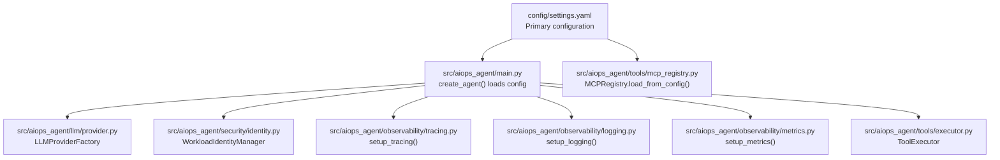
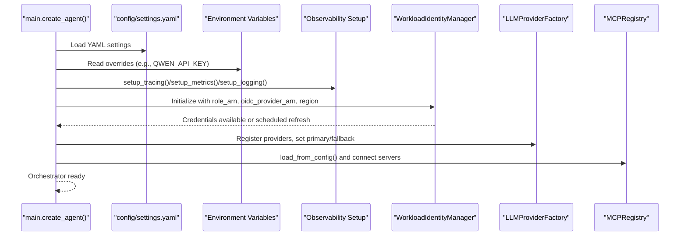
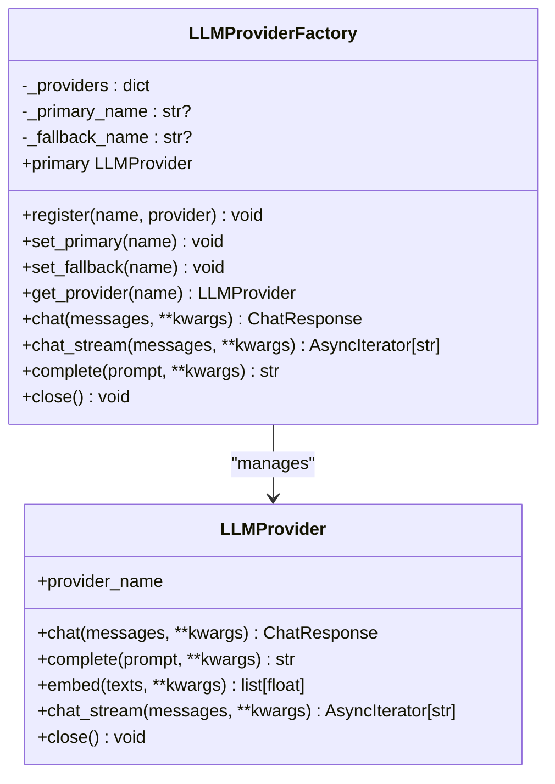
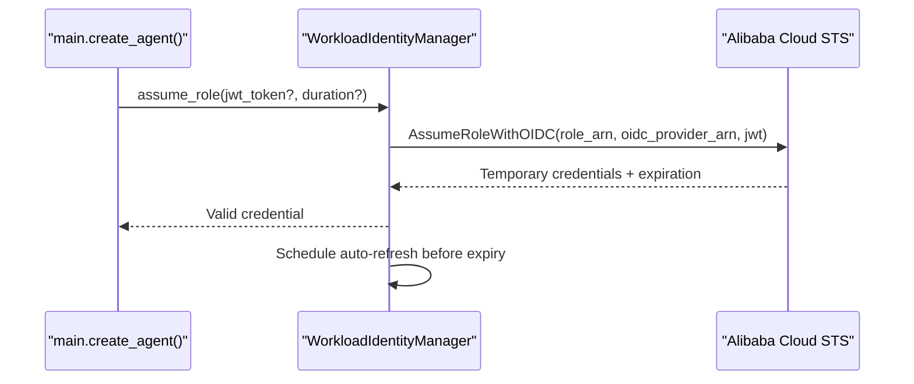
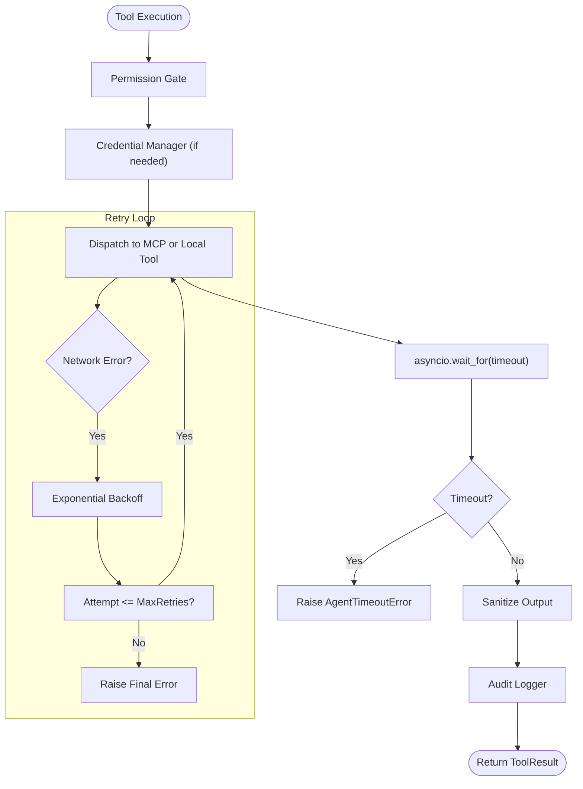
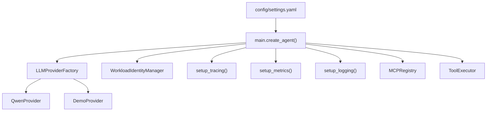

# Application Settings

<cite>
**Referenced Files in This Document**
- [settings.yaml](file://config/settings.yaml)
- [main.py](file://src/aiops_agent/main.py)
- [provider.py](file://src/aiops_agent/llm/provider.py)
- [identity.py](file://src/aiops_agent/security/identity.py)
- [tracing.py](file://src/aiops_agent/observability/tracing.py)
- [logging.py](file://src/aiops_agent/observability/logging.py)
- [metrics.py](file://src/aiops_agent/observability/metrics.py)
- [schemas.py](file://src/aiops_agent/models/schemas.py)
- [mcp_servers.yaml](file://config/mcp_servers.yaml)
- [mcp_registry.py](file://src/aiops_agent/tools/mcp_registry.py)
- [executor.py](file://src/aiops_agent/tools/executor.py)
- [docker-compose.yaml](file://deploy/docker-compose.yaml)
- [deployment.yaml](file://deploy/k8s/deployment.yaml)
</cite>

## Table of Contents
1. [Introduction](#introduction)
2. [Project Structure](#project-structure)
3. [Core Components](#core-components)
4. [Architecture Overview](#architecture-overview)
5. [Detailed Component Analysis](#detailed-component-analysis)
6. [Dependency Analysis](#dependency-analysis)
7. [Performance Considerations](#performance-considerations)
8. [Troubleshooting Guide](#troubleshooting-guide)
9. [Conclusion](#conclusion)
10. [Appendices](#appendices)

## Introduction
This document provides comprehensive documentation for the AIOps Agent’s main application settings configuration. It explains the YAML structure, all configuration options, environment variable overrides, validation rules, and operational guidance for production deployments. It covers LLM provider settings (primary and fallback), agent identity configuration for Alibaba Cloud RAM OIDC workloads, timeout and retry policies, orchestrator settings, observability configuration (tracing, metrics, logging), and data residency restrictions. Practical examples and troubleshooting guidance are included to help operators configure and run the Agent reliably.

## Project Structure
The configuration system centers around a single YAML file that defines runtime behavior. Supporting components include:
- LLM provider factory and provider implementations
- Workload identity manager for Alibaba Cloud OIDC
- Observability modules for tracing, metrics, and logging
- MCP server registry and tool executor
- Environment variable overrides and deployment manifests

**Diagram sources**
- [settings.yaml:1-85](file://config/settings.yaml#L1-L85)
- [main.py:70-222](file://src/aiops_agent/main.py#L70-L222)
- [provider.py:97-242](file://src/aiops_agent/llm/provider.py#L97-L242)
- [identity.py:38-247](file://src/aiops_agent/security/identity.py#L38-L247)
- [tracing.py:32-87](file://src/aiops_agent/observability/tracing.py#L32-L87)
- [logging.py:60-111](file://src/aiops_agent/observability/logging.py#L60-L111)
- [metrics.py:108-150](file://src/aiops_agent/observability/metrics.py#L108-L150)
- [mcp_registry.py:122-153](file://src/aiops_agent/tools/mcp_registry.py#L122-L153)
- [executor.py:80-314](file://src/aiops_agent/tools/executor.py#L80-L314)

**Section sources**
- [settings.yaml:1-85](file://config/settings.yaml#L1-L85)
- [main.py:48-83](file://src/aiops_agent/main.py#L48-L83)
- [mcp_servers.yaml:1-41](file://config/mcp_servers.yaml#L1-L41)

## Core Components
This section documents the YAML configuration structure and environment variable overrides that drive Agent behavior.

- LLM providers
  - Primary and fallback provider selection
  - Per-provider model, API base URL, max tokens, temperature, and timeout
  - Provider registration and switching logic

- Agent identity (Alibaba Cloud RAM OIDC)
  - Role ARN and OIDC provider ARN
  - Region, session name, and token refresh behavior
  - Environment variable overrides for role ARN, OIDC provider ARN, and token

- Timeouts
  - Tool execution timeout
  - Skill execution timeout
  - Session idle timeout

- Retry policy
  - Maximum retries
  - Base and maximum delay for exponential backoff

- Orchestrator settings
  - Max parallel subtasks
  - Skill health check interval
  - Skill failure threshold

- Observability
  - Tracing: enable/disable, exporter type, SLS endpoint/project/logstore
  - Metrics: enable/disable, export interval
  - Logging: level, format, SLS enablement

- Data residency
  - Allowed regions list

- MCP servers
  - Transport type, command/args for stdio, or URL for SSE
  - Environment variables passed to MCP processes
  - Enable/disable flag

**Section sources**
- [settings.yaml:4-26](file://config/settings.yaml#L4-L26)
- [settings.yaml:27-42](file://config/settings.yaml#L27-L42)
- [settings.yaml:43-48](file://config/settings.yaml#L43-L48)
- [settings.yaml:49-55](file://config/settings.yaml#L49-L55)
- [settings.yaml:56-61](file://config/settings.yaml#L56-L61)
- [settings.yaml:62-76](file://config/settings.yaml#L62-L76)
- [settings.yaml:78-85](file://config/settings.yaml#L78-L85)
- [mcp_servers.yaml:3-41](file://config/mcp_servers.yaml#L3-L41)

## Architecture Overview
The Agent initializes components based on configuration and environment variables. The LLM provider factory registers providers and sets primary/fallback based on environment variables. Workload identity is initialized using OIDC, and observability is configured early in startup. MCP servers are loaded from configuration and connected dynamically.

**Diagram sources**
- [main.py:70-222](file://src/aiops_agent/main.py#L70-L222)
- [settings.yaml:4-26](file://config/settings.yaml#L4-L26)
- [settings.yaml:27-42](file://config/settings.yaml#L27-L42)
- [tracing.py:32-87](file://src/aiops_agent/observability/tracing.py#L32-L87)
- [logging.py:60-111](file://src/aiops_agent/observability/logging.py#L60-L111)
- [metrics.py:108-150](file://src/aiops_agent/observability/metrics.py#L108-L150)
- [mcp_registry.py:122-153](file://src/aiops_agent/tools/mcp_registry.py#L122-L153)

## Detailed Component Analysis

### YAML Configuration Reference
- llm.primary_provider and llm.fallback_provider
  - Select the primary and fallback LLM backend names
  - Providers are defined under llm.providers with model, api_base, max_tokens, temperature, and timeout_seconds

- llm.providers.<provider>
  - qwen, claude, gpt entries define model, API base URL, token limits, temperature, and per-call timeout

- agent_identity
  - role_arn and oidc_provider_arn: either from YAML or environment variables
  - session_name, region, token_refresh_before_minutes

- timeouts
  - tool_execution_seconds, skill_execution_seconds, session_idle_minutes

- retry
  - max_retries, base_delay_seconds, max_delay_seconds, exponential_base

- orchestrator
  - max_parallel_subtasks, skill_health_check_interval_minutes, skill_failure_threshold

- observability
  - tracing.enabled, tracing.exporter, tracing.sls_endpoint, tracing.sls_project, tracing.sls_logstore
  - metrics.enabled, metrics.export_interval_seconds
  - logging.level, logging.format, logging.sls_enabled

- data_residency.allowed_regions
  - Enforced during startup against agent_identity.region

- mcp_servers.servers.<name>
  - server_name, transport ("stdio"|"sse"), command+args or url, env, enabled

**Section sources**
- [settings.yaml:4-26](file://config/settings.yaml#L4-L26)
- [settings.yaml:27-42](file://config/settings.yaml#L27-L42)
- [settings.yaml:43-48](file://config/settings.yaml#L43-L48)
- [settings.yaml:49-55](file://config/settings.yaml#L49-L55)
- [settings.yaml:56-61](file://config/settings.yaml#L56-L61)
- [settings.yaml:62-76](file://config/settings.yaml#L62-L76)
- [settings.yaml:78-85](file://config/settings.yaml#L78-L85)
- [mcp_servers.yaml:3-41](file://config/mcp_servers.yaml#L3-L41)

### Environment Variable Overrides
- LLM provider selection and credentials
  - QWEN_API_KEY: when present, registers Qwen provider as primary and sets fallback to demo
  - ALIBABA_CLOUD_ROLE_ARN and ALIBABA_CLOUD_OIDC_PROVIDER_ARN: override agent_identity settings
  - ALIBABA_CLOUD_OIDC_TOKEN: optional JWT override for non-Kubernetes environments

- Observability and runtime
  - LOG_LEVEL: overrides logging.level
  - Other environment variables may be used by underlying services (e.g., agent identity endpoint/region)

- Deployment-specific
  - docker-compose.yaml and deployment.yaml show typical environment variable injection for agent identity and logs

**Section sources**
- [main.py:101-108](file://src/aiops_agent/main.py#L101-L108)
- [main.py:184-192](file://src/aiops_agent/main.py#L184-L192)
- [docker-compose.yaml:11-16](file://deploy/docker-compose.yaml#L11-L16)
- [deployment.yaml:23-40](file://deploy/k8s/deployment.yaml#L23-L40)

### Configuration Validation Rules
- Data residency enforcement
  - Startup checks agent_identity.region against data_residency.allowed_regions
  - Exits if region is not allowed

- LLM provider availability
  - If QWEN_API_KEY is absent, demo provider remains primary; real provider registration is conditional

- MCP server configuration
  - load_from_config() reads YAML and skips disabled servers
  - Errors during connection are logged but do not halt startup

- OIDC initialization
  - If role_arn and oidc_provider_arn are missing, initialization is skipped with a warning
  - On failure, a retry is attempted on first tool call

**Section sources**
- [main.py:58-67](file://src/aiops_agent/main.py#L58-L67)
- [main.py:123-139](file://src/aiops_agent/main.py#L123-L139)
- [mcp_registry.py:128-153](file://src/aiops_agent/tools/mcp_registry.py#L128-L153)

### LLM Provider Settings and Behavior
- Factory and fallback logic
  - Primary provider is used first; on failure, fallback is attempted
  - Demo provider is registered by default; Qwen provider is conditionally registered when API key is present

- Per-provider configuration
  - Model, API base URL, max tokens, temperature, and timeout are defined per provider

**Diagram sources**
- [provider.py:31-95](file://src/aiops_agent/llm/provider.py#L31-L95)
- [provider.py:97-242](file://src/aiops_agent/llm/provider.py#L97-L242)

**Section sources**
- [provider.py:97-242](file://src/aiops_agent/llm/provider.py#L97-L242)
- [main.py:176-192](file://src/aiops_agent/main.py#L176-L192)

### Agent Identity Configuration (Alibaba Cloud RAM OIDC)
- Initialization flow
  - Reads role_arn and oidc_provider_arn from config or environment
  - Attempts AssumeRoleWithOIDC using K8s ServiceAccount JWT or provided token
  - Starts automatic refresh before expiration

- Refresh behavior
  - Refreshes credentials before token expiry to avoid downtime

**Diagram sources**
- [main.py:120-139](file://src/aiops_agent/main.py#L120-L139)
- [identity.py:119-173](file://src/aiops_agent/security/identity.py#L119-L173)

**Section sources**
- [main.py:101-118](file://src/aiops_agent/main.py#L101-L118)
- [identity.py:38-247](file://src/aiops_agent/security/identity.py#L38-L247)

### Timeout Policies and Retry Strategies
- Timeouts
  - Tool execution timeout defaults to 120 seconds
  - Skill execution timeout defaults to 300 seconds
  - Session idle timeout defaults to 30 minutes

- Retry policy
  - Up to 3 attempts with exponential backoff (base 2) and capped delay
  - Network errors trigger retries; timeouts raise a dedicated error

- Observability integration
  - Tool execution records duration and status in spans and metrics

**Diagram sources**
- [executor.py:80-201](file://src/aiops_agent/tools/executor.py#L80-L201)
- [executor.py:231-274](file://src/aiops_agent/tools/executor.py#L231-L274)

**Section sources**
- [settings.yaml:43-55](file://config/settings.yaml#L43-L55)
- [executor.py:39-43](file://src/aiops_agent/tools/executor.py#L39-L43)
- [executor.py:231-274](file://src/aiops_agent/tools/executor.py#L231-L274)

### Orchestrator Settings
- Concurrency and health
  - max_parallel_subtasks controls parallelism
  - skill_health_check_interval_minutes schedules periodic checks
  - skill_failure_threshold determines failure thresholds

- Integration with metrics
  - AgentMetrics tracks task counts, durations, permission denials, security events, tool calls, and LLM calls

**Section sources**
- [settings.yaml:56-61](file://config/settings.yaml#L56-L61)
- [metrics.py:26-106](file://src/aiops_agent/observability/metrics.py#L26-L106)

### Observability Configuration
- Tracing
  - Exporter can be console or SLS (OTLP); SLS requires endpoint
  - Decorator supports attaching attributes and recording exceptions

- Metrics
  - MeterProvider with periodic exporting; default export interval aligns with configuration

- Logging
  - JSON formatter integrates trace/span IDs
  - Supports SLS integration hooks

**Section sources**
- [settings.yaml:62-76](file://config/settings.yaml#L62-L76)
- [tracing.py:32-87](file://src/aiops_agent/observability/tracing.py#L32-L87)
- [metrics.py:108-150](file://src/aiops_agent/observability/metrics.py#L108-L150)
- [logging.py:60-111](file://src/aiops_agent/observability/logging.py#L60-L111)

### Data Residency Restrictions
- Allowed regions enforced at startup
- Defaults include cn-hangzhou, cn-shanghai, cn-beijing, cn-shenzhen
- agent_identity.region must be within allowed_regions

**Section sources**
- [main.py:44-45](file://src/aiops_agent/main.py#L44-L45)
- [main.py:58-67](file://src/aiops_agent/main.py#L58-L67)
- [settings.yaml:78-85](file://config/settings.yaml#L78-L85)

### MCP Servers and Tool Execution
- MCP server configuration
  - stdio transport with command/args or SSE transport with URL
  - env variables passed to MCP processes
  - enabled flag controls registration

- Tool execution pipeline
  - Permission gate, credential acquisition, dispatch to MCP/local tool, sanitization, auditing, and tracing

**Section sources**
- [mcp_servers.yaml:3-41](file://config/mcp_servers.yaml#L3-L41)
- [mcp_registry.py:122-153](file://src/aiops_agent/tools/mcp_registry.py#L122-L153)
- [executor.py:80-201](file://src/aiops_agent/tools/executor.py#L80-L201)

## Dependency Analysis
The configuration influences multiple subsystems. The following diagram highlights key dependencies:

**Diagram sources**
- [settings.yaml:1-85](file://config/settings.yaml#L1-L85)
- [main.py:70-222](file://src/aiops_agent/main.py#L70-L222)
- [provider.py:97-242](file://src/aiops_agent/llm/provider.py#L97-L242)
- [identity.py:38-247](file://src/aiops_agent/security/identity.py#L38-L247)
- [tracing.py:32-87](file://src/aiops_agent/observability/tracing.py#L32-L87)
- [metrics.py:108-150](file://src/aiops_agent/observability/metrics.py#L108-L150)
- [logging.py:60-111](file://src/aiops_agent/observability/logging.py#L60-L111)
- [mcp_registry.py:122-153](file://src/aiops_agent/tools/mcp_registry.py#L122-L153)
- [executor.py:80-314](file://src/aiops_agent/tools/executor.py#L80-L314)

**Section sources**
- [settings.yaml:1-85](file://config/settings.yaml#L1-L85)
- [main.py:70-222](file://src/aiops_agent/main.py#L70-L222)

## Performance Considerations
- LLM provider timeouts
  - Tune llm.providers.<provider>.timeout_seconds to match provider latency characteristics
- Retry backoff
  - Adjust retry.max_retries and retry.base_delay_seconds to balance reliability and latency
- Observability overhead
  - Export intervals for metrics and tracing should be tuned for your telemetry backend
- MCP server scaling
  - Use mcp_servers.servers.<name>.env to set region and other environment-specific tuning
- Data residency
  - Keep agent_identity.region aligned with allowed_regions to avoid startup failures

[No sources needed since this section provides general guidance]

## Troubleshooting Guide
- Configuration file not found
  - The loader logs a warning and proceeds with defaults; ensure config/settings.yaml exists in the expected path

- Data residency violation
  - If agent_identity.region is not in data_residency.allowed_regions, startup exits; update either region or allowed regions

- OIDC initialization failures
  - Missing role_arn or oidc_provider_arn triggers a warning; set both or provide ALIBABA_CLOUD_ROLE_ARN and ALIBABA_CLOUD_OIDC_PROVIDER_ARN
  - First tool call attempts OIDC again; ensure K8s ServiceAccount JWT is mounted or provide ALIBABA_CLOUD_OIDC_TOKEN

- LLM provider unavailability
  - Without QWEN_API_KEY, demo provider remains primary; register a real provider by setting the API key environment variable
  - If both primary and fallback fail, a runtime error is raised

- Tool execution timeouts
  - Increase timeouts.tool_execution_seconds or reduce tool complexity
  - Review retry settings if transient network errors occur frequently

- Observability export issues
  - For SLS tracing, ensure sls_endpoint is set; otherwise console exporter is used
  - Verify metrics export interval and console exporter behavior

**Section sources**
- [main.py:48-55](file://src/aiops_agent/main.py#L48-L55)
- [main.py:58-67](file://src/aiops_agent/main.py#L58-L67)
- [main.py:123-139](file://src/aiops_agent/main.py#L123-L139)
- [main.py:184-192](file://src/aiops_agent/main.py#L184-L192)
- [provider.py:147-175](file://src/aiops_agent/llm/provider.py#L147-L175)
- [executor.py:249-254](file://src/aiops_agent/tools/executor.py#L249-L254)
- [tracing.py:64-82](file://src/aiops_agent/observability/tracing.py#L64-L82)

## Conclusion
The AIOps Agent’s configuration system provides a centralized, environment-aware mechanism to control LLM providers, identity, observability, timeouts, retries, orchestrator behavior, and data residency. By combining YAML settings with environment variable overrides, operators can tailor the Agent to diverse production environments while maintaining strong defaults for reliability and security.

[No sources needed since this section summarizes without analyzing specific files]

## Appendices

### Best Practices for Production Deployments
- Set agent_identity.region to a region within data_residency.allowed_regions
- Provide ALIBABA_CLOUD_ROLE_ARN and ALIBABA_CLOUD_OIDC_PROVIDER_ARN via environment variables or config
- Configure QWEN_API_KEY to enable a production-grade provider as primary
- Align observability exporters with your telemetry stack (SLS or console)
- Monitor metrics and traces to tune timeouts and retry parameters
- Use MCP server env to set region and other provider-specific settings

**Section sources**
- [settings.yaml:27-42](file://config/settings.yaml#L27-L42)
- [settings.yaml:78-85](file://config/settings.yaml#L78-L85)
- [settings.yaml:62-76](file://config/settings.yaml#L62-L76)
- [mcp_servers.yaml:10-22](file://config/mcp_servers.yaml#L10-L22)