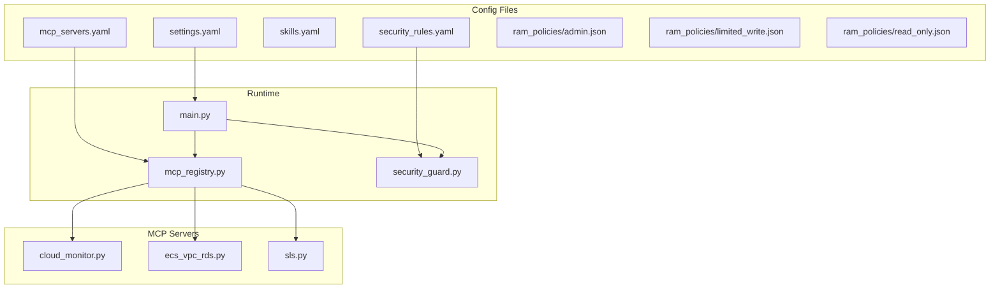
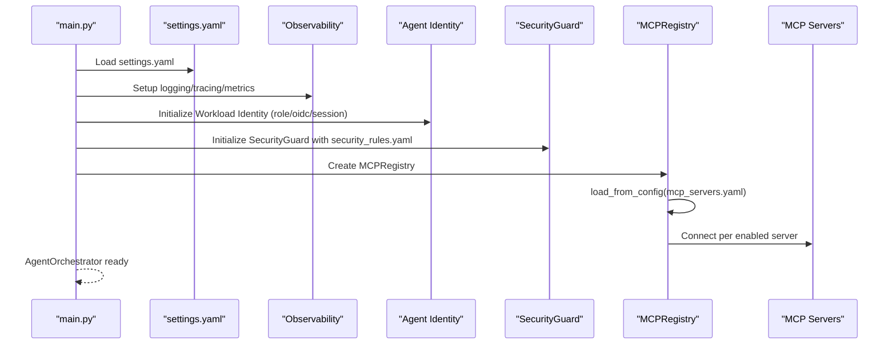
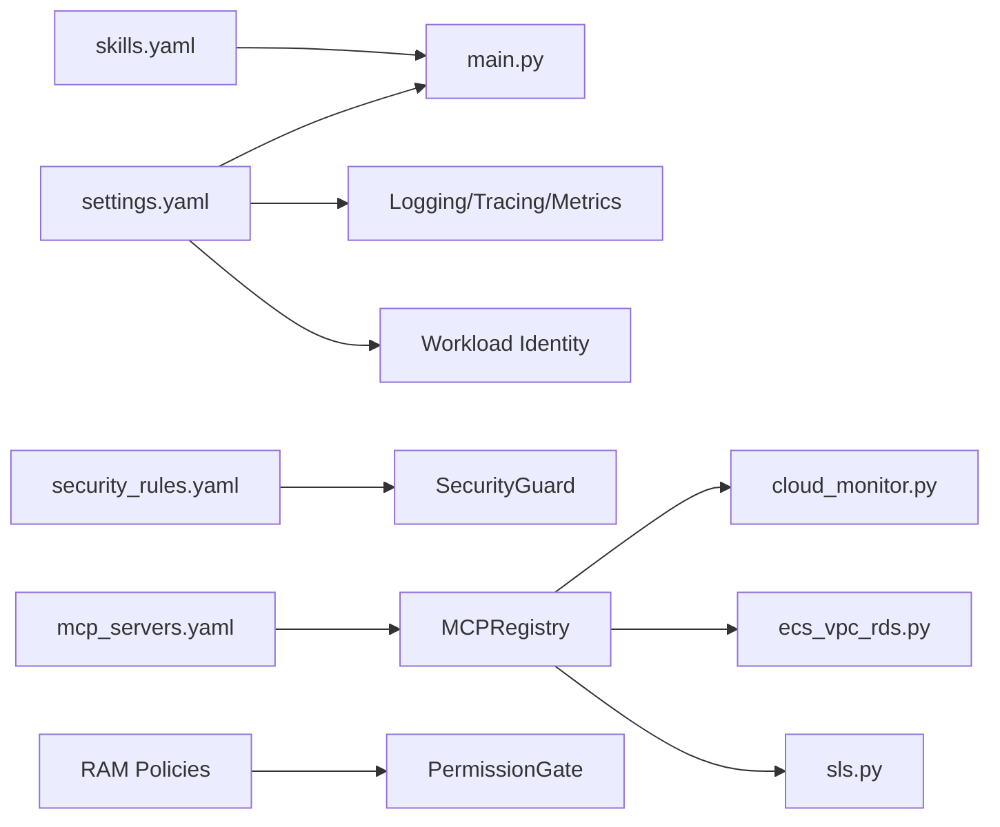

# Configuration Management

<cite>
**Referenced Files in This Document**
- [settings.yaml](file://config/settings.yaml)
- [mcp_servers.yaml](file://config/mcp_servers.yaml)
- [skills.yaml](file://config/skills.yaml)
- [security_rules.yaml](file://config/security_rules.yaml)
- [admin.json](file://config/ram_policies/admin.json)
- [limited_write.json](file://config/ram_policies/limited_write.json)
- [read_only.json](file://config/ram_policies/read_only.json)
- [main.py](file://src/aiops_agent/main.py)
- [mcp_registry.py](file://src/aiops_agent/tools/mcp_registry.py)
- [security_guard.py](file://src/aiops_agent/security/security_guard.py)
- [cloud_monitor.py](file://mcp_servers/cloud_monitor.py)
- [ecs_vpc_rds.py](file://mcp_servers/ecs_vpc_rds.py)
- [sls.py](file://mcp_servers/sls.py)
</cite>

## Table of Contents
1. [Introduction](#introduction)
2. [Project Structure](#project-structure)
3. [Core Components](#core-components)
4. [Architecture Overview](#architecture-overview)
5. [Detailed Component Analysis](#detailed-component-analysis)
6. [Dependency Analysis](#dependency-analysis)
7. [Performance Considerations](#performance-considerations)
8. [Troubleshooting Guide](#troubleshooting-guide)
9. [Conclusion](#conclusion)

## Introduction
This document explains the AIOps Agent’s configuration management system. It covers the YAML-based configuration structure, how different configuration files control system behavior, and how runtime components consume these configurations. It also documents:
- Application-wide settings in settings.yaml, including LLM providers, timeouts, retries, orchestration, and observability.
- MCP servers configuration for cloud service integrations.
- Skills configuration for marketplace and capability management.
- Security rules configuration for threat protection and access control.
- Configuration validation, environment-specific overrides, and best practices for production deployments.

## Project Structure
The configuration system centers around four YAML configuration files under config/, and supporting policy and MCP server modules:
- settings.yaml: application-wide configuration (LLM, identity, timeouts, retries, orchestrator, observability, data residency).
- mcp_servers.yaml: MCP server definitions and transports.
- skills.yaml: skill definitions, capabilities, permissions, and enablement.
- security_rules.yaml: blacklists, rate limits, anomaly detection, and communication security.
- RAM policies: role-based access control JSON documents loaded by the permission gate.
- MCP server modules: Python modules implementing cloud service tooling and exposed via MCP.

**Diagram sources**
- [settings.yaml](file://config/settings.yaml)
- [mcp_servers.yaml](file://config/mcp_servers.yaml)
- [skills.yaml](file://config/skills.yaml)
- [security_rules.yaml](file://config/security_rules.yaml)
- [admin.json](file://config/ram_policies/admin.json)
- [limited_write.json](file://config/ram_policies/limited_write.json)
- [read_only.json](file://config/ram_policies/read_only.json)
- [main.py](file://src/aiops_agent/main.py)
- [mcp_registry.py](file://src/aiops_agent/tools/mcp_registry.py)
- [security_guard.py](file://src/aiops_agent/security/security_guard.py)
- [cloud_monitor.py](file://mcp_servers/cloud_monitor.py)
- [ecs_vpc_rds.py](file://mcp_servers/ecs_vpc_rds.py)
- [sls.py](file://mcp_servers/sls.py)

**Section sources**
- [settings.yaml](file://config/settings.yaml)
- [mcp_servers.yaml](file://config/mcp_servers.yaml)
- [skills.yaml](file://config/skills.yaml)
- [security_rules.yaml](file://config/security_rules.yaml)
- [admin.json](file://config/ram_policies/admin.json)
- [limited_write.json](file://config/ram_policies/limited_write.json)
- [read_only.json](file://config/ram_policies/read_only.json)
- [main.py](file://src/aiops_agent/main.py)
- [mcp_registry.py](file://src/aiops_agent/tools/mcp_registry.py)
- [security_guard.py](file://src/aiops_agent/security/security_guard.py)
- [cloud_monitor.py](file://mcp_servers/cloud_monitor.py)
- [ecs_vpc_rds.py](file://mcp_servers/ecs_vpc_rds.py)
- [sls.py](file://mcp_servers/sls.py)

## Core Components
- settings.yaml
  - LLM providers: primary and fallback providers, per-provider model, API base, token limits, temperature, and timeouts.
  - Agent identity: RAM role ARN, OIDC provider ARN, session name, region, and token refresh window.
  - Timeouts: tool execution, skill execution, and session idle thresholds.
  - Retry policy: max retries, base delay, max delay, and exponential backoff base.
  - Orchestrator: max parallel subtasks, skill health check interval, and failure threshold.
  - Observability: tracing exporter, metrics export interval, logging level/format, and optional SLS logging.
  - Data residency: allowed regions enforcement.
- mcp_servers.yaml
  - Defines MCP servers with transport (stdio or SSE), command/args or URL, environment variables, and enablement flag.
  - Supports enabling/disabling servers and environment-specific overrides via env.
- skills.yaml
  - Declares skills with metadata (name, description, version), capabilities, required permissions, and enablement.
  - Used by the skill registry to manage discovery, routing, and health checks.
- security_rules.yaml
  - Blacklist of high-risk actions with descriptions and suggestions.
  - Per-skill and default rate limits (per minute/hour).
  - Anomaly detection configuration (enablement, baseline window, deviation threshold).
  - Communication security (HTTPS enforcement and minimum TLS version).
- RAM policies
  - JSON policy documents for admin, limited write, and read-only roles consumed by the permission gate.

**Section sources**
- [settings.yaml](file://config/settings.yaml)
- [mcp_servers.yaml](file://config/mcp_servers.yaml)
- [skills.yaml](file://config/skills.yaml)
- [security_rules.yaml](file://config/security_rules.yaml)
- [admin.json](file://config/ram_policies/admin.json)
- [limited_write.json](file://config/ram_policies/limited_write.json)
- [read_only.json](file://config/ram_policies/read_only.json)

## Architecture Overview
The configuration-driven initialization flow connects YAML files to runtime components:

**Diagram sources**
- [main.py](file://src/aiops_agent/main.py)
- [settings.yaml](file://config/settings.yaml)
- [mcp_registry.py](file://src/aiops_agent/tools/mcp_registry.py)
- [mcp_servers.yaml](file://config/mcp_servers.yaml)
- [security_guard.py](file://src/aiops_agent/security/security_guard.py)

## Detailed Component Analysis

### settings.yaml: Application-wide Configuration
- LLM providers
  - Primary and fallback providers configured with model, API base, max tokens, temperature, and per-provider timeout.
  - Environment variable overrides for API keys influence provider registration at runtime.
- Agent identity
  - RAM role ARN and OIDC provider ARN can be provided via environment variables or settings.
  - Region and token refresh window control credential lifecycle.
- Timeouts
  - Tool execution, skill execution, and session idle durations.
- Retry policy
  - Exponential backoff with configurable max retries and delays.
- Orchestrator
  - Parallel subtask limit, skill health check cadence, and failure threshold.
- Observability
  - Tracing exporter selection, metrics export interval, logging level/format, and optional SLS logging.
- Data residency
  - Enforces allowed regions against agent identity region.

Operational notes:
- Data residency check compares agent identity region with allowed regions and exits if mismatched.
- Logging/tracing/metrics are initialized from observability settings.

**Section sources**
- [settings.yaml](file://config/settings.yaml)
- [main.py](file://src/aiops_agent/main.py)

### mcp_servers.yaml: MCP Servers Configuration
- Structure
  - servers: list of MCP server entries.
  - Each entry defines server_name, transport ("stdio" or "sse"), command/args or url, env overrides, and enabled flag.
- Behavior
  - MCPRegistry.load_from_config reads the YAML, skips disabled servers, constructs MCPServerConfig, and registers clients.
  - Errors during YAML parse or server connection are logged; failures do not crash the registry.

Environment-specific overrides:
- REGION and Alibaba Cloud credentials are read by MCP server modules at runtime.

**Section sources**
- [mcp_servers.yaml](file://config/mcp_servers.yaml)
- [mcp_registry.py](file://src/aiops_agent/tools/mcp_registry.py)

### MCP Server Modules: Cloud Integrations
- CloudMonitor MCP (cloud_monitor.py)
  - Tools: metric last, metric list, alarm history.
  - Reads REGION, ACCESS KEY ID/SECRET from environment.
- SLS MCP (sls.py)
  - Tools: query logs, list logstores, get logstore index.
  - Reads REGION, ACCESS KEY ID/SECRET from environment.
- ECS/VPC/RDS MCP (ecs_vpc_rds.py)
  - Tools: describe instances/status/disks, describe security groups, describe VPCs/VSwitches, describe DB instances, slow log records, DB instance status.
  - Reads REGION, ACCESS KEY ID/SECRET from environment.

Transport and invocation:
- stdio transport runs via python -m module with args.
- SSE transport uses a URL endpoint.

**Section sources**
- [cloud_monitor.py](file://mcp_servers/cloud_monitor.py)
- [sls.py](file://mcp_servers/sls.py)
- [ecs_vpc_rds.py](file://mcp_servers/ecs_vpc_rds.py)
- [mcp_servers.yaml](file://config/mcp_servers.yaml)

### skills.yaml: Marketplace and Capability Management
- Structure
  - skills: list of skill entries with metadata, capabilities, required permissions, and enabled flag.
- Runtime integration
  - Skills are registered programmatically in main.py with default capabilities and permissions.
  - skills.yaml can be used to define marketplace-style catalogs; the runtime currently registers built-in skills with hard-coded definitions.

Best practices:
- Keep capabilities explicit and aligned with MCP tools.
- Define required permissions to align with RAM policies.

**Section sources**
- [skills.yaml](file://config/skills.yaml)
- [main.py](file://src/aiops_agent/main.py)

### security_rules.yaml: Threat Protection and Access Control
- Blacklist
  - High-risk actions with descriptions and suggestions.
- Rate limits
  - Default and per-skill limits (per minute/hour) enforced via call history.
- Anomaly detection
  - Optional detection of unusual operation sequences.
- Communication security
  - HTTPS enforcement and minimum TLS version.

Runtime behavior:
- SecurityGuard loads rules from file and enforces checks in order: blacklist, rate limits, anomaly detection.
- TLS compliance check ensures HTTPS URLs.

**Section sources**
- [security_rules.yaml](file://config/security_rules.yaml)
- [security_guard.py](file://src/aiops_agent/security/security_guard.py)

### RAM Policies: Access Control
- admin.json
  - Broad allow-list for cloud services and explicit deny for sensitive actions.
- limited_write.json
  - Targeted write operations for common maintenance tasks.
- read_only.json
  - Read-only access to monitoring, logging, and infrastructure metadata.

Integration:
- PermissionGate loads policies from config/ram_policies and evaluates required permissions against skill definitions.

**Section sources**
- [admin.json](file://config/ram_policies/admin.json)
- [limited_write.json](file://config/ram_policies/limited_write.json)
- [read_only.json](file://config/ram_policies/read_only.json)

## Dependency Analysis
Configuration-to-runtime dependencies:

**Diagram sources**
- [settings.yaml](file://config/settings.yaml)
- [mcp_servers.yaml](file://config/mcp_servers.yaml)
- [skills.yaml](file://config/skills.yaml)
- [security_rules.yaml](file://config/security_rules.yaml)
- [main.py](file://src/aiops_agent/main.py)
- [mcp_registry.py](file://src/aiops_agent/tools/mcp_registry.py)
- [security_guard.py](file://src/aiops_agent/security/security_guard.py)
- [cloud_monitor.py](file://mcp_servers/cloud_monitor.py)
- [ecs_vpc_rds.py](file://mcp_servers/ecs_vpc_rds.py)
- [sls.py](file://mcp_servers/sls.py)

**Section sources**
- [main.py](file://src/aiops_agent/main.py)
- [mcp_registry.py](file://src/aiops_agent/tools/mcp_registry.py)
- [security_guard.py](file://src/aiops_agent/security/security_guard.py)

## Performance Considerations
- LLM provider timeouts and retry backoff should be tuned to API latency and rate limits to avoid cascading failures.
- Observability exporters (tracing/metrics) should be sized appropriately; disabling non-essential exports in constrained environments reduces overhead.
- MCP server connections: prefer stdio for local modules and SSE only when required; ensure env overrides minimize repeated credential acquisition.
- Rate limiting and anomaly detection reduce bursty workloads; tune thresholds to balance safety and responsiveness.

[No sources needed since this section provides general guidance]

## Troubleshooting Guide
Common configuration issues and resolutions:
- Data residency violation
  - Symptom: startup exits due to region not in allowed list.
  - Resolution: set agent identity region to one of the allowed regions or update data_residency.allowed_regions.
- MCP server connection failures
  - Symptom: server not registered; errors logged during load_from_config.
  - Resolution: verify transport, command/args or URL, env overrides, and enabled flag; ensure prerequisites (network, credentials) are available.
- SecurityGuard blocking or throttling
  - Symptom: actions denied or rate-limit warnings.
  - Resolution: review blacklist entries, adjust per-skill or default rate limits, and confirm HTTPS/TLS compliance.
- RAM policy mismatches
  - Symptom: permission denials despite skills requiring permissions.
  - Resolution: align skill required_permissions with applicable RAM policy statements.

**Section sources**
- [main.py](file://src/aiops_agent/main.py)
- [mcp_registry.py](file://src/aiops_agent/tools/mcp_registry.py)
- [security_guard.py](file://src/aiops_agent/security/security_guard.py)

## Conclusion
The AIOps Agent’s configuration management system is YAML-first and runtime-integrated:
- settings.yaml controls application behavior, identity, reliability, and observability.
- mcp_servers.yaml defines cloud integrations with flexible transports and environment overrides.
- skills.yaml catalogs capabilities and permissions for marketplace-style management.
- security_rules.yaml enforces safety via blacklists, rate limits, anomaly detection, and TLS enforcement.
- RAM policies provide role-based access control aligned with skill permissions.

Adopt environment-specific overrides, validate configurations before deployment, and monitor observability signals to maintain a secure and reliable system.