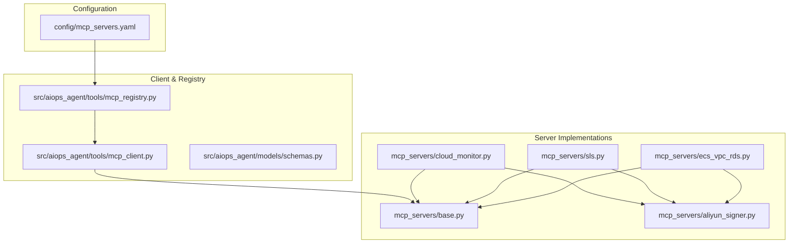
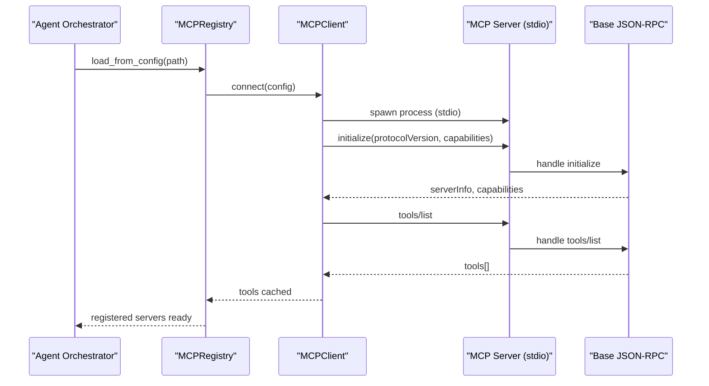
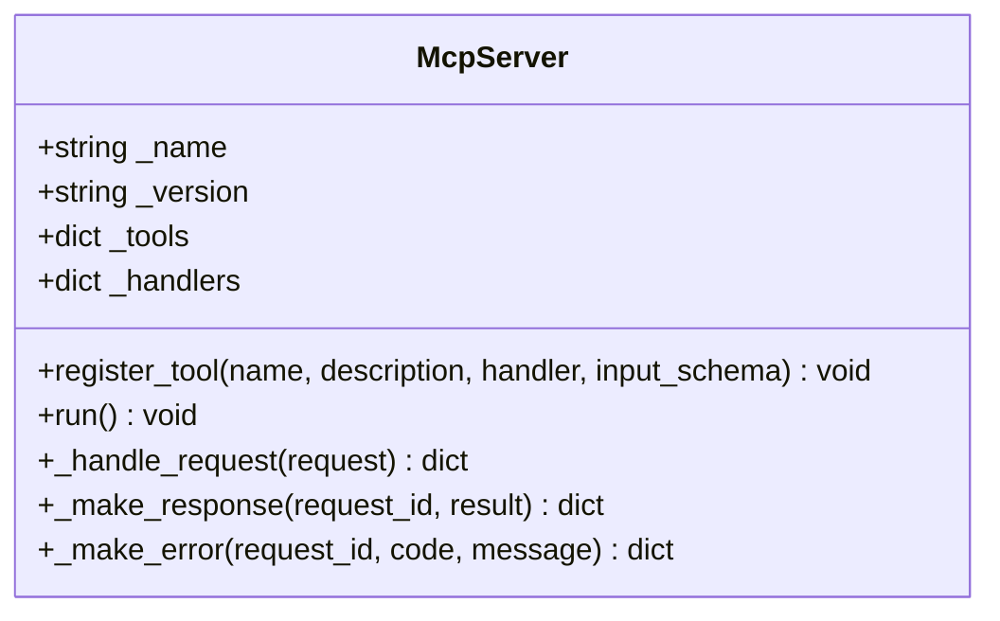
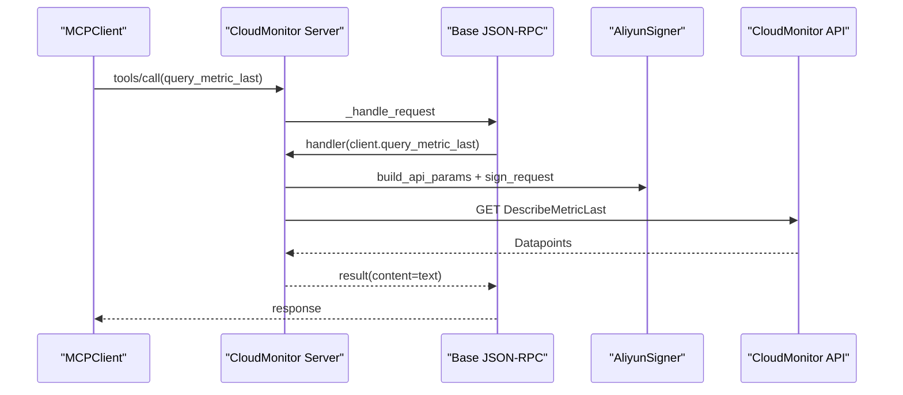
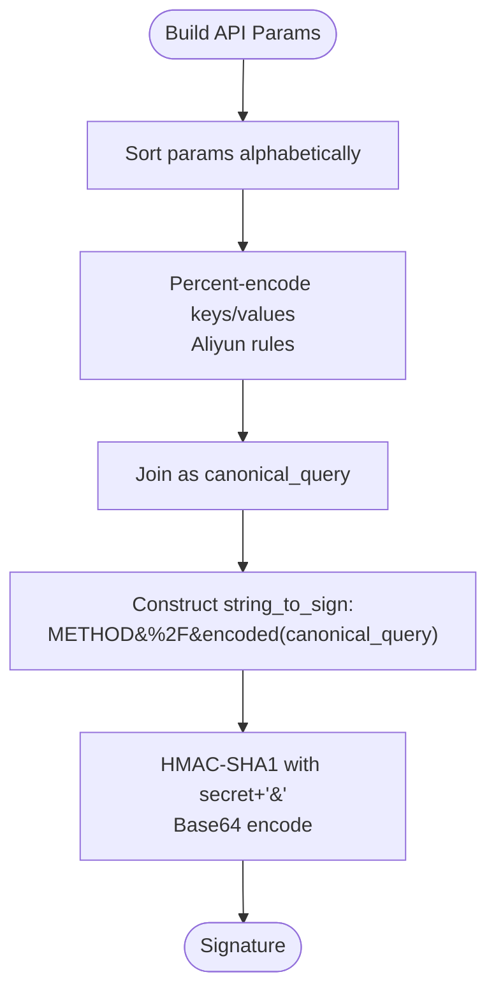
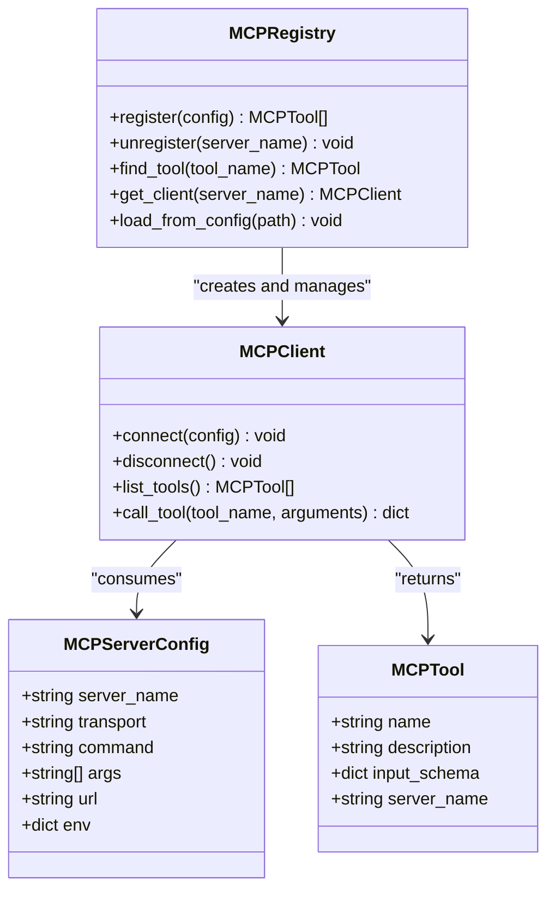
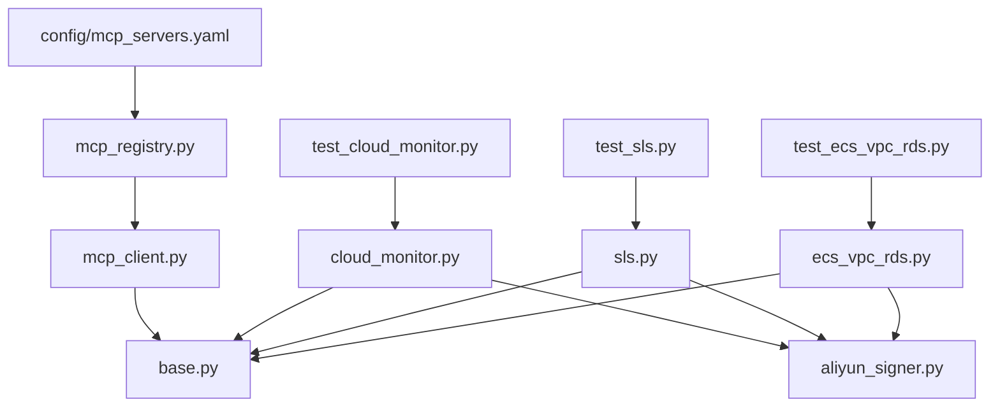

# MCP Servers Configuration

<cite>
**Referenced Files in This Document**
- [mcp_servers.yaml](file://config/mcp_servers.yaml)
- [base.py](file://mcp_servers/base.py)
- [cloud_monitor.py](file://mcp_servers/cloud_monitor.py)
- [sls.py](file://mcp_servers/sls.py)
- [ecs_vpc_rds.py](file://mcp_servers/ecs_vpc_rds.py)
- [aliyun_signer.py](file://mcp_servers/aliyun_signer.py)
- [mcp_client.py](file://src/aiops_agent/tools/mcp_client.py)
- [mcp_registry.py](file://src/aiops_agent/tools/mcp_registry.py)
- [schemas.py](file://src/aiops_agent/models/schemas.py)
- [test_cloud_monitor.py](file://tests/mcp_servers/test_cloud_monitor.py)
- [test_sls.py](file://tests/mcp_servers/test_sls.py)
- [test_ecs_vpc_rds.py](file://tests/mcp_servers/test_ecs_vpc_rds.py)
- [main.py](file://src/aiops_agent/main.py)
- [README.md](file://README.md)
</cite>

## Table of Contents
1. [Introduction](#introduction)
2. [Project Structure](#project-structure)
3. [Core Components](#core-components)
4. [Architecture Overview](#architecture-overview)
5. [Detailed Component Analysis](#detailed-component-analysis)
6. [Dependency Analysis](#dependency-analysis)
7. [Performance Considerations](#performance-considerations)
8. [Troubleshooting Guide](#troubleshooting-guide)
9. [Conclusion](#conclusion)
10. [Appendices](#appendices)

## Introduction
This document explains how to configure and operate MCP (Model Context Protocol) servers for Alibaba Cloud services within the AIOps Agent. It covers server registration via configuration, authentication using environment variables, endpoint configuration for CloudMonitor, SLS, ECS, VPC, and RDS, and practical guidance for adding new MCP servers and troubleshooting connectivity issues. The focus is on the stdio transport mode used by local MCP server processes and the JSON-RPC 2.0 protocol implemented by the base server class.

## Project Structure
The MCP server configuration and runtime integration are organized as follows:
- Configuration: config/mcp_servers.yaml defines server entries for CloudMonitor, SLS, and ECS/VPC/RDS.
- Server implementations: mcp_servers/*.py implement Alibaba Cloud integrations and inherit from the base JSON-RPC server.
- Client and registry: src/aiops_agent/tools/mcp_client.py and mcp_registry.py manage connections, tool discovery, and lifecycle.
- Data models: src/aiops_agent/models/schemas.py define MCPServerConfig and MCPTool structures.
- Tests: tests/mcp_servers/* validate server behavior and tool schemas.

**Diagram sources**
- [mcp_servers.yaml:1-41](file://config/mcp_servers.yaml#L1-L41)
- [base.py:14-108](file://mcp_servers/base.py#L14-L108)
- [cloud_monitor.py:74-125](file://mcp_servers/cloud_monitor.py#L74-L125)
- [sls.py:49-91](file://mcp_servers/sls.py#L49-L91)
- [ecs_vpc_rds.py:101-119](file://mcp_servers/ecs_vpc_rds.py#L101-L119)
- [aliyun_signer.py:25-76](file://mcp_servers/aliyun_signer.py#L25-L76)
- [mcp_registry.py:122-153](file://src/aiops_agent/tools/mcp_registry.py#L122-L153)
- [mcp_client.py:56-95](file://src/aiops_agent/tools/mcp_client.py#L56-L95)
- [schemas.py:144-162](file://src/aiops_agent/models/schemas.py#L144-L162)

**Section sources**
- [mcp_servers.yaml:1-41](file://config/mcp_servers.yaml#L1-L41)
- [mcp_registry.py:122-153](file://src/aiops_agent/tools/mcp_registry.py#L122-L153)
- [mcp_client.py:56-95](file://src/aiops_agent/tools/mcp_client.py#L56-L95)
- [schemas.py:144-162](file://src/aiops_agent/models/schemas.py#L144-L162)

## Core Components
- MCP Server Base: Implements JSON-RPC 2.0 over stdio, supporting initialize, tools/list, tools/call, and notifications/initialized.
- Alibaba Cloud Integrations:
  - CloudMonitor: Metrics queries and alarm history retrieval.
  - SLS: Log retrieval, listing logstores, and index inspection.
  - ECS/VPC/RDS: Instance, disk, security group, VPC/VSwitch, and RDS queries.
- Authentication: Uses HMAC-SHA1 signing and environment variables for credentials and region.
- Client and Registry: Connects to servers, discovers tools, and manages lifecycle.

Key configuration and runtime behaviors:
- Transport modes supported by the client include stdio, sse, and streamable-http.
- The registry loads servers from YAML and registers them automatically.
- Tools are validated against JSON Schema input definitions.

**Section sources**
- [base.py:14-108](file://mcp_servers/base.py#L14-L108)
- [cloud_monitor.py:74-125](file://mcp_servers/cloud_monitor.py#L74-L125)
- [sls.py:49-91](file://mcp_servers/sls.py#L49-L91)
- [ecs_vpc_rds.py:101-119](file://mcp_servers/ecs_vpc_rds.py#L101-L119)
- [aliyun_signer.py:25-76](file://mcp_servers/aliyun_signer.py#L25-L76)
- [mcp_client.py:22-95](file://src/aiops_agent/tools/mcp_client.py#L22-L95)
- [mcp_registry.py:38-69](file://src/aiops_agent/tools/mcp_registry.py#L38-L69)
- [schemas.py:144-162](file://src/aiops_agent/models/schemas.py#L144-L162)

## Architecture Overview
The MCP configuration integrates with the Agent Orchestrator through the Tool Executor and MCP Registry. The registry reads mcp_servers.yaml, instantiates clients, connects to servers, lists tools, and maintains a tool-to-server mapping.

**Diagram sources**
- [mcp_registry.py:122-153](file://src/aiops_agent/tools/mcp_registry.py#L122-L153)
- [mcp_client.py:56-95](file://src/aiops_agent/tools/mcp_client.py#L56-L95)
- [base.py:76-108](file://mcp_servers/base.py#L76-L108)

**Section sources**
- [mcp_registry.py:122-153](file://src/aiops_agent/tools/mcp_registry.py#L122-L153)
- [mcp_client.py:56-95](file://src/aiops_agent/tools/mcp_client.py#L56-L95)
- [base.py:76-108](file://mcp_servers/base.py#L76-L108)

## Detailed Component Analysis

### Configuration File: mcp_servers.yaml
- Defines three built-in servers: cloud_monitor, sls, and ecs_vpc_rds.
- Each server specifies server_name, transport (stdio), command and args for launching the module, env overrides (e.g., REGION), and enabled flag.
- Example entries demonstrate stdio transport and environment variable usage for region selection.

Operational notes:
- To enable/disable a server, toggle enabled.
- To change region, override REGION in env per server.
- Remote servers can be configured using sse/streamable-http transport with url; an example is commented in the template.

**Section sources**
- [mcp_servers.yaml:1-41](file://config/mcp_servers.yaml#L1-L41)

### Base JSON-RPC Server (McpServer)
- Implements stdio-based JSON-RPC 2.0:
  - initialize returns protocolVersion, capabilities, and serverInfo.
  - tools/list returns registered tool definitions.
  - tools/call executes handlers and returns text content results.
  - notifications/initialized is acknowledged silently.
- Provides helpers for constructing responses and errors.

**Diagram sources**
- [base.py:14-108](file://mcp_servers/base.py#L14-L108)

**Section sources**
- [base.py:14-108](file://mcp_servers/base.py#L14-L108)

### CloudMonitor MCP Server
- Creates a CloudMonitorClient using environment variables for credentials and region.
- Registers tools:
  - query_metric_last: requires namespace, metric_name, instance_id.
  - query_metric_list: supports optional start_time and end_time.
  - query_alarm_history: supports optional namespace and time range.
- Uses HMAC-SHA1 signing and builds API parameters via aliyun_signer.

**Diagram sources**
- [cloud_monitor.py:74-125](file://mcp_servers/cloud_monitor.py#L74-L125)
- [aliyun_signer.py:25-76](file://mcp_servers/aliyun_signer.py#L25-L76)
- [base.py:76-108](file://mcp_servers/base.py#L76-L108)

**Section sources**
- [cloud_monitor.py:74-125](file://mcp_servers/cloud_monitor.py#L74-L125)
- [aliyun_signer.py:25-76](file://mcp_servers/aliyun_signer.py#L25-L76)

### SLS MCP Server
- Creates an SLSClient using environment variables for credentials and region.
- Registers tools:
  - query_logs: requires project and logstore, optional query.
  - list_logstores: requires project.
  - get_logstore_index: requires project and logstore.
- Uses signed requests with appropriate headers.

**Section sources**
- [sls.py:49-91](file://mcp_servers/sls.py#L49-L91)
- [aliyun_signer.py:25-76](file://mcp_servers/aliyun_signer.py#L25-L76)

### ECS/VPC/RDS MCP Server
- Creates an AliyunClient using environment variables for credentials and region.
- Registers tools for ECS, VPC, and RDS:
  - ECS: describe_instances, describe_instance_status, describe_disks, describe_security_groups.
  - VPC: describe_vpcs, describe_vswitches.
  - RDS: describe_dbinstances, describe_slowlog_records, describe_dbinstance_status.
- Uses HMAC-SHA1 signing and endpoint routing per service.

**Section sources**
- [ecs_vpc_rds.py:101-119](file://mcp_servers/ecs_vpc_rds.py#L101-L119)
- [aliyun_signer.py:25-76](file://mcp_servers/aliyun_signer.py#L25-L76)

### Authentication and Signing (AliyunSigner)
- Builds standardized API parameters including Format, Version, AccessKeyId, SignatureMethod, Timestamp, SignatureVersion, SignatureNonce, RegionId, and Action.
- Computes HMAC-SHA1 signature with percent-encoded canonical query string.
- Used by all Alibaba Cloud MCP servers to authenticate requests.

**Diagram sources**
- [aliyun_signer.py:25-76](file://mcp_servers/aliyun_signer.py#L25-L76)

**Section sources**
- [aliyun_signer.py:25-76](file://mcp_servers/aliyun_signer.py#L25-L76)

### Client and Registry Integration
- MCPClient supports stdio and HTTP/SSE transports, sending JSON-RPC requests and parsing responses.
- MCPRegistry loads mcp_servers.yaml, constructs MCPServerConfig, connects clients, lists tools, and maintains tool-to-server mapping.
- MCPServerConfig and MCPTool models define the configuration and tool schemas.

**Diagram sources**
- [schemas.py:144-162](file://src/aiops_agent/models/schemas.py#L144-L162)
- [mcp_client.py:22-95](file://src/aiops_agent/tools/mcp_client.py#L22-L95)
- [mcp_registry.py:38-69](file://src/aiops_agent/tools/mcp_registry.py#L38-L69)

**Section sources**
- [mcp_client.py:22-95](file://src/aiops_agent/tools/mcp_client.py#L22-L95)
- [mcp_registry.py:38-69](file://src/aiops_agent/tools/mcp_registry.py#L38-L69)
- [schemas.py:144-162](file://src/aiops_agent/models/schemas.py#L144-L162)

## Dependency Analysis
- Configuration-driven registration: mcp_servers.yaml drives MCPRegistry.load_from_config, which instantiates MCPClient and connects to servers.
- Server implementations depend on McpServer base and aliyun_signer for authentication.
- Client depends on aiohttp for HTTP/SSE and asyncio for stdio.
- Tests validate server creation, tool availability, and JSON Schema requirements.

**Diagram sources**
- [mcp_servers.yaml:1-41](file://config/mcp_servers.yaml#L1-L41)
- [mcp_registry.py:122-153](file://src/aiops_agent/tools/mcp_registry.py#L122-L153)
- [mcp_client.py:56-95](file://src/aiops_agent/tools/mcp_client.py#L56-L95)
- [base.py:14-108](file://mcp_servers/base.py#L14-L108)
- [cloud_monitor.py:74-125](file://mcp_servers/cloud_monitor.py#L74-L125)
- [sls.py:49-91](file://mcp_servers/sls.py#L49-L91)
- [ecs_vpc_rds.py:101-119](file://mcp_servers/ecs_vpc_rds.py#L101-L119)
- [aliyun_signer.py:25-76](file://mcp_servers/aliyun_signer.py#L25-L76)
- [test_cloud_monitor.py:8-51](file://tests/mcp_servers/test_cloud_monitor.py#L8-L51)
- [test_sls.py:8-43](file://tests/mcp_servers/test_sls.py#L8-L43)
- [test_ecs_vpc_rds.py:8-55](file://tests/mcp_servers/test_ecs_vpc_rds.py#L8-L55)

**Section sources**
- [mcp_registry.py:122-153](file://src/aiops_agent/tools/mcp_registry.py#L122-L153)
- [mcp_client.py:56-95](file://src/aiops_agent/tools/mcp_client.py#L56-L95)
- [cloud_monitor.py:74-125](file://mcp_servers/cloud_monitor.py#L74-L125)
- [sls.py:49-91](file://mcp_servers/sls.py#L49-L91)
- [ecs_vpc_rds.py:101-119](file://mcp_servers/ecs_vpc_rds.py#L101-L119)
- [aliyun_signer.py:25-76](file://mcp_servers/aliyun_signer.py#L25-L76)
- [test_cloud_monitor.py:8-51](file://tests/mcp_servers/test_cloud_monitor.py#L8-L51)
- [test_sls.py:8-43](file://tests/mcp_servers/test_sls.py#L8-L43)
- [test_ecs_vpc_rds.py:8-55](file://tests/mcp_servers/test_ecs_vpc_rds.py#L8-L55)

## Performance Considerations
- Transport choice: stdio avoids network overhead but spawns subprocesses; HTTP/SSE adds latency and requires proper timeouts.
- Request concurrency: Servers implement per-request handlers; avoid blocking operations inside handlers.
- Network I/O: All Alibaba Cloud servers use asynchronous HTTP clients; ensure adequate connection limits and timeouts.
- Tool caching: MCPRegistry caches tools and client instances; reuse where possible to reduce repeated discovery overhead.

[No sources needed since this section provides general guidance]

## Troubleshooting Guide
Common issues and resolutions:
- Authentication failures:
  - Verify environment variables for credentials and region are set correctly in the server’s env block.
  - Confirm HMAC-SHA1 signing parameters and timestamps are valid.
- Connectivity problems:
  - For stdio servers, ensure the command and args launch the correct module entry point.
  - For HTTP/SSE servers, confirm URL reachability and network policies.
- Tool invocation errors:
  - Check required fields in tool input schemas; missing required fields cause JSON-RPC errors.
  - Inspect server logs for exceptions raised during tool execution.
- Registry loading:
  - Validate YAML syntax and enabled flag; disabled servers are skipped.
- Client-side errors:
  - Ensure client is connected before calling list_tools or call_tool.
  - Review JSON-RPC error codes returned by the server.

Validation references:
- Tool presence and schemas are verified by unit tests for each server module.

**Section sources**
- [mcp_client.py:135-156](file://src/aiops_agent/tools/mcp_client.py#L135-L156)
- [mcp_client.py:261-274](file://src/aiops_agent/tools/mcp_client.py#L261-L274)
- [test_cloud_monitor.py:14-51](file://tests/mcp_servers/test_cloud_monitor.py#L14-L51)
- [test_sls.py:14-43](file://tests/mcp_servers/test_sls.py#L14-L43)
- [test_ecs_vpc_rds.py:14-55](file://tests/mcp_servers/test_ecs_vpc_rds.py#L14-L55)

## Conclusion
The MCP configuration system integrates Alibaba Cloud services through standardized JSON-RPC servers launched via stdio. Configuration is declarative, authentication is handled securely via environment variables and HMAC-SHA1 signing, and the registry automates discovery and lifecycle management. By following the guidance here, you can configure CloudMonitor, SLS, ECS, VPC, and RDS servers, add custom servers, and troubleshoot connectivity effectively.

[No sources needed since this section summarizes without analyzing specific files]

## Appendices

### A. Adding a Custom MCP Server
Steps:
- Implement a new module under mcp_servers/ inheriting from McpServer and registering tools.
- Add a server entry in mcp_servers.yaml with transport: stdio, command: python, args pointing to your module, and env overrides as needed.
- Optionally, add HMAC-SHA1 signing utilities if calling Alibaba Cloud APIs.
- Run the application; the registry will load and register the server automatically.

References:
- Base server implementation and tool registration pattern.
- Configuration template and environment overrides.

**Section sources**
- [base.py:14-108](file://mcp_servers/base.py#L14-L108)
- [mcp_servers.yaml:1-41](file://config/mcp_servers.yaml#L1-L41)

### B. Environment Variables and Regions
- REGION: Controls the Alibaba Cloud region used by servers.
- ALIBABA_CLOUD_ACCESS_KEY_ID and ALIBABA_CLOUD_ACCESS_KEY_SECRET: Provide credentials for API calls.
- For remote servers, use url and transport sse/streamable-http in the YAML.

**Section sources**
- [cloud_monitor.py:75-77](file://mcp_servers/cloud_monitor.py#L75-L77)
- [sls.py:50-52](file://mcp_servers/sls.py#L50-L52)
- [ecs_vpc_rds.py:102-104](file://mcp_servers/ecs_vpc_rds.py#L102-L104)
- [mcp_servers.yaml:10-22](file://config/mcp_servers.yaml#L10-L22)

### C. Tool Schemas and Required Parameters
- CloudMonitor:
  - query_metric_last: requires namespace, metric_name, instance_id.
  - query_metric_list: requires namespace, metric_name, instance_id; optional start_time and end_time.
  - query_alarm_history: optional namespace, start_time, end_time.
- SLS:
  - query_logs: requires project, logstore; optional query.
  - list_logstores: requires project.
  - get_logstore_index: requires project, logstore.
- ECS/VPC/RDS:
  - describe_slowlog_records: requires db_instance_id.
  - describe_dbinstance_status: requires db_instance_id.

**Section sources**
- [cloud_monitor.py:86-124](file://mcp_servers/cloud_monitor.py#L86-L124)
- [sls.py:61-90](file://mcp_servers/sls.py#L61-L90)
- [ecs_vpc_rds.py:109-117](file://mcp_servers/ecs_vpc_rds.py#L109-L117)
- [test_ecs_vpc_rds.py:50-55](file://tests/mcp_servers/test_ecs_vpc_rds.py#L50-L55)
- [test_cloud_monitor.py:44-51](file://tests/mcp_servers/test_cloud_monitor.py#L44-L51)
- [test_sls.py:14-24](file://tests/mcp_servers/test_sls.py#L14-L24)

### D. Integration with Agent Orchestrator
- The Agent initializes MCPRegistry and injects it into ToolExecutor.
- Skills can discover and call tools provided by registered MCP servers.

**Section sources**
- [main.py:164-171](file://src/aiops_agent/main.py#L164-L171)
- [README.md:1-193](file://README.md#L1-L193)