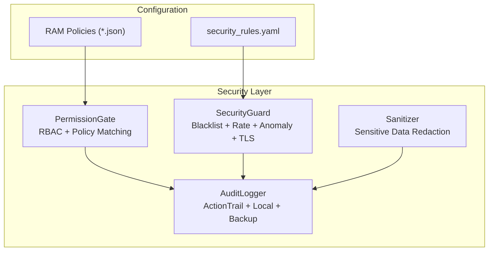
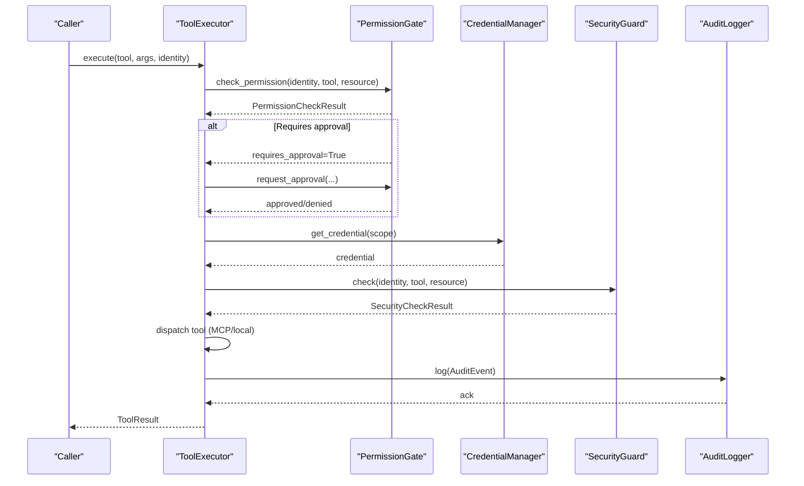
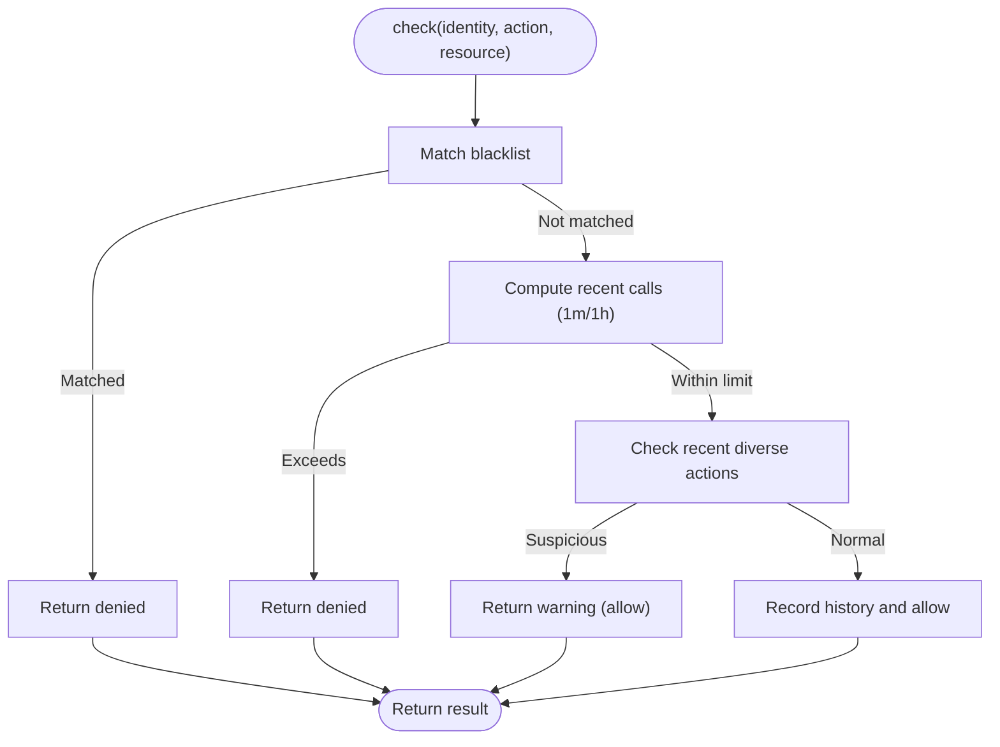
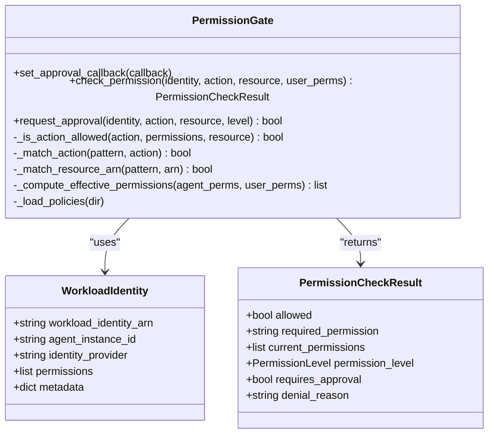
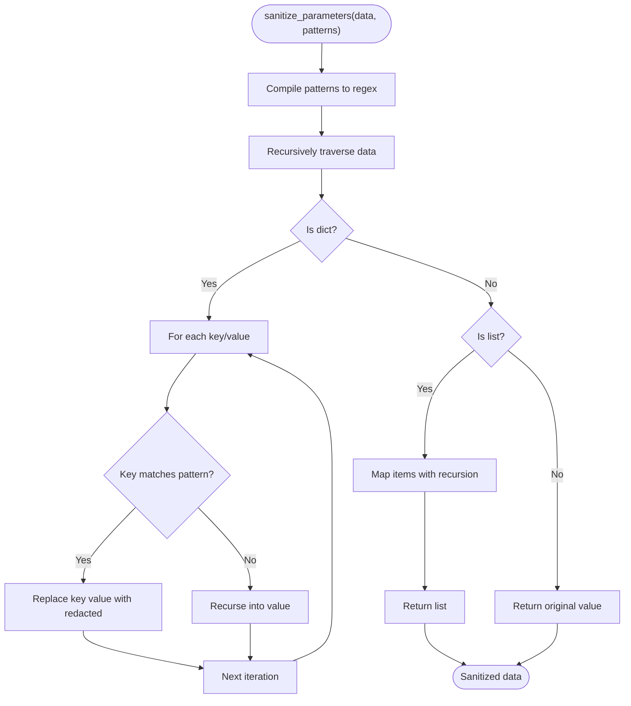
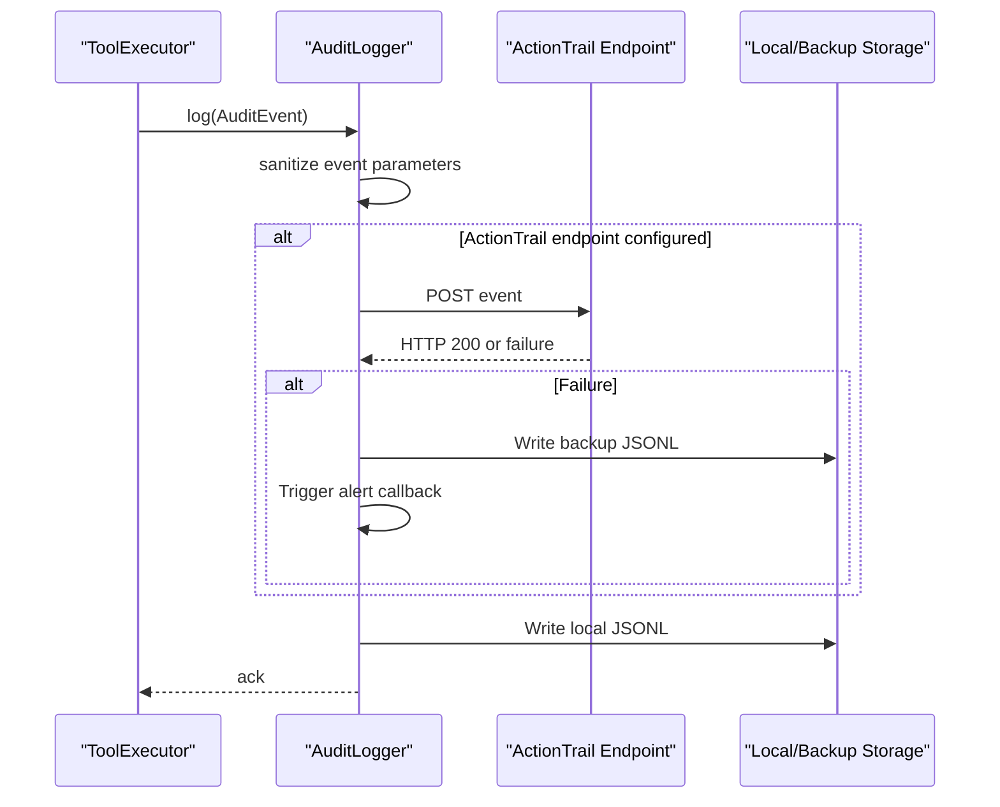
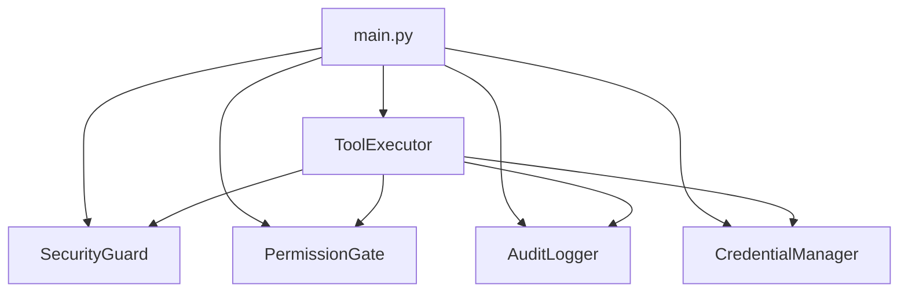

# Security Rules Configuration

<cite>
**Referenced Files in This Document**
- [security_rules.yaml](file://config/security_rules.yaml)
- [security_guard.py](file://src/aiops_agent/security/security_guard.py)
- [permission_gate.py](file://src/aiops_agent/security/permission_gate.py)
- [sanitizer.py](file://src/aiops_agent/security/sanitizer.py)
- [audit_logger.py](file://src/aiops_agent/security/audit_logger.py)
- [schemas.py](file://src/aiops_agent/models/schemas.py)
- [main.py](file://src/aiops_agent/main.py)
- [executor.py](file://src/aiops_agent/tools/executor.py)
- [admin.json](file://config/ram_policies/admin.json)
- [limited_write.json](file://config/ram_policies/limited_write.json)
- [read_only.json](file://config/ram_policies/read_only.json)
- [test_security_guard.py](file://tests/test_security_guard.py)
- [test_audit_logger.py](file://tests/test_audit_logger.py)
- [test_permission_gate.py](file://tests/test_permission_gate.py)
</cite>

## Table of Contents
1. [Introduction](#introduction)
2. [Project Structure](#project-structure)
3. [Core Components](#core-components)
4. [Architecture Overview](#architecture-overview)
5. [Detailed Component Analysis](#detailed-component-analysis)
6. [Dependency Analysis](#dependency-analysis)
7. [Performance Considerations](#performance-considerations)
8. [Troubleshooting Guide](#troubleshooting-guide)
9. [Conclusion](#conclusion)
10. [Appendices](#appendices)

## Introduction
This document describes the security rules configuration system of the AIOps Agent. It explains how threat protection rules, access control policies, input validation rules, and security guard configurations work together to enforce security policy, audit operations, and support compliance monitoring. The guide covers rule syntax, precedence handling, dynamic rule evaluation, and practical examples for common security rule patterns and custom rule development.

## Project Structure
The security subsystem is organized around four pillars:
- Access control via RAM Policy-based RBAC with On-Behalf-Of support
- Threat protection via Security Guard (blacklist, rate limits, anomaly detection, TLS enforcement)
- Input sanitization for sensitive data
- Full-stack audit logging with ActionTrail integration and local backups

**Diagram sources**
- [security_guard.py:25-33](file://src/aiops_agent/security/security_guard.py#L25-L33)
- [permission_gate.py:57-66](file://src/aiops_agent/security/permission_gate.py#L57-L66)
- [sanitizer.py:1-4](file://src/aiops_agent/security/sanitizer.py#L1-L4)
- [audit_logger.py:24-34](file://src/aiops_agent/security/audit_logger.py#L24-L34)
- [security_rules.yaml:1-70](file://config/security_rules.yaml#L1-L70)
- [admin.json:1-35](file://config/ram_policies/admin.json#L1-L35)
- [limited_write.json:1-38](file://config/ram_policies/limited_write.json#L1-L38)
- [read_only.json:1-30](file://config/ram_policies/read_only.json#L1-L30)

**Section sources**
- [main.py:142-159](file://src/aiops_agent/main.py#L142-L159)
- [security_rules.yaml:1-70](file://config/security_rules.yaml#L1-L70)
- [admin.json:1-35](file://config/ram_policies/admin.json#L1-L35)
- [limited_write.json:1-38](file://config/ram_policies/limited_write.json#L1-L38)
- [read_only.json:1-30](file://config/ram_policies/read_only.json#L1-L30)

## Core Components
- SecurityGuard: Enforces blacklist rules, enforces rate limits, detects anomalous operation sequences, and validates TLS compliance. It loads configuration from security_rules.yaml and exposes a unified check method.
- PermissionGate: Implements RBAC using RAM Policy JSON files, supports wildcard matching, On-Behalf-Of permission intersection, and optional manual approval callbacks.
- Sanitizer: Recursively redacts sensitive fields from parameters and logs using configurable field-name patterns.
- AuditLogger: Writes structured audit events to ActionTrail (when configured), local JSONL files, and maintains backups with alerting on failures.

**Section sources**
- [security_guard.py:25-33](file://src/aiops_agent/security/security_guard.py#L25-L33)
- [permission_gate.py:57-66](file://src/aiops_agent/security/permission_gate.py#L57-L66)
- [sanitizer.py:1-4](file://src/aiops_agent/security/sanitizer.py#L1-L4)
- [audit_logger.py:24-34](file://src/aiops_agent/security/audit_logger.py#L24-L34)

## Architecture Overview
The security system integrates at the ToolExecutor boundary, ensuring every tool invocation is permission-checked, credentials resolved, executed, sanitized, and audited. SecurityGuard participates in the orchestration pipeline to enforce operational controls.

**Diagram sources**
- [executor.py:80-226](file://src/aiops_agent/tools/executor.py#L80-L226)
- [permission_gate.py:95-181](file://src/aiops_agent/security/permission_gate.py#L95-L181)
- [security_guard.py:64-122](file://src/aiops_agent/security/security_guard.py#L64-L122)
- [audit_logger.py:65-103](file://src/aiops_agent/security/audit_logger.py#L65-L103)

## Detailed Component Analysis

### SecurityGuard: Threat Protection and Operational Controls
SecurityGuard centralizes:
- Blacklist matching against high-risk actions
- Per-action rate limiting (per minute and per hour)
- Operation sequence anomaly detection
- TLS/HTTPS enforcement

Key behaviors:
- Loads configuration from security_rules.yaml and builds SecurityRule objects for auditability.
- Maintains sliding windows of timestamps per identity and action for rate limiting.
- Tracks recent operation sequences per identity for anomaly detection.
- Enforces TLS 1.2+ for URLs when configured.

**Diagram sources**
- [security_guard.py:64-122](file://src/aiops_agent/security/security_guard.py#L64-L122)
- [security_guard.py:149-253](file://src/aiops_agent/security/security_guard.py#L149-L253)

**Section sources**
- [security_guard.py:35-59](file://src/aiops_agent/security/security_guard.py#L35-L59)
- [security_guard.py:64-122](file://src/aiops_agent/security/security_guard.py#L64-L122)
- [security_guard.py:149-253](file://src/aiops_agent/security/security_guard.py#L149-L253)
- [security_rules.yaml:20-69](file://config/security_rules.yaml#L20-L69)

### PermissionGate: RBAC and Policy Enforcement
PermissionGate implements:
- Action-to-permission-level classification (Read-Only, Limited-Write, Admin)
- Wildcard matching for actions and resource ARNs
- On-Behalf-Of permission intersection
- Manual approval gating for write/Admin actions
- Policy loading from JSON files under config/ram_policies/

**Diagram sources**
- [permission_gate.py:57-181](file://src/aiops_agent/security/permission_gate.py#L57-L181)
- [schemas.py:89-106](file://src/aiops_agent/models/schemas.py#L89-L106)
- [schemas.py:199-208](file://src/aiops_agent/models/schemas.py#L199-L208)

**Section sources**
- [permission_gate.py:57-181](file://src/aiops_agent/security/permission_gate.py#L57-L181)
- [permission_gate.py:225-296](file://src/aiops_agent/security/permission_gate.py#L225-L296)
- [admin.json:1-35](file://config/ram_policies/admin.json#L1-L35)
- [limited_write.json:1-38](file://config/ram_policies/limited_write.json#L1-L38)
- [read_only.json:1-30](file://config/ram_policies/read_only.json#L1-L30)

### Sanitizer: Input Validation and Sensitive Data Redaction
Sanitizer recursively redacts sensitive fields from nested dictionaries and lists based on field-name patterns. It supports configurable patterns and a redacted value replacement.

**Diagram sources**
- [sanitizer.py:39-79](file://src/aiops_agent/security/sanitizer.py#L39-L79)

**Section sources**
- [sanitizer.py:11-27](file://src/aiops_agent/security/sanitizer.py#L11-L27)
- [sanitizer.py:39-79](file://src/aiops_agent/security/sanitizer.py#L39-L79)

### AuditLogger: Compliance Logging and Backups
AuditLogger records structured events with sensitive parameters redacted, writes to ActionTrail (when configured), and falls back to local JSONL logs with backup and alerting.

**Diagram sources**
- [audit_logger.py:65-103](file://src/aiops_agent/security/audit_logger.py#L65-L103)
- [audit_logger.py:161-185](file://src/aiops_agent/security/audit_logger.py#L161-L185)
- [audit_logger.py:191-210](file://src/aiops_agent/security/audit_logger.py#L191-L210)

**Section sources**
- [audit_logger.py:24-34](file://src/aiops_agent/security/audit_logger.py#L24-L34)
- [audit_logger.py:65-103](file://src/aiops_agent/security/audit_logger.py#L65-L103)
- [audit_logger.py:161-185](file://src/aiops_agent/security/audit_logger.py#L161-L185)
- [audit_logger.py:191-210](file://src/aiops_agent/security/audit_logger.py#L191-L210)

## Dependency Analysis
Security components are wired into the application bootstrap and tool execution pipeline.

**Diagram sources**
- [main.py:142-171](file://src/aiops_agent/main.py#L142-L171)
- [executor.py:58-75](file://src/aiops_agent/tools/executor.py#L58-L75)

**Section sources**
- [main.py:142-171](file://src/aiops_agent/main.py#L142-L171)
- [executor.py:58-75](file://src/aiops_agent/tools/executor.py#L58-L75)

## Performance Considerations
- Rate limiting uses sliding windows with deques to bound memory usage while maintaining accurate counts.
- Anomaly detection checks a fixed-size recent window of operations to keep overhead predictable.
- TLS enforcement is O(1) string prefix checks.
- AuditLogger writes are asynchronous and include retry/backoff patterns at the tool level; ActionTrail writes are best-effort with immediate local fallback.

[No sources needed since this section provides general guidance]

## Troubleshooting Guide
Common issues and resolutions:
- PermissionDeniedError during tool execution indicates insufficient or mismatched permissions. Verify RAM Policy JSON contents and On-Behalf-Of permissions.
- Excessive rate limit denials suggest tuning security_rules.yaml defaults or per-skill limits.
- Anomaly warnings indicate rapid switching across many distinct actions; review operator behavior or adjust thresholds.
- ActionTrail write failures trigger local backup and alert callbacks; inspect backup logs and alert handler.

**Section sources**
- [executor.py:124-201](file://src/aiops_agent/tools/executor.py#L124-L201)
- [test_security_guard.py:55-76](file://tests/test_security_guard.py#L55-L76)
- [test_audit_logger.py:151-208](file://tests/test_audit_logger.py#L151-L208)
- [test_permission_gate.py:133-147](file://tests/test_permission_gate.py#L133-L147)

## Conclusion
The security rules configuration system combines RBAC-driven access control, operational safeguards (blacklists, rate limits, anomaly detection), transport security (TLS enforcement), and comprehensive audit logging. Configuration is centralized in YAML and JSON files, enabling dynamic rule evaluation and straightforward customization for varied environments and compliance needs.

[No sources needed since this section summarizes without analyzing specific files]

## Appendices

### Rule Syntax and Precedence
- Blacklist entries define high-risk actions with human-readable descriptions and suggestions.
- Rate limits support default and per-skill overrides; enforcement occurs before tool execution.
- Anomaly detection warns on unusual operation diversity; it does not block but surfaces risk.
- TLS enforcement blocks non-HTTPS URLs when enabled.
- RAM Policy JSON files define Allow/Deny statements; PermissionGate matches actions and resources using wildcards.

**Section sources**
- [security_rules.yaml:20-69](file://config/security_rules.yaml#L20-L69)
- [security_guard.py:149-253](file://src/aiops_agent/security/security_guard.py#L149-L253)
- [permission_gate.py:225-256](file://src/aiops_agent/security/permission_gate.py#L225-L256)
- [admin.json:1-35](file://config/ram_policies/admin.json#L1-L35)
- [limited_write.json:1-38](file://config/ram_policies/limited_write.json#L1-L38)
- [read_only.json:1-30](file://config/ram_policies/read_only.json#L1-L30)

### Dynamic Rule Evaluation
- SecurityGuard loads security_rules.yaml at startup and builds SecurityRule objects for auditability.
- PermissionGate loads RAM Policy JSON files from disk and caches them for fast matching.
- Runtime decisions are made per invocation using sliding windows and cached policies.

**Section sources**
- [security_guard.py:259-291](file://src/aiops_agent/security/security_guard.py#L259-L291)
- [permission_gate.py:302-319](file://src/aiops_agent/security/permission_gate.py#L302-L319)

### Security Policy Enforcement Workflow
- ToolExecutor orchestrates permission checks, credential acquisition, tool execution, sanitization, and auditing.
- SecurityGuard participates in the orchestration to enforce operational controls.

**Section sources**
- [executor.py:80-226](file://src/aiops_agent/tools/executor.py#L80-L226)
- [main.py:212-222](file://src/aiops_agent/main.py#L212-L222)

### Compliance Monitoring Settings
- AuditLogger writes structured events with timestamps, identities, actions, resources, and results.
- Local JSONL files enable offline compliance queries; ActionTrail integration provides centralized audit storage when configured.
- Backup logs and alert callbacks ensure continuity and visibility on failures.

**Section sources**
- [audit_logger.py:65-103](file://src/aiops_agent/security/audit_logger.py#L65-L103)
- [audit_logger.py:105-155](file://src/aiops_agent/security/audit_logger.py#L105-L155)
- [schemas.py:169-184](file://src/aiops_agent/models/schemas.py#L169-L184)

### Examples of Common Security Rule Patterns
- Blacklist high-risk actions such as deleting production resources or disabling protective services.
- Configure rate limits per skill to align with operational cadence and safety margins.
- Enable anomaly detection to flag rapid diversification of actions indicative of compromised accounts or exploratory attacks.
- Enforce HTTPS/TLS 1.2+ for all external communications.

**Section sources**
- [security_rules.yaml:20-69](file://config/security_rules.yaml#L20-L69)
- [test_security_guard.py:19-47](file://tests/test_security_guard.py#L19-L47)
- [test_security_guard.py:95-130](file://tests/test_security_guard.py#L95-L130)
- [test_security_guard.py:138-146](file://tests/test_security_guard.py#L138-L146)

### Custom Rule Development
- Extend security_rules.yaml with new blacklist entries, adjust rate limits, and toggle anomaly detection.
- Add or modify RAM Policy JSON files to refine RBAC coverage and On-Behalf-Of scenarios.
- Integrate manual approval callbacks in PermissionGate for write/Admin actions requiring governance workflows.

**Section sources**
- [security_rules.yaml:1-70](file://config/security_rules.yaml#L1-L70)
- [admin.json:1-35](file://config/ram_policies/admin.json#L1-L35)
- [limited_write.json:1-38](file://config/ram_policies/limited_write.json#L1-L38)
- [permission_gate.py:84-89](file://src/aiops_agent/security/permission_gate.py#L84-L89)