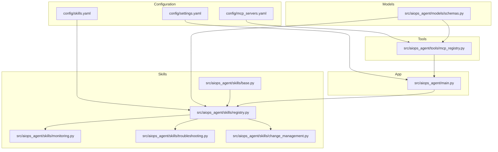
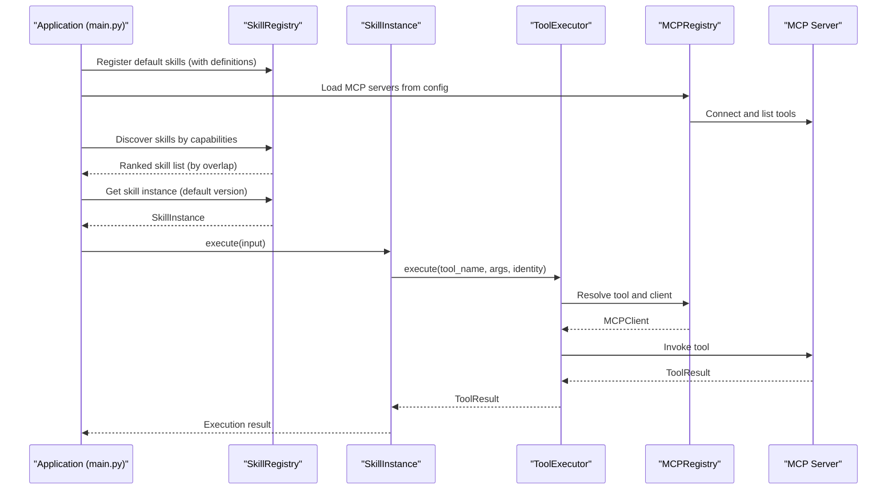
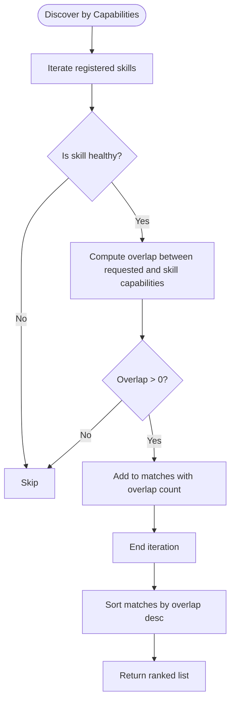
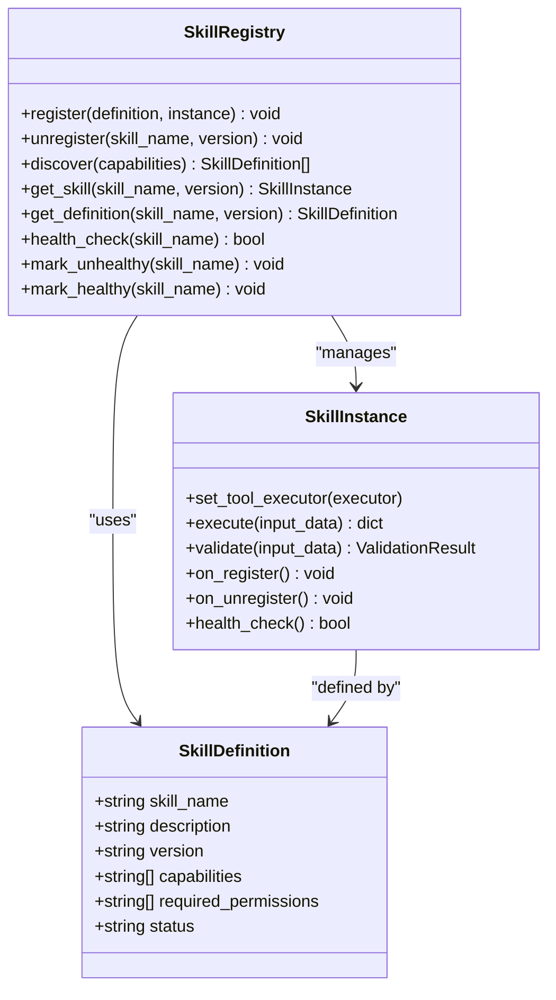
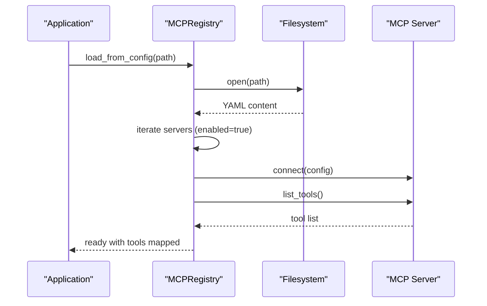
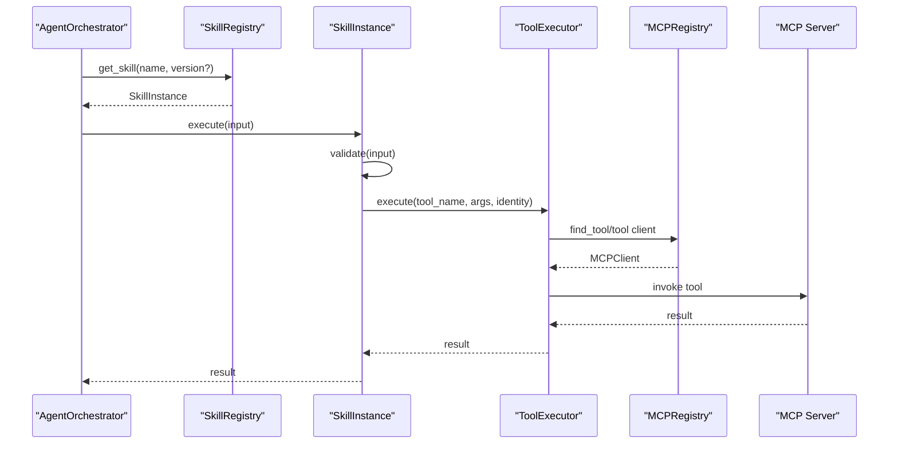
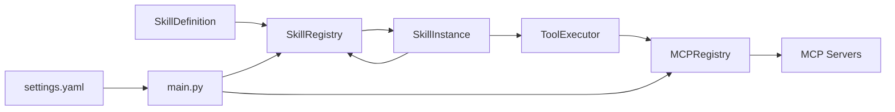
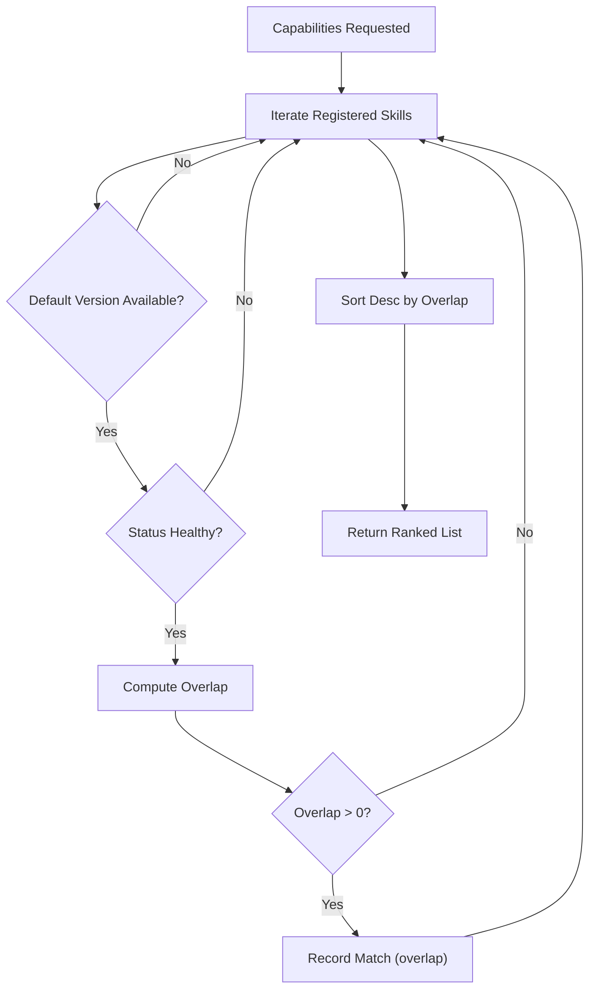

# Skills Configuration

<cite>
**Referenced Files in This Document**
- [skills.yaml](file://config/skills.yaml)
- [mcp_servers.yaml](file://config/mcp_servers.yaml)
- [settings.yaml](file://config/settings.yaml)
- [schemas.py](file://src/aiops_agent/models/schemas.py)
- [registry.py](file://src/aiops_agent/skills/registry.py)
- [base.py](file://src/aiops_agent/skills/base.py)
- [monitoring.py](file://src/aiops_agent/skills/monitoring.py)
- [troubleshooting.py](file://src/aiops_agent/skills/troubleshooting.py)
- [change_management.py](file://src/aiops_agent/skills/change_management.py)
- [mcp_registry.py](file://src/aiops_agent/tools/mcp_registry.py)
- [main.py](file://src/aiops_agent/main.py)
</cite>

## Table of Contents
1. [Introduction](#introduction)
2. [Project Structure](#project-structure)
3. [Core Components](#core-components)
4. [Architecture Overview](#architecture-overview)
5. [Detailed Component Analysis](#detailed-component-analysis)
6. [Dependency Analysis](#dependency-analysis)
7. [Performance Considerations](#performance-considerations)
8. [Troubleshooting Guide](#troubleshooting-guide)
9. [Conclusion](#conclusion)
10. [Appendices](#appendices)

## Introduction
This document explains the skills marketplace configuration system used by the AIOps Agent. It covers how to configure skill availability and marketplace metadata, define capabilities and permissions, manage skill dependencies, register skills at runtime, validate configurations, and control runtime behavior. It also provides examples for setting up the marketplace, integrating custom skills, validating configuration, managing versions and updates, and troubleshooting common issues.

## Project Structure
The skills marketplace spans configuration files, shared data models, skill base classes, skill implementations, and the skill registry. MCP server configuration and discovery are handled separately but integrate with the skill execution pipeline.

**Diagram sources**
- [skills.yaml:1-77](file://config/skills.yaml#L1-L77)
- [mcp_servers.yaml:1-41](file://config/mcp_servers.yaml#L1-L41)
- [settings.yaml:1-85](file://config/settings.yaml#L1-L85)
- [schemas.py:283-313](file://src/aiops_agent/models/schemas.py#L283-L313)
- [registry.py:19-284](file://src/aiops_agent/skills/registry.py#L19-L284)
- [base.py:21-93](file://src/aiops_agent/skills/base.py#L21-L93)
- [monitoring.py:18-140](file://src/aiops_agent/skills/monitoring.py#L18-L140)
- [troubleshooting.py:18-152](file://src/aiops_agent/skills/troubleshooting.py#L18-L152)
- [change_management.py:18-178](file://src/aiops_agent/skills/change_management.py#L18-L178)
- [mcp_registry.py:20-162](file://src/aiops_agent/tools/mcp_registry.py#L20-L162)
- [main.py:70-222](file://src/aiops_agent/main.py#L70-L222)

**Section sources**
- [skills.yaml:1-77](file://config/skills.yaml#L1-L77)
- [mcp_servers.yaml:1-41](file://config/mcp_servers.yaml#L1-L41)
- [settings.yaml:1-85](file://config/settings.yaml#L1-L85)
- [schemas.py:283-313](file://src/aiops_agent/models/schemas.py#L283-L313)
- [registry.py:19-284](file://src/aiops_agent/skills/registry.py#L19-L284)
- [base.py:21-93](file://src/aiops_agent/skills/base.py#L21-L93)
- [monitoring.py:18-140](file://src/aiops_agent/skills/monitoring.py#L18-L140)
- [troubleshooting.py:18-152](file://src/aiops_agent/skills/troubleshooting.py#L18-L152)
- [change_management.py:18-178](file://src/aiops_agent/skills/change_management.py#L18-L178)
- [mcp_registry.py:20-162](file://src/aiops_agent/tools/mcp_registry.py#L20-L162)
- [main.py:70-222](file://src/aiops_agent/main.py#L70-L222)

## Core Components
- SkillDefinition: Defines skill metadata, capabilities, permissions, and marketplace fields used by the registry and marketplace UI.
- SkillInstance: Base interface for skills with execute, validate, lifecycle hooks, and optional ToolExecutor injection.
- SkillRegistry: Registers/unregisters skills, discovers by capability intersection, manages versions and health, and routes to default versions.
- MCPRegistry: Loads MCP server configurations, connects/disconnects servers, and maintains tool-to-server mapping.
- ToolExecutor: Bridges skills to MCP tools and local actions via injected MCPRegistry and credential/permission guards.
- Application bootstrap: Initializes components, loads settings, registers default skills, and connects MCP servers.

Key runtime behaviors:
- Capability-based discovery: Skills are matched by capability overlap; higher overlap ranks earlier.
- Versioning: Multiple versions per skill supported; default version is the latest healthy version.
- Health management: Periodic health checks mark skills healthy/unhealthy; unhealthy skills are excluded from routing.
- Permissions: Skills declare required permissions; execution is gated by PermissionGate and WorkloadIdentity.

**Section sources**
- [schemas.py:283-313](file://src/aiops_agent/models/schemas.py#L283-L313)
- [base.py:21-93](file://src/aiops_agent/skills/base.py#L21-L93)
- [registry.py:19-284](file://src/aiops_agent/skills/registry.py#L19-L284)
- [mcp_registry.py:20-162](file://src/aiops_agent/tools/mcp_registry.py#L20-L162)
- [main.py:70-222](file://src/aiops_agent/main.py#L70-L222)

## Architecture Overview
The skills marketplace integrates configuration-driven skill definitions with runtime discovery and execution. MCP servers provide tools that skills invoke through ToolExecutor.

**Diagram sources**
- [main.py:225-293](file://src/aiops_agent/main.py#L225-L293)
- [registry.py:122-153](file://src/aiops_agent/skills/registry.py#L122-L153)
- [mcp_registry.py:38-69](file://src/aiops_agent/tools/mcp_registry.py#L38-L69)
- [monitoring.py:30-48](file://src/aiops_agent/skills/monitoring.py#L30-L48)
- [troubleshooting.py:30-47](file://src/aiops_agent/skills/troubleshooting.py#L30-L47)
- [change_management.py:29-44](file://src/aiops_agent/skills/change_management.py#L29-L44)

## Detailed Component Analysis

### Skill Definition and Marketplace Metadata
- Fields include skill_name, description, version, capabilities, required_permissions, and marketplace fields (author, category, icon, tags, install_count, rating, updated_at, readme).
- These fields support marketplace presentation and installation management.

Configuration examples:
- Skill definitions are declared in the skills configuration file and mirrored in the application’s default registration routine.

Validation:
- Registry enforces completeness during registration (non-empty skill_name, description, version).

**Section sources**
- [schemas.py:283-306](file://src/aiops_agent/models/schemas.py#L283-L306)
- [registry.py:257-267](file://src/aiops_agent/skills/registry.py#L257-L267)
- [skills.yaml:3-76](file://config/skills.yaml#L3-L76)

### Capability Definitions and Matching
- Each skill declares a list of capabilities.
- Discovery computes overlap between requested capabilities and a skill’s capabilities; results are sorted by overlap.

**Diagram sources**
- [registry.py:122-153](file://src/aiops_agent/skills/registry.py#L122-L153)

**Section sources**
- [registry.py:122-153](file://src/aiops_agent/skills/registry.py#L122-L153)

### Skill Registration and Lifecycle
- Registration validates definition completeness and uniqueness (skill_name + version).
- On successful registration, lifecycle hook is invoked; default version is updated if the skill is healthy.
- Unregistration supports removing a specific version or all versions, with cleanup and default version recalculation.

**Diagram sources**
- [schemas.py:283-306](file://src/aiops_agent/models/schemas.py#L283-L306)
- [base.py:21-93](file://src/aiops_agent/skills/base.py#L21-L93)
- [registry.py:19-284](file://src/aiops_agent/skills/registry.py#L19-L284)

**Section sources**
- [registry.py:41-117](file://src/aiops_agent/skills/registry.py#L41-L117)
- [base.py:74-92](file://src/aiops_agent/skills/base.py#L74-L92)

### MCP Server Configuration and Tool Discovery
- MCP servers are configured in YAML with transport modes (stdio, sse, streamable-http), command/args for stdio, or URL for SSE/HTTP.
- The MCP registry loads the configuration, connects to enabled servers, lists tools, and maintains tool-to-server mappings.

**Diagram sources**
- [mcp_registry.py:122-153](file://src/aiops_agent/tools/mcp_registry.py#L122-L153)
- [mcp_servers.yaml:3-40](file://config/mcp_servers.yaml#L3-L40)

**Section sources**
- [mcp_registry.py:122-153](file://src/aiops_agent/tools/mcp_registry.py#L122-L153)
- [mcp_servers.yaml:1-41](file://config/mcp_servers.yaml#L1-L41)

### Skill Execution Pipeline and Permissions
- Skills inherit from SkillInstance and implement execute/validate.
- ToolExecutor resolves tools via MCPRegistry and executes them with WorkloadIdentity and permission gating.
- Skills declare required permissions; execution is gated by PermissionGate and WorkloadIdentityManager.

**Diagram sources**
- [monitoring.py:30-48](file://src/aiops_agent/skills/monitoring.py#L30-L48)
- [troubleshooting.py:30-47](file://src/aiops_agent/skills/troubleshooting.py#L30-L47)
- [change_management.py:29-44](file://src/aiops_agent/skills/change_management.py#L29-L44)
- [base.py:42-45](file://src/aiops_agent/skills/base.py#L42-L45)
- [mcp_registry.py:95-112](file://src/aiops_agent/tools/mcp_registry.py#L95-L112)

**Section sources**
- [monitoring.py:30-139](file://src/aiops_agent/skills/monitoring.py#L30-L139)
- [troubleshooting.py:30-151](file://src/aiops_agent/skills/troubleshooting.py#L30-L151)
- [change_management.py:29-177](file://src/aiops_agent/skills/change_management.py#L29-L177)
- [base.py:42-92](file://src/aiops_agent/skills/base.py#L42-L92)

### Runtime Behavior Controls
- Health checks: Skills can override health_check; registry marks/unmarks status and updates default version accordingly.
- Default version selection: Latest healthy version becomes default; unhealthy versions are excluded from routing.
- Parallelism and timeouts: Controlled via settings (tool/skill execution timeouts, orchestrator parallelism).
- Observability: Tracing, metrics, and structured logging are initialized from settings.

**Section sources**
- [registry.py:213-251](file://src/aiops_agent/skills/registry.py#L213-L251)
- [registry.py:269-283](file://src/aiops_agent/skills/registry.py#L269-L283)
- [settings.yaml:44-60](file://config/settings.yaml#L44-L60)
- [main.py:85-96](file://src/aiops_agent/main.py#L85-L96)

## Dependency Analysis
- SkillRegistry depends on SkillDefinition and SkillInstance; it orchestrates discovery and health.
- SkillInstance depends on ToolExecutor for tool invocation; ToolExecutor depends on MCPRegistry and security components.
- MCPRegistry depends on MCP server configuration and provides tool definitions to ToolExecutor.
- Application bootstrap wires all components and registers default skills.

**Diagram sources**
- [schemas.py:283-306](file://src/aiops_agent/models/schemas.py#L283-L306)
- [registry.py:19-284](file://src/aiops_agent/skills/registry.py#L19-L284)
- [base.py:21-93](file://src/aiops_agent/skills/base.py#L21-L93)
- [mcp_registry.py:20-162](file://src/aiops_agent/tools/mcp_registry.py#L20-L162)
- [main.py:70-222](file://src/aiops_agent/main.py#L70-L222)

**Section sources**
- [registry.py:19-284](file://src/aiops_agent/skills/registry.py#L19-L284)
- [mcp_registry.py:20-162](file://src/aiops_agent/tools/mcp_registry.py#L20-L162)
- [main.py:70-222](file://src/aiops_agent/main.py#L70-L222)

## Performance Considerations
- Capability matching is O(N*M) where N is number of registered skills and M is average number of capabilities per skill; keep capability lists concise.
- Health checks run periodically; tune intervals via settings to balance responsiveness and overhead.
- Tool execution timeouts should exceed expected operation durations; adjust settings to prevent premature cancellations.
- Parallel subtask execution is bounded by orchestrator configuration; avoid excessive concurrency to prevent resource contention.

[No sources needed since this section provides general guidance]

## Troubleshooting Guide
Common issues and resolutions:
- Skill registration fails due to missing fields: Ensure skill_name, description, and version are present in definitions.
- Duplicate version registered: Each skill_name/version combination must be unique; remove conflicting entries.
- No matching skills found: Verify requested capabilities overlap with skill capabilities; check discovery logic and enabled status.
- MCP server connection failures: Confirm transport configuration, command/args for stdio, or URL for SSE/HTTP; ensure server is reachable.
- Tool not found: Ensure the tool exists on the MCP server and MCP registry loaded the server successfully.
- Permission denied: Review skill required_permissions and compare with WorkloadIdentity permissions; adjust policies or identity configuration.
- Health check failures: Investigate skill-specific health_check implementation and underlying tool connectivity.

**Section sources**
- [registry.py:55-64](file://src/aiops_agent/skills/registry.py#L55-L64)
- [registry.py:213-237](file://src/aiops_agent/skills/registry.py#L213-L237)
- [mcp_registry.py:128-152](file://src/aiops_agent/tools/mcp_registry.py#L128-L152)
- [monitoring.py:43-48](file://src/aiops_agent/skills/monitoring.py#L43-L48)
- [troubleshooting.py:43-47](file://src/aiops_agent/skills/troubleshooting.py#L43-L47)
- [change_management.py:40-44](file://src/aiops_agent/skills/change_management.py#L40-L44)

## Conclusion
The skills marketplace configuration system combines declarative skill definitions, capability-based discovery, robust versioning, and MCP-powered tool execution. By adhering to the schemas, ensuring proper permissions, and leveraging health checks and observability, operators can reliably configure, validate, and operate a scalable skills ecosystem.

[No sources needed since this section summarizes without analyzing specific files]

## Appendices

### A. Configuration Schemas and Examples

- Skills configuration template:
  - Fields: skill_name, description, version, capabilities, required_permissions, enabled.
  - Example entries: monitoring, troubleshooting, change_management, capacity_planning, incident_response, knowledge_base.

- MCP servers configuration template:
  - Fields: server_name, transport, command/args (stdio), url (SSE/HTTP), env, enabled.
  - Example entries: cloud_monitor, sls, ecs_vpc_rds.

- Settings configuration template:
  - Sections: llm providers, agent_identity, timeouts, retry, orchestrator, observability, data_residency.

**Section sources**
- [skills.yaml:3-76](file://config/skills.yaml#L3-L76)
- [mcp_servers.yaml:3-40](file://config/mcp_servers.yaml#L3-L40)
- [settings.yaml:1-85](file://config/settings.yaml#L1-L85)

### B. Skill Registration Process

- Default skills registration:
  - Application constructs SkillDefinition instances and Monitoring/Troubleshooting/ChangeManagement skill instances.
  - Injects ToolExecutor into each skill and registers via SkillRegistry.

- Custom skill integration:
  - Define a new SkillInstance subclass implementing execute and validate.
  - Create a SkillDefinition with appropriate capabilities and permissions.
  - Instantiate the skill, inject ToolExecutor, and register with SkillRegistry.

**Section sources**
- [main.py:225-293](file://src/aiops_agent/main.py#L225-L293)
- [base.py:42-92](file://src/aiops_agent/skills/base.py#L42-L92)
- [registry.py:41-81](file://src/aiops_agent/skills/registry.py#L41-L81)

### C. Versioning and Update Mechanisms

- Multiple versions per skill_name are supported; each version is validated and registered independently.
- Default version is the latest healthy version; unhealthy versions are excluded from routing.
- To update a skill, register a new version with an incremented version field; the registry will select the newest healthy version as default.

**Section sources**
- [registry.py:31-71](file://src/aiops_agent/skills/registry.py#L31-L71)
- [registry.py:269-283](file://src/aiops_agent/skills/registry.py#L269-L283)

### D. Capability-Based Discovery Workflow

**Diagram sources**
- [registry.py:122-153](file://src/aiops_agent/skills/registry.py#L122-L153)