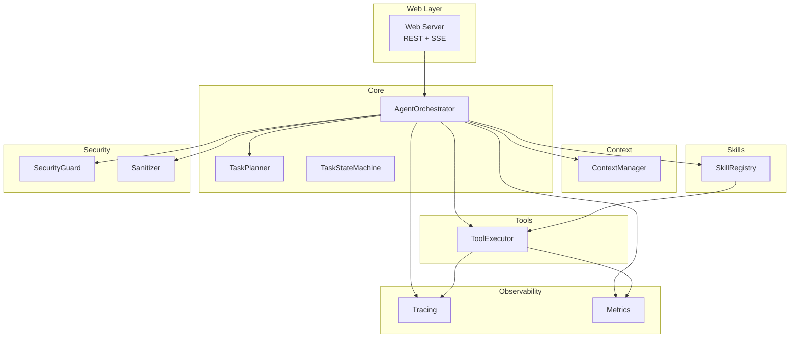
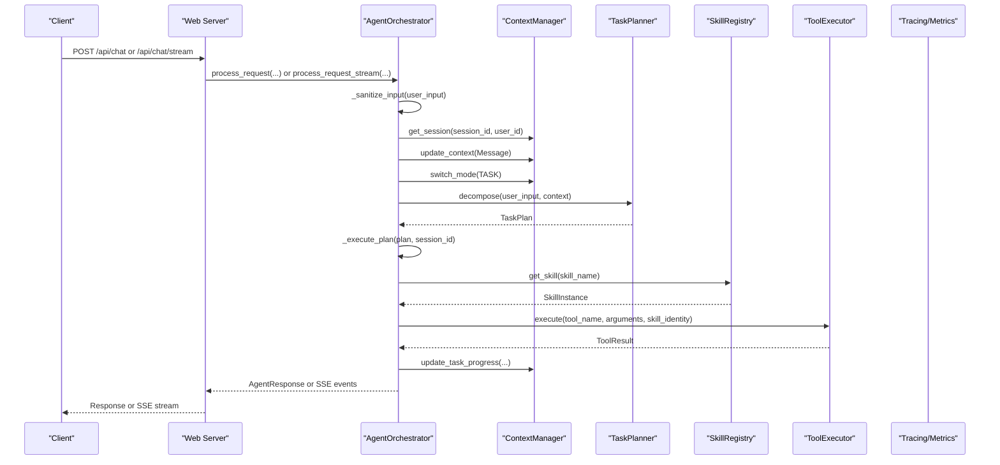
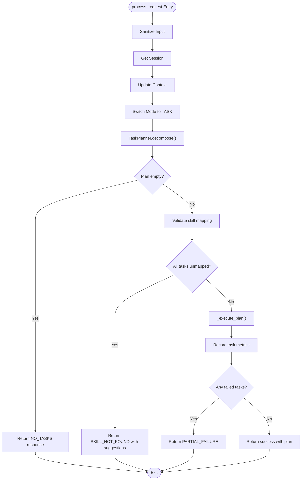
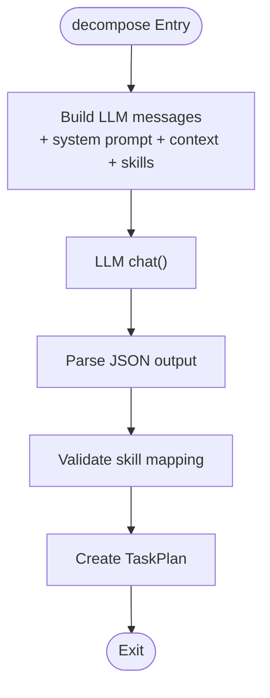
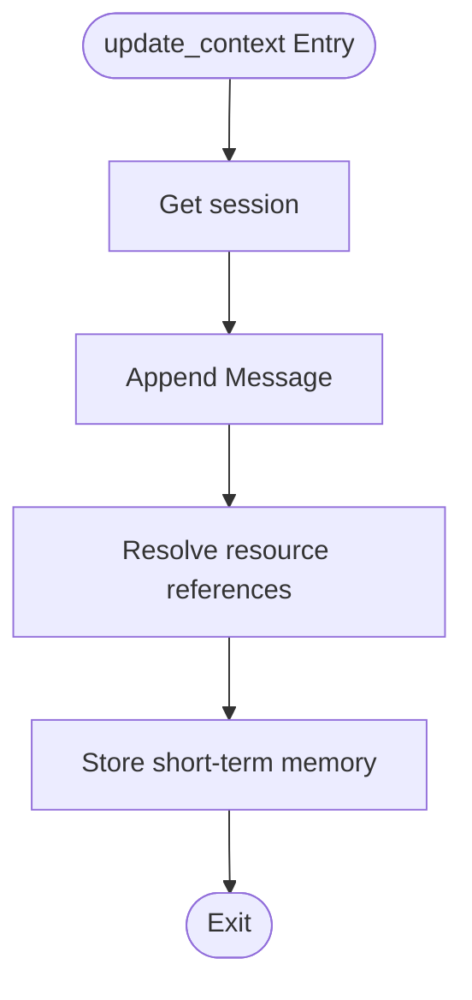
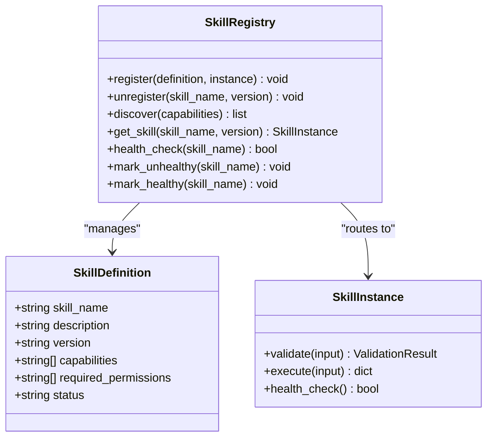
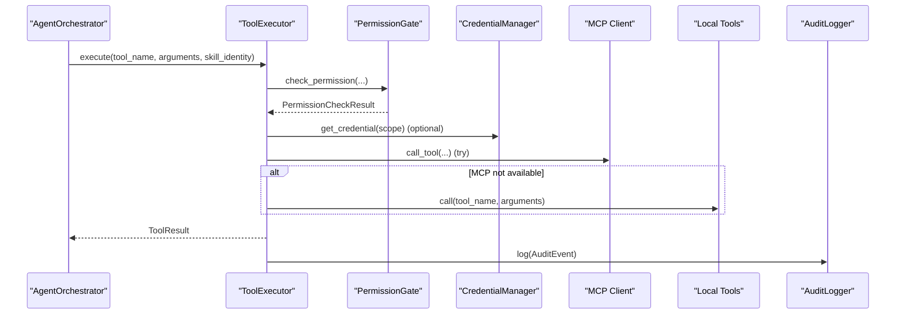
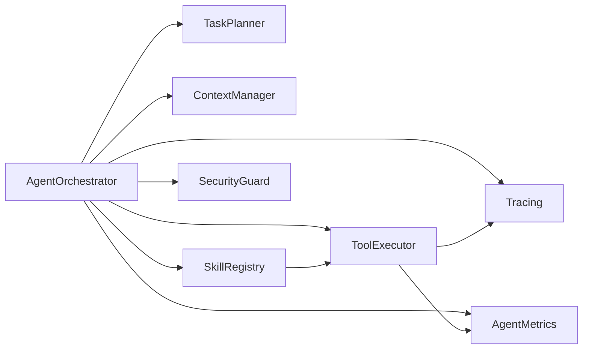
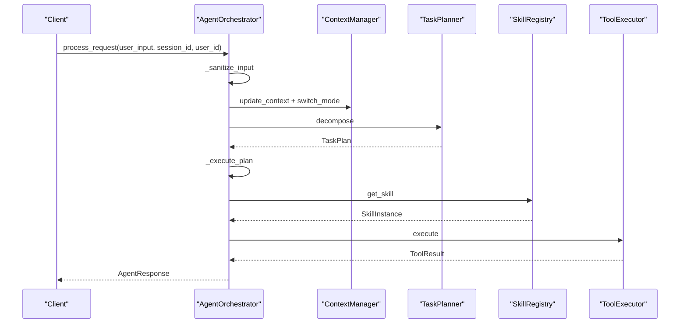
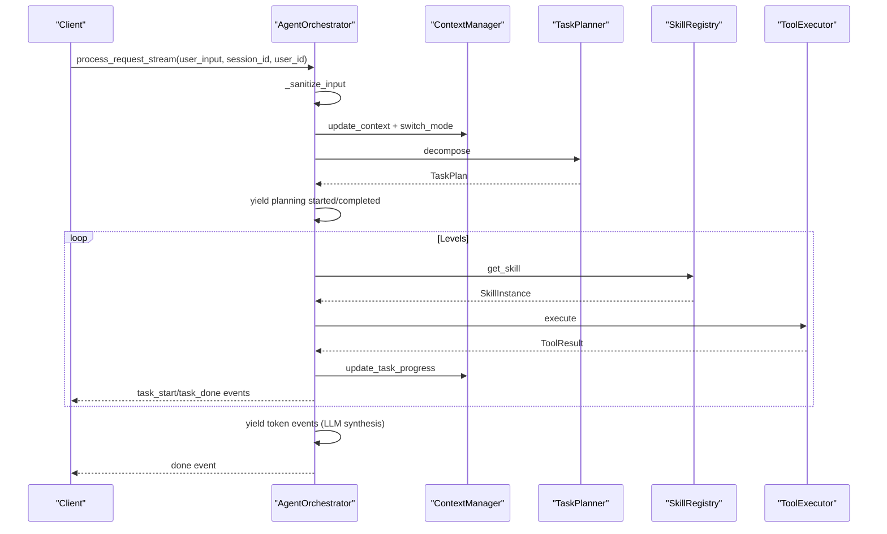

# Agent Orchestrator

<cite>
**Referenced Files in This Document**
- [orchestrator.py](file://src/aiops_agent/core/orchestrator.py)
- [task_planner.py](file://src/aiops_agent/core/task_planner.py)
- [manager.py](file://src/aiops_agent/context/manager.py)
- [executor.py](file://src/aiops_agent/tools/executor.py)
- [registry.py](file://src/aiops_agent/skills/registry.py)
- [schemas.py](file://src/aiops_agent/models/schemas.py)
- [tracing.py](file://src/aiops_agent/observability/tracing.py)
- [metrics.py](file://src/aiops_agent/observability/metrics.py)
- [sanitizer.py](file://src/aiops_agent/security/sanitizer.py)
- [state_machine.py](file://src/aiops_agent/core/state_machine.py)
- [main.py](file://src/aiops_agent/main.py)
- [server.py](file://src/aiops_agent/web/server.py)
- [settings.yaml](file://config/settings.yaml)
</cite>

## Table of Contents
1. [Introduction](#introduction)
2. [Project Structure](#project-structure)
3. [Core Components](#core-components)
4. [Architecture Overview](#architecture-overview)
5. [Detailed Component Analysis](#detailed-component-analysis)
6. [Dependency Analysis](#dependency-analysis)
7. [Performance Considerations](#performance-considerations)
8. [Troubleshooting Guide](#troubleshooting-guide)
9. [Conclusion](#conclusion)
10. [Appendices](#appendices)

## Introduction
The Agent Orchestrator is the central coordinator of the AIOps Agent system. It integrates TaskPlanner, SkillRegistry, ContextManager, and ToolExecutor to orchestrate end-to-end request processing. The orchestrator handles input sanitization, context management, task decomposition, DAG execution with concurrency control, and response generation. It supports both synchronous and streaming processing modes with structured events and data flows. The orchestrator also implements robust error handling, health monitoring for skills, and OpenTelemetry tracing integration for observability.

## Project Structure
The orchestrator sits at the core of the system and coordinates several subsystems:
- Core orchestration and state machine
- Task planning and DAG execution
- Context management for sessions and progress
- Tool execution with permission gating and auditing
- Skill registry and health monitoring
- Observability (tracing and metrics)
- Security (input sanitization and audit logging)
- Web server exposing REST APIs and SSE streaming

**Diagram sources**
- [server.py:196-227](file://src/aiops_agent/web/server.py#L196-L227)
- [orchestrator.py:47-67](file://src/aiops_agent/core/orchestrator.py#L47-L67)
- [task_planner.py:32-49](file://src/aiops_agent/core/task_planner.py#L32-L49)
- [manager.py:25-45](file://src/aiops_agent/context/manager.py#L25-L45)
- [registry.py:19-36](file://src/aiops_agent/skills/registry.py#L19-L36)
- [executor.py:45-75](file://src/aiops_agent/tools/executor.py#L45-L75)
- [tracing.py:32-87](file://src/aiops_agent/observability/tracing.py#L32-L87)
- [metrics.py:26-76](file://src/aiops_agent/observability/metrics.py#L26-L76)
- [sanitizer.py:39-58](file://src/aiops_agent/security/sanitizer.py#L39-L58)

**Section sources**
- [main.py:70-222](file://src/aiops_agent/main.py#L70-L222)
- [server.py:196-227](file://src/aiops_agent/web/server.py#L196-L227)

## Core Components
- AgentOrchestrator: Central coordinator managing request lifecycle, DAG execution, error handling, and health monitoring.
- TaskPlanner: Decomposes user requests into TaskPlan with SubTasks and builds DAG dependencies.
- ContextManager: Manages session state, updates context, switches interaction modes, and tracks task progress.
- SkillRegistry: Registers, discovers, and manages skill instances with health status and versioning.
- ToolExecutor: Executes tools with permission checks, credential acquisition, retries, sanitization, and audit logging.
- Observability: Tracing and metrics collection for end-to-end visibility.
- Security: Input sanitization and audit logging for compliance.

**Section sources**
- [orchestrator.py:47-67](file://src/aiops_agent/core/orchestrator.py#L47-L67)
- [task_planner.py:32-49](file://src/aiops_agent/core/task_planner.py#L32-L49)
- [manager.py:25-45](file://src/aiops_agent/context/manager.py#L25-L45)
- [registry.py:19-36](file://src/aiops_agent/skills/registry.py#L19-L36)
- [executor.py:45-75](file://src/aiops_agent/tools/executor.py#L45-L75)
- [tracing.py:32-87](file://src/aiops_agent/observability/tracing.py#L32-L87)
- [metrics.py:26-76](file://src/aiops_agent/observability/metrics.py#L26-L76)
- [sanitizer.py:39-58](file://src/aiops_agent/security/sanitizer.py#L39-L58)

## Architecture Overview
The orchestrator coordinates a request from input to completion:
- Input sanitization and security guard checks
- Context update and mode switching to task mode
- Task decomposition via TaskPlanner
- DAG execution with parallelism and dependency cancellation
- Skill routing and execution with validation
- Progress tracking and context updates
- Final synthesis via LLM for streaming mode
- Structured response generation

**Diagram sources**
- [server.py:44-135](file://src/aiops_agent/web/server.py#L44-L135)
- [orchestrator.py:84-197](file://src/aiops_agent/core/orchestrator.py#L84-L197)
- [task_planner.py:50-113](file://src/aiops_agent/core/task_planner.py#L50-L113)
- [manager.py:50-122](file://src/aiops_agent/context/manager.py#L50-L122)
- [registry.py:159-182](file://src/aiops_agent/skills/registry.py#L159-L182)
- [executor.py:80-226](file://src/aiops_agent/tools/executor.py#L80-L226)

## Detailed Component Analysis

### AgentOrchestrator
Responsibilities:
- Request lifecycle: input sanitization, context management, task decomposition, DAG execution, response synthesis.
- Streaming mode: yields structured SSE events for planning, task execution, and final completion.
- Health monitoring: tracks skill failures and marks unhealthy skills.
- Error handling: structured AgentResponse with suggestions and trace IDs.
- OpenTelemetry tracing: spans around orchestration and child spans for tool execution.

Key methods and flows:
- Synchronous processing: process_request
- Streaming processing: process_request_stream with event types: planning, task_start, task_done, error, token, done
- DAG execution: _execute_plan with topological sorting and concurrency control
- Skill routing: _route_to_skill with validation and state transitions
- Failure recording: _record_skill_failure with health window and threshold
- Input sanitization: _sanitize_input with injection detection patterns

**Diagram sources**
- [orchestrator.py:84-197](file://src/aiops_agent/core/orchestrator.py#L84-L197)
- [task_planner.py:50-113](file://src/aiops_agent/core/task_planner.py#L50-L113)

**Section sources**
- [orchestrator.py:47-197](file://src/aiops_agent/core/orchestrator.py#L47-L197)
- [state_machine.py:26-92](file://src/aiops_agent/core/state_machine.py#L26-L92)

### TaskPlanner
Responsibilities:
- Decompose user requests into TaskPlan using LLM with system prompts and available skills.
- Parse LLM output into SubTasks with task_id, skill_name, action, parameters, dependencies.
- Validate skill mapping and mark missing skills as failed.
- Topological sort to build execution levels for DAG execution.

**Diagram sources**
- [task_planner.py:50-113](file://src/aiops_agent/core/task_planner.py#L50-L113)

**Section sources**
- [task_planner.py:32-151](file://src/aiops_agent/core/task_planner.py#L32-L151)

### ContextManager
Responsibilities:
- Manage session state, messages, and resource references.
- Auto-resolve resource references from messages.
- Switch interaction modes (CHAT/TASK/WATCH) and track task progress.
- Persist sessions and idle session checks.

**Diagram sources**
- [manager.py:58-89](file://src/aiops_agent/context/manager.py#L58-L89)

**Section sources**
- [manager.py:25-193](file://src/aiops_agent/context/manager.py#L25-L193)

### SkillRegistry
Responsibilities:
- Register/unregister skills with validation and uniqueness checks.
- Discover skills by capability with fuzzy matching and ranking.
- Health management: mark unhealthy, mark healthy, health_check.
- Default version selection and dynamic loading/unloading.

**Diagram sources**
- [registry.py:19-284](file://src/aiops_agent/skills/registry.py#L19-L284)
- [schemas.py:283-313](file://src/aiops_agent/models/schemas.py#L283-L313)

**Section sources**
- [registry.py:19-284](file://src/aiops_agent/skills/registry.py#L19-L284)

### ToolExecutor
Responsibilities:
- Unified tool execution entry with permission gate, credential acquisition, MCP/local tool dispatch, retries, sanitization, and audit logging.
- Supports sync, async, and stream execution modes.
- OpenTelemetry tracing for tool spans.

**Diagram sources**
- [executor.py:80-226](file://src/aiops_agent/tools/executor.py#L80-L226)

**Section sources**
- [executor.py:45-314](file://src/aiops_agent/tools/executor.py#L45-L314)

### Observability and Security
- Tracing: OpenTelemetry TracerProvider configured with console or SLS exporters; @traced decorator for automatic spans.
- Metrics: AgentMetrics counters and histograms for tasks, durations, permissions denied, security events, tool calls, and LLM calls.
- Sanitization: Recursive parameter sanitization for sensitive fields (password, token, access_key, etc.).

**Section sources**
- [tracing.py:32-137](file://src/aiops_agent/observability/tracing.py#L32-L137)
- [metrics.py:26-150](file://src/aiops_agent/observability/metrics.py#L26-L150)
- [sanitizer.py:39-80](file://src/aiops_agent/security/sanitizer.py#L39-L80)

## Dependency Analysis
The orchestrator depends on:
- LLMProviderFactory for task decomposition and synthesis
- SkillRegistry for skill discovery and execution
- ContextManager for session and progress management
- ToolExecutor for tool invocation
- SecurityGuard for input sanitization
- AgentMetrics for telemetry
- OpenTelemetry tracing for distributed tracing

**Diagram sources**
- [orchestrator.py:59-75](file://src/aiops_agent/core/orchestrator.py#L59-L75)
- [registry.py:19-36](file://src/aiops_agent/skills/registry.py#L19-L36)
- [executor.py:45-75](file://src/aiops_agent/tools/executor.py#L45-L75)

**Section sources**
- [orchestrator.py:17-38](file://src/aiops_agent/core/orchestrator.py#L17-L38)
- [main.py:20-41](file://src/aiops_agent/main.py#L20-L41)

## Performance Considerations
- Concurrency control: The orchestrator limits concurrent subtasks to a fixed semaphore during DAG execution to prevent resource exhaustion.
- Retry and timeout: ToolExecutor applies exponential backoff and configurable timeouts to improve resilience.
- Health monitoring: Continuous skill failure tracking triggers unhealthy marking to avoid routing failing skills.
- Metrics: Task durations and counts enable performance monitoring and alerting.
- Streaming: SSE streaming reduces perceived latency by yielding intermediate events.

Practical recommendations:
- Tune max_parallel_subtasks in configuration to match cluster capacity.
- Adjust retry and timeout settings based on tool characteristics.
- Monitor skill_unhealthy events and remediate failing skills promptly.
- Use tracing to identify slow spans and optimize bottlenecks.

**Section sources**
- [orchestrator.py:451-460](file://src/aiops_agent/core/orchestrator.py#L451-L460)
- [executor.py:231-275](file://src/aiops_agent/tools/executor.py#L231-L275)
- [settings.yaml:56-61](file://config/settings.yaml#L56-L61)

## Troubleshooting Guide
Common issues and resolutions:
- No tasks generated: Verify TaskPlanner output parsing and skill availability; check available skills in the registry.
- Skill not found: Ensure skills are registered and healthy; confirm capability mapping aligns with user intent.
- Permission denied: Review PermissionGate policies and required permissions for the tool; adjust RAM policies if needed.
- Tool execution timeout: Increase tool_execution_seconds in settings; check network connectivity to MCP servers.
- Skill unhealthy: Investigate repeated failures; the orchestrator automatically marks skills unhealthy after threshold breaches.
- Streaming errors: Inspect SSE event types and error payloads; ensure client-side event handling is robust.

Operational checks:
- Health endpoint: GET /health and /ready endpoints indicate service status.
- Logs and traces: Enable JSON logging and configure SLS exporter for production environments.
- Metrics dashboard: Track task_total, task_duration, permission_denied_total, security_events_total.

**Section sources**
- [server.py:138-146](file://src/aiops_agent/web/server.py#L138-L146)
- [orchestrator.py:571-596](file://src/aiops_agent/core/orchestrator.py#L571-L596)
- [executor.py:231-275](file://src/aiops_agent/tools/executor.py#L231-L275)
- [settings.yaml:62-77](file://config/settings.yaml#L62-L77)

## Conclusion
The Agent Orchestrator provides a robust, observable, and secure foundation for AI-driven AIOps workflows. By integrating task decomposition, DAG execution, context management, and tool execution with comprehensive error handling and health monitoring, it enables reliable automation across diverse operational domains. The dual-mode processing (synchronous and streaming) ensures flexibility for different client needs, while OpenTelemetry tracing and metrics deliver deep insights into system behavior.

## Appendices

### Request Processing Workflows

#### Synchronous Workflow
- Input: user_input, session_id, user_id
- Steps: sanitize → update context → switch to TASK → decompose → execute plan → generate response
- Output: AgentResponse with success flag, message, data, error_code, suggestion, trace_id

**Diagram sources**
- [orchestrator.py:84-197](file://src/aiops_agent/core/orchestrator.py#L84-L197)
- [task_planner.py:50-113](file://src/aiops_agent/core/task_planner.py#L50-L113)
- [executor.py:80-226](file://src/aiops_agent/tools/executor.py#L80-L226)

#### Streaming Workflow
- Event types: planning, task_start, task_done, error, token, done
- Steps: same as synchronous plus incremental progress and LLM synthesis tokens
- Output: SSE stream with structured events and final completion

**Diagram sources**
- [orchestrator.py:203-418](file://src/aiops_agent/core/orchestrator.py#L203-L418)
- [task_planner.py:115-151](file://src/aiops_agent/core/task_planner.py#L115-L151)
- [executor.py:80-226](file://src/aiops_agent/tools/executor.py#L80-L226)

### Configuration Options
Key configuration areas:
- LLM providers: primary, fallback, models, timeouts
- Agent Identity: role ARN, OIDC provider ARN, region, token refresh
- Timeouts: tool_execution_seconds, skill_execution_seconds, session_idle_minutes
- Retry policy: max_retries, base_delay_seconds, max_delay_seconds
- Orchestrator: max_parallel_subtasks, skill_health_check_interval_minutes, skill_failure_threshold
- Observability: tracing exporter, metrics export interval, logging level/format
- Data residency: allowed regions

**Section sources**
- [settings.yaml:1-85](file://config/settings.yaml#L1-L85)
- [main.py:48-96](file://src/aiops_agent/main.py#L48-L96)

### Practical Examples
- Monitoring skill usage: query_metrics, query_logs, analyze_metrics
- Change management: risk assessment and rollback recommendation
- Troubleshooting: ECS health check, network diagnosis, RDS slow query analysis

These skills demonstrate capability-based routing and tool execution patterns integrated through the orchestrator.

**Section sources**
- [monitoring.py:18-140](file://src/aiops_agent/skills/monitoring.py#L18-L140)
- [main.py:225-293](file://src/aiops_agent/main.py#L225-L293)