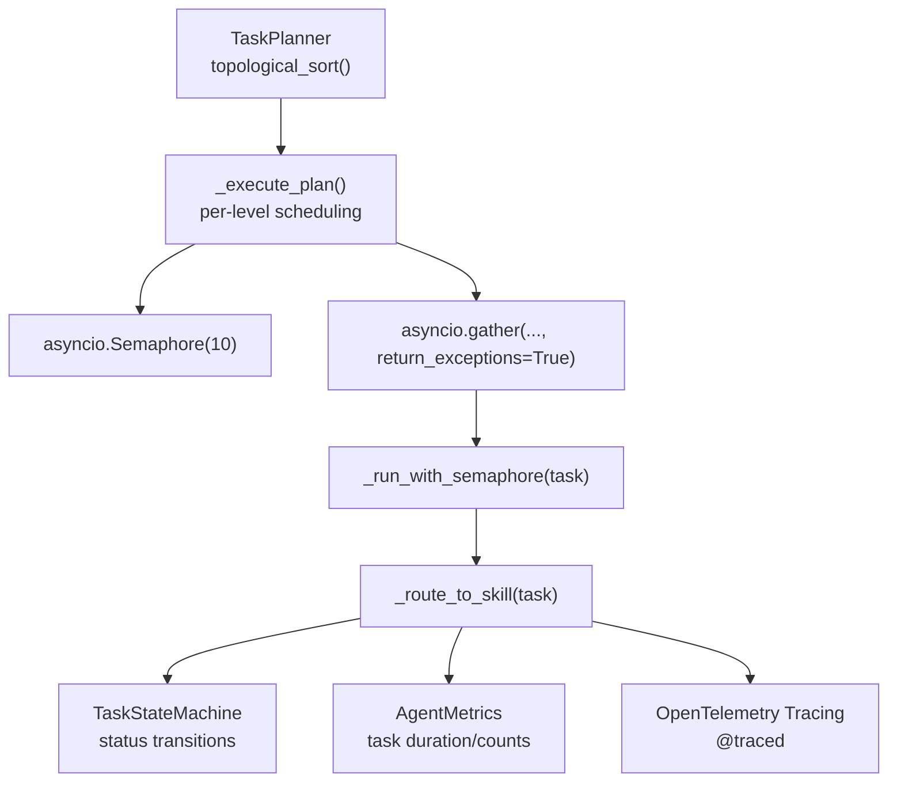
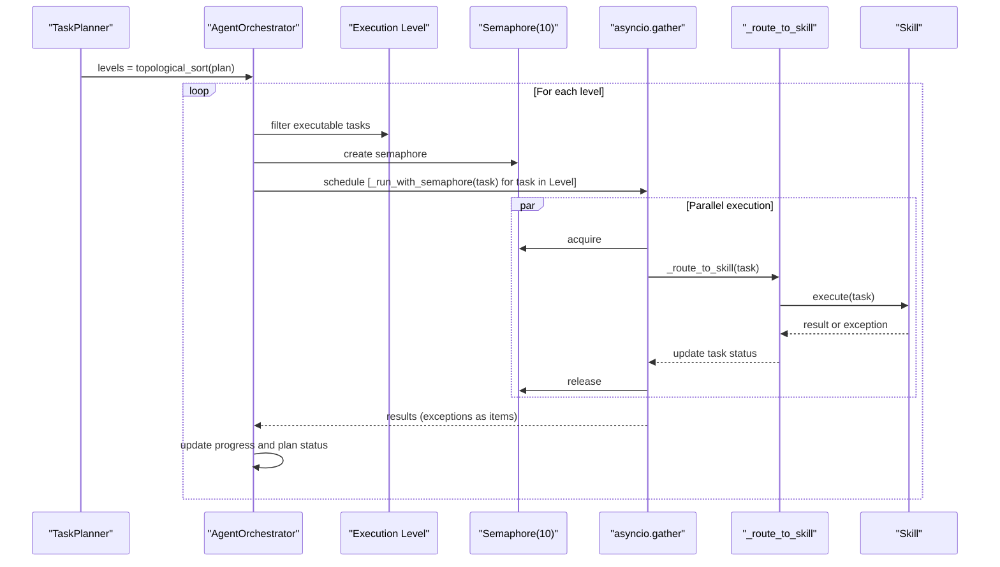
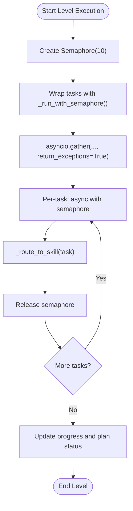
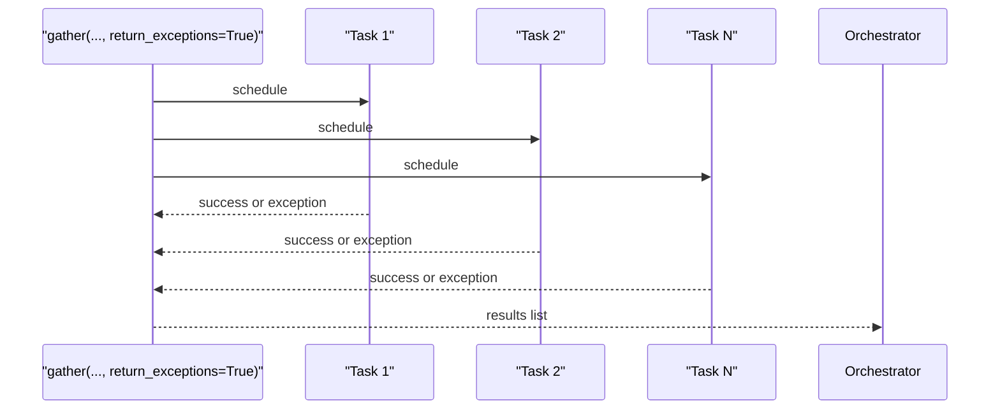
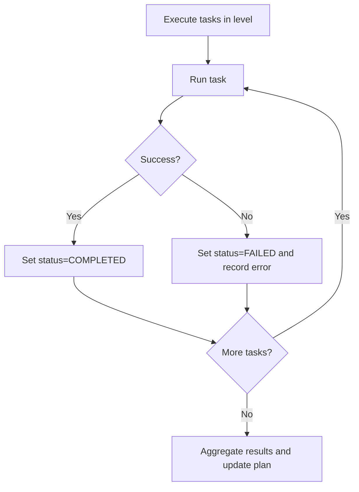
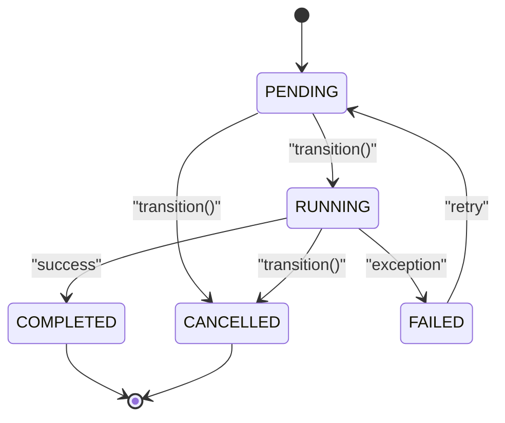
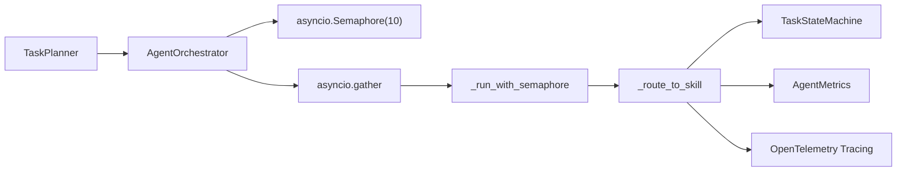

# Concurrency Control & Semaphore Management

<cite>
**Referenced Files in This Document**
- [orchestrator.py](file://src/aiops_agent/core/orchestrator.py)
- [task_planner.py](file://src/aiops_agent/core/task_planner.py)
- [state_machine.py](file://src/aiops_agent/core/state_machine.py)
- [schemas.py](file://src/aiops_agent/models/schemas.py)
- [executor.py](file://src/aiops_agent/tools/executor.py)
- [tracing.py](file://src/aiops_agent/observability/tracing.py)
- [metrics.py](file://src/aiops_agent/observability/metrics.py)
</cite>

## Table of Contents
1. [Introduction](#introduction)
2. [Project Structure](#project-structure)
3. [Core Components](#core-components)
4. [Architecture Overview](#architecture-overview)
5. [Detailed Component Analysis](#detailed-component-analysis)
6. [Dependency Analysis](#dependency-analysis)
7. [Performance Considerations](#performance-considerations)
8. [Troubleshooting Guide](#troubleshooting-guide)
9. [Conclusion](#conclusion)

## Introduction
This document explains the concurrency control mechanisms that manage parallel task execution within execution levels. It focuses on the semaphore-based approach with a fixed concurrency limit, async task coordination via asyncio.gather, and exception handling in parallel execution contexts. It also covers the _run_with_semaphore wrapper function, concurrent scheduling, failure propagation without blocking other executions, and practical guidance for tuning concurrency to maximize system throughput under varying resource constraints.

## Project Structure
The concurrency control resides primarily in the orchestrator’s DAG execution pipeline, which:
- Uses topological sorting to group tasks into levels (ready-to-execute sets).
- Applies a semaphore to cap concurrent tasks per level.
- Coordinates tasks with asyncio.gather and handles exceptions without stopping other tasks.

**Diagram sources**
- [orchestrator.py:424-483](file://src/aiops_agent/core/orchestrator.py#L424-L483)
- [task_planner.py:115-150](file://src/aiops_agent/core/task_planner.py#L115-L150)
- [state_machine.py:26-92](file://src/aiops_agent/core/state_machine.py#L26-L92)
- [metrics.py:26-106](file://src/aiops_agent/observability/metrics.py#L26-L106)
- [tracing.py:98-137](file://src/aiops_agent/observability/tracing.py#L98-L137)

**Section sources**
- [orchestrator.py:424-483](file://src/aiops_agent/core/orchestrator.py#L424-L483)
- [task_planner.py:115-150](file://src/aiops_agent/core/task_planner.py#L115-L150)

## Core Components
- Orchestrator._execute_plan: Implements per-level parallelism with a semaphore and gathers results with return_exceptions enabled.
- _run_with_semaphore: A lightweight wrapper that enforces concurrency limits around each task route.
- TaskPlanner.topological_sort: Produces execution levels that are safe to run concurrently within each level.
- TaskStateMachine: Enforces legal state transitions and supports retry flows after failure.
- AgentMetrics and OpenTelemetry tracing: Provide observability for throughput and latency.

Key concurrency control elements:
- Fixed concurrency limit of 10 per execution level via asyncio.Semaphore(10).
- Parallel scheduling using asyncio.gather with return_exceptions=True to prevent single failures from blocking others.
- Per-task routing through _route_to_skill, which updates statuses and records failures.

**Section sources**
- [orchestrator.py:450-460](file://src/aiops_agent/core/orchestrator.py#L450-L460)
- [orchestrator.py:453-455](file://src/aiops_agent/core/orchestrator.py#L453-L455)
- [task_planner.py:115-150](file://src/aiops_agent/core/task_planner.py#L115-L150)
- [state_machine.py:17-23](file://src/aiops_agent/core/state_machine.py#L17-L23)

## Architecture Overview
The orchestration pipeline groups tasks by readiness (no unresolved dependencies) and executes them in parallel up to a fixed limit. Failures are captured per task without affecting others, and the system continues to the next level after the current level completes.

**Diagram sources**
- [orchestrator.py:424-483](file://src/aiops_agent/core/orchestrator.py#L424-L483)
- [task_planner.py:115-150](file://src/aiops_agent/core/task_planner.py#L115-L150)

## Detailed Component Analysis

### Semaphore-Based Concurrency Control
- Fixed limit: Each execution level uses asyncio.Semaphore(10) to cap concurrent tasks.
- Wrapper function: _run_with_semaphore(task) ensures each task acquires/releases the semaphore around routing to the skill.
- Coordination: asyncio.gather schedules all tasks in the level and waits for completion with return_exceptions=True.

**Diagram sources**
- [orchestrator.py:450-460](file://src/aiops_agent/core/orchestrator.py#L450-L460)
- [orchestrator.py:453-455](file://src/aiops_agent/core/orchestrator.py#L453-L455)

**Section sources**
- [orchestrator.py:450-460](file://src/aiops_agent/core/orchestrator.py#L450-L460)
- [orchestrator.py:453-455](file://src/aiops_agent/core/orchestrator.py#L453-L455)

### Async Task Coordination with asyncio.gather
- All tasks in a level are scheduled concurrently.
- return_exceptions=True ensures that exceptions raised by individual tasks are returned as items rather than propagating and canceling others.
- After gather returns, the orchestrator updates progress and plan status based on completed tasks’ statuses.

**Diagram sources**
- [orchestrator.py:457-460](file://src/aiops_agent/core/orchestrator.py#L457-L460)

**Section sources**
- [orchestrator.py:457-460](file://src/aiops_agent/core/orchestrator.py#L457-L460)

### Exception Handling in Parallel Execution
- Per-task failure: _route_to_skill updates task.status to FAILED and records the error; other tasks continue.
- Level-level resilience: Because return_exceptions=True is used, a single failure does not block others.
- Progress tracking: The orchestrator aggregates completed and failed tasks to compute progress and finalize plan status.

**Diagram sources**
- [orchestrator.py:485-532](file://src/aiops_agent/core/orchestrator.py#L485-L532)

**Section sources**
- [orchestrator.py:485-532](file://src/aiops_agent/core/orchestrator.py#L485-L532)

### Relationship Between Concurrency Control and System Throughput
- Throughput increases with concurrency up to a point where external resources become saturated.
- Beyond the semaphore limit, tasks wait; too low a limit underestimates available parallelism; too high a limit risks resource contention and overhead.
- Observability (metrics and tracing) helps quantify impact of concurrency changes on latency and success rates.

**Section sources**
- [metrics.py:81-85](file://src/aiops_agent/observability/metrics.py#L81-L85)
- [tracing.py:119-132](file://src/aiops_agent/observability/tracing.py#L119-L132)

### Task State Machine and Retry Flow
- Legal transitions enforce deterministic lifecycle progression.
- FAILED tasks can transition back to PENDING to support retries, enabling recovery without restarting the entire plan.

**Diagram sources**
- [state_machine.py:17-23](file://src/aiops_agent/core/state_machine.py#L17-L23)
- [state_machine.py:51-78](file://src/aiops_agent/core/state_machine.py#L51-L78)

**Section sources**
- [state_machine.py:17-23](file://src/aiops_agent/core/state_machine.py#L17-L23)
- [state_machine.py:51-78](file://src/aiops_agent/core/state_machine.py#L51-L78)

### Data Model Context
- TaskStatus enum defines the canonical states used by the state machine and orchestrator logic.
- SubTask carries per-task metadata, including status, dependencies, and results.

**Section sources**
- [schemas.py:19-41](file://src/aiops_agent/models/schemas.py#L19-L41)

## Dependency Analysis
Concurrency control depends on:
- TaskPlanner for producing levels of ready-to-run tasks.
- Orchestrator for applying semaphores and coordinating execution.
- TaskStateMachine for enforcing state transitions and enabling retries.
- Metrics and tracing for measuring performance and diagnosing bottlenecks.

**Diagram sources**
- [task_planner.py:115-150](file://src/aiops_agent/core/task_planner.py#L115-L150)
- [orchestrator.py:424-483](file://src/aiops_agent/core/orchestrator.py#L424-L483)
- [state_machine.py:26-92](file://src/aiops_agent/core/state_machine.py#L26-L92)
- [metrics.py:26-106](file://src/aiops_agent/observability/metrics.py#L26-L106)
- [tracing.py:98-137](file://src/aiops_agent/observability/tracing.py#L98-L137)

**Section sources**
- [task_planner.py:115-150](file://src/aiops_agent/core/task_planner.py#L115-L150)
- [orchestrator.py:424-483](file://src/aiops_agent/core/orchestrator.py#L424-L483)

## Performance Considerations
- Optimal concurrency tuning:
  - Start with the default limit of 10 per level. Monitor task_duration histograms and success rates via metrics.
  - Increase limit cautiously when downstream resources (e.g., MCP servers, APIs) can handle more parallel requests without saturation.
  - Decrease limit if you observe increased latency, timeouts, or resource contention (CPU, memory, network).
- Resource contention scenarios:
  - Network-bound tasks: Limit may need adjustment based on connection pool sizes and server-side rate limits.
  - CPU-bound tasks: Excessive concurrency can increase context switching overhead; tune to match CPU cores and I/O characteristics.
- Throughput vs. latency trade-offs:
  - Higher concurrency often reduces end-to-end latency but can increase tail latency if resources are oversubscribed.
  - Use tracing spans to correlate concurrency changes with latency distributions.

[No sources needed since this section provides general guidance]

## Troubleshooting Guide
- Symptom: Some tasks fail while others succeed in the same level.
  - Cause: Individual task failure captured by return_exceptions=True; other tasks continue.
  - Action: Inspect task.error and logs; verify skill availability and parameters.
- Symptom: No tasks execute after a failure.
  - Cause: Not applicable in the current implementation; failures do not block others.
  - Action: Confirm that gather is invoked with return_exceptions=True and that task statuses are updated accordingly.
- Symptom: Unexpected delays or timeouts.
  - Cause: Semaphore limit may be too high for available downstream capacity; or tasks are waiting for shared resources.
  - Action: Reduce concurrency limit; monitor metrics and traces; adjust tool timeouts if needed.
- Observability:
  - Use AgentMetrics to track task counts and durations by status.
  - Use tracing spans to inspect per-task execution paths and exceptions.

**Section sources**
- [orchestrator.py:457-460](file://src/aiops_agent/core/orchestrator.py#L457-L460)
- [metrics.py:81-85](file://src/aiops_agent/observability/metrics.py#L81-L85)
- [tracing.py:119-132](file://src/aiops_agent/observability/tracing.py#L119-L132)

## Conclusion
The concurrency control mechanism employs a fixed semaphore limit per execution level, coordinated via asyncio.gather with return_exceptions enabled. This design ensures resilient parallel execution: failures do not block other tasks, and the system progresses through levels efficiently. By combining observability (metrics and tracing) with careful concurrency tuning, operators can optimize throughput while avoiding resource contention and maintaining stability.