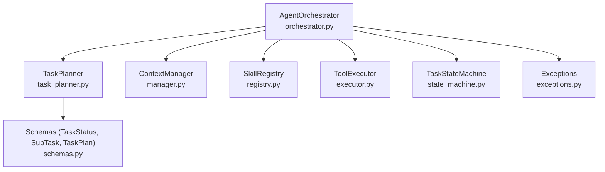
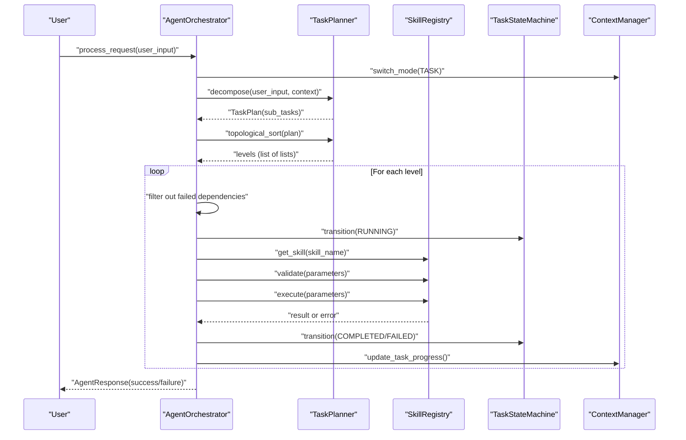
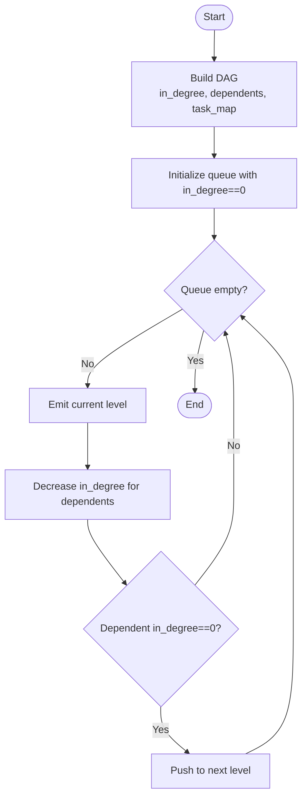
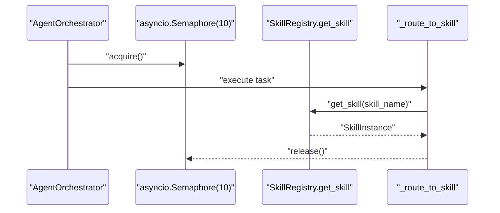
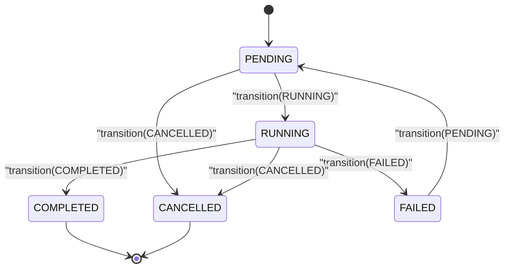
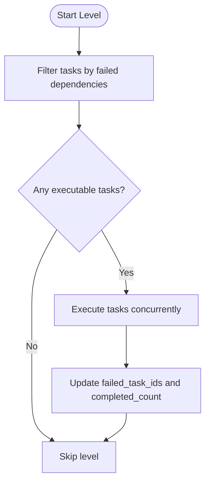
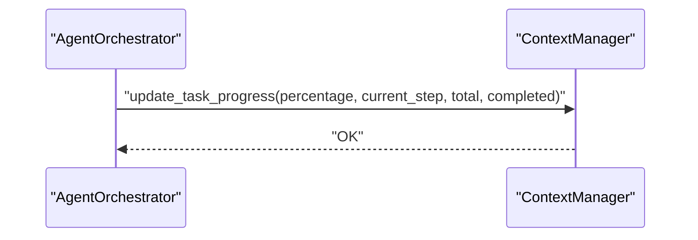
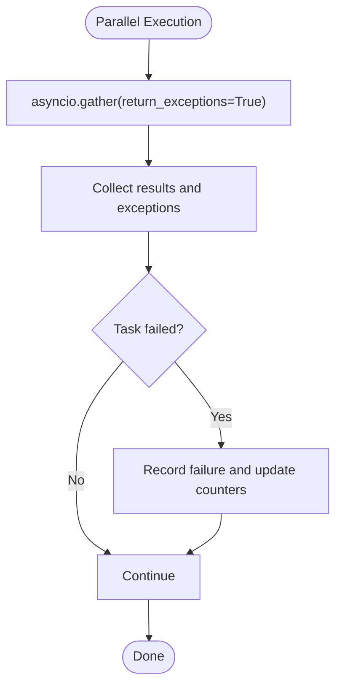
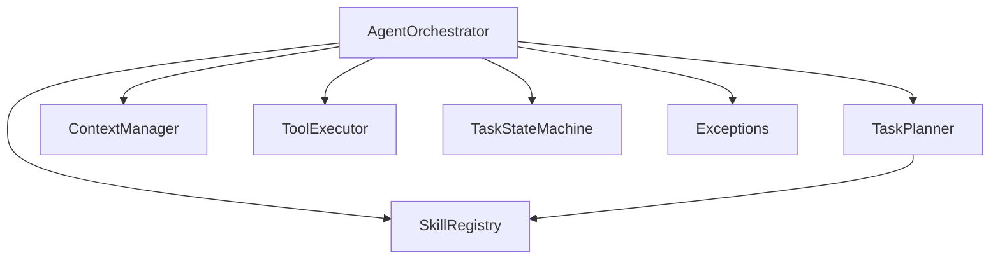

# DAG Execution Engine

<cite>
**Referenced Files in This Document**
- [orchestrator.py](file://src/aiops_agent/core/orchestrator.py)
- [task_planner.py](file://src/aiops_agent/core/task_planner.py)
- [state_machine.py](file://src/aiops_agent/core/state_machine.py)
- [schemas.py](file://src/aiops_agent/models/schemas.py)
- [exceptions.py](file://src/aiops_agent/core/exceptions.py)
- [manager.py](file://src/aiops_agent/context/manager.py)
- [registry.py](file://src/aiops_agent/skills/registry.py)
- [executor.py](file://src/aiops_agent/tools/executor.py)
- [taskplanner.md](file://docs/taskplanner.md)
- [test_orchestrator.py](file://tests/test_orchestrator.py)
- [test_task_planner.py](file://tests/test_task_planner.py)
- [test_state_machine.py](file://tests/test_state_machine.py)
</cite>

## Table of Contents
1. [Introduction](#introduction)
2. [Project Structure](#project-structure)
3. [Core Components](#core-components)
4. [Architecture Overview](#architecture-overview)
5. [Detailed Component Analysis](#detailed-component-analysis)
6. [Dependency Analysis](#dependency-analysis)
7. [Performance Considerations](#performance-considerations)
8. [Troubleshooting Guide](#troubleshooting-guide)
9. [Conclusion](#conclusion)
10. [Appendices](#appendices)

## Introduction
This document explains the Directed Acyclic Graph (DAG) execution engine that powers the AIOps agent’s task orchestration. It covers how natural language requests are decomposed into a DAG of subtasks, how topological sorting determines safe execution order, and how the engine executes tasks in parallel levels while enforcing dependency awareness, concurrency limits, and robust error handling. It also documents the task state machine transitions, failure propagation, cancellation of dependent tasks, and progress tracking across execution levels.

## Project Structure
The DAG execution engine spans several modules:
- Orchestrator: request lifecycle, DAG execution, error handling, and progress updates
- TaskPlanner: LLM-driven decomposition, DAG construction, and topological sorting
- TaskStateMachine: strict state transitions for individual tasks
- Schemas: shared data models (TaskStatus, SubTask, TaskPlan)
- Exceptions: structured error handling
- ContextManager: session and progress tracking during execution
- SkillRegistry: skill discovery and health management
- ToolExecutor: unified tool execution with retries and auditing

**Diagram sources**
- [orchestrator.py:47-67](file://src/aiops_agent/core/orchestrator.py#L47-L67)
- [task_planner.py:32-49](file://src/aiops_agent/core/task_planner.py#L32-L49)
- [state_machine.py:26-42](file://src/aiops_agent/core/state_machine.py#L26-L42)
- [schemas.py:19-51](file://src/aiops_agent/models/schemas.py#L19-L51)
- [exceptions.py:10-27](file://src/aiops_agent/core/exceptions.py#L10-L27)
- [manager.py:25-45](file://src/aiops_agent/context/manager.py#L25-L45)
- [registry.py:19-36](file://src/aiops_agent/skills/registry.py#L19-L36)
- [executor.py:45-75](file://src/aiops_agent/tools/executor.py#L45-L75)

**Section sources**
- [orchestrator.py:47-67](file://src/aiops_agent/core/orchestrator.py#L47-L67)
- [task_planner.py:32-49](file://src/aiops_agent/core/task_planner.py#L32-L49)
- [state_machine.py:26-42](file://src/aiops_agent/core/state_machine.py#L26-L42)
- [schemas.py:19-51](file://src/aiops_agent/models/schemas.py#L19-L51)
- [exceptions.py:10-27](file://src/aiops_agent/core/exceptions.py#L10-L27)
- [manager.py:25-45](file://src/aiops_agent/context/manager.py#L25-L45)
- [registry.py:19-36](file://src/aiops_agent/skills/registry.py#L19-L36)
- [executor.py:45-75](file://src/aiops_agent/tools/executor.py#L45-L75)

## Core Components
- AgentOrchestrator: central controller that orchestrates request processing, DAG decomposition, and execution. It enforces concurrency limits, tracks progress, and aggregates results.
- TaskPlanner: decomposes user requests into SubTasks, validates skill mapping, and performs topological sorting to produce execution levels.
- TaskStateMachine: enforces legal state transitions for each task and triggers callbacks on state changes.
- ContextManager: maintains session state, switches interaction modes, and tracks task progress.
- SkillRegistry: discovers and routes tasks to skills, and marks skills unhealthy after repeated failures.
- ToolExecutor: executes tools with permission checks, credential acquisition, retries, timeouts, sanitization, and auditing.

**Section sources**
- [orchestrator.py:47-67](file://src/aiops_agent/core/orchestrator.py#L47-L67)
- [task_planner.py:32-49](file://src/aiops_agent/core/task_planner.py#L32-L49)
- [state_machine.py:26-42](file://src/aiops_agent/core/state_machine.py#L26-L42)
- [manager.py:25-45](file://src/aiops_agent/context/manager.py#L25-L45)
- [registry.py:19-36](file://src/aiops_agent/skills/registry.py#L19-L36)
- [executor.py:45-75](file://src/aiops_agent/tools/executor.py#L45-L75)

## Architecture Overview
The DAG execution pipeline follows a clear flow:
1. Request enters Orchestrator and is sanitized and routed to Task mode.
2. TaskPlanner decomposes the request into SubTasks and validates skill mapping.
3. Topological sorting produces execution levels; each level contains tasks with no unmet dependencies.
4. Orchestrator executes each level concurrently up to a fixed semaphore limit.
5. TaskStateMachine governs per-task state transitions.
6. ContextManager tracks progress and updates session state.
7. SkillRegistry handles routing and health monitoring.
8. ToolExecutor executes tools with retries and auditing.

**Diagram sources**
- [orchestrator.py:84-198](file://src/aiops_agent/core/orchestrator.py#L84-L198)
- [task_planner.py:50-113](file://src/aiops_agent/core/task_planner.py#L50-L113)
- [state_machine.py:51-79](file://src/aiops_agent/core/state_machine.py#L51-L79)
- [manager.py:94-154](file://src/aiops_agent/context/manager.py#L94-L154)
- [registry.py:159-181](file://src/aiops_agent/skills/registry.py#L159-L181)

## Detailed Component Analysis

### Topological Sorting and Level-by-Level Execution
- TaskPlanner constructs a DAG from SubTasks and computes in-degree and dependents adjacency lists.
- BFS traversal groups tasks into levels where all dependencies of tasks in level i are satisfied by tasks in levels ≤ i.
- Orchestrator iterates levels and filters out tasks whose dependencies have failed; remaining tasks are executed concurrently.

**Diagram sources**
- [task_planner.py:115-150](file://src/aiops_agent/core/task_planner.py#L115-L150)

**Section sources**
- [task_planner.py:115-150](file://src/aiops_agent/core/task_planner.py#L115-L150)
- [test_task_planner.py:209-247](file://tests/test_task_planner.py#L209-L247)
- [taskplanner.md:121-148](file://docs/taskplanner.md#L121-L148)

### Concurrency Control and Parallel Execution
- Orchestrator uses an asyncio.Semaphore to cap concurrent tasks per level to a fixed limit (e.g., 10).
- It wraps each task execution in a coroutine that acquires the semaphore, runs the task, and releases it.
- asyncio.gather executes all tasks in the level concurrently and collects results.

**Diagram sources**
- [orchestrator.py:450-460](file://src/aiops_agent/core/orchestrator.py#L450-L460)
- [orchestrator.py:485-532](file://src/aiops_agent/core/orchestrator.py#L485-L532)

**Section sources**
- [orchestrator.py:450-460](file://src/aiops_agent/core/orchestrator.py#L450-L460)
- [orchestrator.py:485-532](file://src/aiops_agent/core/orchestrator.py#L485-L532)

### Task State Machine Transitions
- Legal transitions:
  - PENDING → RUNNING or CANCELLED
  - RUNNING → COMPLETED, FAILED, or CANCELLED
  - FAILED → PENDING (allowing retry)
  - COMPLETED and CANCELLED are terminal states
- The state machine logs transitions and invokes an optional callback.

**Diagram sources**
- [state_machine.py:17-23](file://src/aiops_agent/core/state_machine.py#L17-L23)
- [state_machine.py:51-79](file://src/aiops_agent/core/state_machine.py#L51-L79)

**Section sources**
- [state_machine.py:17-23](file://src/aiops_agent/core/state_machine.py#L17-L23)
- [state_machine.py:51-79](file://src/aiops_agent/core/state_machine.py#L51-L79)
- [test_state_machine.py:13-61](file://tests/test_state_machine.py#L13-L61)

### Failure Propagation and Cancellation of Dependent Tasks
- Orchestrator tracks failed task IDs and cancels tasks whose dependencies are in the failed set.
- It sets status to CANCELLED with a descriptive error and continues execution of other tasks in the level.

**Diagram sources**
- [orchestrator.py:433-448](file://src/aiops_agent/core/orchestrator.py#L433-L448)

**Section sources**
- [orchestrator.py:433-448](file://src/aiops_agent/core/orchestrator.py#L433-L448)

### Progress Tracking Across Execution Levels
- Orchestrator updates progress after each level using ContextManager, reporting percentage, current step, total steps, and completed steps.
- ContextManager stores TaskProgress in the session state during TASK mode.

**Diagram sources**
- [orchestrator.py:469-475](file://src/aiops_agent/core/orchestrator.py#L469-L475)
- [manager.py:127-154](file://src/aiops_agent/context/manager.py#L127-L154)

**Section sources**
- [orchestrator.py:469-475](file://src/aiops_agent/core/orchestrator.py#L469-L475)
- [manager.py:127-154](file://src/aiops_agent/context/manager.py#L127-L154)

### Error Handling in Parallel Execution
- Orchestrator executes tasks with asyncio.gather and return_exceptions=True to prevent one failure from stopping others.
- Individual task failures are captured, recorded, and surfaced in the final response.
- Structured exceptions (AgentError, SkillExecutionError, SkillNotFoundError) provide consistent error responses.

**Diagram sources**
- [orchestrator.py:457-460](file://src/aiops_agent/core/orchestrator.py#L457-L460)
- [exceptions.py:10-27](file://src/aiops_agent/core/exceptions.py#L10-L27)

**Section sources**
- [orchestrator.py:457-460](file://src/aiops_agent/core/orchestrator.py#L457-L460)
- [exceptions.py:10-27](file://src/aiops_agent/core/exceptions.py#L10-L27)

### Practical Examples

#### Example 1: DAG Construction and Dependency Resolution
- A TaskPlan contains SubTasks with dependencies.
- TaskPlanner builds in-degree and dependents maps, then performs BFS to produce levels.
- Tests demonstrate chain dependencies and diamond-shaped dependencies.

**Section sources**
- [task_planner.py:115-150](file://src/aiops_agent/core/task_planner.py#L115-L150)
- [test_task_planner.py:218-247](file://tests/test_task_planner.py#L218-L247)
- [taskplanner.md:121-148](file://docs/taskplanner.md#L121-L148)

#### Example 2: Level-by-Level Execution Strategy
- Orchestrator iterates levels, filters failed dependencies, and executes remaining tasks concurrently under a semaphore.
- Tests validate single-task execution and multi-level scenarios.

**Section sources**
- [orchestrator.py:424-483](file://src/aiops_agent/core/orchestrator.py#L424-L483)
- [test_orchestrator.py:189-200](file://tests/test_orchestrator.py#L189-L200)

#### Example 3: State Machine Usage
- TaskStateMachine ensures legal transitions and logs changes.
- Tests verify valid and invalid transitions and callback invocation.

**Section sources**
- [state_machine.py:51-79](file://src/aiops_agent/core/state_machine.py#L51-L79)
- [test_state_machine.py:13-61](file://tests/test_state_machine.py#L13-L61)

## Dependency Analysis
The DAG execution engine exhibits low coupling and high cohesion:
- Orchestrator depends on TaskPlanner for DAG construction and on ContextManager for progress tracking.
- TaskPlanner depends on SkillRegistry for skill mapping validation.
- TaskStateMachine is decoupled and reusable for per-task state management.
- ToolExecutor encapsulates tool execution concerns and is used by skills.

**Diagram sources**
- [orchestrator.py:47-67](file://src/aiops_agent/core/orchestrator.py#L47-L67)
- [task_planner.py:32-49](file://src/aiops_agent/core/task_planner.py#L32-L49)
- [state_machine.py:26-42](file://src/aiops_agent/core/state_machine.py#L26-L42)
- [exceptions.py:10-27](file://src/aiops_agent/core/exceptions.py#L10-L27)
- [manager.py:25-45](file://src/aiops_agent/context/manager.py#L25-L45)
- [registry.py:19-36](file://src/aiops_agent/skills/registry.py#L19-L36)
- [executor.py:45-75](file://src/aiops_agent/tools/executor.py#L45-L75)

**Section sources**
- [orchestrator.py:47-67](file://src/aiops_agent/core/orchestrator.py#L47-L67)
- [task_planner.py:32-49](file://src/aiops_agent/core/task_planner.py#L32-L49)
- [state_machine.py:26-42](file://src/aiops_agent/core/state_machine.py#L26-L42)
- [exceptions.py:10-27](file://src/aiops_agent/core/exceptions.py#L10-L27)
- [manager.py:25-45](file://src/aiops_agent/context/manager.py#L25-L45)
- [registry.py:19-36](file://src/aiops_agent/skills/registry.py#L19-L36)
- [executor.py:45-75](file://src/aiops_agent/tools/executor.py#L45-L75)

## Performance Considerations
- Concurrency limiting: Use a semaphore to cap concurrent tasks per level to avoid resource exhaustion. Tune the limit based on downstream service capacity and latency.
- Parallelism granularity: Execute tasks within a level concurrently; keep levels as wide as possible while respecting dependencies.
- Retry and timeout: ToolExecutor applies exponential backoff and timeouts to reduce tail latency and improve resilience.
- Health monitoring: Orchestrator records skill failures and marks skills unhealthy after threshold breaches, preventing routing to failing skills.
- Progress updates: Update progress after each level to provide responsive feedback and enable early termination if needed.

[No sources needed since this section provides general guidance]

## Troubleshooting Guide
- Empty or invalid input: Orchestrator sanitizes input and returns structured errors with error codes and suggestions.
- No tasks generated: Orchestrator returns a NO_TASKS error when TaskPlanner cannot parse or decompose the request.
- Skill not found: Orchestrator returns SKILL_NOT_FOUND when skills are missing or unmappable; suggest available skills.
- Partial failures: Orchestrator aggregates failed tasks and returns PARTIAL_FAILURE with details.
- Health monitoring: Repeated failures trigger marking skills as unhealthy; monitor logs and metrics for remediation.

**Section sources**
- [orchestrator.py:106-194](file://src/aiops_agent/core/orchestrator.py#L106-L194)
- [orchestrator.py:571-596](file://src/aiops_agent/core/orchestrator.py#L571-L596)
- [exceptions.py:10-27](file://src/aiops_agent/core/exceptions.py#L10-L27)

## Conclusion
The DAG execution engine integrates LLM-driven task decomposition, robust topological sorting, and concurrency-aware execution to deliver reliable, parallelized task orchestration. Strict state transitions, failure propagation, and progress tracking ensure predictable behavior and excellent observability. With configurable concurrency limits, health monitoring, and structured error handling, the engine scales effectively for complex task graphs while maintaining safety and reliability.

[No sources needed since this section summarizes without analyzing specific files]

## Appendices

### Data Models Used in DAG Execution
- TaskStatus: lifecycle states for tasks
- SubTask: task definition with dependencies
- TaskPlan: container for a collection of SubTasks
- AgentResponse: standardized response structure

**Section sources**
- [schemas.py:19-51](file://src/aiops_agent/models/schemas.py#L19-L51)

### Streamed Execution Flow (Optional)
- Orchestrator supports streaming execution, emitting events for planning, task start/done, and final completion.
- It updates progress incrementally and synthesizes a final LLM summary when all tasks succeed.

**Section sources**
- [orchestrator.py:203-418](file://src/aiops_agent/core/orchestrator.py#L203-L418)