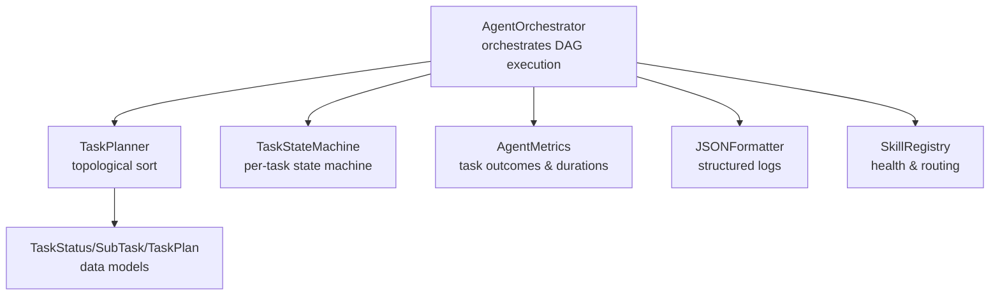
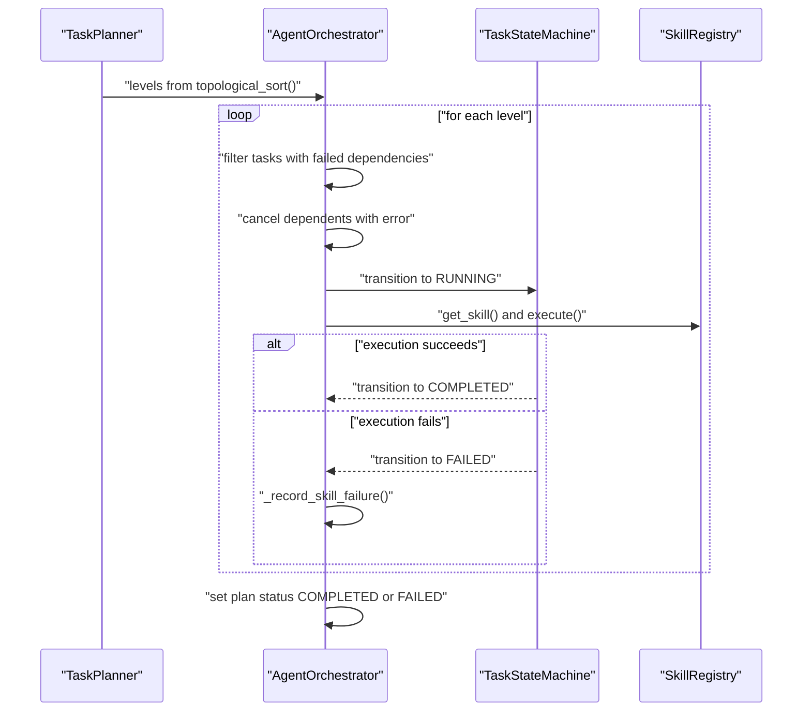
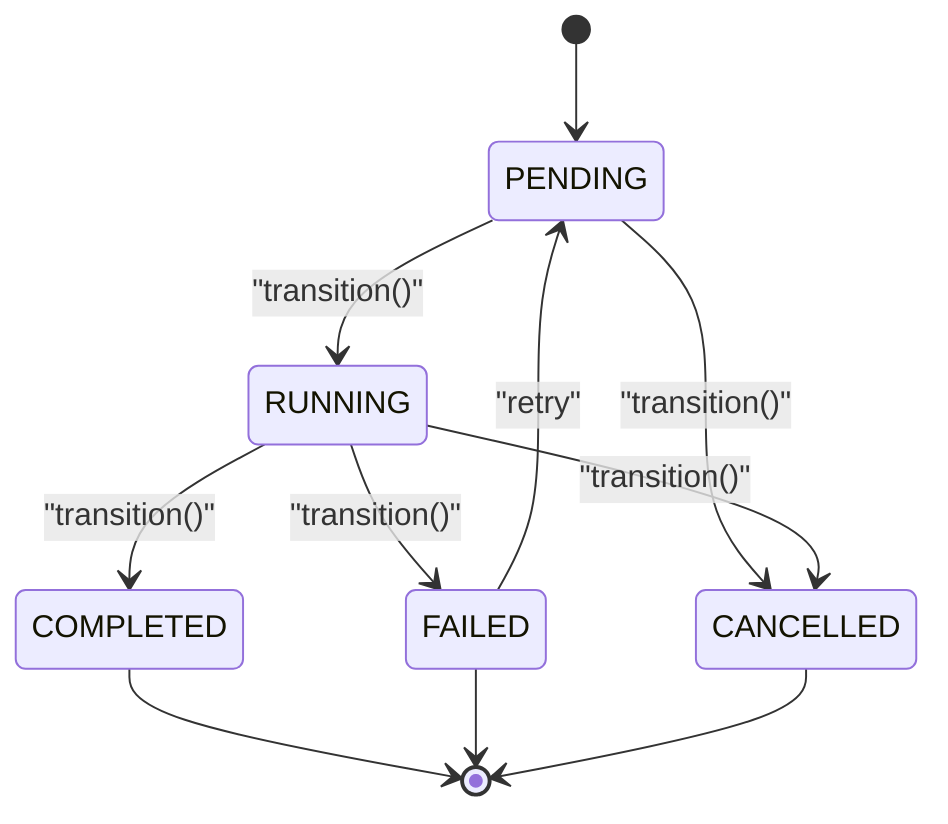
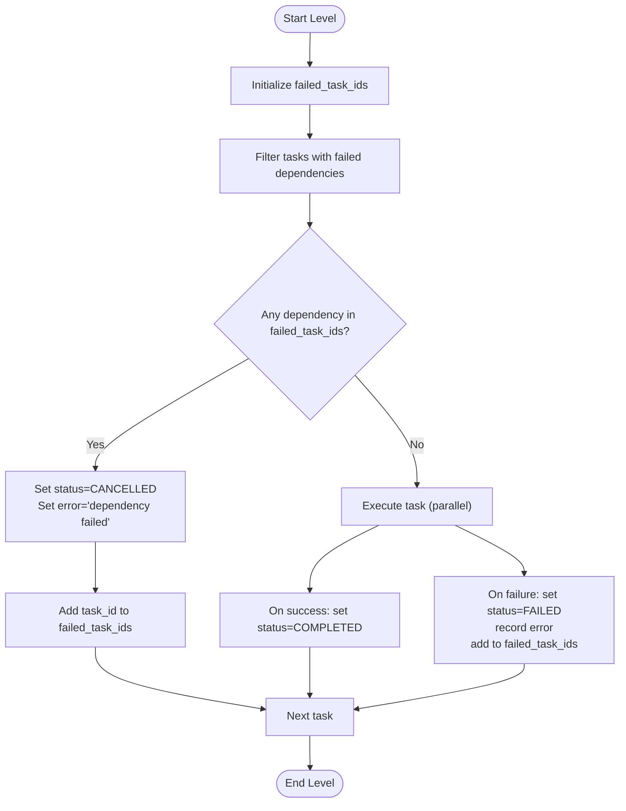
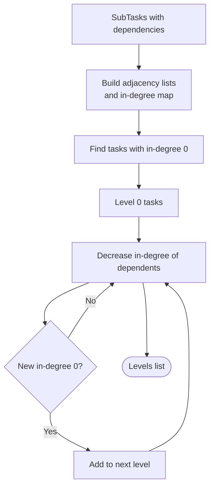
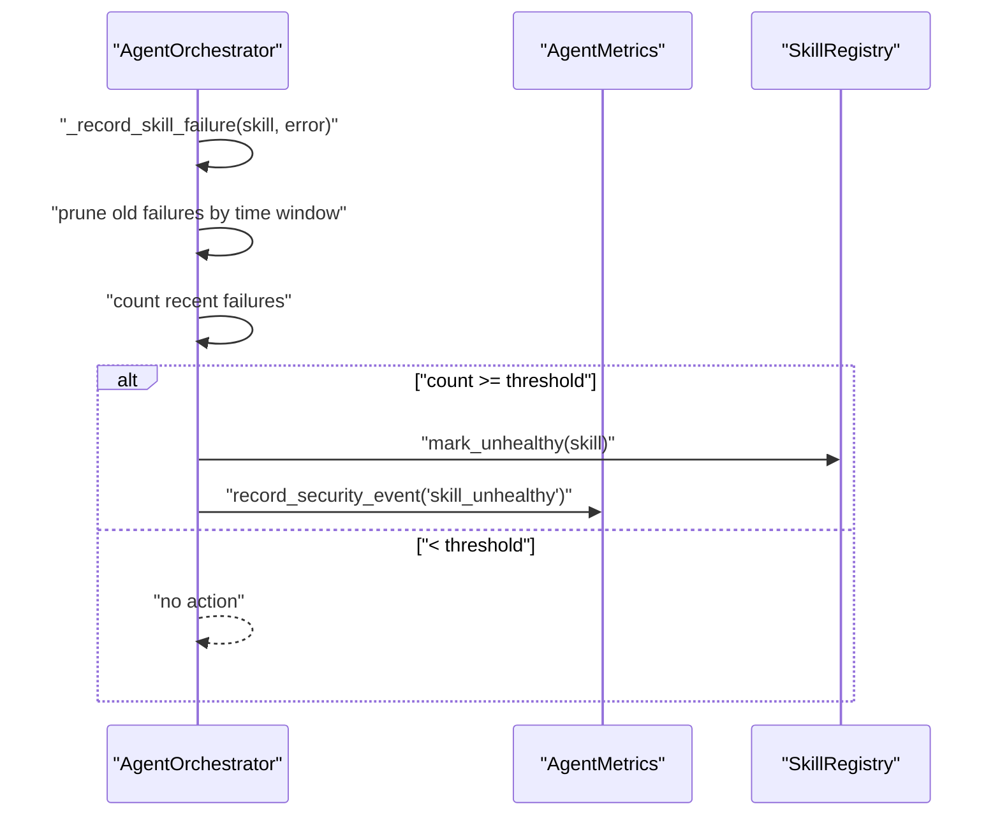
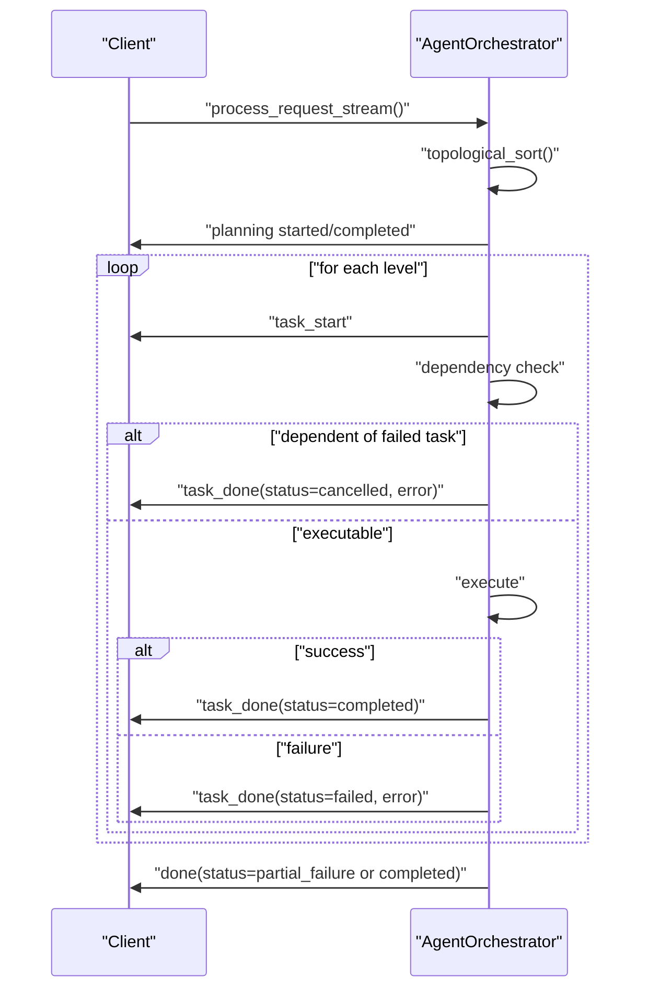
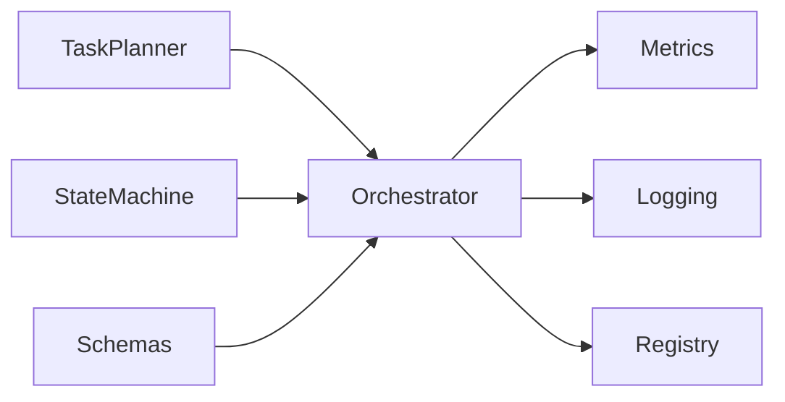

# Failure Propagation & Cancellation Logic

<cite>
**Referenced Files in This Document**
- [state_machine.py](file://src/aiops_agent/core/state_machine.py)
- [orchestrator.py](file://src/aiops_agent/core/orchestrator.py)
- [task_planner.py](file://src/aiops_agent/core/task_planner.py)
- [schemas.py](file://src/aiops_agent/models/schemas.py)
- [exceptions.py](file://src/aiops_agent/core/exceptions.py)
- [metrics.py](file://src/aiops_agent/observability/metrics.py)
- [logging.py](file://src/aiops_agent/observability/logging.py)
- [registry.py](file://src/aiops_agent/skills/registry.py)
- [test_state_machine.py](file://tests/test_state_machine.py)
- [test_sse.py](file://tests/test_sse.py)
- [test_orchestrator.py](file://tests/test_orchestrator.py)
</cite>

## Table of Contents
1. [Introduction](#introduction)
2. [Project Structure](#project-structure)
3. [Core Components](#core-components)
4. [Architecture Overview](#architecture-overview)
5. [Detailed Component Analysis](#detailed-component-analysis)
6. [Dependency Analysis](#dependency-analysis)
7. [Performance Considerations](#performance-considerations)
8. [Troubleshooting Guide](#troubleshooting-guide)
9. [Conclusion](#conclusion)

## Introduction
This document explains the failure propagation and cancellation logic that ensures dependent tasks are properly handled when upstream tasks fail. It covers:
- The failed_task_ids tracking mechanism
- Dependency checking algorithms
- Automatic cancellation of dependent tasks with appropriate error messages
- TaskStateMachine transitions for failed states
- Error recording and health monitoring integration
- Prevention of cascading failures
- Examples of failure chains, partial execution scenarios, and recovery strategies
- How individual task failures relate to overall plan status determination

## Project Structure
The failure propagation logic spans several core modules:
- Orchestrator: coordinates DAG execution, tracks failed tasks, cancels dependents, records errors, and determines plan status
- TaskPlanner: builds the DAG and performs topological sorting to define execution order
- TaskStateMachine: enforces legal state transitions for each task
- Models/Schemas: define TaskStatus, SubTask, TaskPlan, and related structures
- Observability: metrics and logging capture task outcomes and trace IDs
- Skill Registry: maintains skill health and marks skills as unhealthy after repeated failures

**Diagram sources**
- [orchestrator.py:47-67](file://src/aiops_agent/core/orchestrator.py#L47-L67)
- [task_planner.py:32-49](file://src/aiops_agent/core/task_planner.py#L32-L49)
- [state_machine.py:26-42](file://src/aiops_agent/core/state_machine.py#L26-L42)
- [schemas.py:19-51](file://src/aiops_agent/models/schemas.py#L19-L51)
- [metrics.py:26-76](file://src/aiops_agent/observability/metrics.py#L26-L76)
- [logging.py:18-58](file://src/aiops_agent/observability/logging.py#L18-L58)
- [registry.py:19-36](file://src/aiops_agent/skills/registry.py#L19-L36)

**Section sources**
- [orchestrator.py:47-67](file://src/aiops_agent/core/orchestrator.py#L47-L67)
- [task_planner.py:32-49](file://src/aiops_agent/core/task_planner.py#L32-L49)
- [state_machine.py:26-42](file://src/aiops_agent/core/state_machine.py#L26-L42)
- [schemas.py:19-51](file://src/aiops_agent/models/schemas.py#L19-L51)
- [metrics.py:26-76](file://src/aiops_agent/observability/metrics.py#L26-L76)
- [logging.py:18-58](file://src/aiops_agent/observability/logging.py#L18-L58)
- [registry.py:19-36](file://src/aiops_agent/skills/registry.py#L19-L36)

## Core Components
- TaskStateMachine: validates and enforces legal state transitions (PENDING → RUNNING → COMPLETED/FAILED/CANCELLED) and raises explicit errors for invalid transitions
- Orchestrator: executes TaskPlan in DAG order, tracks failed_task_ids, cancels dependents whose upstream dependencies have failed, records errors, and sets plan status
- TaskPlanner: constructs SubTask dependencies and performs topological sorting to group executable tasks by level
- Models/Schemas: define TaskStatus and the SubTask/TaskPlan structures used throughout
- Observability: metrics and logging integrate with OpenTelemetry trace IDs for end-to-end observability
- Skill Registry: monitors skill health and marks skills as unhealthy after threshold breaches

**Section sources**
- [state_machine.py:17-23](file://src/aiops_agent/core/state_machine.py#L17-L23)
- [orchestrator.py:424-483](file://src/aiops_agent/core/orchestrator.py#L424-L483)
- [task_planner.py:115-150](file://src/aiops_agent/core/task_planner.py#L115-L150)
- [schemas.py:19-51](file://src/aiops_agent/models/schemas.py#L19-L51)
- [metrics.py:81-86](file://src/aiops_agent/observability/metrics.py#L81-L86)
- [logging.py:40-46](file://src/aiops_agent/observability/logging.py#L40-L46)
- [registry.py:213-237](file://src/aiops_agent/skills/registry.py#L213-L237)

## Architecture Overview
The failure propagation pipeline operates during DAG execution:
- Topological levels are processed iteratively
- For each level, tasks with failed upstream dependencies are immediately cancelled with an explanatory error
- Tasks that pass dependency checks are executed concurrently up to a concurrency limit
- Failures are recorded, and plan status is determined by whether all tasks complete

**Diagram sources**
- [task_planner.py:115-150](file://src/aiops_agent/core/task_planner.py#L115-L150)
- [orchestrator.py:424-483](file://src/aiops_agent/core/orchestrator.py#L424-L483)
- [state_machine.py:51-79](file://src/aiops_agent/core/state_machine.py#L51-L79)
- [registry.py:159-181](file://src/aiops_agent/skills/registry.py#L159-L181)

## Detailed Component Analysis

### TaskStateMachine: Legal Transitions and Terminal States
- Enforces legal transitions: PENDING → RUNNING → COMPLETED/FAILED/CANCELLED
- Prevents invalid transitions (e.g., FAILED → COMPLETED) and raises explicit errors with status and task_id context
- Supports retry flow: FAILED → PENDING → RUNNING → COMPLETED
- Terminal states: COMPLETED, FAILED, CANCELLED

**Diagram sources**
- [state_machine.py:17-23](file://src/aiops_agent/core/state_machine.py#L17-L23)
- [state_machine.py:51-82](file://src/aiops_agent/core/state_machine.py#L51-L82)
- [test_state_machine.py:68-111](file://tests/test_state_machine.py#L68-L111)

**Section sources**
- [state_machine.py:17-23](file://src/aiops_agent/core/state_machine.py#L17-L23)
- [state_machine.py:51-82](file://src/aiops_agent/core/state_machine.py#L51-L82)
- [test_state_machine.py:68-111](file://tests/test_state_machine.py#L68-L111)

### Orchestrator: Failure Propagation and Cancellation
- failed_task_ids: Set tracking task IDs that have failed; used to cancel dependents immediately upon encountering them
- Dependency checking: For each task in a level, if any dependency is present in failed_task_ids, the task is cancelled with an error indicating upstream failure
- Concurrency: Executes executable tasks in parallel with a bounded semaphore
- Plan status: After processing all levels, plan.status is set to COMPLETED if all tasks are successful; otherwise FAILED

**Diagram sources**
- [orchestrator.py:433-475](file://src/aiops_agent/core/orchestrator.py#L433-L475)
- [orchestrator.py:485-532](file://src/aiops_agent/core/orchestrator.py#L485-L532)

**Section sources**
- [orchestrator.py:433-475](file://src/aiops_agent/core/orchestrator.py#L433-L475)
- [orchestrator.py:485-532](file://src/aiops_agent/core/orchestrator.py#L485-L532)

### TaskPlanner: DAG Construction and Topological Sorting
- Builds SubTask dependencies from LLM output and validates skill mapping
- Performs topological sorting to produce execution levels where tasks with zero in-degree are scheduled first

**Diagram sources**
- [task_planner.py:121-150](file://src/aiops_agent/core/task_planner.py#L121-L150)

**Section sources**
- [task_planner.py:115-150](file://src/aiops_agent/core/task_planner.py#L115-L150)

### Error Recording and Health Monitoring Integration
- Orchestrator records skill failures with timestamps and prunes stale entries outside a fixed window
- When failure count reaches a threshold, the skill is marked unhealthy asynchronously
- Metrics and logging capture task outcomes and include trace IDs for correlation

**Diagram sources**
- [orchestrator.py:571-596](file://src/aiops_agent/core/orchestrator.py#L571-L596)
- [metrics.py:91-93](file://src/aiops_agent/observability/metrics.py#L91-L93)
- [registry.py:239-244](file://src/aiops_agent/skills/registry.py#L239-L244)

**Section sources**
- [orchestrator.py:571-596](file://src/aiops_agent/core/orchestrator.py#L571-L596)
- [metrics.py:91-93](file://src/aiops_agent/observability/metrics.py#L91-L93)
- [registry.py:239-244](file://src/aiops_agent/skills/registry.py#L239-L244)

### Stream Execution: Real-Time Cancellation and Reporting
- During stream execution, the Orchestrator applies the same dependency checks and cancellation logic
- Emits structured SSE events for task_start, task_done (including cancelled), and error events
- Final “done” event reflects partial failure when any task fails

**Diagram sources**
- [orchestrator.py:203-390](file://src/aiops_agent/core/orchestrator.py#L203-L390)
- [test_sse.py:250-287](file://tests/test_sse.py#L250-L287)

**Section sources**
- [orchestrator.py:203-390](file://src/aiops_agent/core/orchestrator.py#L203-L390)
- [test_sse.py:250-287](file://tests/test_sse.py#L250-L287)

### Examples and Scenarios

- Example: Single upstream failure
  - t1 fails → t2 (dependent on t1) is cancelled with error “dependency failed”
  - Plan status becomes FAILED because not all tasks completed

- Example: Partial execution with mixed outcomes
  - t1 fails, t2 succeeds, t3 depends on t1 → t3 is cancelled; t2 remains completed
  - Final status is PARTIAL_FAILURE; response indicates number of failed tasks

- Example: Retry flow
  - TaskStateMachine allows FAILED → PENDING → RUNNING → COMPLETED
  - Orchestrator supports re-execution of failed tasks in subsequent runs

- Example: Cascading failure prevention
  - failed_task_ids ensures that once a task fails, all downstream dependents are cancelled immediately
  - This prevents wasted compute and reduces risk of amplifying errors

**Section sources**
- [orchestrator.py:279-302](file://src/aiops_agent/core/orchestrator.py#L279-L302)
- [orchestrator.py:477-481](file://src/aiops_agent/core/orchestrator.py#L477-L481)
- [state_machine.py:51-82](file://src/aiops_agent/core/state_machine.py#L51-L82)
- [test_state_machine.py:53-61](file://tests/test_state_machine.py#L53-L61)
- [test_sse.py:250-287](file://tests/test_sse.py#L250-L287)

## Dependency Analysis
- Orchestrator depends on TaskPlanner for DAG construction and topological ordering
- Orchestrator uses TaskStateMachine per-subtask to enforce state transitions
- Orchestrator integrates with SkillRegistry for skill discovery and health management
- Observability modules (metrics and logging) are used for telemetry and trace correlation

**Diagram sources**
- [orchestrator.py:75-76](file://src/aiops_agent/core/orchestrator.py#L75-L76)
- [task_planner.py:47-48](file://src/aiops_agent/core/task_planner.py#L47-L48)
- [state_machine.py:38-41](file://src/aiops_agent/core/state_machine.py#L38-L41)
- [metrics.py:38-45](file://src/aiops_agent/observability/metrics.py#L38-L45)
- [logging.py:18-28](file://src/aiops_agent/observability/logging.py#L18-L28)
- [registry.py:19-36](file://src/aiops_agent/skills/registry.py#L19-L36)
- [schemas.py:19-51](file://src/aiops_agent/models/schemas.py#L19-L51)

**Section sources**
- [orchestrator.py:75-76](file://src/aiops_agent/core/orchestrator.py#L75-L76)
- [task_planner.py:47-48](file://src/aiops_agent/core/task_planner.py#L47-L48)
- [state_machine.py:38-41](file://src/aiops_agent/core/state_machine.py#L38-L41)
- [metrics.py:38-45](file://src/aiops_agent/observability/metrics.py#L38-L45)
- [logging.py:18-28](file://src/aiops_agent/observability/logging.py#L18-L28)
- [registry.py:19-36](file://src/aiops_agent/skills/registry.py#L19-L36)
- [schemas.py:19-51](file://src/aiops_agent/models/schemas.py#L19-L51)

## Performance Considerations
- Parallelism: Orchestrator limits concurrent subtask execution via a semaphore to avoid resource contention
- Early cancellation: Dependents are cancelled immediately upon detecting failed upstream tasks, reducing wasted work
- Health monitoring: Asynchronous marking of unhealthy skills avoids blocking ongoing executions
- Metrics: Recording task counts and durations enables capacity planning and alerting

[No sources needed since this section provides general guidance]

## Troubleshooting Guide
- Symptom: Dependent tasks remain scheduled despite upstream failure
  - Cause: Missing dependency check or incorrect failed_task_ids propagation
  - Action: Verify dependency lists and ensure failed_task_ids is populated and checked before scheduling

- Symptom: Task transitions raise errors unexpectedly
  - Cause: Invalid state transitions (e.g., FAILED → COMPLETED)
  - Action: Use TaskStateMachine.can_transition() to validate intended transitions; follow FAILED → PENDING → RUNNING → COMPLETED retry flow

- Symptom: Skill appears healthy but keeps failing
  - Cause: Threshold-triggered health marking after repeated failures
  - Action: Inspect Orchestrator’s failure window and threshold; confirm SkillRegistry status and consider manual recovery

- Symptom: Partial execution leaves tasks cancelled
  - Cause: Upstream failure caused immediate cancellation
  - Action: Review plan status and error messages; re-run failed tasks after remediation

**Section sources**
- [orchestrator.py:433-475](file://src/aiops_agent/core/orchestrator.py#L433-L475)
- [state_machine.py:51-82](file://src/aiops_agent/core/state_machine.py#L51-L82)
- [test_state_machine.py:68-111](file://tests/test_state_machine.py#L68-L111)
- [orchestrator.py:571-596](file://src/aiops_agent/core/orchestrator.py#L571-L596)
- [registry.py:239-244](file://src/aiops_agent/skills/registry.py#L239-L244)

## Conclusion
The system enforces strict state transitions, cancels dependents proactively, and aggregates outcomes to determine plan status. Health monitoring prevents prolonged degradation by marking skills unhealthy after repeated failures. Together, these mechanisms prevent cascading failures, reduce wasted computation, and provide clear signals for recovery.