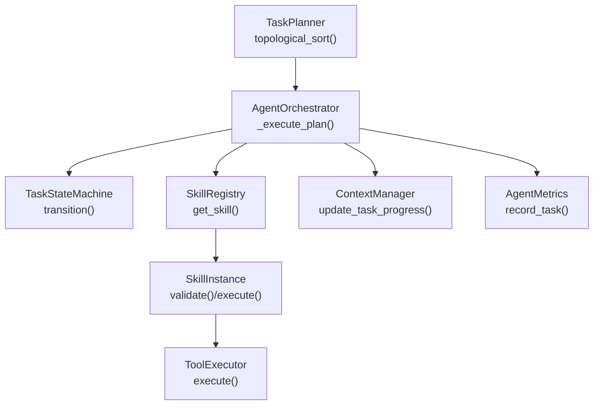
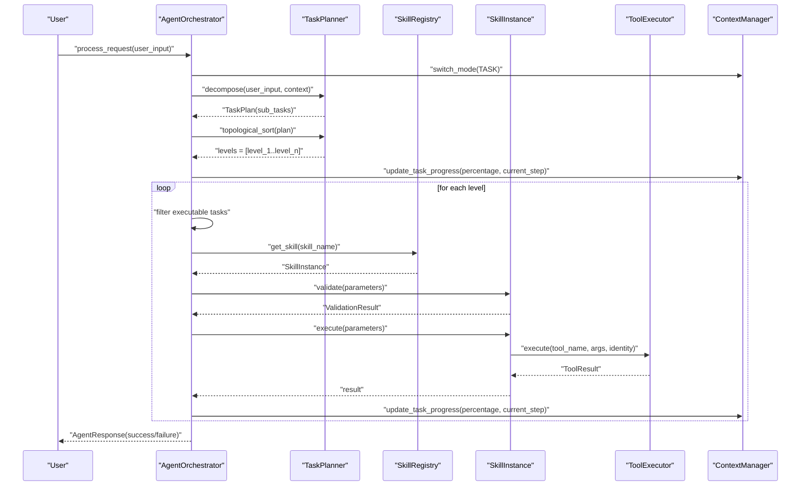
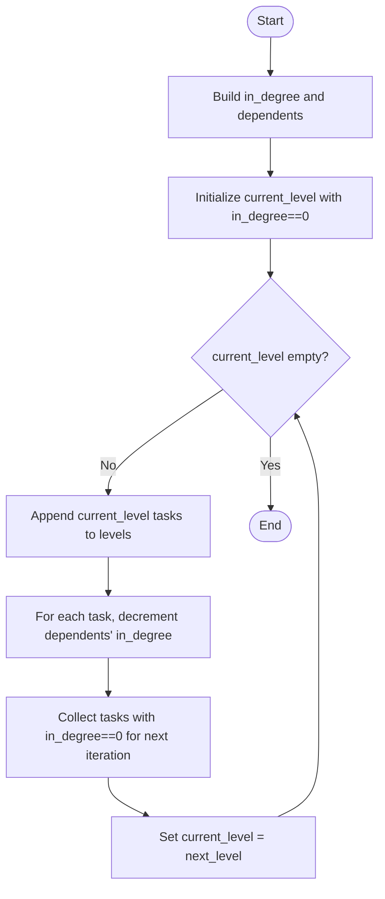
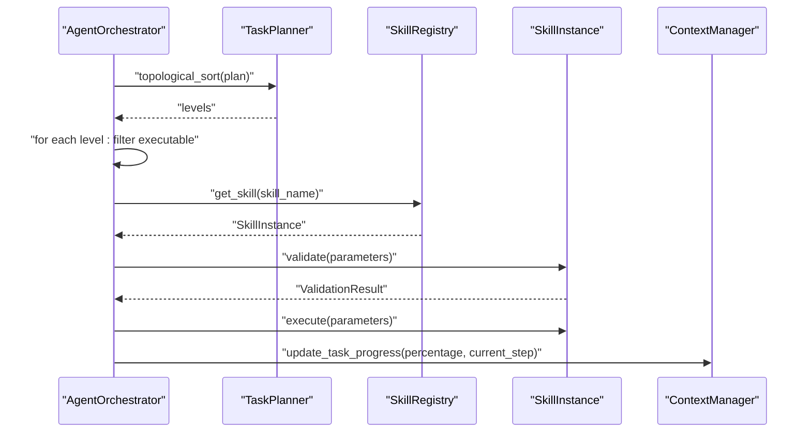
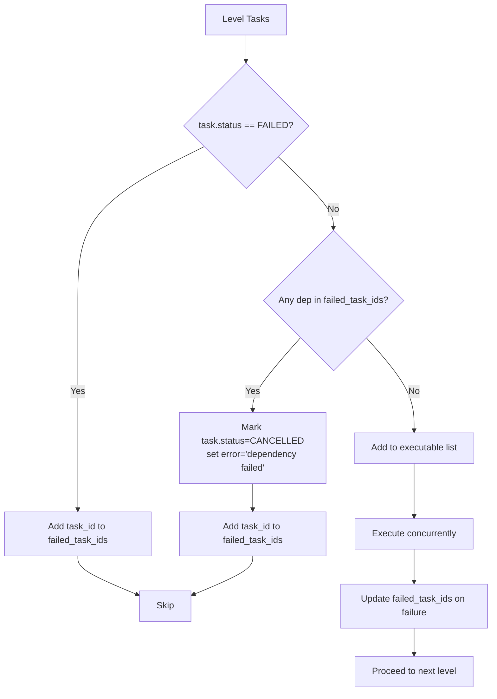
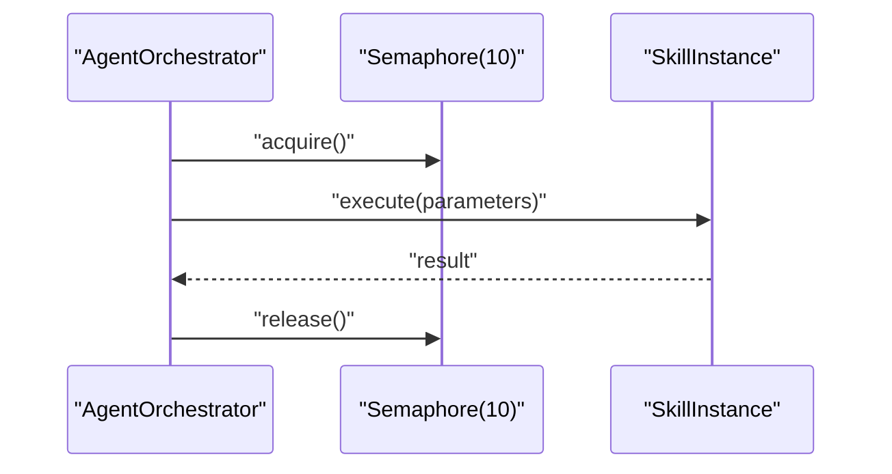
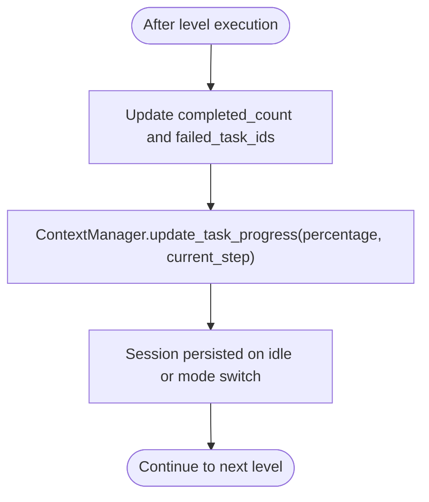
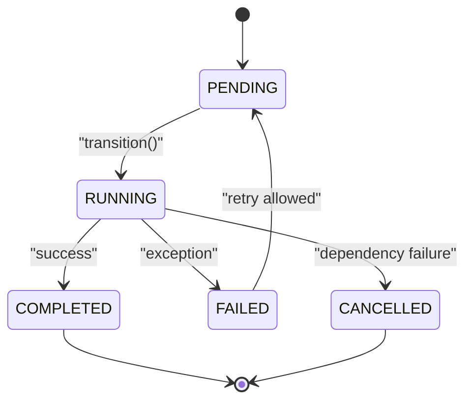
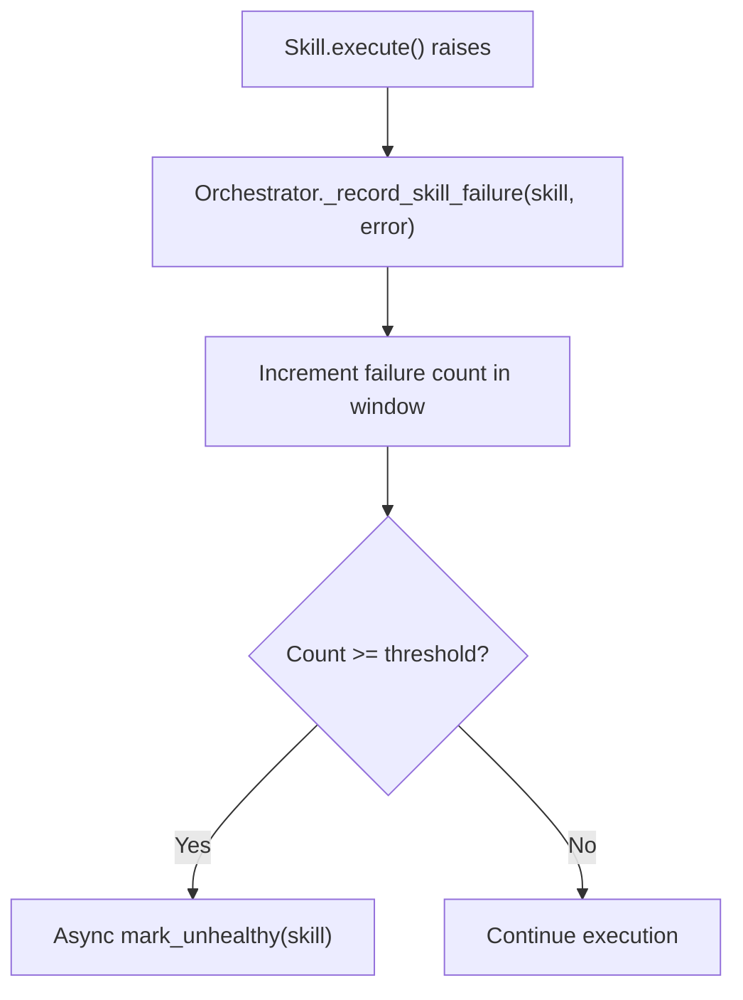
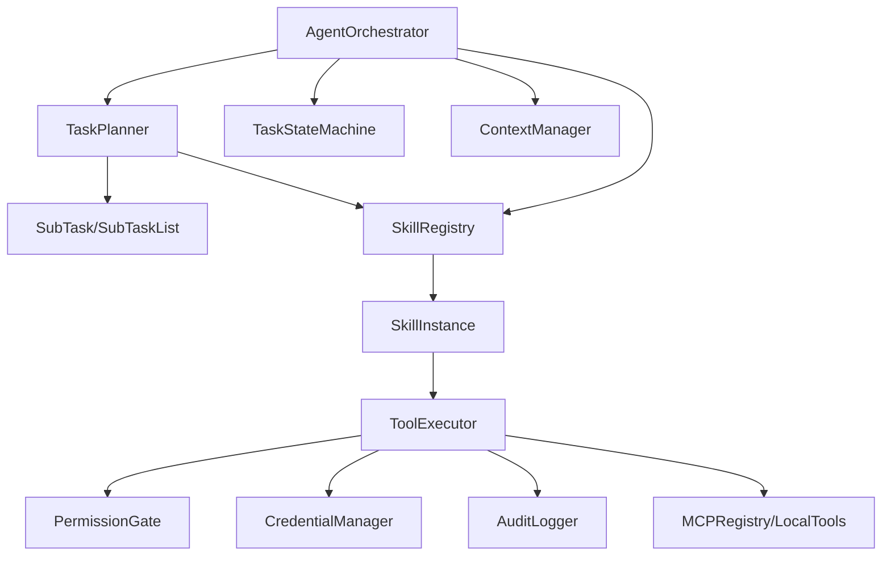

# Level-by-Level Execution Strategy

<cite>
**Referenced Files in This Document**
- [task_planner.py](file://src/aiops_agent/core/task_planner.py)
- [orchestrator.py](file://src/aiops_agent/core/orchestrator.py)
- [schemas.py](file://src/aiops_agent/models/schemas.py)
- [state_machine.py](file://src/aiops_agent/core/state_machine.py)
- [manager.py](file://src/aiops_agent/context/manager.py)
- [executor.py](file://src/aiops_agent/tools/executor.py)
- [base.py](file://src/aiops_agent/skills/base.py)
- [registry.py](file://src/aiops_agent/skills/registry.py)
- [monitoring.py](file://src/aiops_agent/skills/monitoring.py)
- [troubleshooting.py](file://src/aiops_agent/skills/troubleshooting.py)
- [test_task_planner.py](file://tests/test_task_planner.py)
- [test_orchestrator.py](file://tests/test_orchestrator.py)
</cite>

## Table of Contents
1. [Introduction](#introduction)
2. [Project Structure](#project-structure)
3. [Core Components](#core-components)
4. [Architecture Overview](#architecture-overview)
5. [Detailed Component Analysis](#detailed-component-analysis)
6. [Dependency Analysis](#dependency-analysis)
7. [Performance Considerations](#performance-considerations)
8. [Troubleshooting Guide](#troubleshooting-guide)
9. [Conclusion](#conclusion)

## Introduction
This document explains the level-by-level execution strategy that processes tasks in a dependency-aware manner. It covers how tasks are grouped by execution level after topological sorting, how sequential processing occurs within each level, and how dependency validation is enforced before task execution. It also documents task filtering logic for failed dependencies, cancellation propagation to dependent tasks, and progress tracking across execution levels. Examples of multi-level task graphs, dependency chains, and branching execution paths are included, along with state management, error handling strategies, and guarantees on execution order.

## Project Structure
The level-by-level execution strategy spans several core modules:
- Task planning and DAG construction with topological sorting
- Orchestrator that executes plans in levels, validates dependencies, and tracks progress
- State machine for per-task lifecycle transitions
- Context manager for session and progress updates
- Tool executor for secure, retried, and audited tool invocation
- Skill registry and skill base for capability routing and validation

**Diagram sources**
- [task_planner.py:115-150](file://src/aiops_agent/core/task_planner.py#L115-L150)
- [orchestrator.py:424-483](file://src/aiops_agent/core/orchestrator.py#L424-L483)
- [state_machine.py:51-82](file://src/aiops_agent/core/state_machine.py#L51-L82)
- [registry.py:159-181](file://src/aiops_agent/skills/registry.py#L159-L181)
- [base.py:47-72](file://src/aiops_agent/skills/base.py#L47-L72)
- [executor.py:80-202](file://src/aiops_agent/tools/executor.py#L80-L202)
- [manager.py:127-153](file://src/aiops_agent/context/manager.py#L127-L153)

**Section sources**
- [task_planner.py:115-150](file://src/aiops_agent/core/task_planner.py#L115-L150)
- [orchestrator.py:424-483](file://src/aiops_agent/core/orchestrator.py#L424-L483)
- [manager.py:127-153](file://src/aiops_agent/context/manager.py#L127-L153)

## Core Components
- TaskPlanner: Builds a TaskPlan from natural language input, validates skill mappings, and performs topological sorting to produce dependency-aware levels.
- AgentOrchestrator: Executes TaskPlans level-by-level, filters out tasks whose dependencies have failed, propagates cancellations, and updates progress.
- TaskStateMachine: Enforces legal state transitions for each task (PENDING → RUNNING → COMPLETED/FAILED/CANCELLED).
- ContextManager: Tracks and persists task progress during execution.
- SkillRegistry and SkillInstance: Route tasks to skills, validate parameters, and execute actions via ToolExecutor.
- ToolExecutor: Provides unified, secure, and audited execution of tools with retries and timeouts.

**Section sources**
- [task_planner.py:32-113](file://src/aiops_agent/core/task_planner.py#L32-L113)
- [orchestrator.py:47-198](file://src/aiops_agent/core/orchestrator.py#L47-L198)
- [state_machine.py:26-82](file://src/aiops_agent/core/state_machine.py#L26-L82)
- [manager.py:25-153](file://src/aiops_agent/context/manager.py#L25-L153)
- [base.py:21-93](file://src/aiops_agent/skills/base.py#L21-L93)
- [executor.py:45-202](file://src/aiops_agent/tools/executor.py#L45-L202)

## Architecture Overview
The execution pipeline:
1. Natural language input is sanitized and passed to TaskPlanner to decompose into SubTasks forming a DAG.
2. Topological sort groups tasks into levels; each level contains tasks with no unexecuted dependencies.
3. AgentOrchestrator iterates levels, filters tasks whose dependencies failed, and executes remaining tasks concurrently (bounded by a semaphore).
4. For each task, SkillRegistry resolves the skill, validates parameters, and executes via ToolExecutor.
5. TaskStateMachine ensures state transitions are legal; failures are recorded and propagated.
6. Progress is updated per level and per task via ContextManager.

**Diagram sources**
- [orchestrator.py:84-198](file://src/aiops_agent/core/orchestrator.py#L84-L198)
- [task_planner.py:50-113](file://src/aiops_agent/core/task_planner.py#L50-L113)
- [orchestrator.py:424-483](file://src/aiops_agent/core/orchestrator.py#L424-L483)
- [registry.py:159-181](file://src/aiops_agent/skills/registry.py#L159-L181)
- [base.py:47-72](file://src/aiops_agent/skills/base.py#L47-L72)
- [executor.py:80-202](file://src/aiops_agent/tools/executor.py#L80-L202)
- [manager.py:127-153](file://src/aiops_agent/context/manager.py#L127-L153)

## Detailed Component Analysis

### Topological Sorting and Level Grouping
- TaskPlanner constructs adjacency structures and computes in-degrees, then performs BFS to group tasks into levels where each level contains tasks with zero in-degree at that step.
- The result is a list of lists, each inner list representing a set of tasks that can execute in parallel.

**Diagram sources**
- [task_planner.py:115-150](file://src/aiops_agent/core/task_planner.py#L115-L150)

**Section sources**
- [task_planner.py:115-150](file://src/aiops_agent/core/task_planner.py#L115-L150)
- [test_task_planner.py:209-270](file://tests/test_task_planner.py#L209-L270)

### Level-by-Level Execution and Dependency Validation
- AgentOrchestrator retrieves levels from TaskPlanner and iterates them.
- Within each level, it filters tasks:
  - Skips tasks already marked FAILED.
  - Cancels tasks whose dependencies are in the failed set.
- Tasks are executed concurrently with a bounded semaphore (up to 10), ensuring throughput without overwhelming downstream systems.
- After execution, progress is updated and plan status reflects completion.

**Diagram sources**
- [orchestrator.py:424-483](file://src/aiops_agent/core/orchestrator.py#L424-L483)
- [orchestrator.py:485-532](file://src/aiops_agent/core/orchestrator.py#L485-L532)
- [registry.py:159-181](file://src/aiops_agent/skills/registry.py#L159-L181)
- [base.py:47-72](file://src/aiops_agent/skills/base.py#L47-L72)
- [manager.py:127-153](file://src/aiops_agent/context/manager.py#L127-L153)

**Section sources**
- [orchestrator.py:424-483](file://src/aiops_agent/core/orchestrator.py#L424-L483)
- [test_orchestrator.py:228-295](file://tests/test_orchestrator.py#L228-L295)

### Task Filtering Logic for Failed Dependencies and Cancellation Propagation
- Before execution, tasks whose dependencies are in the failed set are cancelled immediately and marked as such.
- This prevents cascading failures and ensures deterministic propagation of failure signals.

**Diagram sources**
- [orchestrator.py:433-448](file://src/aiops_agent/core/orchestrator.py#L433-L448)
- [orchestrator.py:279-299](file://src/aiops_agent/core/orchestrator.py#L279-L299)

**Section sources**
- [orchestrator.py:433-448](file://src/aiops_agent/core/orchestrator.py#L433-L448)
- [test_orchestrator.py:262-295](file://tests/test_orchestrator.py#L262-L295)

### Sequential Processing Within Each Level and Concurrency Control
- Within a level, tasks are executed concurrently but bounded by a semaphore to limit concurrent executions.
- This preserves ordering guarantees across levels while maximizing throughput within each level.

**Diagram sources**
- [orchestrator.py:450-460](file://src/aiops_agent/core/orchestrator.py#L450-L460)

**Section sources**
- [orchestrator.py:450-460](file://src/aiops_agent/core/orchestrator.py#L450-L460)

### Progress Tracking Across Execution Levels
- AgentOrchestrator updates progress after each level completes, reflecting both percentage and textual step description.
- ContextManager stores TaskProgress in session state for persistence and retrieval.

**Diagram sources**
- [orchestrator.py:462-475](file://src/aiops_agent/core/orchestrator.py#L462-L475)
- [manager.py:127-153](file://src/aiops_agent/context/manager.py#L127-L153)

**Section sources**
- [orchestrator.py:462-475](file://src/aiops_agent/core/orchestrator.py#L462-L475)
- [manager.py:127-153](file://src/aiops_agent/context/manager.py#L127-L153)

### State Management for Each Task Level
- TaskStateMachine enforces legal transitions: PENDING → RUNNING → COMPLETED/FAILED/CANCELLED.
- This ensures each task’s lifecycle remains consistent and predictable.

**Diagram sources**
- [state_machine.py:17-23](file://src/aiops_agent/core/state_machine.py#L17-L23)
- [state_machine.py:51-82](file://src/aiops_agent/core/state_machine.py#L51-L82)

**Section sources**
- [state_machine.py:17-23](file://src/aiops_agent/core/state_machine.py#L17-L23)
- [state_machine.py:51-82](file://src/aiops_agent/core/state_machine.py#L51-L82)

### Error Handling Strategies and Health Monitoring
- On task failure, Orchestrator records the failure against the skill, marks the task FAILED, and updates the failed_task_ids set.
- Health monitoring tracks continuous failures per skill over a fixed window and can mark a skill as unhealthy asynchronously.
- AgentOrchestrator surfaces structured AgentResponse with error codes and suggestions.

**Diagram sources**
- [orchestrator.py:519-532](file://src/aiops_agent/core/orchestrator.py#L519-L532)
- [orchestrator.py:571-596](file://src/aiops_agent/core/orchestrator.py#L571-L596)
- [registry.py:239-251](file://src/aiops_agent/skills/registry.py#L239-L251)

**Section sources**
- [orchestrator.py:519-532](file://src/aiops_agent/core/orchestrator.py#L519-L532)
- [orchestrator.py:571-596](file://src/aiops_agent/core/orchestrator.py#L571-L596)
- [registry.py:239-251](file://src/aiops_agent/skills/registry.py#L239-L251)

### Examples of Multi-Level Task Graphs, Dependency Chains, and Branching Paths
- Independent tasks form a single level and execute in parallel.
- Chain dependencies produce strict serial levels.
- Diamond dependencies create a middle level with two parallel tasks feeding a final task.
- Mixed graphs combine parallelism and serial steps.

These behaviors are validated by unit tests for topological sorting and DAG execution.

**Section sources**
- [test_task_planner.py:209-270](file://tests/test_task_planner.py#L209-L270)
- [test_orchestrator.py:228-295](file://tests/test_orchestrator.py#L228-L295)

### Streamed Execution with Real-Time Events
- AgentOrchestrator.process_request_stream emits events for planning, task start/done, and errors, enabling real-time UI updates.
- It mirrors the same dependency filtering and cancellation logic, yielding progress updates per task and per level.

**Section sources**
- [orchestrator.py:203-418](file://src/aiops_agent/core/orchestrator.py#L203-L418)

## Dependency Analysis
Key dependencies and interactions:
- TaskPlanner depends on SkillRegistry for skill validation and produces TaskPlan with SubTasks.
- AgentOrchestrator depends on TaskPlanner for levels, SkillRegistry for skill resolution, ToolExecutor for execution, and ContextManager for progress.
- SkillInstance depends on ToolExecutor for tool invocation.
- ToolExecutor integrates PermissionGate, CredentialManager, AuditLogger, and MCP/local tool registries.

**Diagram sources**
- [task_planner.py:32-113](file://src/aiops_agent/core/task_planner.py#L32-L113)
- [orchestrator.py:47-198](file://src/aiops_agent/core/orchestrator.py#L47-L198)
- [registry.py:19-81](file://src/aiops_agent/skills/registry.py#L19-L81)
- [base.py:21-93](file://src/aiops_agent/skills/base.py#L21-L93)
- [executor.py:45-202](file://src/aiops_agent/tools/executor.py#L45-L202)

**Section sources**
- [task_planner.py:32-113](file://src/aiops_agent/core/task_planner.py#L32-L113)
- [orchestrator.py:47-198](file://src/aiops_agent/core/orchestrator.py#L47-L198)
- [registry.py:19-81](file://src/aiops_agent/skills/registry.py#L19-L81)
- [base.py:21-93](file://src/aiops_agent/skills/base.py#L21-L93)
- [executor.py:45-202](file://src/aiops_agent/tools/executor.py#L45-L202)

## Performance Considerations
- Concurrency control: A semaphore limits concurrent executions within a level to prevent resource exhaustion while maintaining throughput.
- Bounded retries and timeouts in ToolExecutor reduce tail latency and improve resilience.
- Health monitoring proactively disables failing skills to avoid cascading failures.
- Topological sorting ensures minimal number of levels, reducing overall latency.

[No sources needed since this section provides general guidance]

## Troubleshooting Guide
Common issues and diagnostics:
- No tasks generated: Orchestrator returns NO_TASKS; verify LLM output parsing and skill availability.
- All skills unmapped: Orchestrator returns SKILL_NOT_FOUND; confirm skill registration and mapping.
- Dependency chain failures: Verify failed_task_ids propagation and cancellation logic.
- Input validation failures: Skill.validate must return valid=true; otherwise SkillExecutionError is raised.
- Tool execution timeouts or permission denials: Inspect ToolExecutor error handling and audit logs.

**Section sources**
- [orchestrator.py:127-147](file://src/aiops_agent/core/orchestrator.py#L127-L147)
- [orchestrator.py:332-337](file://src/aiops_agent/core/orchestrator.py#L332-L337)
- [executor.py:169-201](file://src/aiops_agent/tools/executor.py#L169-L201)
- [test_orchestrator.py:98-182](file://tests/test_orchestrator.py#L98-L182)

## Conclusion
The level-by-level execution strategy ensures dependency-aware, parallelizable, and resilient task execution. By grouping tasks via topological sorting, validating dependencies before execution, bounding concurrency, and tracking progress, the system maintains strong ordering guarantees while maximizing throughput. Robust error handling and health monitoring further enhance reliability and operability.