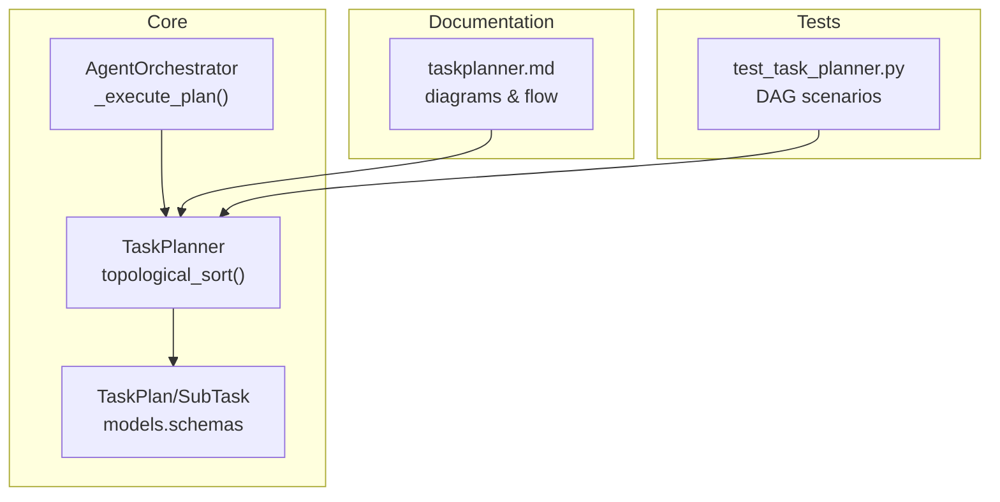
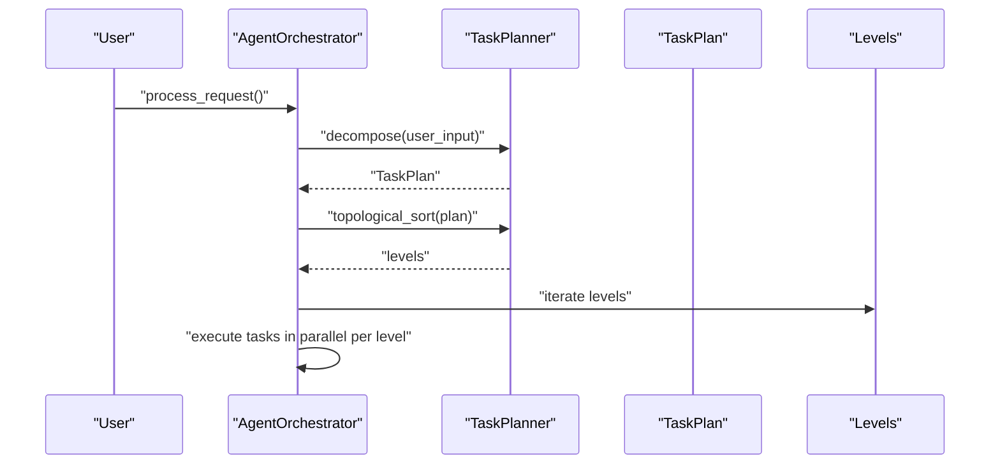
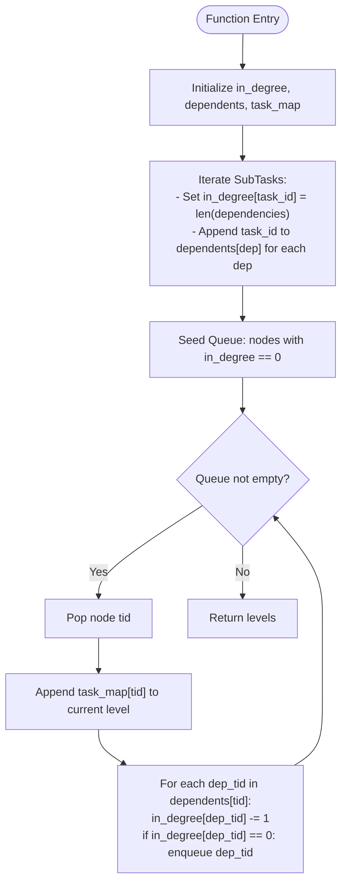
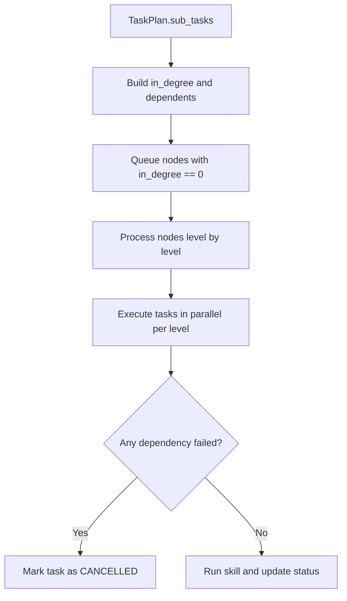
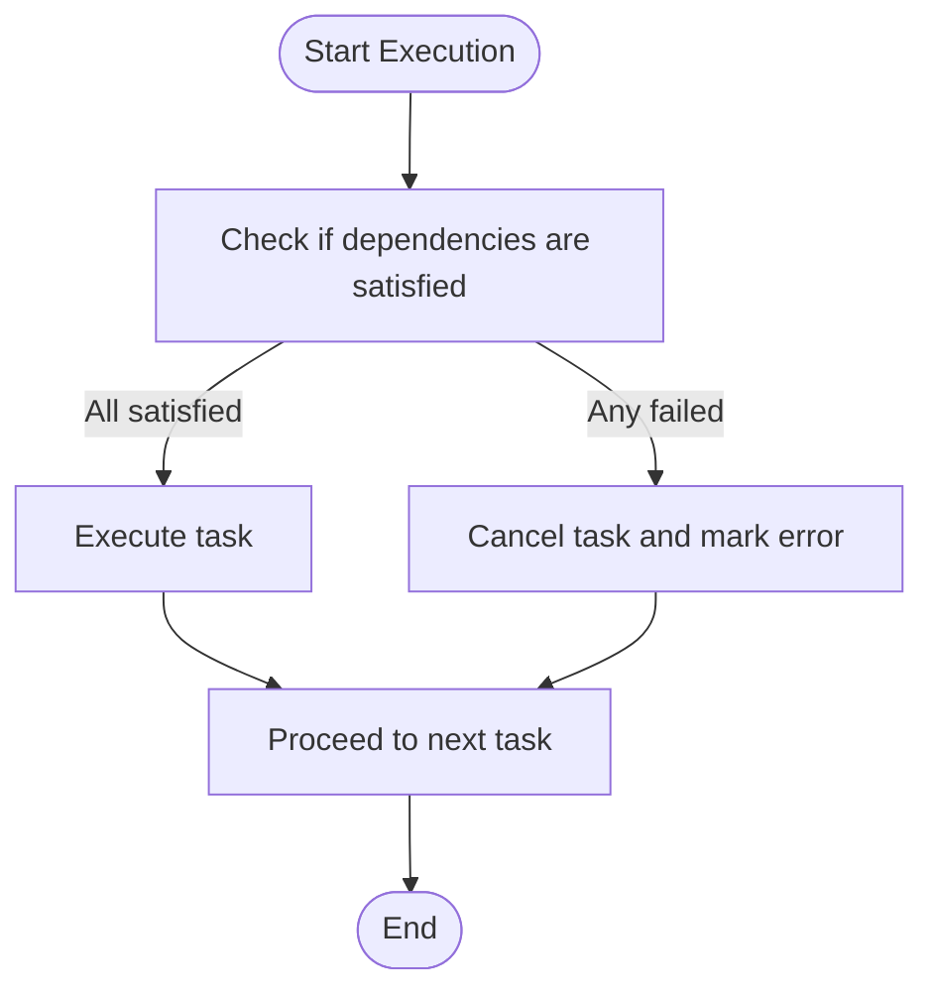
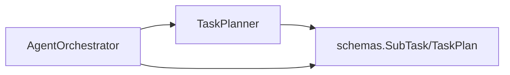

# Topological Sorting Algorithm

<cite>
**Referenced Files in This Document**
- [task_planner.py](file://src/aiops_agent/core/task_planner.py)
- [orchestrator.py](file://src/aiops_agent/core/orchestrator.py)
- [schemas.py](file://src/aiops_agent/models/schemas.py)
- [taskplanner.md](file://docs/taskplanner.md)
- [test_task_planner.py](file://tests/test_task_planner.py)
</cite>

## Table of Contents
1. [Introduction](#introduction)
2. [Project Structure](#project-structure)
3. [Core Components](#core-components)
4. [Architecture Overview](#architecture-overview)
5. [Detailed Component Analysis](#detailed-component-analysis)
6. [Dependency Analysis](#dependency-analysis)
7. [Performance Considerations](#performance-considerations)
8. [Troubleshooting Guide](#troubleshooting-guide)
9. [Conclusion](#conclusion)
10. [Appendices](#appendices)

## Introduction
This document explains the topological sorting algorithm implementation used to organize tasks based on dependencies. It focuses on Kahn’s algorithm for Directed Acyclic Graph (DAG) traversal, including adjacency list construction, in-degree calculation, and level-by-level task grouping. It documents dependency resolution, cycle detection mechanisms, and handling of disconnected components. Practical examples illustrate task graph construction, dependency mapping, and the resulting execution order. Edge cases such as circular dependencies, missing dependencies, and tasks with multiple parents are covered, along with performance analysis and optimization techniques for large task graphs.

## Project Structure
The topological sorting logic resides in the TaskPlanner component and is orchestrated by the AgentOrchestrator. The TaskPlan data model defines the task graph structure, and tests validate various dependency scenarios.

**Diagram sources**
- [task_planner.py:115-150](file://src/aiops_agent/core/task_planner.py#L115-L150)
- [orchestrator.py:424-483](file://src/aiops_agent/core/orchestrator.py#L424-L483)
- [schemas.py:29-51](file://src/aiops_agent/models/schemas.py#L29-L51)
- [taskplanner.md:121-148](file://docs/taskplanner.md#L121-L148)
- [test_task_planner.py:209-270](file://tests/test_task_planner.py#L209-L270)

**Section sources**
- [task_planner.py:115-150](file://src/aiops_agent/core/task_planner.py#L115-L150)
- [orchestrator.py:424-483](file://src/aiops_agent/core/orchestrator.py#L424-L483)
- [schemas.py:29-51](file://src/aiops_agent/models/schemas.py#L29-L51)
- [taskplanner.md:121-148](file://docs/taskplanner.md#L121-L148)
- [test_task_planner.py:209-270](file://tests/test_task_planner.py#L209-L270)

## Core Components
- TaskPlanner.topological_sort: Builds an adjacency representation of the task graph and performs Kahn’s algorithm to produce a level-by-level ordering of tasks that can be executed in parallel within each level.
- AgentOrchestrator._execute_plan: Uses the topological levels to schedule tasks, applying concurrency limits and failure propagation.
- TaskPlan/SubTask: Defines the task graph structure with task_id, dependencies, and status.

Key responsibilities:
- Build in-degree counts and adjacency lists from SubTask.dependencies.
- Initialize a queue with nodes having zero in-degree.
- Iteratively reduce in-degrees and enqueue nodes reaching zero in-degree.
- Group nodes into levels representing parallelizable groups.

**Section sources**
- [task_planner.py:115-150](file://src/aiops_agent/core/task_planner.py#L115-L150)
- [orchestrator.py:424-483](file://src/aiops_agent/core/orchestrator.py#L424-L483)
- [schemas.py:29-51](file://src/aiops_agent/models/schemas.py#L29-L51)

## Architecture Overview
The topological sorting pipeline integrates with the broader orchestration flow. The TaskPlanner constructs the DAG from TaskPlan.sub_tasks and returns levels. The Orchestrator consumes these levels to execute tasks in parallel within each level and serially across levels.

**Diagram sources**
- [orchestrator.py:84-198](file://src/aiops_agent/core/orchestrator.py#L84-L198)
- [task_planner.py:115-150](file://src/aiops_agent/core/task_planner.py#L115-L150)

## Detailed Component Analysis

### Kahn’s Algorithm Implementation
Kahn’s algorithm computes a topological ordering by iteratively removing nodes with zero in-degree and updating their neighbors’ in-degrees. The implementation builds:
- in_degree: task_id → count of incoming edges
- dependents: task_id → list of downstream tasks
- task_map: task_id → SubTask

It initializes a queue with all nodes having in_degree == 0 and processes nodes level by level.

**Diagram sources**
- [task_planner.py:115-150](file://src/aiops_agent/core/task_planner.py#L115-L150)

**Section sources**
- [task_planner.py:115-150](file://src/aiops_agent/core/task_planner.py#L115-L150)

### Adjacency List Construction and In-Degree Calculation
- For each SubTask, the algorithm sets in_degree[task_id] equal to the number of dependencies.
- For each dependency in SubTask.dependencies, it appends the current task_id to dependents[dep].

This creates:
- in_degree: maps each task to its number of prerequisites
- dependents: adjacency list mapping each task to its immediate successors

Edge cases handled implicitly:
- Tasks with no dependencies start with in_degree == 0.
- Tasks with multiple parents increase in_degree accordingly.

**Section sources**
- [task_planner.py:126-132](file://src/aiops_agent/core/task_planner.py#L126-L132)

### Level-by-Level Task Grouping
- The algorithm begins with nodes whose in_degree equals zero (no unmet prerequisites).
- As nodes are processed, their dependents’ in-degrees are decremented.
- Nodes reaching in_degree == 0 are grouped into the next level.
- The result is a list of lists, where each inner list contains tasks that can execute in parallel.

Practical examples:
- Independent tasks form a single level.
- Chain dependencies produce sequential levels.
- Diamond dependencies group multiple parents into the next level.

**Section sources**
- [task_planner.py:134-150](file://src/aiops_agent/core/task_planner.py#L134-L150)
- [test_task_planner.py:218-247](file://tests/test_task_planner.py#L218-L247)

### Dependency Resolution Process
- TaskPlan.sub_tasks define task_id and dependencies.
- The algorithm resolves dependencies by checking whether all prerequisite tasks have completed.
- In the orchestrator, tasks whose dependencies failed are cancelled to prevent cascading failures.

**Diagram sources**
- [task_planner.py:115-150](file://src/aiops_agent/core/task_planner.py#L115-L150)
- [orchestrator.py:433-445](file://src/aiops_agent/core/orchestrator.py#L433-L445)

**Section sources**
- [orchestrator.py:433-445](file://src/aiops_agent/core/orchestrator.py#L433-L445)

### Cycle Detection Mechanisms
The implementation does not explicitly detect cycles during topological_sort. However, the Orchestrator’s execution logic prevents cascading failures by cancelling tasks whose dependencies fail. In practice, if a cycle exists, the in_degree of affected nodes will never reach zero, and those nodes will remain unprocessed. The Orchestrator’s cancellation ensures downstream tasks are not scheduled.

**Diagram sources**
- [orchestrator.py:433-445](file://src/aiops_agent/core/orchestrator.py#L433-L445)

**Section sources**
- [orchestrator.py:433-445](file://src/aiops_agent/core/orchestrator.py#L433-L445)

### Handling Disconnected Components
Disconnected components are handled naturally:
- Each component’s roots (nodes with in_degree == 0) are seeded into the initial queue.
- Each component produces its own sequence of levels.
- The final result aggregates levels from all components.

**Section sources**
- [task_planner.py:134-150](file://src/aiops_agent/core/task_planner.py#L134-L150)

### Practical Examples
- Independent tasks: All tasks appear in a single level and can run concurrently.
- Chain dependencies: Tasks form sequential levels, strictly ordered.
- Diamond dependencies: Multiple parents converge into a single successor, grouped into the next level.

These behaviors are validated by unit tests covering independent, chain, diamond, mixed, single-task, and empty-plan scenarios.

**Section sources**
- [test_task_planner.py:218-269](file://tests/test_task_planner.py#L218-L269)

### Edge Cases
- Circular dependencies: Not detected during topological_sort; handled by Orchestrator’s cancellation logic.
- Missing dependencies: Resolved by ensuring all dependencies are present in the plan; Orchestrator cancels tasks with unsatisfied dependencies.
- Tasks with multiple parents: Correctly grouped into the next level when all parents finish.

**Section sources**
- [orchestrator.py:433-445](file://src/aiops_agent/core/orchestrator.py#L433-L445)
- [test_task_planner.py:218-269](file://tests/test_task_planner.py#L218-L269)

## Dependency Analysis
The TaskPlanner depends on:
- TaskPlan/SubTask models for task graph representation.
- Orchestrator for consuming topological levels and scheduling execution.

**Diagram sources**
- [task_planner.py:115-150](file://src/aiops_agent/core/task_planner.py#L115-L150)
- [orchestrator.py:424-483](file://src/aiops_agent/core/orchestrator.py#L424-L483)
- [schemas.py:29-51](file://src/aiops_agent/models/schemas.py#L29-L51)

**Section sources**
- [task_planner.py:115-150](file://src/aiops_agent/core/task_planner.py#L115-L150)
- [orchestrator.py:424-483](file://src/aiops_agent/core/orchestrator.py#L424-L483)
- [schemas.py:29-51](file://src/aiops_agent/models/schemas.py#L29-L51)

## Performance Considerations
- Time complexity: O(V + E), where V is the number of tasks and E is the number of dependency edges. This arises from iterating over tasks to compute in-degrees and traversing adjacency lists.
- Space complexity: O(V + E) for storing in_degree, dependents, and task_map.
- Concurrency: The Orchestrator limits concurrent tasks per level to avoid resource contention.
- Scalability tips:
  - Pre-validate TaskPlan to minimize invalid graphs.
  - Use streaming execution to reduce latency for long dependency chains.
  - Cache frequently accessed dependency sets if graphs repeat.

[No sources needed since this section provides general guidance]

## Troubleshooting Guide
Common issues and resolutions:
- No tasks produced: Verify LLM output parsing and skill mapping validation.
- All tasks marked failed: Check skill registration and availability.
- Partial failures: Inspect Orchestrator’s cancellation logic for tasks with failed dependencies.
- Long execution times: Consider reducing concurrency per level and optimizing dependency granularity.

**Section sources**
- [task_planner.py:156-187](file://src/aiops_agent/core/task_planner.py#L156-L187)
- [task_planner.py:189-206](file://src/aiops_agent/core/task_planner.py#L189-L206)
- [orchestrator.py:433-445](file://src/aiops_agent/core/orchestrator.py#L433-L445)

## Conclusion
The TaskPlanner’s topological_sort implements Kahn’s algorithm to produce level-wise task groupings suitable for parallel execution. Combined with the Orchestrator’s execution logic, it supports robust dependency resolution, failure propagation, and scalability. While explicit cycle detection is not implemented, the system’s cancellation mechanism mitigates the impact of cyclic or inconsistent dependencies.

[No sources needed since this section summarizes without analyzing specific files]

## Appendices

### Data Model Overview
- SubTask: task_id, skill_name, action, parameters, dependencies, status, result, error.
- TaskPlan: plan_id, user_request, sub_tasks, context, status.

**Section sources**
- [schemas.py:29-51](file://src/aiops_agent/models/schemas.py#L29-L51)

### Topological Sort Flow (Documentation Reference)
The documentation includes a detailed diagram of the topological_sort pipeline, showing DAG construction and BFS-based level extraction.

**Section sources**
- [taskplanner.md:121-148](file://docs/taskplanner.md#L121-L148)