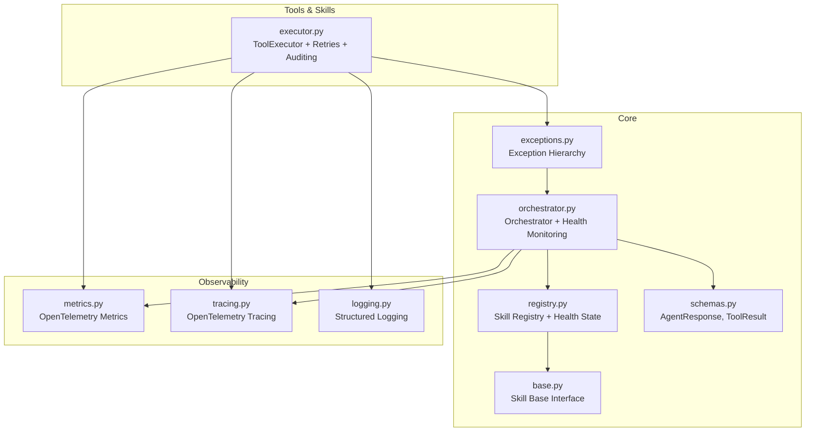
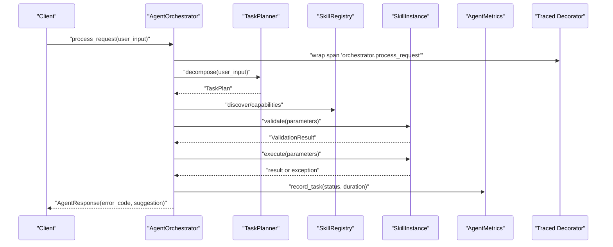
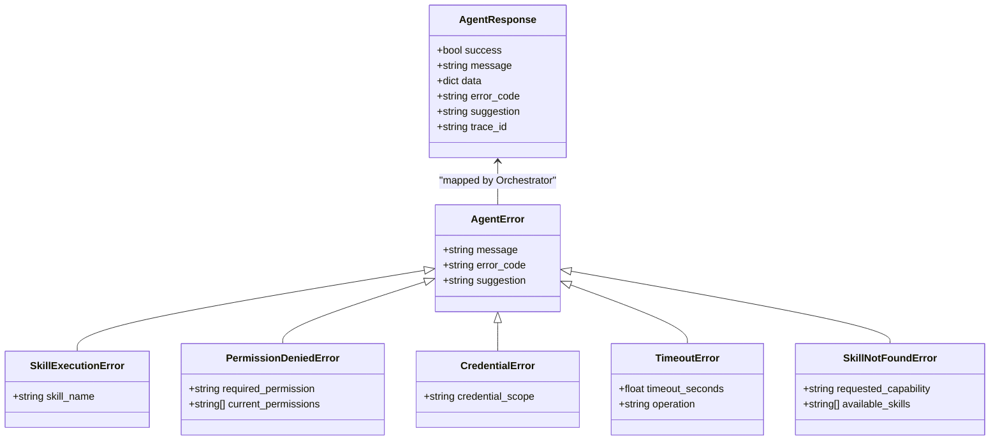
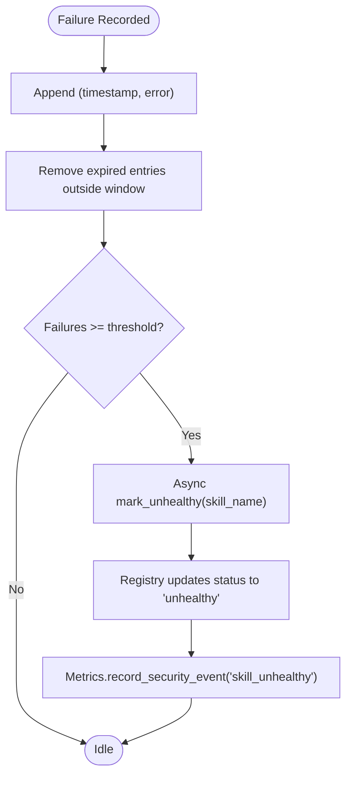
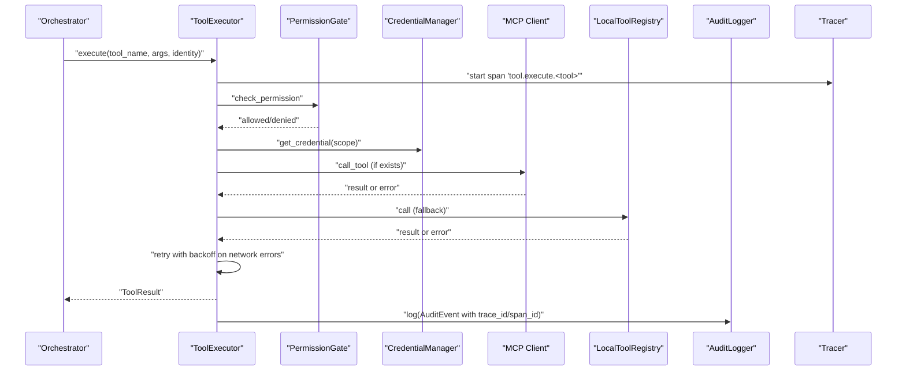
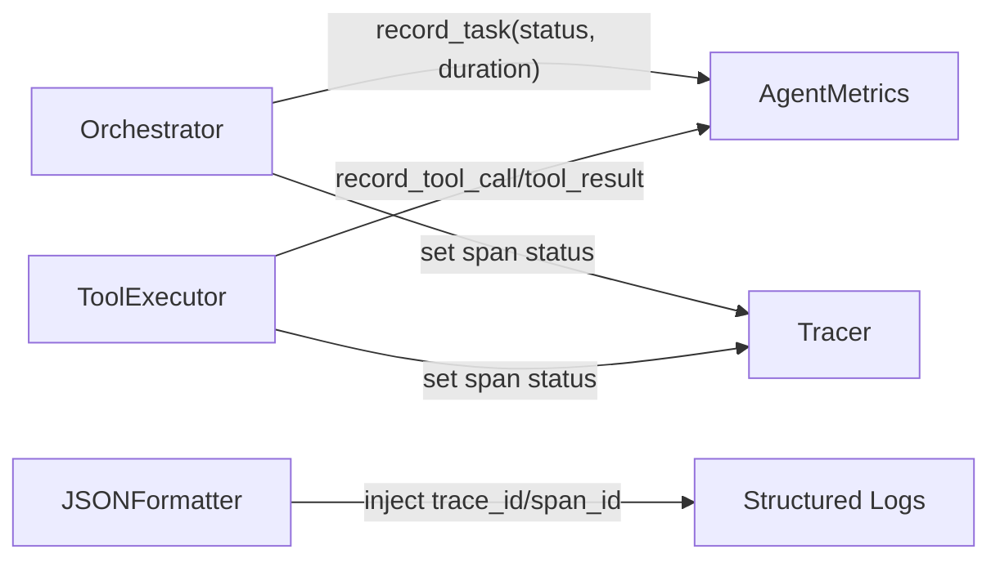
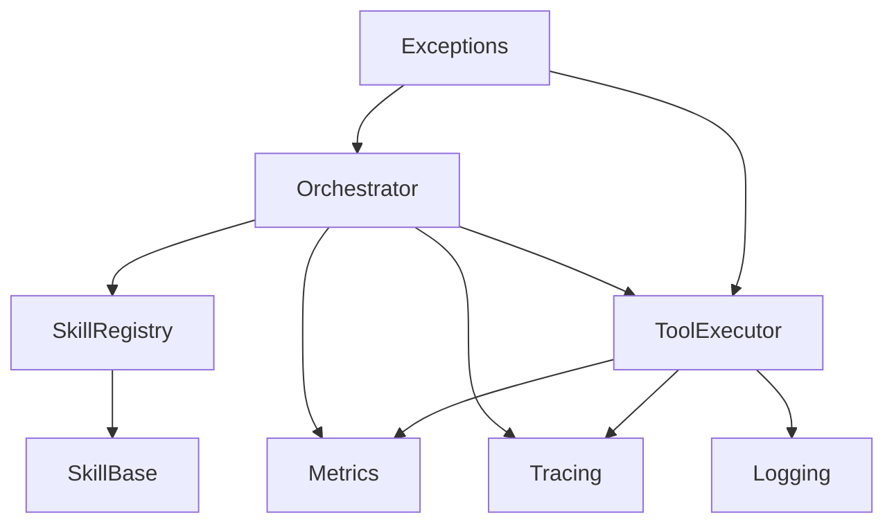

# Error Handling & Health Monitoring

<cite>
**Referenced Files in This Document**
- [exceptions.py](file://src/aiops_agent/core/exceptions.py)
- [orchestrator.py](file://src/aiops_agent/core/orchestrator.py)
- [registry.py](file://src/aiops_agent/skills/registry.py)
- [base.py](file://src/aiops_agent/skills/base.py)
- [schemas.py](file://src/aiops_agent/models/schemas.py)
- [executor.py](file://src/aiops_agent/tools/executor.py)
- [metrics.py](file://src/aiops_agent/observability/metrics.py)
- [tracing.py](file://src/aiops_agent/observability/tracing.py)
- [logging.py](file://src/aiops_agent/observability/logging.py)
- [test_exceptions.py](file://tests/test_exceptions.py)
- [test_monitoring_skill.py](file://tests/test_monitoring_skill.py)
- [test_observability_metrics.py](file://tests/test_observability_metrics.py)
- [test_observability_tracing.py](file://tests/test_observability_tracing.py)
</cite>

## Table of Contents
1. [Introduction](#introduction)
2. [Project Structure](#project-structure)
3. [Core Components](#core-components)
4. [Architecture Overview](#architecture-overview)
5. [Detailed Component Analysis](#detailed-component-analysis)
6. [Dependency Analysis](#dependency-analysis)
7. [Performance Considerations](#performance-considerations)
8. [Troubleshooting Guide](#troubleshooting-guide)
9. [Conclusion](#conclusion)
10. [Appendices](#appendices)

## Introduction
This document explains the error handling strategies and health monitoring systems within the Agent Orchestrator. It covers the exception hierarchy, error categorization, structured error responses, skill health monitoring with thresholds, integration with metrics and logging, and OpenTelemetry tracing for error correlation. Practical scenarios, recovery mechanisms, and dashboard integration guidance are included.

## Project Structure
The error handling and health monitoring spans several modules:
- Core exceptions define the taxonomy of errors surfaced to clients.
- The orchestrator coordinates task execution, routes to skills, aggregates failures, and enforces health thresholds.
- The skill registry maintains health state and exposes discovery and health APIs.
- Tools and skills integrate with observability for metrics, tracing, and structured logging.
- Tests validate behaviors and serve as examples of error scenarios.

**Diagram sources**
- [exceptions.py:1-143](file://src/aiops_agent/core/exceptions.py#L1-L143)
- [orchestrator.py:1-658](file://src/aiops_agent/core/orchestrator.py#L1-L658)
- [registry.py:1-284](file://src/aiops_agent/skills/registry.py#L1-L284)
- [base.py:1-93](file://src/aiops_agent/skills/base.py#L1-L93)
- [schemas.py:1-313](file://src/aiops_agent/models/schemas.py#L1-L313)
- [executor.py:1-314](file://src/aiops_agent/tools/executor.py#L1-L314)
- [metrics.py:1-150](file://src/aiops_agent/observability/metrics.py#L1-L150)
- [tracing.py:1-137](file://src/aiops_agent/observability/tracing.py#L1-L137)
- [logging.py:1-111](file://src/aiops_agent/observability/logging.py#L1-L111)

**Section sources**
- [exceptions.py:1-143](file://src/aiops_agent/core/exceptions.py#L1-L143)
- [orchestrator.py:1-658](file://src/aiops_agent/core/orchestrator.py#L1-L658)
- [registry.py:1-284](file://src/aiops_agent/skills/registry.py#L1-L284)
- [base.py:1-93](file://src/aiops_agent/skills/base.py#L1-L93)
- [schemas.py:1-313](file://src/aiops_agent/models/schemas.py#L1-L313)
- [executor.py:1-314](file://src/aiops_agent/tools/executor.py#L1-L314)
- [metrics.py:1-150](file://src/aiops_agent/observability/metrics.py#L1-L150)
- [tracing.py:1-137](file://src/aiops_agent/observability/tracing.py#L1-L137)
- [logging.py:1-111](file://src/aiops_agent/observability/logging.py#L1-L111)

## Core Components
- Exception hierarchy: A base AgentError with specialized subclasses for SkillExecutionError, PermissionDeniedError, CredentialError, TimeoutError, and SkillNotFoundError. These carry structured fields for message, error_code, and suggestion, enabling consistent client responses.
- Orchestrator error handling: Converts exceptions to AgentResponse with error_code and suggestion; records task metrics; integrates OpenTelemetry traces.
- Skill health monitoring: Tracks recent failures per skill within a rolling window and marks skills unhealthy automatically; registry updates status and filters unhealthy skills from discovery.
- Observability integration: Metrics counters/histograms, tracing spans with status and exceptions, and structured JSON logs enriched with trace/span IDs.

**Section sources**
- [exceptions.py:10-143](file://src/aiops_agent/core/exceptions.py#L10-L143)
- [orchestrator.py:174-194](file://src/aiops_agent/core/orchestrator.py#L174-L194)
- [orchestrator.py:571-596](file://src/aiops_agent/core/orchestrator.py#L571-L596)
- [registry.py:213-251](file://src/aiops_agent/skills/registry.py#L213-L251)
- [metrics.py:26-150](file://src/aiops_agent/observability/metrics.py#L26-L150)
- [tracing.py:32-137](file://src/aiops_agent/observability/tracing.py#L32-L137)
- [logging.py:18-111](file://src/aiops_agent/observability/logging.py#L18-L111)

## Architecture Overview
The orchestrator orchestrates task decomposition, skill routing, and execution. Failures are captured, aggregated, and correlated via tracing and metrics. Skills expose health_check; the registry surfaces health status and allows manual transitions.

**Diagram sources**
- [orchestrator.py:84-198](file://src/aiops_agent/core/orchestrator.py#L84-L198)
- [registry.py:122-153](file://src/aiops_agent/skills/registry.py#L122-L153)
- [base.py:47-92](file://src/aiops_agent/skills/base.py#L47-L92)
- [metrics.py:81-105](file://src/aiops_agent/observability/metrics.py#L81-L105)
- [tracing.py:98-136](file://src/aiops_agent/observability/tracing.py#L98-L136)

## Detailed Component Analysis

### Exception Hierarchy and Structured Responses
- AgentError is the base class carrying message, error_code, and suggestion. Specializations:
  - SkillExecutionError: skill_name included for context.
  - PermissionDeniedError: includes required_permission and current_permissions.
  - CredentialError: includes credential_scope.
  - TimeoutError: includes timeout_seconds and operation.
  - SkillNotFoundError: includes requested_capability and available_skills.
- Structured error response: AgentResponse includes success, message, data, error_code, suggestion, and trace_id. The orchestrator maps AgentError subclasses to AgentResponse consistently.

**Diagram sources**
- [exceptions.py:10-143](file://src/aiops_agent/core/exceptions.py#L10-L143)
- [schemas.py:53-62](file://src/aiops_agent/models/schemas.py#L53-L62)

**Section sources**
- [exceptions.py:10-143](file://src/aiops_agent/core/exceptions.py#L10-L143)
- [schemas.py:53-62](file://src/aiops_agent/models/schemas.py#L53-L62)
- [orchestrator.py:174-194](file://src/aiops_agent/core/orchestrator.py#L174-L194)

### Skill Health Monitoring and Automatic Unhealth Marking
- Rolling window failure tracking: Orchestrator maintains a deque-like list of (timestamp, error) per skill within a fixed window.
- Threshold-based health checks: If failures reach or exceed a threshold within the window, the skill is marked unhealthy asynchronously.
- Registry health operations: health_check delegates to the skill’s health_check; mark_unhealthy and mark_healthy update status; discovery filters out unhealthy skills.

**Diagram sources**
- [orchestrator.py:571-596](file://src/aiops_agent/core/orchestrator.py#L571-L596)
- [registry.py:213-251](file://src/aiops_agent/skills/registry.py#L213-L251)

**Section sources**
- [orchestrator.py:42-45](file://src/aiops_agent/core/orchestrator.py#L42-L45)
- [orchestrator.py:571-596](file://src/aiops_agent/core/orchestrator.py#L571-L596)
- [registry.py:213-251](file://src/aiops_agent/skills/registry.py#L213-L251)

### Tool Execution, Retries, and Structured Results
- ToolExecutor performs permission checks, optional credential acquisition, MCP/local tool dispatch, retries with exponential backoff, sanitization, auditing, and OpenTelemetry tracing.
- On PermissionDeniedError or TimeoutError, returns ToolResult with success=False and error message; other exceptions are captured and returned similarly.
- Audits include trace_id/span_id for correlation.

**Diagram sources**
- [executor.py:80-226](file://src/aiops_agent/tools/executor.py#L80-L226)
- [executor.py:231-295](file://src/aiops_agent/tools/executor.py#L231-L295)
- [schemas.py:73-82](file://src/aiops_agent/models/schemas.py#L73-L82)

**Section sources**
- [executor.py:80-226](file://src/aiops_agent/tools/executor.py#L80-L226)
- [executor.py:231-295](file://src/aiops_agent/tools/executor.py#L231-L295)
- [schemas.py:73-82](file://src/aiops_agent/models/schemas.py#L73-L82)

### Observability: Metrics, Tracing, and Logging
- Metrics: AgentMetrics exposes counters and histograms for tasks, durations, permission denials, security events, tool calls, and LLM calls. The orchestrator and tool executor record metrics on completion/failure.
- Tracing: Traced decorator sets span status OK or ERROR and records exceptions; setup_tracing supports console and SLS exporters.
- Logging: JSONFormatter injects trace_id/span_id and extra fields into structured logs.

**Diagram sources**
- [metrics.py:26-150](file://src/aiops_agent/observability/metrics.py#L26-L150)
- [tracing.py:32-137](file://src/aiops_agent/observability/tracing.py#L32-L137)
- [logging.py:18-111](file://src/aiops_agent/observability/logging.py#L18-L111)
- [orchestrator.py:153-154](file://src/aiops_agent/core/orchestrator.py#L153-L154)
- [executor.py:157-167](file://src/aiops_agent/tools/executor.py#L157-L167)

**Section sources**
- [metrics.py:26-150](file://src/aiops_agent/observability/metrics.py#L26-L150)
- [tracing.py:32-137](file://src/aiops_agent/observability/tracing.py#L32-L137)
- [logging.py:18-111](file://src/aiops_agent/observability/logging.py#L18-L111)
- [orchestrator.py:153-154](file://src/aiops_agent/core/orchestrator.py#L153-L154)
- [executor.py:157-167](file://src/aiops_agent/tools/executor.py#L157-L167)

## Dependency Analysis
- Orchestrator depends on SkillRegistry for discovery and health, ToolExecutor for tool invocation, and observability modules for metrics and tracing.
- SkillRegistry depends on SkillInstance for health_check and status updates.
- ToolExecutor depends on PermissionGate, CredentialManager, MCP/local tool registries, AuditLogger, and observability modules.
- Exceptions are consumed by Orchestrator and ToolExecutor to produce structured responses and audit events.

**Diagram sources**
- [orchestrator.py:34-38](file://src/aiops_agent/core/orchestrator.py#L34-L38)
- [registry.py:13-14](file://src/aiops_agent/skills/registry.py#L13-L14)
- [base.py:15-16](file://src/aiops_agent/skills/base.py#L15-L16)
- [executor.py:18-35](file://src/aiops_agent/tools/executor.py#L18-L35)
- [exceptions.py:7-8](file://src/aiops_agent/core/exceptions.py#L7-L8)

**Section sources**
- [orchestrator.py:34-38](file://src/aiops_agent/core/orchestrator.py#L34-L38)
- [registry.py:13-14](file://src/aiops_agent/skills/registry.py#L13-L14)
- [base.py:15-16](file://src/aiops_agent/skills/base.py#L15-L16)
- [executor.py:18-35](file://src/aiops_agent/tools/executor.py#L18-L35)
- [exceptions.py:7-8](file://src/aiops_agent/core/exceptions.py#L7-L8)

## Performance Considerations
- Asynchronous health marking avoids blocking execution paths.
- Metrics recording is conditional and lightweight; histograms are only recorded when duration is positive.
- Exponential backoff reduces load during transient network failures in ToolExecutor.
- Top-level concurrency is bounded via semaphores in orchestrator DAG execution.

[No sources needed since this section provides general guidance]

## Troubleshooting Guide
Common scenarios and recovery mechanisms:
- PermissionDeniedError: Review required_permission and current_permissions; adjust identity or policy; suggestion is provided in the exception.
- CredentialError: Verify Agent Identity configuration and credential provider availability; suggestion points to configuration checks.
- TimeoutError: Increase timeout configuration or investigate upstream latency; suggestion recommends retry or adjustment.
- SkillExecutionError: Inspect validation errors returned by skill.validate; fix input parameters.
- SkillNotFoundError: Confirm skill registration and capabilities; use available_skills list for guidance.
- Tool execution failures: Check ToolExecutor retry behavior and network connectivity; inspect ToolResult.error and audit logs for trace_id/span_id correlation.

Operational checks:
- Verify metrics exports and exporter configuration.
- Confirm tracing spans are created and exported; validate trace_id presence in logs.
- Ensure JSON logging formatter injects trace_id/span_id for cross-system correlation.

**Section sources**
- [exceptions.py:57-142](file://src/aiops_agent/core/exceptions.py#L57-L142)
- [executor.py:169-201](file://src/aiops_agent/tools/executor.py#L169-L201)
- [orchestrator.py:174-194](file://src/aiops_agent/core/orchestrator.py#L174-L194)
- [metrics.py:108-150](file://src/aiops_agent/observability/metrics.py#L108-L150)
- [tracing.py:32-87](file://src/aiops_agent/observability/tracing.py#L32-L87)
- [logging.py:30-57](file://src/aiops_agent/observability/logging.py#L30-L57)

## Conclusion
The Agent Orchestrator implements a robust, layered error handling system with a clear exception taxonomy, structured client responses, and comprehensive observability. Skill health monitoring proactively isolates failing skills, while metrics, tracing, and structured logging enable efficient error correlation and remediation.

[No sources needed since this section summarizes without analyzing specific files]

## Appendices

### Practical Examples and Scenarios
- PermissionDeniedError scenario: Orchestrator maps PermissionDeniedError to AgentResponse with error_code "PERMISSION_DENIED" and a suggestion to contact an administrator.
- TimeoutError scenario: ToolExecutor raises AgentTimeoutError after retries and timeout; Orchestrator captures and returns a structured failure with error_code "TIMEOUT_ERROR".
- SkillNotFoundError scenario: Orchestrator detects unmappable tasks and returns AgentResponse with error_code "SKILL_NOT_FOUND" and a suggestion including available skills.
- Skill health degradation: After N consecutive failures within the window, Orchestrator asynchronously marks the skill unhealthy; registry filters unhealthy skills from discovery.

**Section sources**
- [test_exceptions.py:93-130](file://tests/test_exceptions.py#L93-L130)
- [test_exceptions.py:171-227](file://tests/test_exceptions.py#L171-L227)
- [test_exceptions.py:233-267](file://tests/test_exceptions.py#L233-L267)
- [orchestrator.py:136-146](file://src/aiops_agent/core/orchestrator.py#L136-L146)
- [orchestrator.py:584-592](file://src/aiops_agent/core/orchestrator.py#L584-L592)
- [registry.py:122-153](file://src/aiops_agent/skills/registry.py#L122-L153)

### Recovery Mechanisms
- Automatic remediation: Unhealthy skills are excluded from routing; administrators can re-register or repair the skill; registry default version selection favors healthy versions.
- Manual intervention: mark_healthy can be invoked to restore a previously unhealthy skill after fixes.
- Retry and backoff: ToolExecutor applies exponential backoff for transient network errors.

**Section sources**
- [registry.py:246-251](file://src/aiops_agent/skills/registry.py#L246-L251)
- [registry.py:269-283](file://src/aiops_agent/skills/registry.py#L269-L283)
- [executor.py:231-274](file://src/aiops_agent/tools/executor.py#L231-L274)

### Monitoring Dashboard Integration
- Metrics: Configure MeterProvider and exporters; record task outcomes, durations, permission denials, security events, tool calls, and LLM calls.
- Tracing: Use traced decorator to capture spans; export to console or SLS-compatible OTLP endpoint; correlate logs and traces via trace_id/span_id.
- Logging: Enable JSON formatter to emit structured logs with trace identifiers for centralized log aggregation.

**Section sources**
- [metrics.py:108-150](file://src/aiops_agent/observability/metrics.py#L108-L150)
- [tracing.py:32-87](file://src/aiops_agent/observability/tracing.py#L32-L87)
- [logging.py:60-111](file://src/aiops_agent/observability/logging.py#L60-L111)