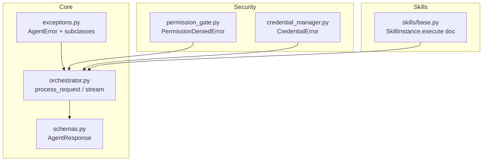
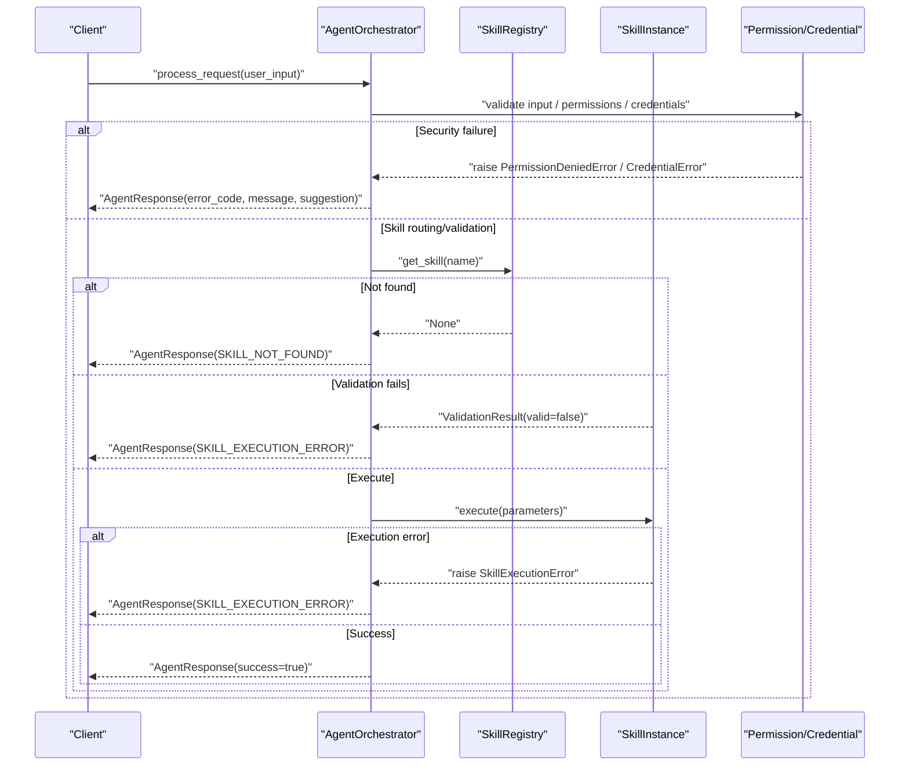
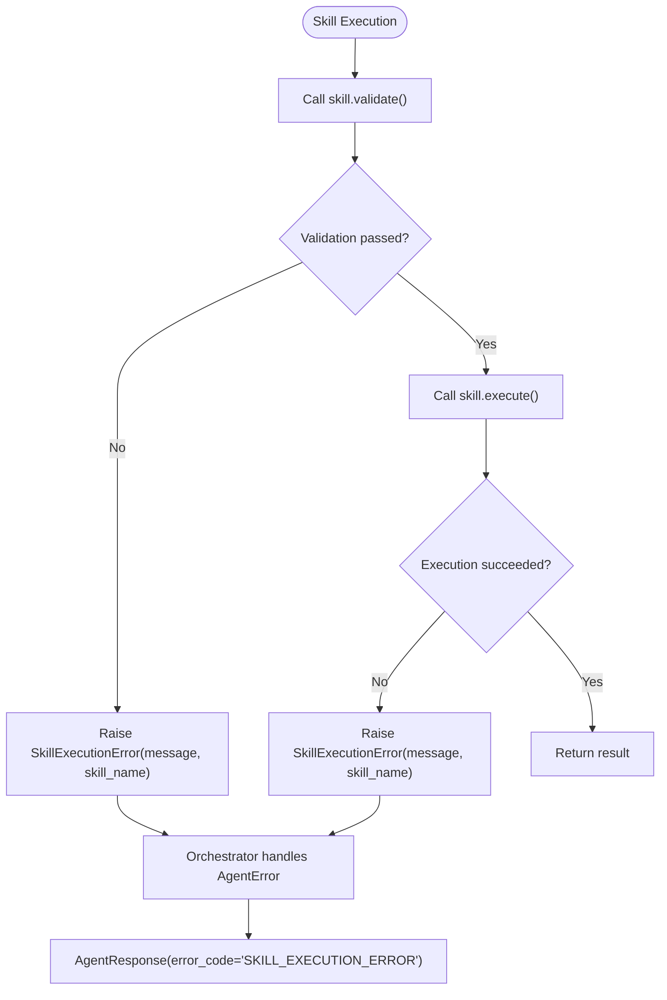
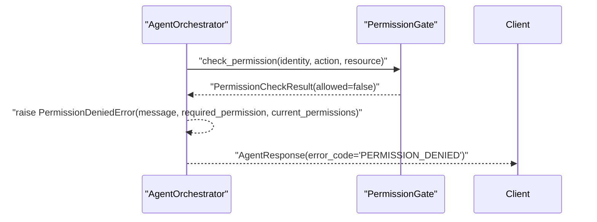
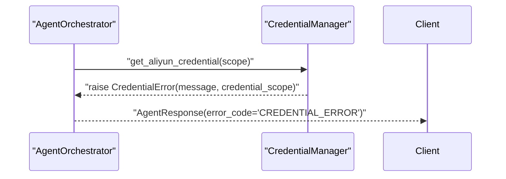
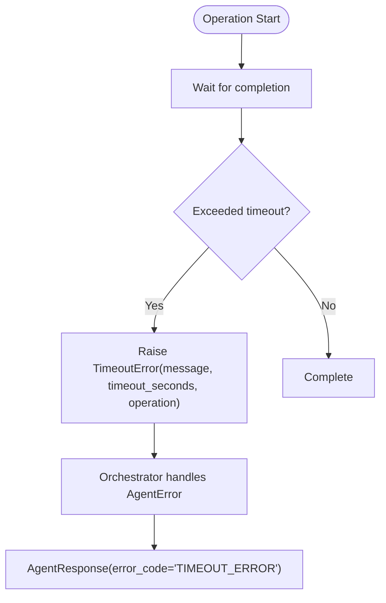
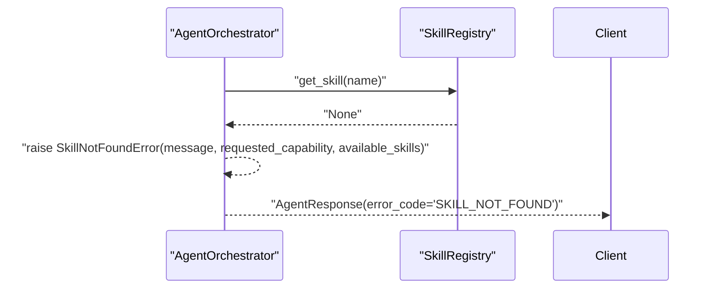
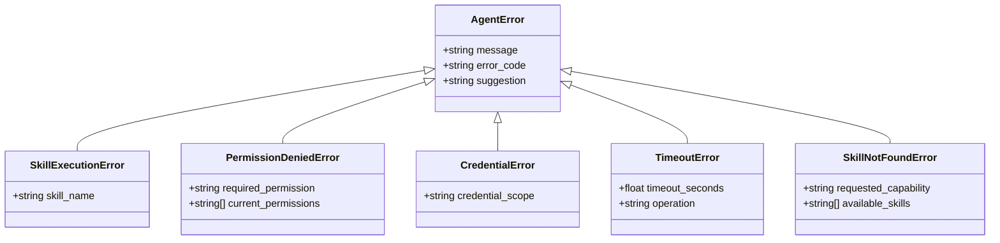

# Exception Hierarchy & Error Types

<cite>
**Referenced Files in This Document**
- [exceptions.py](file://src/aiops_agent/core/exceptions.py)
- [orchestrator.py](file://src/aiops_agent/core/orchestrator.py)
- [schemas.py](file://src/aiops_agent/models/schemas.py)
- [permission_gate.py](file://src/aiops_agent/security/permission_gate.py)
- [credential_manager.py](file://src/aiops_agent/security/credential_manager.py)
- [base.py](file://src/aiops_agent/skills/base.py)
- [test_exceptions.py](file://tests/test_exceptions.py)
</cite>

## Table of Contents
1. [Introduction](#introduction)
2. [Project Structure](#project-structure)
3. [Core Components](#core-components)
4. [Architecture Overview](#architecture-overview)
5. [Detailed Component Analysis](#detailed-component-analysis)
6. [Dependency Analysis](#dependency-analysis)
7. [Performance Considerations](#performance-considerations)
8. [Troubleshooting Guide](#troubleshooting-guide)
9. [Conclusion](#conclusion)

## Introduction
This document describes the exception hierarchy and error type system used by the Agent runtime. It covers the base AgentError class and five specialized exception types: SkillExecutionError, PermissionDeniedError, CredentialError, TimeoutError, and SkillNotFoundError. It explains the error code system, the structured error response format, and how each exception type carries metadata to support recovery suggestions. Practical examples illustrate when each exception is raised, error handling patterns, and integration with the Orchestrator’s error response generation. Finally, it documents the relationship between exception types and their impact on system behavior.

## Project Structure
The error handling system spans several modules:
- Core exception definitions under the core package
- Orchestrator integration for translating exceptions into structured responses
- Shared response model definitions
- Security components that raise permission and credential errors
- Skill base class that documents expected error behavior
- Tests validating exception semantics and inheritance

**Diagram sources**
- [exceptions.py:10-143](file://src/aiops_agent/core/exceptions.py#L10-L143)
- [orchestrator.py:47-198](file://src/aiops_agent/core/orchestrator.py#L47-L198)
- [schemas.py:53-62](file://src/aiops_agent/models/schemas.py#L53-L62)
- [permission_gate.py:15](file://src/aiops_agent/security/permission_gate.py#L15)
- [credential_manager.py:18](file://src/aiops_agent/security/credential_manager.py#L18)
- [base.py:47-60](file://src/aiops_agent/skills/base.py#L47-L60)

**Section sources**
- [exceptions.py:1-143](file://src/aiops_agent/core/exceptions.py#L1-L143)
- [orchestrator.py:1-658](file://src/aiops_agent/core/orchestrator.py#L1-L658)
- [schemas.py:1-313](file://src/aiops_agent/models/schemas.py#L1-L313)

## Core Components
- AgentError: Base class carrying message, error_code, and suggestion. All Agent-specific exceptions inherit from it.
- SkillExecutionError: Raised when a skill fails during execute or validation.
- PermissionDeniedError: Raised by permission gate when access is denied; includes required permission and current permissions.
- CredentialError: Raised by credential manager when credentials cannot be obtained or validated.
- TimeoutError: Raised when operations exceed configured timeouts; includes timeout duration and operation name.
- SkillNotFoundError: Raised when Orchestrator cannot route a request to a registered skill.

These exceptions are designed to propagate structured metadata that the Orchestrator converts into a standardized AgentResponse.

**Section sources**
- [exceptions.py:10-143](file://src/aiops_agent/core/exceptions.py#L10-L143)

## Architecture Overview
The Orchestrator integrates exception handling into two primary flows:
- Synchronous request processing: process_request catches AgentError and returns a structured AgentResponse.
- Streaming request processing: process_request_stream yields error events with the same structured fields.

**Diagram sources**
- [orchestrator.py:84-198](file://src/aiops_agent/core/orchestrator.py#L84-L198)
- [orchestrator.py:485-532](file://src/aiops_agent/core/orchestrator.py#L485-L532)
- [permission_gate.py:15](file://src/aiops_agent/security/permission_gate.py#L15)
- [credential_manager.py:18](file://src/aiops_agent/security/credential_manager.py#L18)
- [base.py:47-60](file://src/aiops_agent/skills/base.py#L47-L60)

## Detailed Component Analysis

### AgentError Base Class
- Purpose: Centralized error representation with error_code and suggestion for consistent downstream handling.
- Fields:
  - message: Human-readable error text
  - error_code: Structured code for programmatic handling
  - suggestion: Recovery guidance for users
- Behavior: Inherits from Exception; supports str() and repr() for logging and debugging.

Practical usage:
- Raise with explicit error_code and suggestion for predictable Orchestrator responses.
- Use repr() to capture structured metadata in logs.

**Section sources**
- [exceptions.py:10-35](file://src/aiops_agent/core/exceptions.py#L10-L35)

### SkillExecutionError
- When it is raised:
  - During skill validation (invalid parameters)
  - During skill execution (runtime failures)
- Metadata:
  - skill_name: Identifies the failing skill for diagnostics and health monitoring
- Orchestrator integration:
  - Validation failure → Orchestrator returns SKILL_EXECUTION_ERROR with suggestion
  - Execution failure → Orchestrator records failure and returns SKILL_EXECUTION_ERROR

**Diagram sources**
- [orchestrator.py:321-336](file://src/aiops_agent/core/orchestrator.py#L321-L336)
- [orchestrator.py:504-517](file://src/aiops_agent/core/orchestrator.py#L504-L517)
- [base.py:47-60](file://src/aiops_agent/skills/base.py#L47-L60)

**Section sources**
- [exceptions.py:37-54](file://src/aiops_agent/core/exceptions.py#L37-L54)
- [orchestrator.py:321-336](file://src/aiops_agent/core/orchestrator.py#L321-L336)
- [orchestrator.py:504-517](file://src/aiops_agent/core/orchestrator.py#L504-L517)
- [base.py:47-60](file://src/aiops_agent/skills/base.py#L47-L60)

### PermissionDeniedError
- When it is raised:
  - By PermissionGate when action/resource is not permitted for the effective permissions
- Metadata:
  - required_permission: The action/resource requested
  - current_permissions: Effective permissions used for evaluation
- Orchestrator integration:
  - Orchestrator catches AgentError and returns structured response with PERMISSION_DENIED code

**Diagram sources**
- [permission_gate.py:141-154](file://src/aiops_agent/security/permission_gate.py#L141-L154)
- [orchestrator.py:174-194](file://src/aiops_agent/core/orchestrator.py#L174-L194)

**Section sources**
- [exceptions.py:57-77](file://src/aiops_agent/core/exceptions.py#L57-L77)
- [permission_gate.py:141-154](file://src/aiops_agent/security/permission_gate.py#L141-L154)
- [orchestrator.py:174-194](file://src/aiops_agent/core/orchestrator.py#L174-L194)

### CredentialError
- When it is raised:
  - By CredentialManager when STS or third-party credentials cannot be obtained or are invalid
- Metadata:
  - credential_scope: Scope of the failing credential acquisition
- Orchestrator integration:
  - Orchestrator catches AgentError and returns structured response with CREDENTIAL_ERROR code

**Diagram sources**
- [credential_manager.py:97-102](file://src/aiops_agent/security/credential_manager.py#L97-L102)
- [credential_manager.py:153-157](file://src/aiops_agent/security/credential_manager.py#L153-L157)
- [orchestrator.py:174-194](file://src/aiops_agent/core/orchestrator.py#L174-L194)

**Section sources**
- [exceptions.py:79-98](file://src/aiops_agent/core/exceptions.py#L79-L98)
- [credential_manager.py:97-102](file://src/aiops_agent/security/credential_manager.py#L97-L102)
- [credential_manager.py:153-157](file://src/aiops_agent/security/credential_manager.py#L153-L157)
- [orchestrator.py:174-194](file://src/aiops_agent/core/orchestrator.py#L174-L194)

### TimeoutError
- When it is raised:
  - When operations exceed configured timeouts (e.g., tool calls or skill execution)
- Metadata:
  - timeout_seconds: Configured or observed timeout
  - operation: Operation name for context
- Orchestrator integration:
  - Orchestrator catches AgentError and returns structured response with TIMEOUT_ERROR code

**Diagram sources**
- [exceptions.py:100-121](file://src/aiops_agent/core/exceptions.py#L100-L121)
- [orchestrator.py:174-194](file://src/aiops_agent/core/orchestrator.py#L174-L194)

**Section sources**
- [exceptions.py:100-121](file://src/aiops_agent/core/exceptions.py#L100-L121)
- [orchestrator.py:174-194](file://src/aiops_agent/core/orchestrator.py#L174-L194)

### SkillNotFoundError
- When it is raised:
  - When Orchestrator cannot find a skill for a requested capability
- Metadata:
  - requested_capability: Capability name that could not be mapped
  - available_skills: List of currently registered skills for guidance
- Orchestrator integration:
  - Orchestrator returns structured response with SKILL_NOT_FOUND code and suggestion

**Diagram sources**
- [orchestrator.py:317-319](file://src/aiops_agent/core/orchestrator.py#L317-L319)
- [orchestrator.py:494-502](file://src/aiops_agent/core/orchestrator.py#L494-L502)
- [orchestrator.py:174-194](file://src/aiops_agent/core/orchestrator.py#L174-L194)

**Section sources**
- [exceptions.py:123-142](file://src/aiops_agent/core/exceptions.py#L123-L142)
- [orchestrator.py:317-319](file://src/aiops_agent/core/orchestrator.py#L317-L319)
- [orchestrator.py:494-502](file://src/aiops_agent/core/orchestrator.py#L494-L502)
- [orchestrator.py:174-194](file://src/aiops_agent/core/orchestrator.py#L174-L194)

## Dependency Analysis
- Inheritance: All Agent-specific exceptions inherit from AgentError, ensuring consistent metadata and handling.
- Orchestrator integration: The Orchestrator catches AgentError and maps it to AgentResponse, preserving error_code and suggestion.
- Security components: PermissionGate and CredentialManager raise PermissionDeniedError and CredentialError respectively, integrating with Orchestrator’s error handling.
- Skill contract: SkillInstance.execute documents raising SkillExecutionError, aligning with Orchestrator expectations.

**Diagram sources**
- [exceptions.py:10-143](file://src/aiops_agent/core/exceptions.py#L10-L143)

**Section sources**
- [exceptions.py:10-143](file://src/aiops_agent/core/exceptions.py#L10-L143)

## Performance Considerations
- Health monitoring: Orchestrator tracks skill failure counts and marks skills unhealthy after repeated failures, reducing retries on failing skills.
- Concurrency: Orchestrator executes tasks in parallel with a bounded semaphore; failures are recorded and surfaced in the final response.
- Metrics: Orchestrator records task completion/failure metrics to inform operational decisions.

**Section sources**
- [orchestrator.py:571-596](file://src/aiops_agent/core/orchestrator.py#L571-L596)
- [orchestrator.py:450-460](file://src/aiops_agent/core/orchestrator.py#L450-L460)

## Troubleshooting Guide
Common scenarios and recovery steps:
- PermissionDeniedError
  - Verify required_permission and current_permissions; adjust Workload Identity or user permissions accordingly.
  - Use suggestion to contact administrators or retry with sufficient privileges.
- CredentialError
  - Confirm WorkloadIdentityManager availability and OIDC configuration; check RAM role and identity provider settings.
  - Use suggestion to refresh or reconfigure Agent Identity.
- SkillExecutionError
  - Inspect skill_name and fix input parameters or underlying tool configuration.
  - Review Orchestrator logs for detailed error messages.
- TimeoutError
  - Increase timeout configuration or optimize the slow operation.
  - Use suggestion to retry later or adjust system load.
- SkillNotFoundError
  - Register the missing skill or adjust the request to match available capabilities.
  - Use suggestion to consult the skill catalog.

Integration points:
- Orchestrator maps AgentError subclasses to AgentResponse with error_code and suggestion.
- Streaming mode emits structured error events with the same fields.

**Section sources**
- [orchestrator.py:174-194](file://src/aiops_agent/core/orchestrator.py#L174-L194)
- [orchestrator.py:392-416](file://src/aiops_agent/core/orchestrator.py#L392-L416)
- [test_exceptions.py:19-301](file://tests/test_exceptions.py#L19-L301)

## Conclusion
The exception hierarchy provides a consistent, structured approach to error reporting across the Agent runtime. Each exception type carries targeted metadata enabling precise recovery guidance and automated handling by the Orchestrator. The system’s design ensures predictable error responses, robust integration with security and credential systems, and clear pathways for diagnosis and remediation.