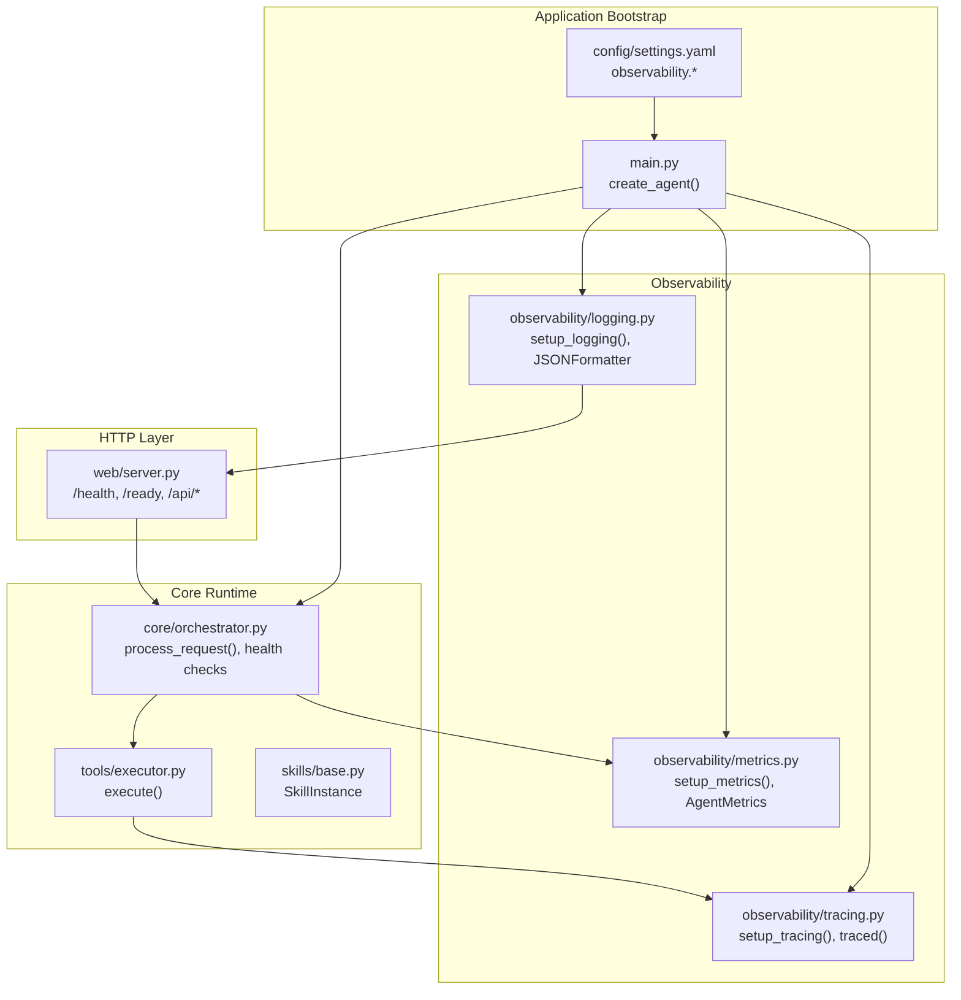
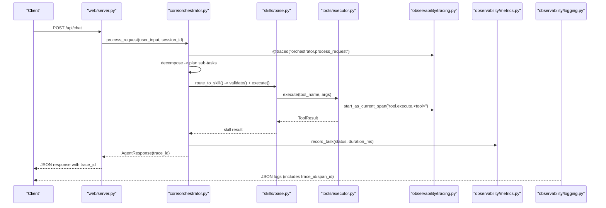
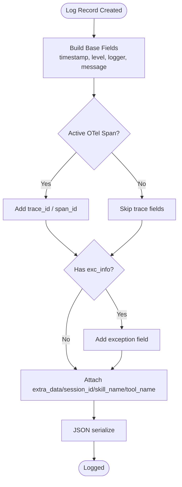
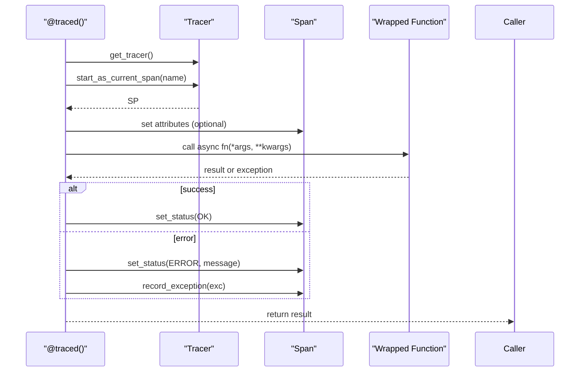
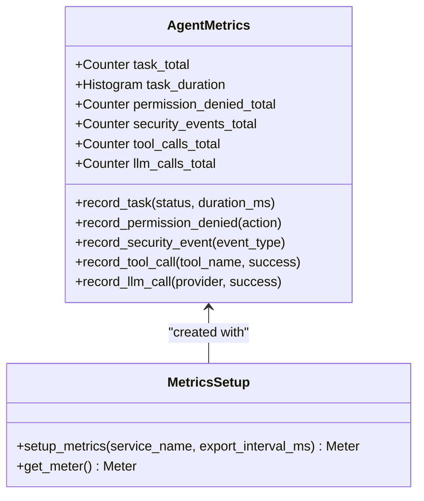
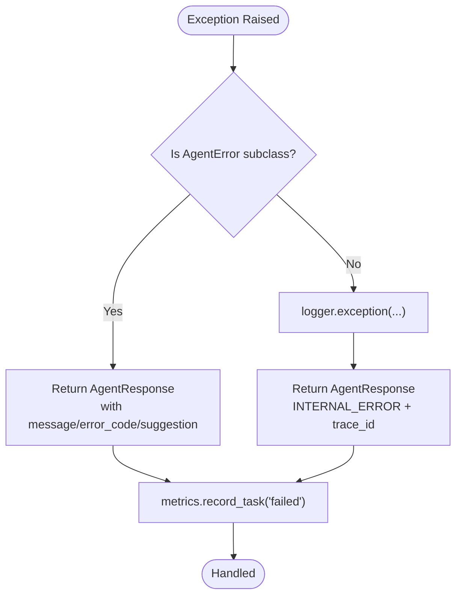
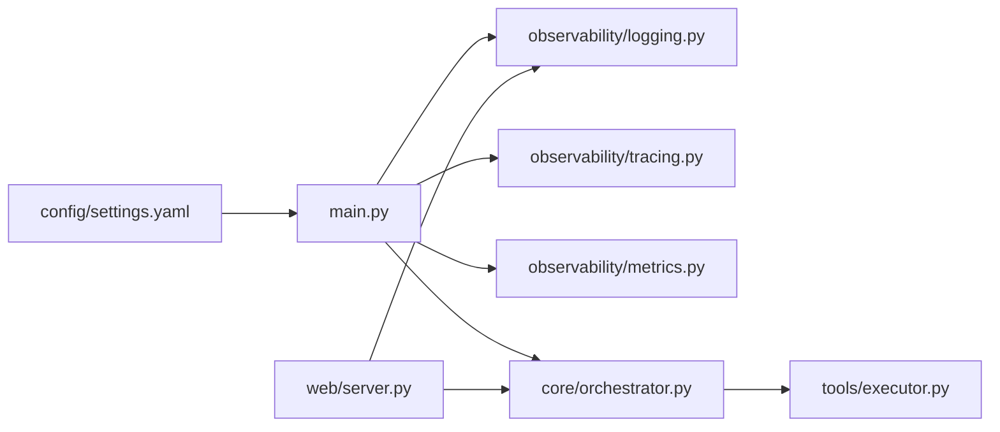
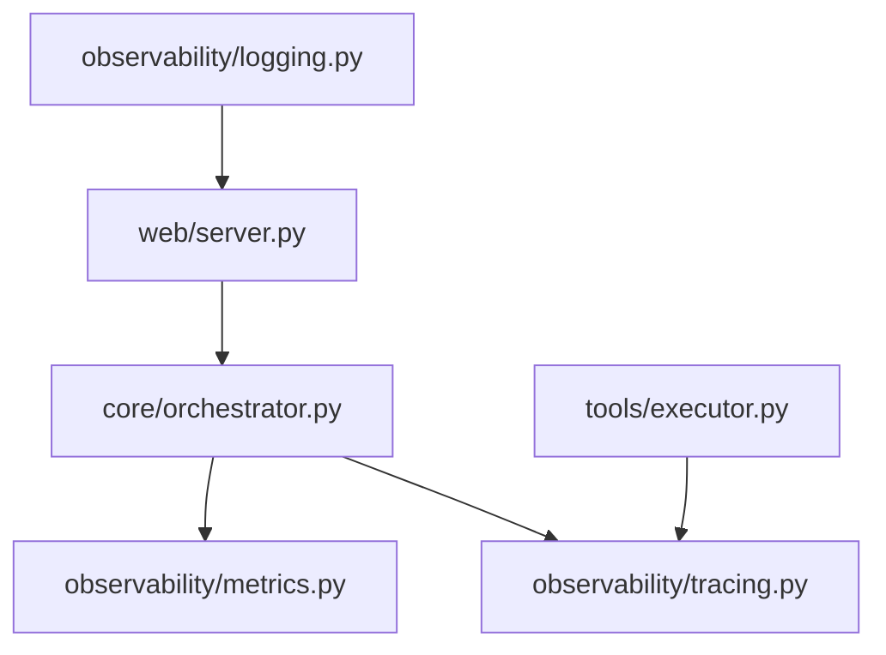

# Observability & Error Tracking

<cite>
**Referenced Files in This Document**
- [README.md](file://README.md)
- [settings.yaml](file://config/settings.yaml)
- [main.py](file://src/aiops_agent/main.py)
- [server.py](file://src/aiops_agent/web/server.py)
- [tracing.py](file://src/aiops_agent/observability/tracing.py)
- [metrics.py](file://src/aiops_agent/observability/metrics.py)
- [logging.py](file://src/aiops_agent/observability/logging.py)
- [exceptions.py](file://src/aiops_agent/core/exceptions.py)
- [orchestrator.py](file://src/aiops_agent/core/orchestrator.py)
- [executor.py](file://src/aiops_agent/tools/executor.py)
- [base.py](file://src/aiops_agent/skills/base.py)
- [test_observability_tracing.py](file://tests/test_observability_tracing.py)
- [test_observability_metrics.py](file://tests/test_observability_metrics.py)
- [test_observability_logging.py](file://tests/test_observability_logging.py)
</cite>

## Table of Contents
1. [Introduction](#introduction)
2. [Project Structure](#project-structure)
3. [Core Components](#core-components)
4. [Architecture Overview](#architecture-overview)
5. [Detailed Component Analysis](#detailed-component-analysis)
6. [Dependency Analysis](#dependency-analysis)
7. [Performance Considerations](#performance-considerations)
8. [Troubleshooting Guide](#troubleshooting-guide)
9. [Conclusion](#conclusion)
10. [Appendices](#appendices)

## Introduction
This document explains how observability is integrated across error handling, metrics, and distributed tracing in the AIOps Agent. It documents:
- How errors are captured and represented via structured logs, OpenTelemetry traces, and metrics
- How health monitoring detects recurring failures and marks skills as unhealthy
- How to correlate logs, traces, and metrics for end-to-end error tracking
- Practical guidance for building monitoring dashboards, alerts, and troubleshooting workflows

## Project Structure
The observability stack is implemented under a dedicated package and wired into the application lifecycle during startup. Key integration points:
- Application bootstrap initializes logging, tracing, and metrics
- The orchestrator and tool executor participate in tracing and metrics recording
- Web server exposes health and readiness endpoints and surfaces trace identifiers in responses

**Diagram sources**
- [main.py:70-222](file://src/aiops_agent/main.py#L70-L222)
- [settings.yaml:62-77](file://config/settings.yaml#L62-L77)
- [tracing.py:32-87](file://src/aiops_agent/observability/tracing.py#L32-L87)
- [metrics.py:108-141](file://src/aiops_agent/observability/metrics.py#L108-L141)
- [logging.py:60-111](file://src/aiops_agent/observability/logging.py#L60-L111)
- [orchestrator.py:84-198](file://src/aiops_agent/core/orchestrator.py#L84-L198)
- [executor.py:80-200](file://src/aiops_agent/tools/executor.py#L80-L200)
- [server.py:138-146](file://src/aiops_agent/web/server.py#L138-L146)

**Section sources**
- [main.py:70-222](file://src/aiops_agent/main.py#L70-L222)
- [settings.yaml:62-77](file://config/settings.yaml#L62-L77)

## Core Components
- Logging: Structured JSON logs with OpenTelemetry trace context and optional SLS integration hooks
- Tracing: OpenTelemetry TracerProvider with configurable exporters and a decorator to automatically trace async functions
- Metrics: OpenTelemetry Metrics with counters and histograms capturing tasks, durations, permissions, security events, tool calls, and LLM calls
- Health Monitoring: Orchestrator tracks skill failures over a window and marks skills unhealthy when thresholds are exceeded

**Section sources**
- [logging.py:18-111](file://src/aiops_agent/observability/logging.py#L18-L111)
- [tracing.py:32-137](file://src/aiops_agent/observability/tracing.py#L32-L137)
- [metrics.py:26-150](file://src/aiops_agent/observability/metrics.py#L26-L150)
- [orchestrator.py:571-596](file://src/aiops_agent/core/orchestrator.py#L571-L596)

## Architecture Overview
The observability pipeline ties together error capture, tracing, and metrics collection across the request lifecycle.

**Diagram sources**
- [server.py:44-82](file://src/aiops_agent/web/server.py#L44-L82)
- [orchestrator.py:84-198](file://src/aiops_agent/core/orchestrator.py#L84-L198)
- [base.py:47-72](file://src/aiops_agent/skills/base.py#L47-L72)
- [executor.py:80-200](file://src/aiops_agent/tools/executor.py#L80-L200)
- [tracing.py:98-137](file://src/aiops_agent/observability/tracing.py#L98-L137)
- [metrics.py:81-105](file://src/aiops_agent/observability/metrics.py#L81-L105)
- [logging.py:30-57](file://src/aiops_agent/observability/logging.py#L30-L57)

## Detailed Component Analysis

### Logging: Structured JSON with OpenTelemetry Context
- JSONFormatter emits ISO 8601 timestamps, level, logger name, message, and optional trace_id/span_id when a span is active
- Exception info is included when present
- Extra fields (e.g., session_id, skill_name, tool_name) are supported via record attributes
- setup_logging configures root logger, clears existing handlers, supports JSON/text formatters, and reserves SLS integration hooks

**Diagram sources**
- [logging.py:30-57](file://src/aiops_agent/observability/logging.py#L30-L57)

**Section sources**
- [logging.py:18-111](file://src/aiops_agent/observability/logging.py#L18-L111)
- [test_observability_logging.py:14-114](file://tests/test_observability_logging.py#L14-L114)
- [test_observability_logging.py:116-170](file://tests/test_observability_logging.py#L116-L170)

### Tracing: Decorator and Exporters
- setup_tracing initializes TracerProvider with Resource attributes and attaches processors/exporters
- Console exporter is default; SLS exporter uses OTLP when available, with fallback to console
- traced decorator wraps async functions, starts spans, sets status OK/ERROR, records exceptions, and preserves function metadata

**Diagram sources**
- [tracing.py:98-137](file://src/aiops_agent/observability/tracing.py#L98-L137)

**Section sources**
- [tracing.py:32-87](file://src/aiops_agent/observability/tracing.py#L32-L87)
- [tracing.py:98-137](file://src/aiops_agent/observability/tracing.py#L98-L137)
- [test_observability_tracing.py:39-175](file://tests/test_observability_tracing.py#L39-L175)

### Metrics: Task Rates, Durations, Permissions, Security, Calls
- AgentMetrics defines counters/histograms for:
  - aiops.task.total (status tag)
  - aiops.task.duration (ms, status tag)
  - aiops.permission.denied.total (action tag)
  - aiops.security.events.total (event_type tag)
  - aiops.tool.calls.total (tool_name, success)
  - aiops.llm.calls.total (provider, success)
- setup_metrics configures MeterProvider with periodic exporting and resource attributes
- record_task increments counters and optionally records duration histograms

**Diagram sources**
- [metrics.py:26-105](file://src/aiops_agent/observability/metrics.py#L26-L105)
- [metrics.py:108-150](file://src/aiops_agent/observability/metrics.py#L108-L150)

**Section sources**
- [metrics.py:26-150](file://src/aiops_agent/observability/metrics.py#L26-L150)
- [test_observability_metrics.py:17-185](file://tests/test_observability_metrics.py#L17-L185)

### Error Handling and Health Monitoring
- Custom exceptions encapsulate error codes and suggestions for structured responses
- Orchestrator:
  - Records task outcomes and durations via metrics
  - Categorizes exceptions into AgentError vs internal errors
  - Emits structured responses with trace_id and error_code
  - Tracks skill failures over a fixed window and marks skills unhealthy when thresholds are met
- ToolExecutor:
  - Starts spans for tool execution
  - Sets status OK/ERROR and records exceptions
  - Emits ToolResult with sanitized outputs and timing

**Diagram sources**
- [exceptions.py:10-143](file://src/aiops_agent/core/exceptions.py#L10-L143)
- [orchestrator.py:174-194](file://src/aiops_agent/core/orchestrator.py#L174-L194)
- [server.py:66-82](file://src/aiops_agent/web/server.py#L66-L82)

**Section sources**
- [exceptions.py:10-143](file://src/aiops_agent/core/exceptions.py#L10-L143)
- [orchestrator.py:571-596](file://src/aiops_agent/core/orchestrator.py#L571-L596)
- [executor.py:104-200](file://src/aiops_agent/tools/executor.py#L104-L200)
- [server.py:66-82](file://src/aiops_agent/web/server.py#L66-L82)

### Integration Points Across the System
- main.py: Initializes logging, tracing, metrics, and passes AgentMetrics to Orchestrator
- web/server.py: Exposes /health and /ready endpoints; includes trace_id in responses
- skills/base.py: Defines SkillInstance interface; skills can leverage ToolExecutor and tracing/metrics via Orchestrator/ToolExecutor
- settings.yaml: Centralizes observability configuration (tracing exporter, metrics export interval, logging level/format)

**Diagram sources**
- [settings.yaml:62-77](file://config/settings.yaml#L62-L77)
- [main.py:70-222](file://src/aiops_agent/main.py#L70-L222)
- [server.py:138-146](file://src/aiops_agent/web/server.py#L138-L146)

**Section sources**
- [main.py:70-222](file://src/aiops_agent/main.py#L70-L222)
- [server.py:138-146](file://src/aiops_agent/web/server.py#L138-L146)
- [base.py:21-93](file://src/aiops_agent/skills/base.py#L21-L93)
- [settings.yaml:62-77](file://config/settings.yaml#L62-L77)

## Dependency Analysis
- Coupling:
  - Orchestrator depends on AgentMetrics and tracing utilities
  - ToolExecutor depends on tracing utilities and records spans for tool calls
  - Web server depends on Orchestrator and logs for error responses
- Cohesion:
  - observability modules encapsulate concerns for logging, tracing, and metrics
- External dependencies:
  - OpenTelemetry SDK for tracing and metrics
  - Optional OTLP exporter for SLS integration

**Diagram sources**
- [orchestrator.py:34-36](file://src/aiops_agent/core/orchestrator.py#L34-L36)
- [executor.py:28](file://src/aiops_agent/tools/executor.py#L28)
- [server.py:17-18](file://src/aiops_agent/web/server.py#L17-L18)

**Section sources**
- [orchestrator.py:34-36](file://src/aiops_agent/core/orchestrator.py#L34-L36)
- [executor.py:28](file://src/aiops_agent/tools/executor.py#L28)
- [server.py:17-18](file://src/aiops_agent/web/server.py#L17-L18)

## Performance Considerations
- Metrics export interval: Tune export_interval_ms to balance overhead and freshness
- Tracing exporter choice: Prefer batch processors/exporters for production; console exporter is suitable for development
- Logging throughput: JSON formatter is efficient; avoid excessive extra fields to reduce payload sizes
- Health check window and threshold: Adjust failure window and threshold to minimize false positives while catching real regressions

[No sources needed since this section provides general guidance]

## Troubleshooting Guide
- Correlating errors across systems:
  - Use the trace_id surfaced in API responses and logs to join traces and logs
  - Verify that JSON logs include trace_id/span_id when a span is active
- Diagnosing skill health:
  - Monitor aiops.security.events.total with event_type "skill_unhealthy" to detect unhealthy skills
  - Inspect Orchestrator’s skill failure window and threshold configuration
- Verifying observability setup:
  - Confirm setup_tracing and setup_metrics are invoked during bootstrap
  - Validate that @traced decorators are applied to key async functions
  - Ensure logging level/format matches expectations from settings.yaml

**Section sources**
- [server.py:66-82](file://src/aiops_agent/web/server.py#L66-L82)
- [logging.py:30-57](file://src/aiops_agent/observability/logging.py#L30-L57)
- [tracing.py:98-137](file://src/aiops_agent/observability/tracing.py#L98-L137)
- [metrics.py:81-105](file://src/aiops_agent/observability/metrics.py#L81-L105)
- [orchestrator.py:571-596](file://src/aiops_agent/core/orchestrator.py#L571-L596)

## Conclusion
The AIOps Agent integrates observability comprehensively: structured logging enriches with trace context, distributed tracing annotates critical paths, and metrics capture error rates and durations. Together with health monitoring for skills, operators can build robust dashboards, alerts, and troubleshooting workflows centered on trace_id and standardized error codes.

[No sources needed since this section summarizes without analyzing specific files]

## Appendices

### Practical Dashboards and Alerts
- Dashboard ideas:
  - Error rate per skill: aiops.task.total with status="failed" divided by total
  - Latency by status: aiops.task.duration histogram by status
  - Permission denied trends: aiops.permission.denied.total by action
  - Security incidents: aiops.security.events.total by event_type
  - Tool/LLM call success: aiops.tool.calls.total and aiops.llm.calls.total by success
- Alerting suggestions:
  - High error rate: trigger when aiops.task.total(status="failed") increases above baseline
  - Elevated latency: trigger on p95/p99 of aiops.task.duration
  - Repeated skill failures: trigger when aiops.security.events.total(event_type="skill_unhealthy") increases

[No sources needed since this section provides general guidance]

### Configuration Reference
- observability.tracing.exporter: "console" or "sls"
- observability.metrics.export_interval_seconds: numeric interval
- observability.logging.level: log level
- observability.logging.format: "json" or "text"

**Section sources**
- [settings.yaml:62-77](file://config/settings.yaml#L62-L77)