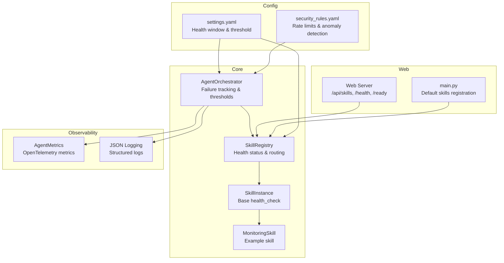
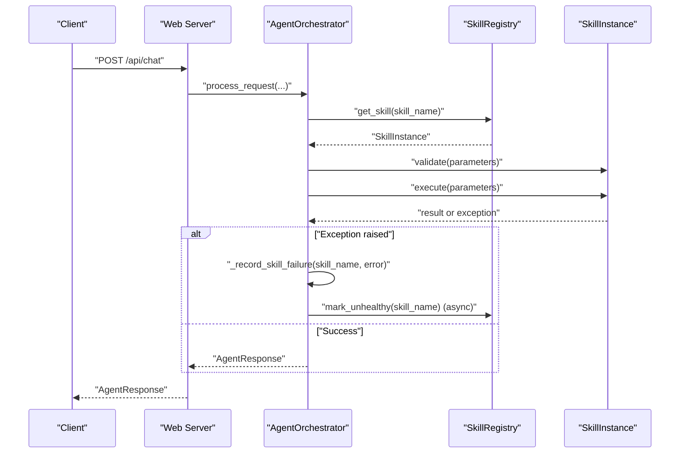
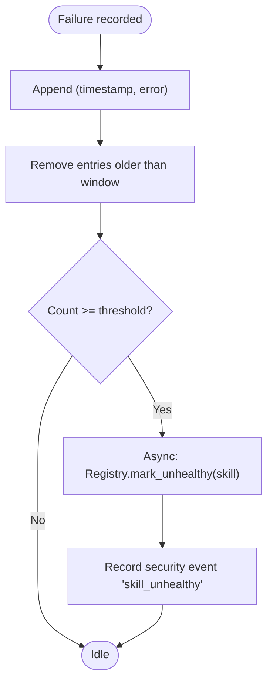
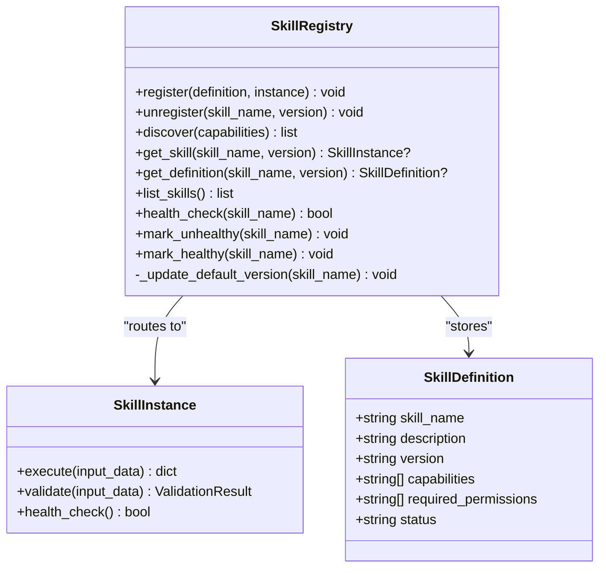
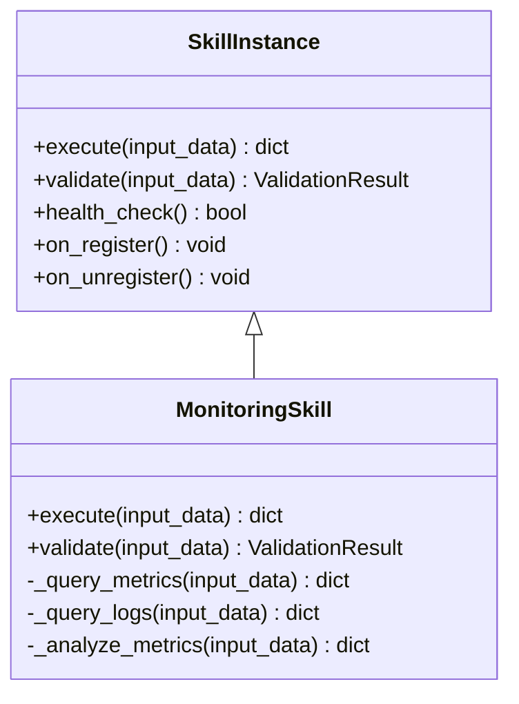
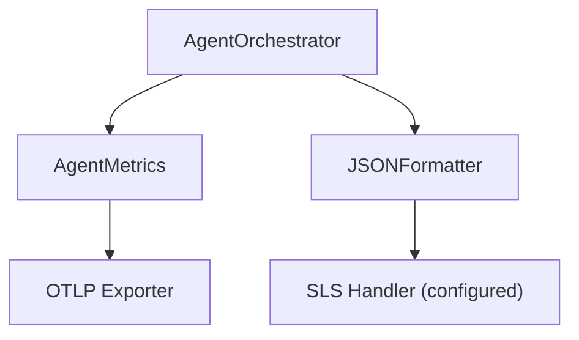
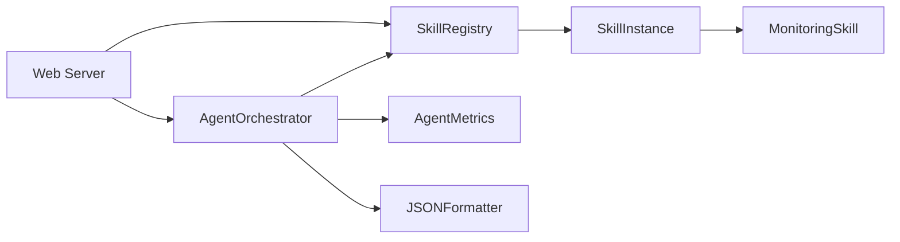

# Skill Health Monitoring

<cite>
**Referenced Files in This Document**
- [registry.py](file://src/aiops_agent/skills/registry.py)
- [base.py](file://src/aiops_agent/skills/base.py)
- [monitoring.py](file://src/aiops_agent/skills/monitoring.py)
- [orchestrator.py](file://src/aiops_agent/core/orchestrator.py)
- [schemas.py](file://src/aiops_agent/models/schemas.py)
- [metrics.py](file://src/aiops_agent/observability/metrics.py)
- [logging.py](file://src/aiops_agent/observability/logging.py)
- [settings.yaml](file://config/settings.yaml)
- [security_rules.yaml](file://config/security_rules.yaml)
- [server.py](file://src/aiops_agent/web/server.py)
- [main.py](file://src/aiops_agent/main.py)
- [test_orchestrator.py](file://tests/test_orchestrator.py)
- [test_skill_registry.py](file://tests/test_skill_registry.py)
- [test_skill_registry_extended.py](file://tests/test_skill_registry_extended.py)
</cite>

## Table of Contents
1. [Introduction](#introduction)
2. [Project Structure](#project-structure)
3. [Core Components](#core-components)
4. [Architecture Overview](#architecture-overview)
5. [Detailed Component Analysis](#detailed-component-analysis)
6. [Dependency Analysis](#dependency-analysis)
7. [Performance Considerations](#performance-considerations)
8. [Troubleshooting Guide](#troubleshooting-guide)
9. [Conclusion](#conclusion)
10. [Appendices](#appendices)

## Introduction
This document describes the skill health monitoring system in the AIOps Agent. It explains how failures are counted, how threshold-based health checks operate, and how skills are automatically marked unhealthy. It also covers integration with the skill registry for health status tracking, recovery mechanisms when skills become unhealthy, and automatic reactivation policies. Additionally, it documents health metrics collection, monitoring dashboard integration, alerting thresholds, practical failure scenarios, health check intervals, and manual intervention procedures.

## Project Structure
The health monitoring system spans several modules:
- Orchestrator: central coordinator that tracks skill failures and enforces thresholds
- Skill Registry: maintains health status and routes healthy skills
- Skill Base and Implementations: define health_check behavior and integrate with ToolExecutor
- Observability: metrics and logging for health events
- Configuration: settings for health check windows and thresholds
- Web Server: exposes skill listing and health endpoints

**Diagram sources**
- [orchestrator.py:47-658](file://src/aiops_agent/core/orchestrator.py#L47-L658)
- [registry.py:19-284](file://src/aiops_agent/skills/registry.py#L19-L284)
- [base.py:21-93](file://src/aiops_agent/skills/base.py#L21-L93)
- [monitoring.py:18-140](file://src/aiops_agent/skills/monitoring.py#L18-L140)
- [metrics.py:26-150](file://src/aiops_agent/observability/metrics.py#L26-L150)
- [logging.py:18-111](file://src/aiops_agent/observability/logging.py#L18-L111)
- [settings.yaml:56-61](file://config/settings.yaml#L56-L61)
- [security_rules.yaml:44-69](file://config/security_rules.yaml#L44-L69)
- [server.py:138-194](file://src/aiops_agent/web/server.py#L138-L194)
- [main.py:225-293](file://src/aiops_agent/main.py#L225-L293)

**Section sources**
- [orchestrator.py:47-658](file://src/aiops_agent/core/orchestrator.py#L47-L658)
- [registry.py:19-284](file://src/aiops_agent/skills/registry.py#L19-L284)
- [base.py:21-93](file://src/aiops_agent/skills/base.py#L21-L93)
- [monitoring.py:18-140](file://src/aiops_agent/skills/monitoring.py#L18-L140)
- [metrics.py:26-150](file://src/aiops_agent/observability/metrics.py#L26-L150)
- [logging.py:18-111](file://src/aiops_agent/observability/logging.py#L18-L111)
- [settings.yaml:56-61](file://config/settings.yaml#L56-L61)
- [security_rules.yaml:44-69](file://config/security_rules.yaml#L44-L69)
- [server.py:138-194](file://src/aiops_agent/web/server.py#L138-L194)
- [main.py:225-293](file://src/aiops_agent/main.py#L225-L293)

## Core Components
- Failure counting window and threshold:
  - Window: 10 minutes
  - Threshold: 5 consecutive failures within the window
- Health check integration:
  - Orchestrator records failures and triggers asynchronous registry updates
  - Registry’s health_check delegates to SkillInstance.health_check and updates status
- Automatic marking:
  - When threshold reached, Orchestrator asynchronously marks the skill unhealthy via SkillRegistry
- Recovery and reactivation:
  - Manual reset to healthy via registry APIs
  - Default version selection prefers latest healthy version
- Metrics and logging:
  - Metrics include a security event counter for “skill_unhealthy”
  - Structured JSON logging integrates OpenTelemetry trace/span IDs
- Dashboard and alerts:
  - Skills listing endpoint exposes status field for dashboards
  - Metrics exporter configured for periodic export

**Section sources**
- [orchestrator.py:42-45](file://src/aiops_agent/core/orchestrator.py#L42-L45)
- [orchestrator.py:571-596](file://src/aiops_agent/core/orchestrator.py#L571-L596)
- [registry.py:213-251](file://src/aiops_agent/skills/registry.py#L213-L251)
- [base.py:86-93](file://src/aiops_agent/skills/base.py#L86-L93)
- [metrics.py:95-105](file://src/aiops_agent/observability/metrics.py#L95-L105)
- [logging.py:30-57](file://src/aiops_agent/observability/logging.py#L30-L57)
- [server.py:148-171](file://src/aiops_agent/web/server.py#L148-L171)
- [settings.yaml:56-61](file://config/settings.yaml#L56-L61)

## Architecture Overview
The health monitoring pipeline connects Orchestrator, Skill Registry, and Skills. Failures are recorded in the Orchestrator, and when thresholds are exceeded, the Orchestrator asynchronously updates the registry, which reflects the unhealthy status to callers and routing logic.

**Diagram sources**
- [server.py:44-82](file://src/aiops_agent/web/server.py#L44-L82)
- [orchestrator.py:84-194](file://src/aiops_agent/core/orchestrator.py#L84-L194)
- [registry.py:213-251](file://src/aiops_agent/skills/registry.py#L213-L251)
- [base.py:47-72](file://src/aiops_agent/skills/base.py#L47-L72)

## Detailed Component Analysis

### Orchestrator Health Monitoring
- Failure tracking:
  - Maintains a sliding window of recent failures per skill
  - Cleans old entries outside the configured window
- Threshold enforcement:
  - If number of failures reaches threshold, marks skill unhealthy asynchronously
- Metrics and logging:
  - Records security event “skill_unhealthy” when a skill becomes unhealthy

**Diagram sources**
- [orchestrator.py:571-596](file://src/aiops_agent/core/orchestrator.py#L571-L596)
- [metrics.py:95-105](file://src/aiops_agent/observability/metrics.py#L95-L105)

**Section sources**
- [orchestrator.py:42-45](file://src/aiops_agent/core/orchestrator.py#L42-L45)
- [orchestrator.py:571-596](file://src/aiops_agent/core/orchestrator.py#L571-L596)
- [settings.yaml:56-61](file://config/settings.yaml#L56-L61)

### Skill Registry Health Management
- health_check:
  - Delegates to SkillInstance.health_check
  - Updates SkillDefinition.status to “healthy” or “unhealthy”
- mark_unhealthy/mark_healthy:
  - Manual overrides for health state
- discover:
  - Filters out skills with non-“healthy” status
- default version selection:
  - Chooses latest version among healthy ones

**Diagram sources**
- [registry.py:19-284](file://src/aiops_agent/skills/registry.py#L19-L284)
- [base.py:21-93](file://src/aiops_agent/skills/base.py#L21-L93)
- [schemas.py:283-313](file://src/aiops_agent/models/schemas.py#L283-L313)

**Section sources**
- [registry.py:213-251](file://src/aiops_agent/skills/registry.py#L213-L251)
- [registry.py:122-153](file://src/aiops_agent/skills/registry.py#L122-L153)
- [registry.py:269-284](file://src/aiops_agent/skills/registry.py#L269-L284)

### Skill Base and Example Implementation
- SkillInstance.health_check:
  - Default implementation returns True
  - Override in concrete skills to implement custom liveness/readiness checks
- MonitoringSkill:
  - Integrates with ToolExecutor to query metrics/logs
  - Validates inputs and executes actions

**Diagram sources**
- [base.py:21-93](file://src/aiops_agent/skills/base.py#L21-L93)
- [monitoring.py:18-140](file://src/aiops_agent/skills/monitoring.py#L18-L140)

**Section sources**
- [base.py:86-93](file://src/aiops_agent/skills/base.py#L86-L93)
- [monitoring.py:30-140](file://src/aiops_agent/skills/monitoring.py#L30-L140)

### Observability: Metrics and Logging
- AgentMetrics:
  - Exposes counters and histograms for tasks, permissions, security events, tool/LLM calls
  - Records “skill_unhealthy” security event during automatic marking
- JSON Logging:
  - Structured JSON output with OpenTelemetry trace/span IDs
  - Supports SLS integration hooks

**Diagram sources**
- [metrics.py:26-150](file://src/aiops_agent/observability/metrics.py#L26-L150)
- [logging.py:18-111](file://src/aiops_agent/observability/logging.py#L18-L111)
- [orchestrator.py:594-596](file://src/aiops_agent/core/orchestrator.py#L594-L596)

**Section sources**
- [metrics.py:95-105](file://src/aiops_agent/observability/metrics.py#L95-L105)
- [logging.py:30-57](file://src/aiops_agent/observability/logging.py#L30-L57)

### Configuration and Defaults
- Health window and threshold:
  - Window: 10 minutes
  - Threshold: 5 failures
- Metrics export interval:
  - 60 seconds
- Logging format:
  - JSON with structured fields and OpenTelemetry context

**Section sources**
- [settings.yaml:56-61](file://config/settings.yaml#L56-L61)
- [settings.yaml:70-76](file://config/settings.yaml#L70-L76)
- [metrics.py:108-141](file://src/aiops_agent/observability/metrics.py#L108-L141)

### Web Integration and Dashboard Exposure
- Skills listing endpoint:
  - Returns skills with status field for dashboards and operators
- Health and readiness endpoints:
  - /health and /ready for platform probes
- Frontend pages:
  - Skills market page consumes /api/skills

**Section sources**
- [server.py:148-171](file://src/aiops_agent/web/server.py#L148-L171)
- [server.py:138-146](file://src/aiops_agent/web/server.py#L138-L146)
- [server.py:185-193](file://src/aiops_agent/web/server.py#L185-L193)

## Dependency Analysis
- Orchestrator depends on SkillRegistry for skill retrieval and health updates
- SkillRegistry depends on SkillInstance for health_check and status propagation
- MonitoringSkill depends on ToolExecutor for external operations
- Observability modules are injected into Orchestrator and used for metrics and logging
- Web server depends on Orchestrator for request processing and on SkillRegistry for listing

**Diagram sources**
- [orchestrator.py:69-73](file://src/aiops_agent/core/orchestrator.py#L69-L73)
- [registry.py:31-35](file://src/aiops_agent/skills/registry.py#L31-L35)
- [monitoring.py:27-28](file://src/aiops_agent/skills/monitoring.py#L27-L28)
- [metrics.py:26-75](file://src/aiops_agent/observability/metrics.py#L26-L75)
- [logging.py:18-57](file://src/aiops_agent/observability/logging.py#L18-L57)
- [server.py:32-36](file://src/aiops_agent/web/server.py#L32-L36)

**Section sources**
- [orchestrator.py:69-73](file://src/aiops_agent/core/orchestrator.py#L69-L73)
- [registry.py:31-35](file://src/aiops_agent/skills/registry.py#L31-L35)
- [monitoring.py:27-28](file://src/aiops_agent/skills/monitoring.py#L27-L28)
- [server.py:32-36](file://src/aiops_agent/web/server.py#L32-L36)

## Performance Considerations
- Asynchronous marking:
  - Unhealthy marking is scheduled via asyncio.create_task to avoid blocking execution
- Concurrency:
  - Orchestrator uses a semaphore to limit concurrent subtask execution
- Metrics overhead:
  - Metrics recording is conditional and lightweight
- Logging:
  - JSON formatter adds minimal overhead; consider batching for high-throughput environments

[No sources needed since this section provides general guidance]

## Troubleshooting Guide
Common issues and resolutions:
- Skill marked unhealthy after repeated failures:
  - Cause: 5 failures within 10 minutes
  - Resolution: Fix underlying cause, then manually mark healthy via registry APIs
- No effect after fixing a failing skill:
  - Cause: Registry filters out unhealthy skills in discovery
  - Resolution: Use mark_healthy to restore status; default version selection will prefer healthy versions
- Frequent false positives:
  - Cause: Tight thresholds or noisy environment
  - Resolution: Adjust thresholds or window in configuration; monitor metrics and logs
- Dashboard shows stale status:
  - Cause: Endpoint caches or delayed updates
  - Resolution: Refresh /api/skills; confirm Orchestrator metrics for “skill_unhealthy”

Manual intervention procedures:
- Mark unhealthy:
  - Call registry.mark_unhealthy(skill_name)
- Mark healthy:
  - Call registry.mark_healthy(skill_name)
- List unhealthy skills:
  - Use /api/skills and filter by status field

Validation via tests:
- Threshold-triggered marking verified in orchestrator tests
- Registry health management verified in registry tests

**Section sources**
- [test_orchestrator.py:302-336](file://tests/test_orchestrator.py#L302-L336)
- [test_skill_registry.py:160-184](file://tests/test_skill_registry.py#L160-L184)
- [test_skill_registry_extended.py:156-228](file://tests/test_skill_registry_extended.py#L156-L228)

## Conclusion
The skill health monitoring system combines a sliding-window failure counter with threshold-based marking and asynchronous registry updates. It integrates tightly with the Orchestrator, Skill Registry, and Skills, while leveraging observability for metrics and structured logging. Operators can monitor status via the skills listing endpoint and recover unhealthy skills through manual commands. The design balances automation with operability, enabling resilient AI-driven operations.

[No sources needed since this section summarizes without analyzing specific files]

## Appendices

### Practical Examples
- Failure scenario:
  - Continuous tool timeouts or permission denials lead to 5 failures within 10 minutes
  - Orchestrator asynchronously marks the skill unhealthy and records a security event
- Health check intervals:
  - Default window: 10 minutes; adjust via configuration if needed
- Manual intervention:
  - After resolving root cause, call mark_healthy to restore routing

**Section sources**
- [orchestrator.py:571-596](file://src/aiops_agent/core/orchestrator.py#L571-L596)
- [registry.py:239-251](file://src/aiops_agent/skills/registry.py#L239-L251)
- [settings.yaml:56-61](file://config/settings.yaml#L56-L61)

### Monitoring Dashboard Integration
- Skills status exposure:
  - /api/skills returns status field for each skill
- Metrics export:
  - Configure exporter and interval in observability settings
- Logging:
  - Enable JSON logging and optionally SLS integration

**Section sources**
- [server.py:148-171](file://src/aiops_agent/web/server.py#L148-L171)
- [metrics.py:108-141](file://src/aiops_agent/observability/metrics.py#L108-L141)
- [logging.py:60-111](file://src/aiops_agent/observability/logging.py#L60-L111)