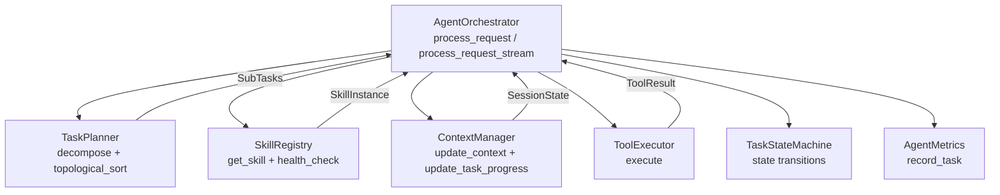
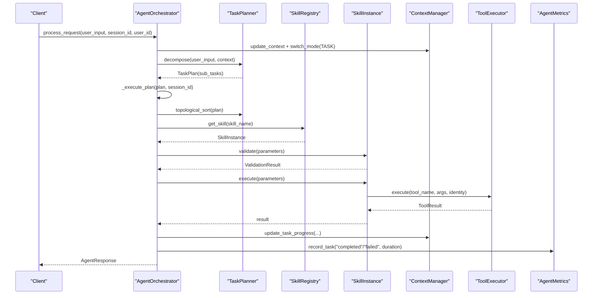
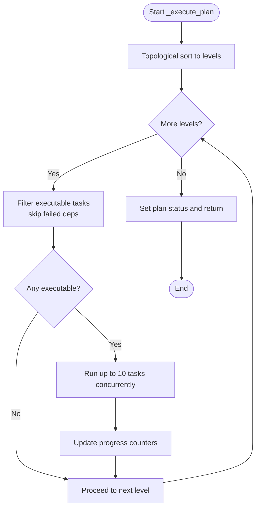
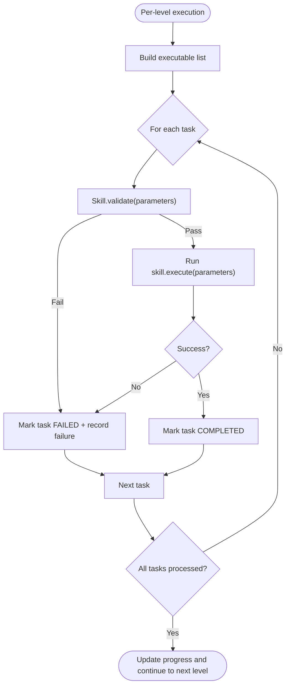
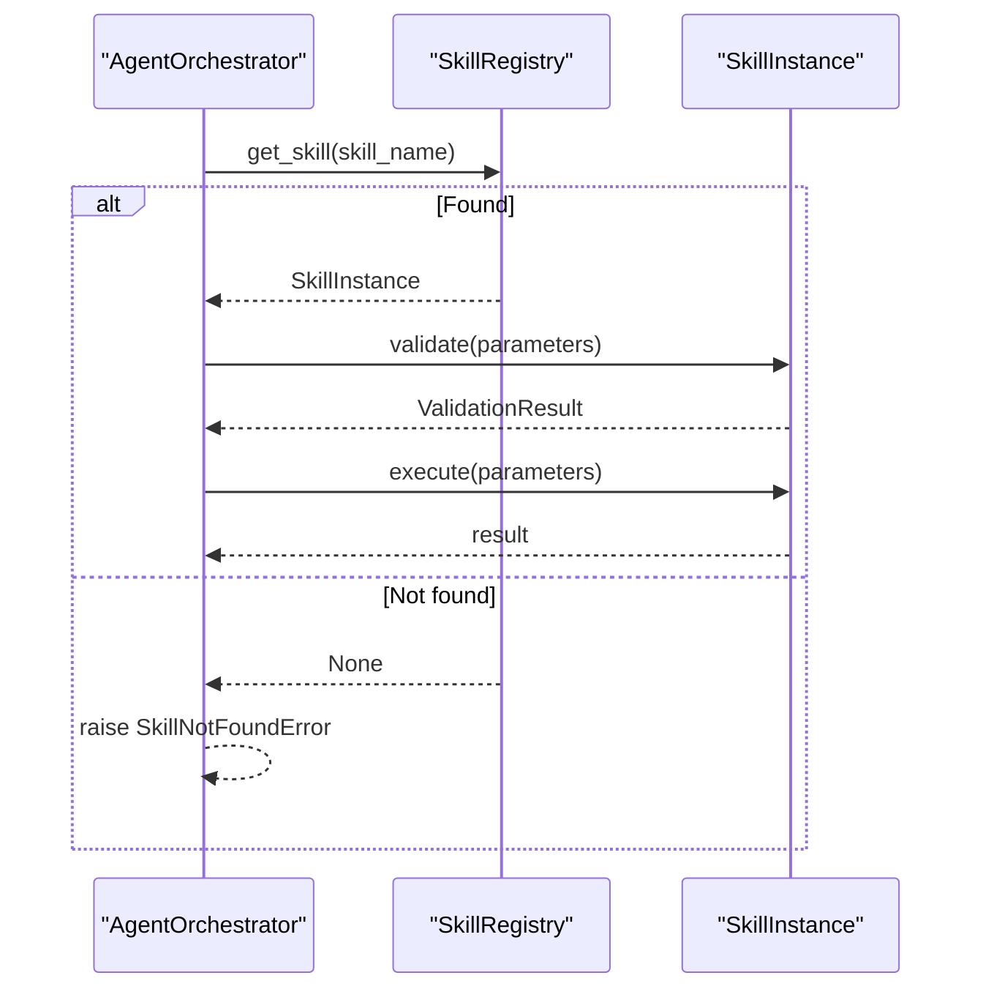
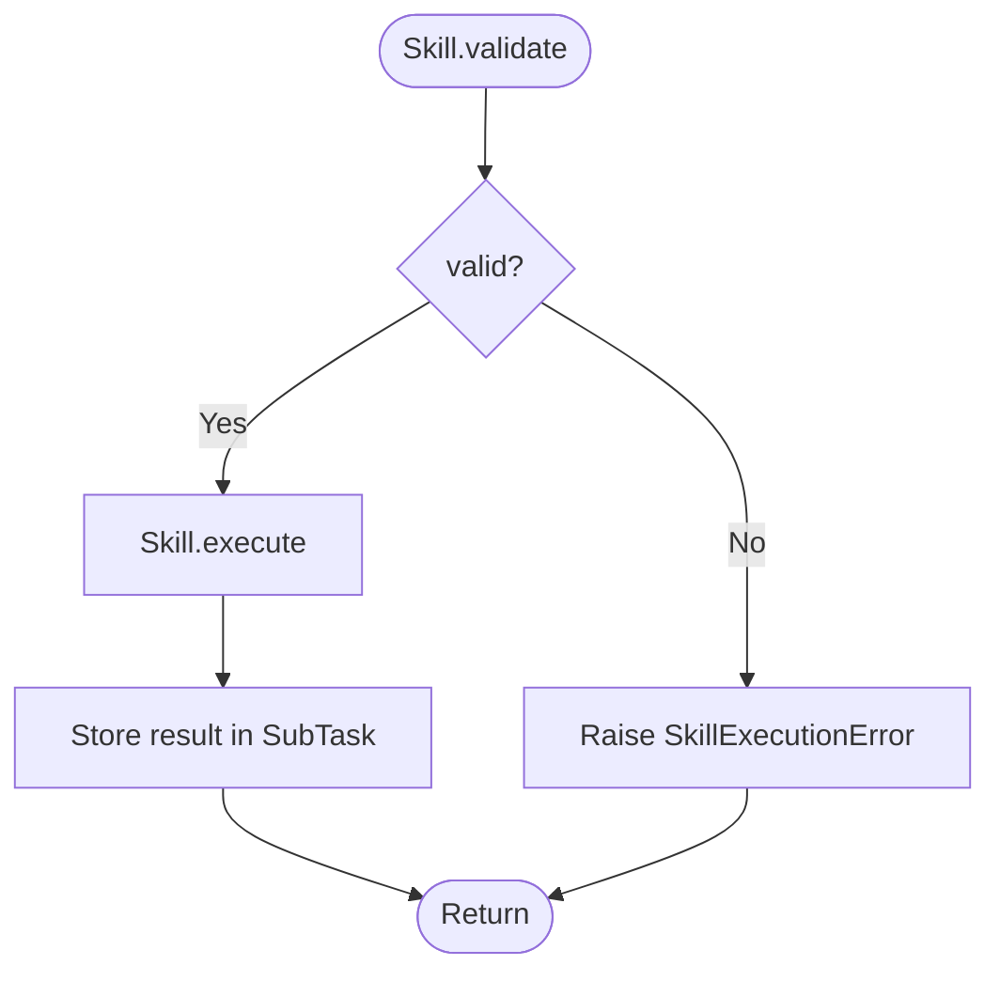
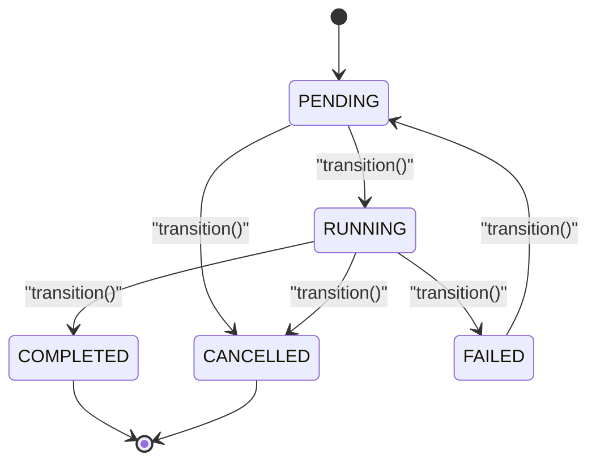
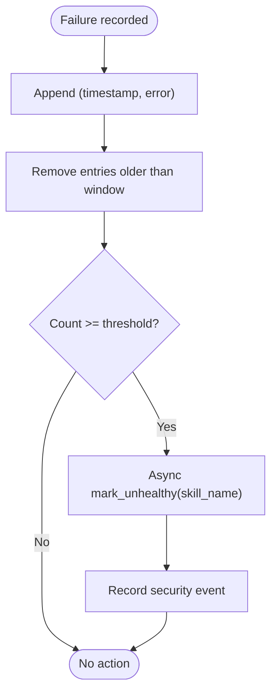
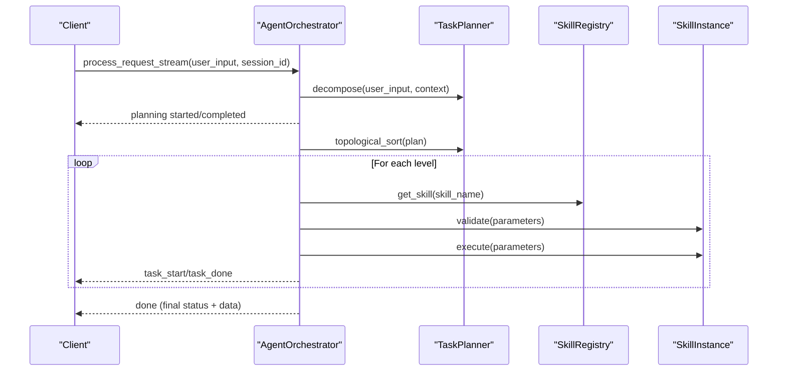
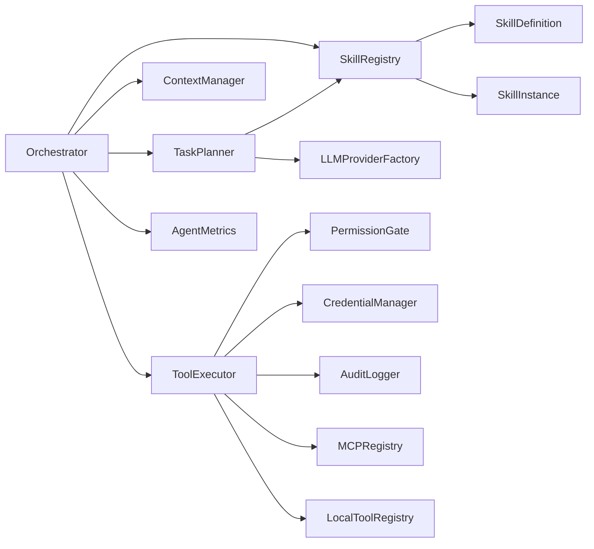

# Execution Orchestration

<cite>
**Referenced Files in This Document**
- [orchestrator.py](file://src/aiops_agent/core/orchestrator.py)
- [state_machine.py](file://src/aiops_agent/core/state_machine.py)
- [task_planner.py](file://src/aiops_agent/core/task_planner.py)
- [schemas.py](file://src/aiops_agent/models/schemas.py)
- [base.py](file://src/aiops_agent/skills/base.py)
- [registry.py](file://src/aiops_agent/skills/registry.py)
- [monitoring.py](file://src/aiops_agent/skills/monitoring.py)
- [troubleshooting.py](file://src/aiops_agent/skills/troubleshooting.py)
- [manager.py](file://src/aiops_agent/context/manager.py)
- [executor.py](file://src/aiops_agent/tools/executor.py)
- [metrics.py](file://src/aiops_agent/observability/metrics.py)
- [test_orchestrator.py](file://tests/test_orchestrator.py)
- [test_state_machine.py](file://tests/test_state_machine.py)
</cite>

## Table of Contents
1. [Introduction](#introduction)
2. [Project Structure](#project-structure)
3. [Core Components](#core-components)
4. [Architecture Overview](#architecture-overview)
5. [Detailed Component Analysis](#detailed-component-analysis)
6. [Dependency Analysis](#dependency-analysis)
7. [Performance Considerations](#performance-considerations)
8. [Troubleshooting Guide](#troubleshooting-guide)
9. [Conclusion](#conclusion)
10. [Appendices](#appendices)

## Introduction
This document explains the execution orchestration subsystem responsible for transforming natural language requests into structured task plans, executing them as a Directed Acyclic Graph (DAG) with dependency awareness, and aggregating results. It covers:
- The DAG execution engine and level-by-level processing
- Concurrency control and failure propagation
- Skill routing, parameter validation, and result aggregation
- TaskStateMachine integration for state tracking
- Health monitoring for skill reliability
- Practical execution flows, error handling, progress tracking
- Transition between synchronous and streaming execution modes

## Project Structure
The orchestration pipeline spans several modules:
- Orchestrator: central controller for request processing, DAG execution, and health monitoring
- TaskPlanner: LLM-driven decomposition into SubTasks and topological sorting
- SkillRegistry: discovery and routing of skills, health management
- SkillInstance: standardized interface for skills with validate/execute and lifecycle hooks
- ContextManager: session and task progress tracking
- ToolExecutor: unified tool execution with permission gating, credential acquisition, retries, and auditing
- Observability: metrics and tracing integration

**Diagram sources**
- [orchestrator.py:84-418](file://src/aiops_agent/core/orchestrator.py#L84-L418)
- [task_planner.py:50-150](file://src/aiops_agent/core/task_planner.py#L50-L150)
- [registry.py:159-181](file://src/aiops_agent/skills/registry.py#L159-L181)
- [manager.py:58-153](file://src/aiops_agent/context/manager.py#L58-L153)
- [executor.py:80-226](file://src/aiops_agent/tools/executor.py#L80-L226)
- [state_machine.py:51-82](file://src/aiops_agent/core/state_machine.py#L51-L82)
- [metrics.py:81-105](file://src/aiops_agent/observability/metrics.py#L81-L105)

**Section sources**
- [orchestrator.py:47-76](file://src/aiops_agent/core/orchestrator.py#L47-L76)
- [task_planner.py:32-49](file://src/aiops_agent/core/task_planner.py#L32-L49)
- [registry.py:19-31](file://src/aiops_agent/skills/registry.py#L19-L31)
- [manager.py:25-45](file://src/aiops_agent/context/manager.py#L25-L45)
- [executor.py:45-75](file://src/aiops_agent/tools/executor.py#L45-L75)
- [metrics.py:26-76](file://src/aiops_agent/observability/metrics.py#L26-L76)

## Core Components
- AgentOrchestrator: primary entry point for request processing and DAG execution; integrates LLM, TaskPlanner, SkillRegistry, ContextManager, ToolExecutor, and metrics/tracing/security guard.
- TaskPlanner: constructs TaskPlan from natural language input and performs topological sort to produce parallelizable levels.
- SkillRegistry: resolves skills by name/version, validates health, and routes tasks to SkillInstance implementations.
- SkillInstance: abstract base for skills with validate and execute methods; supports ToolExecutor injection.
- TaskStateMachine: enforces legal state transitions for individual tasks.
- ContextManager: maintains session state, tracks task progress during execution.
- ToolExecutor: unified tool execution with permission checks, credential acquisition, retries, and auditing.
- AgentMetrics: records task counts, durations, and security events.

**Section sources**
- [orchestrator.py:47-76](file://src/aiops_agent/core/orchestrator.py#L47-L76)
- [task_planner.py:32-49](file://src/aiops_agent/core/task_planner.py#L32-L49)
- [registry.py:19-31](file://src/aiops_agent/skills/registry.py#L19-L31)
- [base.py:21-93](file://src/aiops_agent/skills/base.py#L21-L93)
- [state_machine.py:26-42](file://src/aiops_agent/core/state_machine.py#L26-L42)
- [manager.py:25-45](file://src/aiops_agent/context/manager.py#L25-L45)
- [executor.py:45-75](file://src/aiops_agent/tools/executor.py#L45-L75)
- [metrics.py:26-76](file://src/aiops_agent/observability/metrics.py#L26-L76)

## Architecture Overview
The orchestration architecture follows a request-to-DAG-to-execution pipeline with explicit dependency awareness and concurrency control.

**Diagram sources**
- [orchestrator.py:84-198](file://src/aiops_agent/core/orchestrator.py#L84-L198)
- [task_planner.py:50-113](file://src/aiops_agent/core/task_planner.py#L50-L113)
- [registry.py:159-181](file://src/aiops_agent/skills/registry.py#L159-L181)
- [base.py:47-72](file://src/aiops_agent/skills/base.py#L47-L72)
- [manager.py:58-153](file://src/aiops_agent/context/manager.py#L58-L153)
- [executor.py:80-226](file://src/aiops_agent/tools/executor.py#L80-L226)
- [metrics.py:81-86](file://src/aiops_agent/observability/metrics.py#L81-L86)

## Detailed Component Analysis

### DAG Execution Engine and Level-by-Level Processing
The orchestrator transforms a TaskPlan into a DAG and executes it level-by-level:
- Topological sorting groups tasks into layers where all tasks within a layer are independent and can run concurrently.
- For each level, tasks whose dependencies have not failed are executed in parallel using a semaphore limiting concurrency to 10.
- Tasks that depend on failed tasks are cancelled immediately and marked accordingly.
- Progress updates are emitted via ContextManager after each level.

**Diagram sources**
- [orchestrator.py:424-483](file://src/aiops_agent/core/orchestrator.py#L424-L483)
- [task_planner.py:115-150](file://src/aiops_agent/core/task_planner.py#L115-L150)

**Section sources**
- [orchestrator.py:424-483](file://src/aiops_agent/core/orchestrator.py#L424-L483)
- [task_planner.py:115-150](file://src/aiops_agent/core/task_planner.py#L115-L150)

### Concurrency Control and Failure Propagation
Concurrency is controlled via an asyncio.Semaphore with a fixed limit of 10 concurrent tasks per level. Failures are propagated by:
- Recording failures in a set of failed_task_ids
- Cancelling downstream tasks that depend on failed predecessors
- Updating task status to CANCELLED with a descriptive error message
- Aggregating partial failures into the final AgentResponse

**Diagram sources**
- [orchestrator.py:450-475](file://src/aiops_agent/core/orchestrator.py#L450-L475)
- [orchestrator.py:519-532](file://src/aiops_agent/core/orchestrator.py#L519-L532)

**Section sources**
- [orchestrator.py:450-475](file://src/aiops_agent/core/orchestrator.py#L450-L475)
- [orchestrator.py:519-532](file://src/aiops_agent/core/orchestrator.py#L519-L532)

### Skill Routing Mechanism
Skills are resolved by name and version:
- SkillRegistry.get_skill(skill_name, version) returns the default or specified version if healthy.
- If a skill is not registered or unhealthy, the orchestrator raises a SkillNotFoundError and marks the task as FAILED.
- Skills receive a WorkloadIdentity and may use ToolExecutor to call MCP or local tools.

**Diagram sources**
- [orchestrator.py:485-532](file://src/aiops_agent/core/orchestrator.py#L485-L532)
- [registry.py:159-181](file://src/aiops_agent/skills/registry.py#L159-L181)
- [base.py:47-72](file://src/aiops_agent/skills/base.py#L47-L72)

**Section sources**
- [orchestrator.py:485-532](file://src/aiops_agent/core/orchestrator.py#L485-L532)
- [registry.py:159-181](file://src/aiops_agent/skills/registry.py#L159-L181)
- [base.py:47-72](file://src/aiops_agent/skills/base.py#L47-L72)

### Parameter Validation and Result Aggregation
- Validation: Each skill’s validate method returns a ValidationResult indicating validity and any errors. Orchestrator raises SkillExecutionError if validation fails.
- Result aggregation: Results are stored in SubTask.result; the final AgentResponse includes the serialized TaskPlan with all statuses and results.

**Diagram sources**
- [orchestrator.py:504-517](file://src/aiops_agent/core/orchestrator.py#L504-L517)
- [base.py:62-72](file://src/aiops_agent/skills/base.py#L62-L72)

**Section sources**
- [orchestrator.py:504-517](file://src/aiops_agent/core/orchestrator.py#L504-L517)
- [base.py:62-72](file://src/aiops_agent/skills/base.py#L62-L72)

### TaskStateMachine Integration for State Tracking
TaskStateMachine ensures legal state transitions and logs changes:
- Legal transitions: PENDING→RUNNING/CANCELLED; RUNNING→COMPLETED/FAILED/CANCELLED; FAILED→PENDING; COMPLETED/CANCELLED are terminal.
- The orchestrator initializes a TaskStateMachine per task and transitions to RUNNING before execution, then to COMPLETED on success or FAILED on exception.

**Diagram sources**
- [state_machine.py:17-23](file://src/aiops_agent/core/state_machine.py#L17-L23)
- [state_machine.py:51-82](file://src/aiops_agent/core/state_machine.py#L51-L82)
- [orchestrator.py:487-517](file://src/aiops_agent/core/orchestrator.py#L487-L517)

**Section sources**
- [state_machine.py:17-23](file://src/aiops_agent/core/state_machine.py#L17-L23)
- [state_machine.py:51-82](file://src/aiops_agent/core/state_machine.py#L51-L82)
- [orchestrator.py:487-517](file://src/aiops_agent/core/orchestrator.py#L487-L517)

### Health Monitoring System for Skill Reliability
The orchestrator tracks skill failures and marks skills as unhealthy:
- Failure recording: _record_skill_failure appends timestamps and errors; cleans stale entries older than a window.
- Threshold-based marking: if failures exceed a threshold within the window, the skill is asynchronously marked unhealthy via SkillRegistry.
- Metrics: a security event counter is incremented when a skill is marked unhealthy.

**Diagram sources**
- [orchestrator.py:571-596](file://src/aiops_agent/core/orchestrator.py#L571-L596)
- [registry.py:239-251](file://src/aiops_agent/skills/registry.py#L239-L251)
- [metrics.py:91-93](file://src/aiops_agent/observability/metrics.py#L91-L93)

**Section sources**
- [orchestrator.py:571-596](file://src/aiops_agent/core/orchestrator.py#L571-L596)
- [registry.py:239-251](file://src/aiops_agent/skills/registry.py#L239-L251)
- [metrics.py:91-93](file://src/aiops_agent/observability/metrics.py#L91-L93)

### Synchronous vs Streaming Execution Modes
- Synchronous mode: process_request returns a single AgentResponse after completion. The orchestrator switches to TASK mode, runs TaskPlanner, executes the DAG, and returns aggregated results.
- Streaming mode: process_request_stream yields structured events progressively:
  - planning started/completed
  - task_start/task_done for each task
  - error events on failures
  - token events from LLM synthesis
  - done event with final status and data

**Diagram sources**
- [orchestrator.py:203-418](file://src/aiops_agent/core/orchestrator.py#L203-L418)
- [task_planner.py:115-150](file://src/aiops_agent/core/task_planner.py#L115-L150)
- [registry.py:159-181](file://src/aiops_agent/skills/registry.py#L159-L181)
- [base.py:47-72](file://src/aiops_agent/skills/base.py#L47-L72)

**Section sources**
- [orchestrator.py:203-418](file://src/aiops_agent/core/orchestrator.py#L203-L418)
- [task_planner.py:115-150](file://src/aiops_agent/core/task_planner.py#L115-L150)
- [registry.py:159-181](file://src/aiops_agent/skills/registry.py#L159-L181)
- [base.py:47-72](file://src/aiops_agent/skills/base.py#L47-L72)

### Practical Examples and Scenarios
- Single task execution: A TaskPlan with one SubTask executes successfully and updates progress.
- Dependency chain: t1 → t2 executes t1 first, then t2; both complete.
- Dependency failure: If t1 fails, t2 is cancelled and marked with a dependency-related error.
- No tasks returned: Orchestrator returns an error response indicating inability to decompose.
- All skills unmapped: Orchestrator reports SKILL_NOT_FOUND with suggestions.
- Input sanitization: Empty or overly long inputs are rejected; suspicious patterns are logged.

**Section sources**
- [test_orchestrator.py:191-295](file://tests/test_orchestrator.py#L191-L295)
- [test_orchestrator.py:100-182](file://tests/test_orchestrator.py#L100-L182)
- [test_orchestrator.py:343-359](file://tests/test_orchestrator.py#L343-L359)

## Dependency Analysis
The orchestrator composes multiple subsystems with clear boundaries:
- Orchestrator depends on TaskPlanner for DAG construction, SkillRegistry for routing, ContextManager for progress, ToolExecutor for tool invocation, and AgentMetrics for telemetry.
- TaskPlanner depends on LLMProviderFactory and SkillRegistry to enrich prompts with available skills.
- SkillRegistry depends on SkillDefinition and SkillInstance to manage health and versions.
- ToolExecutor depends on PermissionGate, CredentialManager, AuditLogger, and registries for MCP/local tools.

**Diagram sources**
- [orchestrator.py:17-38](file://src/aiops_agent/core/orchestrator.py#L17-L38)
- [task_planner.py:42-48](file://src/aiops_agent/core/task_planner.py#L42-L48)
- [registry.py:31-36](file://src/aiops_agent/skills/registry.py#L31-L36)
- [executor.py:58-74](file://src/aiops_agent/tools/executor.py#L58-L74)

**Section sources**
- [orchestrator.py:17-38](file://src/aiops_agent/core/orchestrator.py#L17-L38)
- [task_planner.py:42-48](file://src/aiops_agent/core/task_planner.py#L42-L48)
- [registry.py:31-36](file://src/aiops_agent/skills/registry.py#L31-L36)
- [executor.py:58-74](file://src/aiops_agent/tools/executor.py#L58-L74)

## Performance Considerations
- Concurrency: Semaphore limits parallelism to 10 tasks per level to balance throughput and resource usage.
- Retry and timeout: ToolExecutor applies exponential backoff and timeout control to mitigate transient failures.
- Metrics: AgentMetrics records task counts and durations to monitor performance trends.
- Health monitoring: Threshold-based marking prevents continued use of failing skills.

[No sources needed since this section provides general guidance]

## Troubleshooting Guide
Common issues and diagnostics:
- Empty or invalid input: Orchestrator rejects empty or too-long inputs and returns structured errors.
- Skill not found: If TaskPlan contains unmapped skills, Orchestrator returns SKILL_NOT_FOUND with available skills.
- Dependency failures: Downstream tasks are cancelled with dependency-related errors; inspect failed_task_ids to trace causes.
- Tool execution errors: ToolExecutor records failures, timeouts, and permission denials; review audit logs and traces.
- State machine violations: Invalid state transitions raise errors; ensure correct sequencing of transitions.

**Section sources**
- [orchestrator.py:106-194](file://src/aiops_agent/core/orchestrator.py#L106-L194)
- [orchestrator.py:221-417](file://src/aiops_agent/core/orchestrator.py#L221-L417)
- [state_machine.py:60-65](file://src/aiops_agent/core/state_machine.py#L60-L65)
- [executor.py:169-201](file://src/aiops_agent/tools/executor.py#L169-L201)
- [test_state_machine.py:82-111](file://tests/test_state_machine.py#L82-L111)

## Conclusion
The execution orchestration subsystem provides robust, dependency-aware task execution with strong safety controls:
- DAG-level parallelism with strict dependency enforcement
- Concurrency limits and graceful failure propagation
- Standardized skill routing and validation
- Comprehensive state tracking and health monitoring
- Flexible synchronous and streaming execution modes with structured progress and synthesis

[No sources needed since this section summarizes without analyzing specific files]

## Appendices

### Data Models Used in Execution
- TaskStatus: lifecycle states for tasks
- SubTask: task definition with dependencies and parameters
- TaskPlan: container for a set of SubTasks
- AgentResponse: unified response envelope
- WorkloadIdentity: identity for tool execution
- ToolResult: structured tool output

**Section sources**
- [schemas.py:19-51](file://src/aiops_agent/models/schemas.py#L19-L51)
- [schemas.py:89-106](file://src/aiops_agent/models/schemas.py#L89-L106)
- [schemas.py:73-82](file://src/aiops_agent/models/schemas.py#L73-L82)

### Example Skills Demonstrating Routing and Validation
- MonitoringSkill: demonstrates validate/execute and tool invocation via ToolExecutor
- TroubleshootingSkill: demonstrates multi-step actions and identity provisioning

**Section sources**
- [monitoring.py:43-48](file://src/aiops_agent/skills/monitoring.py#L43-L48)
- [troubleshooting.py:43-47](file://src/aiops_agent/skills/troubleshooting.py#L43-L47)