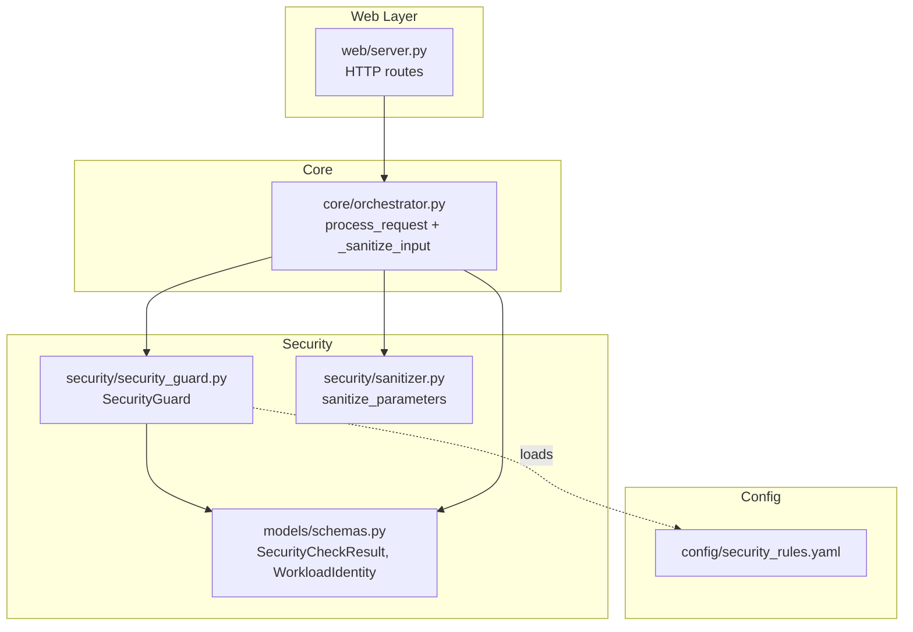
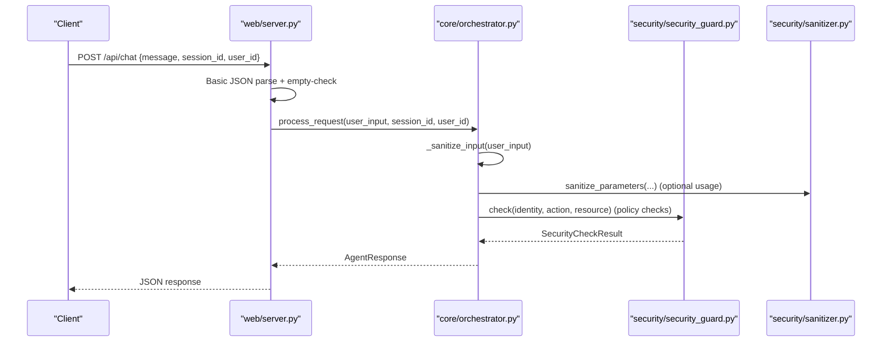
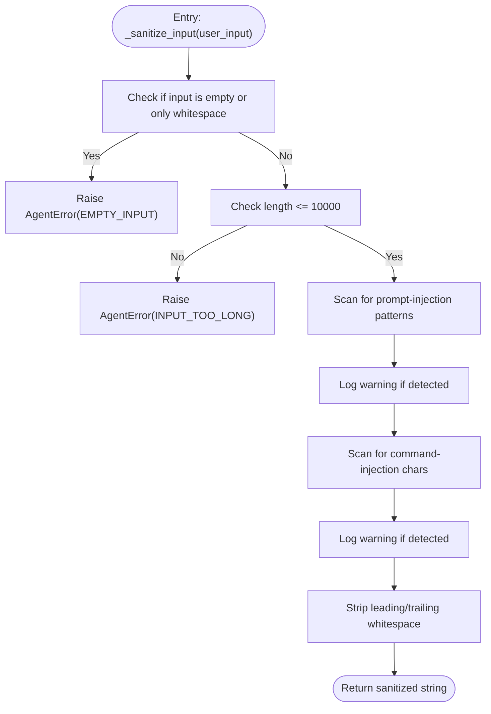
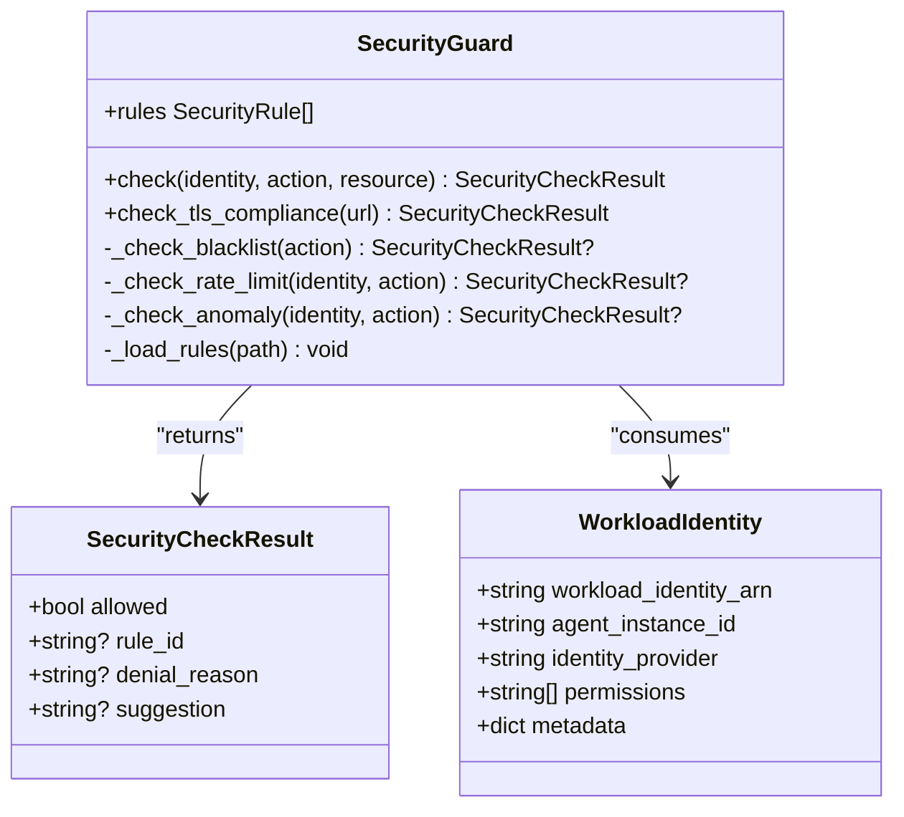
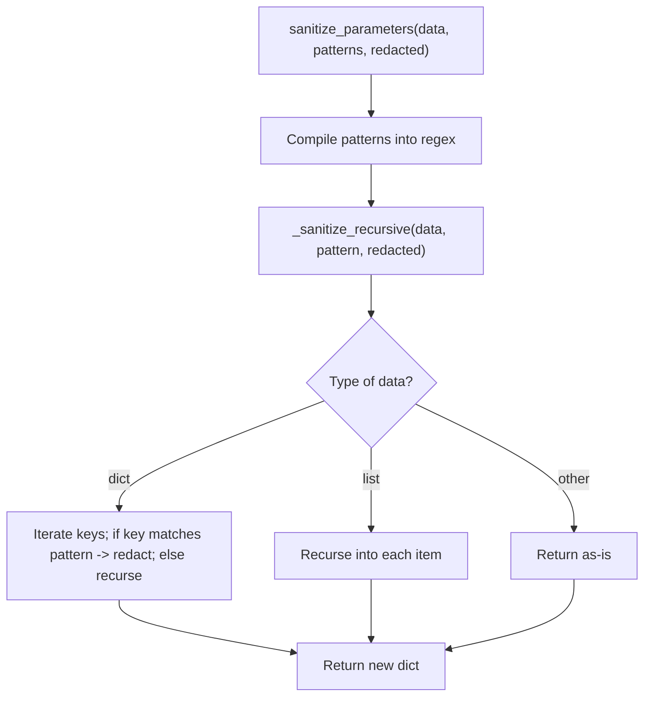
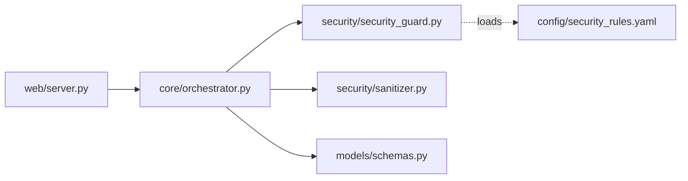

# Input Processing and Validation

<cite>
**Referenced Files in This Document**
- [sanitizer.py](file://src/aiops_agent/security/sanitizer.py)
- [security_guard.py](file://src/aiops_agent/security/security_guard.py)
- [schemas.py](file://src/aiops_agent/models/schemas.py)
- [orchestrator.py](file://src/aiops_agent/core/orchestrator.py)
- [exceptions.py](file://src/aiops_agent/core/exceptions.py)
- [security_rules.yaml](file://config/security_rules.yaml)
- [main.py](file://src/aiops_agent/main.py)
- [server.py](file://src/aiops_agent/web/server.py)
- [test_orchestrator.py](file://tests/test_orchestrator.py)
- [test_sanitizer.py](file://tests/test_sanitizer.py)
- [test_security_guard.py](file://tests/test_security_guard.py)
</cite>

## Table of Contents
1. [Introduction](#introduction)
2. [Project Structure](#project-structure)
3. [Core Components](#core-components)
4. [Architecture Overview](#architecture-overview)
5. [Detailed Component Analysis](#detailed-component-analysis)
6. [Dependency Analysis](#dependency-analysis)
7. [Performance Considerations](#performance-considerations)
8. [Troubleshooting Guide](#troubleshooting-guide)
9. [Conclusion](#conclusion)

## Introduction
This document explains the input processing and validation pipeline in the AIOps Agent. It covers the sanitization of user-provided text inputs, detection of injection attacks, enforcement of length limits, and integration with the SecurityGuard for additional validation layers. Practical examples illustrate normal inputs, validation failures, and how malicious content is handled. The goal is to help both developers and operators understand how user requests are validated and protected before being processed further.

## Project Structure
The input validation spans several modules:
- Orchestrator: central entry point that sanitizes user input and coordinates downstream processing
- SecurityGuard: enforces policy rules (blacklists, rate limits, anomaly detection, TLS checks)
- Sanitizer: sensitive data redaction for logs and audit trails
- Models: shared schemas including security result structures
- Web server: HTTP entry points that validate basic request shape
- Tests: demonstrate expected behaviors and edge cases

**Diagram sources**
- [server.py:44-82](file://src/aiops_agent/web/server.py#L44-L82)
- [orchestrator.py:84-198](file://src/aiops_agent/core/orchestrator.py#L84-L198)
- [security_guard.py:25-122](file://src/aiops_agent/security/security_guard.py#L25-L122)
- [sanitizer.py:39-79](file://src/aiops_agent/security/sanitizer.py#L39-L79)
- [schemas.py:215-231](file://src/aiops_agent/models/schemas.py#L215-L231)
- [security_rules.yaml:1-70](file://config/security_rules.yaml#L1-L70)

**Section sources**
- [server.py:44-82](file://src/aiops_agent/web/server.py#L44-L82)
- [orchestrator.py:84-198](file://src/aiops_agent/core/orchestrator.py#L84-L198)
- [security_guard.py:25-122](file://src/aiops_agent/security/security_guard.py#L25-L122)
- [sanitizer.py:39-79](file://src/aiops_agent/security/sanitizer.py#L39-L79)
- [schemas.py:215-231](file://src/aiops_agent/models/schemas.py#L215-L231)
- [security_rules.yaml:1-70](file://config/security_rules.yaml#L1-L70)

## Core Components
- Input sanitization and validation:
  - Length limit enforcement and empty-input rejection
  - Prompt injection pattern detection (non-blocking, logged)
  - Command injection character detection (non-blocking, logged)
  - Whitespace trimming
- SecurityGuard integration:
  - Blacklist checks for high-risk actions
  - Rate-limit enforcement per identity and action
  - Anomaly detection for operation sequences
  - TLS/HTTPS enforcement for outbound communications
- Sensitive data redaction:
  - Recursive redaction of sensitive keys in structured data
- Structured error handling:
  - AgentError with error_code and suggestions for clients

**Section sources**
- [orchestrator.py:601-646](file://src/aiops_agent/core/orchestrator.py#L601-L646)
- [security_guard.py:64-122](file://src/aiops_agent/security/security_guard.py#L64-L122)
- [sanitizer.py:39-79](file://src/aiops_agent/security/sanitizer.py#L39-L79)
- [exceptions.py:10-27](file://src/aiops_agent/core/exceptions.py#L10-L27)

## Architecture Overview
The input processing pipeline begins at the HTTP endpoint, moves through the orchestrator’s sanitization, and optionally integrates with SecurityGuard for policy checks. Sensitive data is redacted before being stored or logged.

**Diagram sources**
- [server.py:44-82](file://src/aiops_agent/web/server.py#L44-L82)
- [orchestrator.py:84-198](file://src/aiops_agent/core/orchestrator.py#L84-L198)
- [security_guard.py:64-122](file://src/aiops_agent/security/security_guard.py#L64-L122)
- [sanitizer.py:39-79](file://src/aiops_agent/security/sanitizer.py#L39-L79)

## Detailed Component Analysis

### Input Sanitization Pipeline
The orchestrator’s _sanitize_input performs:
- Empty-or-whitespace rejection with AgentError (error_code: EMPTY_INPUT)
- Length validation (max 10000 characters) with AgentError (error_code: INPUT_TOO_LONG)
- Prompt injection detection using keyword patterns (logged warning, not blocked)
- Command injection detection for shell-like constructs (logged warning, not blocked)
- Trimming of leading/trailing whitespace

**Diagram sources**
- [orchestrator.py:601-646](file://src/aiops_agent/core/orchestrator.py#L601-L646)
- [exceptions.py:10-27](file://src/aiops_agent/core/exceptions.py#L10-L27)

Practical examples (validated by tests):
- Normal input passes through unchanged after trimming
- Prompt injection triggers a warning log entry
- Command injection triggers a warning log entry
- Empty or whitespace-only input raises EMPTY_INPUT
- Oversized input raises INPUT_TOO_LONG

**Section sources**
- [test_orchestrator.py:343-359](file://tests/test_orchestrator.py#L343-L359)
- [test_orchestrator.py:46-75](file://tests/test_orchestrator.py#L46-L75)
- [orchestrator.py:601-646](file://src/aiops_agent/core/orchestrator.py#L601-L646)

### SecurityGuard Integration
SecurityGuard provides layered checks executed during policy-sensitive operations:
- Blacklist: blocks high-risk actions (e.g., deleting production resources)
- Rate limits: enforces per-minute and per-hour thresholds per identity and action
- Anomaly detection: flags unusual operation sequences (warning without blocking)
- TLS/HTTPS: enforces secure communication (blocks non-HTTPS URLs)

**Diagram sources**
- [security_guard.py:25-122](file://src/aiops_agent/security/security_guard.py#L25-L122)
- [schemas.py:215-231](file://src/aiops_agent/models/schemas.py#L215-L231)
- [schemas.py:89-97](file://src/aiops_agent/models/schemas.py#L89-L97)

Operational behavior validated by tests:
- Anomaly detection warns on diverse operation sequences without blocking
- TLS enforcement rejects non-HTTPS URLs with explicit denial reason and suggestion
- Rule loading from YAML config populates blacklist, rate limits, anomaly detection, and communication policies

**Section sources**
- [test_security_guard.py:95-147](file://tests/test_security_guard.py#L95-L147)
- [security_guard.py:124-143](file://src/aiops_agent/security/security_guard.py#L124-L143)
- [security_rules.yaml:20-69](file://config/security_rules.yaml#L20-L69)

### Sensitive Data Redaction
The sanitizer recursively redacts sensitive keys in nested dictionaries and lists. Default sensitive key patterns include common credential-related terms. Custom patterns can override defaults.

**Diagram sources**
- [sanitizer.py:39-79](file://src/aiops_agent/security/sanitizer.py#L39-L79)

Behavior validated by tests:
- Default sensitive keys are redacted
- Partial key matches are caught (e.g., “my_password_field”)
- Case-insensitive matching works
- Custom patterns override defaults
- Basic types and empty containers pass through unchanged
- Returned structure is independent from original

**Section sources**
- [test_sanitizer.py:79-303](file://tests/test_sanitizer.py#L79-L303)
- [sanitizer.py:39-79](file://src/aiops_agent/security/sanitizer.py#L39-L79)

### Error Handling for Inputs
Structured error handling uses AgentError with:
- message: human-readable description
- error_code: machine-readable code for client handling
- suggestion: optional remediation advice

Common error codes in the input pipeline:
- EMPTY_INPUT: raised when input is empty or only whitespace
- INPUT_TOO_LONG: raised when input exceeds 10000 characters

These exceptions propagate up to the orchestrator, which converts them into AgentResponse with appropriate fields.

**Section sources**
- [orchestrator.py:609-620](file://src/aiops_agent/core/orchestrator.py#L609-L620)
- [exceptions.py:10-27](file://src/aiops_agent/core/exceptions.py#L10-L27)
- [test_orchestrator.py:46-75](file://tests/test_orchestrator.py#L46-L75)

## Dependency Analysis
- The orchestrator depends on:
  - SecurityGuard for policy checks
  - Sanitizer for sensitive data redaction (used in audit/logging contexts)
  - Models for typed security results and identities
- The web server validates basic request shape and delegates to the orchestrator
- SecurityGuard loads its rules from a YAML configuration file

**Diagram sources**
- [server.py:44-82](file://src/aiops_agent/web/server.py#L44-L82)
- [orchestrator.py:84-198](file://src/aiops_agent/core/orchestrator.py#L84-L198)
- [security_guard.py:25-122](file://src/aiops_agent/security/security_guard.py#L25-L122)
- [sanitizer.py:39-79](file://src/aiops_agent/security/sanitizer.py#L39-L79)
- [schemas.py:215-231](file://src/aiops_agent/models/schemas.py#L215-L231)
- [security_rules.yaml:1-70](file://config/security_rules.yaml#L1-L70)

**Section sources**
- [main.py:157-159](file://src/aiops_agent/main.py#L157-L159)
- [server.py:44-82](file://src/aiops_agent/web/server.py#L44-L82)
- [security_guard.py:259-287](file://src/aiops_agent/security/security_guard.py#L259-L287)

## Performance Considerations
- Pattern scanning in _sanitize_input is linear in input length and constant in number of patterns; acceptable for typical user input sizes.
- Regex compilation in sanitizer is cached per invocation; consider pre-compiling if redaction is frequent at hot paths.
- SecurityGuard maintains bounded deques for call history and operation sequences; memory usage scales with configured window sizes.
- TLS enforcement is O(1) string prefix checks.

## Troubleshooting Guide
Common validation failures and their causes:
- EMPTY_INPUT:
  - Occurrence: blank or whitespace-only input
  - Resolution: ensure the client sends non-empty content
- INPUT_TOO_LONG:
  - Occurrence: input exceeds 10000 characters
  - Resolution: shorten the request or split into multiple queries
- Prompt injection warnings:
  - Occurrence: presence of known prompt-injection keywords
  - Resolution: rephrase the request to avoid directive-style phrasing
- Command injection warnings:
  - Occurrence: presence of shell-like characters
  - Resolution: avoid attempting to inject commands; use supported tool parameters
- TLS enforcement denials:
  - Occurrence: non-HTTPS URLs in outbound calls
  - Resolution: switch to HTTPS with TLS 1.2+

Integration points to verify:
- Confirm SecurityGuard is initialized with the correct rules file path
- Verify that rate limit and anomaly detection configurations match operational needs
- Ensure sensitive field patterns align with your data schemas

**Section sources**
- [test_orchestrator.py:343-359](file://tests/test_orchestrator.py#L343-L359)
- [test_orchestrator.py:46-75](file://tests/test_orchestrator.py#L46-L75)
- [test_security_guard.py:138-147](file://tests/test_security_guard.py#L138-L147)
- [security_rules.yaml:44-69](file://config/security_rules.yaml#L44-L69)

## Conclusion
The AIOps Agent applies defense-in-depth input validation:
- Immediate sanitization at the orchestrator catches empty inputs, excessive lengths, and suspicious patterns
- SecurityGuard adds policy enforcement, rate limiting, anomaly detection, and TLS compliance
- Sensitive data redaction protects logs and audit trails
- Structured error handling ensures clients receive actionable feedback

This layered approach balances usability with strong security guarantees.