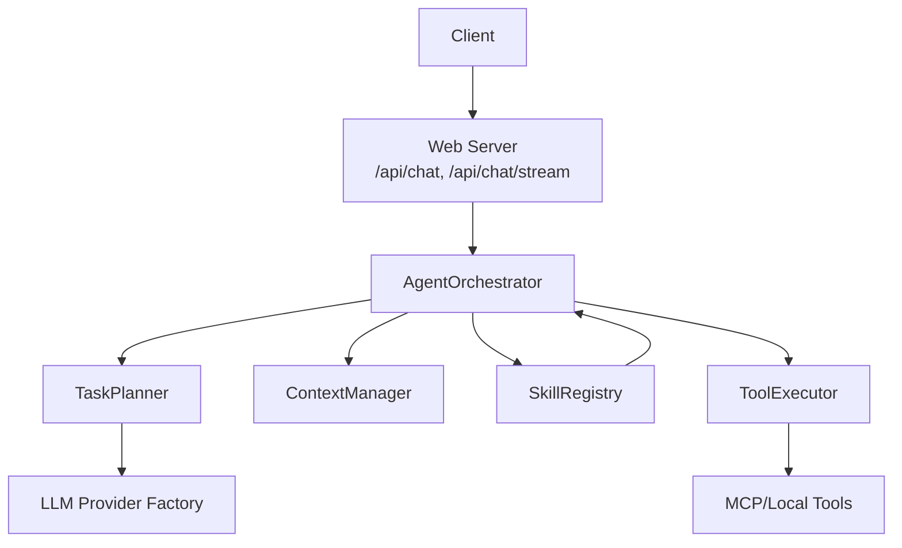
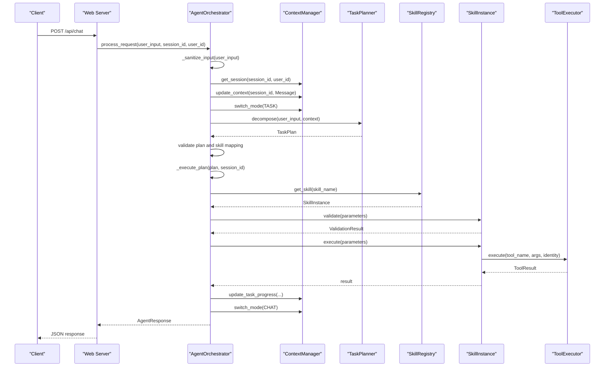
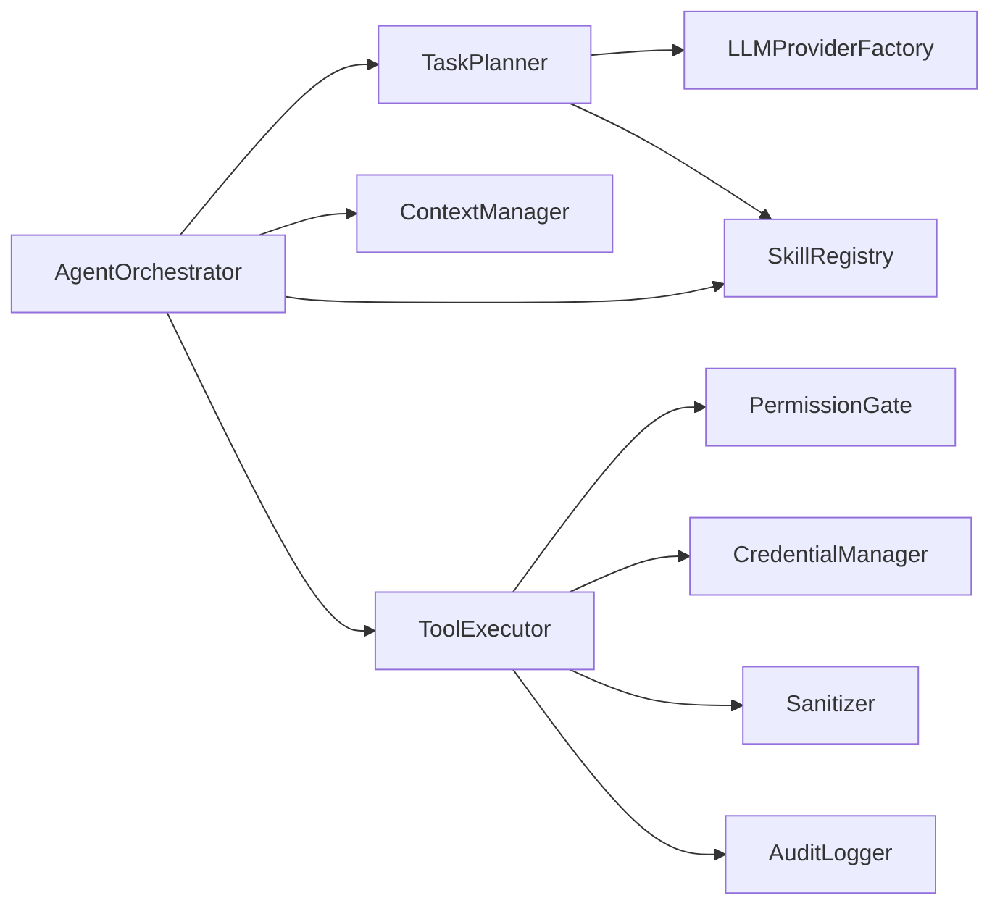

# Request Processing Pipeline

<cite>
**Referenced Files in This Document**
- [orchestrator.py](file://src/aiops_agent/core/orchestrator.py)
- [task_planner.py](file://src/aiops_agent/core/task_planner.py)
- [manager.py](file://src/aiops_agent/context/manager.py)
- [schemas.py](file://src/aiops_agent/models/schemas.py)
- [sanitizer.py](file://src/aiops_agent/security/sanitizer.py)
- [registry.py](file://src/aiops_agent/skills/registry.py)
- [base.py](file://src/aiops_agent/skills/base.py)
- [executor.py](file://src/aiops_agent/tools/executor.py)
- [state_machine.py](file://src/aiops_agent/core/state_machine.py)
- [main.py](file://src/aiops_agent/main.py)
- [server.py](file://src/aiops_agent/web/server.py)
- [monitoring.py](file://src/aiops_agent/skills/monitoring.py)
- [test_orchestrator.py](file://tests/test_orchestrator.py)
</cite>

## Table of Contents
1. [Introduction](#introduction)
2. [Project Structure](#project-structure)
3. [Core Components](#core-components)
4. [Architecture Overview](#architecture-overview)
5. [Detailed Component Analysis](#detailed-component-analysis)
6. [Dependency Analysis](#dependency-analysis)
7. [Performance Considerations](#performance-considerations)
8. [Troubleshooting Guide](#troubleshooting-guide)
9. [Conclusion](#conclusion)
10. [Appendices](#appendices)

## Introduction
This document explains the complete request processing pipeline from user input reception through task decomposition, context management, and execution completion. It covers input sanitization, context update, mode switching between CHAT and TASK modes, task planning with LLM integration, DAG execution, synchronous processing mode, error handling at each stage, and the unified AgentResponse format. Practical examples illustrate typical scenarios, parameter validation, and integration with TaskPlanner and ContextManager.

## Project Structure
The request processing pipeline spans several modules:
- Orchestrator: central coordinator for request lifecycle
- TaskPlanner: LLM-driven decomposition into SubTasks and DAG construction
- ContextManager: session, mode switching, and progress tracking
- SkillRegistry: skill discovery, routing, and health monitoring
- ToolExecutor: permission gating, credential acquisition, tool dispatch, and auditing
- Models: shared schemas for TaskPlan, SubTask, AgentResponse, and more
- Web Server: HTTP endpoints exposing chat and streaming APIs
- Main: application bootstrap and component wiring

**Diagram sources**
- [server.py:44-135](file://src/aiops_agent/web/server.py#L44-L135)
- [orchestrator.py:84-197](file://src/aiops_agent/core/orchestrator.py#L84-L197)
- [task_planner.py:50-113](file://src/aiops_agent/core/task_planner.py#L50-L113)
- [manager.py:50-121](file://src/aiops_agent/context/manager.py#L50-L121)
- [registry.py:159-181](file://src/aiops_agent/skills/registry.py#L159-L181)
- [executor.py:80-226](file://src/aiops_agent/tools/executor.py#L80-L226)

**Section sources**
- [main.py:70-222](file://src/aiops_agent/main.py#L70-L222)
- [server.py:196-227](file://src/aiops_agent/web/server.py#L196-L227)

## Core Components
- AgentOrchestrator: primary entry point for request processing, orchestrates LLM-based decomposition, DAG execution, error handling, and response formatting.
- TaskPlanner: constructs TaskPlan from user input using LLM, validates skill mapping, and builds DAG via topological sort.
- ContextManager: manages session state, updates context, switches interaction modes, tracks task progress, and persists sessions.
- SkillRegistry: registers skills, resolves capabilities, routes tasks to instances, and maintains health status.
- ToolExecutor: executes tools with permission checks, credential acquisition, retries, sanitization, and audit logging.
- Models: define TaskPlan/SubTask, AgentResponse, Message, TaskStatus, and other shared types.
- Web Server: exposes REST endpoints and SSE streaming for chat requests.
- Main: initializes components, registers default skills, and wires the orchestrator.

**Section sources**
- [orchestrator.py:47-197](file://src/aiops_agent/core/orchestrator.py#L47-L197)
- [task_planner.py:32-113](file://src/aiops_agent/core/task_planner.py#L32-L113)
- [manager.py:25-121](file://src/aiops_agent/context/manager.py#L25-L121)
- [registry.py:19-81](file://src/aiops_agent/skills/registry.py#L19-L81)
- [executor.py:45-226](file://src/aiops_agent/tools/executor.py#L45-L226)
- [schemas.py:19-62](file://src/aiops_agent/models/schemas.py#L19-L62)
- [server.py:44-135](file://src/aiops_agent/web/server.py#L44-L135)
- [main.py:225-293](file://src/aiops_agent/main.py#L225-L293)

## Architecture Overview
The pipeline follows a strict sequence with robust error handling and observability:
1. Receive request via Web Server
2. Sanitize input and update context
3. Switch to TASK mode for structured execution
4. Decompose into TaskPlan via TaskPlanner
5. Validate skill mapping and build DAG
6. Execute tasks in DAG order with concurrency control
7. Aggregate results and produce AgentResponse
8. Switch back to CHAT mode

**Diagram sources**
- [server.py:44-82](file://src/aiops_agent/web/server.py#L44-L82)
- [orchestrator.py:84-197](file://src/aiops_agent/core/orchestrator.py#L84-L197)
- [task_planner.py:50-113](file://src/aiops_agent/core/task_planner.py#L50-L113)
- [manager.py:50-121](file://src/aiops_agent/context/manager.py#L50-L121)
- [registry.py:159-181](file://src/aiops_agent/skills/registry.py#L159-L181)
- [executor.py:80-226](file://src/aiops_agent/tools/executor.py#L80-L226)

## Detailed Component Analysis

### Input Reception and Sanitization
- Web Server validates JSON and extracts message, session_id, and user_id.
- Orchestrator performs input sanitization:
  - Rejects empty or whitespace-only input
  - Enforces length limits
  - Detects prompt injection and command injection patterns (logging warnings)
- ContextManager updates session history and resolves resource references.

Practical example:
- A request with empty message returns an error response with code EMPTY_INPUT.
- A request exceeding 10000 characters returns INPUT_TOO_LONG.

**Section sources**
- [server.py:44-82](file://src/aiops_agent/web/server.py#L44-L82)
- [orchestrator.py:106-115](file://src/aiops_agent/core/orchestrator.py#L106-L115)
- [orchestrator.py:601-646](file://src/aiops_agent/core/orchestrator.py#L601-L646)
- [manager.py:58-88](file://src/aiops_agent/context/manager.py#L58-L88)

### Context Management and Mode Switching
- ContextManager maintains SessionState with mode, messages, resources, and task progress.
- Mode switching:
  - TASK mode initializes TaskProgress and enables progress tracking
  - Leaving TASK mode clears progress and resets to CHAT
- update_task_progress updates percentage, current step, and totals during execution.

Practical example:
- After entering TASK mode, progress updates reflect completion of each DAG level.

**Section sources**
- [manager.py:94-121](file://src/aiops_agent/context/manager.py#L94-L121)
- [manager.py:127-153](file://src/aiops_agent/context/manager.py#L127-L153)
- [schemas.py:238-276](file://src/aiops_agent/models/schemas.py#L238-L276)

### Task Planning with LLM Integration
- TaskPlanner constructs a system prompt instructing LLM to return JSON with sub_tasks.
- Adds available skills and current context to the LLM message stream.
- Parses LLM output into SubTask objects, normalizing various JSON formats.
- Validates skill mapping against SkillRegistry; marks unmappable tasks as FAILED.

Practical example:
- If LLM returns no tasks or all unmapped, Orchestrator returns NO_TASKS or SKILL_NOT_FOUND respectively.

**Section sources**
- [task_planner.py:20-29](file://src/aiops_agent/core/task_planner.py#L20-L29)
- [task_planner.py:50-113](file://src/aiops_agent/core/task_planner.py#L50-L113)
- [task_planner.py:156-187](file://src/aiops_agent/core/task_planner.py#L156-L187)
- [task_planner.py:189-206](file://src/aiops_agent/core/task_planner.py#L189-L206)

### DAG Execution and Concurrency Control
- Orchestrator builds levels via TaskPlanner.topological_sort.
- Filters out tasks whose dependencies have failed; cancels dependent tasks.
- Executes tasks in each level concurrently with a semaphore limiting to 10 simultaneous tasks.
- Uses TaskStateMachine to enforce legal state transitions (PENDING → RUNNING → COMPLETED/FAILED/CANCELLED).
- Updates progress after each level.

Practical example:
- A dependency chain t1 → t2 executes t1 first; if t1 fails, t2 is cancelled with a dependency-related error.

**Section sources**
- [orchestrator.py:424-483](file://src/aiops_agent/core/orchestrator.py#L424-L483)
- [orchestrator.py:485-532](file://src/aiops_agent/core/orchestrator.py#L485-L532)
- [state_machine.py:17-23](file://src/aiops_agent/core/state_machine.py#L17-L23)
- [state_machine.py:51-79](file://src/aiops_agent/core/state_machine.py#L51-L79)

### Parameter Validation and Skill Routing
- Each SubTask is routed to SkillInstance via SkillRegistry.get_skill.
- SkillInstance.validate is called; if invalid, Orchestrator records failure and returns error.
- On success, SkillInstance.execute runs and returns result stored in SubTask.result.

Practical example:
- MonitoringSkill.validate ensures required parameters like action are present.

**Section sources**
- [orchestrator.py:317-328](file://src/aiops_agent/core/orchestrator.py#L317-L328)
- [registry.py:159-181](file://src/aiops_agent/skills/registry.py#L159-L181)
- [base.py:62-72](file://src/aiops_agent/skills/base.py#L62-L72)
- [monitoring.py:43-48](file://src/aiops_agent/skills/monitoring.py#L43-L48)

### Tool Execution, Security, and Auditing
- ToolExecutor enforces permission gates, acquires credentials when needed, and dispatches to MCP or local tools.
- Applies exponential backoff retry on network errors, with configurable timeouts.
- Sanitizes sensitive parameters in both outputs and audit logs.
- Records AuditEvent with trace/span IDs for end-to-end observability.

Practical example:
- MonitoringSkill uses ToolExecutor to call query_metric_last and query_logs tools.

**Section sources**
- [executor.py:80-226](file://src/aiops_agent/tools/executor.py#L80-L226)
- [monitoring.py:80-97](file://src/aiops_agent/skills/monitoring.py#L80-L97)
- [monitoring.py:117-130](file://src/aiops_agent/skills/monitoring.py#L117-L130)

### Unified AgentResponse Format
- AgentResponse encapsulates success flag, message, optional data, error_code, suggestion, and trace_id.
- Orchestrator produces AgentResponse at each stage: sanitization failures, decomposition failures, partial or full success, and internal errors.

Practical example:
- Partial failure returns success=false with error_code PARTIAL_FAILURE and suggestion.

**Section sources**
- [schemas.py:53-62](file://src/aiops_agent/models/schemas.py#L53-L62)
- [orchestrator.py:127-172](file://src/aiops_agent/core/orchestrator.py#L127-L172)

### Streaming Workflow (SSE)
- process_request_stream yields structured events: planning started/completed, task_start/task_done, error, and done.
- Streams LLM synthesis tokens after successful execution.
- Maintains trace_id and session_id across events.

Practical example:
- Events include type, status, message, and progress indicators for real-time feedback.

**Section sources**
- [orchestrator.py:203-390](file://src/aiops_agent/core/orchestrator.py#L203-L390)

### Health Monitoring and Skill Failure Tracking
- Orchestrator records skill failures and marks skills unhealthy after 5 consecutive failures within a 10-minute window.
- Asynchronous marking avoids blocking execution.

Practical example:
- Repeated failures cause skill status to become unhealthy.

**Section sources**
- [orchestrator.py:571-596](file://src/aiops_agent/core/orchestrator.py#L571-L596)
- [registry.py:239-251](file://src/aiops_agent/skills/registry.py#L239-L251)

## Dependency Analysis
The orchestrator composes multiple subsystems with clear boundaries:
- Orchestrator depends on TaskPlanner, ContextManager, SkillRegistry, ToolExecutor, and LLMProviderFactory.
- TaskPlanner depends on LLMProviderFactory and SkillRegistry.
- ToolExecutor depends on PermissionGate, CredentialManager, AuditLogger, MCP/Local tool registries, and sanitizer.
- SkillRegistry depends on SkillInstance abstractions.

**Diagram sources**
- [orchestrator.py:17-38](file://src/aiops_agent/core/orchestrator.py#L17-L38)
- [task_planner.py:14-48](file://src/aiops_agent/core/task_planner.py#L14-L48)
- [executor.py:58-74](file://src/aiops_agent/tools/executor.py#L58-L74)

**Section sources**
- [orchestrator.py:17-38](file://src/aiops_agent/core/orchestrator.py#L17-L38)
- [task_planner.py:14-48](file://src/aiops_agent/core/task_planner.py#L14-L48)
- [executor.py:58-74](file://src/aiops_agent/tools/executor.py#L58-L74)

## Performance Considerations
- Concurrency control: Orchestrator limits concurrent tasks to 10 per level to prevent resource exhaustion.
- Retry strategy: ToolExecutor applies exponential backoff for transient network errors.
- Observability: Metrics and tracing record durations and statuses for profiling.
- Memory: ContextManager stores short-term memory and resource references to minimize repeated parsing.

[No sources needed since this section provides general guidance]

## Troubleshooting Guide
Common issues and resolutions:
- Empty or too-long input: Returns AgentError with EMPTY_INPUT or INPUT_TOO_LONG; adjust client input.
- No tasks generated: Orchestrator returns NO_TASKS; refine request phrasing or ensure skills are registered.
- All skills unmapped: Orchestrator returns SKILL_NOT_FOUND; verify skill names and availability.
- Skill execution failures: Orchestrator records failures and may mark skills unhealthy; inspect logs and fix underlying causes.
- Permission denied: ToolExecutor raises PermissionDeniedError; review RAM policies and required permissions.
- Tool timeouts: ToolExecutor raises AgentTimeoutError; increase timeout or optimize tool execution.

**Section sources**
- [test_orchestrator.py:48-91](file://tests/test_orchestrator.py#L48-L91)
- [test_orchestrator.py:100-182](file://tests/test_orchestrator.py#L100-L182)
- [test_orchestrator.py:228-295](file://tests/test_orchestrator.py#L228-L295)
- [executor.py:124-201](file://src/aiops_agent/tools/executor.py#L124-L201)

## Conclusion
The request processing pipeline integrates LLM-based task decomposition with robust orchestration, context management, and secure tool execution. It provides deterministic DAG execution, comprehensive error handling, and a unified response format. The streaming interface offers real-time feedback, while health monitoring and auditing ensure operational reliability.

[No sources needed since this section summarizes without analyzing specific files]

## Appendices

### Typical Request Processing Scenarios
- Scenario A: Monitoring query
  - Input: “Show CPU utilization for ECS instance i-xxxx”
  - Orchestrator switches to TASK mode, TaskPlanner decomposes into SubTasks, MonitoringSkill executes query_metrics via ToolExecutor, and Orchestrator aggregates results into AgentResponse.
- Scenario B: Multi-step troubleshooting
  - Input: “Investigate slow RDS and network connectivity”
  - TaskPlanner generates a DAG with dependencies; Orchestrator executes tasks in parallel where possible, updates progress, and returns a unified response.

**Section sources**
- [monitoring.py:30-48](file://src/aiops_agent/skills/monitoring.py#L30-L48)
- [monitoring.py:59-97](file://src/aiops_agent/skills/monitoring.py#L59-L97)
- [schemas.py:29-51](file://src/aiops_agent/models/schemas.py#L29-L51)

### Parameter Validation Examples
- MonitoringSkill.validate requires action parameter; missing parameters trigger SkillExecutionError.
- ToolExecutor sanitizes sensitive fields in outputs and audit logs.

**Section sources**
- [monitoring.py:43-48](file://src/aiops_agent/skills/monitoring.py#L43-L48)
- [executor.py:154-156](file://src/aiops_agent/tools/executor.py#L154-L156)
- [sanitizer.py:39-79](file://src/aiops_agent/security/sanitizer.py#L39-L79)