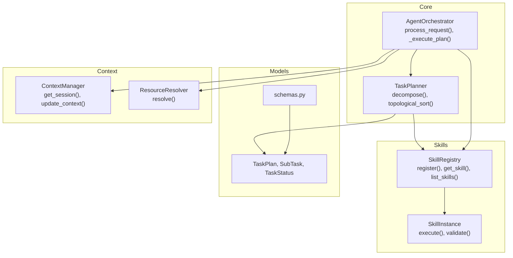
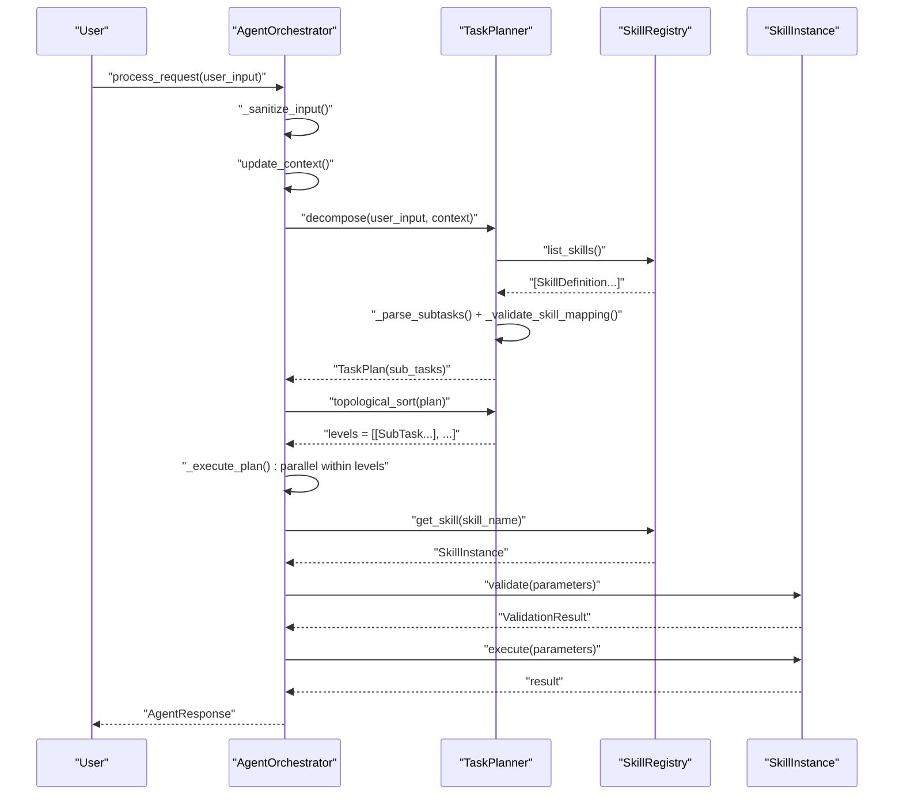
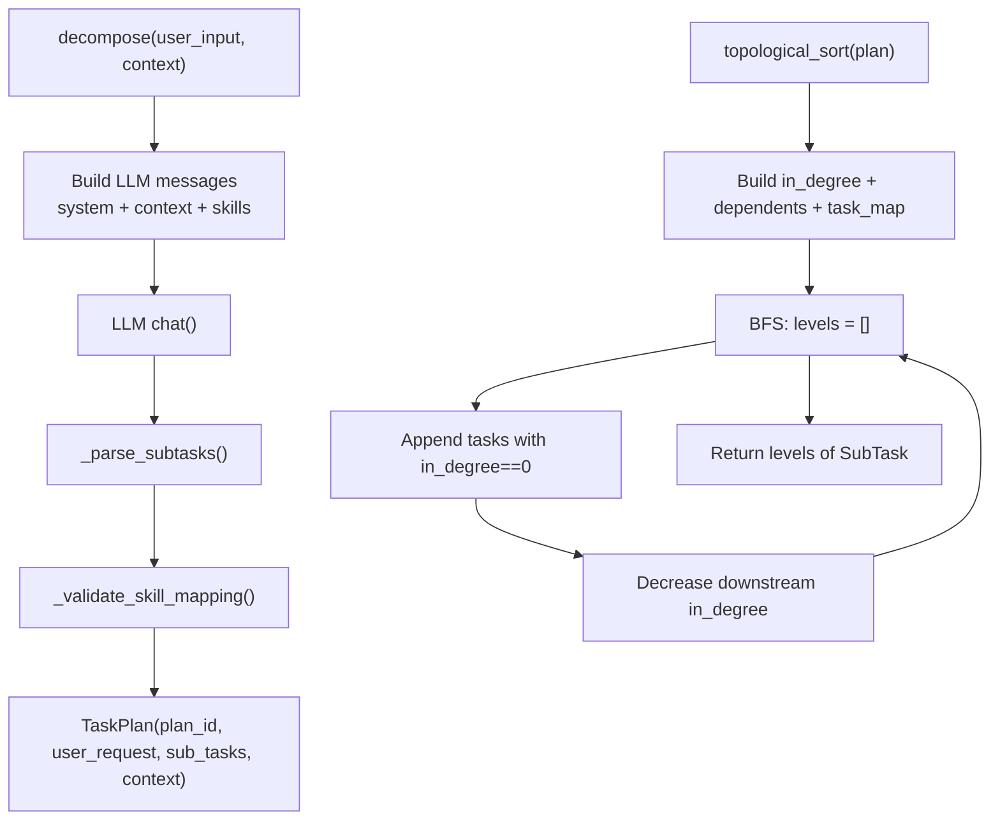
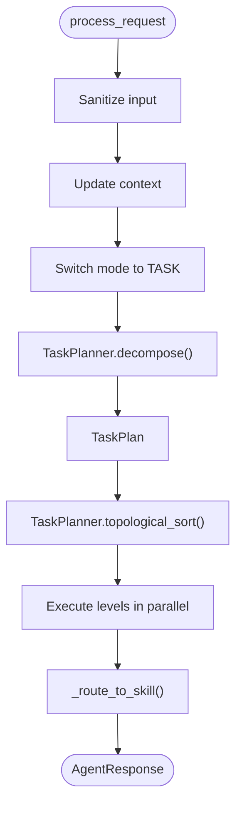
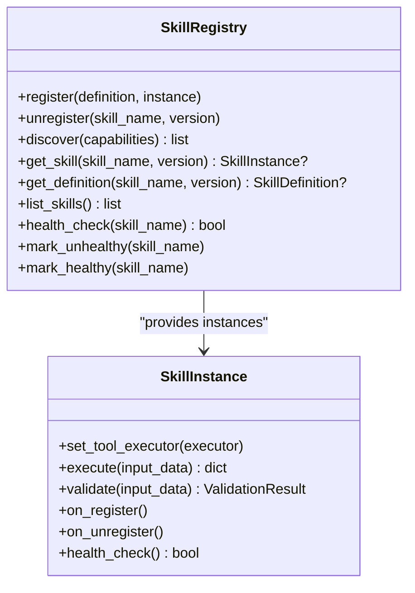
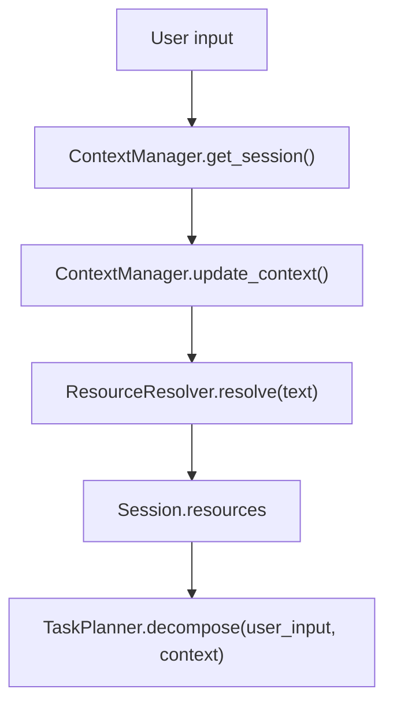
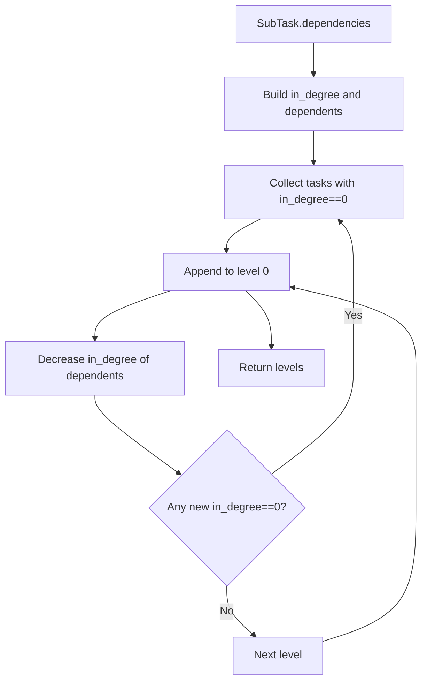
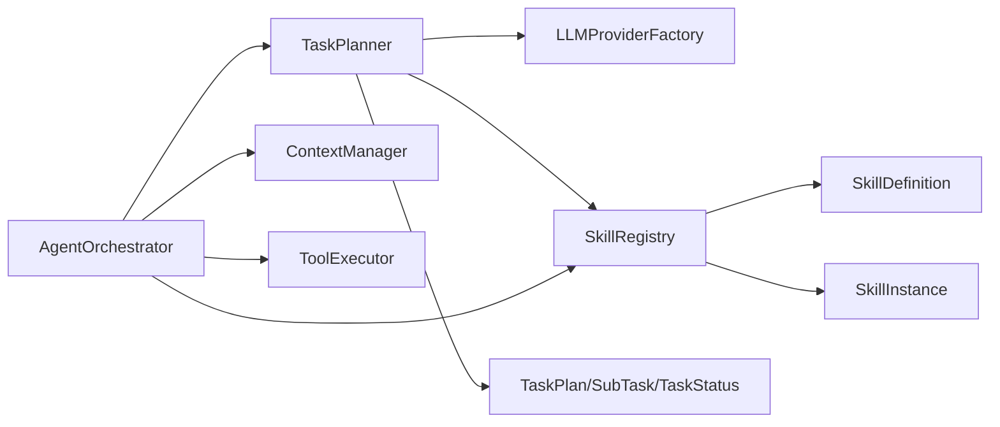
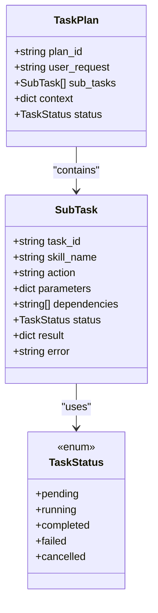
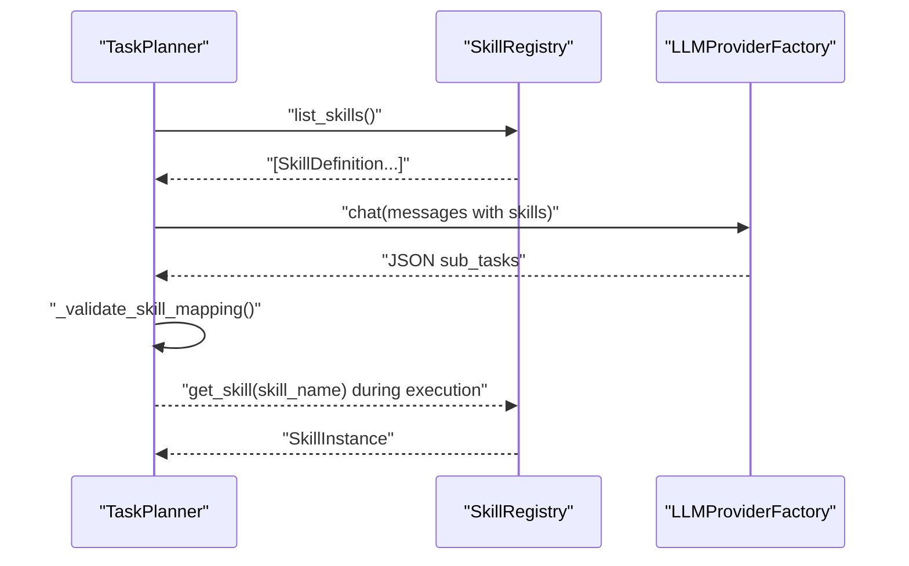

# Task Decomposition and Planning

<cite>
**Referenced Files in This Document**
- [task_planner.py](file://src/aiops_agent/core/task_planner.py)
- [orchestrator.py](file://src/aiops_agent/core/orchestrator.py)
- [registry.py](file://src/aiops_agent/skills/registry.py)
- [schemas.py](file://src/aiops_agent/models/schemas.py)
- [base.py](file://src/aiops_agent/skills/base.py)
- [resource_resolver.py](file://src/aiops_agent/context/resource_resolver.py)
- [taskplanner.md](file://docs/taskplanner.md)
- [test_task_planner.py](file://tests/test_task_planner.py)
- [test_task_planner_qwen.py](file://tests/test_task_planner_qwen.py)
</cite>

## Table of Contents
1. [Introduction](#introduction)
2. [Project Structure](#project-structure)
3. [Core Components](#core-components)
4. [Architecture Overview](#architecture-overview)
5. [Detailed Component Analysis](#detailed-component-analysis)
6. [Dependency Analysis](#dependency-analysis)
7. [Performance Considerations](#performance-considerations)
8. [Troubleshooting Guide](#troubleshooting-guide)
9. [Conclusion](#conclusion)
10. [Appendices](#appendices)

## Introduction
This document explains the task decomposition and planning subsystem, focusing on how the TaskPlanner integrates with the orchestrator to convert natural language requests into structured TaskPlan objects. It covers the context preparation process, resource resolution, skill capability mapping, the DAG generation algorithm, dependency analysis, and topological sorting for parallel execution. Practical examples demonstrate different types of user requests, decomposition outcomes, and plan validation. It also details the relationship between TaskPlanner and SkillRegistry for capability discovery and routing.

## Project Structure
The task decomposition pipeline spans several modules:
- Core orchestration and planning: TaskPlanner and AgentOrchestrator
- Skill registry and capability mapping: SkillRegistry and SkillInstance
- Data models: TaskPlan, SubTask, TaskStatus, and related schemas
- Context and resource resolution: ContextManager and ResourceResolver
- Documentation and tests: Architectural docs and comprehensive unit/integration tests

**Diagram sources**
- [task_planner.py:32-207](file://src/aiops_agent/core/task_planner.py#L32-L207)
- [orchestrator.py:47-658](file://src/aiops_agent/core/orchestrator.py#L47-L658)
- [registry.py:19-284](file://src/aiops_agent/skills/registry.py#L19-L284)
- [schemas.py:19-51](file://src/aiops_agent/models/schemas.py#L19-L51)
- [resource_resolver.py:33-81](file://src/aiops_agent/context/resource_resolver.py#L33-L81)

**Section sources**
- [task_planner.py:1-207](file://src/aiops_agent/core/task_planner.py#L1-L207)
- [orchestrator.py:1-658](file://src/aiops_agent/core/orchestrator.py#L1-L658)
- [registry.py:1-284](file://src/aiops_agent/skills/registry.py#L1-L284)
- [schemas.py:1-313](file://src/aiops_agent/models/schemas.py#L1-L313)
- [resource_resolver.py:1-81](file://src/aiops_agent/context/resource_resolver.py#L1-L81)

## Core Components
- TaskPlanner: Converts natural language into TaskPlan via LLM, parses JSON output, validates skill mapping, and performs topological sorting for DAG execution.
- AgentOrchestrator: Coordinates the full lifecycle: input sanitization, context updates, task decomposition, DAG execution with parallelism, failure handling, and optional synthesis.
- SkillRegistry: Manages skill registration, discovery by capability, default version selection, and health status.
- SkillInstance: Base interface for skills with execute and validate methods and lifecycle hooks.
- Data models: TaskPlan, SubTask, TaskStatus define the structure of plans and tasks.

Key responsibilities:
- TaskPlanner: decompose(), topological_sort(), _parse_subtasks(), _validate_skill_mapping()
- Orchestrator: process_request(), process_request_stream(), _execute_plan(), _route_to_skill()
- Registry: register(), get_skill(), list_skills(), health checks and marking unhealthy

**Section sources**
- [task_planner.py:32-207](file://src/aiops_agent/core/task_planner.py#L32-L207)
- [orchestrator.py:47-658](file://src/aiops_agent/core/orchestrator.py#L47-L658)
- [registry.py:19-284](file://src/aiops_agent/skills/registry.py#L19-L284)
- [base.py:21-93](file://src/aiops_agent/skills/base.py#L21-L93)
- [schemas.py:19-51](file://src/aiops_agent/models/schemas.py#L19-L51)

## Architecture Overview
The orchestrator composes TaskPlanner and SkillRegistry to transform user requests into executable plans. The TaskPlanner builds a TaskPlan with SubTasks and their dependencies, then the orchestrator executes the plan in DAG layers with parallelism.

**Diagram sources**
- [orchestrator.py:84-198](file://src/aiops_agent/core/orchestrator.py#L84-L198)
- [task_planner.py:50-113](file://src/aiops_agent/core/task_planner.py#L50-L113)
- [registry.py:159-181](file://src/aiops_agent/skills/registry.py#L159-L181)

## Detailed Component Analysis

### TaskPlanner: Decomposition, Parsing, Validation, and Topological Sorting
- Purpose: Turn natural language into TaskPlan with SubTasks and dependencies; validate skill mapping; produce DAG-ready levels for parallel execution.
- Key methods:
  - decompose(user_input, context): Builds LLM messages, calls LLM, parses JSON, validates skills, returns TaskPlan.
  - topological_sort(plan): Builds adjacency structures and performs BFS to produce levels of parallel-executable tasks.
  - _parse_subtasks(llm_output, plan_id): Robust JSON parsing supporting arrays, code blocks, and dict-wrapped lists.
  - _validate_skill_mapping(sub_tasks): Ensures each SubTask’s skill_name resolves to a registered SkillInstance.

**Diagram sources**
- [task_planner.py:50-150](file://src/aiops_agent/core/task_planner.py#L50-L150)

Practical examples from tests:
- JSON parsing robustness: arrays, code blocks, dict-wrapped lists, single dicts, invalid JSON.
- DAG sorting: independent tasks, chain, diamond, mixed parallel/sequential, empty plan.
- End-to-end decompose: registered/unregistered skills, LLM failures, context propagation, UUID plan_id.

**Section sources**
- [task_planner.py:50-150](file://src/aiops_agent/core/task_planner.py#L50-L150)
- [test_task_planner.py:97-486](file://tests/test_task_planner.py#L97-L486)

### Orchestrator: Context Preparation, Execution, and Parallel DAG
- Purpose: Central coordinator integrating TaskPlanner, SkillRegistry, ContextManager, ToolExecutor, and security guard.
- Key flows:
  - process_request(): Sanitizes input, updates context, switches to TASK mode, decomposes, validates unmapped tasks, executes plan, generates response.
  - process_request_stream(): Same as above but yields streaming events for planning, task start/done, and synthesis tokens.
  - _execute_plan(): Uses TaskPlanner.topological_sort to compute levels; executes tasks in parallel within each level with concurrency limit; tracks progress and failures.
  - _route_to_skill(): Resolves skill, validates parameters, executes, records failures, updates task status.

**Diagram sources**
- [orchestrator.py:84-198](file://src/aiops_agent/core/orchestrator.py#L84-L198)
- [orchestrator.py:424-483](file://src/aiops_agent/core/orchestrator.py#L424-L483)

**Section sources**
- [orchestrator.py:84-198](file://src/aiops_agent/core/orchestrator.py#L84-L198)
- [orchestrator.py:424-483](file://src/aiops_agent/core/orchestrator.py#L424-L483)

### SkillRegistry: Capability Discovery and Routing
- Purpose: Register skills, discover by capability intersection, select default version, health management, and marking unhealthy.
- Key methods:
  - register(definition, instance): Validates and registers; triggers lifecycle hooks.
  - get_skill(skill_name, version): Retrieves default or specified version instance.
  - discover(capabilities): Matches skills by capability overlap and returns ordered list.
  - health_check()/mark_unhealthy()/mark_healthy(): Maintains health status.

**Diagram sources**
- [registry.py:19-284](file://src/aiops_agent/skills/registry.py#L19-L284)
- [base.py:21-93](file://src/aiops_agent/skills/base.py#L21-L93)

**Section sources**
- [registry.py:19-284](file://src/aiops_agent/skills/registry.py#L19-L284)
- [base.py:21-93](file://src/aiops_agent/skills/base.py#L21-L93)

### Context Preparation and Resource Resolution
- ContextManager: Provides session context, updates messages, manages modes (CHAT/TASK/WATCH), and tracks task progress.
- ResourceResolver: Identifies cloud resource references (ECS, RDS, VPC, etc.) from text and produces ResourceReference objects for downstream use.

**Diagram sources**
- [orchestrator.py:110-125](file://src/aiops_agent/core/orchestrator.py#L110-L125)
- [resource_resolver.py:44-71](file://src/aiops_agent/context/resource_resolver.py#L44-L71)

**Section sources**
- [orchestrator.py:110-125](file://src/aiops_agent/core/orchestrator.py#L110-L125)
- [resource_resolver.py:44-71](file://src/aiops_agent/context/resource_resolver.py#L44-L71)

### DAG Generation, Dependency Analysis, and Topological Sorting
- TaskPlanner constructs a DAG from SubTask.dependencies and performs BFS to produce levels of tasks ready for parallel execution.
- Orchestrator respects dependency failures by cancelling downstream tasks and continues execution of remaining valid tasks.

**Diagram sources**
- [task_planner.py:115-150](file://src/aiops_agent/core/task_planner.py#L115-L150)
- [orchestrator.py:424-483](file://src/aiops_agent/core/orchestrator.py#L424-L483)

**Section sources**
- [task_planner.py:115-150](file://src/aiops_agent/core/task_planner.py#L115-L150)
- [orchestrator.py:424-483](file://src/aiops_agent/core/orchestrator.py#L424-L483)

### Practical Examples and Plan Validation
Examples from tests illustrate:
- Monitoring request: decomposes into monitoring tasks with PENDING status and valid structure.
- Troubleshooting request: decomposes into troubleshooting tasks.
- Multi-skill request: decomposes into multiple skills (monitoring + troubleshooting).
- Dependency chain: demonstrates hierarchical planning.
- Parameter extraction: LLM attempts to extract resource identifiers into parameters.
- Unsupported request: may return empty or map to FAILED tasks depending on LLM behavior.

Validation highlights:
- All tasks mapped to registered skills remain PENDING.
- Unregistered skills become FAILED with error details.
- Empty plans return graceful responses.
- Topological sort preserves all tasks and respects dependencies.

**Section sources**
- [test_task_planner_qwen.py:80-250](file://tests/test_task_planner_qwen.py#L80-L250)
- [test_task_planner.py:280-341](file://tests/test_task_planner.py#L280-L341)

## Dependency Analysis
- TaskPlanner depends on:
  - LLMProviderFactory for language model calls
  - SkillRegistry for capability discovery and skill mapping
  - Models (TaskPlan, SubTask, TaskStatus) for data structures
- Orchestrator depends on:
  - TaskPlanner for decomposition and DAG levels
  - SkillRegistry for skill resolution and health checks
  - ContextManager for session and resource context
  - ToolExecutor for skill execution (via SkillInstance)
- SkillRegistry depends on:
  - SkillDefinition and SkillInstance for registration and discovery
  - Health status for routing decisions

**Diagram sources**
- [task_planner.py:14-16](file://src/aiops_agent/core/task_planner.py#L14-L16)
- [orchestrator.py:24-38](file://src/aiops_agent/core/orchestrator.py#L24-L38)
- [registry.py:13-14](file://src/aiops_agent/skills/registry.py#L13-L14)
- [schemas.py:43-51](file://src/aiops_agent/models/schemas.py#L43-L51)

**Section sources**
- [task_planner.py:14-16](file://src/aiops_agent/core/task_planner.py#L14-L16)
- [orchestrator.py:24-38](file://src/aiops_agent/core/orchestrator.py#L24-L38)
- [registry.py:13-14](file://src/aiops_agent/skills/registry.py#L13-L14)
- [schemas.py:43-51](file://src/aiops_agent/models/schemas.py#L43-L51)

## Performance Considerations
- Concurrency control: Orchestrator limits concurrent tasks within a level to prevent resource saturation.
- Topological sorting complexity: O(V + E) for DAG construction and BFS levels.
- LLM parsing robustness: Handles varied JSON formats and gracefully falls back to empty plans on failure.
- Health monitoring: Orchestrator marks skills unhealthy after repeated failures, preventing routing to failing skills.

[No sources needed since this section provides general guidance]

## Troubleshooting Guide
Common issues and resolutions:
- No tasks generated: Check LLM availability and prompts; verify context passed to TaskPlanner.
- All tasks FAILED: Indicates unregistered skills; confirm SkillRegistry contains required skills.
- Partial failures: Inspect task.error for root cause; Orchestrator cancels dependent tasks automatically.
- Dependency failures: Downstream tasks are cancelled; fix upstream failures first.
- Streaming anomalies: Ensure SSE events are yielded consistently; verify synthesis stream handling.

**Section sources**
- [orchestrator.py:136-146](file://src/aiops_agent/core/orchestrator.py#L136-L146)
- [orchestrator.py:273-390](file://src/aiops_agent/core/orchestrator.py#L273-L390)
- [task_planner.py:98-113](file://src/aiops_agent/core/task_planner.py#L98-L113)

## Conclusion
TaskPlanner and Orchestrator collaborate to transform natural language into executable, dependency-aware plans. TaskPlanner handles decomposition, parsing, validation, and DAG generation; Orchestrator orchestrates execution with parallelism, safety, and resilience. SkillRegistry enables capability-driven routing and health-aware selection. Together, they support robust, scalable AIOps automation.

[No sources needed since this section summarizes without analyzing specific files]

## Appendices

### Data Models Overview
- TaskStatus: Lifecycle states for tasks.
- SubTask: Task-level structure with dependencies and parameters.
- TaskPlan: Container for plan-level context and sub-tasks.

**Diagram sources**
- [schemas.py:19-51](file://src/aiops_agent/models/schemas.py#L19-L51)

**Section sources**
- [schemas.py:19-51](file://src/aiops_agent/models/schemas.py#L19-L51)

### Relationship Between TaskPlanner and SkillRegistry
- Capability mapping: TaskPlanner lists available skills and passes them to LLM to guide decomposition.
- Skill validation: After parsing, TaskPlanner validates each SubTask’s skill_name against SkillRegistry.
- Orchestrator routing: Orchestrator resolves SkillInstance via SkillRegistry during execution.

**Diagram sources**
- [task_planner.py:77-86](file://src/aiops_agent/core/task_planner.py#L77-L86)
- [task_planner.py:189-206](file://src/aiops_agent/core/task_planner.py#L189-L206)
- [registry.py:159-181](file://src/aiops_agent/skills/registry.py#L159-L181)

**Section sources**
- [task_planner.py:77-86](file://src/aiops_agent/core/task_planner.py#L77-L86)
- [task_planner.py:189-206](file://src/aiops_agent/core/task_planner.py#L189-L206)
- [registry.py:159-181](file://src/aiops_agent/skills/registry.py#L159-L181)