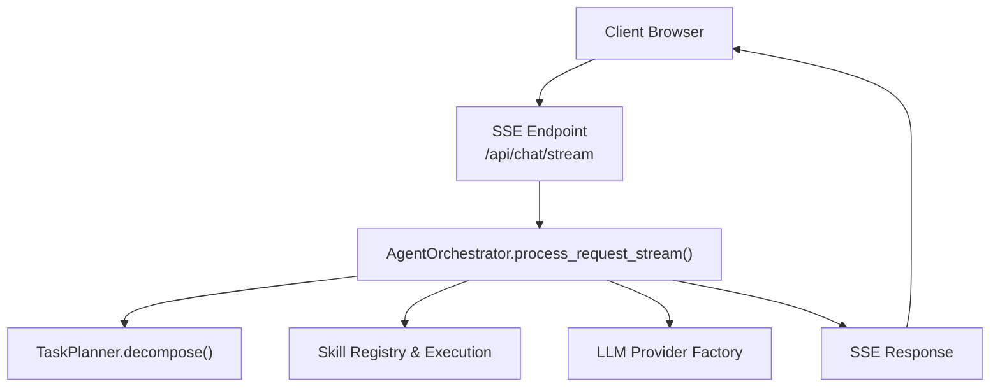
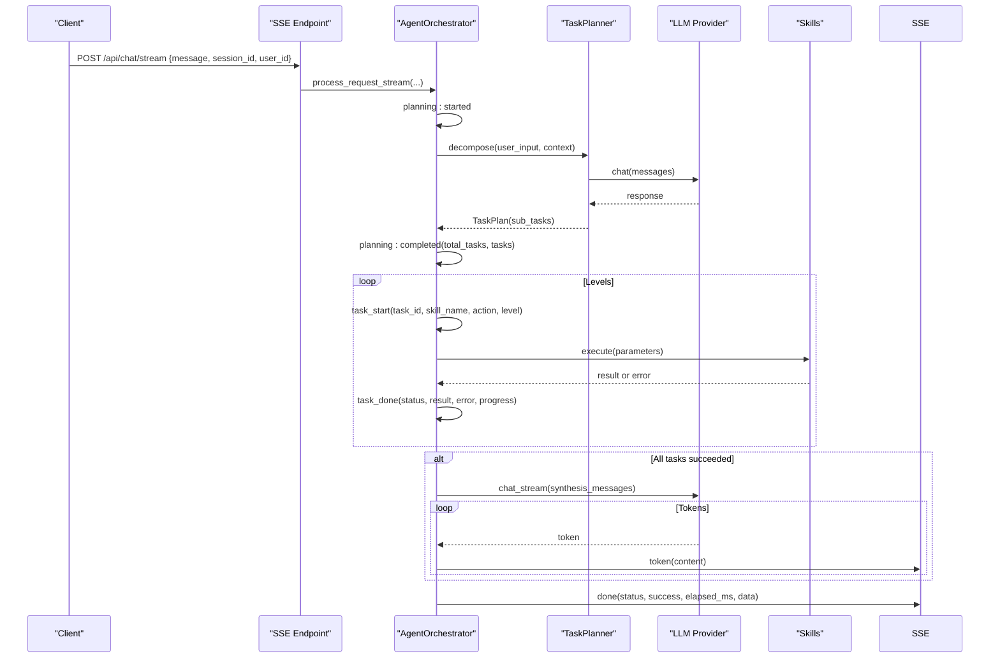
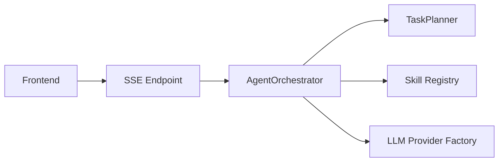

# Event Types and Payload Formats

<cite>
**Referenced Files in This Document**
- [server.py](file://src/aiops_agent/web/server.py)
- [orchestrator.py](file://src/aiops_agent/core/orchestrator.py)
- [schemas.py](file://src/aiops_agent/models/schemas.py)
- [task_planner.py](file://src/aiops_agent/core/task_planner.py)
- [index.html](file://src/aiops_agent/web/static/index.html)
- [test_sse.py](file://tests/test_sse.py)
</cite>

## Table of Contents
1. [Introduction](#introduction)
2. [Project Structure](#project-structure)
3. [Core Components](#core-components)
4. [Architecture Overview](#architecture-overview)
5. [Detailed Component Analysis](#detailed-component-analysis)
6. [Dependency Analysis](#dependency-analysis)
7. [Performance Considerations](#performance-considerations)
8. [Troubleshooting Guide](#troubleshooting-guide)
9. [Conclusion](#conclusion)

## Introduction
This document specifies the streaming event types and their payload formats used by the AIOps Agent during request processing. It covers the five primary event types: planning (with started/completed status), task_start, task_done, error, and done. It also documents the token event used for LLM streaming synthesis. For each event type, we define required and optional fields, provide concrete examples, and explain ordering guarantees and timing expectations.

## Project Structure
The streaming events are produced by the orchestrator and exposed via an SSE endpoint. The frontend consumes these events and renders the user interface accordingly.

**Diagram sources**
- [server.py:85-135](file://src/aiops_agent/web/server.py#L85-L135)
- [orchestrator.py:203-419](file://src/aiops_agent/core/orchestrator.py#L203-L419)
- [task_planner.py:50-113](file://src/aiops_agent/core/task_planner.py#L50-L113)

**Section sources**
- [server.py:85-135](file://src/aiops_agent/web/server.py#L85-L135)
- [orchestrator.py:203-419](file://src/aiops_agent/core/orchestrator.py#L203-L419)

## Core Components
- SSE Endpoint: Streams events to clients using Server-Sent Events.
- Orchestrator: Produces structured events for planning, task lifecycle, synthesis tokens, and completion/error.
- Task Planner: Builds TaskPlan and performs topological sorting for execution order.
- Frontend: Parses SSE lines and handles event types for rendering.

Key responsibilities:
- Planning events: announce decomposition start and completion with task summaries.
- Task lifecycle: notify start, completion/cancellation/failure, and progress.
- Synthesis: stream token chunks for LLM-generated summaries.
- Completion/Error: finalize the stream with success or partial failure.

**Section sources**
- [server.py:85-135](file://src/aiops_agent/web/server.py#L85-L135)
- [orchestrator.py:203-419](file://src/aiops_agent/core/orchestrator.py#L203-L419)
- [task_planner.py:115-150](file://src/aiops_agent/core/task_planner.py#L115-L150)

## Architecture Overview
The SSE flow is initiated by the client posting to the stream endpoint. The server delegates to the orchestrator, which yields events as the request progresses. Each event is serialized as an SSE line pair: event: <type>\ndata: <JSON>\n\n.

**Diagram sources**
- [server.py:85-135](file://src/aiops_agent/web/server.py#L85-L135)
- [orchestrator.py:203-419](file://src/aiops_agent/core/orchestrator.py#L203-L419)
- [task_planner.py:50-113](file://src/aiops_agent/core/task_planner.py#L50-L113)

## Detailed Component Analysis

### Event Type: planning
- Purpose: Announce task decomposition lifecycle.
- Two statuses:
  - started: Signals the beginning of planning.
  - completed: Signals the end of planning with task list and counts.

Payload fields:
- Required:
  - type: "planning"
  - status: "started" or "completed"
  - message: Human-readable status text
  - session_id: Session identifier
  - trace_id: OpenTelemetry trace identifier
- Optional:
  - total_tasks: Count of sub-tasks generated
  - tasks: Array of {task_id, skill_name, action} when status is "completed"

Timing expectations:
- planning:started is emitted immediately after context updates and before LLM invocation.
- planning:completed is emitted after TaskPlan is built and validated.

Examples:
- planning:started
  - type: "planning"
  - status: "started"
  - message: "Analyzing task..."
  - session_id: "<session-id>"
  - trace_id: "<trace-id>"
- planning:completed
  - type: "planning"
  - status: "completed"
  - message: "Generated 3 sub-tasks"
  - total_tasks: 3
  - tasks:
    - {task_id: "t1", skill_name: "monitoring", action: "query"}
    - {task_id: "t2", skill_name: "troubleshooting", action: "analyze"}
    - {task_id: "t3", skill_name: "change_management", action: "assess"}

Validation:
- Verified by tests asserting first event type and message presence.

**Section sources**
- [orchestrator.py:234-271](file://src/aiops_agent/core/orchestrator.py#L234-L271)
- [test_sse.py:53-104](file://tests/test_sse.py#L53-L104)

### Event Type: task_start
- Purpose: Notify the start of a specific sub-task execution.
- Fields:
  - type: "task_start"
  - task_id: Unique sub-task identifier
  - skill_name: Target skill name
  - action: Action to be executed
  - level: "current/max" indicating execution layer
  - session_id: Session identifier

Timing expectations:
- Emitted per executable sub-task after planning completion and before execution begins.

Examples:
- task_start
  - type: "task_start"
  - task_id: "t2"
  - skill_name: "troubleshooting"
  - action: "analyze"
  - level: "1/2"
  - session_id: "<session-id>"

**Section sources**
- [orchestrator.py:306-313](file://src/aiops_agent/core/orchestrator.py#L306-L313)

### Event Type: task_done
- Purpose: Report completion, cancellation, or failure of a sub-task.
- Statuses:
  - completed: Execution finished successfully.
  - cancelled: Execution was skipped due to dependency failure.
  - failed: Execution raised an exception.
- Fields:
  - type: "task_done"
  - task_id: Unique sub-task identifier
  - skill_name: Target skill name
  - action: Executed action
  - status: "completed", "cancelled", or "failed"
  - result: Optional execution result
  - error: Optional error message
  - progress: "completed/total" progress string
  - session_id: Session identifier

Timing expectations:
- Emitted once per sub-task after execution completes (success, failure, or cancellation).
- Progress reflects cumulative completion across all tasks.

Examples:
- task_done:completed
  - type: "task_done"
  - task_id: "t1"
  - skill_name: "monitoring"
  - action: "query"
  - status: "completed"
  - result: {"cpu": 85}
  - progress: "1/3"
  - session_id: "<session-id>"
- task_done:cancelled
  - type: "task_done"
  - task_id: "t2"
  - skill_name: "troubleshooting"
  - action: "analyze"
  - status: "cancelled"
  - error: "Dependent task failed"
  - session_id: "<session-id>"
- task_done:failed
  - type: "task_done"
  - task_id: "t3"
  - skill_name: "change_management"
  - action: "assess"
  - status: "failed"
  - error: "Parameter validation failed"
  - progress: "1/3"
  - session_id: "<session-id>"

Validation:
- Tests confirm emitted status values and error propagation.

**Section sources**
- [orchestrator.py:289-348](file://src/aiops_agent/core/orchestrator.py#L289-L348)
- [test_sse.py:214-243](file://tests/test_sse.py#L214-L243)
- [test_sse.py:250-286](file://tests/test_sse.py#L250-L286)

### Event Type: error
- Purpose: Signal an error condition during planning or execution.
- Fields:
  - type: "error"
  - status: "failed"
  - message: Human-readable error message
  - error_code: Machine-readable error code
  - suggestion: Optional remediation suggestion
  - session_id: Session identifier
  - trace_id: Optional trace identifier

Timing expectations:
- Emitted when planning fails (e.g., empty sub-tasks), when AgentError occurs, or on unexpected exceptions.

Examples:
- error:empty tasks
  - type: "error"
  - status: "failed"
  - message: "Could not decompose request into executable tasks"
  - error_code: "NO_TASKS"
  - suggestion: "Try describing your request more specifically"
  - session_id: "<session-id>"
  - trace_id: "<trace-id>"
- error:agent error
  - type: "error"
  - status: "failed"
  - message: "Skill not found"
  - error_code: "SKILL_NOT_FOUND"
  - suggestion: "Available skills: monitoring, troubleshooting, change_management"
  - session_id: "<session-id>"
  - trace_id: "<trace-id>"
- error:internal error
  - type: "error"
  - status: "failed"
  - message: "Internal processing error"
  - error_code: "INTERNAL_ERROR"
  - suggestion: "Please try again later"
  - session_id: "<session-id>"
  - trace_id: "<trace-id>"

Validation:
- Tests assert error event emission under various failure modes.

**Section sources**
- [orchestrator.py:248-258](file://src/aiops_agent/core/orchestrator.py#L248-L258)
- [orchestrator.py:392-416](file://src/aiops_agent/core/orchestrator.py#L392-L416)
- [test_sse.py:107-116](file://tests/test_sse.py#L107-L116)
- [test_sse.py:314-336](file://tests/test_sse.py#L314-L336)
- [test_sse.py:294-313](file://tests/test_sse.py#L294-L313)

### Event Type: done
- Purpose: Finalize the stream with overall success or partial failure outcome.
- Fields:
  - type: "done"
  - status: "completed" or "partial_failure"
  - message: Human-readable summary
  - success: Boolean indicating overall success
  - elapsed_ms: Total execution time in milliseconds
  - data: Contains the plan JSON
  - session_id: Session identifier
  - trace_id: Optional trace identifier

Timing expectations:
- Emitted after all tasks are processed and synthesis tokens are sent (if applicable).
- Always the last event in a successful or partially failed flow.

Examples:
- done:completed
  - type: "done"
  - status: "completed"
  - message: "Task execution completed"
  - success: True
  - elapsed_ms: 1234.5
  - data: {plan: {...}}
  - session_id: "<session-id>"
  - trace_id: "<trace-id>"
- done:partial_failure
  - type: "done"
  - status: "partial_failure"
  - message: "2 out of 5 sub-tasks failed"
  - success: False
  - elapsed_ms: 1234.5
  - data: {plan: {...}}
  - session_id: "<session-id>"
  - trace_id: "<trace-id>"

Validation:
- Tests confirm done event presence and status semantics.

**Section sources**
- [orchestrator.py:381-390](file://src/aiops_agent/core/orchestrator.py#L381-L390)
- [test_sse.py:245-243](file://tests/test_sse.py#L245-L243)

### Event Type: token
- Purpose: Stream synthesis tokens from the LLM after all tasks succeed.
- Fields:
  - type: "token"
  - content: String token chunk
  - session_id: Session identifier

Timing expectations:
- Emitted only when all sub-tasks succeed and synthesis is enabled.
- Sent continuously until synthesis completes.
- The frontend concatenates tokens into a live summary.

Examples:
- token
  - type: "token"
  - content: "Based on the collected metrics..."
  - session_id: "<session-id>"

Validation:
- Tests demonstrate SSE event structure and content parsing.
- Frontend handles token events by appending content to a dedicated element.

**Section sources**
- [orchestrator.py:364-380](file://src/aiops_agent/core/orchestrator.py#L364-L380)
- [test_sse.py:342-406](file://tests/test_sse.py#L342-L406)
- [index.html:160-167](file://src/aiops_agent/web/static/index.html#L160-L167)

## Dependency Analysis
The SSE endpoint depends on the orchestrator to produce events. The orchestrator depends on the TaskPlanner for decomposition and on the Skill Registry for execution. The LLM Provider Factory supplies synthesis tokens.

**Diagram sources**
- [server.py:85-135](file://src/aiops_agent/web/server.py#L85-L135)
- [orchestrator.py:203-419](file://src/aiops_agent/core/orchestrator.py#L203-L419)
- [task_planner.py:50-113](file://src/aiops_agent/core/task_planner.py#L50-L113)

**Section sources**
- [server.py:85-135](file://src/aiops_agent/web/server.py#L85-L135)
- [orchestrator.py:203-419](file://src/aiops_agent/core/orchestrator.py#L203-L419)

## Performance Considerations
- Streaming ensures low latency feedback as soon as planning starts and as tasks complete.
- Token streaming for synthesis allows incremental summarization without buffering the entire response.
- The SSE endpoint sets headers to prevent caching and buffering, optimizing real-time delivery.

[No sources needed since this section provides general guidance]

## Troubleshooting Guide
Common issues and diagnostics:
- Empty message rejected: The SSE endpoint returns 400 if the message field is empty.
- SSE encoding: Chinese characters must be preserved; tests verify UTF-8 encoding and decoding.
- Event parsing: The frontend splits on \n\n and parses data lines; malformed JSON will be logged.
- Error events: Verify error_code and suggestion fields for actionable remediation.

**Section sources**
- [server.py:92-94](file://src/aiops_agent/web/server.py#L92-L94)
- [test_sse.py:428-437](file://tests/test_sse.py#L428-L437)
- [test_sse.py:363-377](file://tests/test_sse.py#L363-L377)
- [index.html:120-127](file://src/aiops_agent/web/static/index.html#L120-L127)

## Conclusion
The AIOps Agent’s streaming protocol provides a clear, ordered sequence of events from planning through execution and synthesis. Clients should expect planning:started, planning:completed, zero or more task_start/task_done pairs, optional token events for synthesis, and a final done or error event. The payload schemas above enable robust client-side rendering and error handling.