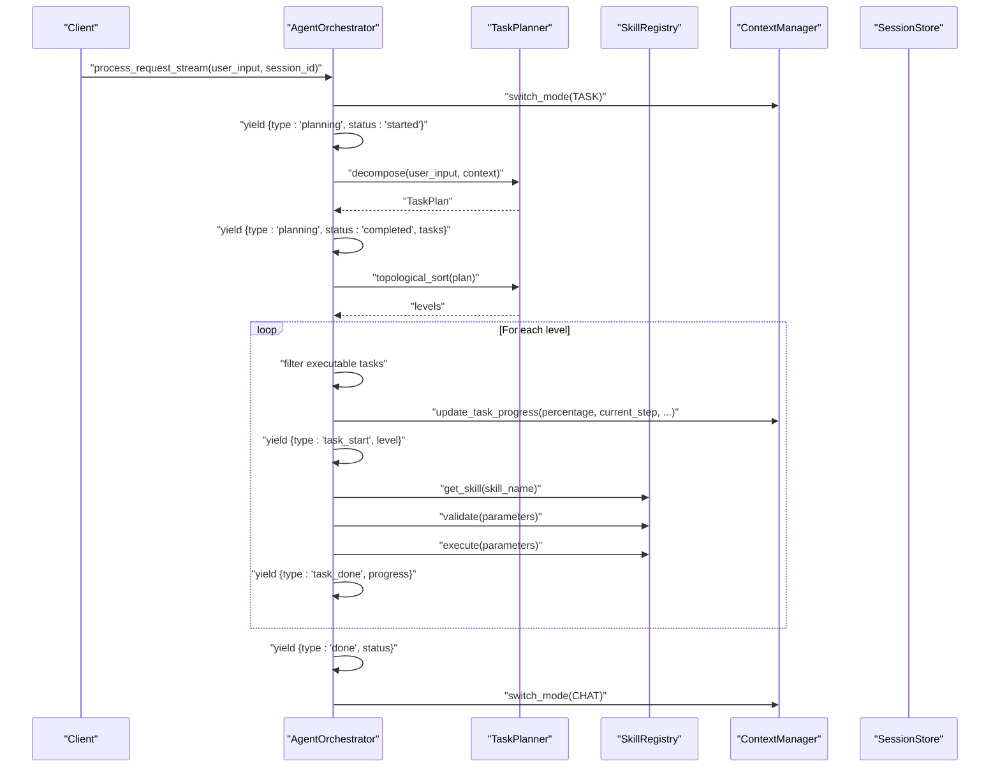
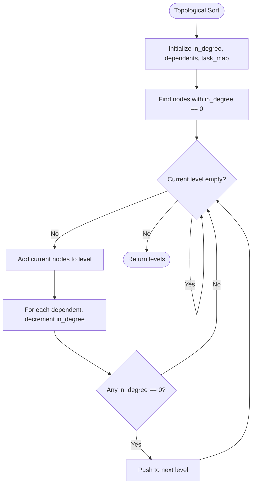
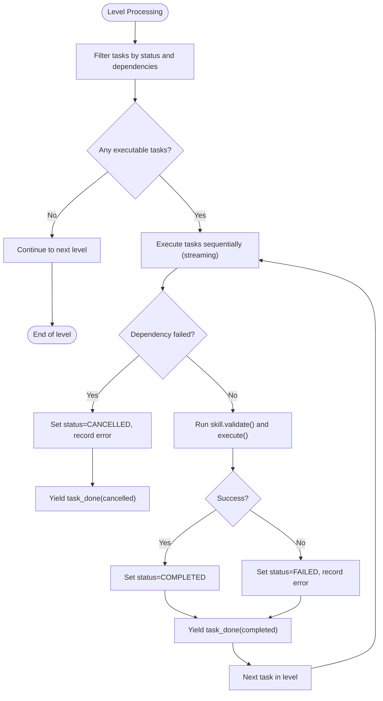
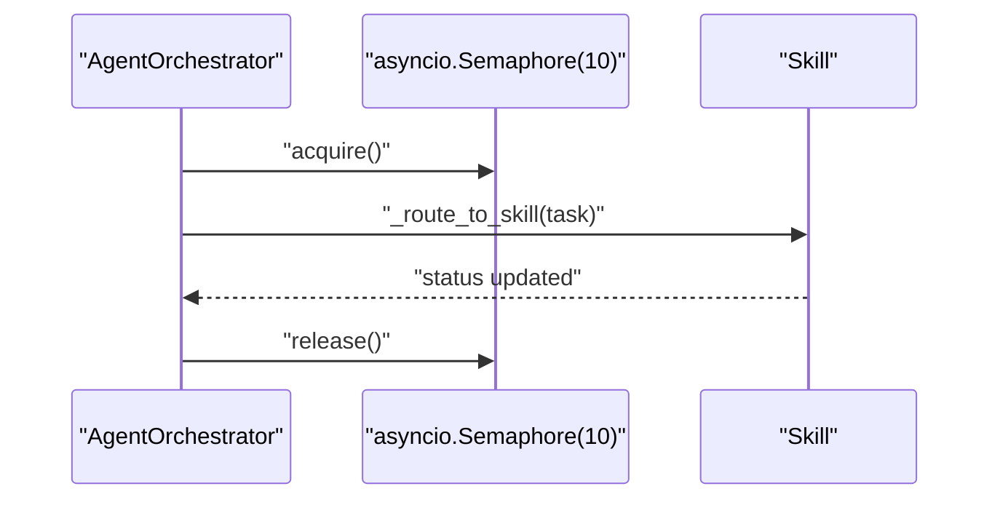
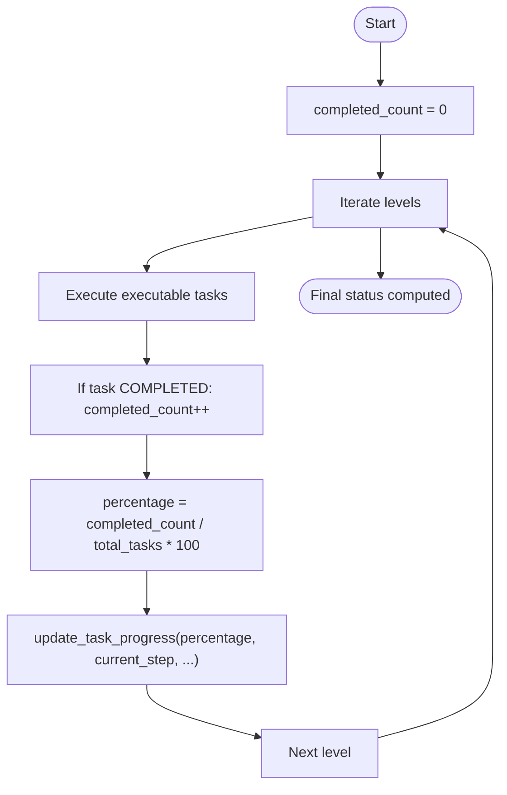
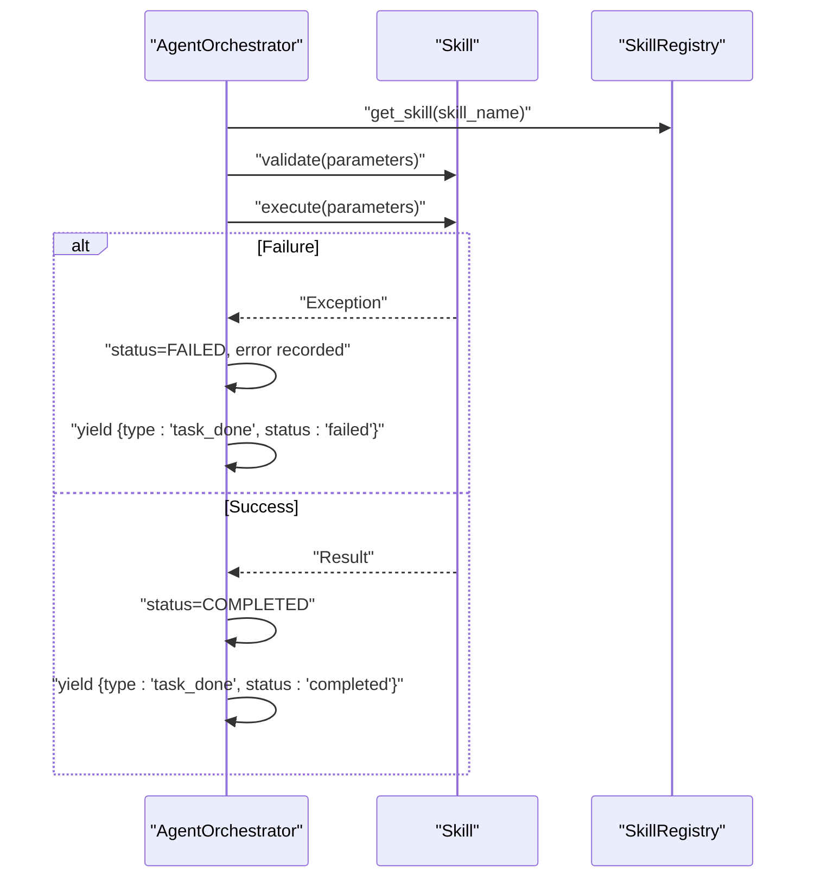
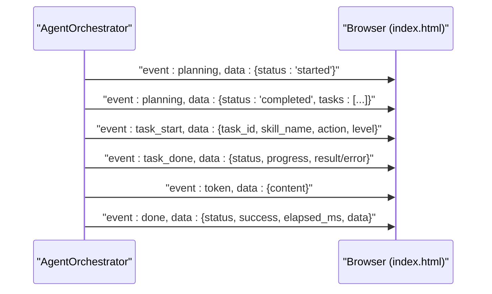
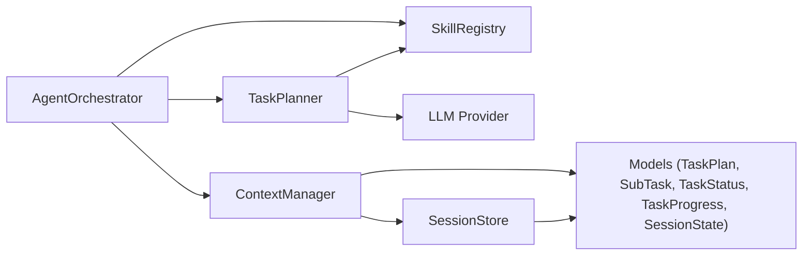

# Flow Control and Progress Tracking

<cite>
**Referenced Files in This Document**
- [orchestrator.py](file://src/aiops_agent/core/orchestrator.py)
- [task_planner.py](file://src/aiops_agent/core/task_planner.py)
- [state_machine.py](file://src/aiops_agent/core/state_machine.py)
- [schemas.py](file://src/aiops_agent/models/schemas.py)
- [manager.py](file://src/aiops_agent/context/manager.py)
- [session.py](file://src/aiops_agent/context/session.py)
- [test_sse.py](file://tests/test_sse.py)
- [index.html](file://src/aiops_agent/web/static/index.html)
</cite>

## Table of Contents
1. [Introduction](#introduction)
2. [Project Structure](#project-structure)
3. [Core Components](#core-components)
4. [Architecture Overview](#architecture-overview)
5. [Detailed Component Analysis](#detailed-component-analysis)
6. [Dependency Analysis](#dependency-analysis)
7. [Performance Considerations](#performance-considerations)
8. [Troubleshooting Guide](#troubleshooting-guide)
9. [Conclusion](#conclusion)

## Introduction
This document explains the streaming flow control mechanisms and progress tracking system in the AIOps agent. It focuses on:
- Topological sorting for DAG execution and level-by-level processing
- Dependency-aware task scheduling and cancellation
- Concurrency control with a semaphore-based parallel execution model (up to 10 concurrent tasks per level)
- Progress calculation, percentage completion tracking, and step-by-step updates
- Error propagation through the dependency graph and consistency maintenance during streaming
- Examples of progress tracking events and their relationship to the overall execution flow

## Project Structure
The flow control and progress tracking system spans several modules:
- Orchestrator: coordinates request processing, streams events, and manages DAG execution
- Task Planner: decomposes requests into TaskPlan and performs topological sorting
- State Machine: enforces legal task state transitions
- Models: define data structures for tasks, plans, and progress
- Context Manager: tracks session state and task progress
- Session Store: persists session state for continuity across requests
- Tests and Web UI: demonstrate event formats and frontend consumption

```mermaid
graph TB
subgraph "Core"
ORCH["AgentOrchestrator<br/>process_request_stream()"]
TP["TaskPlanner<br/>decompose(), topological_sort()"]
SM["TaskStateMachine<br/>transition()"]
CTX["ContextManager<br/>update_task_progress()"]
SES["SessionStore<br/>get_or_create(), persist()"]
end
subgraph "Models"
PLAN["TaskPlan"]
SUBT["SubTask"]
STAT["TaskStatus"]
PROG["TaskProgress"]
SESS["SessionState"]
end
ORCH --> TP
ORCH --> CTX
CTX --> SES
ORCH --> SM
ORCH --> PLAN
PLAN --> SUBT
SUBT --> STAT
CTX --> PROG
CTX --> SESS
```

**Diagram sources**
- [orchestrator.py:203-418](file://src/aiops_agent/core/orchestrator.py#L203-L418)
- [task_planner.py:115-150](file://src/aiops_agent/core/task_planner.py#L115-L150)
- [state_machine.py:51-82](file://src/aiops_agent/core/state_machine.py#L51-L82)
- [manager.py:127-153](file://src/aiops_agent/context/manager.py#L127-L153)
- [session.py:38-72](file://src/aiops_agent/context/session.py#L38-L72)
- [schemas.py:43-51](file://src/aiops_agent/models/schemas.py#L43-L51)

**Section sources**
- [orchestrator.py:1-658](file://src/aiops_agent/core/orchestrator.py#L1-L658)
- [task_planner.py:1-207](file://src/aiops_agent/core/task_planner.py#L1-L207)
- [state_machine.py:1-92](file://src/aiops_agent/core/state_machine.py#L1-L92)
- [schemas.py:1-313](file://src/aiops_agent/models/schemas.py#L1-L313)
- [manager.py:1-193](file://src/aiops_agent/context/manager.py#L1-L193)
- [session.py:1-131](file://src/aiops_agent/context/session.py#L1-L131)

## Core Components
- AgentOrchestrator: Implements the streaming request pipeline, emits structured events, and executes the DAG with concurrency control.
- TaskPlanner: Decomposes user requests into TaskPlan and computes topological levels for dependency-aware execution.
- TaskStateMachine: Enforces legal state transitions for individual tasks.
- ContextManager: Tracks task progress per session and persists session state.
- SessionStore: Manages session lifecycle and persistence.
- Models: Define TaskPlan, SubTask, TaskStatus, TaskProgress, and SessionState.

Key responsibilities:
- Streaming events: planning, task_start, task_done, error, done, token
- DAG execution: topological sorting, level filtering, dependency cancellation
- Concurrency: semaphore-based parallelism (10 concurrent tasks per level)
- Progress tracking: percentage, current step, total steps, completed steps

**Section sources**
- [orchestrator.py:203-418](file://src/aiops_agent/core/orchestrator.py#L203-L418)
- [task_planner.py:115-150](file://src/aiops_agent/core/task_planner.py#L115-L150)
- [state_machine.py:51-82](file://src/aiops_agent/core/state_machine.py#L51-L82)
- [manager.py:127-153](file://src/aiops_agent/context/manager.py#L127-L153)
- [schemas.py:19-51](file://src/aiops_agent/models/schemas.py#L19-L51)

## Architecture Overview
The streaming flow control architecture integrates decomposition, DAG execution, concurrency control, and progress tracking into a cohesive pipeline.

**Diagram sources**
- [orchestrator.py:203-418](file://src/aiops_agent/core/orchestrator.py#L203-L418)
- [task_planner.py:115-150](file://src/aiops_agent/core/task_planner.py#L115-L150)
- [manager.py:94-121](file://src/aiops_agent/context/manager.py#L94-L121)

## Detailed Component Analysis

### Topological Sorting and Level-by-Level Execution
The TaskPlanner constructs a DAG from the TaskPlan and performs a breadth-first topological sort to produce levels of tasks that can be executed concurrently without violating dependencies.

- Complexity: O(V + E) where V is the number of tasks and E is the number of dependencies.
- Levels represent maximal concurrency windows; tasks within a level are independent and can be executed in parallel.

**Diagram sources**
- [task_planner.py:115-150](file://src/aiops_agent/core/task_planner.py#L115-L150)

**Section sources**
- [task_planner.py:115-150](file://src/aiops_agent/core/task_planner.py#L115-L150)

### Dependency-Aware Scheduling and Cancellation
During streaming execution, the Orchestrator filters tasks per level to ensure only executable tasks are scheduled. Tasks whose dependencies have failed are immediately cancelled and reported.

- Cancellation is immediate and deterministic: any task depending on a failed task is marked cancelled and skipped.
- The Orchestrator maintains a set of failed task IDs to propagate failures downstream.

**Diagram sources**
- [orchestrator.py:279-348](file://src/aiops_agent/core/orchestrator.py#L279-L348)

**Section sources**
- [orchestrator.py:279-348](file://src/aiops_agent/core/orchestrator.py#L279-L348)

### Concurrency Control with Semaphore-Based Parallelism
The Orchestrator uses an asyncio.Semaphore to cap concurrency to 10 tasks per level. This ensures predictable resource usage and avoids overwhelming external systems.

- The Orchestrator builds a gather of coroutines, each wrapped with the semaphore, ensuring up to 10 concurrent tasks per level.
- This pattern balances throughput with safety and stability.

**Diagram sources**
- [orchestrator.py:450-460](file://src/aiops_agent/core/orchestrator.py#L450-L460)

**Section sources**
- [orchestrator.py:450-460](file://src/aiops_agent/core/orchestrator.py#L450-L460)

### Progress Calculation and Step-by-Step Updates
The Orchestrator calculates progress incrementally:
- Percentage: completed_count / total_tasks * 100
- Completed steps: cumulative count of completed tasks
- Current step: human-readable description of the current level

- The ContextManager stores TaskProgress in SessionState and exposes it to the UI.
- The frontend consumes SSE events and renders progress accordingly.

**Diagram sources**
- [orchestrator.py:275-356](file://src/aiops_agent/core/orchestrator.py#L275-L356)
- [manager.py:127-153](file://src/aiops_agent/context/manager.py#L127-L153)
- [schemas.py:255-262](file://src/aiops_agent/models/schemas.py#L255-L262)

**Section sources**
- [orchestrator.py:275-356](file://src/aiops_agent/core/orchestrator.py#L275-L356)
- [manager.py:127-153](file://src/aiops_agent/context/manager.py#L127-L153)
- [schemas.py:255-262](file://src/aiops_agent/models/schemas.py#L255-L262)

### Error Propagation and Consistency During Streaming
Errors are propagated through the dependency graph and surfaced as structured events:
- Task-level failures: recorded, tracked, and used to cancel dependent tasks
- Global errors: emitted as "error" events with standardized fields
- Final status: "completed" if all tasks succeed, otherwise "partial_failure"

- The Orchestrator switches back to CHAT mode in the finally block to ensure cleanup.
- Tests validate error propagation and dependency cancellation behavior.

**Diagram sources**
- [orchestrator.py:332-348](file://src/aiops_agent/core/orchestrator.py#L332-L348)
- [test_sse.py:246-287](file://tests/test_sse.py#L246-L287)

**Section sources**
- [orchestrator.py:332-348](file://src/aiops_agent/core/orchestrator.py#L332-L348)
- [test_sse.py:246-287](file://tests/test_sse.py#L246-L287)

### Streaming Events and Frontend Consumption
The Orchestrator yields structured SSE events that the frontend parses and displays:
- planning: started/completed with task summaries
- task_start: per-task start with level information
- task_done: per-task completion with progress and result/error
- error: global error events
- done: final status and aggregated plan
- token: streamed LLM synthesis tokens

- The frontend demonstrates parsing and rendering of these events, including progress updates and task lists.

**Diagram sources**
- [orchestrator.py:234-390](file://src/aiops_agent/core/orchestrator.py#L234-L390)
- [index.html:136-167](file://src/aiops_agent/web/static/index.html#L136-L167)

**Section sources**
- [orchestrator.py:234-390](file://src/aiops_agent/core/orchestrator.py#L234-L390)
- [index.html:100-167](file://src/aiops_agent/web/static/index.html#L100-L167)

## Dependency Analysis
The flow control system exhibits clear module boundaries and low coupling:
- Orchestrator depends on TaskPlanner, ContextManager, and SkillRegistry
- TaskPlanner depends on LLM provider and SkillRegistry
- ContextManager depends on SessionStore and models
- SessionStore persists SessionState and TaskProgress

**Diagram sources**
- [orchestrator.py:75-75](file://src/aiops_agent/core/orchestrator.py#L75-L75)
- [task_planner.py:42-48](file://src/aiops_agent/core/task_planner.py#L42-L48)
- [manager.py:36-44](file://src/aiops_agent/context/manager.py#L36-L44)
- [session.py:28-36](file://src/aiops_agent/context/session.py#L28-L36)
- [schemas.py:43-51](file://src/aiops_agent/models/schemas.py#L43-L51)

**Section sources**
- [orchestrator.py:75-75](file://src/aiops_agent/core/orchestrator.py#L75-L75)
- [task_planner.py:42-48](file://src/aiops_agent/core/task_planner.py#L42-L48)
- [manager.py:36-44](file://src/aiops_agent/context/manager.py#L36-L44)
- [session.py:28-36](file://src/aiops_agent/context/session.py#L28-L36)
- [schemas.py:43-51](file://src/aiops_agent/models/schemas.py#L43-L51)

## Performance Considerations
- Concurrency: The semaphore caps parallelism to 10 tasks per level, balancing throughput and resource safety.
- Topological sorting: O(V + E) ensures efficient level computation even for large DAGs.
- Streaming: Yielding events per task enables responsive UI updates and early feedback.
- Persistence: SessionStore persists sessions to disk, enabling recovery and continuity across restarts.
- Metrics: Orchestrator records task completion/failure for observability.

[No sources needed since this section provides general guidance]

## Troubleshooting Guide
Common issues and resolutions:
- No tasks generated: The Orchestrator returns an error event when decomposition produces no tasks.
- Skill not found: Validation failure marks tasks as failed; ensure skills are registered.
- Dependency failure: Dependent tasks are cancelled automatically; inspect the cancelled task’s error field.
- Global errors: Unexpected exceptions emit an error event with standardized fields.
- Frontend parsing: Ensure SSE parsing handles multiple events and encodings correctly.

Evidence from tests:
- Dependency cancellation behavior is verified for t1 failure → t2 cancellation.
- Error event emission for unexpected exceptions and AgentError instances.
- SSE event structure and Chinese encoding correctness.

**Section sources**
- [test_sse.py:215-244](file://tests/test_sse.py#L215-L244)
- [test_sse.py:246-287](file://tests/test_sse.py#L246-L287)
- [test_sse.py:293-336](file://tests/test_sse.py#L293-L336)
- [test_sse.py:342-406](file://tests/test_sse.py#L342-L406)

## Conclusion
The AIOps agent’s streaming flow control and progress tracking system combines:
- Topological sorting for dependency-aware execution
- Level-by-level processing with concurrency control
- Structured event streaming for real-time UI updates
- Robust error propagation and cancellation guarantees
- Persistent session state for continuity

Together, these mechanisms deliver a reliable, observable, and user-friendly execution pipeline suitable for complex operational workflows.