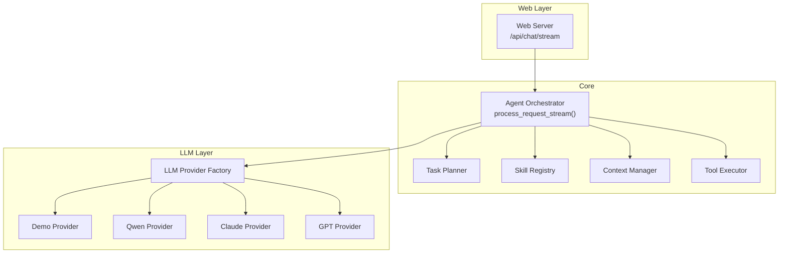
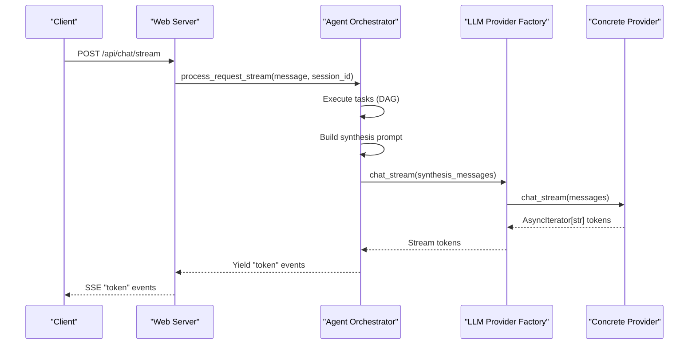
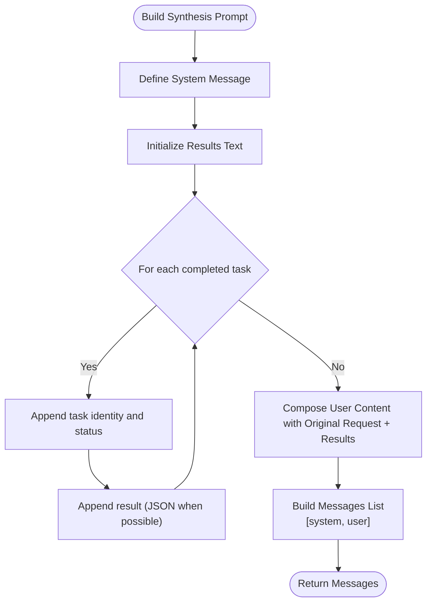
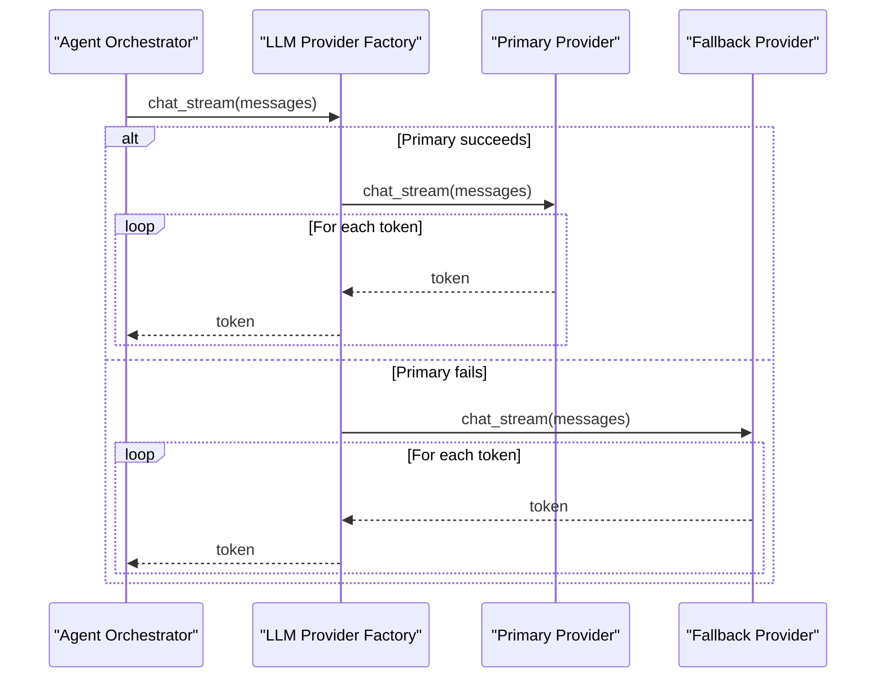
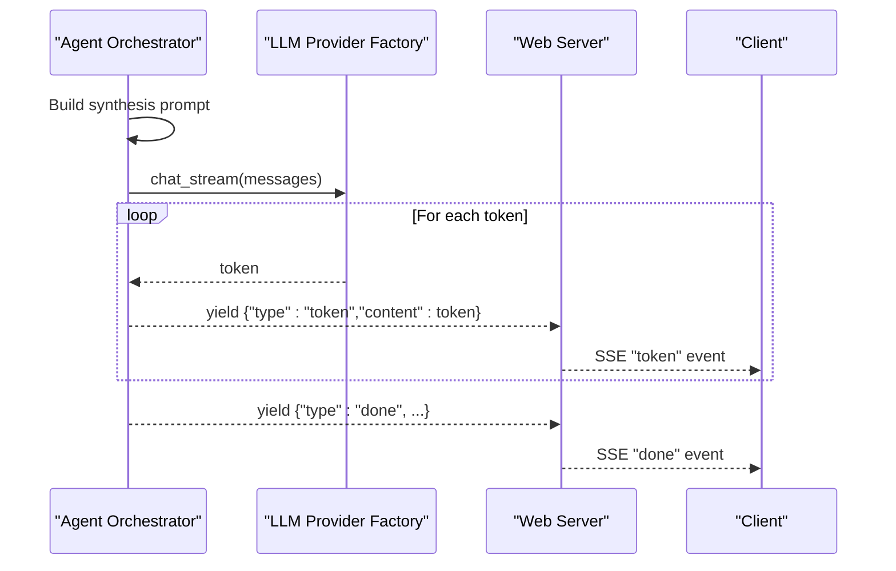
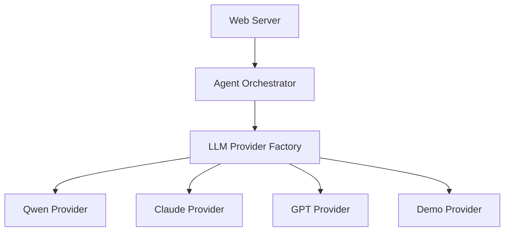

# LLM Integration for Synthesis

<cite>
**Referenced Files in This Document**
- [main.py](file://src/aiops_agent/main.py)
- [orchestrator.py](file://src/aiops_agent/core/orchestrator.py)
- [provider.py](file://src/aiops_agent/llm/provider.py)
- [qwen.py](file://src/aiops_agent/llm/qwen.py)
- [claude.py](file://src/aiops_agent/llm/claude.py)
- [gpt.py](file://src/aiops_agent/llm/gpt.py)
- [demo.py](file://src/aiops_agent/llm/demo.py)
- [schemas.py](file://src/aiops_agent/models/schemas.py)
- [server.py](file://src/aiops_agent/web/server.py)
</cite>

## Table of Contents
1. [Introduction](#introduction)
2. [Project Structure](#project-structure)
3. [Core Components](#core-components)
4. [Architecture Overview](#architecture-overview)
5. [Detailed Component Analysis](#detailed-component-analysis)
6. [Dependency Analysis](#dependency-analysis)
7. [Performance Considerations](#performance-considerations)
8. [Troubleshooting Guide](#troubleshooting-guide)
9. [Conclusion](#conclusion)

## Introduction
This document explains the LLM streaming synthesis integration that occurs after task completion in the AIOps Agent. It covers how the synthesis prompt is constructed, how results from executed tasks are aggregated, how the async streaming interface with the LLM provider factory works, and how synthesis integrates with the main streaming flow. It also documents fallback behavior when synthesis fails, error handling strategies, and performance considerations for long-running synthesis operations.

## Project Structure
The synthesis pipeline is orchestrated by the Agent Orchestrator and integrates with the LLM provider factory and concrete providers. The web server exposes an SSE endpoint that streams synthesis tokens to clients.

**Diagram sources**
- [server.py:85-135](file://src/aiops_agent/web/server.py#L85-L135)
- [orchestrator.py:203-418](file://src/aiops_agent/core/orchestrator.py#L203-L418)
- [provider.py:97-241](file://src/aiops_agent/llm/provider.py#L97-L241)
- [main.py:176-192](file://src/aiops_agent/main.py#L176-L192)

**Section sources**
- [server.py:85-135](file://src/aiops_agent/web/server.py#L85-L135)
- [orchestrator.py:203-418](file://src/aiops_agent/core/orchestrator.py#L203-L418)
- [provider.py:97-241](file://src/aiops_agent/llm/provider.py#L97-L241)
- [main.py:176-192](file://src/aiops_agent/main.py#L176-L192)

## Core Components
- Agent Orchestrator: Drives the end-to-end flow, executes tasks, aggregates results, and triggers synthesis.
- LLM Provider Factory: Manages provider registration, selection, and automatic fallback.
- Concrete Providers: Qwen, Claude, GPT, and Demo implementations.
- Web Server: Exposes SSE endpoint to stream synthesis tokens to clients.

Key responsibilities:
- Synthesis prompt construction: Builds a system message and user content aggregating task results.
- Streaming integration: Uses the provider factory’s streaming interface to emit tokens progressively.
- Fallback behavior: Attempts primary provider; falls back to secondary provider if streaming fails.
- Error handling: Gracefully continues the overall flow if synthesis fails.

**Section sources**
- [orchestrator.py:537-569](file://src/aiops_agent/core/orchestrator.py#L537-L569)
- [orchestrator.py:364-380](file://src/aiops_agent/core/orchestrator.py#L364-L380)
- [provider.py:177-209](file://src/aiops_agent/llm/provider.py#L177-L209)
- [server.py:118-134](file://src/aiops_agent/web/server.py#L118-L134)

## Architecture Overview
The synthesis flow is embedded within the orchestrator’s streaming pipeline. After all tasks complete successfully, the orchestrator constructs a synthesis prompt and streams tokens from the selected provider.

**Diagram sources**
- [server.py:118-134](file://src/aiops_agent/web/server.py#L118-L134)
- [orchestrator.py:364-380](file://src/aiops_agent/core/orchestrator.py#L364-L380)
- [provider.py:177-209](file://src/aiops_agent/llm/provider.py#L177-L209)
- [qwen.py:110-161](file://src/aiops_agent/llm/qwen.py#L110-L161)

## Detailed Component Analysis

### Synthesis Prompt Construction
The orchestrator builds a structured synthesis prompt composed of:
- System message: Defines the assistant role and desired output format.
- User content: Aggregates the original user request and a formatted list of executed tasks and their results.

Prompt construction steps:
1. Define a system message instructing the model to summarize results and provide actionable insights.
2. Iterate through completed tasks and append:
   - Task identity (skill name and action)
   - Status
   - Result (JSON-formatted when possible)
3. Compose a user message combining the original request and the aggregated results.

**Diagram sources**
- [orchestrator.py:537-569](file://src/aiops_agent/core/orchestrator.py#L537-L569)

**Section sources**
- [orchestrator.py:537-569](file://src/aiops_agent/core/orchestrator.py#L537-L569)

### Async Streaming Interface with LLM Provider Factory
The orchestrator invokes the provider factory’s streaming method to receive tokens asynchronously. The factory attempts the primary provider first; if streaming fails, it falls back to the secondary provider.

Key behaviors:
- chat_stream(): Streams tokens from the primary provider; if it fails, streams from the fallback provider.
- Non-streaming fallback: The base provider’s default chat_stream() yields the entire response as a single token.

**Diagram sources**
- [provider.py:177-209](file://src/aiops_agent/llm/provider.py#L177-L209)
- [qwen.py:110-161](file://src/aiops_agent/llm/qwen.py#L110-L161)

**Section sources**
- [provider.py:177-209](file://src/aiops_agent/llm/provider.py#L177-L209)
- [qwen.py:110-161](file://src/aiops_agent/llm/qwen.py#L110-L161)

### Integration with Main Streaming Flow
The synthesis stream is integrated into the orchestrator’s main streaming flow. After task completion, the orchestrator:
- Builds the synthesis prompt
- Streams tokens via the provider factory
- Yields "token" SSE events to the client
- Continues with a final "done" event regardless of synthesis outcome

**Diagram sources**
- [orchestrator.py:364-390](file://src/aiops_agent/core/orchestrator.py#L364-L390)
- [server.py:118-134](file://src/aiops_agent/web/server.py#L118-L134)

**Section sources**
- [orchestrator.py:364-390](file://src/aiops_agent/core/orchestrator.py#L364-L390)
- [server.py:118-134](file://src/aiops_agent/web/server.py#L118-L134)

### Concrete Provider Implementations
- Qwen Provider: Implements true streaming via SSE chunks and yields tokens incrementally.
- Claude Provider: Supports chat and complete; does not implement streaming in this codebase.
- GPT Provider: Supports chat and embeddings; does not implement streaming in this codebase.
- Demo Provider: Provides a mock streaming implementation for development and testing.

**Section sources**
- [qwen.py:110-161](file://src/aiops_agent/llm/qwen.py#L110-L161)
- [claude.py:44-96](file://src/aiops_agent/llm/claude.py#L44-L96)
- [gpt.py:44-92](file://src/aiops_agent/llm/gpt.py#L44-L92)
- [demo.py:63-88](file://src/aiops_agent/llm/demo.py#L63-L88)

### Example: Synthesis Prompt Construction
- System message: Defines the assistant role and output expectations.
- User content: Includes the original request and a structured summary of task outcomes and results.

Example structure:
- System: "You are an AIOps intelligent operations assistant..."
- User: "User original request: ... \n\n## Task Execution Results\n- Task: monitoring · query_metrics\n  Status: completed\n  Result: { ... }\n\nPlease provide analysis and recommendations."

**Section sources**
- [orchestrator.py:537-569](file://src/aiops_agent/core/orchestrator.py#L537-L569)

### Example: Streaming Token Delivery Pattern
- The orchestrator emits "token" events containing incremental synthesis content.
- The web server translates these into SSE events for the client.
- The client renders the synthesis content progressively.

**Section sources**
- [orchestrator.py:373-377](file://src/aiops_agent/core/orchestrator.py#L373-L377)
- [server.py:113-134](file://src/aiops_agent/web/server.py#L113-L134)

## Dependency Analysis
The synthesis integration depends on:
- Orchestrator’s synthesis prompt builder and streaming integration
- Provider factory’s fallback logic
- Concrete provider streaming implementations
- Web server’s SSE event emission

**Diagram sources**
- [orchestrator.py:364-380](file://src/aiops_agent/core/orchestrator.py#L364-L380)
- [provider.py:97-241](file://src/aiops_agent/llm/provider.py#L97-L241)
- [server.py:118-134](file://src/aiops_agent/web/server.py#L118-L134)

**Section sources**
- [orchestrator.py:364-380](file://src/aiops_agent/core/orchestrator.py#L364-L380)
- [provider.py:97-241](file://src/aiops_agent/llm/provider.py#L97-L241)
- [server.py:118-134](file://src/aiops_agent/web/server.py#L118-L134)

## Performance Considerations
- Streaming latency: Qwen streaming yields tokens incrementally; Claude/GPT do not implement streaming in this codebase and would fall back to non-streaming behavior.
- Throughput: The provider factory’s streaming method short-circuits on the first successful provider, minimizing retries.
- Backpressure: The orchestrator yields tokens progressively; ensure client-side buffering is handled to avoid blocking.
- Timeout handling: Providers define timeouts; failures trigger fallback logic transparently.
- Long-running synthesis: The orchestrator continues the overall flow even if synthesis fails, preventing a single failure from blocking the entire pipeline.

[No sources needed since this section provides general guidance]

## Troubleshooting Guide
Common scenarios and resolutions:
- No providers configured: The factory raises runtime errors when no primary/fallback is set. Ensure providers are registered and primary/fallback are set during initialization.
- Primary provider fails: The factory automatically attempts the fallback provider for streaming. Monitor logs for warnings and errors.
- Synthesis failure: The orchestrator catches exceptions during synthesis and logs a warning, but continues the overall flow. Verify provider credentials and network connectivity.
- Client-side SSE parsing: Ensure the client handles SSE events correctly and decodes UTF-8 content.

Operational checks:
- Confirm provider registration and primary/fallback assignment in the orchestrator initialization.
- Validate that the SSE endpoint is reachable and that the client receives "token" and "done" events.
- Review logs for synthesis-related warnings and provider errors.

**Section sources**
- [provider.py:177-209](file://src/aiops_agent/llm/provider.py#L177-L209)
- [orchestrator.py:378-380](file://src/aiops_agent/core/orchestrator.py#L378-L380)
- [server.py:118-134](file://src/aiops_agent/web/server.py#L118-L134)

## Conclusion
The synthesis integration seamlessly weaves post-task summarization into the orchestrator’s streaming pipeline. By constructing a clear synthesis prompt and leveraging the provider factory’s robust fallback behavior, the system delivers responsive, resilient streaming summaries. The design ensures that synthesis failures do not block the overall flow, while still providing rich, incremental insights to users.