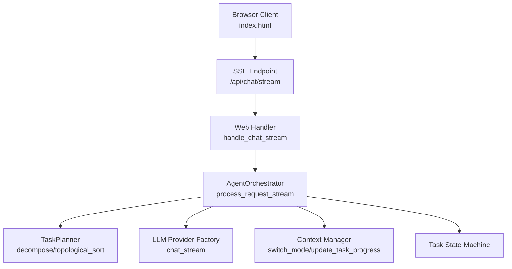
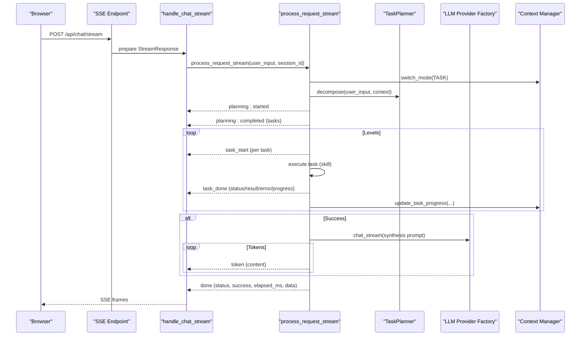
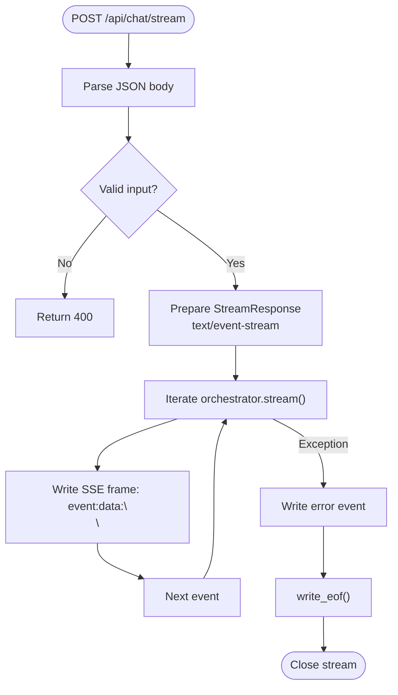
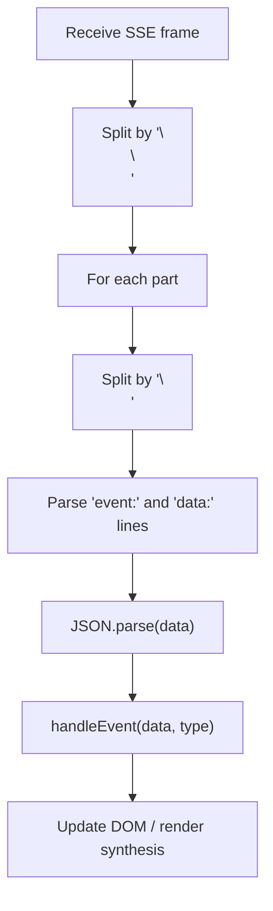
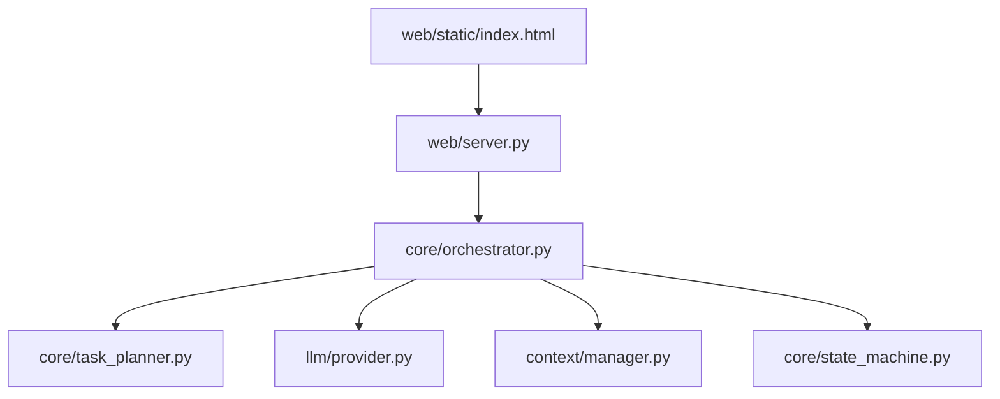

# Streaming Execution Mode

<cite>
**Referenced Files in This Document**
- [server.py](file://src/aiops_agent/web/server.py)
- [orchestrator.py](file://src/aiops_agent/core/orchestrator.py)
- [task_planner.py](file://src/aiops_agent/core/task_planner.py)
- [schemas.py](file://src/aiops_agent/models/schemas.py)
- [index.html](file://src/aiops_agent/web/static/index.html)
- [test_sse.py](file://tests/test_sse.py)
- [provider.py](file://src/aiops_agent/llm/provider.py)
- [state_machine.py](file://src/aiops_agent/core/state_machine.py)
- [manager.py](file://src/aiops_agent/context/manager.py)
</cite>

## Table of Contents
1. [Introduction](#introduction)
2. [Project Structure](#project-structure)
3. [Core Components](#core-components)
4. [Architecture Overview](#architecture-overview)
5. [Detailed Component Analysis](#detailed-component-analysis)
6. [Dependency Analysis](#dependency-analysis)
7. [Performance Considerations](#performance-considerations)
8. [Troubleshooting Guide](#troubleshooting-guide)
9. [Conclusion](#conclusion)

## Introduction
This document explains the streaming execution mode that implements Server-Sent Events (SSE) for real-time progress updates. It covers event types, payloads, timing, flow control, progress tracking, state maintenance, integration with LLM streaming for final synthesis, error propagation, client-side handling patterns, and performance considerations for long-running operations.

## Project Structure
The streaming mode spans several modules:
- Web server exposes the SSE endpoint and writes events to clients.
- Orchestrator coordinates planning, execution, and synthesis, yielding structured events.
- Task planner generates the task graph from natural language requests.
- Models define shared data structures and enums.
- Frontend consumes SSE and renders live updates.
- Tests validate event formats and end-to-end behavior.

**Diagram sources**
- [server.py:85-135](file://src/aiops_agent/web/server.py#L85-L135)
- [orchestrator.py:203-419](file://src/aiops_agent/core/orchestrator.py#L203-L419)
- [task_planner.py:50-150](file://src/aiops_agent/core/task_planner.py#L50-L150)
- [index.html:90-134](file://src/aiops_agent/web/static/index.html#L90-L134)

**Section sources**
- [server.py:196-227](file://src/aiops_agent/web/server.py#L196-L227)
- [orchestrator.py:203-419](file://src/aiops_agent/core/orchestrator.py#L203-L419)

## Core Components
- SSE Endpoint: Creates a streaming response with appropriate headers and writes structured events.
- Orchestrator Stream: Yields events for planning, task lifecycle, synthesis tokens, and completion/error.
- Task Planner: Builds a DAG of tasks and performs topological sorting for execution order.
- Models: Define statuses, plans, tasks, and messages used across the system.
- Frontend: Parses SSE chunks, handles events, and renders progress and synthesis.

**Section sources**
- [server.py:85-135](file://src/aiops_agent/web/server.py#L85-L135)
- [orchestrator.py:203-419](file://src/aiops_agent/core/orchestrator.py#L203-L419)
- [task_planner.py:50-150](file://src/aiops_agent/core/task_planner.py#L50-L150)
- [schemas.py:19-62](file://src/aiops_agent/models/schemas.py#L19-L62)
- [index.html:136-180](file://src/aiops_agent/web/static/index.html#L136-L180)

## Architecture Overview
The streaming pipeline is an asynchronous generator that yields structured dictionaries representing SSE events. The server wraps these in text/event-stream frames and flushes them to the client as they become available.

**Diagram sources**
- [server.py:85-135](file://src/aiops_agent/web/server.py#L85-L135)
- [orchestrator.py:203-419](file://src/aiops_agent/core/orchestrator.py#L203-L419)
- [task_planner.py:50-150](file://src/aiops_agent/core/task_planner.py#L50-L150)
- [provider.py:177-209](file://src/aiops_agent/llm/provider.py#L177-L209)
- [manager.py:94-153](file://src/aiops_agent/context/manager.py#L94-L153)

## Detailed Component Analysis

### SSE Endpoint and Event Writing
- The handler sets SSE headers and prepares a streaming response.
- It iterates over the orchestrator’s async generator and writes each event as an SSE frame.
- On exceptions, it writes an error event and closes the stream.

**Diagram sources**
- [server.py:85-135](file://src/aiops_agent/web/server.py#L85-L135)

**Section sources**
- [server.py:85-135](file://src/aiops_agent/web/server.py#L85-L135)

### Orchestrator Streaming Events
The orchestrator yields structured dictionaries that map to SSE events. The event types and payloads are defined below.

- Event: planning
  - Status: started
    - Payload keys: type, status, message, session_id, trace_id
  - Status: completed
    - Payload keys: type, status, message, total_tasks, tasks[], session_id, trace_id
- Event: task_start
  - Payload keys: type, task_id, skill_name, action, level, session_id
- Event: task_done
  - Payload keys: type, task_id, skill_name, action, status, result, error, progress, session_id
- Event: token
  - Payload keys: type, content, session_id
- Event: done
  - Payload keys: type, status, message, success, elapsed_ms, data.plan, session_id, trace_id
- Event: error
  - Payload keys: type, status, message, error_code, suggestion, session_id, trace_id

Timing and flow:
- Immediately after input validation, emits planning: started.
- After decomposition completes, emits planning: completed with task list.
- For each task in topological order:
  - Emits task_start before execution.
  - Emits task_done with status, result or error, and progress.
- After all tasks, if successful, streams synthesis tokens via LLM provider factory.
- Finally emits done with aggregated status and metrics.

Progress tracking:
- The orchestrator computes progress as completed_count/total_tasks and includes it in task_done events.
- Context manager updates session task progress for UI rendering.

State maintenance:
- Switches to TASK mode during streaming and restores CHAT mode in finally.
- Tracks skill failures and health thresholds.
- Uses OpenTelemetry trace IDs for correlation.

**Section sources**
- [orchestrator.py:203-419](file://src/aiops_agent/core/orchestrator.py#L203-L419)
- [manager.py:94-153](file://src/aiops_agent/context/manager.py#L94-L153)
- [schemas.py:19-62](file://src/aiops_agent/models/schemas.py#L19-L62)

### Task Planner and DAG Execution
- Decomposes user input into SubTasks with dependencies.
- Performs topological sort to determine execution levels.
- Orchestrator executes tasks sequentially within each level and yields events accordingly.

**Section sources**
- [task_planner.py:50-150](file://src/aiops_agent/core/task_planner.py#L50-L150)
- [orchestrator.py:274-357](file://src/aiops_agent/core/orchestrator.py#L274-L357)

### LLM Streaming for Final Synthesis
- On success, the orchestrator builds a synthesis prompt from executed tasks and streams tokens via the LLM provider factory.
- The factory attempts primary provider, falls back to fallback provider, and yields tokens incrementally.
- The orchestrator translates each token into an SSE event of type token.

**Section sources**
- [orchestrator.py:364-380](file://src/aiops_agent/core/orchestrator.py#L364-L380)
- [provider.py:177-209](file://src/aiops_agent/llm/provider.py#L177-L209)

### Client-Side Event Handling Patterns
- The browser reads the SSE stream, splits on double-newlines, parses event and data lines, and dispatches to a handler.
- The handler updates UI for planning, task steps, synthesis tokens, completion, and errors.

**Diagram sources**
- [index.html:100-134](file://src/aiops_agent/web/static/index.html#L100-L134)
- [index.html:136-180](file://src/aiops_agent/web/static/index.html#L136-L180)

**Section sources**
- [index.html:90-134](file://src/aiops_agent/web/static/index.html#L90-L134)
- [index.html:136-180](file://src/aiops_agent/web/static/index.html#L136-L180)

### Error Propagation in Streaming Context
- Orchestrator catches AgentError and internal exceptions, emitting error events with structured fields.
- Server catches unhandled exceptions and writes an error event before closing the stream.
- Tests validate error event emission for empty task plans, unexpected exceptions, and AgentError variants.

**Section sources**
- [orchestrator.py:392-416](file://src/aiops_agent/core/orchestrator.py#L392-L416)
- [server.py:125-132](file://src/aiops_agent/web/server.py#L125-L132)
- [test_sse.py:293-336](file://tests/test_sse.py#L293-L336)

## Dependency Analysis
The streaming mode depends on:
- Web server for SSE framing and response preparation.
- Orchestrator for planning, execution, synthesis, and event emission.
- Task planner for DAG construction and ordering.
- LLM provider factory for streaming synthesis tokens.
- Context manager for mode switching and progress updates.
- State machine for task lifecycle transitions.

**Diagram sources**
- [server.py:85-135](file://src/aiops_agent/web/server.py#L85-L135)
- [orchestrator.py:203-419](file://src/aiops_agent/core/orchestrator.py#L203-L419)
- [task_planner.py:50-150](file://src/aiops_agent/core/task_planner.py#L50-L150)
- [provider.py:177-209](file://src/aiops_agent/llm/provider.py#L177-L209)
- [manager.py:94-153](file://src/aiops_agent/context/manager.py#L94-L153)
- [state_machine.py:51-82](file://src/aiops_agent/core/state_machine.py#L51-L82)
- [index.html:90-134](file://src/aiops_agent/web/static/index.html#L90-L134)

**Section sources**
- [server.py:85-135](file://src/aiops_agent/web/server.py#L85-L135)
- [orchestrator.py:203-419](file://src/aiops_agent/core/orchestrator.py#L203-L419)
- [task_planner.py:50-150](file://src/aiops_agent/core/task_planner.py#L50-L150)
- [provider.py:177-209](file://src/aiops_agent/llm/provider.py#L177-L209)
- [manager.py:94-153](file://src/aiops_agent/context/manager.py#L94-L153)
- [state_machine.py:51-82](file://src/aiops_agent/core/state_machine.py#L51-L82)
- [index.html:90-134](file://src/aiops_agent/web/static/index.html#L90-L134)

## Performance Considerations
- Streaming headers: The server disables buffering to ensure immediate delivery of events.
- Backpressure: The orchestrator yields events as they are produced, avoiding large intermediate buffers.
- Concurrency: The synchronous streaming mode ensures deterministic ordering; parallelism is handled in non-streaming execution paths.
- LLM synthesis: Streaming tokens reduce latency to first token and enable progressive UI updates.
- Metrics: The orchestrator records task completion/failure and duration for observability.
- Health checks: Skill failure thresholds trigger unhealthy marking and metrics.

[No sources needed since this section provides general guidance]

## Troubleshooting Guide
Common issues and resolutions:
- Empty message: The SSE endpoint returns 400 if the message is missing.
- Encoding issues: SSE payloads use UTF-8 and ensure non-ASCII characters are preserved.
- Client parsing: The frontend splits on double-newlines and expects valid JSON in data lines.
- Error events: Verify error events include message, error_code, and suggestion for actionable feedback.
- Long-running tasks: Progress updates are emitted per task; ensure the UI listens for task_done events to reflect completion.

**Section sources**
- [server.py:88-94](file://src/aiops_agent/web/server.py#L88-L94)
- [index.html:100-134](file://src/aiops_agent/web/static/index.html#L100-L134)
- [test_sse.py:427-461](file://tests/test_sse.py#L427-L461)

## Conclusion
The streaming execution mode delivers real-time visibility into task planning and execution via SSE. It provides structured events for planning, task lifecycle, synthesis tokens, and completion, with robust error propagation and client-side handling patterns. The design balances determinism, observability, and responsiveness for long-running operations.