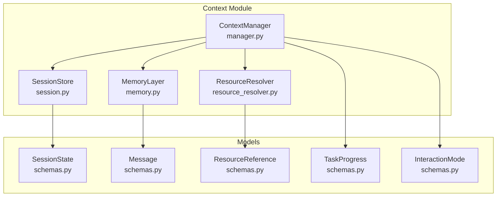
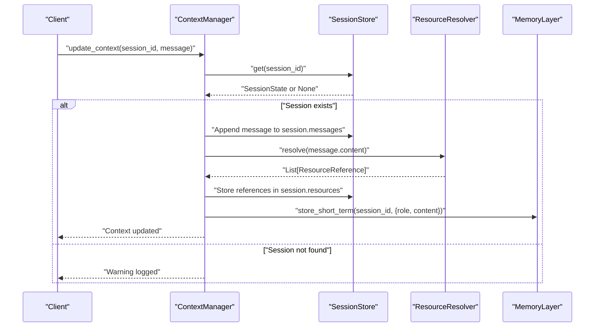
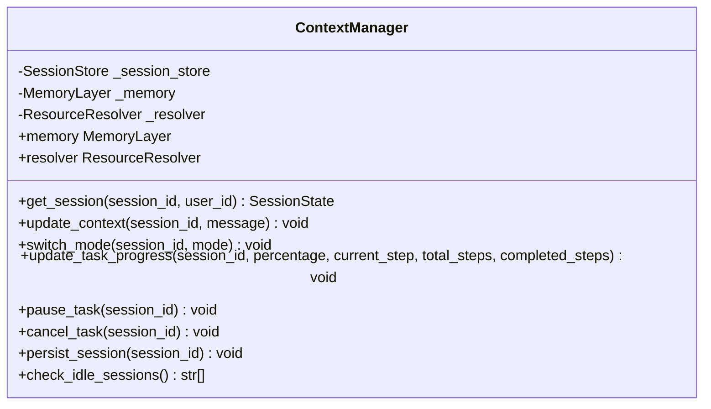
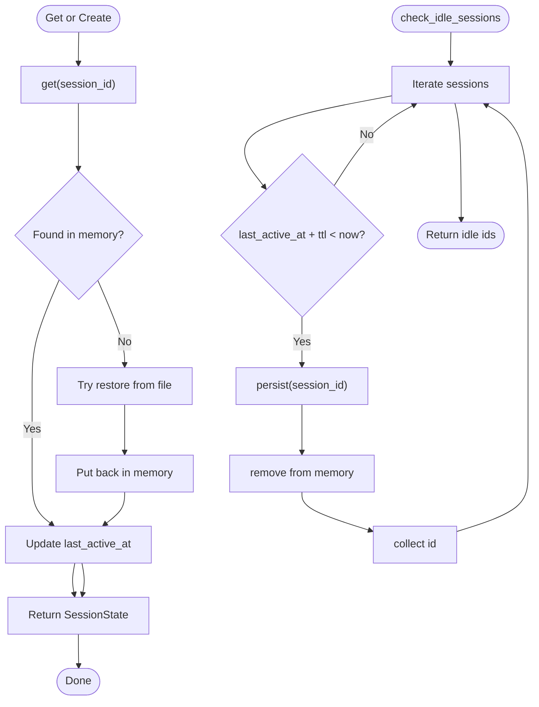
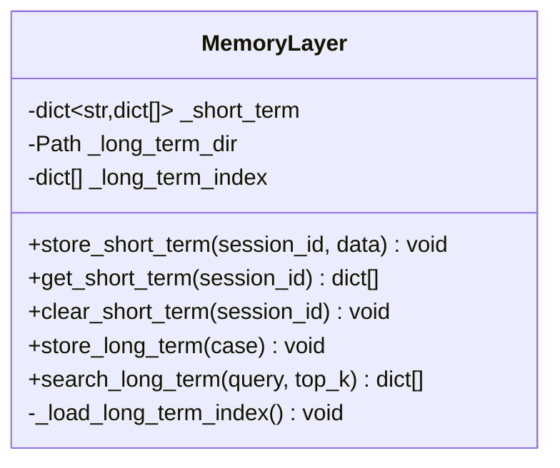
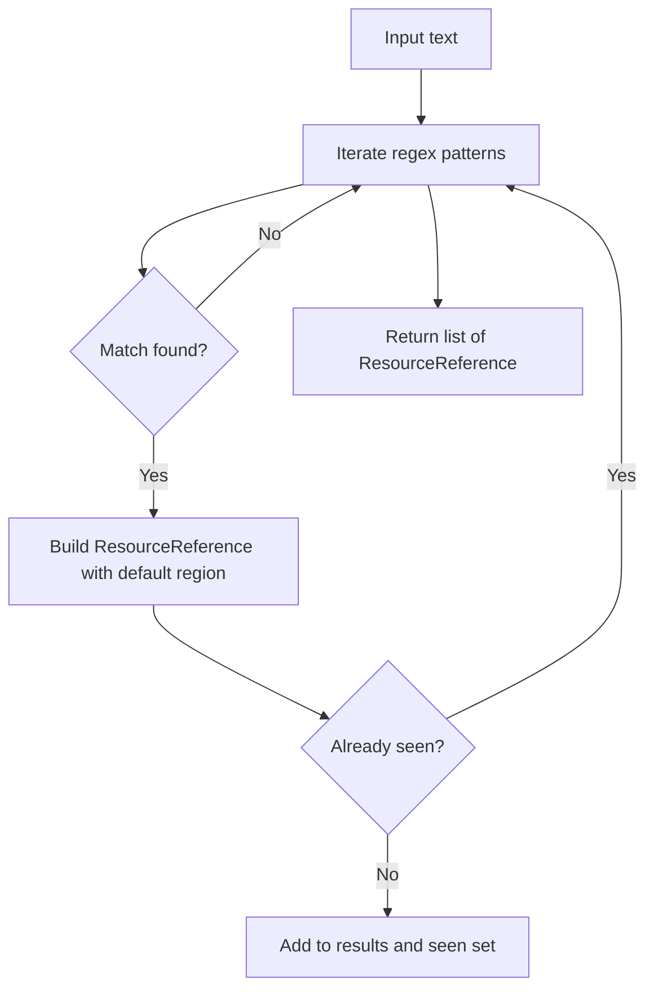
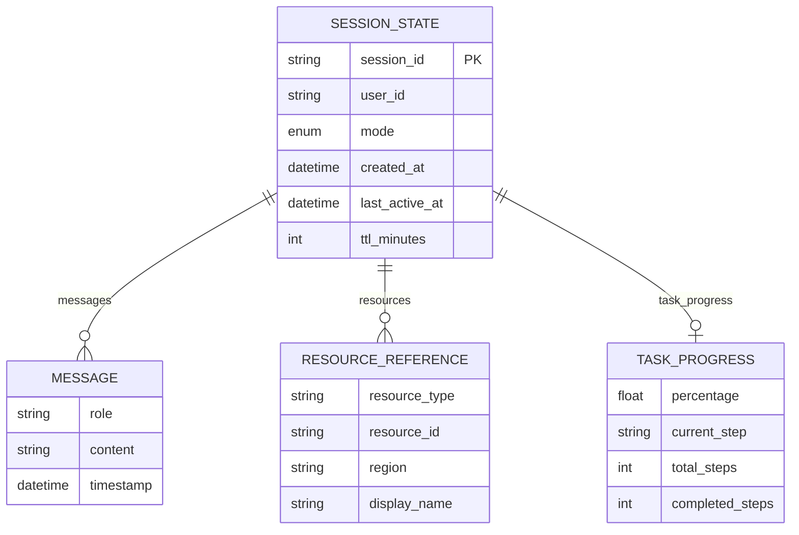
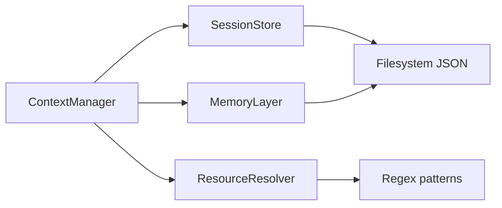

# Context Management

<cite>
**Referenced Files in This Document**
- [manager.py](file://src/aiops_agent/context/manager.py)
- [memory.py](file://src/aiops_agent/context/memory.py)
- [session.py](file://src/aiops_agent/context/session.py)
- [resource_resolver.py](file://src/aiops_agent/context/resource_resolver.py)
- [schemas.py](file://src/aiops_agent/models/schemas.py)
- [main.py](file://src/aiops_agent/main.py)
- [test_context_manager.py](file://tests/test_context_manager.py)
- [test_memory.py](file://tests/test_memory.py)
- [test_session.py](file://tests/test_session.py)
- [test_resource_resolver.py](file://tests/test_resource_resolver.py)
</cite>

## Table of Contents
1. [Introduction](#introduction)
2. [Project Structure](#project-structure)
3. [Core Components](#core-components)
4. [Architecture Overview](#architecture-overview)
5. [Detailed Component Analysis](#detailed-component-analysis)
6. [Dependency Analysis](#dependency-analysis)
7. [Performance Considerations](#performance-considerations)
8. [Security Considerations](#security-considerations)
9. [Troubleshooting Guide](#troubleshooting-guide)
10. [Conclusion](#conclusion)

## Introduction
This document describes the Context Management system responsible for multi-turn conversations, session lifecycle management, message history tracking, interaction mode switching between CHAT and TASK modes, and resource resolution for cloud resources. It explains how the ContextManager integrates SessionStore, MemoryLayer, and ResourceResolver to provide persistent and stateful interactions, and outlines patterns for context updates, session handling, and resource resolution workflows.

## Project Structure
The Context Management module resides under src/aiops_agent/context and includes:
- manager.py: Orchestration of session, memory, and resource resolution
- session.py: SessionStore for session lifecycle and persistence
- memory.py: MemoryLayer for short-term and long-term memory
- resource_resolver.py: ResourceResolver for parsing cloud resource references
- schemas.py: Shared data models including SessionState, Message, ResourceReference, TaskProgress, and InteractionMode

**Diagram sources**
- [manager.py:1-193](file://src/aiops_agent/context/manager.py#L1-L193)
- [session.py:19-131](file://src/aiops_agent/context/session.py#L19-L131)
- [memory.py:20-149](file://src/aiops_agent/context/memory.py#L20-L149)
- [resource_resolver.py:33-81](file://src/aiops_agent/context/resource_resolver.py#L33-L81)
- [schemas.py:264-276](file://src/aiops_agent/models/schemas.py#L264-L276)
- [schemas.py:64-71](file://src/aiops_agent/models/schemas.py#L64-L71)
- [schemas.py:246-253](file://src/aiops_agent/models/schemas.py#L246-L253)
- [schemas.py:255-262](file://src/aiops_agent/models/schemas.py#L255-L262)
- [schemas.py:238-244](file://src/aiops_agent/models/schemas.py#L238-L244)

**Section sources**
- [manager.py:1-193](file://src/aiops_agent/context/manager.py#L1-L193)
- [session.py:19-131](file://src/aiops_agent/context/session.py#L19-L131)
- [memory.py:20-149](file://src/aiops_agent/context/memory.py#L20-L149)
- [resource_resolver.py:33-81](file://src/aiops_agent/context/resource_resolver.py#L33-L81)
- [schemas.py:264-276](file://src/aiops_agent/models/schemas.py#L264-L276)
- [schemas.py:64-71](file://src/aiops_agent/models/schemas.py#L64-L71)
- [schemas.py:246-253](file://src/aiops_agent/models/schemas.py#L246-L253)
- [schemas.py:255-262](file://src/aiops_agent/models/schemas.py#L255-L262)
- [schemas.py:238-244](file://src/aiops_agent/models/schemas.py#L238-L244)

## Core Components
- ContextManager: Central coordinator integrating SessionStore, MemoryLayer, and ResourceResolver. Provides session retrieval, context updates, mode switching, task progress tracking, and persistence controls.
- SessionStore: Manages session creation, retrieval, persistence to disk, restoration, and idle eviction.
- MemoryLayer: Implements short-term memory (in-memory per session) and long-term memory (persistent JSON files) with basic keyword-based search.
- ResourceResolver: Parses cloud resource identifiers from text and produces ResourceReference objects.

Key responsibilities:
- Multi-turn conversation: ContextManager appends messages, resolves resources, and stores short-term memory.
- Session lifecycle: SessionStore manages creation, persistence, restoration, and idle timeout eviction.
- Interaction modes: ContextManager switches between CHAT, TASK, and WATCH modes while preserving context.
- Task progress: TASK mode initializes and tracks progress; supports pause and cancel.
- Resource resolution: ResourceResolver identifies ECS, RDS, VPC, SLB, EIP, security groups, disks, snapshots, images, and OSS URIs.

**Section sources**
- [manager.py:25-193](file://src/aiops_agent/context/manager.py#L25-L193)
- [session.py:19-131](file://src/aiops_agent/context/session.py#L19-L131)
- [memory.py:20-149](file://src/aiops_agent/context/memory.py#L20-L149)
- [resource_resolver.py:33-81](file://src/aiops_agent/context/resource_resolver.py#L33-L81)

## Architecture Overview
The ContextManager acts as the central orchestrator, delegating to SessionStore for session state, MemoryLayer for memory, and ResourceResolver for resource identification.

**Diagram sources**
- [manager.py:58-88](file://src/aiops_agent/context/manager.py#L58-L88)
- [session.py:53-65](file://src/aiops_agent/context/session.py#L53-L65)
- [resource_resolver.py:44-71](file://src/aiops_agent/context/resource_resolver.py#L44-L71)
- [memory.py:46-59](file://src/aiops_agent/context/memory.py#L46-L59)

**Section sources**
- [manager.py:58-88](file://src/aiops_agent/context/manager.py#L58-L88)
- [session.py:53-65](file://src/aiops_agent/context/session.py#L53-L65)
- [resource_resolver.py:44-71](file://src/aiops_agent/context/resource_resolver.py#L44-L71)
- [memory.py:46-59](file://src/aiops_agent/context/memory.py#L46-L59)

## Detailed Component Analysis

### ContextManager
Responsibilities:
- Session management: get_session delegates to SessionStore.get_or_create.
- Context updates: append Message to session.history, resolve resource references, and store short-term memory.
- Interaction mode switching: switch_mode transitions between CHAT, TASK, WATCH, initializing/clearing TaskProgress accordingly.
- Task progress: update_task_progress, pause_task, cancel_task.
- Persistence: persist_session and check_idle_sessions delegate to SessionStore.

**Diagram sources**
- [manager.py:25-193](file://src/aiops_agent/context/manager.py#L25-L193)

**Section sources**
- [manager.py:25-193](file://src/aiops_agent/context/manager.py#L25-L193)

### SessionStore
Responsibilities:
- Create sessions with initial state (mode CHAT, timestamps, TTL).
- Retrieve sessions from memory or restore from persisted JSON.
- Persist sessions to JSON files and remove them from memory.
- Detect idle sessions beyond TTL and persist them automatically.

**Diagram sources**
- [session.py:53-115](file://src/aiops_agent/context/session.py#L53-L115)
- [session.py:98-115](file://src/aiops_agent/context/session.py#L98-L115)

**Section sources**
- [session.py:19-131](file://src/aiops_agent/context/session.py#L19-L131)

### MemoryLayer
Responsibilities:
- Short-term memory: Store and retrieve per-session arrays of message-like dictionaries.
- Long-term memory: Persist structured cases to JSON files with timestamps and load them into an in-memory index.
- Keyword-based search: Simple scoring over title/description/tags for long-term retrieval.

**Diagram sources**
- [memory.py:20-149](file://src/aiops_agent/context/memory.py#L20-L149)

**Section sources**
- [memory.py:20-149](file://src/aiops_agent/context/memory.py#L20-L149)

### ResourceResolver
Responsibilities:
- Parse text for cloud resource identifiers using predefined regex patterns.
- Produce ResourceReference objects with resource_type, resource_id, and default region.
- Deduplicate matches and support adding custom patterns.

**Diagram sources**
- [resource_resolver.py:44-71](file://src/aiops_agent/context/resource_resolver.py#L44-L71)

**Section sources**
- [resource_resolver.py:33-81](file://src/aiops_agent/context/resource_resolver.py#L33-L81)

### Data Models
Shared models used across the context system:
- SessionState: Holds session_id, user_id, mode, messages, resources, task_progress, timestamps, and TTL.
- Message: role, content, timestamp, metadata.
- ResourceReference: resource_type, resource_id, region, display_name.
- TaskProgress: percentage, current_step, total_steps, completed_steps.
- InteractionMode: CHAT, TASK, WATCH.

**Diagram sources**
- [schemas.py:264-276](file://src/aiops_agent/models/schemas.py#L264-L276)
- [schemas.py:64-71](file://src/aiops_agent/models/schemas.py#L64-L71)
- [schemas.py:246-253](file://src/aiops_agent/models/schemas.py#L246-L253)
- [schemas.py:255-262](file://src/aiops_agent/models/schemas.py#L255-L262)
- [schemas.py:238-244](file://src/aiops_agent/models/schemas.py#L238-L244)

**Section sources**
- [schemas.py:264-276](file://src/aiops_agent/models/schemas.py#L264-L276)
- [schemas.py:64-71](file://src/aiops_agent/models/schemas.py#L64-L71)
- [schemas.py:246-253](file://src/aiops_agent/models/schemas.py#L246-L253)
- [schemas.py:255-262](file://src/aiops_agent/models/schemas.py#L255-L262)
- [schemas.py:238-244](file://src/aiops_agent/models/schemas.py#L238-L244)

## Dependency Analysis
ContextManager depends on SessionStore, MemoryLayer, and ResourceResolver. SessionStore persists to JSON files; MemoryLayer persists long-term cases to JSON; ResourceResolver parses text into ResourceReference objects.

**Diagram sources**
- [manager.py:12-14](file://src/aiops_agent/context/manager.py#L12-L14)
- [session.py:74-96](file://src/aiops_agent/context/session.py#L74-L96)
- [memory.py:75-91](file://src/aiops_agent/context/memory.py#L75-L91)
- [resource_resolver.py:18-30](file://src/aiops_agent/context/resource_resolver.py#L18-L30)

**Section sources**
- [manager.py:12-14](file://src/aiops_agent/context/manager.py#L12-L14)
- [session.py:74-96](file://src/aiops_agent/context/session.py#L74-L96)
- [memory.py:75-91](file://src/aiops_agent/context/memory.py#L75-L91)
- [resource_resolver.py:18-30](file://src/aiops_agent/context/resource_resolver.py#L18-L30)

## Performance Considerations
- Short-term memory is in-memory and O(1) append/get/clear per session; scale with concurrent sessions.
- Long-term memory search is O(N) over the index with simple scoring; consider vector database integration for production.
- File I/O for persistence and restoration is synchronous; consider async file operations for high throughput.
- Regex scanning is linear in input length; tune patterns and consider pre-tokenization for large messages.

[No sources needed since this section provides general guidance]

## Security Considerations
- Context storage: Sessions and long-term memory are stored as JSON files. Ensure filesystem permissions restrict access to sensitive data.
- Resource references: ResourceReference includes region and resource_id; avoid embedding secrets in content parsed by ResourceResolver.
- Privacy: Messages may contain sensitive operational data; consider sanitization before persistence and limit retention to TTL.
- Access control: Combine ContextManager usage with permission gates and audit logging to enforce least privilege and track actions.

[No sources needed since this section provides general guidance]

## Troubleshooting Guide
Common issues and diagnostics:
- Session not found when updating context: ContextManager logs a warning and returns early. Verify session_id correctness and that SessionStore.get_or_create was invoked.
- Persistence failures: SessionStore and MemoryLayer catch OS errors and log exceptions; check filesystem permissions and disk availability.
- Idle sessions evicted unexpectedly: Confirm TTL settings and last_active_at updates; use check_idle_sessions to proactively persist.
- Resource resolution misses: Validate regex patterns and ensure default region alignment; add custom patterns via add_pattern.

**Section sources**
- [manager.py:66-68](file://src/aiops_agent/context/manager.py#L66-L68)
- [session.py:88-89](file://src/aiops_agent/context/session.py#L88-L89)
- [memory.py:85-87](file://src/aiops_agent/context/memory.py#L85-L87)
- [session.py:98-115](file://src/aiops_agent/context/session.py#L98-L115)

## Conclusion
The Context Management system provides robust multi-turn conversation handling with integrated session lifecycle, memory persistence, and cloud resource resolution. ContextManager coordinates SessionStore, MemoryLayer, and ResourceResolver to support CHAT and TASK modes, enabling task progress tracking and safe, auditable interactions. For production deployments, consider enhancing long-term memory search with vector databases, securing file-based persistence, and applying sanitization and retention policies.