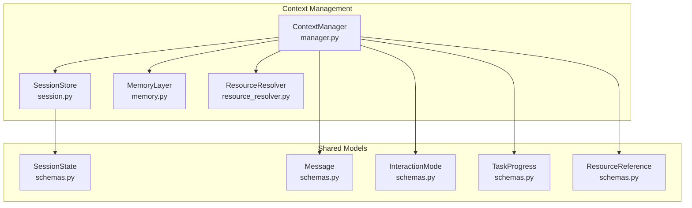
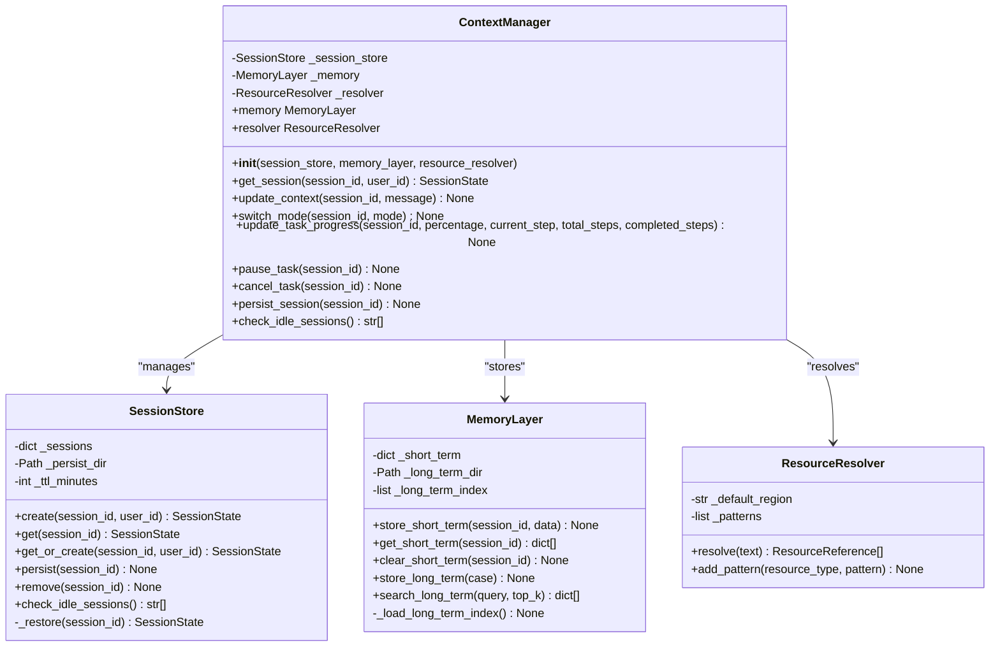
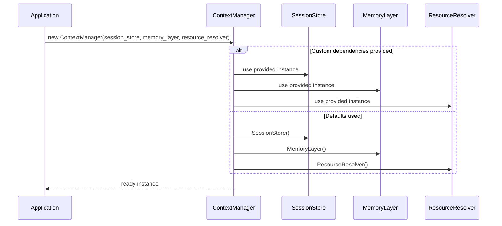
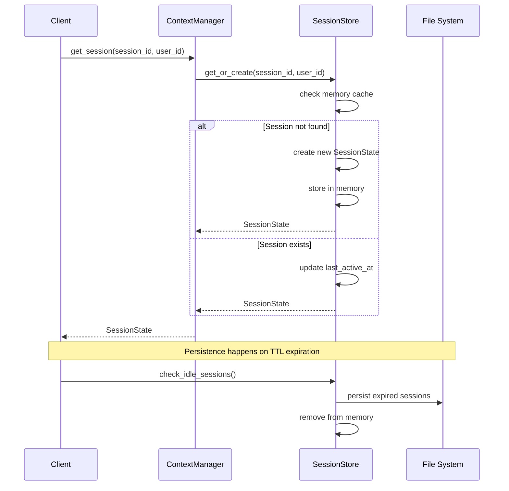
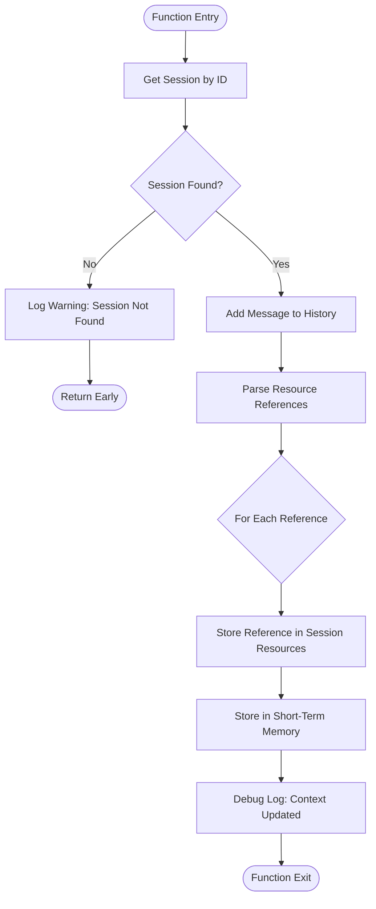
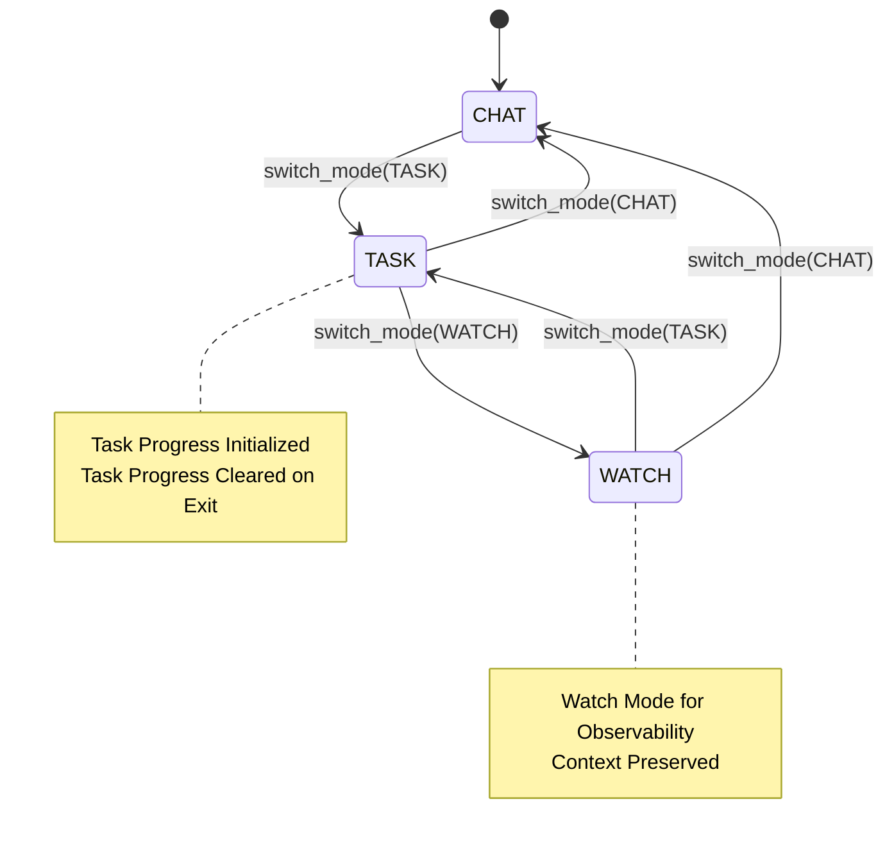
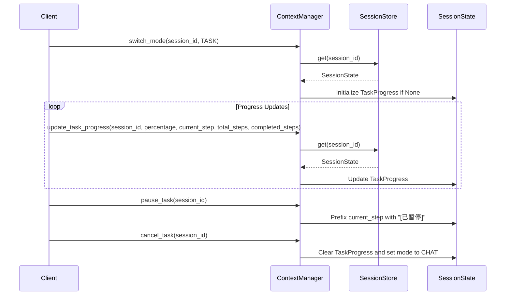
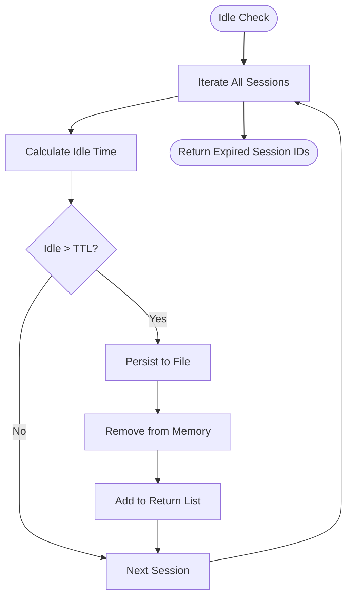
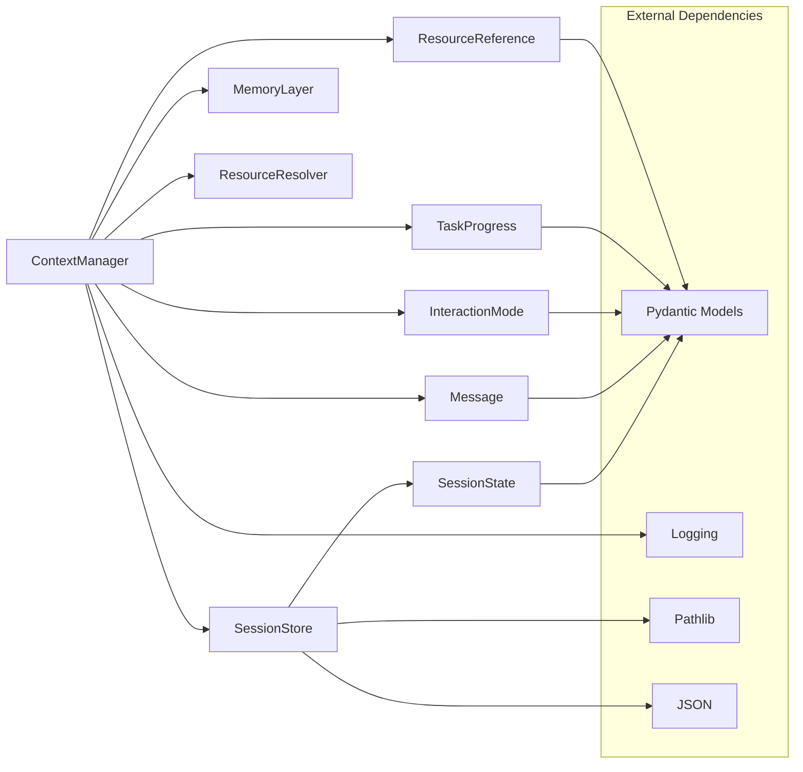

# Context Manager Core

<cite>
**Referenced Files in This Document**
- [manager.py](file://src/aiops_agent/context/manager.py)
- [session.py](file://src/aiops_agent/context/session.py)
- [memory.py](file://src/aiops_agent/context/memory.py)
- [resource_resolver.py](file://src/aiops_agent/context/resource_resolver.py)
- [schemas.py](file://src/aiops_agent/models/schemas.py)
- [test_context_manager.py](file://tests/test_context_manager.py)
- [conftest.py](file://tests/conftest.py)
- [main.py](file://src/aiops_agent/main.py)
</cite>

## Table of Contents
1. [Introduction](#introduction)
2. [Project Structure](#project-structure)
3. [Core Components](#core-components)
4. [Architecture Overview](#architecture-overview)
5. [Detailed Component Analysis](#detailed-component-analysis)
6. [Dependency Analysis](#dependency-analysis)
7. [Performance Considerations](#performance-considerations)
8. [Troubleshooting Guide](#troubleshooting-guide)
9. [Conclusion](#conclusion)
10. [Appendices](#appendices)

## Introduction
This document provides comprehensive documentation for the ContextManager core component that orchestrates the entire context management system. ContextManager acts as the central coordinator integrating SessionStore, MemoryLayer, and ResourceResolver to manage multi-turn conversations, track message history, automatically resolve resource references, and support interaction mode switching across CHAT, TASK, and WATCH modes while preserving context.

## Project Structure
The context management subsystem resides under the aiops_agent/context package and integrates with shared data models defined in models/schemas.py. The primary orchestration occurs in manager.py, which delegates to specialized components for session lifecycle management, memory storage, and resource reference parsing.

**Diagram sources**
- [manager.py:25-193](file://src/aiops_agent/context/manager.py#L25-L193)
- [session.py:19-131](file://src/aiops_agent/context/session.py#L19-L131)
- [memory.py:20-149](file://src/aiops_agent/context/memory.py#L20-L149)
- [resource_resolver.py:33-81](file://src/aiops_agent/context/resource_resolver.py#L33-L81)
- [schemas.py:238-276](file://src/aiops_agent/models/schemas.py#L238-L276)

**Section sources**
- [manager.py:1-193](file://src/aiops_agent/context/manager.py#L1-L193)
- [session.py:1-131](file://src/aiops_agent/context/session.py#L1-L131)
- [memory.py:1-149](file://src/aiops_agent/context/memory.py#L1-L149)
- [resource_resolver.py:1-81](file://src/aiops_agent/context/resource_resolver.py#L1-L81)
- [schemas.py:1-313](file://src/aiops_agent/models/schemas.py#L1-L313)

## Core Components
- ContextManager: Central coordinator managing session lifecycle, context updates, resource resolution, and interaction mode switching.
- SessionStore: Manages session creation, retrieval, persistence, and idle timeout detection.
- MemoryLayer: Provides short-term memory storage for current sessions and long-term memory persistence for historical cases.
- ResourceResolver: Parses natural language messages to extract cloud resource identifiers and creates ResourceReference objects.

Key responsibilities:
- Session management: Creation, retrieval, persistence, and idle cleanup
- Context updates: Message history tracking, resource reference parsing, and short-term memory storage
- Interaction modes: Switching between CHAT, TASK, and WATCH modes with context preservation
- Task progress tracking: Managing progress state during TASK mode execution
- Property access: Exposes MemoryLayer and ResourceResolver instances for external use

**Section sources**
- [manager.py:25-44](file://src/aiops_agent/context/manager.py#L25-L44)
- [session.py:19-37](file://src/aiops_agent/context/session.py#L19-L37)
- [memory.py:20-41](file://src/aiops_agent/context/memory.py#L20-L41)
- [resource_resolver.py:33-43](file://src/aiops_agent/context/resource_resolver.py#L33-L43)

## Architecture Overview
The ContextManager follows a layered architecture pattern with clear separation of concerns:

**Diagram sources**
- [manager.py:25-193](file://src/aiops_agent/context/manager.py#L25-L193)
- [session.py:19-131](file://src/aiops_agent/context/session.py#L19-L131)
- [memory.py:20-149](file://src/aiops_agent/context/memory.py#L20-L149)
- [resource_resolver.py:33-81](file://src/aiops_agent/context/resource_resolver.py#L33-L81)

## Detailed Component Analysis

### Initialization and Dependency Injection
ContextManager employs constructor-based dependency injection with optional parameters and default instantiation:

**Diagram sources**
- [manager.py:36-44](file://src/aiops_agent/context/manager.py#L36-L44)
- [main.py:203-207](file://src/aiops_agent/main.py#L203-L207)
- [conftest.py:199-204](file://tests/conftest.py#L199-L204)

Initialization patterns:
- Optional parameters allow external injection of mocks for testing
- Default constructors create fresh instances for production use
- Properties expose internal components for direct access when needed

**Section sources**
- [manager.py:36-44](file://src/aiops_agent/context/manager.py#L36-L44)
- [main.py:203-207](file://src/aiops_agent/main.py#L203-L207)
- [conftest.py:199-204](file://tests/conftest.py#L199-L204)

### Session Management Workflow
Session lifecycle is managed through SessionStore with automatic persistence and idle timeout detection:

**Diagram sources**
- [manager.py:50-52](file://src/aiops_agent/context/manager.py#L50-L52)
- [session.py:38-72](file://src/aiops_agent/context/session.py#L38-L72)
- [session.py:98-115](file://src/aiops_agent/context/session.py#L98-L115)

Key behaviors:
- Automatic session creation when retrieving non-existent sessions
- Timestamp updates on each access for idle detection
- File-based persistence with JSON serialization
- Cleanup of expired sessions based on TTL configuration

**Section sources**
- [session.py:38-72](file://src/aiops_agent/context/session.py#L38-L72)
- [session.py:74-96](file://src/aiops_agent/context/session.py#L74-L96)
- [session.py:98-115](file://src/aiops_agent/context/session.py#L98-L115)

### Context Update Workflow
The update_context method implements a comprehensive workflow for processing new messages:

**Diagram sources**
- [manager.py:58-88](file://src/aiops_agent/context/manager.py#L58-L88)
- [resource_resolver.py:44-71](file://src/aiops_agent/context/resource_resolver.py#L44-L71)
- [memory.py:46-59](file://src/aiops_agent/context/memory.py#L46-L59)

Processing pipeline:
1. Retrieve session from store (auto-creating if needed)
2. Append new message to message history
3. Parse message content for resource references using ResourceResolver
4. Store parsed references in session.resources dictionary
5. Persist message data to MemoryLayer short-term storage
6. Log debug information with resource count

Resource parsing capabilities:
- ECS instances (i-xxxxxxxxxxxxxxx format)
- RDS databases (rm-xxxxxxxxxxxxxxx format)
- VPC networks (vpc-xxxxxxxxxxxxxxx format)
- VSwitches (vsw-xxxxxxxxxxxxxxx format)
- SLB load balancers (lb-xxxxxxxxxxxxxxx format)
- EIP addresses (eip-xxxxxxxxxxxxxxx format)
- Security groups (sg-xxxxxxxxxxxxxxx format)
- Disks (d-xxxxxxxxxxxxxxx format)
- Snapshots (s-xxxxxxxxxxxxxxx format)
- Images (m-xxxxxxxxxxxxxxx format)
- OSS buckets (oss://bucket/path format)

**Section sources**
- [manager.py:58-88](file://src/aiops_agent/context/manager.py#L58-L88)
- [resource_resolver.py:18-30](file://src/aiops_agent/context/resource_resolver.py#L18-L30)
- [resource_resolver.py:44-71](file://src/aiops_agent/context/resource_resolver.py#L44-L71)
- [memory.py:46-59](file://src/aiops_agent/context/memory.py#L46-L59)

### Interaction Mode Switching
ContextManager supports three interaction modes with context preservation:

**Diagram sources**
- [manager.py:94-121](file://src/aiops_agent/context/manager.py#L94-L121)
- [schemas.py:238-244](file://src/aiops_agent/models/schemas.py#L238-L244)

Mode-specific behaviors:
- CHAT: Default mode for general conversation
- TASK: Specialized mode with progress tracking and structured execution
- WATCH: Observational mode for passive monitoring

Progress management:
- TASK mode initializes TaskProgress on first entry
- Progress cleared when leaving TASK mode
- Current step prefixed with "[已暂停]" during pause operations

**Section sources**
- [manager.py:94-121](file://src/aiops_agent/context/manager.py#L94-L121)
- [schemas.py:255-262](file://src/aiops_agent/models/schemas.py#L255-L262)

### Task Progress Tracking
Task execution includes comprehensive progress monitoring:

**Diagram sources**
- [manager.py:127-168](file://src/aiops_agent/context/manager.py#L127-L168)

Progress attributes:
- percentage: Completion percentage (0-100)
- current_step: Human-readable description of current operation
- total_steps: Total number of steps in workflow
- completed_steps: Number of completed steps

**Section sources**
- [manager.py:127-168](file://src/aiops_agent/context/manager.py#L127-L168)
- [schemas.py:255-262](file://src/aiops_agent/models/schemas.py#L255-L262)

### Persistence and Idle Detection
Session persistence operates on a configurable TTL basis:

**Diagram sources**
- [session.py:98-115](file://src/aiops_agent/context/session.py#L98-L115)
- [session.py:74-96](file://src/aiops_agent/context/session.py#L74-L96)

Persistence mechanics:
- JSON serialization of SessionState model
- Separate file per session with UUID-based naming
- Atomic write operations with error handling
- Restoration from persisted files on demand

**Section sources**
- [session.py:74-96](file://src/aiops_agent/context/session.py#L74-L96)
- [session.py:117-130](file://src/aiops_agent/context/session.py#L117-L130)

## Dependency Analysis
The ContextManager exhibits loose coupling through dependency injection and clear interface boundaries:

**Diagram sources**
- [manager.py:12-20](file://src/aiops_agent/context/manager.py#L12-L20)
- [schemas.py:264-276](file://src/aiops_agent/models/schemas.py#L264-L276)

Key dependency characteristics:
- High cohesion within each component (single responsibility)
- Low coupling through interface-based design
- Clear data flow boundaries between components
- Minimal circular dependencies

**Section sources**
- [manager.py:12-20](file://src/aiops_agent/context/manager.py#L12-L20)
- [schemas.py:264-276](file://src/aiops_agent/models/schemas.py#L264-L276)

## Performance Considerations
- Memory usage: SessionState objects stored in-memory with TTL-based eviction
- I/O operations: File-based persistence occurs only on idle detection and explicit requests
- Parsing overhead: Resource reference extraction uses compiled regular expressions
- Concurrency: All methods are async-compatible for concurrent session handling

Optimization opportunities:
- Implement LRU caching for frequently accessed sessions
- Batch persistence operations for high-throughput scenarios
- Asynchronous resource resolution for large message volumes
- Connection pooling for long-term memory database integration

## Troubleshooting Guide
Common issues and resolutions:

**Session Not Found Errors**
- Symptom: Warning logs indicating missing sessions
- Cause: Attempting to update context for non-existent session ID
- Resolution: Ensure session is created via get_session before updates

**Persistence Failures**
- Symptom: Exceptions during session persistence
- Cause: File system permissions or disk space issues
- Resolution: Verify write permissions to persistence directory

**Resource Parsing Issues**
- Symptom: Missing resource references in session.resources
- Cause: Unsupported resource identifier formats
- Resolution: Extend ResourceResolver patterns or use supported formats

**Mode Switching Problems**
- Symptom: Task progress not cleared on mode exit
- Cause: Incorrect mode state management
- Resolution: Verify switch_mode calls and TaskProgress lifecycle

**Section sources**
- [manager.py:66-68](file://src/aiops_agent/context/manager.py#L66-L68)
- [session.py:88-89](file://src/aiops_agent/context/session.py#L88-L89)
- [resource_resolver.py:69](file://src/aiops_agent/context/resource_resolver.py#L69-L69)

## Conclusion
The ContextManager provides a robust foundation for multi-modal AI agent interactions by integrating session lifecycle management, intelligent resource resolution, and structured task execution. Its modular design enables flexible deployment patterns while maintaining strong guarantees around context preservation and operational reliability.

Key strengths:
- Clean separation of concerns across session, memory, and resource management
- Comprehensive testing coverage with realistic usage patterns
- Extensible architecture supporting future enhancements
- Production-ready error handling and logging

Future enhancements could include distributed session storage, advanced resource discovery, and integration with vector databases for semantic memory.

## Appendices

### Usage Examples

**Basic Session Management**
- Create or retrieve sessions: [get_session:50-52](file://src/aiops_agent/context/manager.py#L50-L52)
- Persist sessions manually: [persist_session:174-176](file://src/aiops_agent/context/manager.py#L174-L176)
- Check idle sessions: [check_idle_sessions:178-180](file://src/aiops_agent/context/manager.py#L178-L180)

**Context Updates**
- Add messages with resource parsing: [update_context:58-88](file://src/aiops_agent/context/manager.py#L58-L88)
- Access underlying memory: [memory property:186-188](file://src/aiops_agent/context/manager.py#L186-L188)
- Access underlying resolver: [resolver property:190-192](file://src/aiops_agent/context/manager.py#L190-L192)

**Mode Transitions**
- Switch to task mode: [switch_mode:94-121](file://src/aiops_agent/context/manager.py#L94-L121)
- Track task progress: [update_task_progress:127-153](file://src/aiops_agent/context/manager.py#L127-L153)
- Pause task execution: [pause_task:155-160](file://src/aiops_agent/context/manager.py#L155-L160)
- Cancel task and reset: [cancel_task:162-168](file://src/aiops_agent/context/manager.py#L162-L168)

**Testing Patterns**
- Mock initialization: [context_manager fixture:199-204](file://tests/conftest.py#L199-L204)
- Session lifecycle tests: [test_get_or_create_session:28-38](file://tests/test_context_manager.py#L28-L38)
- Context update tests: [test_update_context_resolves_resources:57-63](file://tests/test_context_manager.py#L57-L63)
- Mode switching tests: [test_switch_to_task_mode:79-85](file://tests/test_context_manager.py#L79-L85)
- Task progress tests: [test_update_task_progress:115-125](file://tests/test_context_manager.py#L115-L125)