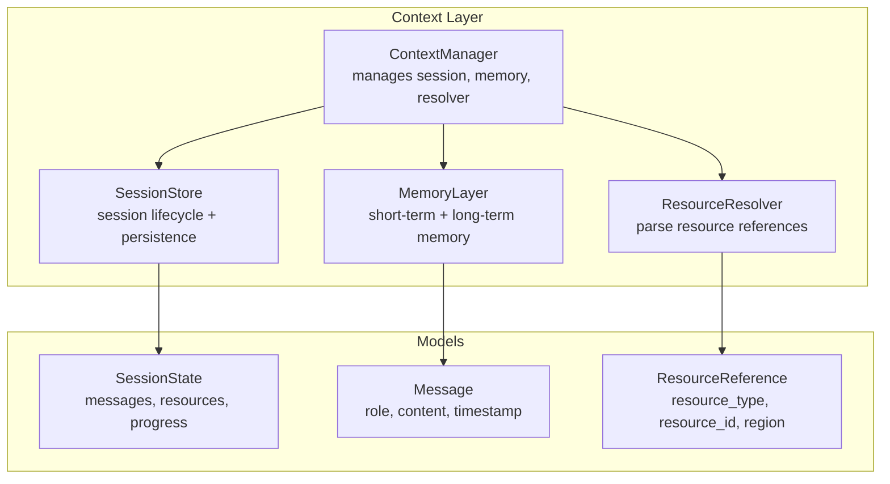
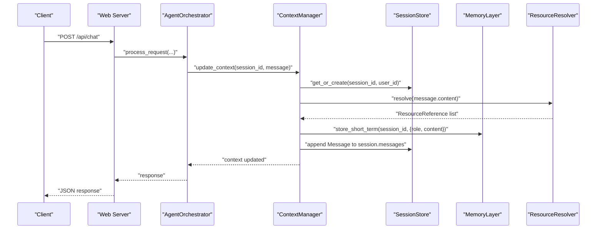
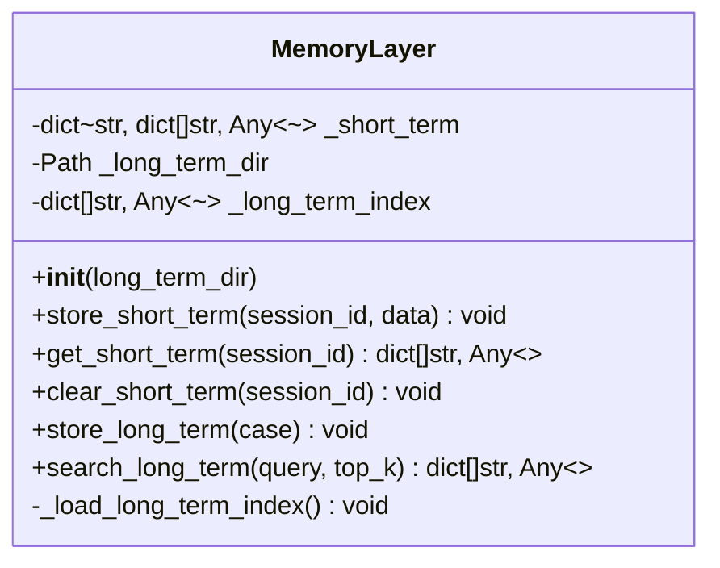
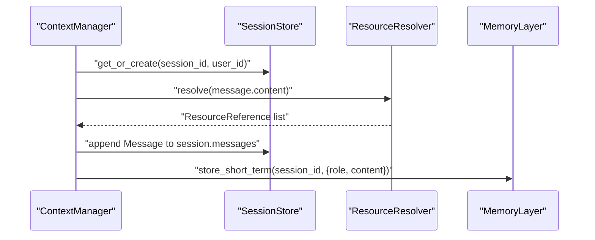
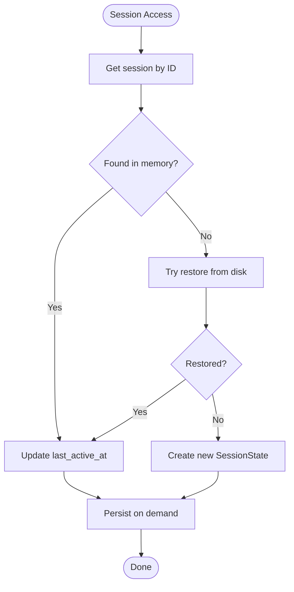
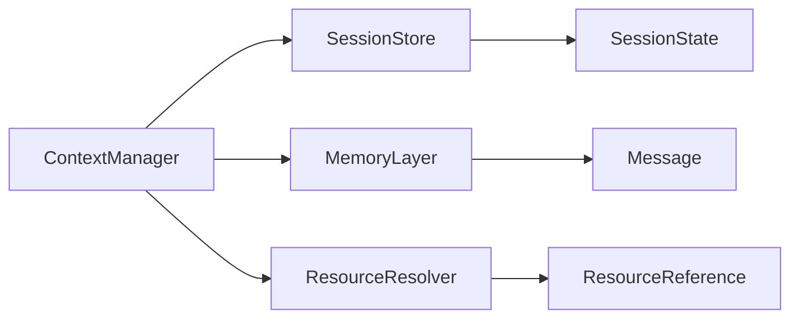

# Memory System

<cite>
**Referenced Files in This Document**
- [memory.py](file://src/aiops_agent/context/memory.py)
- [manager.py](file://src/aiops_agent/context/manager.py)
- [session.py](file://src/aiops_agent/context/session.py)
- [schemas.py](file://src/aiops_agent/models/schemas.py)
- [resource_resolver.py](file://src/aiops_agent/context/resource_resolver.py)
- [test_memory.py](file://tests/test_memory.py)
- [main.py](file://src/aiops_agent/main.py)
- [server.py](file://src/aiops_agent/web/server.py)
</cite>

## Table of Contents
1. [Introduction](#introduction)
2. [Project Structure](#project-structure)
3. [Core Components](#core-components)
4. [Architecture Overview](#architecture-overview)
5. [Detailed Component Analysis](#detailed-component-analysis)
6. [Dependency Analysis](#dependency-analysis)
7. [Performance Considerations](#performance-considerations)
8. [Troubleshooting Guide](#troubleshooting-guide)
9. [Conclusion](#conclusion)

## Introduction
This document describes the MemoryLayer system responsible for data persistence and retrieval mechanisms in the AIOps Agent. It explains the architecture of short-term and long-term memory storage strategies, documents the store_short_term method and its integration with the ContextManager, details memory data structures and serialization mechanisms, and outlines storage backends. It also covers examples of memory operations, data lifecycle management, performance considerations, cleanup policies, storage limits, and the relationship between memory persistence and session lifecycle. Finally, it explains how the memory layer maintains conversation history and resource references across user interactions.

## Project Structure
The memory system resides under the context package and integrates with session management, resource resolution, and the orchestrator. The main entry initializes the ContextManager with a MemoryLayer, enabling persistent and transient memory across user sessions.

**Diagram sources**
- [manager.py:25-44](file://src/aiops_agent/context/manager.py#L25-L44)
- [memory.py:20-41](file://src/aiops_agent/context/memory.py#L20-L41)
- [session.py:19-37](file://src/aiops_agent/context/session.py#L19-L37)
- [schemas.py:264-276](file://src/aiops_agent/models/schemas.py#L264-L276)
- [schemas.py:64-71](file://src/aiops_agent/models/schemas.py#L64-L71)
- [schemas.py:246-253](file://src/aiops_agent/models/schemas.py#L246-L253)

**Section sources**
- [main.py:203-207](file://src/aiops_agent/main.py#L203-L207)
- [manager.py:25-44](file://src/aiops_agent/context/manager.py#L25-L44)

## Core Components
- MemoryLayer: Implements short-term memory (in-memory per session) and long-term memory (persistent JSON files). Provides store_short_term, get_short_term, clear_short_term, store_long_term, search_long_term, and internal index loading.
- ContextManager: Integrates SessionStore, MemoryLayer, and ResourceResolver. Updates context, manages modes, tracks task progress, and persists sessions.
- SessionStore: Manages session lifecycle, TTL-based idle detection, and file-based persistence/restore of SessionState.
- ResourceResolver: Parses resource references from conversation text and attaches them to the session.
- Models: Define Message, SessionState, ResourceReference, and TaskProgress used across the memory system.

**Section sources**
- [memory.py:20-149](file://src/aiops_agent/context/memory.py#L20-L149)
- [manager.py:25-193](file://src/aiops_agent/context/manager.py#L25-L193)
- [session.py:19-131](file://src/aiops_agent/context/session.py#L19-L131)
- [schemas.py:64-71](file://src/aiops_agent/models/schemas.py#L64-L71)
- [schemas.py:264-276](file://src/aiops_agent/models/schemas.py#L264-L276)
- [schemas.py:246-253](file://src/aiops_agent/models/schemas.py#L246-L253)

## Architecture Overview
The MemoryLayer sits within the ContextManager, which coordinates session state updates, resource parsing, and memory operations. Short-term memory is appended to during each interaction; long-term memory stores structured cases for historical knowledge. Sessions are persisted periodically and upon idle timeouts.

**Diagram sources**
- [server.py:44-82](file://src/aiops_agent/web/server.py#L44-L82)
- [manager.py:58-88](file://src/aiops_agent/context/manager.py#L58-L88)
- [memory.py:46-63](file://src/aiops_agent/context/memory.py#L46-L63)
- [session.py:38-72](file://src/aiops_agent/context/session.py#L38-L72)
- [resource_resolver.py:44-71](file://src/aiops_agent/context/resource_resolver.py#L44-L71)

## Detailed Component Analysis

### MemoryLayer
- Short-term memory: In-memory dictionary keyed by session_id, storing lists of message-like dictionaries. Methods include store_short_term, get_short_term, and clear_short_term.
- Long-term memory: Persistent JSON files under a configurable directory. Index maintained in memory for search. Methods include store_long_term and search_long_term.
- Initialization: Creates long-term directory and loads existing JSON files into the in-memory index.
- Error handling: Writes catch OS errors and logs failures; search is keyword-based with scoring.

**Diagram sources**
- [memory.py:20-149](file://src/aiops_agent/context/memory.py#L20-L149)

**Section sources**
- [memory.py:27-41](file://src/aiops_agent/context/memory.py#L27-L41)
- [memory.py:46-63](file://src/aiops_agent/context/memory.py#L46-L63)
- [memory.py:69-92](file://src/aiops_agent/context/memory.py#L69-L92)
- [memory.py:93-135](file://src/aiops_agent/context/memory.py#L93-L135)
- [memory.py:141-149](file://src/aiops_agent/context/memory.py#L141-L149)

### ContextManager Integration
- update_context: Retrieves session, resolves resource references, appends Message to session.history, and stores a short-term memory entry with role/content.
- Mode switching: Preserves context across CHAT/TASK/WATCH modes, initializing or clearing task progress accordingly.
- Persistence: Delegates session persistence and idle session checks to SessionStore.

**Diagram sources**
- [manager.py:58-88](file://src/aiops_agent/context/manager.py#L58-L88)
- [resource_resolver.py:44-71](file://src/aiops_agent/context/resource_resolver.py#L44-L71)
- [memory.py:46-63](file://src/aiops_agent/context/memory.py#L46-L63)

**Section sources**
- [manager.py:58-88](file://src/aiops_agent/context/manager.py#L58-L88)
- [manager.py:94-121](file://src/aiops_agent/context/manager.py#L94-L121)
- [manager.py:174-180](file://src/aiops_agent/context/manager.py#L174-L180)

### SessionStore Lifecycle
- Creation and retrieval: Creates SessionState with timestamps and TTL; retrieves from memory or restores from JSON file.
- Persistence: Serializes SessionState to JSON and writes to disk; handles OS errors gracefully.
- Idle detection: Periodically checks sessions against TTL and persists idle ones, removing them from memory.

**Diagram sources**
- [session.py:53-72](file://src/aiops_agent/context/session.py#L53-L72)
- [session.py:74-90](file://src/aiops_agent/context/session.py#L74-L90)
- [session.py:98-115](file://src/aiops_agent/context/session.py#L98-L115)
- [session.py:117-130](file://src/aiops_agent/context/session.py#L117-L130)

**Section sources**
- [session.py:38-72](file://src/aiops_agent/context/session.py#L38-L72)
- [session.py:74-90](file://src/aiops_agent/context/session.py#L74-L90)
- [session.py:98-115](file://src/aiops_agent/context/session.py#L98-L115)
- [session.py:117-130](file://src/aiops_agent/context/session.py#L117-L130)

### ResourceResolver
- Parses resource references from text using predefined patterns for ECS, RDS, VPC, SLB, EIP, SG, Disk, Snapshot, Image, and OSS URIs.
- Produces ResourceReference objects with resource_type, resource_id, and region, deduplicating matches.

**Section sources**
- [resource_resolver.py:18-30](file://src/aiops_agent/context/resource_resolver.py#L18-L30)
- [resource_resolver.py:44-71](file://src/aiops_agent/context/resource_resolver.py#L44-L71)

### Data Structures and Serialization
- Message: role, content, timestamp, metadata.
- SessionState: session_id, user_id, mode, messages, resources, task_progress, timestamps, ttl_minutes.
- ResourceReference: resource_type, resource_id, region, display_name.
- TaskProgress: percentage, current_step, total_steps, completed_steps.
- MemoryLayer serializes long-term cases as JSON files with stored_at timestamp and loads them into an in-memory index.

**Section sources**
- [schemas.py:64-71](file://src/aiops_agent/models/schemas.py#L64-L71)
- [schemas.py:264-276](file://src/aiops_agent/models/schemas.py#L264-L276)
- [schemas.py:246-253](file://src/aiops_agent/models/schemas.py#L246-L253)
- [memory.py:75-91](file://src/aiops_agent/context/memory.py#L75-L91)
- [memory.py:141-149](file://src/aiops_agent/context/memory.py#L141-L149)

### Memory Operations and Examples
- Store short-term memory: Called by ContextManager.update_context to retain recent conversation turns.
- Retrieve short-term memory: Used to build context for LLM prompts.
- Clear short-term memory: Performed when a session is cleared or reset.
- Store long-term memory: Persists structured failure cases with metadata and timestamps.
- Search long-term memory: Keyword-based scoring across title, description, and tags; returns top_k results.
- Load long-term index: On initialization, reads all JSON files and ignores malformed entries.

**Section sources**
- [manager.py:78-82](file://src/aiops_agent/context/manager.py#L78-L82)
- [memory.py:46-63](file://src/aiops_agent/context/memory.py#L46-L63)
- [memory.py:69-92](file://src/aiops_agent/context/memory.py#L69-L92)
- [memory.py:93-135](file://src/aiops_agent/context/memory.py#L93-L135)
- [memory.py:141-149](file://src/aiops_agent/context/memory.py#L141-L149)
- [test_memory.py:34-78](file://tests/test_memory.py#L34-L78)
- [test_memory.py:89-128](file://tests/test_memory.py#L89-L128)
- [test_memory.py:187-274](file://tests/test_memory.py#L187-L274)

## Dependency Analysis
- ContextManager depends on SessionStore, MemoryLayer, and ResourceResolver.
- MemoryLayer depends on models.Message and uses JSON serialization.
- SessionStore depends on models.SessionState and performs file I/O.
- ResourceResolver depends on models.ResourceReference and regex patterns.

**Diagram sources**
- [manager.py:12-44](file://src/aiops_agent/context/manager.py#L12-L44)
- [memory.py:15](file://src/aiops_agent/context/memory.py#L15)
- [session.py:14](file://src/aiops_agent/context/session.py#L14)
- [resource_resolver.py:13](file://src/aiops_agent/context/resource_resolver.py#L13)

**Section sources**
- [manager.py:12-44](file://src/aiops_agent/context/manager.py#L12-L44)
- [memory.py:15](file://src/aiops_agent/context/memory.py#L15)
- [session.py:14](file://src/aiops_agent/context/session.py#L14)
- [resource_resolver.py:13](file://src/aiops_agent/context/resource_resolver.py#L13)

## Performance Considerations
- Short-term memory: In-memory list append is O(1); retrieval is O(n) for the list length. No eviction policy is implemented; consider adding size/time-based limits if sessions grow large.
- Long-term memory: JSON file I/O is synchronous; consider asynchronous IO for high-throughput scenarios. Index scanning is O(k) per search where k is number of stored cases; consider vector indexing for semantic similarity at scale.
- Search scoring: Linear scan with keyword matching; complexity O(k * m) where m is average tokens per field. For production, integrate vector embeddings and a vector database.
- Persistence: Writing JSON files on each update can be expensive; batch or throttle writes, or persist periodically via SessionStore.check_idle_sessions.

[No sources needed since this section provides general guidance]

## Troubleshooting Guide
- Long-term store failures: OS errors during file write are caught and logged; ensure the long-term directory is writable and has sufficient space.
- Malformed JSON files: During index load, malformed entries are skipped with warnings; verify JSON validity and encoding.
- Empty search results: Keyword-based search may return empty results if no matches; adjust query terms or expand tags.
- Session persistence errors: OS errors during persist/remove are logged; verify filesystem permissions and disk availability.
- Idle session cleanup: Sessions exceeding TTL are persisted and removed from memory; confirm TTL configuration and scheduling.

**Section sources**
- [memory.py:80-87](file://src/aiops_agent/context/memory.py#L80-L87)
- [memory.py:147-149](file://src/aiops_agent/context/memory.py#L147-L149)
- [session.py:87-89](file://src/aiops_agent/context/session.py#L87-L89)
- [session.py:113](file://src/aiops_agent/context/session.py#L113)

## Conclusion
The MemoryLayer provides a pragmatic dual-memory architecture: short-term memory for current session context and long-term memory for persistent knowledge. Its integration with ContextManager ensures conversation history and resource references are maintained across interactions. While the current implementation uses simple in-memory and file-based persistence, it offers a clear foundation for scaling with asynchronous IO, vector indexing, and session lifecycle policies tailored to operational workloads.