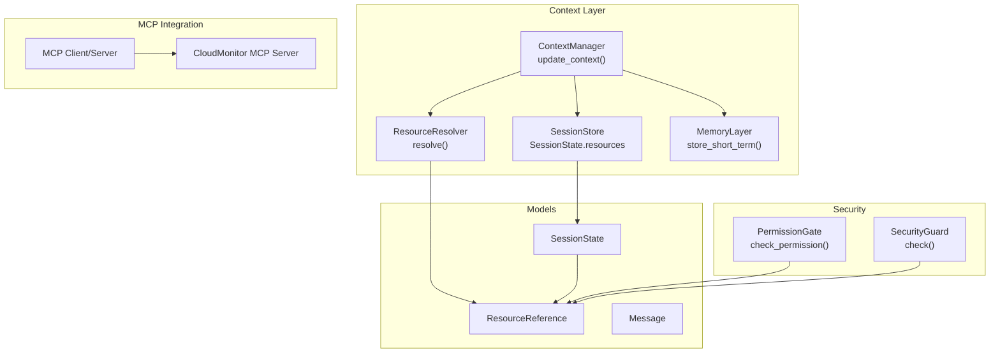
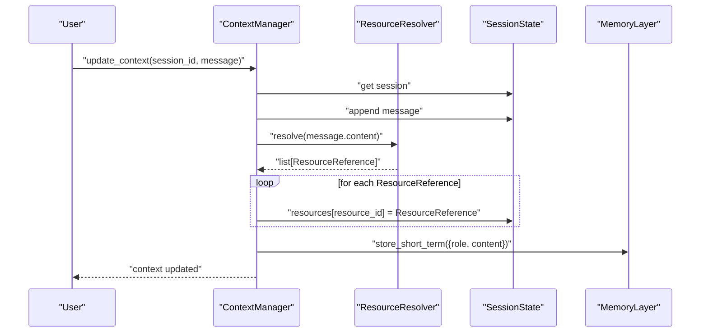
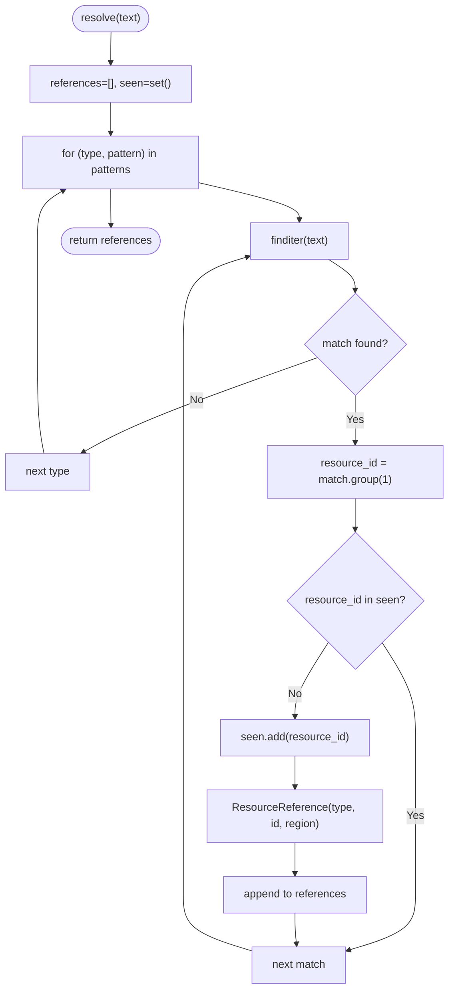
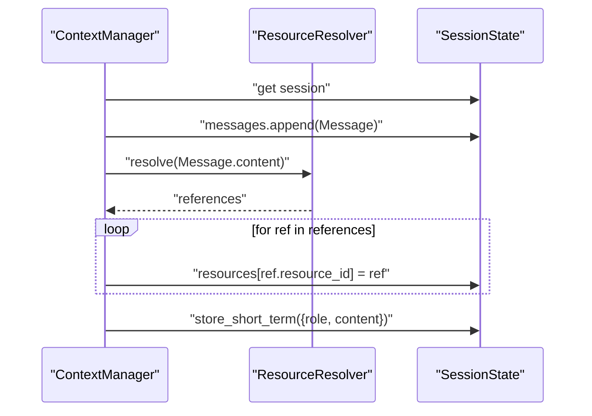
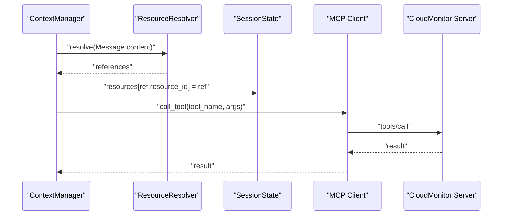
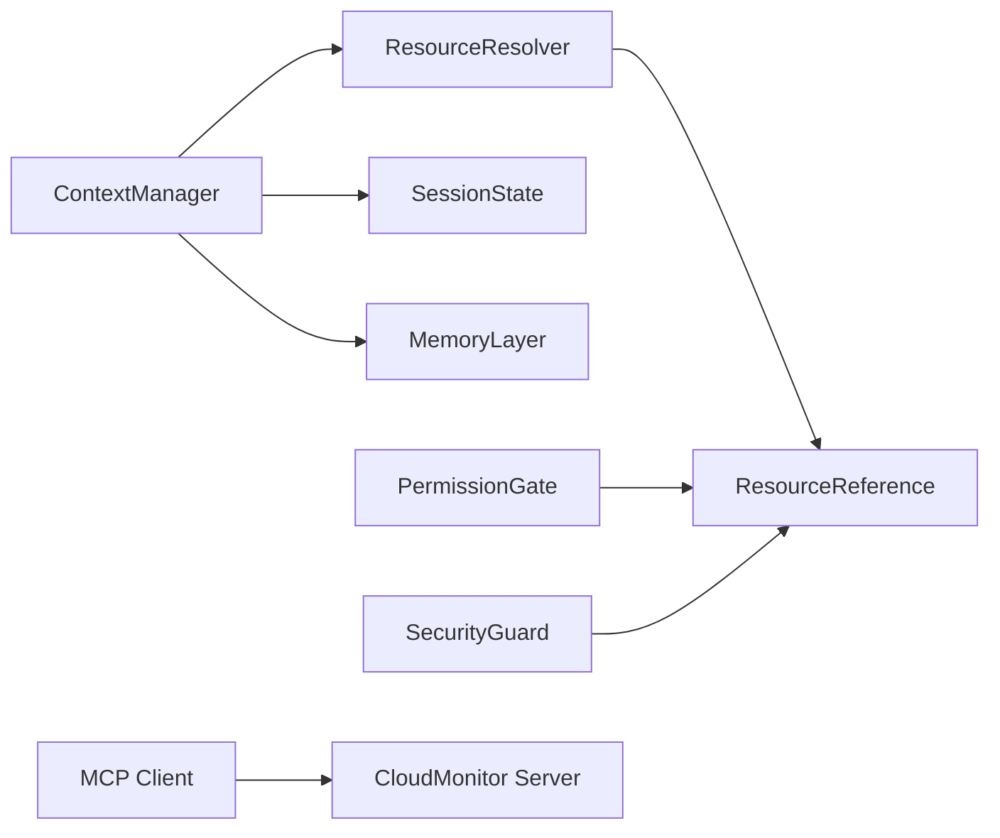

# Resource Resolution

<cite>
**Referenced Files in This Document**
- [resource_resolver.py](file://src/aiops_agent/context/resource_resolver.py)
- [manager.py](file://src/aiops_agent/context/manager.py)
- [schemas.py](file://src/aiops_agent/models/schemas.py)
- [session.py](file://src/aiops_agent/context/session.py)
- [memory.py](file://src/aiops_agent/context/memory.py)
- [test_resource_resolver.py](file://tests/test_resource_resolver.py)
- [test_context_manager.py](file://tests/test_context_manager.py)
- [permission_gate.py](file://src/aiops_agent/security/permission_gate.py)
- [security_guard.py](file://src/aiops_agent/security/security_guard.py)
- [cloud_monitor.py](file://mcp_servers/cloud_monitor.py)
- [base.py](file://mcp_servers/base.py)
</cite>

## Table of Contents
1. [Introduction](#introduction)
2. [Project Structure](#project-structure)
3. [Core Components](#core-components)
4. [Architecture Overview](#architecture-overview)
5. [Detailed Component Analysis](#detailed-component-analysis)
6. [Dependency Analysis](#dependency-analysis)
7. [Performance Considerations](#performance-considerations)
8. [Troubleshooting Guide](#troubleshooting-guide)
9. [Conclusion](#conclusion)

## Introduction
This document explains the ResourceResolver system that automatically parses and resolves resource references from user messages. It covers how the resolver identifies cloud resource identifiers, environment variables, and contextual identifiers; how it enriches references during session updates; and how it integrates with the broader context management and security subsystems. It also documents supported resource types, naming conventions, resolution strategies, error handling, and security considerations for resource access and validation.

## Project Structure
The ResourceResolver lives in the context module and integrates with session management, memory storage, and security controls. The following diagram shows the primary components involved in resource resolution and session resource dictionary enrichment.

**Diagram sources**
- [manager.py:58-88](file://src/aiops_agent/context/manager.py#L58-L88)
- [resource_resolver.py:44-71](file://src/aiops_agent/context/resource_resolver.py#L44-L71)
- [schemas.py:246-276](file://src/aiops_agent/models/schemas.py#L246-L276)
- [session.py:19-131](file://src/aiops_agent/context/session.py#L19-L131)
- [memory.py:46-64](file://src/aiops_agent/context/memory.py#L46-L64)
- [permission_gate.py:95-181](file://src/aiops_agent/security/permission_gate.py#L95-L181)
- [security_guard.py:64-122](file://src/aiops_agent/security/security_guard.py#L64-L122)
- [cloud_monitor.py:74-125](file://mcp_servers/cloud_monitor.py#L74-L125)

**Section sources**
- [resource_resolver.py:1-81](file://src/aiops_agent/context/resource_resolver.py#L1-L81)
- [manager.py:25-193](file://src/aiops_agent/context/manager.py#L25-L193)
- [schemas.py:246-276](file://src/aiops_agent/models/schemas.py#L246-L276)
- [session.py:19-131](file://src/aiops_agent/context/session.py#L19-L131)
- [memory.py:20-149](file://src/aiops_agent/context/memory.py#L20-L149)

## Core Components
- ResourceResolver: Extracts resource references from text using predefined patterns and creates ResourceReference objects with region and type.
- ContextManager: Integrates ResourceResolver into session updates, enriching SessionState.resources with discovered references.
- SessionState: Holds the session’s messages and a resources dictionary keyed by resource_id.
- ResourceReference: Data model representing a parsed resource with resource_type, resource_id, region, and optional display_name.
- Security subsystems: PermissionGate and SecurityGuard provide permission checks and safety rules around resource access and operations.

Key responsibilities:
- Pattern-based extraction of cloud resource identifiers from user messages.
- Deduplication of references within a single message.
- Enrichment of session resource dictionary for downstream tooling and security checks.
- Extensibility via custom regex patterns.

**Section sources**
- [resource_resolver.py:33-81](file://src/aiops_agent/context/resource_resolver.py#L33-L81)
- [manager.py:58-88](file://src/aiops_agent/context/manager.py#L58-L88)
- [schemas.py:246-276](file://src/aiops_agent/models/schemas.py#L246-L276)

## Architecture Overview
The ResourceResolver participates in the context update pipeline. When a user message arrives, ContextManager:
1. Retrieves or creates a session.
2. Appends the message to session.history.
3. Calls ResourceResolver.resolve(message.content) to extract references.
4. Adds each ResourceReference into session.resources keyed by resource_id.
5. Stores short-term memory for recall.

**Diagram sources**
- [manager.py:58-88](file://src/aiops_agent/context/manager.py#L58-L88)
- [resource_resolver.py:44-71](file://src/aiops_agent/context/resource_resolver.py#L44-L71)
- [schemas.py:264-276](file://src/aiops_agent/models/schemas.py#L264-L276)
- [memory.py:46-64](file://src/aiops_agent/context/memory.py#L46-L64)

## Detailed Component Analysis

### ResourceResolver
Purpose:
- Automatically parse user messages for cloud resource identifiers and produce ResourceReference objects.

Supported resource types and naming conventions:
- ECS instances: i-<alphanumeric>{12,17}
- RDS instances: rm-<alphanumeric>{12,17}
- VPC networks: vpc-<alphanumeric>{12,17}
- VSwitches: vsw-<alphanumeric>{12,17}
- SLB load balancers: lb-<alphanumeric>{12,17}
- EIP elastic IPs: eip-<alphanumeric>{12,17}
- Security groups: sg-<alphanumeric>{12,17}
- Disks: d-<alphanumeric>{12,17}
- Snapshots: s-<alphanumeric>{12,17}
- Images: m-<alphanumeric>{12,17}
- OSS buckets/objects: oss://bucket[/path]

Extraction algorithm:
- Iterates over a list of (type, compiled regex) pairs.
- Uses finditer to locate matches with word boundaries.
- Deduplicates by resource_id within the message.
- Creates ResourceReference with resource_type, resource_id, and default region.
- Logs debug entries for each matched reference.

Extensibility:
- add_pattern(resource_type, pattern) appends a new (type, regex) pair to the internal list.

**Diagram sources**
- [resource_resolver.py:44-71](file://src/aiops_agent/context/resource_resolver.py#L44-L71)

**Section sources**
- [resource_resolver.py:17-30](file://src/aiops_agent/context/resource_resolver.py#L17-L30)
- [resource_resolver.py:44-71](file://src/aiops_agent/context/resource_resolver.py#L44-L71)
- [resource_resolver.py:73-81](file://src/aiops_agent/context/resource_resolver.py#L73-L81)
- [test_resource_resolver.py:33-120](file://tests/test_resource_resolver.py#L33-L120)
- [test_resource_resolver.py:156-188](file://tests/test_resource_resolver.py#L156-L188)

### ContextManager Integration
Role:
- Orchestrates session lifecycle and context updates.
- Invokes ResourceResolver during update_context to enrich session.resources.

Behavior:
- Retrieves session, appends message, resolves references, stores short-term memory.
- Adds each ResourceReference into session.resources keyed by resource_id.

**Diagram sources**
- [manager.py:58-88](file://src/aiops_agent/context/manager.py#L58-L88)
- [schemas.py:264-276](file://src/aiops_agent/models/schemas.py#L264-L276)

**Section sources**
- [manager.py:58-88](file://src/aiops_agent/context/manager.py#L58-L88)
- [test_context_manager.py:46-64](file://tests/test_context_manager.py#L46-L64)

### Session Resource Dictionary
Structure:
- SessionState.resources is a dict[str, ResourceReference].
- Keys are resource_id strings; values are ResourceReference objects.
- Used to track discovered resources across a session and support downstream tooling and security checks.

Enrichment:
- During update_context, each resolved ResourceReference is inserted into session.resources keyed by resource_id.

**Section sources**
- [schemas.py:264-276](file://src/aiops_agent/models/schemas.py#L264-L276)
- [manager.py:74-76](file://src/aiops_agent/context/manager.py#L74-L76)

### Security Integration
- PermissionGate.check_permission validates whether an action is permitted against a resource_arn using Workload Identity permissions and resource ARN patterns. It classifies actions into permission levels and may require approval for write/admin operations.
- SecurityGuard.check enforces blacklist rules, rate limits, anomaly detection, and TLS enforcement for outbound communications.

These components operate alongside ResourceResolver to ensure that discovered resources are accessed only under validated permissions and safe operational conditions.

**Section sources**
- [permission_gate.py:95-181](file://src/aiops_agent/security/permission_gate.py#L95-L181)
- [security_guard.py:64-122](file://src/aiops_agent/security/security_guard.py#L64-L122)

### MCP Integration (Cloud Services)
- The MCP ecosystem enables tool discovery and invocation. The CloudMonitor MCP Server demonstrates how resolved resource references can be used to query metrics or alarms via cloud APIs.
- Tools are registered with input schemas and invoked through MCP Client/Server protocols.

**Diagram sources**
- [manager.py:58-88](file://src/aiops_agent/context/manager.py#L58-L88)
- [cloud_monitor.py:74-125](file://mcp_servers/cloud_monitor.py#L74-L125)
- [base.py:76-107](file://mcp_servers/base.py#L76-L107)

**Section sources**
- [cloud_monitor.py:17-72](file://mcp_servers/cloud_monitor.py#L17-L72)
- [base.py:14-108](file://mcp_servers/base.py#L14-L108)

## Dependency Analysis
- ResourceResolver depends on:
  - Compiled regex patterns for resource types.
  - ResourceReference model for output.
- ContextManager depends on:
  - ResourceResolver for parsing.
  - SessionStore for session persistence.
  - MemoryLayer for short-term memory.
- Security subsystems depend on:
  - ResourceReference and session resources to enforce permissions and safety rules.

**Diagram sources**
- [resource_resolver.py:13](file://src/aiops_agent/context/resource_resolver.py#L13)
- [schemas.py:246-253](file://src/aiops_agent/models/schemas.py#L246-L253)
- [manager.py:13-14](file://src/aiops_agent/context/manager.py#L13-L14)
- [permission_gate.py:16-20](file://src/aiops_agent/security/permission_gate.py#L16-L20)
- [security_guard.py:16-20](file://src/aiops_agent/security/security_guard.py#L16-L20)
- [cloud_monitor.py:9-10](file://mcp_servers/cloud_monitor.py#L9-L10)

**Section sources**
- [resource_resolver.py:13](file://src/aiops_agent/context/resource_resolver.py#L13)
- [manager.py:13-14](file://src/aiops_agent/context/manager.py#L13-L14)
- [schemas.py:246-253](file://src/aiops_agent/models/schemas.py#L246-L253)

## Performance Considerations
- Regex scanning complexity is linear in message length for each pattern; with a small fixed set of patterns, overall complexity remains O(n).
- Deduplication uses a set for O(1) average-time duplicate checks.
- Memory footprint is proportional to the number of unique references per message.
- Recommendations:
  - Keep patterns minimal and precise to reduce false positives.
  - Consider caching compiled regex objects if extending patterns frequently.
  - Avoid overly broad patterns that could increase match volume.

[No sources needed since this section provides general guidance]

## Troubleshooting Guide
Common issues and resolutions:
- No references extracted:
  - Verify the message contains valid resource IDs with correct prefixes and lengths.
  - Confirm word boundaries are respected; partial matches without boundaries are rejected.
- Duplicate references:
  - The resolver deduplicates by resource_id within a message; ensure the same ID appears only once if intentional.
- Invalid resource formats:
  - ECS/RDS/VPC/etc. IDs must match the documented patterns; special characters or wrong prefixes are ignored.
  - OSS URIs must follow oss://bucket[/path] format.
- Session resource dictionary not updated:
  - Ensure update_context is called and that the session exists.
  - Check that ContextManager is using the same ResourceResolver instance.

Validation and tests:
- Unit tests cover valid IDs, invalid formats, and deduplication behavior.
- Context manager tests verify that session.resources is populated after update_context.

**Section sources**
- [test_resource_resolver.py:33-120](file://tests/test_resource_resolver.py#L33-L120)
- [test_resource_resolver.py:156-188](file://tests/test_resource_resolver.py#L156-L188)
- [test_context_manager.py:46-64](file://tests/test_context_manager.py#L46-L64)

## Conclusion
The ResourceResolver provides robust, extensible parsing of cloud resource references from user messages, integrating seamlessly with session management and security controls. Its deterministic pattern matching, deduplication, and extensibility enable reliable resource enrichment for downstream tooling and safe, auditable operations. Combined with PermissionGate and SecurityGuard, it ensures that discovered resources are accessed only under validated permissions and safe operational conditions.