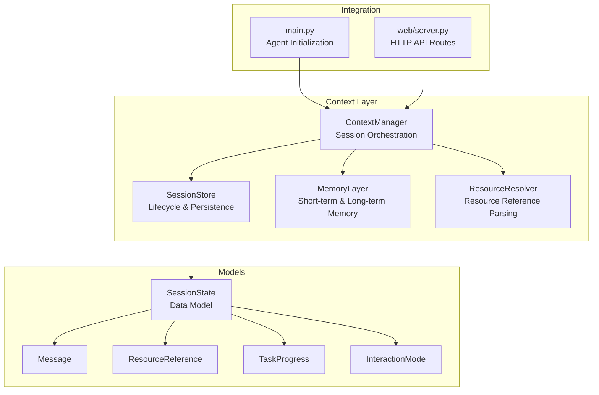
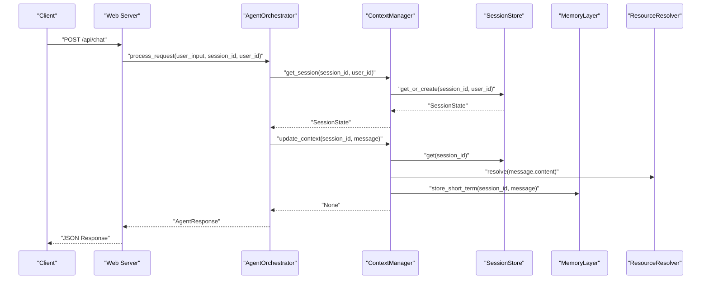
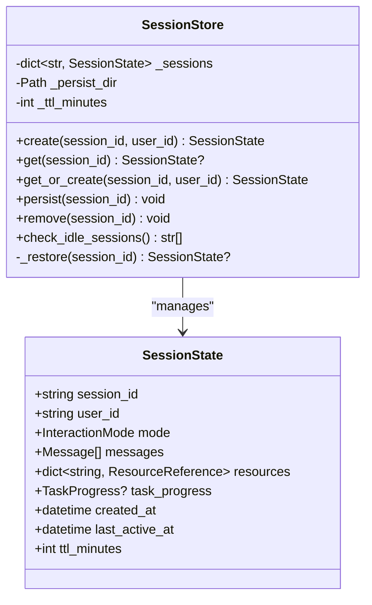
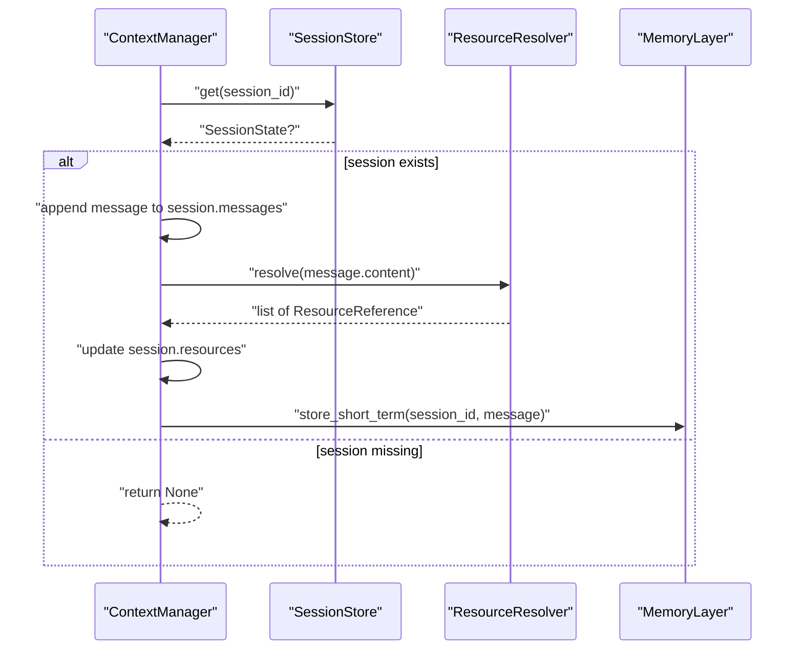
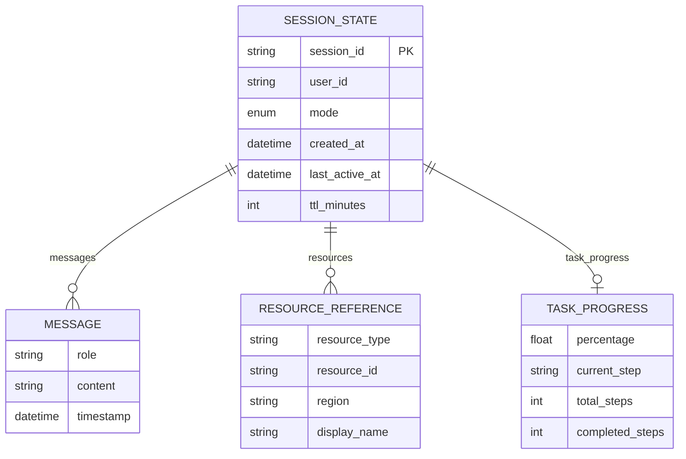
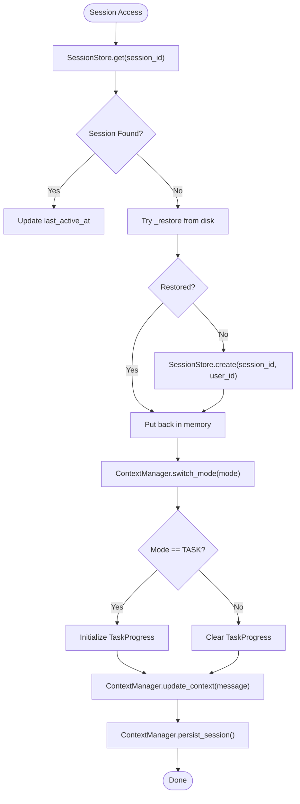
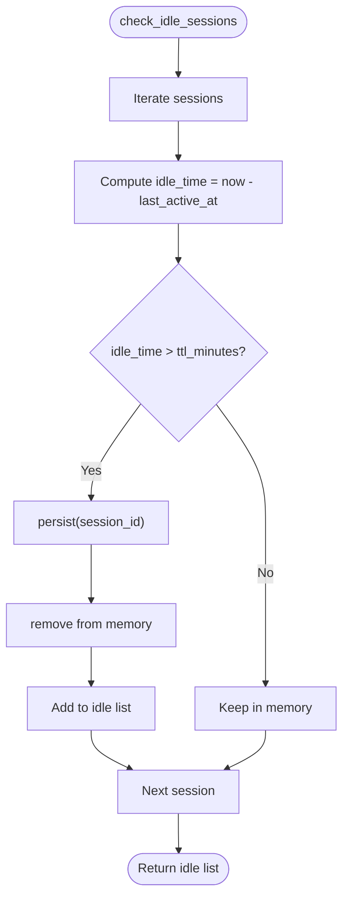
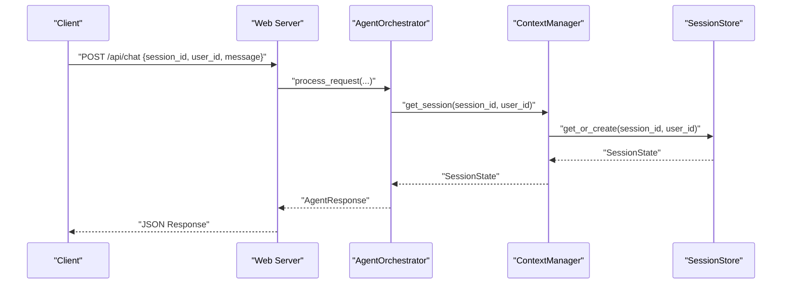
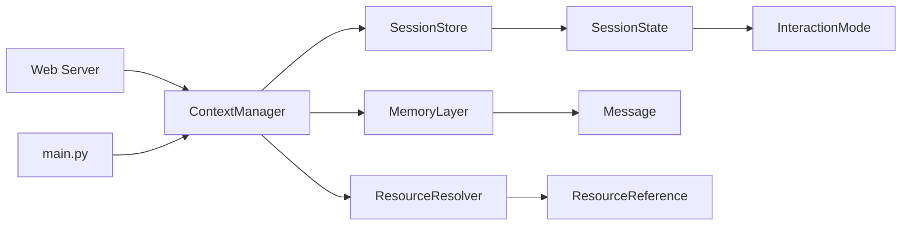

# Session Management

<cite>
**Referenced Files in This Document**
- [session.py](file://src/aiops_agent/context/session.py)
- [manager.py](file://src/aiops_agent/context/manager.py)
- [schemas.py](file://src/aiops_agent/models/schemas.py)
- [memory.py](file://src/aiops_agent/context/memory.py)
- [resource_resolver.py](file://src/aiops_agent/context/resource_resolver.py)
- [test_session.py](file://tests/test_session.py)
- [main.py](file://src/aiops_agent/main.py)
- [server.py](file://src/aiops_agent/web/server.py)
</cite>

## Table of Contents
1. [Introduction](#introduction)
2. [Project Structure](#project-structure)
3. [Core Components](#core-components)
4. [Architecture Overview](#architecture-overview)
5. [Detailed Component Analysis](#detailed-component-analysis)
6. [Dependency Analysis](#dependency-analysis)
7. [Performance Considerations](#performance-considerations)
8. [Troubleshooting Guide](#troubleshooting-guide)
9. [Conclusion](#conclusion)
10. [Appendices](#appendices)

## Introduction
This document provides comprehensive documentation for the SessionStore system that manages user-specific contexts and session lifecycle. It explains how sessions are created, retrieved, and managed with user identification, details the SessionState data structure including message history, interaction mode, resource dictionaries, and task progress tracking, and documents the get_or_create method for session initialization, persist_session for state persistence, and check_idle_sessions for cleanup operations. It also covers session timeout handling, memory management, and the relationship between sessions and user authentication, along with the session store's integration with the ContextManager and its role in maintaining conversational continuity.

## Project Structure
The session management system resides in the context package and integrates with the broader Agent architecture:
- SessionStore manages session lifecycle and persistence
- ContextManager orchestrates session access, context updates, mode switching, and task progress
- SessionState defines the persistent data model for conversations
- MemoryLayer provides short-term and long-term memory storage
- ResourceResolver extracts cloud resource references from messages
- Web server routes expose chat APIs that drive session creation and updates

**Diagram sources**
- [session.py:19-131](file://src/aiops_agent/context/session.py#L19-L131)
- [manager.py:25-193](file://src/aiops_agent/context/manager.py#L25-L193)
- [schemas.py:264-276](file://src/aiops_agent/models/schemas.py#L264-L276)
- [memory.py:20-149](file://src/aiops_agent/context/memory.py#L20-L149)
- [resource_resolver.py:33-81](file://src/aiops_agent/context/resource_resolver.py#L33-L81)
- [main.py:203-207](file://src/aiops_agent/main.py#L203-L207)
- [server.py:44-82](file://src/aiops_agent/web/server.py#L44-L82)

**Section sources**
- [session.py:19-131](file://src/aiops_agent/context/session.py#L19-L131)
- [manager.py:25-193](file://src/aiops_agent/context/manager.py#L25-L193)
- [schemas.py:264-276](file://src/aiops_agent/models/schemas.py#L264-L276)
- [memory.py:20-149](file://src/aiops_agent/context/memory.py#L20-L149)
- [resource_resolver.py:33-81](file://src/aiops_agent/context/resource_resolver.py#L33-L81)
- [main.py:203-207](file://src/aiops_agent/main.py#L203-L207)
- [server.py:44-82](file://src/aiops_agent/web/server.py#L44-L82)

## Core Components
- SessionStore: Manages session creation, retrieval, persistence, and idle cleanup with TTL-based eviction.
- ContextManager: Integrates SessionStore, MemoryLayer, and ResourceResolver to update context, switch modes, track task progress, and persist sessions.
- SessionState: Pydantic model representing the session’s persistent state including message history, resource references, task progress, timestamps, and TTL.
- MemoryLayer: Provides short-term memory (in-memory conversation history) and long-term memory (persistent historical cases).
- ResourceResolver: Extracts cloud resource identifiers from messages for contextual awareness.

Key responsibilities:
- SessionStore: create, get, get_or_create, persist, remove, check_idle_sessions, internal restore
- ContextManager: get_session, update_context, switch_mode, update_task_progress, persist_session, check_idle_sessions
- SessionState: fields for session_id, user_id, mode, messages, resources, task_progress, timestamps, ttl_minutes

**Section sources**
- [session.py:38-131](file://src/aiops_agent/context/session.py#L38-L131)
- [manager.py:50-180](file://src/aiops_agent/context/manager.py#L50-L180)
- [schemas.py:264-276](file://src/aiops_agent/models/schemas.py#L264-L276)
- [memory.py:46-64](file://src/aiops_agent/context/memory.py#L46-L64)
- [resource_resolver.py:44-71](file://src/aiops_agent/context/resource_resolver.py#L44-L71)

## Architecture Overview
The SessionStore sits at the core of the context management layer, providing a durable session state that persists across process restarts and supports idle-timeout cleanup. ContextManager coordinates session access and updates, while MemoryLayer and ResourceResolver enrich the session with conversation history and resource context.

**Diagram sources**
- [server.py:44-82](file://src/aiops_agent/web/server.py#L44-L82)
- [manager.py:50-88](file://src/aiops_agent/context/manager.py#L50-L88)
- [session.py:67-72](file://src/aiops_agent/context/session.py#L67-L72)
- [memory.py:46-55](file://src/aiops_agent/context/memory.py#L46-L55)
- [resource_resolver.py:44-71](file://src/aiops_agent/context/resource_resolver.py#L44-L71)

## Detailed Component Analysis

### SessionStore Analysis
SessionStore encapsulates session lifecycle management with:
- In-memory cache keyed by session_id
- Local JSON persistence under a configurable directory
- TTL-based idle detection and automatic eviction
- Robust error handling for file operations

Primary methods:
- create: Initializes a new SessionState with current timestamps and mode set to CHAT
- get: Retrieves from memory or restores from disk; updates last_active_at
- get_or_create: Convenience method combining get and create
- persist: Serializes SessionState to JSON and writes to disk
- remove: Evicts from memory and deletes persisted file
- check_idle_sessions: Iterates sessions, persists and removes those exceeding TTL
- _restore: Reads and deserializes persisted sessions

**Diagram sources**
- [session.py:19-131](file://src/aiops_agent/context/session.py#L19-L131)
- [schemas.py:264-276](file://src/aiops_agent/models/schemas.py#L264-L276)

**Section sources**
- [session.py:38-131](file://src/aiops_agent/context/session.py#L38-L131)
- [schemas.py:264-276](file://src/aiops_agent/models/schemas.py#L264-L276)

### ContextManager Analysis
ContextManager integrates session orchestration with memory and resource resolution:
- get_session: Delegates to SessionStore.get_or_create
- update_context: Appends message to session.history, resolves resource references, stores short-term memory
- switch_mode: Updates mode and initializes/clears task_progress accordingly
- update_task_progress: Sets TaskProgress when in TASK mode
- persist_session and check_idle_sessions: Proxies to SessionStore
- Exposes memory and resolver properties for downstream components

**Diagram sources**
- [manager.py:58-88](file://src/aiops_agent/context/manager.py#L58-L88)
- [resource_resolver.py:44-71](file://src/aiops_agent/context/resource_resolver.py#L44-L71)
- [memory.py:46-55](file://src/aiops_agent/context/memory.py#L46-L55)

**Section sources**
- [manager.py:50-180](file://src/aiops_agent/context/manager.py#L50-L180)
- [resource_resolver.py:44-71](file://src/aiops_agent/context/resource_resolver.py#L44-L71)
- [memory.py:46-64](file://src/aiops_agent/context/memory.py#L46-L64)

### SessionState Data Structure
SessionState is the central data model for session persistence:
- session_id: Unique identifier for the session
- user_id: Identifier for the user associated with the session
- mode: InteractionMode (CHAT, TASK, WATCH)
- messages: List of Message entries forming conversation history
- resources: Dictionary mapping resource_id to ResourceReference
- task_progress: Optional TaskProgress for task mode
- created_at, last_active_at: Timestamps for lifecycle tracking
- ttl_minutes: Idle timeout in minutes

**Diagram sources**
- [schemas.py:264-276](file://src/aiops_agent/models/schemas.py#L264-L276)
- [schemas.py:64-71](file://src/aiops_agent/models/schemas.py#L64-L71)
- [schemas.py:246-253](file://src/aiops_agent/models/schemas.py#L246-L253)
- [schemas.py:255-262](file://src/aiops_agent/models/schemas.py#L255-L262)

**Section sources**
- [schemas.py:264-276](file://src/aiops_agent/models/schemas.py#L264-L276)
- [schemas.py:64-71](file://src/aiops_agent/models/schemas.py#L64-L71)
- [schemas.py:246-253](file://src/aiops_agent/models/schemas.py#L246-L253)
- [schemas.py:255-262](file://src/aiops_agent/models/schemas.py#L255-L262)

### Session Creation Patterns and State Transitions
Patterns:
- Initial creation: SessionStore.create sets mode to CHAT and timestamps
- Retrieval and restoration: SessionStore.get loads from memory or disk and updates last_active_at
- Mode switching: ContextManager.switch_mode toggles between CHAT, TASK, WATCH and manages task_progress lifecycle
- Task progress: ContextManager.update_task_progress populates TaskProgress when in TASK mode
- Cleanup: ContextManager.check_idle_sessions delegates to SessionStore.check_idle_sessions

**Diagram sources**
- [session.py:53-72](file://src/aiops_agent/context/session.py#L53-L72)
- [session.py:117-131](file://src/aiops_agent/context/session.py#L117-L131)
- [manager.py:94-121](file://src/aiops_agent/context/manager.py#L94-L121)
- [manager.py:127-153](file://src/aiops_agent/context/manager.py#L127-L153)
- [manager.py:174-180](file://src/aiops_agent/context/manager.py#L174-L180)

**Section sources**
- [session.py:53-72](file://src/aiops_agent/context/session.py#L53-L72)
- [session.py:117-131](file://src/aiops_agent/context/session.py#L117-L131)
- [manager.py:94-121](file://src/aiops_agent/context/manager.py#L94-L121)
- [manager.py:127-153](file://src/aiops_agent/context/manager.py#L127-L153)
- [manager.py:174-180](file://src/aiops_agent/context/manager.py#L174-L180)

### Cleanup Workflows and Idle Detection
SessionStore.check_idle_sessions evaluates idle_time against ttl_minutes and:
- Persists idle sessions to disk
- Removes them from memory
- Returns the list of evicted session_ids

**Diagram sources**
- [session.py:98-115](file://src/aiops_agent/context/session.py#L98-L115)

**Section sources**
- [session.py:98-115](file://src/aiops_agent/context/session.py#L98-L115)

### Integration with Authentication and User Identity
- Web server routes accept user_id and session_id from clients and pass them to the orchestrator
- SessionStore.get_or_create accepts user_id to associate sessions with users
- The main application initializes ContextManager with SessionStore, MemoryLayer, and ResourceResolver
- While session_id is user-provided or auto-generated, user_id enables user-specific session management

**Diagram sources**
- [server.py:55-65](file://src/aiops_agent/web/server.py#L55-L65)
- [manager.py:50-52](file://src/aiops_agent/context/manager.py#L50-L52)
- [session.py:67-72](file://src/aiops_agent/context/session.py#L67-L72)
- [main.py:203-207](file://src/aiops_agent/main.py#L203-L207)

**Section sources**
- [server.py:55-65](file://src/aiops_agent/web/server.py#L55-L65)
- [manager.py:50-52](file://src/aiops_agent/context/manager.py#L50-L52)
- [session.py:67-72](file://src/aiops_agent/context/session.py#L67-L72)
- [main.py:203-207](file://src/aiops_agent/main.py#L203-L207)

## Dependency Analysis
- SessionStore depends on SessionState and InteractionMode
- ContextManager depends on SessionStore, MemoryLayer, and ResourceResolver
- MemoryLayer depends on Message and provides short-term and long-term memory
- ResourceResolver depends on ResourceReference
- Web server depends on AgentOrchestrator and ContextManager
- main.py constructs ContextManager with SessionStore, MemoryLayer, and ResourceResolver

**Diagram sources**
- [session.py:14](file://src/aiops_agent/context/session.py#L14)
- [manager.py:12-20](file://src/aiops_agent/context/manager.py#L12-L20)
- [memory.py:15](file://src/aiops_agent/context/memory.py#L15)
- [resource_resolver.py:13](file://src/aiops_agent/context/resource_resolver.py#L13)
- [server.py:17-18](file://src/aiops_agent/web/server.py#L17-L18)
- [main.py:203-207](file://src/aiops_agent/main.py#L203-L207)

**Section sources**
- [session.py:14](file://src/aiops_agent/context/session.py#L14)
- [manager.py:12-20](file://src/aiops_agent/context/manager.py#L12-L20)
- [memory.py:15](file://src/aiops_agent/context/memory.py#L15)
- [resource_resolver.py:13](file://src/aiops_agent/context/resource_resolver.py#L13)
- [server.py:17-18](file://src/aiops_agent/web/server.py#L17-L18)
- [main.py:203-207](file://src/aiops_agent/main.py#L203-L207)

## Performance Considerations
- Memory footprint: Sessions are held in-memory; consider TTL and periodic cleanup to prevent unbounded growth
- Disk I/O: Persist operations serialize SessionState; batch operations or reduce frequency for high-throughput scenarios
- Idle detection: check_idle_sessions iterates all sessions; monitor performance impact in large deployments
- Serialization: model_dump(mode="json") ensures enum serialization; keep message sizes reasonable to minimize I/O overhead

[No sources needed since this section provides general guidance]

## Troubleshooting Guide
Common issues and resolutions:
- Session not found: Ensure session_id is passed correctly; SessionStore.get returns None if not present
- Persistence failures: SessionStore.persist catches OSError; verify write permissions and disk availability
- Corrupted persistence: SessionStore._restore handles JSON decode and validation errors gracefully
- Idle eviction: Sessions exceeding TTL are persisted and removed; confirm TTL settings and activity patterns
- Mode switching anomalies: ContextManager.switch_mode initializes/clears task_progress; verify mode transitions

Validation references:
- Session creation and timestamps
- Retrieval and restoration behavior
- Persistence serialization correctness
- Idle detection thresholds and eviction
- Internal restore error handling

**Section sources**
- [test_session.py:41-68](file://tests/test_session.py#L41-L68)
- [test_session.py:79-132](file://tests/test_session.py#L79-L132)
- [test_session.py:178-214](file://tests/test_session.py#L178-L214)
- [test_session.py:269-354](file://tests/test_session.py#L269-L354)
- [test_session.py:382-407](file://tests/test_session.py#L382-L407)
- [session.py:81-89](file://src/aiops_agent/context/session.py#L81-L89)
- [session.py:123-130](file://src/aiops_agent/context/session.py#L123-L130)

## Conclusion
The SessionStore system provides robust session lifecycle management with user association, conversation continuity, and durable persistence. Combined with ContextManager, MemoryLayer, and ResourceResolver, it enables interactive modes, task progress tracking, and efficient cleanup through idle detection. Proper configuration of TTL and persistence directories, along with careful handling of user_id and session_id, ensures reliable session handling across user interactions.

[No sources needed since this section summarizes without analyzing specific files]

## Appendices

### API and Method Reference
- SessionStore
  - create(session_id, user_id): Creates a new session with mode CHAT and current timestamps
  - get(session_id): Retrieves session from memory or disk; updates last_active_at
  - get_or_create(session_id, user_id): Returns existing or newly created session
  - persist(session_id): Writes session state to JSON file
  - remove(session_id): Removes from memory and deletes persisted file
  - check_idle_sessions(): Returns list of evicted session ids after persisting and removing idle sessions
  - _restore(session_id): Internal method to load session from disk

- ContextManager
  - get_session(session_id, user_id): Delegates to SessionStore.get_or_create
  - update_context(session_id, message): Appends message, resolves resources, stores short-term memory
  - switch_mode(session_id, mode): Updates mode and manages task_progress
  - update_task_progress(session_id, percentage, current_step, total_steps, completed_steps): Sets TaskProgress
  - persist_session(session_id): Delegates to SessionStore.persist
  - check_idle_sessions(): Delegates to SessionStore.check_idle_sessions

**Section sources**
- [session.py:38-131](file://src/aiops_agent/context/session.py#L38-L131)
- [manager.py:50-180](file://src/aiops_agent/context/manager.py#L50-L180)