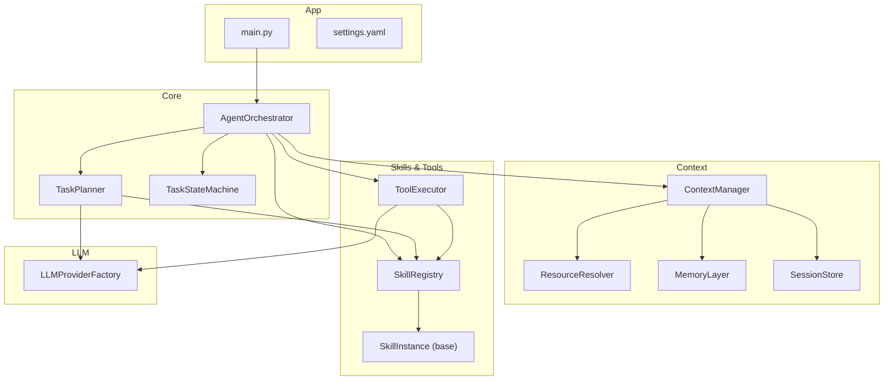
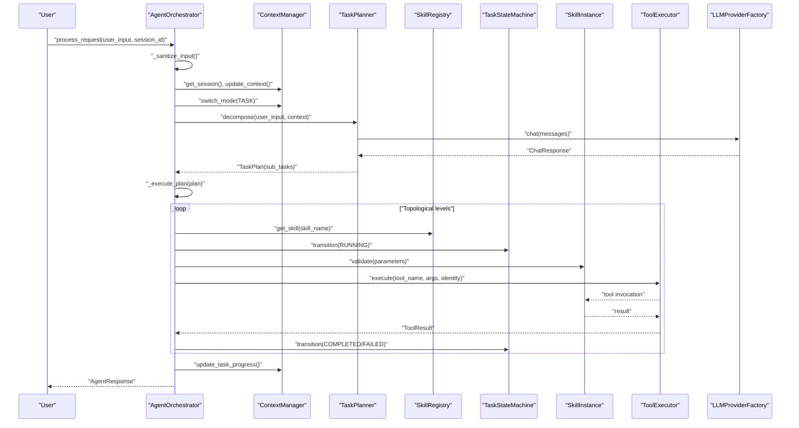
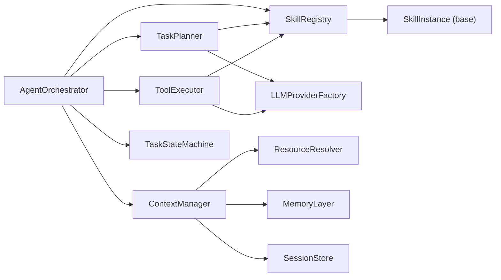

# Core Components

<cite>
**Referenced Files in This Document**
- [orchestrator.py](file://src/aiops_agent/core/orchestrator.py)
- [task_planner.py](file://src/aiops_agent/core/task_planner.py)
- [state_machine.py](file://src/aiops_agent/core/state_machine.py)
- [manager.py](file://src/aiops_agent/context/manager.py)
- [resource_resolver.py](file://src/aiops_agent/context/resource_resolver.py)
- [schemas.py](file://src/aiops_agent/models/schemas.py)
- [registry.py](file://src/aiops_agent/skills/registry.py)
- [executor.py](file://src/aiops_agent/tools/executor.py)
- [provider.py](file://src/aiops_agent/llm/provider.py)
- [session.py](file://src/aiops_agent/context/session.py)
- [memory.py](file://src/aiops_agent/context/memory.py)
- [base.py](file://src/aiops_agent/skills/base.py)
- [main.py](file://src/aiops_agent/main.py)
- [settings.yaml](file://config/settings.yaml)
</cite>

## Table of Contents
1. [Introduction](#introduction)
2. [Project Structure](#project-structure)
3. [Core Components](#core-components)
4. [Architecture Overview](#architecture-overview)
5. [Detailed Component Analysis](#detailed-component-analysis)
6. [Dependency Analysis](#dependency-analysis)
7. [Performance Considerations](#performance-considerations)
8. [Troubleshooting Guide](#troubleshooting-guide)
9. [Conclusion](#conclusion)
10. [Appendices](#appendices)

## Introduction
This document explains the core components of the AIOps Agent and how they collaborate to transform natural language requests into orchestrated, executable tasks. It focuses on:
- Agent Orchestrator: request intake, task decomposition, DAG execution, failure handling, and streaming responses
- Task Planner: LLM-powered planning and executable task graph generation
- State Machine: lifecycle state transitions for individual tasks
- Context Manager: multi-turn conversation handling, resource resolution, and progress tracking
It also documents configuration options, usage patterns, and concrete examples from the codebase.

## Project Structure
The AIOps Agent is organized around a modular core with clear separation of concerns:
- Core orchestration and state management
- Planning and execution pipeline
- Context and memory management
- Skills and tool execution
- LLM abstraction and provider selection
- Observability and security integrations

**Diagram sources**
- [main.py:70-222](file://src/aiops_agent/main.py#L70-L222)
- [orchestrator.py:47-198](file://src/aiops_agent/core/orchestrator.py#L47-L198)
- [task_planner.py:32-113](file://src/aiops_agent/core/task_planner.py#L32-L113)
- [state_machine.py:26-92](file://src/aiops_agent/core/state_machine.py#L26-L92)
- [manager.py:25-193](file://src/aiops_agent/context/manager.py#L25-L193)
- [resource_resolver.py:33-81](file://src/aiops_agent/context/resource_resolver.py#L33-L81)
- [memory.py:20-149](file://src/aiops_agent/context/memory.py#L20-L149)
- [session.py:19-131](file://src/aiops_agent/context/session.py#L19-L131)
- [registry.py:19-284](file://src/aiops_agent/skills/registry.py#L19-L284)
- [executor.py:45-314](file://src/aiops_agent/tools/executor.py#L45-L314)
- [provider.py:97-242](file://src/aiops_agent/llm/provider.py#L97-L242)
- [settings.yaml:1-85](file://config/settings.yaml#L1-L85)

**Section sources**
- [main.py:70-222](file://src/aiops_agent/main.py#L70-L222)
- [settings.yaml:1-85](file://config/settings.yaml#L1-L85)

## Core Components
This section introduces the five pillars of the system and their responsibilities.

- Agent Orchestrator
  - Receives user requests, sanitizes input, updates context, switches to task mode, delegates decomposition to TaskPlanner, executes tasks in DAG order, handles failures, and returns structured responses. It supports both synchronous and streaming execution with progress events and optional LLM synthesis summaries.
  - Key behaviors: input safety checks, context switching, DAG execution with concurrency limits, health monitoring for skills, and telemetry.

- Task Planner
  - Uses an LLM to decompose natural language into executable sub-tasks with explicit dependencies. It validates skill mappings and constructs a TaskPlan with a DAG topology suitable for parallel execution.

- State Machine
  - Enforces legal state transitions for individual tasks (PENDING → RUNNING → COMPLETED/FAILED/CANCELLED) and triggers callbacks on transitions.

- Context Manager
  - Manages multi-turn conversations, resolves resource references from text, tracks task progress during execution, and persists sessions. It supports three interaction modes: chat, task, and watch.

- Tool Executor
  - Provides unified tool execution with permission gating, credential acquisition, MCP/local tool dispatch, retry/backoff, sanitization, auditing, and tracing.

**Section sources**
- [orchestrator.py:47-198](file://src/aiops_agent/core/orchestrator.py#L47-L198)
- [task_planner.py:32-113](file://src/aiops_agent/core/task_planner.py#L32-L113)
- [state_machine.py:26-92](file://src/aiops_agent/core/state_machine.py#L26-L92)
- [manager.py:25-193](file://src/aiops_agent/context/manager.py#L25-L193)
- [executor.py:45-314](file://src/aiops_agent/tools/executor.py#L45-L314)

## Architecture Overview
The orchestrator coordinates the end-to-end flow: input enters, is contextualized, decomposed into a DAG, executed against skills, and summarized. Observability and security are integrated throughout.

**Diagram sources**
- [orchestrator.py:84-198](file://src/aiops_agent/core/orchestrator.py#L84-L198)
- [task_planner.py:50-113](file://src/aiops_agent/core/task_planner.py#L50-L113)
- [state_machine.py:51-82](file://src/aiops_agent/core/state_machine.py#L51-L82)
- [registry.py:159-181](file://src/aiops_agent/skills/registry.py#L159-L181)
- [executor.py:80-226](file://src/aiops_agent/tools/executor.py#L80-L226)
- [provider.py:147-175](file://src/aiops_agent/llm/provider.py#L147-L175)

## Detailed Component Analysis

### Agent Orchestrator
Responsibilities:
- Request intake and sanitization
- Context management and mode switching
- Task decomposition via TaskPlanner
- DAG execution with concurrency control
- Failure recording and skill health monitoring
- Structured responses and optional streaming synthesis

Key implementation highlights:
- Input sanitization detects empty input, length limits, and suspicious patterns to mitigate injection risks.
- Context switching toggles between chat and task modes, initializing progress tracking in task mode.
- DAG execution uses topological sorting to schedule levels of tasks and runs concurrent tasks within each level up to a configured limit.
- Health monitoring records skill failures and marks skills unhealthy after a threshold within a rolling window.
- Streaming support yields structured events for planning, task start/done, and errors, and optionally streams LLM synthesis tokens.

Usage patterns:
- Synchronous processing: [process_request:84-198](file://src/aiops_agent/core/orchestrator.py#L84-L198)
- Streaming processing: [process_request_stream:203-418](file://src/aiops_agent/core/orchestrator.py#L203-L418)
- DAG execution: [_execute_plan:424-483](file://src/aiops_agent/core/orchestrator.py#L424-L483)
- Route to skill: [_route_to_skill:485-532](file://src/aiops_agent/core/orchestrator.py#L485-L532)
- Build synthesis prompt: [_build_synthesis_prompt:537-569](file://src/aiops_agent/core/orchestrator.py#L537-L569)
- Record skill failure: [_record_skill_failure:571-596](file://src/aiops_agent/core/orchestrator.py#L571-L596)
- Sanitization: [_sanitize_input:601-646](file://src/aiops_agent/core/orchestrator.py#L601-L646)

Configuration options:
- Orchestrator-level settings (parallelism, thresholds) are defined in [settings.yaml:56-61](file://config/settings.yaml#L56-L61).

**Section sources**
- [orchestrator.py:47-658](file://src/aiops_agent/core/orchestrator.py#L47-L658)
- [settings.yaml:56-61](file://config/settings.yaml#L56-L61)

### Task Planner
Responsibilities:
- Decompose natural language into executable sub-tasks
- Construct a DAG with dependencies
- Validate skill mappings and produce a TaskPlan

Key implementation highlights:
- Uses a system prompt to guide the LLM to return structured sub-task lists.
- Injects available skills and context into the LLM prompt.
- Parses LLM output robustly, extracting JSON from fenced blocks.
- Validates that each sub-task maps to a registered skill; otherwise marks as failed.
- Performs topological sort to compute execution levels.

Usage patterns:
- Decomposition: [decompose:50-113](file://src/aiops_agent/core/task_planner.py#L50-L113)
- Topological sort: [topological_sort:115-150](file://src/aiops_agent/core/task_planner.py#L115-L150)
- Parse sub-tasks: [_parse_subtasks:156-187](file://src/aiops_agent/core/task_planner.py#L156-L187)
- Validate skill mapping: [_validate_skill_mapping:189-206](file://src/aiops_agent/core/task_planner.py#L189-L206)

**Section sources**
- [task_planner.py:32-207](file://src/aiops_agent/core/task_planner.py#L32-L207)
- [schemas.py:29-51](file://src/aiops_agent/models/schemas.py#L29-L51)

### State Machine
Responsibilities:
- Enforce legal state transitions for tasks
- Trigger callbacks on transitions
- Determine terminal states

Key implementation highlights:
- Legal transitions: PENDING → RUNNING/CANCELLED; RUNNING → COMPLETED/FAILED/CANCELLED; FAILED → PENDING (allowing retries); others are terminal.
- Transition validation raises errors for illegal moves.
- Provides helpers to check readiness and terminality.

Usage patterns:
- Transition: [transition:51-79](file://src/aiops_agent/core/state_machine.py#L51-L79)
- Can transition: [can_transition:80-82](file://src/aiops_agent/core/state_machine.py#L80-L82)
- Is terminal: [is_terminal:84-91](file://src/aiops_agent/core/state_machine.py#L84-L91)

**Section sources**
- [state_machine.py:26-92](file://src/aiops_agent/core/state_machine.py#L26-L92)

### Context Manager
Responsibilities:
- Manage multi-turn conversations
- Resolve resource references from user messages
- Track task progress during execution
- Persist sessions and handle idle timeouts
- Switch interaction modes

Key implementation highlights:
- Retrieves or creates sessions, appends messages, resolves resource references, stores short-term memory, and initializes progress in task mode.
- Supports pausing and canceling tasks and switching modes cleanly.
- Integrates with SessionStore, MemoryLayer, and ResourceResolver.

Usage patterns:
- Get session: [get_session:50-52](file://src/aiops_agent/context/manager.py#L50-L52)
- Update context: [update_context:58-88](file://src/aiops_agent/context/manager.py#L58-L88)
- Switch mode: [switch_mode:94-121](file://src/aiops_agent/context/manager.py#L94-L121)
- Update progress: [update_task_progress:127-153](file://src/aiops_agent/context/manager.py#L127-L153)
- Pause/cancel task: [pause_task:155-160](file://src/aiops_agent/context/manager.py#L155-L160), [cancel_task:162-168](file://src/aiops_agent/context/manager.py#L162-L168)
- Persist session: [persist_session:174-176](file://src/aiops_agent/context/manager.py#L174-L176)
- Check idle sessions: [check_idle_sessions:178-180](file://src/aiops_agent/context/manager.py#L178-L180)

**Section sources**
- [manager.py:25-193](file://src/aiops_agent/context/manager.py#L25-L193)
- [resource_resolver.py:33-81](file://src/aiops_agent/context/resource_resolver.py#L33-L81)
- [memory.py:20-149](file://src/aiops_agent/context/memory.py#L20-L149)
- [session.py:19-131](file://src/aiops_agent/context/session.py#L19-L131)

### Tool Executor
Responsibilities:
- Unified tool execution entrypoint
- Permission gating, credential acquisition, MCP/local tool dispatch
- Retry/backoff, timeout control, sanitization, auditing, and tracing

Key implementation highlights:
- Executes tools with configurable timeout and retry policy.
- Dispatches to MCP tools first, falls back to local tools.
- Records audit events and attaches trace/span IDs.
- Sanitizes sensitive parameters in both inputs and outputs.

Usage patterns:
- Execute tool: [execute:80-226](file://src/aiops_agent/tools/executor.py#L80-L226)
- Retry/backoff: [_execute_with_retry:231-274](file://src/aiops_agent/tools/executor.py#L231-L274)
- Dispatch tool: [_dispatch_tool:276-295](file://src/aiops_agent/tools/executor.py#L276-L295)

**Section sources**
- [executor.py:45-314](file://src/aiops_agent/tools/executor.py#L45-L314)

### Skill Registry and Base Skill
Responsibilities:
- Register/unregister skills, discover by capability, manage versions, health status
- Provide instances for execution
- Base skill interface defines validate and execute contracts

Key implementation highlights:
- Registers skills with validation and uniqueness checks.
- Discovers skills by capability overlap and sorts by match quality.
- Health management toggles unhealthy status and updates defaults.
- Base skill interface supports dependency injection of ToolExecutor.

Usage patterns:
- Register skill: [register:41-81](file://src/aiops_agent/skills/registry.py#L41-L81)
- Discover by capabilities: [discover:122-153](file://src/aiops_agent/skills/registry.py#L122-L153)
- Get skill instance: [get_skill:159-181](file://src/aiops_agent/skills/registry.py#L159-L181)
- Mark unhealthy: [mark_unhealthy:239-244](file://src/aiops_agent/skills/registry.py#L239-L244)
- Base skill contract: [SkillInstance:21-93](file://src/aiops_agent/skills/base.py#L21-L93)

**Section sources**
- [registry.py:19-284](file://src/aiops_agent/skills/registry.py#L19-L284)
- [base.py:21-93](file://src/aiops_agent/skills/base.py#L21-L93)

### LLM Provider Factory
Responsibilities:
- Abstract multiple LLM backends behind a unified interface
- Automatic primary/fallback selection and graceful degradation
- Stream and non-stream chat APIs

Key implementation highlights:
- Registers providers and sets primary/fallback.
- Attempts primary first, falls back to secondary on failure.
- Provides stream and non-stream chat methods.

Usage patterns:
- Chat with fallback: [chat:147-175](file://src/aiops_agent/llm/provider.py#L147-L175)
- Stream with fallback: [chat_stream:177-209](file://src/aiops_agent/llm/provider.py#L177-L209)
- Register provider: [register:116-119](file://src/aiops_agent/llm/provider.py#L116-L119)

**Section sources**
- [provider.py:97-242](file://src/aiops_agent/llm/provider.py#L97-L242)

### Application Bootstrap and Configuration
Responsibilities:
- Initialize observability, identity, security, LLM providers, skills, context, and orchestrator
- Load configuration and enforce data residency rules
- Provide default skills and MCP registry

Key implementation highlights:
- Loads settings.yaml and enforces allowed regions.
- Initializes Workload Identity Manager, Credential Manager, Permission Gate, Audit Logger, Security Guard.
- Registers default skills and injects ToolExecutor into each.
- Creates Orchestrator with all dependencies.

Usage patterns:
- Create agent: [create_agent:70-222](file://src/aiops_agent/main.py#L70-L222)
- Register default skills: [_register_default_skills:225-293](file://src/aiops_agent/main.py#L225-L293)
- Settings: [settings.yaml:1-85](file://config/settings.yaml#L1-L85)

**Section sources**
- [main.py:70-222](file://src/aiops_agent/main.py#L70-L222)
- [settings.yaml:1-85](file://config/settings.yaml#L1-L85)

## Dependency Analysis
This section maps component dependencies and interactions to clarify coupling and cohesion.

**Diagram sources**
- [orchestrator.py:17-38](file://src/aiops_agent/core/orchestrator.py#L17-L38)
- [task_planner.py:14-48](file://src/aiops_agent/core/task_planner.py#L14-L48)
- [manager.py:12-44](file://src/aiops_agent/context/manager.py#L12-L44)
- [executor.py:34-74](file://src/aiops_agent/tools/executor.py#L34-L74)
- [registry.py:13-14](file://src/aiops_agent/skills/registry.py#L13-L14)

Observations:
- High cohesion within each module; low coupling between orchestrator and external systems via abstractions (LLMProviderFactory, SkillRegistry, ToolExecutor).
- Clear separation of concerns: planning, execution, context, and tooling.

**Section sources**
- [orchestrator.py:17-38](file://src/aiops_agent/core/orchestrator.py#L17-L38)
- [task_planner.py:14-48](file://src/aiops_agent/core/task_planner.py#L14-L48)
- [manager.py:12-44](file://src/aiops_agent/context/manager.py#L12-L44)
- [executor.py:34-74](file://src/aiops_agent/tools/executor.py#L34-L74)
- [registry.py:13-14](file://src/aiops_agent/skills/registry.py#L13-L14)

## Performance Considerations
- Concurrency control: Orchestrator limits concurrent subtasks per level to prevent resource saturation. See [settings.yaml](file://config/settings.yaml#L58) and [orchestrator.py:450-460](file://src/aiops_agent/core/orchestrator.py#L450-L460).
- Retry/backoff: ToolExecutor applies exponential backoff with bounded delays. See [executor.py:231-274](file://src/aiops_agent/tools/executor.py#L231-L274).
- Health monitoring: Orchestrator records skill failures and marks skills unhealthy after repeated failures within a time window. See [orchestrator.py:571-596](file://src/aiops_agent/core/orchestrator.py#L571-L596).
- Streaming: Orchestrator streams planning and task events, reducing perceived latency. See [orchestrator.py:203-418](file://src/aiops_agent/core/orchestrator.py#L203-L418).
- LLM fallback: Provider factory attempts primary then fallback to reduce downtime. See [provider.py:147-175](file://src/aiops_agent/llm/provider.py#L147-L175).

[No sources needed since this section provides general guidance]

## Troubleshooting Guide
Common issues and diagnostics:
- No tasks generated: Orchestrator returns a structured error when decomposition yields no sub-tasks. See [orchestrator.py:127-134](file://src/aiops_agent/core/orchestrator.py#L127-L134).
- Skill not found: Orchestrator reports available skills when all sub-tasks fail mapping. See [orchestrator.py:136-146](file://src/aiops_agent/core/orchestrator.py#L136-L146).
- Partial failures: Orchestrator aggregates failed tasks and suggests reviewing error details. See [orchestrator.py:156-165](file://src/aiops_agent/core/orchestrator.py#L156-L165).
- Input sanitization: Orchestrator rejects empty or overly long inputs and logs warnings for suspicious patterns. See [orchestrator.py:601-646](file://src/aiops_agent/core/orchestrator.py#L601-L646).
- Tool execution errors: ToolExecutor records audit events and returns sanitized ToolResult with error details. See [executor.py:169-201](file://src/aiops_agent/tools/executor.py#L169-L201).
- Session persistence: SessionStore persists idle sessions and restores them on demand. See [session.py:98-131](file://src/aiops_agent/context/session.py#L98-L131).

**Section sources**
- [orchestrator.py:127-198](file://src/aiops_agent/core/orchestrator.py#L127-L198)
- [executor.py:169-226](file://src/aiops_agent/tools/executor.py#L169-L226)
- [session.py:98-131](file://src/aiops_agent/context/session.py#L98-L131)

## Conclusion
The AIOps Agent’s core components form a cohesive pipeline: Agent Orchestrator coordinates planning and execution, Task Planner translates natural language into executable DAGs, State Machine ensures task integrity, Context Manager maintains conversation state and resources, and Tool Executor provides secure, audited tool invocation. Together, they enable reliable, observable, and scalable AIOps automation.

[No sources needed since this section summarizes without analyzing specific files]

## Appendices

### Data Models Used by Core Components
- TaskStatus, SubTask, TaskPlan, AgentResponse, Message, ToolResult, InteractionMode, ResourceReference, TaskProgress, SessionState, SkillDefinition, ValidationResult
- These models define the shared contracts across components and are central to orchestration and context management.

**Section sources**
- [schemas.py:19-313](file://src/aiops_agent/models/schemas.py#L19-L313)

### Example Usage Patterns
- Orchestrator synchronous request: [process_request:84-198](file://src/aiops_agent/core/orchestrator.py#L84-L198)
- Orchestrator streaming request: [process_request_stream:203-418](file://src/aiops_agent/core/orchestrator.py#L203-L418)
- Task planner decomposition: [decompose:50-113](file://src/aiops_agent/core/task_planner.py#L50-L113)
- State machine transitions: [transition:51-79](file://src/aiops_agent/core/state_machine.py#L51-L79)
- Context updates and resource resolution: [update_context:58-88](file://src/aiops_agent/context/manager.py#L58-L88), [resolve:44-71](file://src/aiops_agent/context/resource_resolver.py#L44-L71)
- Tool execution: [execute:80-226](file://src/aiops_agent/tools/executor.py#L80-L226)
- Skill registration and discovery: [register:41-81](file://src/aiops_agent/skills/registry.py#L41-L81), [discover:122-153](file://src/aiops_agent/skills/registry.py#L122-L153)