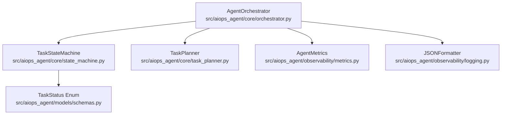
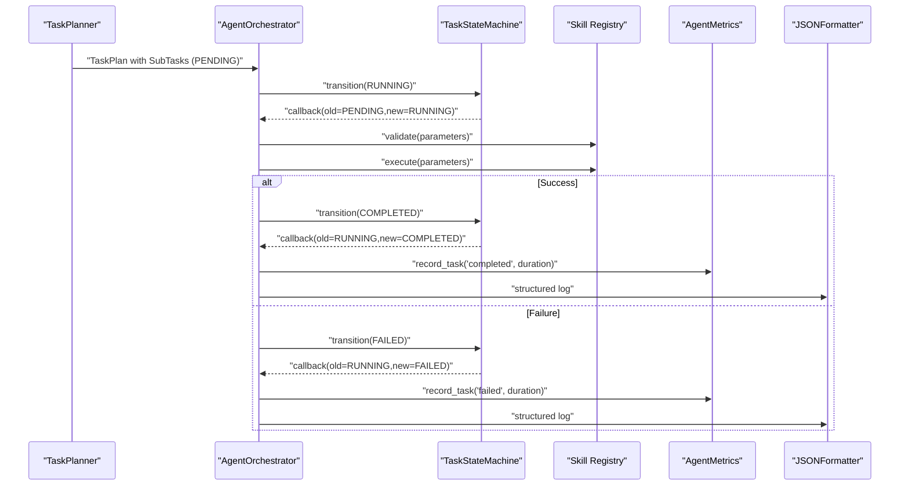
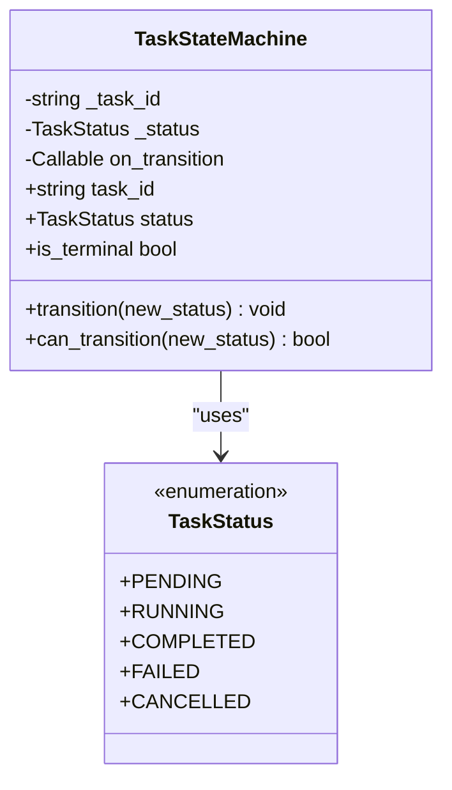
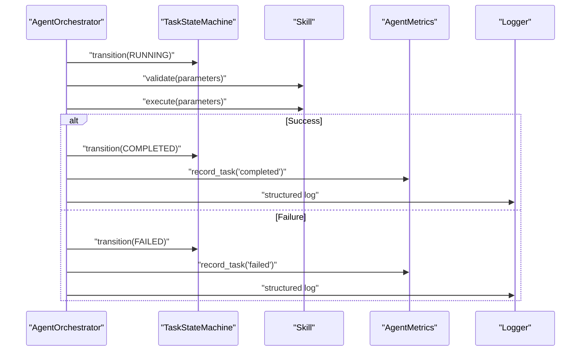
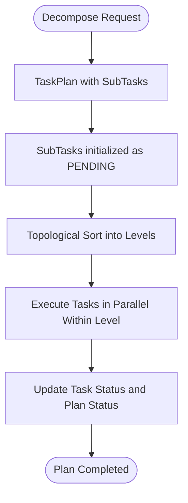
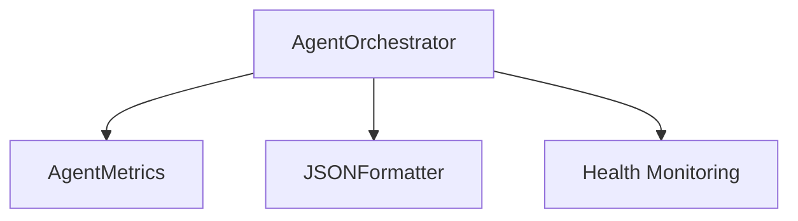
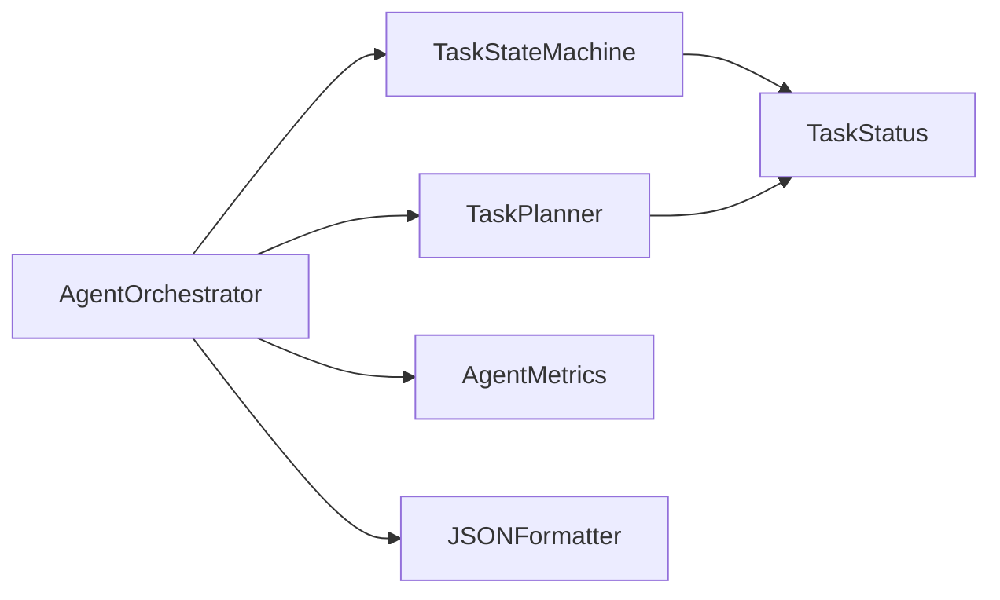

# State Machine

<cite>
**Referenced Files in This Document**
- [state_machine.py](file://src/aiops_agent/core/state_machine.py)
- [schemas.py](file://src/aiops_agent/models/schemas.py)
- [orchestrator.py](file://src/aiops_agent/core/orchestrator.py)
- [task_planner.py](file://src/aiops_agent/core/task_planner.py)
- [test_state_machine.py](file://tests/test_state_machine.py)
- [metrics.py](file://src/aiops_agent/observability/metrics.py)
- [logging.py](file://src/aiops_agent/observability/logging.py)
- [main.py](file://src/aiops_agent/main.py)
</cite>

## Table of Contents
1. [Introduction](#introduction)
2. [Project Structure](#project-structure)
3. [Core Components](#core-components)
4. [Architecture Overview](#architecture-overview)
5. [Detailed Component Analysis](#detailed-component-analysis)
6. [Dependency Analysis](#dependency-analysis)
7. [Performance Considerations](#performance-considerations)
8. [Troubleshooting Guide](#troubleshooting-guide)
9. [Conclusion](#conclusion)

## Introduction
This document provides comprehensive documentation for the Task State Machine component that manages task execution states and transitions within the AIOps Agent. It explains the finite state automaton design with states such as PENDING, RUNNING, COMPLETED, FAILED, and CANCELLED. It documents state transition logic, validation rules, error handling during state changes, integration with the task execution lifecycle, downstream actions triggered by state changes, examples of state transitions, error recovery patterns, monitoring capabilities, and thread-safety considerations.

## Project Structure
The Task State Machine resides in the core module and interacts with the orchestration pipeline, task planning, and observability subsystems. The following diagram shows the relevant parts of the project structure and their relationships.

**Diagram sources**
- [state_machine.py:1-92](file://src/aiops_agent/core/state_machine.py#L1-L92)
- [schemas.py:19-27](file://src/aiops_agent/models/schemas.py#L19-L27)
- [orchestrator.py:47-658](file://src/aiops_agent/core/orchestrator.py#L47-L658)
- [task_planner.py:32-207](file://src/aiops_agent/core/task_planner.py#L32-L207)
- [metrics.py:26-150](file://src/aiops_agent/observability/metrics.py#L26-L150)
- [logging.py:18-111](file://src/aiops_agent/observability/logging.py#L18-L111)

**Section sources**
- [state_machine.py:1-92](file://src/aiops_agent/core/state_machine.py#L1-L92)
- [schemas.py:19-27](file://src/aiops_agent/models/schemas.py#L19-L27)
- [orchestrator.py:47-658](file://src/aiops_agent/core/orchestrator.py#L47-L658)
- [task_planner.py:32-207](file://src/aiops_agent/core/task_planner.py#L32-L207)
- [metrics.py:26-150](file://src/aiops_agent/observability/metrics.py#L26-L150)
- [logging.py:18-111](file://src/aiops_agent/observability/logging.py#L18-L111)

## Core Components
- TaskStateMachine: Implements a finite-state automaton for individual tasks with strict transition validation and optional callbacks.
- TaskStatus: Defines the canonical set of task states used across the system.
- AgentOrchestrator: Integrates state transitions into the execution lifecycle, routing tasks to skills and recording outcomes.
- TaskPlanner: Produces task plans with initial PENDING states and dependency graphs used by the orchestrator.
- Observability: Metrics and structured logging capture state transitions and execution outcomes.

Key responsibilities:
- Enforce legal state transitions and prevent illegal state changes.
- Provide pre-checks for transitions and terminal state detection.
- Trigger downstream actions via callbacks when transitions occur.
- Integrate with orchestrator-driven execution to update task statuses and propagate outcomes.

**Section sources**
- [state_machine.py:26-92](file://src/aiops_agent/core/state_machine.py#L26-L92)
- [schemas.py:19-27](file://src/aiops_agent/models/schemas.py#L19-L27)
- [orchestrator.py:485-532](file://src/aiops_agent/core/orchestrator.py#L485-L532)
- [task_planner.py:189-207](file://src/aiops_agent/core/task_planner.py#L189-L207)

## Architecture Overview
The Task State Machine sits at the center of the task lifecycle. Orchestrator-driven execution triggers state transitions, and the state machine validates each transition against a deterministic transition matrix. Observability components record metrics and structured logs for monitoring and debugging.

**Diagram sources**
- [orchestrator.py:485-532](file://src/aiops_agent/core/orchestrator.py#L485-L532)
- [state_machine.py:51-79](file://src/aiops_agent/core/state_machine.py#L51-L79)
- [metrics.py:81-86](file://src/aiops_agent/observability/metrics.py#L81-L86)
- [logging.py:30-57](file://src/aiops_agent/observability/logging.py#L30-L57)

## Detailed Component Analysis

### TaskStateMachine
The TaskStateMachine encapsulates:
- State storage and immutable identity.
- Transition validation against a predefined matrix.
- Optional callback invocation on successful transitions.
- Terminal state detection.

Validation rules and transitions:
- PENDING can transition to RUNNING or CANCELLED.
- RUNNING can transition to COMPLETED, FAILED, or CANCELLED.
- COMPLETED and CANCELLED are terminal states.
- FAILED can transition back to PENDING to support retries.
- Any transition to an invalid target raises a ValueError with contextual information.

Downstream actions:
- On successful transition, the optional callback is invoked with task_id and old/new statuses.
- Logging records the transition with debug level.

Thread-safety:
- The state machine is a lightweight object with in-memory state. It does not implement internal synchronization primitives. If used concurrently across threads, external synchronization is required at the call site.

Persistence:
- The state machine does not persist state itself. Persistence is handled by higher-level components (e.g., orchestrator updates to persistent task models).

**Section sources**
- [state_machine.py:16-23](file://src/aiops_agent/core/state_machine.py#L16-L23)
- [state_machine.py:51-79](file://src/aiops_agent/core/state_machine.py#L51-L79)
- [state_machine.py:80-91](file://src/aiops_agent/core/state_machine.py#L80-L91)
- [schemas.py:19-27](file://src/aiops_agent/models/schemas.py#L19-L27)

### Integration with Orchestrator Execution
The orchestrator coordinates task execution and drives state transitions:
- Creates a TaskStateMachine per sub-task.
- Transitions to RUNNING before invoking skill execution.
- Updates task status and transitions to COMPLETED or FAILED based on outcome.
- Records metrics and logs for observability.

**Diagram sources**
- [orchestrator.py:485-532](file://src/aiops_agent/core/orchestrator.py#L485-L532)
- [metrics.py:81-86](file://src/aiops_agent/observability/metrics.py#L81-L86)
- [logging.py:30-57](file://src/aiops_agent/observability/logging.py#L30-L57)

**Section sources**
- [orchestrator.py:485-532](file://src/aiops_agent/core/orchestrator.py#L485-L532)

### Task Planning and Initial States
TaskPlanner produces SubTasks with PENDING status and dependency graphs. The orchestrator performs topological sorting and executes tasks in layers, respecting dependencies.

**Diagram sources**
- [task_planner.py:50-113](file://src/aiops_agent/core/task_planner.py#L50-L113)
- [task_planner.py:115-150](file://src/aiops_agent/core/task_planner.py#L115-L150)
- [orchestrator.py:424-483](file://src/aiops_agent/core/orchestrator.py#L424-L483)

**Section sources**
- [task_planner.py:189-207](file://src/aiops_agent/core/task_planner.py#L189-L207)
- [orchestrator.py:424-483](file://src/aiops_agent/core/orchestrator.py#L424-L483)

### State Transition Examples and Error Recovery
Common transitions:
- PENDING → RUNNING: Start execution.
- RUNNING → COMPLETED: Successful completion.
- RUNNING → FAILED: Execution failure; orchestrator sets error and records failure.
- FAILED → PENDING: Retry flow initiated by user/system.
- RUNNING → CANCELLED: Explicit cancellation.
- PENDING → CANCELLED: Immediate cancellation.

Error recovery patterns:
- FAILED → PENDING allows re-execution after remediation.
- Dependencies failing cancel downstream tasks to prevent cascading failures.
- Health monitoring marks skills unhealthy after repeated failures.

**Section sources**
- [test_state_machine.py:13-62](file://tests/test_state_machine.py#L13-L62)
- [test_state_machine.py:68-111](file://tests/test_state_machine.py#L68-L111)
- [orchestrator.py:279-348](file://src/aiops_agent/core/orchestrator.py#L279-L348)
- [orchestrator.py:571-596](file://src/aiops_agent/core/orchestrator.py#L571-L596)

### Monitoring Capabilities
Observability stack captures:
- Metrics: Task counts and durations categorized by status.
- Structured logs: JSON-formatted entries enriched with trace/span IDs.
- Health monitoring: Skill failure thresholds trigger unhealthy marking.

**Diagram sources**
- [metrics.py:26-105](file://src/aiops_agent/observability/metrics.py#L26-L105)
- [logging.py:18-57](file://src/aiops_agent/observability/logging.py#L18-L57)
- [orchestrator.py:571-596](file://src/aiops_agent/core/orchestrator.py#L571-L596)

**Section sources**
- [metrics.py:81-86](file://src/aiops_agent/observability/metrics.py#L81-L86)
- [logging.py:30-57](file://src/aiops_agent/observability/logging.py#L30-L57)
- [orchestrator.py:571-596](file://src/aiops_agent/core/orchestrator.py#L571-L596)

## Dependency Analysis
The TaskStateMachine depends on the TaskStatus enumeration and optionally on a callback. The orchestrator depends on the state machine for per-task state transitions and on metrics/logging for observability. TaskPlanner produces tasks with initial PENDING states.

**Diagram sources**
- [state_machine.py:12-14](file://src/aiops_agent/core/state_machine.py#L12-L14)
- [schemas.py:19-27](file://src/aiops_agent/models/schemas.py#L19-L27)
- [orchestrator.py:23-38](file://src/aiops_agent/core/orchestrator.py#L23-L38)
- [task_planner.py:14-16](file://src/aiops_agent/core/task_planner.py#L14-L16)

**Section sources**
- [state_machine.py:12-14](file://src/aiops_agent/core/state_machine.py#L12-L14)
- [schemas.py:19-27](file://src/aiops_agent/models/schemas.py#L19-L27)
- [orchestrator.py:23-38](file://src/aiops_agent/core/orchestrator.py#L23-L38)
- [task_planner.py:14-16](file://src/aiops_agent/core/task_planner.py#L14-L16)

## Performance Considerations
- State transitions are O(1) checks against a small transition matrix.
- Callback invocation occurs only on successful transitions, minimizing overhead.
- Orchestrator uses concurrency controls (semaphores) for parallel execution; state machine remains lightweight and thread-safe only with external synchronization.
- Metrics and logging are asynchronous-friendly; ensure exporters are configured appropriately for production throughput.

[No sources needed since this section provides general guidance]

## Troubleshooting Guide
Common issues and resolutions:
- Illegal state transitions: The state machine raises a ValueError with the current and target statuses and the task ID. Verify the orchestrator’s control flow and ensure transitions follow the allowed matrix.
- No callback invocation: Occurs when a transition is invalid; confirm the transition is valid before invoking.
- Terminal state confusion: COMPLETED and CANCELLED are terminal; subsequent transitions are disallowed. Use FAILED → PENDING to restart.
- Health monitoring alerts: Repeated skill failures trigger unhealthy marking; investigate underlying causes and adjust thresholds if needed.

Validation and testing references:
- Valid transitions and retry flows are covered by unit tests.
- Invalid transitions and error message formatting are verified by tests.

**Section sources**
- [test_state_machine.py:13-62](file://tests/test_state_machine.py#L13-L62)
- [test_state_machine.py:68-111](file://tests/test_state_machine.py#L68-L111)
- [test_state_machine.py:252-278](file://tests/test_state_machine.py#L252-L278)
- [orchestrator.py:571-596](file://src/aiops_agent/core/orchestrator.py#L571-L596)

## Conclusion
The Task State Machine enforces a strict, deterministic finite-state automaton for task lifecycle management. It integrates tightly with the orchestrator to drive execution, validates transitions rigorously, and enables robust error handling and recovery patterns. Combined with observability metrics and structured logging, it provides strong monitoring and debugging capabilities. For production deployments, ensure external synchronization around state machine usage and configure observability exporters appropriately.