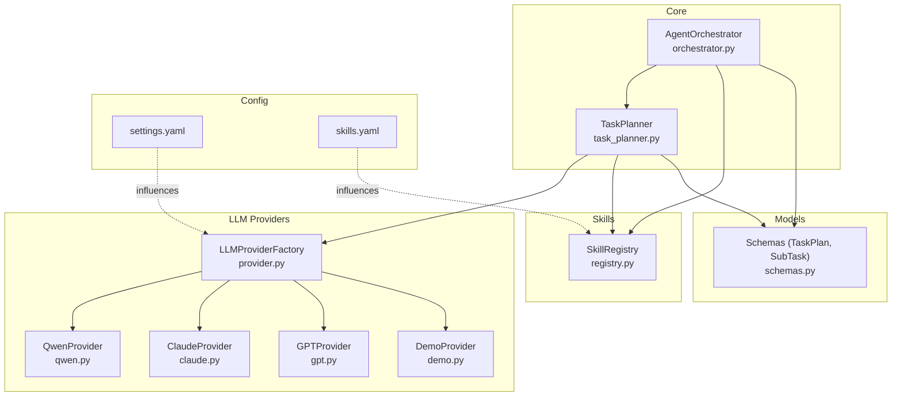
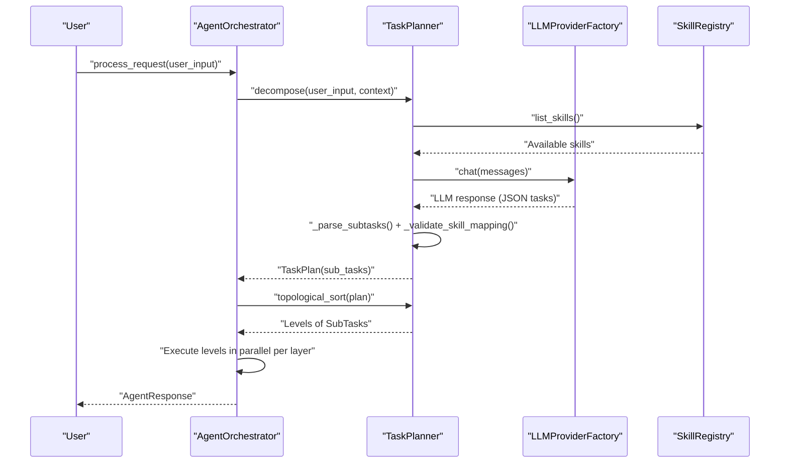
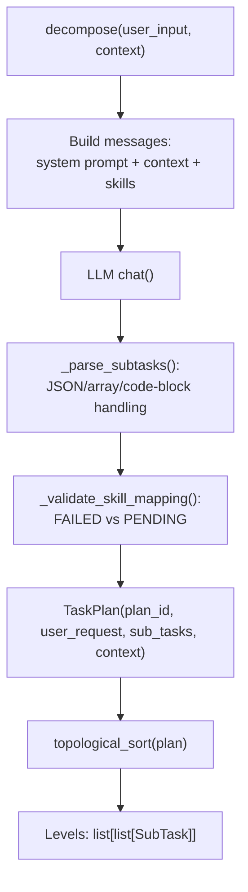
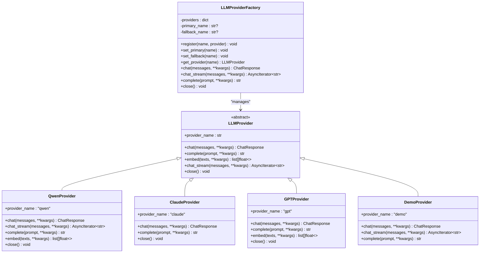
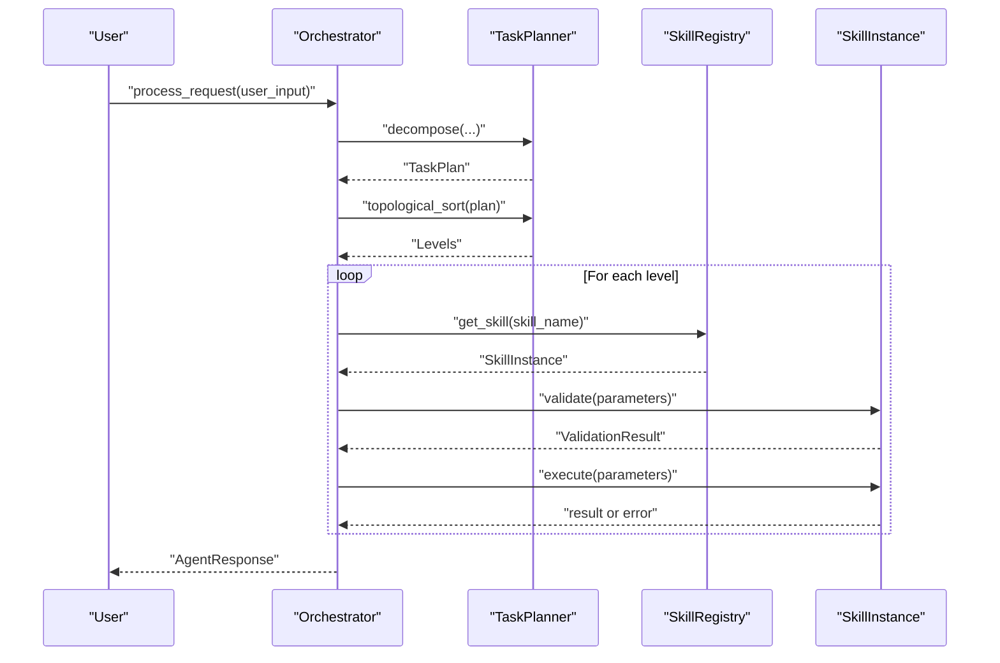
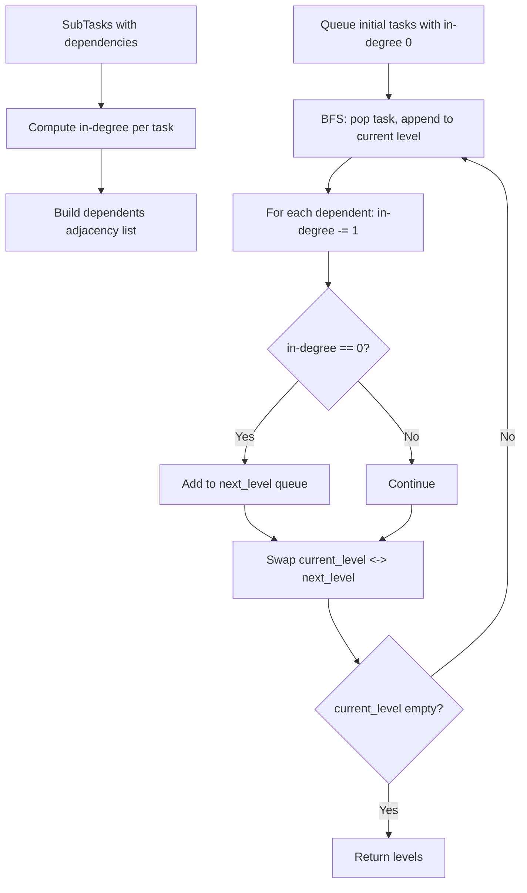
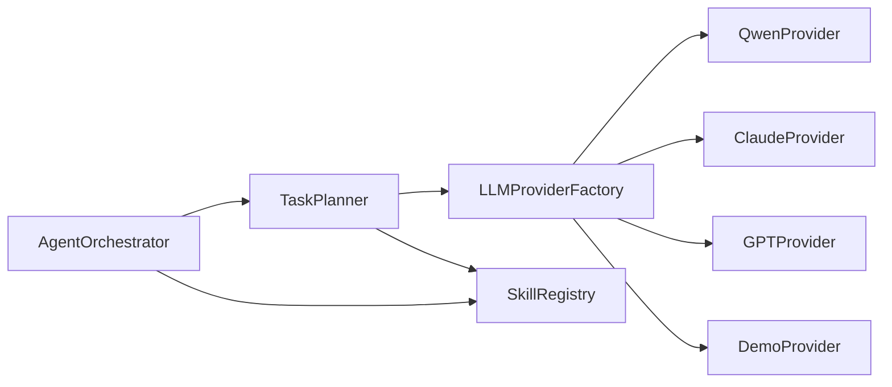

# Task Planner

<cite>
**Referenced Files in This Document**
- [task_planner.py](file://src/aiops_agent/core/task_planner.py)
- [provider.py](file://src/aiops_agent/llm/provider.py)
- [gpt.py](file://src/aiops_agent/llm/gpt.py)
- [claude.py](file://src/aiops_agent/llm/claude.py)
- [qwen.py](file://src/aiops_agent/llm/qwen.py)
- [demo.py](file://src/aiops_agent/llm/demo.py)
- [schemas.py](file://src/aiops_agent/models/schemas.py)
- [registry.py](file://src/aiops_agent/skills/registry.py)
- [main.py](file://src/aiops_agent/main.py)
- [settings.yaml](file://config/settings.yaml)
- [skills.yaml](file://config/skills.yaml)
- [orchestrator.py](file://src/aiops_agent/core/orchestrator.py)
- [test_task_planner.py](file://tests/test_task_planner.py)
- [test_task_planner_qwen.py](file://tests/test_task_planner_qwen.py)
- [taskplanner.md](file://docs/taskplanner.md)
</cite>

## Table of Contents
1. [Introduction](#introduction)
2. [Project Structure](#project-structure)
3. [Core Components](#core-components)
4. [Architecture Overview](#architecture-overview)
5. [Detailed Component Analysis](#detailed-component-analysis)
6. [Dependency Analysis](#dependency-analysis)
7. [Performance Considerations](#performance-considerations)
8. [Troubleshooting Guide](#troubleshooting-guide)
9. [Conclusion](#conclusion)
10. [Appendices](#appendices)

## Introduction
This document explains the Task Planner component that powers LLM-driven task decomposition in the AIOps Agent. It converts natural language运维 requests into executable task graphs with explicit dependency relationships, constructs a Directed Acyclic Graph (DAG), and performs topological sorting to enable layered, parallel execution. The planner integrates with multiple LLM providers (Qwen, Claude, GPT, and a demo provider), skill registry for capability-based routing, and the Orchestrator for execution and monitoring.

## Project Structure
The Task Planner resides in the core module and collaborates with LLM providers, the skill registry, and the orchestrator. Configuration files define provider selection and defaults.

**Diagram sources**
- [task_planner.py:1-207](file://src/aiops_agent/core/task_planner.py#L1-L207)
- [provider.py:1-242](file://src/aiops_agent/llm/provider.py#L1-L242)
- [qwen.py:1-205](file://src/aiops_agent/llm/qwen.py#L1-L205)
- [claude.py:1-118](file://src/aiops_agent/llm/claude.py#L1-L118)
- [gpt.py:1-128](file://src/aiops_agent/llm/gpt.py#L1-L128)
- [demo.py:1-144](file://src/aiops_agent/llm/demo.py#L1-L144)
- [registry.py:1-284](file://src/aiops_agent/skills/registry.py#L1-L284)
- [schemas.py:1-313](file://src/aiops_agent/models/schemas.py#L1-L313)
- [settings.yaml:1-85](file://config/settings.yaml#L1-L85)
- [skills.yaml:1-77](file://config/skills.yaml#L1-L77)
- [orchestrator.py:1-658](file://src/aiops_agent/core/orchestrator.py#L1-L658)

**Section sources**
- [task_planner.py:1-207](file://src/aiops_agent/core/task_planner.py#L1-L207)
- [provider.py:1-242](file://src/aiops_agent/llm/provider.py#L1-L242)
- [settings.yaml:1-85](file://config/settings.yaml#L1-L85)
- [skills.yaml:1-77](file://config/skills.yaml#L1-L77)

## Core Components
- TaskPlanner: Orchestrates LLM-based decomposition, parses structured outputs, validates skill mappings, and produces a TaskPlan with topological levels.
- LLMProviderFactory: Centralized factory managing multiple LLM backends with primary/fallback support and automatic failover.
- SkillRegistry: Maintains registered skills, their capabilities, and default versions; validates skill existence during planning.
- Orchestrator: Consumes TaskPlan, executes tasks respecting dependencies, and aggregates results.

Key data models:
- TaskPlan: Container for plan metadata and sub_tasks.
- SubTask: Represents a single executable unit with task_id, skill_name, action, parameters, dependencies, and status.

**Section sources**
- [task_planner.py:32-207](file://src/aiops_agent/core/task_planner.py#L32-L207)
- [provider.py:97-242](file://src/aiops_agent/llm/provider.py#L97-L242)
- [registry.py:19-284](file://src/aiops_agent/skills/registry.py#L19-L284)
- [schemas.py:29-51](file://src/aiops_agent/models/schemas.py#L29-L51)

## Architecture Overview
The Task Planner sits between the Orchestrator and LLM providers, transforming natural language into a DAG of SubTasks and validating skill availability. The Orchestrator then executes the plan in topologically ordered layers.

**Diagram sources**
- [orchestrator.py:84-198](file://src/aiops_agent/core/orchestrator.py#L84-L198)
- [task_planner.py:50-113](file://src/aiops_agent/core/task_planner.py#L50-L113)
- [provider.py:147-175](file://src/aiops_agent/llm/provider.py#L147-L175)
- [registry.py:199-207](file://src/aiops_agent/skills/registry.py#L199-L207)

## Detailed Component Analysis

### TaskPlanner: Decomposition, Parsing, Validation, and Topological Sorting
Responsibilities:
- Build LLM messages including system prompt, optional context, and available skills.
- Call LLM via factory to produce structured JSON tasks.
- Parse free-form LLM output into SubTask list with robust fallbacks.
- Validate skill mapping against SkillRegistry and mark missing skills as FAILED.
- Construct DAG and compute topological levels for parallel execution.

**Diagram sources**
- [task_planner.py:50-150](file://src/aiops_agent/core/task_planner.py#L50-L150)
- [schemas.py:29-51](file://src/aiops_agent/models/schemas.py#L29-L51)

Key behaviors:
- LLM message composition pulls available skills from SkillRegistry and injects context.
- Output parsing supports arrays, code blocks, and dict-wrapped lists; falls back gracefully.
- Skill validation marks tasks as FAILED when skill_name is not registered.
- Topological sort builds adjacency structures and performs BFS to compute levels.

**Section sources**
- [task_planner.py:50-150](file://src/aiops_agent/core/task_planner.py#L50-L150)
- [task_planner.py:156-188](file://src/aiops_agent/core/task_planner.py#L156-L188)
- [task_planner.py:189-207](file://src/aiops_agent/core/task_planner.py#L189-L207)

### LLM Provider Factory and Backends
The factory manages multiple providers and supports primary/fallback selection with automatic failover on exceptions.

**Diagram sources**
- [provider.py:31-242](file://src/aiops_agent/llm/provider.py#L31-L242)
- [qwen.py:30-205](file://src/aiops_agent/llm/qwen.py#L30-L205)
- [claude.py:20-118](file://src/aiops_agent/llm/claude.py#L20-L118)
- [gpt.py:20-128](file://src/aiops_agent/llm/gpt.py#L20-L128)
- [demo.py:40-144](file://src/aiops_agent/llm/demo.py#L40-L144)

Configuration and initialization:
- Primary and fallback providers are configured in settings.yaml.
- Environment variables can override keys; main.py conditionally registers real providers and sets fallbacks.

**Section sources**
- [provider.py:97-242](file://src/aiops_agent/llm/provider.py#L97-L242)
- [settings.yaml:4-26](file://config/settings.yaml#L4-L26)
- [main.py:176-193](file://src/aiops_agent/main.py#L176-L193)

### Skill Registry and Capability Matching
The SkillRegistry maintains skill definitions and instances, exposes discovery and lookup APIs, and marks skills unhealthy after repeated failures.

**Diagram sources**
- [registry.py:19-284](file://src/aiops_agent/skills/registry.py#L19-L284)
- [schemas.py:283-306](file://src/aiops_agent/models/schemas.py#L283-L306)

**Section sources**
- [registry.py:19-284](file://src/aiops_agent/skills/registry.py#L19-L284)
- [schemas.py:283-306](file://src/aiops_agent/models/schemas.py#L283-L306)

### Orchestrator Integration and Execution Flow
The Orchestrator coordinates planning, execution, and reporting. It:
- Sanitizes input, updates context, switches to task mode, and calls TaskPlanner.decompose.
- Validates plan readiness and skill mappings.
- Executes tasks in topological layers with concurrency limits and failure propagation.

**Diagram sources**
- [orchestrator.py:84-483](file://src/aiops_agent/core/orchestrator.py#L84-L483)
- [task_planner.py:115-150](file://src/aiops_agent/core/task_planner.py#L115-L150)
- [registry.py:159-181](file://src/aiops_agent/skills/registry.py#L159-L181)

**Section sources**
- [orchestrator.py:84-483](file://src/aiops_agent/core/orchestrator.py#L84-L483)

### Task Planning Algorithms and DAG Construction
Topological sorting computes execution layers by:
- Building in-degree counts and adjacency lists from SubTask.dependencies.
- Performing BFS from nodes with zero in-degree to produce layered sets of executable tasks.

**Diagram sources**
- [task_planner.py:115-150](file://src/aiops_agent/core/task_planner.py#L115-L150)

**Section sources**
- [task_planner.py:115-150](file://src/aiops_agent/core/task_planner.py#L115-L150)

### Examples of Task Plan Generation and Execution Patterns
- Example requests and expected outcomes are covered in integration tests:
  - Monitoring queries, troubleshooting scenarios, change management risk assessments.
  - Multi-skill plans with inter-task dependencies.
  - Parameter extraction from natural language (e.g., instance IDs).
- The demo provider demonstrates keyword-based decomposition for development and testing.

**Section sources**
- [test_task_planner_qwen.py:80-250](file://tests/test_task_planner_qwen.py#L80-L250)
- [demo.py:98-144](file://src/aiops_agent/llm/demo.py#L98-L144)

## Dependency Analysis
- TaskPlanner depends on LLMProviderFactory for model calls and SkillRegistry for capability checks.
- Orchestrator composes TaskPlanner and SkillRegistry, and controls execution flow and concurrency.
- Provider implementations encapsulate API specifics for Qwen, Claude, GPT, and a demo backend.

**Diagram sources**
- [task_planner.py:14-16](file://src/aiops_agent/core/task_planner.py#L14-L16)
- [orchestrator.py:75-75](file://src/aiops_agent/core/orchestrator.py#L75-L75)
- [provider.py:111-138](file://src/aiops_agent/llm/provider.py#L111-L138)

**Section sources**
- [task_planner.py:14-16](file://src/aiops_agent/core/task_planner.py#L14-L16)
- [orchestrator.py:75-75](file://src/aiops_agent/core/orchestrator.py#L75-L75)
- [provider.py:111-138](file://src/aiops_agent/llm/provider.py#L111-L138)

## Performance Considerations
- Concurrency control: Orchestrator limits parallelism per execution level to avoid resource saturation.
- Provider failover: Factory automatically retries with fallback providers on exceptions.
- Parsing robustness: TaskPlanner’s parser tolerates varied LLM output formats to reduce retries.
- Observability: Tracing and metrics are integrated to monitor latency and throughput.

[No sources needed since this section provides general guidance]

## Troubleshooting Guide
Common issues and resolutions:
- No tasks generated: LLM may not have produced a valid JSON plan; TaskPlanner returns an empty sub_tasks list and logs the failure. Verify provider connectivity and prompts.
- Skills not found: If all tasks map to unregistered skills, the Orchestrator reports SKILL_NOT_FOUND with suggestions of available skills.
- Provider failures: Factory logs warnings and attempts fallback; check credentials and network connectivity.
- Dependency cancellation: Tasks whose dependencies failed are marked CANCELLED; inspect upstream task statuses.

**Section sources**
- [task_planner.py:91-97](file://src/aiops_agent/core/task_planner.py#L91-L97)
- [orchestrator.py:136-146](file://src/aiops_agent/core/orchestrator.py#L136-L146)
- [provider.py:153-175](file://src/aiops_agent/llm/provider.py#L153-L175)

## Conclusion
The Task Planner transforms natural language运维 requests into structured, executable DAGs via LLMs and skill registries. Its robust parsing, validation, and topological sorting enable efficient, parallelized execution through the Orchestrator. With configurable providers and comprehensive error handling, it offers a reliable foundation for LLM-powered task automation.

[No sources needed since this section summarizes without analyzing specific files]

## Appendices

### Configuration Options for LLM Providers
- Primary and fallback providers, along with model, API base, max tokens, temperature, and timeouts, are defined in settings.yaml.
- Environment variables can override keys; main.py conditionally registers real providers and sets fallbacks.

**Section sources**
- [settings.yaml:4-26](file://config/settings.yaml#L4-L26)
- [main.py:176-193](file://src/aiops_agent/main.py#L176-L193)

### Customizing Planning Prompts
- The system prompt guiding LLM output is embedded in TaskPlanner and instructs the model to return JSON sub_tasks with task_id, skill_name, action, parameters, and dependencies. Adjustments can be made by modifying the internal prompt constant.

**Section sources**
- [task_planner.py:20-29](file://src/aiops_agent/core/task_planner.py#L20-L29)

### Data Model Reference
- TaskPlan: plan_id, user_request, sub_tasks, context, status.
- SubTask: task_id, skill_name, action, parameters, dependencies, status, result, error, created_at.

**Section sources**
- [schemas.py:43-51](file://src/aiops_agent/models/schemas.py#L43-L51)
- [schemas.py:29-41](file://src/aiops_agent/models/schemas.py#L29-L41)