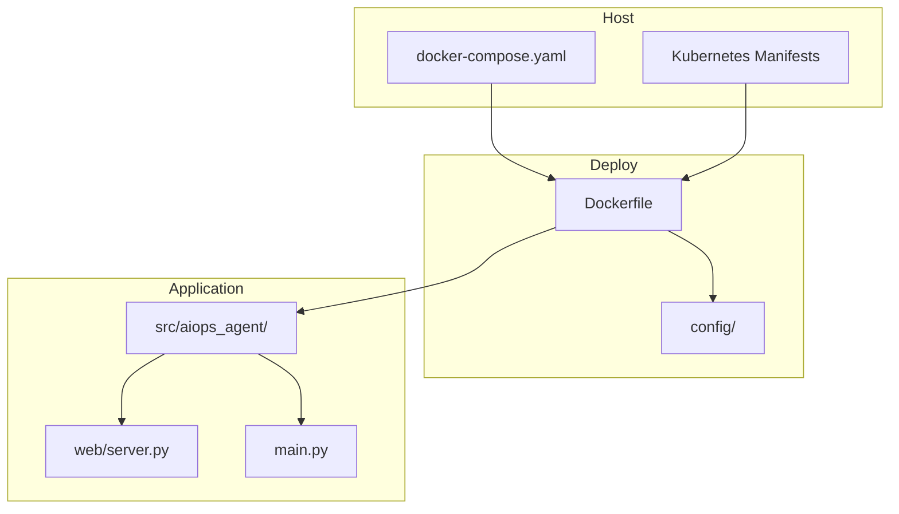
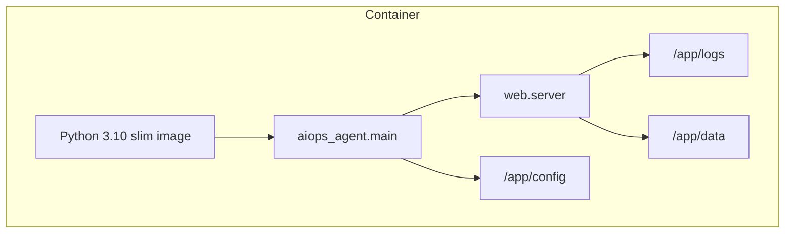
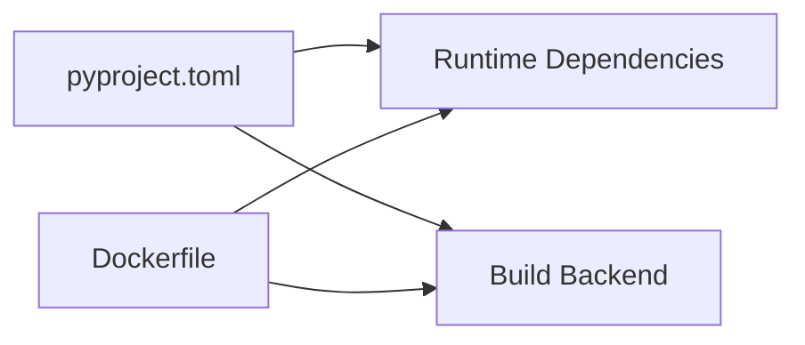

# Containerization with Docker

<cite>
**Referenced Files in This Document**
- [Dockerfile](file://deploy/Dockerfile)
- [docker-compose.yaml](file://deploy/docker-compose.yaml)
- [deployment.yaml](file://deploy/k8s/deployment.yaml)
- [service.yaml](file://deploy/k8s/service.yaml)
- [configmap.yaml](file://deploy/k8s/configmap.yaml)
- [settings.yaml](file://config/settings.yaml)
- [mcp_servers.yaml](file://config/mcp_servers.yaml)
- [main.py](file://src/aiops_agent/main.py)
- [server.py](file://src/aiops_agent/web/server.py)
- [pyproject.toml](file://pyproject.toml)
- [README.md](file://README.md)
</cite>

## Table of Contents
1. [Introduction](#introduction)
2. [Project Structure](#project-structure)
3. [Core Components](#core-components)
4. [Architecture Overview](#architecture-overview)
5. [Detailed Component Analysis](#detailed-component-analysis)
6. [Dependency Analysis](#dependency-analysis)
7. [Performance Considerations](#performance-considerations)
8. [Troubleshooting Guide](#troubleshooting-guide)
9. [Conclusion](#conclusion)
10. [Appendices](#appendices)

## Introduction
This document provides comprehensive Docker containerization guidance for the AIOps Agent. It explains the multi-stage Docker build process, the Dockerfile structure, compose-based local development, and Kubernetes deployment artifacts. It also covers security hardening, resource limits, health checks, networking, persistent storage, and debugging techniques tailored to development, testing, and production environments.

## Project Structure
The repository organizes containerization assets under the deploy directory alongside Kubernetes manifests and configuration under config. The application exposes a web server on port 8080 and relies on configuration files for LLM providers, MCP servers, and security policies.

**Diagram sources**
- [Dockerfile](file://deploy/Dockerfile)
- [docker-compose.yaml](file://deploy/docker-compose.yaml)
- [deployment.yaml](file://deploy/k8s/deployment.yaml)
- [server.py](file://src/aiops_agent/web/server.py)
- [main.py](file://src/aiops_agent/main.py)

**Section sources**
- [README.md](file://README.md)
- [Dockerfile](file://deploy/Dockerfile)
- [docker-compose.yaml](file://deploy/docker-compose.yaml)
- [deployment.yaml](file://deploy/k8s/deployment.yaml)

## Core Components
- Multi-stage Docker build:
  - Builder stage installs build tools and produces a wheel artifact.
  - Runtime stage installs only runtime dependencies and copies application code and configuration.
- Non-root user execution and minimal base images reduce attack surface.
- Exposes port 8080 and runs the application module entrypoint.
- Compose defines environment variables for identity, region, credentials, and log level, plus named volumes for logs and data persistence.
- Kubernetes deployment sets probes, resource requests/limits, and mounts configuration as a ConfigMap.

**Section sources**
- [Dockerfile](file://deploy/Dockerfile)
- [docker-compose.yaml](file://deploy/docker-compose.yaml)
- [deployment.yaml](file://deploy/k8s/deployment.yaml)
- [configmap.yaml](file://deploy/k8s/configmap.yaml)

## Architecture Overview
The containerized AIOps Agent runs an aiohttp-based web server that serves both API endpoints and a static Chat UI. It initializes observability, security, and tooling subsystems at startup. Persistent storage is used for audit logs and long-term memory.

**Diagram sources**
- [Dockerfile](file://deploy/Dockerfile)
- [server.py](file://src/aiops_agent/web/server.py)
- [main.py](file://src/aiops_agent/main.py)

## Detailed Component Analysis

### Multi-Stage Docker Build
The Dockerfile implements a two-stage build:
- Builder stage:
  - Uses a Python slim base image.
  - Installs build backend and builds a wheel from the package metadata.
- Runtime stage:
  - Copies the wheel from the builder stage.
  - Installs runtime dependencies and application code.
  - Creates directories for logs and data.
  - Switches to a non-root user and sets environment variables.
  - Exposes port 8080 and starts the application module.

Optimization strategies:
- Using a slim base image reduces size and attack surface.
- Installing only runtime dependencies in the final stage minimizes footprint.
- Copying wheels avoids installing build-time dependencies in the final image.
- Creating dedicated directories ensures the non-root user can write logs and data.

Security hardening:
- Running as a non-root user prevents privilege escalation.
- Minimal base image and limited installed packages reduce vulnerabilities.

Environment variables:
- PYTHONUNBUFFERED enables immediate log output.
- LOG_LEVEL controls application logging verbosity.

Port exposure:
- Port 8080 is exposed for the web server.

Entrypoint:
- Starts the application module entrypoint.

**Section sources**
- [Dockerfile](file://deploy/Dockerfile)

### Dockerfile Structure and Purpose
- Base image selection:
  - Python 3.10 slim is used for both stages to ensure reproducible builds and smaller images.
- Dependency installation:
  - Build backend is installed in the builder stage.
  - Wheel is built and then installed in the runtime stage.
- Configuration copying:
  - Configuration directory is copied into the image for runtime use.
- Directory creation:
  - Audit logs, backups, and data directories are created for persistence.
- User and permissions:
  - A dedicated non-root user is created and ownership is set.
- Environment variables:
  - Logging and buffering settings are configured.
- Ports and entrypoint:
  - Port 8080 is exposed and the application module is started.

**Section sources**
- [Dockerfile](file://deploy/Dockerfile)

### docker-compose.yaml Setup for Local Development
Compose defines:
- Service build context and Dockerfile path.
- Port mapping from host to container for port 8080.
- Environment variables for identity endpoint, region, workload identity ARN, LLM API key, and log level.
- Volume mounts:
  - Read-only mount of the config directory.
  - Named volumes for logs and data persistence.

Network configuration:
- No explicit networks are defined; defaults apply.

Health checks:
- Not defined in compose; use Kubernetes probes for production.

Debugging:
- Logs are persisted to the named volume for inspection.
- Environment variables can be adjusted for verbose logging.

**Section sources**
- [docker-compose.yaml](file://deploy/docker-compose.yaml)

### Kubernetes Deployment Artifacts
Deployment:
- Single replica with a service account name.
- Container image reference and port exposure.
- Environment variables sourced from ConfigMap and Secret.
- Resource requests and limits for CPU and memory.
- Liveness and readiness probes using HTTP GET against /health and /ready.
- Volume mount for configuration as a ConfigMap.

Service:
- ClusterIP service exposing port 8080.

ConfigMap:
- Provides identity endpoint and region values.

Secret:
- Mounts workload identity ARN for secure credential injection.

**Section sources**
- [deployment.yaml](file://deploy/k8s/deployment.yaml)
- [service.yaml](file://deploy/k8s/service.yaml)
- [configmap.yaml](file://deploy/k8s/configmap.yaml)

### Application Startup and Runtime Behavior
The application entrypoint initializes:
- Observability (logging, tracing, metrics).
- Workload identity and credential management.
- Security components (permission gate, audit logger, security guard).
- Tool executor and MCP registry.
- LLM provider factory with demo provider and optional real provider.
- Skill registry with default skills.
- Context manager and orchestrator.
- Web server runs on host 0.0.0.0 and port 8080.

Configuration dependencies:
- Settings loaded from config/settings.yaml.
- MCP server configurations from config/mcp_servers.yaml.
- RAM policy templates and security rules are referenced during initialization.

**Section sources**
- [main.py](file://src/aiops_agent/main.py)
- [server.py](file://src/aiops_agent/web/server.py)
- [settings.yaml](file://config/settings.yaml)
- [mcp_servers.yaml](file://config/mcp_servers.yaml)

### Container Networking, Port Mapping, and Storage
Networking:
- The web server listens on 0.0.0.0:8080.
- Compose maps host port 8080 to container port 8080.
- Kubernetes Service exposes port 8080 internally.

Storage:
- Named volumes for logs and data enable persistence across restarts.
- Audit logs and backups are written to dedicated directories.
- Long-term memory and sessions are stored under data.

**Section sources**
- [server.py](file://src/aiops_agent/web/server.py)
- [docker-compose.yaml](file://deploy/docker-compose.yaml)
- [deployment.yaml](file://deploy/k8s/deployment.yaml)

### Health Checks and Probes
- Compose does not define health checks; rely on Kubernetes probes.
- Kubernetes liveness probe targets /health.
- Kubernetes readiness probe targets /ready.

**Section sources**
- [deployment.yaml](file://deploy/k8s/deployment.yaml)
- [server.py](file://src/aiops_agent/web/server.py)

### Security Best Practices
- Non-root user execution in the container.
- Minimal base image and limited installed packages.
- Secrets mounted via Kubernetes Secrets and environment variables.
- Configuration mounted as a ConfigMap for non-sensitive settings.
- Audit logs and backups stored in persistent volumes.

**Section sources**
- [Dockerfile](file://deploy/Dockerfile)
- [deployment.yaml](file://deploy/k8s/deployment.yaml)
- [configmap.yaml](file://deploy/k8s/configmap.yaml)

### Debugging Techniques
- Inspect logs from the named volume.
- Adjust LOG_LEVEL via environment variables.
- Verify configuration loading from config/settings.yaml and config/mcp_servers.yaml.
- Confirm environment variables for identity and credentials are set correctly.

**Section sources**
- [docker-compose.yaml](file://deploy/docker-compose.yaml)
- [settings.yaml](file://config/settings.yaml)
- [mcp_servers.yaml](file://config/mcp_servers.yaml)

## Dependency Analysis
The application depends on Python packages declared in pyproject.toml. The Dockerfile installs only runtime dependencies in the final stage, while the builder stage installs the build backend.

**Diagram sources**
- [pyproject.toml](file://pyproject.toml)
- [Dockerfile](file://deploy/Dockerfile)

**Section sources**
- [pyproject.toml](file://pyproject.toml)
- [Dockerfile](file://deploy/Dockerfile)

## Performance Considerations
- Use slim base images to minimize container size and attack surface.
- Separate build and runtime stages to reduce final image size.
- Configure resource requests and limits in Kubernetes to prevent noisy neighbors.
- Enable structured logging and metrics for observability.
- Use streaming responses for long-running tasks to improve responsiveness.

[No sources needed since this section provides general guidance]

## Troubleshooting Guide
Common issues and resolutions:
- Port conflicts:
  - Ensure host port 8080 is free or adjust compose port mapping.
- Configuration errors:
  - Verify config/settings.yaml and config/mcp_servers.yaml are present and valid.
- Identity and credentials:
  - Confirm environment variables for identity and API keys are set.
- Persistence issues:
  - Check named volumes for logs and data are mounted correctly.
- Health/readiness failures:
  - Confirm /health and /ready endpoints are reachable and returning expected responses.

**Section sources**
- [docker-compose.yaml](file://deploy/docker-compose.yaml)
- [deployment.yaml](file://deploy/k8s/deployment.yaml)
- [settings.yaml](file://config/settings.yaml)
- [mcp_servers.yaml](file://config/mcp_servers.yaml)
- [server.py](file://src/aiops_agent/web/server.py)

## Conclusion
The AIOps Agent’s containerization strategy emphasizes security, modularity, and observability. The multi-stage Docker build reduces image size and risk, while compose and Kubernetes artifacts provide flexible deployment options. Proper configuration, resource limits, and health checks ensure reliable operation across development and production environments.

[No sources needed since this section summarizes without analyzing specific files]

## Appendices

### Example Deployment Scenarios
- Development:
  - Use docker-compose with environment variables for identity and API keys.
  - Mount config as read-only and persist logs/data via named volumes.
- Testing:
  - Run with minimal resource requests and enable debug logging.
  - Use readiness probes to gate traffic until the service is ready.
- Production:
  - Deploy via Kubernetes with ConfigMaps and Secrets.
  - Set resource requests/limits and configure liveness/readiness probes.
  - Persist logs and data using persistent volumes.

**Section sources**
- [docker-compose.yaml](file://deploy/docker-compose.yaml)
- [deployment.yaml](file://deploy/k8s/deployment.yaml)
- [configmap.yaml](file://deploy/k8s/configmap.yaml)