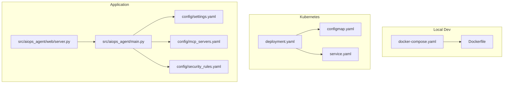
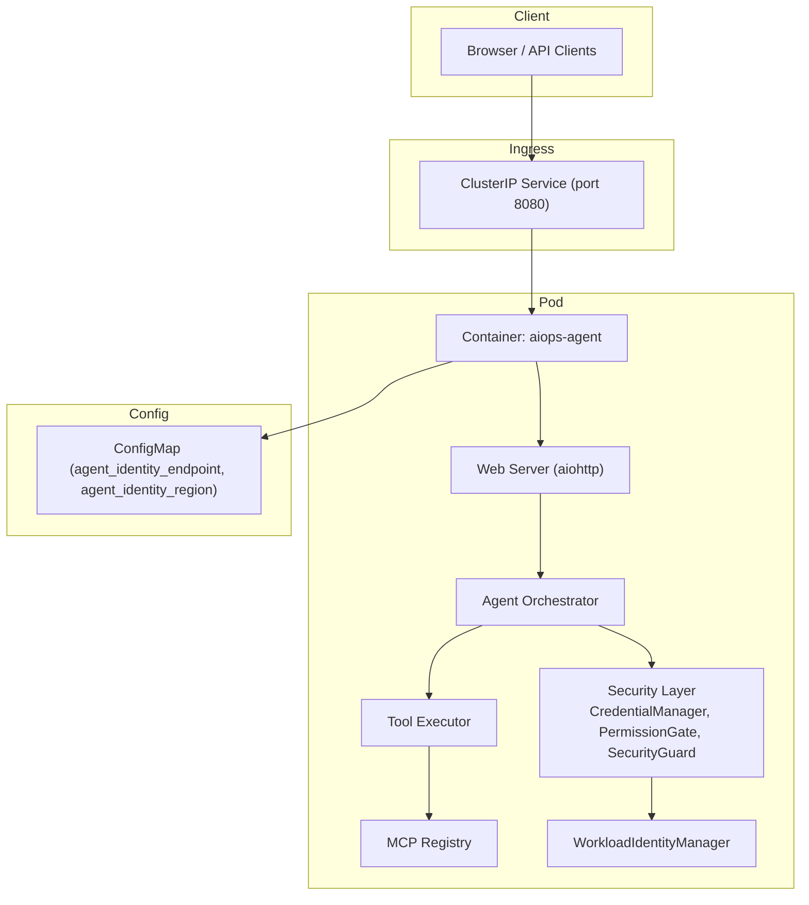
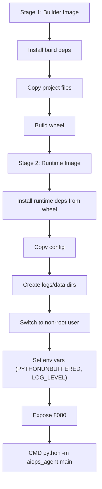
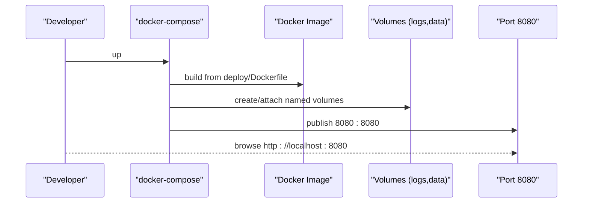
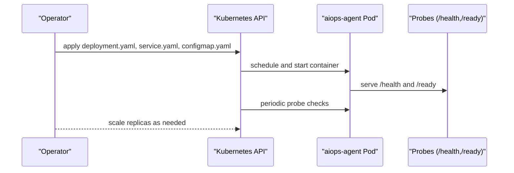
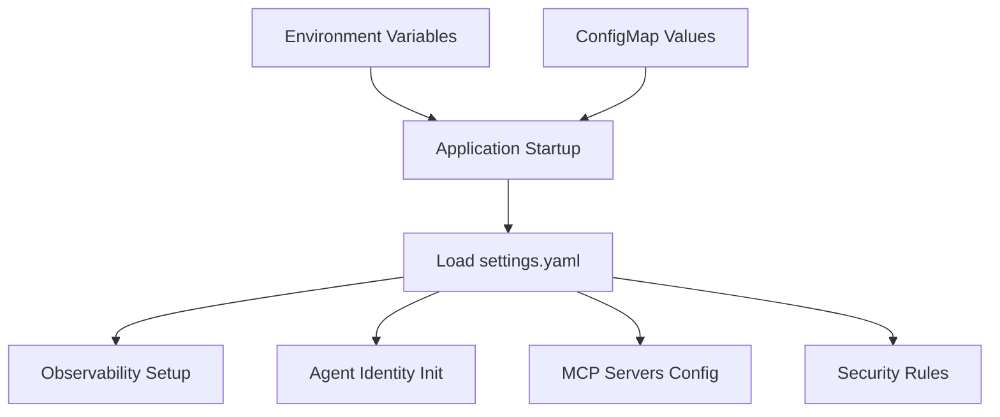
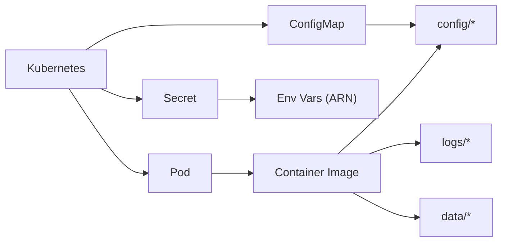

# Deployment & Operations

<cite>
**Referenced Files in This Document**
- [Dockerfile](file://deploy/Dockerfile)
- [docker-compose.yaml](file://deploy/docker-compose.yaml)
- [deployment.yaml](file://deploy/k8s/deployment.yaml)
- [service.yaml](file://deploy/k8s/service.yaml)
- [configmap.yaml](file://deploy/k8s/configmap.yaml)
- [settings.yaml](file://config/settings.yaml)
- [mcp_servers.yaml](file://config/mcp_servers.yaml)
- [security_rules.yaml](file://config/security_rules.yaml)
- [admin.json](file://config/ram_policies/admin.json)
- [limited_write.json](file://config/ram_policies/limited_write.json)
- [read_only.json](file://config/ram_policies/read_only.json)
- [main.py](file://src/aiops_agent/main.py)
- [server.py](file://src/aiops_agent/web/server.py)
- [pyproject.toml](file://pyproject.toml)
- [README.md](file://README.md)
</cite>

## Table of Contents
1. [Introduction](#introduction)
2. [Project Structure](#project-structure)
3. [Core Components](#core-components)
4. [Architecture Overview](#architecture-overview)
5. [Detailed Component Analysis](#detailed-component-analysis)
6. [Dependency Analysis](#dependency-analysis)
7. [Performance Considerations](#performance-considerations)
8. [Troubleshooting Guide](#troubleshooting-guide)
9. [Conclusion](#conclusion)
10. [Appendices](#appendices)

## Introduction
This document provides comprehensive deployment and operations guidance for the AIOps Agent. It covers containerization with a multi-stage Docker build, local development via docker-compose, and production-grade Kubernetes deployments on Alibaba Cloud ACK. It also documents environment variables, persistent storage, scaling, security hardening, monitoring, and troubleshooting steps across local development, staging, and production environments.

## Project Structure
The deployment assets are organized under deploy/, with Docker and docker-compose for local development and Kubernetes manifests for production. Application configuration resides under config/, and the application entrypoint is under src/aiops_agent/main.py with the HTTP server under src/aiops_agent/web/server.py.

**Diagram sources**
- [docker-compose.yaml:1-25](file://deploy/docker-compose.yaml#L1-L25)
- [Dockerfile:1-42](file://deploy/Dockerfile#L1-L42)
- [deployment.yaml:1-68](file://deploy/k8s/deployment.yaml#L1-L68)
- [service.yaml:1-16](file://deploy/k8s/service.yaml#L1-L16)
- [configmap.yaml:1-8](file://deploy/k8s/configmap.yaml#L1-L8)
- [main.py:1-311](file://src/aiops_agent/main.py#L1-L311)
- [server.py:1-227](file://src/aiops_agent/web/server.py#L1-L227)
- [settings.yaml:1-85](file://config/settings.yaml#L1-L85)
- [mcp_servers.yaml:1-41](file://config/mcp_servers.yaml#L1-L41)
- [security_rules.yaml:1-70](file://config/security_rules.yaml#L1-L70)

**Section sources**
- [README.md:122-126](file://README.md#L122-L126)

## Core Components
- Containerization: Multi-stage Docker build produces a minimal runtime image, installs application wheels, copies configuration, creates non-root runtime user, exposes port 8080, and sets default environment variables.
- Local Development: docker-compose builds from the Dockerfile, mounts config as read-only, persists logs and data directories, and forwards port 8080.
- Kubernetes: Deployment runs the container with probes, resource requests/limits, and mounts a ConfigMap for configuration. Service exposes the pod internally. ConfigMap holds identity endpoint and region defaults.

**Section sources**
- [Dockerfile:1-42](file://deploy/Dockerfile#L1-L42)
- [docker-compose.yaml:1-25](file://deploy/docker-compose.yaml#L1-L25)
- [deployment.yaml:1-68](file://deploy/k8s/deployment.yaml#L1-L68)
- [service.yaml:1-16](file://deploy/k8s/service.yaml#L1-L16)
- [configmap.yaml:1-8](file://deploy/k8s/configmap.yaml#L1-L8)

## Architecture Overview
The runtime architecture integrates the web server, orchestrator, security layer, tool executor, and MCP servers. Health and readiness endpoints support Kubernetes probes.

**Diagram sources**
- [deployment.yaml:1-68](file://deploy/k8s/deployment.yaml#L1-L68)
- [service.yaml:1-16](file://deploy/k8s/service.yaml#L1-L16)
- [configmap.yaml:1-8](file://deploy/k8s/configmap.yaml#L1-L8)
- [server.py:138-146](file://src/aiops_agent/web/server.py#L138-L146)
- [main.py:70-222](file://src/aiops_agent/main.py#L70-L222)

## Detailed Component Analysis

### Containerization with Docker (Multi-stage Build)
- Build stage: Installs build dependencies, copies project files, builds a wheel artifact, and stages it.
- Runtime stage: Uses a slim base image, installs the built wheel, copies configuration, creates directories for audit logs and data, switches to a non-root user, sets environment variables, exposes port 8080, and starts the application module entrypoint.

**Diagram sources**
- [Dockerfile:1-42](file://deploy/Dockerfile#L1-L42)

**Section sources**
- [Dockerfile:1-42](file://deploy/Dockerfile#L1-L42)
- [pyproject.toml:34-38](file://pyproject.toml#L34-L38)

### Local Development with docker-compose
- Builds the image from the Dockerfile in the parent context.
- Exposes port 8080.
- Sets environment variables for identity endpoint, region, workload identity ARN, API key, and log level.
- Mounts config as read-only and persists logs and data directories.

**Diagram sources**
- [docker-compose.yaml:1-25](file://deploy/docker-compose.yaml#L1-L25)
- [Dockerfile:1-42](file://deploy/Dockerfile#L1-L42)

**Section sources**
- [docker-compose.yaml:1-25](file://deploy/docker-compose.yaml#L1-L25)

### Kubernetes Deployment (Production)
- Deployment: Runs a single replica by default, mounts a ConfigMap for configuration, defines liveness/readiness probes, and sets resource requests/limits.
- Service: Exposes the pod internally on port 8080.
- ConfigMap: Supplies identity endpoint and region defaults.

**Diagram sources**
- [deployment.yaml:1-68](file://deploy/k8s/deployment.yaml#L1-L68)
- [service.yaml:1-16](file://deploy/k8s/service.yaml#L1-L16)
- [configmap.yaml:1-8](file://deploy/k8s/configmap.yaml#L1-L8)

**Section sources**
- [deployment.yaml:1-68](file://deploy/k8s/deployment.yaml#L1-L68)
- [service.yaml:1-16](file://deploy/k8s/service.yaml#L1-L16)
- [configmap.yaml:1-8](file://deploy/k8s/configmap.yaml#L1-L8)

### Environment Variables and Configuration
- Identity and credentials:
  - Identity endpoint and region come from the ConfigMap and are used by the application initialization.
  - Workload identity ARN is supplied via a Secret and injected into the container.
  - API keys for LLM providers can be provided via environment variables.
- Logging and observability:
  - LOG_LEVEL controls application log verbosity.
  - Observability settings include tracing exporter, metrics export interval, and JSON logging format.
- MCP servers:
  - MCP server configurations are loaded from config/mcp_servers.yaml and executed as subprocesses.
- Security policies:
  - RAM policy templates define permissions for admin, limited-write, and read-only roles.
  - Security rules include sensitive field patterns, blacklist actions, rate limits, anomaly detection, and TLS enforcement.

**Diagram sources**
- [deployment.yaml:23-40](file://deploy/k8s/deployment.yaml#L23-L40)
- [configmap.yaml:5-7](file://deploy/k8s/configmap.yaml#L5-L7)
- [settings.yaml:1-85](file://config/settings.yaml#L1-L85)
- [security_rules.yaml:1-70](file://config/security_rules.yaml#L1-L70)
- [mcp_servers.yaml:1-41](file://config/mcp_servers.yaml#L1-L41)

**Section sources**
- [deployment.yaml:23-40](file://deploy/k8s/deployment.yaml#L23-L40)
- [configmap.yaml:5-7](file://deploy/k8s/configmap.yaml#L5-L7)
- [settings.yaml:1-85](file://config/settings.yaml#L1-L85)
- [security_rules.yaml:1-70](file://config/security_rules.yaml#L1-L70)
- [mcp_servers.yaml:1-41](file://config/mcp_servers.yaml#L1-L41)
- [admin.json:1-35](file://config/ram_policies/admin.json#L1-L35)
- [limited_write.json:1-38](file://config/ram_policies/limited_write.json#L1-L38)
- [read_only.json:1-30](file://config/ram_policies/read_only.json#L1-L30)

### Persistent Storage Requirements
- Logs and audit trails:
  - The container creates and writes to logs/audit and logs/audit_backup directories.
- Long-term and session data:
  - The container creates data/sessions and data/long_term_memory directories for persistence.
- Recommendations:
  - Mount persistent volumes or use hostPath/StorageClass-backed PVCs to retain logs and data across restarts.
  - Ensure appropriate filesystem permissions for the non-root user.

**Section sources**
- [Dockerfile:28-33](file://deploy/Dockerfile#L28-L33)
- [main.py:152-155](file://src/aiops_agent/main.py#L152-L155)

### Scaling Considerations
- Horizontal scaling:
  - Increase replicas in deployment.yaml to scale horizontally.
  - Ensure shared state is externalized if needed; current setup uses local directories for logs/data.
- Vertical scaling:
  - Adjust CPU/memory requests/limits in deployment.yaml to meet load.
- Probes:
  - Liveness and readiness probes (/health and /ready) help Kubernetes manage rolling updates and detect unhealthy instances.

**Section sources**
- [deployment.yaml:8-59](file://deploy/k8s/deployment.yaml#L8-L59)

### Health and Readiness Endpoints
- /health: Returns a simple health status.
- /ready: Indicates whether the service is ready to serve traffic.
- These endpoints are used by Kubernetes probes to ensure safe rollouts and restarts.

**Section sources**
- [server.py:138-146](file://src/aiops_agent/web/server.py#L138-L146)
- [deployment.yaml:48-59](file://deploy/k8s/deployment.yaml#L48-L59)

### API Endpoints
- GET /: Returns the frontend page.
- GET /skills: Lists skills.
- POST /api/chat: Handles chat requests synchronously.
- POST /api/chat/stream: Streams events via Server-Sent Events.
- GET /health: Health check.
- GET /ready: Readiness check.

**Section sources**
- [README.md:128-137](file://README.md#L128-L137)
- [server.py:196-214](file://src/aiops_agent/web/server.py#L196-L214)

## Dependency Analysis
The application depends on configuration files, MCP servers, and security policies. The container image embeds configuration and creates directories for logs and data. Kubernetes mounts configuration via a ConfigMap and secrets for sensitive values.

**Diagram sources**
- [Dockerfile:25-33](file://deploy/Dockerfile#L25-L33)
- [deployment.yaml:60-67](file://deploy/k8s/deployment.yaml#L60-L67)
- [configmap.yaml:1-8](file://deploy/k8s/configmap.yaml#L1-L8)

**Section sources**
- [Dockerfile:25-33](file://deploy/Dockerfile#L25-L33)
- [deployment.yaml:60-67](file://deploy/k8s/deployment.yaml#L60-L67)

## Performance Considerations
- Resource sizing:
  - Set appropriate CPU/memory requests/limits based on expected concurrency and workload.
- Probes:
  - Tune initialDelaySeconds and periodSeconds to avoid premature restarts during cold start.
- Observability:
  - Enable metrics and tracing exporters configured in settings.yaml to monitor latency and throughput.
- MCP server overhead:
  - Monitor tool execution timeouts and retry policies defined in settings.yaml.

[No sources needed since this section provides general guidance]

## Troubleshooting Guide
- Identity and credentials:
  - Verify that identity endpoint and region are present in the ConfigMap and that the workload identity ARN is provided via a Secret.
  - Confirm that the application initializes WorkloadIdentityManager and logs success or warnings accordingly.
- API connectivity:
  - Check /health and /ready endpoints for immediate health signals.
  - Review application logs for initialization errors or permission denials.
- Logs and data:
  - Ensure logs and data directories exist and are writable by the non-root user.
  - Confirm persistent volumes are mounted if logs/data must survive restarts.
- MCP servers:
  - Validate MCP server configurations in mcp_servers.yaml and confirm subprocess startup.
- Security:
  - Review security rules and RAM policies to ensure intended permissions and blacklisted actions.

**Section sources**
- [deployment.yaml:23-39](file://deploy/k8s/deployment.yaml#L23-L39)
- [configmap.yaml:5-7](file://deploy/k8s/configmap.yaml#L5-L7)
- [main.py:100-139](file://src/aiops_agent/main.py#L100-L139)
- [server.py:138-146](file://src/aiops_agent/web/server.py#L138-L146)
- [Dockerfile:28-33](file://deploy/Dockerfile#L28-L33)
- [mcp_servers.yaml:1-41](file://config/mcp_servers.yaml#L1-L41)
- [security_rules.yaml:20-42](file://config/security_rules.yaml#L20-L42)
- [admin.json:1-35](file://config/ram_policies/admin.json#L1-L35)
- [limited_write.json:1-38](file://config/ram_policies/limited_write.json#L1-L38)
- [read_only.json:1-30](file://config/ram_policies/read_only.json#L1-L30)

## Conclusion
This guide outlines a complete deployment strategy for AIOps Agent across local development and production environments. By leveraging multi-stage Docker builds, docker-compose for local iteration, and Kubernetes manifests for production, teams can achieve secure, observable, and scalable deployments. Proper environment variable management, persistent storage, and monitoring ensure reliable operations in staging and production.

[No sources needed since this section summarizes without analyzing specific files]

## Appendices

### Environment Variable Reference
- Identity and region:
  - AGENT_IDENTITY_ENDPOINT: Identity service endpoint (from ConfigMap).
  - AGENT_IDENTITY_REGION: Region (from ConfigMap).
- Workload identity:
  - WORKLOAD_IDENTITY_ARN: ARN for workload identity (from Secret).
- LLM provider:
  - QWEN_API_KEY: API key for Qwen provider (optional; enables real provider).
- Logging:
  - LOG_LEVEL: Log level for the application.
- Observability:
  - Settings are loaded from settings.yaml; configure exporters and intervals there.

**Section sources**
- [deployment.yaml:23-40](file://deploy/k8s/deployment.yaml#L23-L40)
- [configmap.yaml:5-7](file://deploy/k8s/configmap.yaml#L5-L7)
- [settings.yaml:62-77](file://config/settings.yaml#L62-L77)
- [main.py:184-193](file://src/aiops_agent/main.py#L184-L193)

### Persistent Storage Guidance
- Mount persistent volumes for:
  - logs/audit and logs/audit_backup
  - data/sessions and data/long_term_memory
- Use appropriate storage classes and access modes for your platform.

**Section sources**
- [Dockerfile:28-33](file://deploy/Dockerfile#L28-L33)

### Security Hardening Checklist
- Run as non-root user inside the container.
- Mount config as read-only.
- Store sensitive values (ARNs, API keys) in Secrets and inject via environment variables.
- Enforce HTTPS and minimum TLS versions as configured in security_rules.yaml.
- Limit permissions using RAM policy templates aligned with least privilege.

**Section sources**
- [Dockerfile:31-33](file://deploy/Dockerfile#L31-L33)
- [deployment.yaml:60-67](file://deploy/k8s/deployment.yaml#L60-L67)
- [security_rules.yaml:66-70](file://config/security_rules.yaml#L66-L70)
- [admin.json:1-35](file://config/ram_policies/admin.json#L1-L35)
- [limited_write.json:1-38](file://config/ram_policies/limited_write.json#L1-L38)
- [read_only.json:1-30](file://config/ram_policies/read_only.json#L1-L30)

### Monitoring Setup
- Enable tracing exporter and metrics export interval in settings.yaml.
- Use JSON logging format for structured logs.
- Integrate with SLS exporter if configured.

**Section sources**
- [settings.yaml:62-77](file://config/settings.yaml#L62-L77)

### Example Deployment Scenarios
- Local development:
  - Use docker-compose to build and run the container with mounted config and persisted volumes.
- Staging:
  - Deploy to a managed cluster with resource requests/limits, probes, and a dedicated ConfigMap/Secret.
- Production:
  - Scale replicas as needed, enable strict security policies, and integrate with observability pipelines.

**Section sources**
- [docker-compose.yaml:1-25](file://deploy/docker-compose.yaml#L1-L25)
- [deployment.yaml:1-68](file://deploy/k8s/deployment.yaml#L1-L68)
- [service.yaml:1-16](file://deploy/k8s/service.yaml#L1-L16)
- [configmap.yaml:1-8](file://deploy/k8s/configmap.yaml#L1-L8)