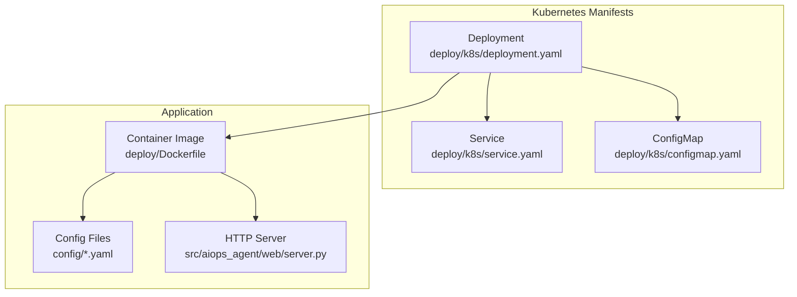
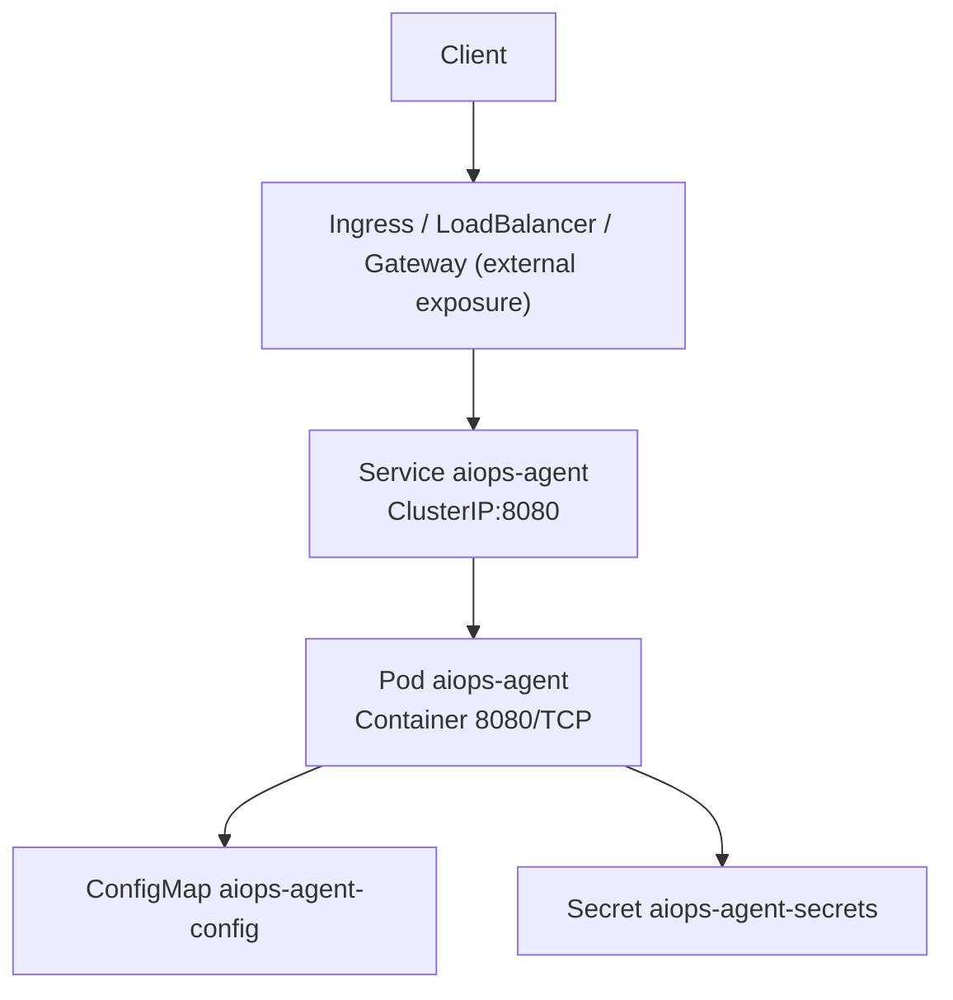
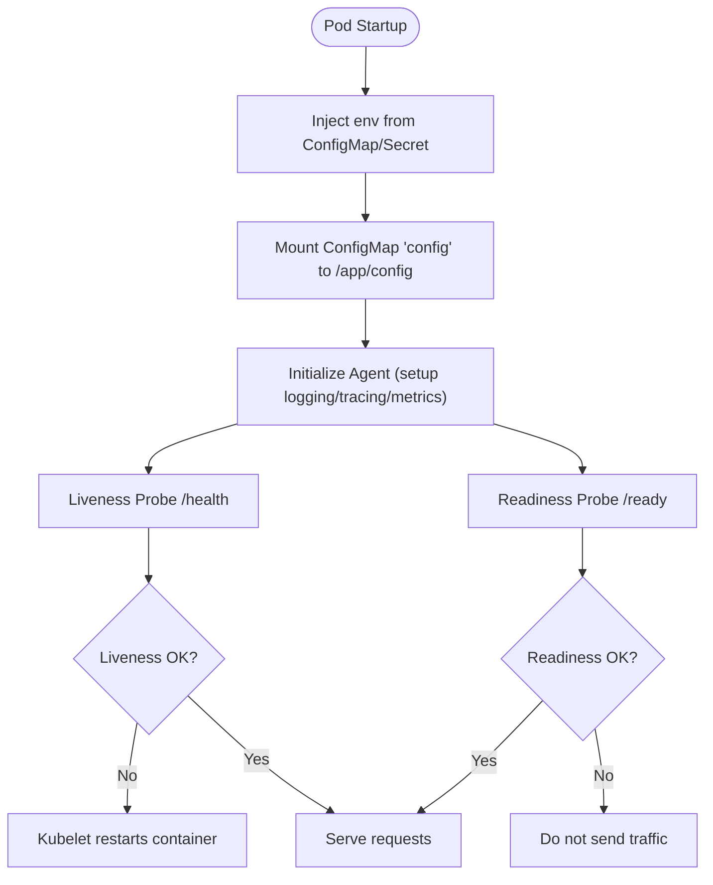
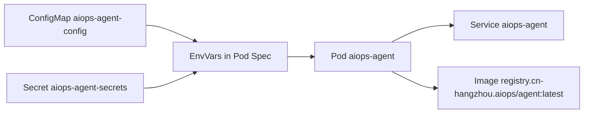

# Kubernetes Deployment

<cite>
**Referenced Files in This Document**
- [deployment.yaml](file://deploy/k8s/deployment.yaml)
- [service.yaml](file://deploy/k8s/service.yaml)
- [configmap.yaml](file://deploy/k8s/configmap.yaml)
- [Dockerfile](file://deploy/Dockerfile)
- [settings.yaml](file://config/settings.yaml)
- [mcp_servers.yaml](file://config/mcp_servers.yaml)
- [security_rules.yaml](file://config/security_rules.yaml)
- [docker-compose.yaml](file://deploy/docker-compose.yaml)
- [server.py](file://src/aiops_agent/web/server.py)
- [main.py](file://src/aiops_agent/main.py)
- [logging.py](file://src/aiops_agent/observability/logging.py)
</cite>

## Table of Contents
1. [Introduction](#introduction)
2. [Project Structure](#project-structure)
3. [Core Components](#core-components)
4. [Architecture Overview](#architecture-overview)
5. [Detailed Component Analysis](#detailed-component-analysis)
6. [Dependency Analysis](#dependency-analysis)
7. [Performance Considerations](#performance-considerations)
8. [Troubleshooting Guide](#troubleshooting-guide)
9. [Conclusion](#conclusion)
10. [Appendices](#appendices)

## Introduction
This document provides comprehensive Kubernetes deployment guidance for the AIOps Agent. It covers the current Kubernetes manifests (Deployment, Service, ConfigMap), explains how configuration and secrets are injected, and outlines recommended enhancements for production-grade deployments including rolling updates, probes, scaling, observability, and security. It also includes practical guidance for blue-green deployments, canary releases, and horizontal pod autoscaling.

## Project Structure
The Kubernetes deployment artifacts are located under deploy/k8s/. The application exposes an HTTP API and a health/ready endpoint, and reads configuration from a mounted ConfigMap and Secrets. The container image is built via a multi-stage Dockerfile and runs as a non-root user.

**Diagram sources**
- [deployment.yaml:1-68](file://deploy/k8s/deployment.yaml#L1-L68)
- [service.yaml:1-16](file://deploy/k8s/service.yaml#L1-L16)
- [configmap.yaml:1-8](file://deploy/k8s/configmap.yaml#L1-L8)
- [Dockerfile:1-42](file://deploy/Dockerfile#L1-L42)
- [server.py:138-146](file://src/aiops_agent/web/server.py#L138-L146)

**Section sources**
- [deployment.yaml:1-68](file://deploy/k8s/deployment.yaml#L1-L68)
- [service.yaml:1-16](file://deploy/k8s/service.yaml#L1-L16)
- [configmap.yaml:1-8](file://deploy/k8s/configmap.yaml#L1-L8)
- [Dockerfile:1-42](file://deploy/Dockerfile#L1-L42)

## Core Components
- Deployment: Defines the desired state for the AIOps Agent pods, including container image, resource requests/limits, probes, environment variables, and volume mounts.
- Service: Exposes the Agent internally within the cluster on port 8080.
- ConfigMap: Provides non-sensitive configuration keys consumed by the Agent.
- Container Image: Multi-stage build, non-root runtime, and exposed port 8080.

Key operational endpoints:
- Health check: GET /health
- Readiness check: GET /ready

**Section sources**
- [deployment.yaml:1-68](file://deploy/k8s/deployment.yaml#L1-L68)
- [service.yaml:1-16](file://deploy/k8s/service.yaml#L1-L16)
- [configmap.yaml:1-8](file://deploy/k8s/configmap.yaml#L1-L8)
- [server.py:138-146](file://src/aiops_agent/web/server.py#L138-L146)

## Architecture Overview
The AIOps Agent runs as a stateless HTTP service behind a Kubernetes Service. It consumes configuration from a ConfigMap and credentials from a Secret. The container runs as a non-root user and exposes port 8080. Probes are configured against the health and ready endpoints.

**Diagram sources**
- [deployment.yaml:1-68](file://deploy/k8s/deployment.yaml#L1-L68)
- [service.yaml:1-16](file://deploy/k8s/service.yaml#L1-L16)
- [configmap.yaml:1-8](file://deploy/k8s/configmap.yaml#L1-L8)

## Detailed Component Analysis

### Deployment: Pods, Probes, Resources, and Environment
- Replica count: 1 (single instance)
- Pod template:
  - Container name: aiops-agent
  - Image: registry.cn-hangzhou.aliyuncs.com/aiops/agent:latest
  - Ports: 8080
  - Environment variables:
    - AGENT_IDENTITY_ENDPOINT from ConfigMap key agent_identity_endpoint
    - AGENT_IDENTITY_REGION from ConfigMap key agent_identity_region
    - WORKLOAD_IDENTITY_ARN from Secret key workload_identity_arn
    - LOG_LEVEL set to INFO
  - Resources:
    - Requests: 500m CPU, 512Mi memory
    - Limits: 2000m CPU, 2Gi memory
  - Probes:
    - Liveness probe: HTTP GET /health on port 8080, initial delay 30s, period 10s
    - Readiness probe: HTTP GET /ready on port 8080, initial delay 10s, period 5s
  - Volume mounts:
    - config mounted read-only to /app/config from ConfigMap aiops-agent-config

**Diagram sources**
- [deployment.yaml:18-68](file://deploy/k8s/deployment.yaml#L18-L68)
- [server.py:138-146](file://src/aiops_agent/web/server.py#L138-L146)

**Section sources**
- [deployment.yaml:1-68](file://deploy/k8s/deployment.yaml#L1-L68)
- [server.py:138-146](file://src/aiops_agent/web/server.py#L138-L146)

### Service: Internal Exposure and Traffic Routing
- Type: ClusterIP
- Port: 8080, targetPort 8080
- Selector: app=aiops-agent

To expose externally, use an Ingress, Gateway API, or Service of type LoadBalancer depending on your platform.

**Section sources**
- [service.yaml:1-16](file://deploy/k8s/service.yaml#L1-L16)

### ConfigMap: Non-Sensitive Configuration
- Name: aiops-agent-config
- Keys:
  - agent_identity_endpoint
  - agent_identity_region

These values are injected as environment variables into the container.

**Section sources**
- [configmap.yaml:1-8](file://deploy/k8s/configmap.yaml#L1-L8)
- [deployment.yaml:23-38](file://deploy/k8s/deployment.yaml#L23-L38)

### Secrets: Sensitive Credentials
- Secret name: aiops-agent-secrets
- Key: workload_identity_arn
- Injection method: secretKeyRef into WORKLOAD_IDENTITY_ARN

Note: The current Deployment references a Secret named aiops-agent-secrets, but no Secret manifest is present in the repository. Ensure the Secret exists prior to deploying.

**Section sources**
- [deployment.yaml:34-38](file://deploy/k8s/deployment.yaml#L34-L38)

### Container Image and Runtime
- Multi-stage build with a final slim Python base
- Non-root user “agent” is created and used
- Exposed port: 8080
- Command: python -m aiops_agent.main
- Configuration files copied into /app/config

**Section sources**
- [Dockerfile:1-42](file://deploy/Dockerfile#L1-L42)

### Application Endpoints and Observability
- Health: GET /health
- Ready: GET /ready
- Logging: Structured JSON logging integrated with OpenTelemetry trace/span IDs
- Metrics and tracing are initialized during startup

**Section sources**
- [server.py:138-146](file://src/aiops_agent/web/server.py#L138-L146)
- [logging.py:60-111](file://src/aiops_agent/observability/logging.py#L60-L111)
- [main.py:85-96](file://src/aiops_agent/main.py#L85-L96)

## Dependency Analysis
The Deployment depends on:
- ConfigMap for non-sensitive configuration
- Secret for sensitive credentials
- Service for internal routing
- Container image for runtime

**Diagram sources**
- [deployment.yaml:1-68](file://deploy/k8s/deployment.yaml#L1-L68)
- [service.yaml:1-16](file://deploy/k8s/service.yaml#L1-L16)
- [configmap.yaml:1-8](file://deploy/k8s/configmap.yaml#L1-L8)

**Section sources**
- [deployment.yaml:1-68](file://deploy/k8s/deployment.yaml#L1-L68)
- [service.yaml:1-16](file://deploy/k8s/service.yaml#L1-L16)
- [configmap.yaml:1-8](file://deploy/k8s/configmap.yaml#L1-L8)

## Performance Considerations
- Current resource settings:
  - Requests: 500m CPU, 512Mi memory
  - Limits: 2000m CPU, 2Gi memory
- Recommended tuning:
  - Start with observed CPU/memory usage in staging to refine requests/limits.
  - Enable Horizontal Pod Autoscaler (HPA) based on CPU utilization or custom metrics.
  - Consider pod anti-affinity to spread replicas across nodes.
  - Use PodDisruptionBudget to maintain availability during maintenance.

[No sources needed since this section provides general guidance]

## Troubleshooting Guide
Common Kubernetes-specific issues and remedies:
- Pods fail readiness:
  - Verify /ready responds 200 and application logs indicate successful initialization.
  - Check ConfigMap/Secret mounting and key names.
- Liveness probe failures:
  - Confirm /health responds 200 and application startup completes before initialDelaySeconds.
- No external traffic:
  - Ensure an Ingress/Gateway or Service of type LoadBalancer is configured to reach the Service.
- Permission errors:
  - Validate Secret presence and correct key names.
  - Confirm Workload Identity configuration aligns with environment variables and settings.

Operational endpoints to check:
- /health (liveness)
- /ready (readiness)

**Section sources**
- [deployment.yaml:48-59](file://deploy/k8s/deployment.yaml#L48-L59)
- [server.py:138-146](file://src/aiops_agent/web/server.py#L138-L146)

## Conclusion
The current Kubernetes deployment provides a solid foundation for the AIOps Agent with proper probes, resource limits, and configuration injection. For production, augment with external exposure (Ingress/Gateway), HPA, NetworkPolicies, and Namespace/RBAC controls. Integrate monitoring and logging as outlined below to achieve robust observability.

[No sources needed since this section summarizes without analyzing specific files]

## Appendices

### A. Rolling Updates and Release Strategies
- Blue-green:
  - Deploy a second Deployment with a new image tag and switch Service selectors after validation.
- Canary:
  - Run a small percentage of traffic to the canary using an Ingress controller or service mesh.
- Rollback:
  - Point to the previous image tag and re-apply manifests.

[No sources needed since this section provides general guidance]

### B. Horizontal Pod Autoscaling (HPA)
- Example targets:
  - CPU utilization percentage
  - Custom metrics (e.g., request rate, error rate)
- Minimum/maximum replicas should reflect traffic patterns and SLAs.

[No sources needed since this section provides general guidance]

### C. Network Policies
- Allow inbound traffic from Ingress/Gateway and other internal services.
- Restrict egress to necessary endpoints (e.g., MCP servers, cloud APIs).

[No sources needed since this section provides general guidance]

### D. Namespaces and RBAC
- Isolate the Agent in its own Namespace.
- Define Roles/ClusterRoles and bind to the ServiceAccount used by the Deployment.

[No sources needed since this section provides general guidance]

### E. Persistent Volumes (Optional)
- Current setup is stateless. If storing logs or data is required, mount PersistentVolumes for logs and data directories.
- Ensure appropriate StorageClass and access modes.

[No sources needed since this section provides general guidance]

### F. Ingress and External Exposure
- Example pattern:
  - Ingress routes /health and /ready for health checks.
  - Route application paths to Service aiops-agent:8080.
- TLS termination and rate limiting can be configured at the Ingress controller.

[No sources needed since this section provides general guidance]

### G. Configuration Management and Secrets
- ConfigMap keys:
  - agent_identity_endpoint
  - agent_identity_region
- Secret key:
  - workload_identity_arn
- Environment variables:
  - AGENT_IDENTITY_ENDPOINT
  - AGENT_IDENTITY_REGION
  - WORKLOAD_IDENTITY_ARN
  - LOG_LEVEL

**Section sources**
- [configmap.yaml:1-8](file://deploy/k8s/configmap.yaml#L1-L8)
- [deployment.yaml:23-38](file://deploy/k8s/deployment.yaml#L23-L38)

### H. Observability Integration
- Logging:
  - JSON structured logs with trace/span IDs.
  - SLS integration can be enabled via settings and logging module.
- Metrics:
  - Initialize metrics during startup.
- Tracing:
  - OpenTelemetry tracing is initialized during startup.

**Section sources**
- [logging.py:60-111](file://src/aiops_agent/observability/logging.py#L60-L111)
- [main.py:85-96](file://src/aiops_agent/main.py#L85-L96)
- [settings.yaml:62-77](file://config/settings.yaml#L62-L77)

### I. MCP Servers and Data Residency
- MCP server configurations are defined in config/mcp_servers.yaml.
- Data residency regions are enforced in main.py.

**Section sources**
- [mcp_servers.yaml:1-41](file://config/mcp_servers.yaml#L1-L41)
- [main.py:44-68](file://src/aiops_agent/main.py#L44-L68)

### J. Local Development Parity
- docker-compose.yaml demonstrates environment variable mapping and volume mounts for local parity with Kubernetes.

**Section sources**
- [docker-compose.yaml:1-25](file://deploy/docker-compose.yaml#L1-L25)