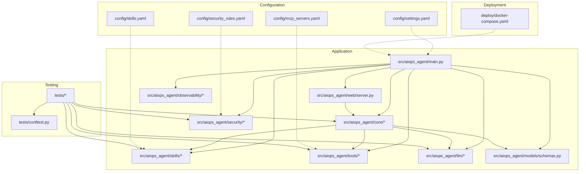
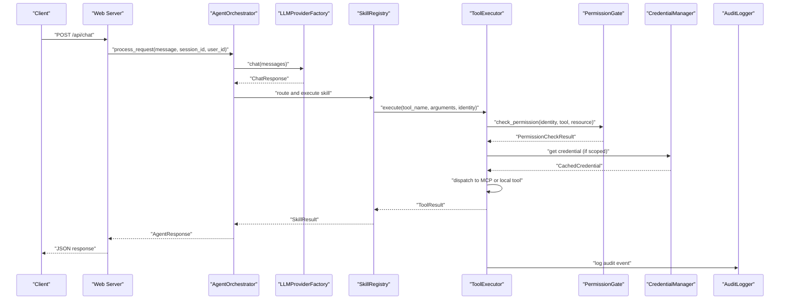
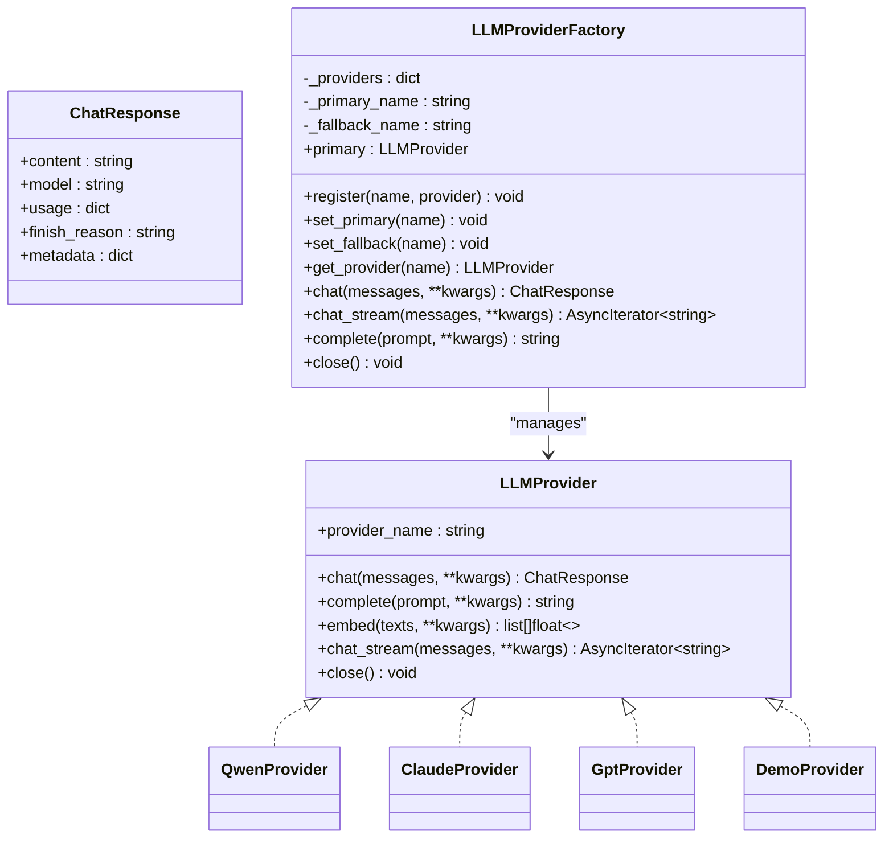
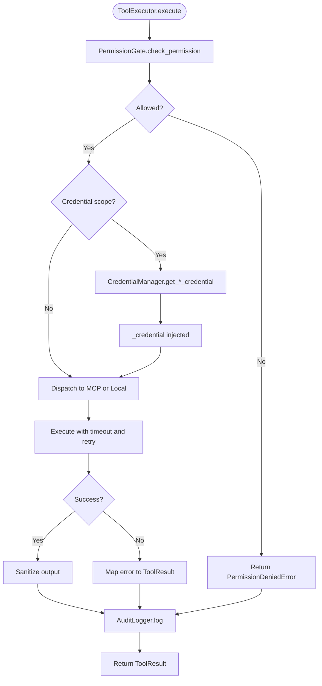
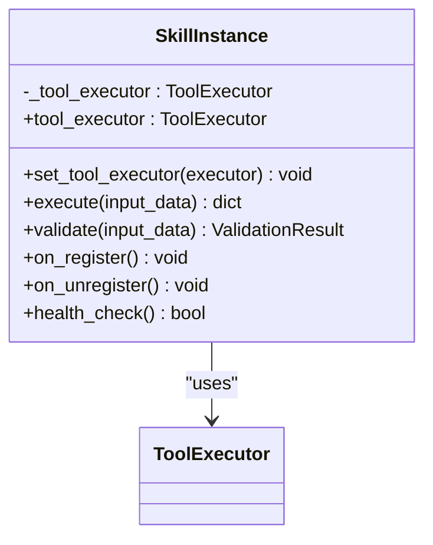
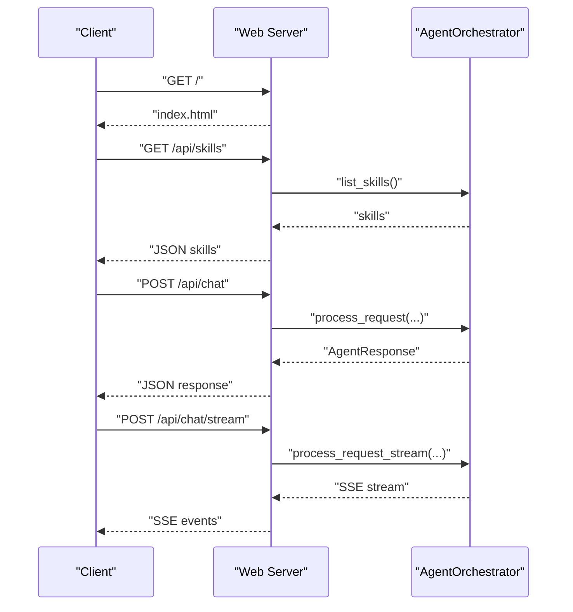
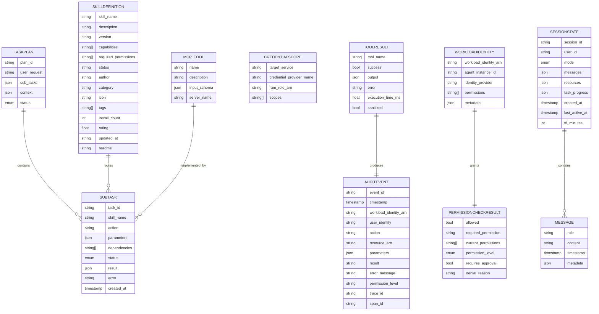
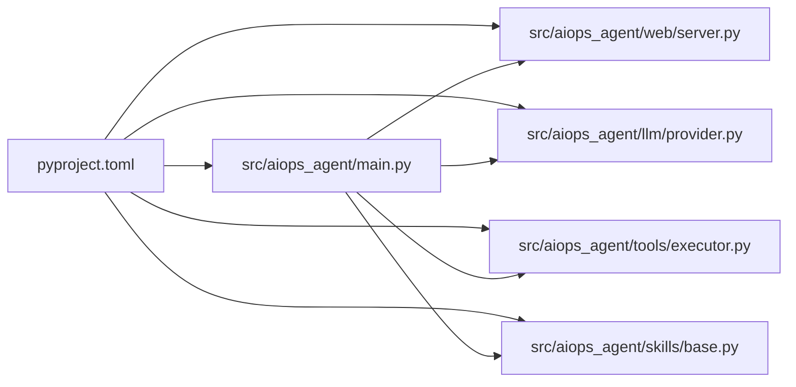
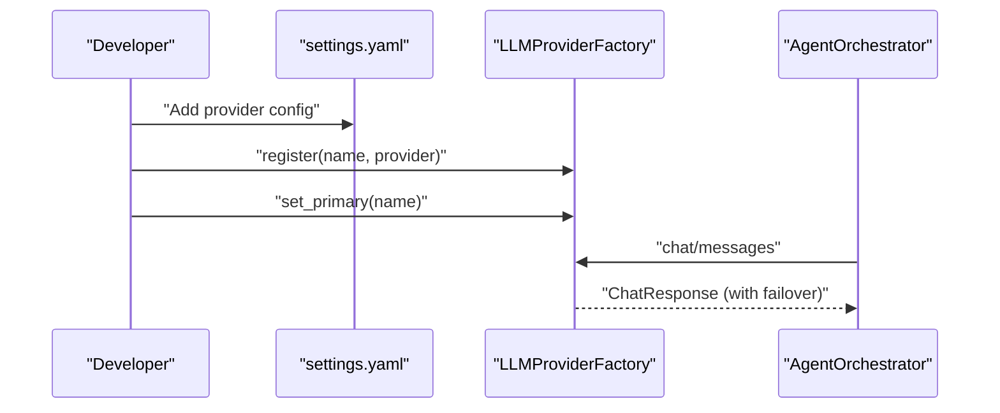

# Development Guide

<cite>
**Referenced Files in This Document**
- [README.md](file://README.md)
- [pyproject.toml](file://pyproject.toml)
- [src/aiops_agent/main.py](file://src/aiops_agent/main.py)
- [src/aiops_agent/web/server.py](file://src/aiops_agent/web/server.py)
- [src/aiops_agent/llm/provider.py](file://src/aiops_agent/llm/provider.py)
- [src/aiops_agent/tools/executor.py](file://src/aiops_agent/tools/executor.py)
- [src/aiops_agent/skills/base.py](file://src/aiops_agent/skills/base.py)
- [src/aiops_agent/models/schemas.py](file://src/aiops_agent/models/schemas.py)
- [config/settings.yaml](file://config/settings.yaml)
- [config/skills.yaml](file://config/skills.yaml)
- [config/mcp_servers.yaml](file://config/mcp_servers.yaml)
- [config/security_rules.yaml](file://config/security_rules.yaml)
- [deploy/docker-compose.yaml](file://deploy/docker-compose.yaml)
- [tests/conftest.py](file://tests/conftest.py)
</cite>

## Table of Contents
1. [Introduction](#introduction)
2. [Project Structure](#project-structure)
3. [Core Components](#core-components)
4. [Architecture Overview](#architecture-overview)
5. [Detailed Component Analysis](#detailed-component-analysis)
6. [Dependency Analysis](#dependency-analysis)
7. [Performance Considerations](#performance-considerations)
8. [Troubleshooting Guide](#troubleshooting-guide)
9. [Contribution Guidelines](#contribution-guidelines)
10. [Extending the System](#extending-the-system)
11. [Release and Maintenance](#release-and-maintenance)
12. [Appendices](#appendices)

## Introduction
This guide documents the development workflow, code standards, and best practices for contributing to AIOps Agent. It explains the project’s configuration, testing setup, environment requirements, and extension points for adding new skills, MCP servers, and LLM providers. It also covers the release process, versioning strategy, and maintenance procedures.

## Project Structure
The repository follows a modular structure organized by functional layers:
- src/aiops_agent: Application code organized by domain layers (core, skills, tools, llm, security, observability, web, models).
- config: YAML configurations for settings, skills, MCP servers, and security rules.
- tests: Unit and property-based tests with shared fixtures.
- deploy: Dockerfile and docker-compose for containerized development and deployment.
- docs: Documentation assets (e.g., task planner notes).
- Root configuration: pyproject.toml for packaging, dependencies, and pytest configuration.

**Diagram sources**
- [src/aiops_agent/main.py:1-311](file://src/aiops_agent/main.py#L1-L311)
- [src/aiops_agent/web/server.py:1-227](file://src/aiops_agent/web/server.py#L1-L227)
- [src/aiops_agent/llm/provider.py:1-242](file://src/aiops_agent/llm/provider.py#L1-L242)
- [src/aiops_agent/tools/executor.py:1-314](file://src/aiops_agent/tools/executor.py#L1-L314)
- [src/aiops_agent/skills/base.py:1-93](file://src/aiops_agent/skills/base.py#L1-L93)
- [src/aiops_agent/models/schemas.py:1-313](file://src/aiops_agent/models/schemas.py#L1-L313)
- [config/settings.yaml:1-85](file://config/settings.yaml#L1-L85)
- [config/skills.yaml:1-77](file://config/skills.yaml#L1-L77)
- [config/mcp_servers.yaml:1-41](file://config/mcp_servers.yaml#L1-L41)
- [config/security_rules.yaml:1-70](file://config/security_rules.yaml#L1-L70)
- [tests/conftest.py:1-215](file://tests/conftest.py#L1-L215)
- [deploy/docker-compose.yaml:1-25](file://deploy/docker-compose.yaml#L1-L25)

**Section sources**
- [README.md:64-126](file://README.md#L64-L126)

## Core Components
- Application entry and initialization: Orchestrator creation, Workload Identity, security components, LLM provider registration, skill registry, context manager, and tool executor.
- Web server: aiohttp routes for chat, streaming, health/ready checks, and skills listing.
- LLM abstraction: Provider interface and factory with automatic failover.
- Tool execution: Unified executor integrating permission gate, credentials, MCP/local tools, retry/backoff, sanitization, auditing, and tracing.
- Skills: Base skill interface with lifecycle hooks and dependency injection of ToolExecutor.
- Data models: Pydantic models for tasks, messages, tool results, identities, credentials, MCP tools, audit events, permissions, sessions, and skill definitions.

Key responsibilities and integration points are visible in the main entrypoint and web server.

**Section sources**
- [src/aiops_agent/main.py:70-222](file://src/aiops_agent/main.py#L70-L222)
- [src/aiops_agent/web/server.py:44-171](file://src/aiops_agent/web/server.py#L44-L171)
- [src/aiops_agent/llm/provider.py:97-242](file://src/aiops_agent/llm/provider.py#L97-L242)
- [src/aiops_agent/tools/executor.py:45-314](file://src/aiops_agent/tools/executor.py#L45-L314)
- [src/aiops_agent/skills/base.py:21-93](file://src/aiops_agent/skills/base.py#L21-L93)
- [src/aiops_agent/models/schemas.py:19-313](file://src/aiops_agent/models/schemas.py#L19-L313)

## Architecture Overview
High-level flow from user request to tool execution and response:

**Diagram sources**
- [src/aiops_agent/web/server.py:44-82](file://src/aiops_agent/web/server.py#L44-L82)
- [src/aiops_agent/main.py:212-222](file://src/aiops_agent/main.py#L212-L222)
- [src/aiops_agent/llm/provider.py:147-175](file://src/aiops_agent/llm/provider.py#L147-L175)
- [src/aiops_agent/tools/executor.py:80-226](file://src/aiops_agent/tools/executor.py#L80-L226)

## Detailed Component Analysis

### LLM Provider Factory and Abstraction
- Defines a uniform interface for chat, completion, embeddings, and streaming.
- Implements a factory with primary/fallback selection and automatic failover.
- Supports registering multiple providers and switching via configuration/environment.

**Diagram sources**
- [src/aiops_agent/llm/provider.py:31-242](file://src/aiops_agent/llm/provider.py#L31-L242)

**Section sources**
- [src/aiops_agent/llm/provider.py:97-242](file://src/aiops_agent/llm/provider.py#L97-L242)

### Tool Execution Pipeline
- Enforces permission checks, injects credentials when scoped, dispatches to MCP or local tools, retries on transient failures, sanitizes output, audits actions, and records telemetry.

**Diagram sources**
- [src/aiops_agent/tools/executor.py:80-226](file://src/aiops_agent/tools/executor.py#L80-L226)

**Section sources**
- [src/aiops_agent/tools/executor.py:45-314](file://src/aiops_agent/tools/executor.py#L45-L314)

### Skill Base and Lifecycle Hooks
- Provides a standardized interface for skills with execute/validate and optional lifecycle hooks (on_register, on_unregister, health_check).
- Supports injecting ToolExecutor for invoking tools.

**Diagram sources**
- [src/aiops_agent/skills/base.py:21-93](file://src/aiops_agent/skills/base.py#L21-L93)

**Section sources**
- [src/aiops_agent/skills/base.py:21-93](file://src/aiops_agent/skills/base.py#L21-L93)

### Web Server and API Endpoints
- Exposes endpoints for chat, streaming chat, health/ready checks, and skills listing.
- Uses a global orchestrator initialized on first request.

**Diagram sources**
- [src/aiops_agent/web/server.py:196-227](file://src/aiops_agent/web/server.py#L196-L227)

**Section sources**
- [src/aiops_agent/web/server.py:44-171](file://src/aiops_agent/web/server.py#L44-L171)

### Data Models Overview
- Centralized Pydantic models define task plans, messages, tool results, identities, credentials, MCP tool definitions, audit events, permissions, sessions, and skill definitions.

**Diagram sources**
- [src/aiops_agent/models/schemas.py:19-313](file://src/aiops_agent/models/schemas.py#L19-L313)

**Section sources**
- [src/aiops_agent/models/schemas.py:1-313](file://src/aiops_agent/models/schemas.py#L1-L313)

## Dependency Analysis
- Packaging and runtime dependencies are declared in pyproject.toml, including aiohttp, OpenTelemetry, Pydantic, YAML, Alibaba Cloud SDKs, and optional dev/test dependencies.
- The application entrypoint composes components and registers default skills, while the web server exposes HTTP endpoints backed by the orchestrator.

**Diagram sources**
- [pyproject.toml:1-46](file://pyproject.toml#L1-L46)
- [src/aiops_agent/main.py:20-41](file://src/aiops_agent/main.py#L20-L41)

**Section sources**
- [pyproject.toml:1-46](file://pyproject.toml#L1-L46)
- [src/aiops_agent/main.py:20-41](file://src/aiops_agent/main.py#L20-L41)

## Performance Considerations
- Asynchronous design: The application leverages asyncio/aiohttp for concurrency and non-blocking I/O.
- Retries and timeouts: Tool execution includes bounded retries and explicit timeouts to improve resilience.
- Observability: Structured logging, OpenTelemetry tracing, and metrics collection support performance monitoring.
- Recommendations:
  - Keep tool calls efficient and avoid unnecessary synchronous blocking.
  - Tune timeout and retry parameters in configuration for production workloads.
  - Monitor trace latency and error rates via metrics and logs.

[No sources needed since this section provides general guidance]

## Troubleshooting Guide
Common development issues and resolutions:
- Environment setup
  - Use uv for dependency synchronization and script execution as documented in the project README.
  - Ensure Python 3.10+ and uv are installed.
- Running the web server
  - Start the server using the module entrypoint as shown in the README.
  - Access the Chat UI at the localhost address indicated.
- Testing
  - Run tests with pytest as documented in the README.
  - Shared fixtures and Hypothesis profiles are configured in tests/conftest.py.
- Configuration
  - Verify settings.yaml for LLM providers, timeouts, retries, and observability.
  - Confirm MCP server configuration in config/mcp_servers.yaml.
  - Adjust security rules in config/security_rules.yaml for blacklists, rate limits, and anomaly detection.
- Data residency
  - The main entrypoint enforces allowed regions; ensure the configured region matches allowed values.
- Web API
  - Use the documented endpoints and ensure proper JSON payloads for chat requests.

**Section sources**
- [README.md:25-63](file://README.md#L25-L63)
- [tests/conftest.py:40-50](file://tests/conftest.py#L40-L50)
- [config/settings.yaml:1-85](file://config/settings.yaml#L1-L85)
- [config/mcp_servers.yaml:1-41](file://config/mcp_servers.yaml#L1-L41)
- [config/security_rules.yaml:1-70](file://config/security_rules.yaml#L1-L70)
- [src/aiops_agent/main.py:58-67](file://src/aiops_agent/main.py#L58-L67)
- [src/aiops_agent/web/server.py:44-82](file://src/aiops_agent/web/server.py#L44-L82)

## Contribution Guidelines
- Development workflow
  - Install dependencies using uv as described in the README.
  - Run tests with pytest to validate changes.
  - Use uv run to execute the web server during development.
- Code standards
  - Follow the existing code structure and module organization.
  - Use Pydantic models for data contracts and type hints for clarity.
  - Keep asynchronous patterns consistent; avoid blocking calls in async contexts.
- Testing expectations
  - Add unit tests under tests/.
  - Use shared fixtures from tests/conftest.py to simplify test setup.
  - Property-based tests can leverage Hypothesis profiles registered in conftest.
- Code review requirements
  - Ensure new features integrate cleanly with the orchestrator, skills, and tool execution pipeline.
  - Validate configuration updates and document any breaking changes.
  - Include tests covering new functionality and edge cases.
- IDE configuration recommendations
  - Configure Python interpreter to 3.10+.
  - Enable Pylance/PyCharm inspections and type checking.
  - Set up pre-commit hooks for formatting/linting if applicable.
- Debugging techniques
  - Utilize structured JSON logs and OpenTelemetry traces for end-to-end visibility.
  - Inspect audit logs for action trails and permission denials.
  - Use streaming chat endpoint to observe real-time progress.

**Section sources**
- [README.md:25-63](file://README.md#L25-L63)
- [tests/conftest.py:1-215](file://tests/conftest.py#L1-L215)
- [src/aiops_agent/web/server.py:85-135](file://src/aiops_agent/web/server.py#L85-L135)

## Extending the System
- Adding a new skill
  - Implement a class inheriting from the skill base and override execute/validate.
  - Register the skill in the default registry during agent initialization or via configuration.
  - Define capabilities and required permissions in skills configuration.
- Integrating a new MCP server
  - Add a new server entry in config/mcp_servers.yaml with transport and startup parameters.
  - Implement the MCP tool definitions and ensure tool names match skill/tool routing.
- Adding a new LLM provider
  - Implement the LLMProvider interface and register it with the factory.
  - Configure provider settings in settings.yaml and set primary/fallback as needed.

**Diagram sources**
- [config/settings.yaml:4-26](file://config/settings.yaml#L4-L26)
- [src/aiops_agent/llm/provider.py:116-175](file://src/aiops_agent/llm/provider.py#L116-L175)
- [src/aiops_agent/main.py:176-193](file://src/aiops_agent/main.py#L176-L193)

**Section sources**
- [src/aiops_agent/skills/base.py:21-93](file://src/aiops_agent/skills/base.py#L21-L93)
- [config/skills.yaml:1-77](file://config/skills.yaml#L1-L77)
- [config/mcp_servers.yaml:1-41](file://config/mcp_servers.yaml#L1-L41)
- [src/aiops_agent/llm/provider.py:97-242](file://src/aiops_agent/llm/provider.py#L97-L242)
- [config/settings.yaml:4-26](file://config/settings.yaml#L4-L26)
- [src/aiops_agent/main.py:176-193](file://src/aiops_agent/main.py#L176-L193)

## Release and Maintenance
- Versioning strategy
  - The project version is defined in pyproject.toml; adopt semantic versioning for releases.
- Release process
  - Build the package using the configured build backend.
  - Publish to a package index after validating tests and configuration.
- Maintenance procedures
  - Review configuration files for correctness before deployments.
  - Monitor observability signals and adjust timeouts/retries as needed.
  - Keep dependencies updated and test compatibility after upgrades.

**Section sources**
- [pyproject.toml:5-8](file://pyproject.toml#L5-L8)
- [config/settings.yaml:43-61](file://config/settings.yaml#L43-L61)

## Appendices

### Configuration Reference
- settings.yaml
  - LLM providers, timeouts, retries, orchestrator tuning, observability, and data residency.
- skills.yaml
  - Skill definitions, capabilities, permissions, and enablement flags.
- mcp_servers.yaml
  - MCP server transports, commands/URLs, and environment variables.
- security_rules.yaml
  - Sensitive field patterns, blacklist actions, rate limits, anomaly detection, and communication security.

**Section sources**
- [config/settings.yaml:1-85](file://config/settings.yaml#L1-L85)
- [config/skills.yaml:1-77](file://config/skills.yaml#L1-L77)
- [config/mcp_servers.yaml:1-41](file://config/mcp_servers.yaml#L1-L41)
- [config/security_rules.yaml:1-70](file://config/security_rules.yaml#L1-L70)

### Deployment Reference
- docker-compose.yaml
  - Local development stack exposing the web service and mounting configuration and volumes.

**Section sources**
- [deploy/docker-compose.yaml:1-25](file://deploy/docker-compose.yaml#L1-L25)