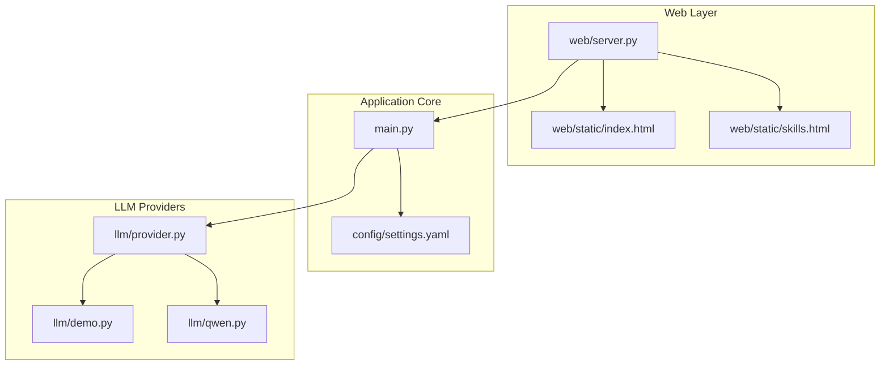
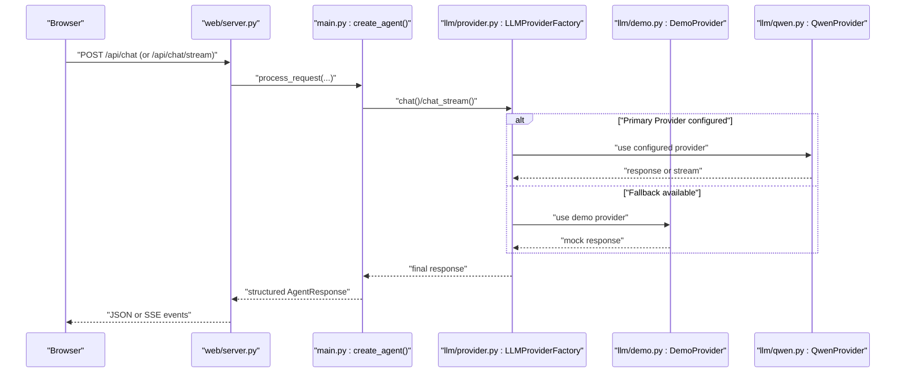
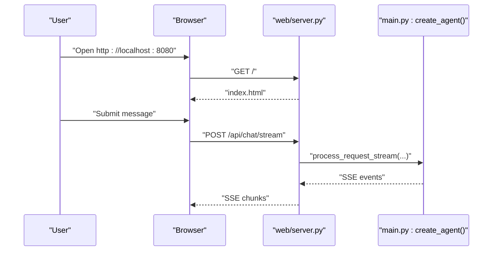
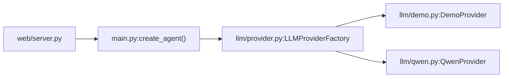
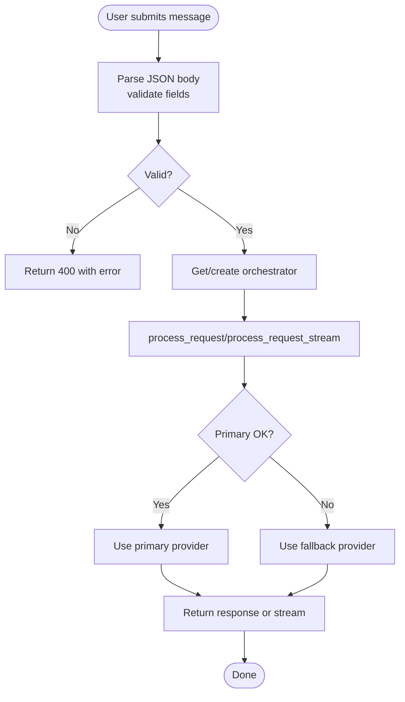

# Getting Started

<cite>
**Referenced Files in This Document**
- [README.md](file://README.md)
- [pyproject.toml](file://pyproject.toml)
- [src/aiops_agent/main.py](file://src/aiops_agent/main.py)
- [src/aiops_agent/web/server.py](file://src/aiops_agent/web/server.py)
- [config/settings.yaml](file://config/settings.yaml)
- [src/aiops_agent/llm/demo.py](file://src/aiops_agent/llm/demo.py)
- [src/aiops_agent/llm/qwen.py](file://src/aiops_agent/llm/qwen.py)
- [src/aiops_agent/llm/provider.py](file://src/aiops_agent/llm/provider.py)
- [src/aiops_agent/web/static/index.html](file://src/aiops_agent/web/static/index.html)
- [src/aiops_agent/web/static/skills.html](file://src/aiops_agent/web/static/skills.html)
- [tests/test_web_server.py](file://tests/test_web_server.py)
- [tests/test_demo_provider.py](file://tests/test_demo_provider.py)
</cite>

## Table of Contents
1. [Introduction](#introduction)
2. [Project Structure](#project-structure)
3. [Core Components](#core-components)
4. [Architecture Overview](#architecture-overview)
5. [Detailed Component Analysis](#detailed-component-analysis)
6. [Dependency Analysis](#dependency-analysis)
7. [Performance Considerations](#performance-considerations)
8. [Troubleshooting Guide](#troubleshooting-guide)
9. [Conclusion](#conclusion)
10. [Appendices](#appendices)

## Introduction
This guide helps you install, configure, and run the AIOps Agent locally using uv, launch the web service, and interact with it via the built-in Chat UI. It also explains the default demo LLM provider and how to switch to a real provider like Qwen API. Practical examples show how to send chat requests and interpret responses, along with verification steps and troubleshooting tips.

## Project Structure
AIOps Agent is organized around a modular Python package with a web server, orchestration core, skills, tools, security, observability, and LLM provider abstractions. The web server exposes REST endpoints and serves a Chat UI.

**Diagram sources**
- [src/aiops_agent/web/server.py:196-227](file://src/aiops_agent/web/server.py#L196-L227)
- [src/aiops_agent/main.py:70-222](file://src/aiops_agent/main.py#L70-L222)
- [config/settings.yaml:1-85](file://config/settings.yaml#L1-L85)
- [src/aiops_agent/llm/provider.py:97-242](file://src/aiops_agent/llm/provider.py#L97-L242)
- [src/aiops_agent/llm/demo.py:40-144](file://src/aiops_agent/llm/demo.py#L40-L144)
- [src/aiops_agent/llm/qwen.py:30-205](file://src/aiops_agent/llm/qwen.py#L30-L205)
- [src/aiops_agent/web/static/index.html:1-191](file://src/aiops_agent/web/static/index.html#L1-L191)
- [src/aiops_agent/web/static/skills.html:1-235](file://src/aiops_agent/web/static/skills.html#L1-L235)

**Section sources**
- [README.md:64-126](file://README.md#L64-L126)
- [src/aiops_agent/web/server.py:196-227](file://src/aiops_agent/web/server.py#L196-L227)
- [src/aiops_agent/main.py:70-222](file://src/aiops_agent/main.py#L70-L222)
- [config/settings.yaml:1-85](file://config/settings.yaml#L1-L85)

## Core Components
- Environment and installation: Python 3.10+ and uv package manager.
- Web server: aiohttp-based HTTP API with SSE streaming and embedded Chat UI.
- Orchestrator: initializes providers, skills, context, and tool execution.
- LLM providers: abstract interface with demo and Qwen implementations; supports primary/fallback selection and automatic degradation.
- Configuration: YAML-based settings for LLM, timeouts, retries, observability, and data residency.

**Section sources**
- [README.md:27-46](file://README.md#L27-L46)
- [pyproject.toml:10-25](file://pyproject.toml#L10-L25)
- [src/aiops_agent/web/server.py:44-135](file://src/aiops_agent/web/server.py#L44-L135)
- [src/aiops_agent/main.py:176-193](file://src/aiops_agent/main.py#L176-L193)
- [src/aiops_agent/llm/provider.py:97-242](file://src/aiops_agent/llm/provider.py#L97-L242)
- [config/settings.yaml:4-85](file://config/settings.yaml#L4-L85)

## Architecture Overview
High-level runtime flow from browser to orchestrator and provider selection.

**Diagram sources**
- [src/aiops_agent/web/server.py:44-135](file://src/aiops_agent/web/server.py#L44-L135)
- [src/aiops_agent/main.py:176-193](file://src/aiops_agent/main.py#L176-L193)
- [src/aiops_agent/llm/provider.py:147-209](file://src/aiops_agent/llm/provider.py#L147-L209)
- [src/aiops_agent/llm/demo.py:47-91](file://src/aiops_agent/llm/demo.py#L47-L91)
- [src/aiops_agent/llm/qwen.py:54-108](file://src/aiops_agent/llm/qwen.py#L54-L108)

## Detailed Component Analysis

### Environment Requirements and Installation
- Python: >= 3.10
- Package manager: uv (recommended)
- Install dependencies and extras with uv sync.
- Launch the web server via uv run.

Verification steps:
- Confirm Python version meets requirement.
- Run uv sync to install dependencies.
- Start the server and open the Chat UI in a browser.

**Section sources**
- [README.md:27-46](file://README.md#L27-L46)
- [pyproject.toml:10](file://pyproject.toml#L10)

### Quick Start: Launch the Web Service
- Start the server with uv run.
- Open the Chat UI at the default address.
- Use the UI to send chat requests; responses stream via SSE.

**Diagram sources**
- [src/aiops_agent/web/server.py:174-194](file://src/aiops_agent/web/server.py#L174-L194)
- [src/aiops_agent/web/server.py:85-135](file://src/aiops_agent/web/server.py#L85-L135)
- [src/aiops_agent/main.py:301-311](file://src/aiops_agent/main.py#L301-L311)

**Section sources**
- [README.md:39-46](file://README.md#L39-L46)
- [src/aiops_agent/web/static/index.html:80-134](file://src/aiops_agent/web/static/index.html#L80-L134)

### Default Demo LLM Provider Setup
- The demo provider is registered by default and set as primary when no QWEN_API_KEY is present.
- It performs keyword-based task decomposition and returns mock structured plans.
- Stream mode emits staged analysis fragments.

Key behaviors:
- Keyword-to-skill mapping drives task generation.
- Parameter extraction recognizes ECS/RDS identifiers.
- Stream mode yields staged content tokens.

**Section sources**
- [src/aiops_agent/main.py:178-181](file://src/aiops_agent/main.py#L178-L181)
- [src/aiops_agent/llm/demo.py:18-37](file://src/aiops_agent/llm/demo.py#L18-L37)
- [src/aiops_agent/llm/demo.py:98-144](file://src/aiops_agent/llm/demo.py#L98-L144)

### Configure Real LLM Providers (Qwen API)
- Copy the environment template to .env and set the QWEN_API_KEY variable.
- Export the key or load it via .env.
- Restart the server; the Qwen provider will be registered as primary and demo as fallback.

Configuration highlights:
- Provider selection and fallback are handled by the factory.
- Qwen provider uses OpenAI-compatible endpoints and supports streaming.

**Section sources**
- [README.md:49-56](file://README.md#L49-L56)
- [src/aiops_agent/main.py:184-192](file://src/aiops_agent/main.py#L184-L192)
- [src/aiops_agent/llm/qwen.py:30-53](file://src/aiops_agent/llm/qwen.py#L30-L53)

### API Endpoints and Request/Response Examples
- GET /: Serve Chat UI.
- GET /skills: List skills with metadata.
- GET /health: Health check.
- GET /ready: Readiness check.
- POST /api/chat: Non-streaming chat.
- POST /api/chat/stream: Streaming chat via SSE.

Example request body:
- message: Required string.
- session_id: Optional identifier.
- user_id: Optional identifier.

Typical response fields:
- success: Boolean indicating outcome.
- message: Human-readable summary.
- data: Provider-specific payload (e.g., task plan).
- error_code: Optional error code.
- suggestion: Optional hint.
- trace_id: Optional trace identifier.
- session_id: Echoed session identifier.

**Section sources**
- [README.md:128-158](file://README.md#L128-L158)
- [src/aiops_agent/web/server.py:44-82](file://src/aiops_agent/web/server.py#L44-L82)
- [src/aiops_agent/web/server.py:85-135](file://src/aiops_agent/web/server.py#L85-L135)

### Practical Examples: Sending Requests and Interpreting Responses
- From the Chat UI:
  - Submit a request like “check ECS instance i-xxxx CPU usage”.
  - Observe streaming events: planning, task lifecycle, token chunks, and completion summary.
  - Completion includes success flag, message, optional data, trace_id, and elapsed time.

- Via curl (non-streaming):
  - Send POST to /api/chat with a JSON body containing message and optional identifiers.
  - Expect a JSON response with success, message, and data fields.

- Via curl (streaming):
  - Send POST to /api/chat/stream with the same body.
  - Consume SSE events and parse event types and data payloads.

**Section sources**
- [src/aiops_agent/web/static/index.html:80-134](file://src/aiops_agent/web/static/index.html#L80-L134)
- [src/aiops_agent/web/server.py:44-82](file://src/aiops_agent/web/server.py#L44-L82)
- [src/aiops_agent/web/server.py:85-135](file://src/aiops_agent/web/server.py#L85-L135)

### Configuration Reference
- LLM providers: primary and fallback, model, API base, max tokens, temperature, timeout.
- Agent Identity: role ARN, OIDC provider ARN, region, session name, refresh window.
- Timeouts and retries: tool and skill execution windows.
- Observability: tracing, metrics, logging levels and formats.
- Data residency: allowed regions.

**Section sources**
- [config/settings.yaml:4-85](file://config/settings.yaml#L4-L85)

## Dependency Analysis
- The web server depends on the orchestrator initialization routine.
- The orchestrator composes the LLM provider factory and registers providers.
- The provider factory selects primary and fallback providers and handles automatic degradation.

**Diagram sources**
- [src/aiops_agent/web/server.py:32-36](file://src/aiops_agent/web/server.py#L32-L36)
- [src/aiops_agent/main.py:176-193](file://src/aiops_agent/main.py#L176-L193)
- [src/aiops_agent/llm/provider.py:97-242](file://src/aiops_agent/llm/provider.py#L97-L242)
- [src/aiops_agent/llm/demo.py:40-144](file://src/aiops_agent/llm/demo.py#L40-L144)
- [src/aiops_agent/llm/qwen.py:30-205](file://src/aiops_agent/llm/qwen.py#L30-L205)

**Section sources**
- [src/aiops_agent/web/server.py:32-36](file://src/aiops_agent/web/server.py#L32-L36)
- [src/aiops_agent/main.py:176-193](file://src/aiops_agent/main.py#L176-L193)
- [src/aiops_agent/llm/provider.py:97-242](file://src/aiops_agent/llm/provider.py#L97-L242)

## Performance Considerations
- Streaming responses reduce perceived latency and enable incremental UI updates.
- Provider selection with fallback improves resilience under partial outages.
- Adjust timeouts and retry parameters per workload needs in the settings file.

[No sources needed since this section provides general guidance]

## Troubleshooting Guide
Common issues and checks:
- Installation fails due to Python version:
  - Ensure Python >= 3.10.
- uv sync errors:
  - Verify uv is installed and your environment matches the project’s Python requirement.
- Web server does not start:
  - Confirm port 8080 is free; adjust host/port in the server runner if needed.
- Chat UI shows no response:
  - Check /health and /ready endpoints for status.
  - Validate that the orchestrator initializes providers (demo is always available; Qwen requires a valid key).
- Streaming stalls:
  - Inspect browser console for SSE parsing errors; confirm server returns proper SSE events.
- Provider errors:
  - For Qwen, ensure QWEN_API_KEY is exported and the model/API base align with configuration.
  - Review logs emitted by the server and observability stack.

Verification checklist:
- curl http://localhost:8080/health returns healthy.
- curl http://localhost:8080/ready returns ready.
- curl http://localhost:8080/api/skills lists skills.
- curl -N http://localhost:8080/api/chat/stream with a simple message streams events.

**Section sources**
- [tests/test_web_server.py:56-72](file://tests/test_web_server.py#L56-L72)
- [tests/test_web_server.py:159-191](file://tests/test_web_server.py#L159-L191)
- [src/aiops_agent/web/server.py:138-146](file://src/aiops_agent/web/server.py#L138-L146)
- [src/aiops_agent/web/static/index.html:80-134](file://src/aiops_agent/web/static/index.html#L80-L134)

## Conclusion
You now have everything needed to install AIOps Agent with uv, launch the web service, and interact with it using the Chat UI. The demo provider lets you explore the full workflow immediately, while switching to Qwen (or other providers) is straightforward via environment variables and configuration. Use the verification steps and troubleshooting tips to resolve common issues quickly.

[No sources needed since this section summarizes without analyzing specific files]

## Appendices

### Appendix A: End-to-End Flow for a Single Request

**Diagram sources**
- [src/aiops_agent/web/server.py:44-135](file://src/aiops_agent/web/server.py#L44-L135)
- [src/aiops_agent/llm/provider.py:147-209](file://src/aiops_agent/llm/provider.py#L147-L209)

### Appendix B: Demo Provider Behavior Details
- Keyword mapping determines skill selection.
- Parameter extraction identifies resource identifiers.
- Stream mode yields staged analysis segments.

**Section sources**
- [tests/test_demo_provider.py:22-98](file://tests/test_demo_provider.py#L22-L98)
- [tests/test_demo_provider.py:100-139](file://tests/test_demo_provider.py#L100-L139)
- [src/aiops_agent/llm/demo.py:98-144](file://src/aiops_agent/llm/demo.py#L98-L144)