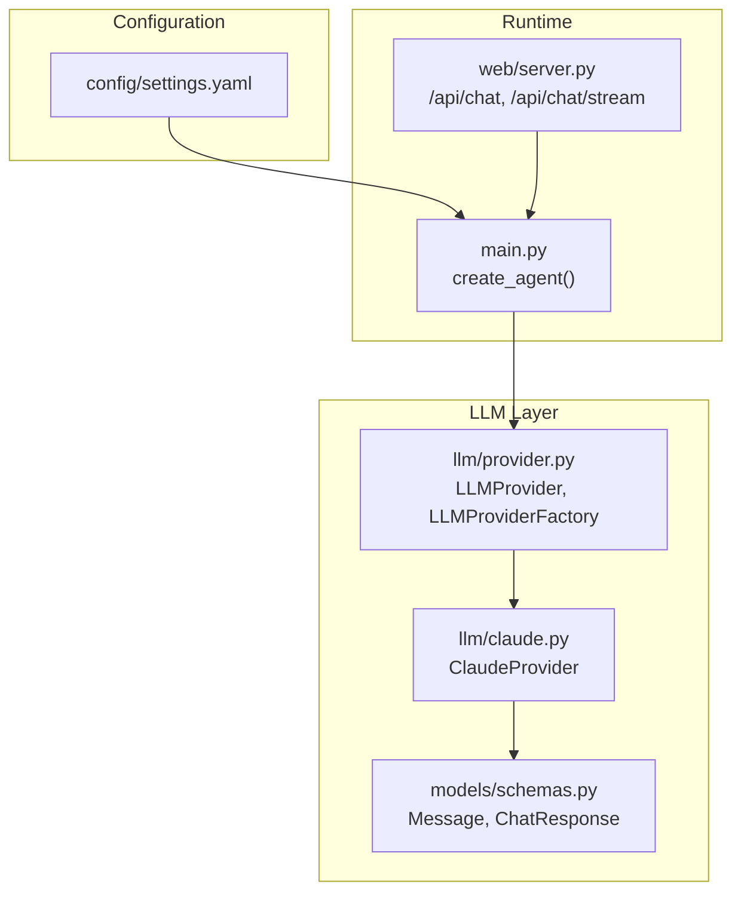
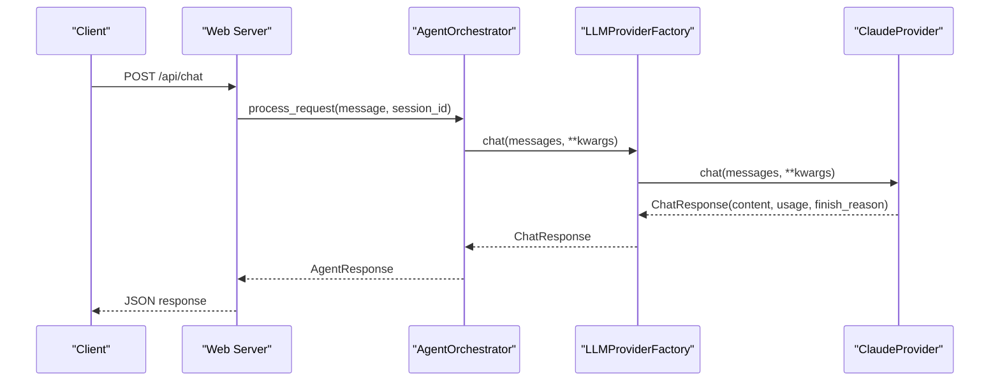
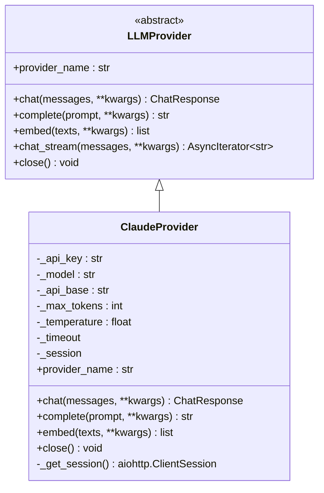
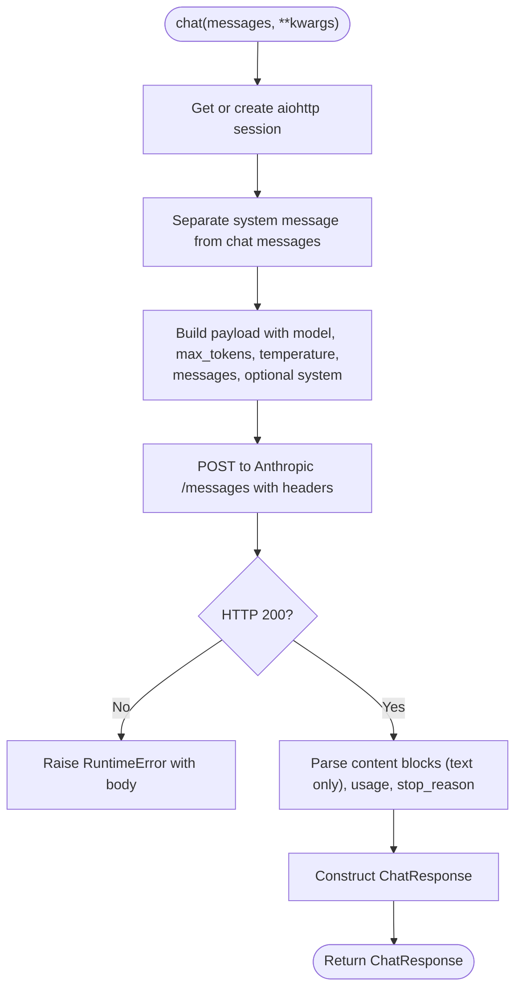
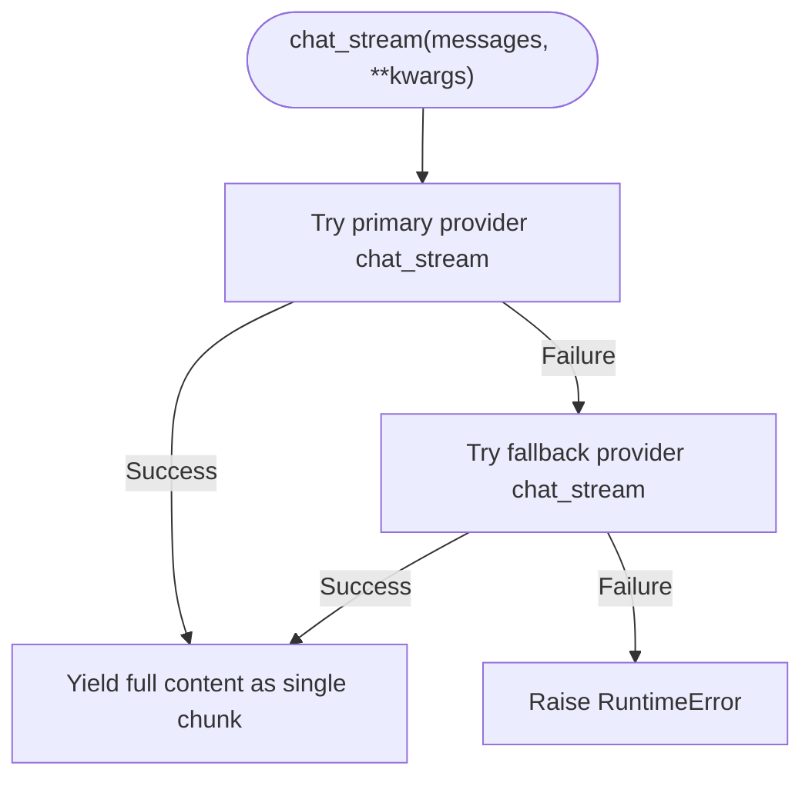
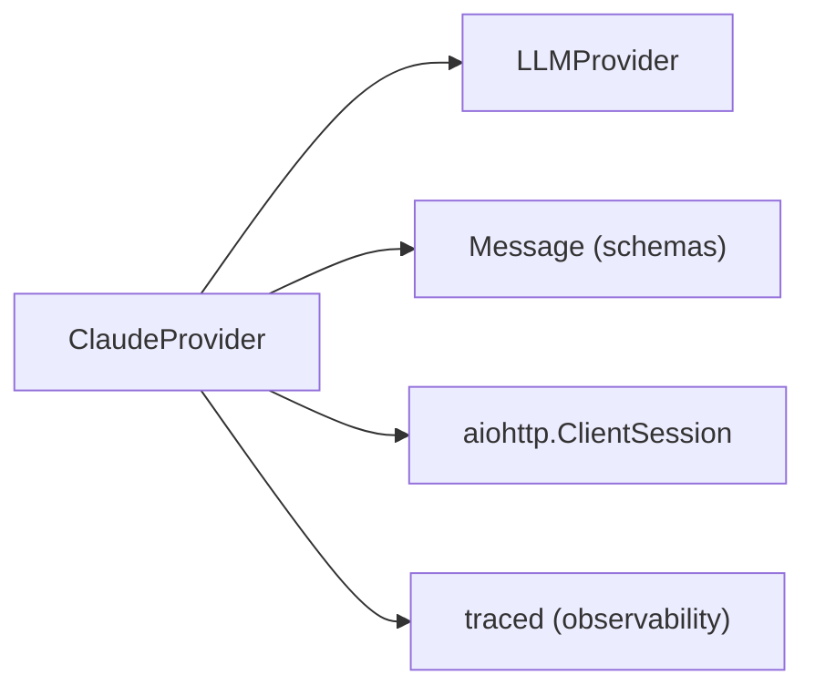

# Anthropic Claude Provider

<cite>
**Referenced Files in This Document**
- [claude.py](file://src/aiops_agent/llm/claude.py)
- [provider.py](file://src/aiops_agent/llm/provider.py)
- [schemas.py](file://src/aiops_agent/models/schemas.py)
- [settings.yaml](file://config/settings.yaml)
- [test_claude_provider.py](file://tests/test_claude_provider.py)
- [main.py](file://src/aiops_agent/main.py)
- [server.py](file://src/aiops_agent/web/server.py)
</cite>

## Table of Contents
1. [Introduction](#introduction)
2. [Project Structure](#project-structure)
3. [Core Components](#core-components)
4. [Architecture Overview](#architecture-overview)
5. [Detailed Component Analysis](#detailed-component-analysis)
6. [Dependency Analysis](#dependency-analysis)
7. [Performance Considerations](#performance-considerations)
8. [Troubleshooting Guide](#troubleshooting-guide)
9. [Conclusion](#conclusion)
10. [Appendices](#appendices)

## Introduction
This document explains the Anthropic Claude provider implementation in the AIOps agent. It covers API key configuration, model selection, parameter tuning, Claude-specific features, safety and content filtering considerations, chat interface integration, streaming capabilities, and completion endpoints. It also includes practical integration examples, performance optimization strategies, cost management recommendations, and best practices tailored to Claude within this codebase.

## Project Structure
The Claude provider is part of a unified LLM abstraction layer supporting multiple providers (Qwen, Claude, GPT). Configuration is centralized in YAML, and the web server exposes chat and streaming endpoints that route through the orchestrator to the selected provider.

**Diagram sources**
- [settings.yaml:1-85](file://config/settings.yaml#L1-L85)
- [provider.py:31-242](file://src/aiops_agent/llm/provider.py#L31-L242)
- [claude.py:20-118](file://src/aiops_agent/llm/claude.py#L20-L118)
- [schemas.py:64-96](file://src/aiops_agent/models/schemas.py#L64-L96)
- [main.py:70-222](file://src/aiops_agent/main.py#L70-L222)
- [server.py:44-135](file://src/aiops_agent/web/server.py#L44-L135)

**Section sources**
- [settings.yaml:1-85](file://config/settings.yaml#L1-L85)
- [provider.py:31-242](file://src/aiops_agent/llm/provider.py#L31-L242)
- [claude.py:20-118](file://src/aiops_agent/llm/claude.py#L20-L118)
- [schemas.py:64-96](file://src/aiops_agent/models/schemas.py#L64-L96)
- [main.py:70-222](file://src/aiops_agent/main.py#L70-L222)
- [server.py:44-135](file://src/aiops_agent/web/server.py#L44-L135)

## Core Components
- ClaudeProvider: Implements the Claude API integration, including chat, completion, and resource lifecycle management.
- LLMProviderFactory: Centralized provider registration and selection with primary/fallback support.
- Message and ChatResponse: Shared data models used across providers.
- Configuration: Provider defaults and timeouts are configured via YAML.

Key characteristics:
- Chat endpoint uses the Anthropic Messages API with system message separation and content block parsing.
- Completion delegates to chat with a single-user-message prompt.
- Embeddings are intentionally unsupported for Claude in this implementation.
- Streaming is supported at the factory level but not overridden by ClaudeProvider; it falls back to non-streaming.

**Section sources**
- [claude.py:20-118](file://src/aiops_agent/llm/claude.py#L20-L118)
- [provider.py:31-242](file://src/aiops_agent/llm/provider.py#L31-L242)
- [schemas.py:64-96](file://src/aiops_agent/models/schemas.py#L64-L96)
- [settings.yaml:14-25](file://config/settings.yaml#L14-L25)

## Architecture Overview
The Claude provider participates in a layered architecture:
- Web server exposes REST endpoints.
- Orchestrator routes requests to the LLM provider factory.
- Factory selects the primary provider (or falls back) and executes chat/completion.
- ClaudeProvider performs HTTP calls to the Anthropic API with required headers.

**Diagram sources**
- [server.py:44-82](file://src/aiops_agent/web/server.py#L44-L82)
- [provider.py:147-175](file://src/aiops_agent/llm/provider.py#L147-L175)
- [claude.py:45-96](file://src/aiops_agent/llm/claude.py#L45-L96)

## Detailed Component Analysis

### ClaudeProvider Implementation
ClaudeProvider extends the LLMProvider interface and implements:
- provider_name: Identifies the provider as "claude".
- chat: Sends a structured payload to the Anthropic Messages API, separates system messages, and parses text content blocks.
- complete: Wraps a prompt into a Message and reuses chat.
- embed: Not supported; raises NotImplementedError.
- close/_get_session: Manages an aiohttp client session with configurable timeout.

**Diagram sources**
- [provider.py:31-96](file://src/aiops_agent/llm/provider.py#L31-L96)
- [claude.py:20-118](file://src/aiops_agent/llm/claude.py#L20-L118)

**Section sources**
- [claude.py:20-118](file://src/aiops_agent/llm/claude.py#L20-L118)

### Chat Endpoint Flow (Claude-specific)
The chat method:
- Separates system messages from user/assistant messages.
- Builds a payload with model, max_tokens, temperature, and messages.
- Optionally includes a system field if present.
- Sends an HTTP POST to the Anthropic Messages API with Claude-specific headers.
- Parses the response, concatenating text content blocks and extracting usage and finish reason.

**Diagram sources**
- [claude.py:45-96](file://src/aiops_agent/llm/claude.py#L45-L96)

**Section sources**
- [claude.py:45-96](file://src/aiops_agent/llm/claude.py#L45-L96)

### Streaming Support
Streaming is defined in the base LLMProvider as a default fallback that yields the entire response as a single chunk. ClaudeProvider does not override this method, so streaming will fall back to non-streaming behavior in this implementation.

**Diagram sources**
- [provider.py:82-91](file://src/aiops_agent/llm/provider.py#L82-L91)
- [provider.py:177-209](file://src/aiops_agent/llm/provider.py#L177-L209)

**Section sources**
- [provider.py:82-91](file://src/aiops_agent/llm/provider.py#L82-L91)
- [provider.py:177-209](file://src/aiops_agent/llm/provider.py#L177-L209)

### Configuration and Model Selection
Configuration is loaded from YAML and influences provider defaults:
- Primary and fallback providers are set.
- Claude-specific defaults include model, API base, max_tokens, temperature, and timeout.

Integration points:
- create_agent registers providers and sets primary/fallback based on environment and configuration.
- The LLMProviderFactory resolves calls to the appropriate provider.

**Section sources**
- [settings.yaml:4-25](file://config/settings.yaml#L4-L25)
- [main.py:176-192](file://src/aiops_agent/main.py#L176-L192)
- [provider.py:97-138](file://src/aiops_agent/llm/provider.py#L97-L138)

### Safety Settings and Content Filtering
- The Claude provider does not expose safety settings or content filtering parameters in this implementation.
- Claude-specific headers (API key and version) are applied during requests.
- For production deployments, ensure proper guardrails and content moderation at the application level or via upstream policies.

**Section sources**
- [claude.py:67-75](file://src/aiops_agent/llm/claude.py#L67-L75)
- [test_claude_provider.py:186-215](file://tests/test_claude_provider.py#L186-L215)

### API Endpoints and Chat Interface
The web server exposes:
- POST /api/chat: Standard chat endpoint handled synchronously.
- POST /api/chat/stream: SSE-based streaming endpoint.

These endpoints forward to the orchestrator, which uses the LLM provider factory to select and call the provider.

**Section sources**
- [server.py:44-82](file://src/aiops_agent/web/server.py#L44-L82)
- [server.py:85-135](file://src/aiops_agent/web/server.py#L85-L135)

## Dependency Analysis
The Claude provider depends on:
- LLMProvider base class for method contracts.
- Message model for input representation.
- aiohttp for asynchronous HTTP communication.
- Tracing decorator for observability.

**Diagram sources**
- [claude.py:13-15](file://src/aiops_agent/llm/claude.py#L13-L15)
- [provider.py:31-41](file://src/aiops_agent/llm/provider.py#L31-L41)
- [schemas.py:64-71](file://src/aiops_agent/models/schemas.py#L64-L71)

**Section sources**
- [claude.py:13-15](file://src/aiops_agent/llm/claude.py#L13-L15)
- [provider.py:31-41](file://src/aiops_agent/llm/provider.py#L31-L41)
- [schemas.py:64-71](file://src/aiops_agent/models/schemas.py#L64-L71)

## Performance Considerations
- Timeout configuration: The Claude provider uses a configurable timeout for HTTP requests. Tune this according to latency expectations and SLAs.
- Token limits: Adjust max_tokens per request to balance quality and cost.
- Temperature tuning: Lower values increase determinism; higher values increase creativity. Choose based on use case.
- Session reuse: The provider lazily creates and reuses a single aiohttp session per instance to reduce connection overhead.
- Streaming: While ClaudeProvider does not implement streaming, enabling streaming at the factory level allows fallback behavior. If true streaming is desired, override chat_stream in ClaudeProvider.

[No sources needed since this section provides general guidance]

## Troubleshooting Guide
Common issues and diagnostics:
- Non-200 responses: The provider raises a runtime error with the HTTP status and body. Inspect logs for detailed failure information.
- Missing embeddings: ClaudeProvider raises NotImplementedError for embeddings. Use another provider if vectorization is required.
- Session lifecycle: Ensure close() is called to release resources when done.
- Headers verification: Tests confirm the presence of Claude-specific headers (API key and version). Verify these headers are present in requests.

**Section sources**
- [claude.py:76-78](file://src/aiops_agent/llm/claude.py#L76-L78)
- [claude.py:105-107](file://src/aiops_agent/llm/claude.py#L105-L107)
- [claude.py:109-112](file://src/aiops_agent/llm/claude.py#L109-L112)
- [test_claude_provider.py:140-147](file://tests/test_claude_provider.py#L140-L147)
- [test_claude_provider.py:174-178](file://tests/test_claude_provider.py#L174-L178)
- [test_claude_provider.py:222-230](file://tests/test_claude_provider.py#L222-L230)
- [test_claude_provider.py:186-215](file://tests/test_claude_provider.py#L186-L215)

## Conclusion
The Claude provider integrates with the Anthropic Messages API through a clean abstraction layer. It supports chat and completion, respects configuration-driven defaults, and fits into a broader system with streaming-capable orchestration. For production, pair Claude with application-level safety controls, monitor token usage, and tune parameters to meet quality and cost targets.

[No sources needed since this section summarizes without analyzing specific files]

## Appendices

### Practical Integration Examples
- Initialize Claude via configuration: Set the Claude provider defaults in the YAML configuration and ensure the primary provider is configured appropriately.
- Override parameters per call: Pass model, max_tokens, and temperature as keyword arguments to chat or complete to adjust behavior dynamically.
- Use streaming: Call the streaming endpoint; note that ClaudeProvider’s chat_stream falls back to non-streaming in this implementation.

**Section sources**
- [settings.yaml:14-25](file://config/settings.yaml#L14-L25)
- [claude.py:58-65](file://src/aiops_agent/llm/claude.py#L58-L65)
- [server.py:85-135](file://src/aiops_agent/web/server.py#L85-L135)

### Best Practices and Use Cases
- Model selection: Choose a Claude model aligned with your use case; the configuration provides a sensible default.
- Prompt engineering: Use system messages for role and behavior framing; keep prompts concise for cost efficiency.
- Cost management: Monitor input/output tokens via ChatResponse usage and adjust max_tokens and temperature accordingly.
- Reliability: Leverage the LLMProviderFactory’s primary/fallback mechanism to maintain availability.

**Section sources**
- [settings.yaml:14-25](file://config/settings.yaml#L14-L25)
- [provider.py:147-175](file://src/aiops_agent/llm/provider.py#L147-L175)
- [claude.py:88-96](file://src/aiops_agent/llm/claude.py#L88-L96)