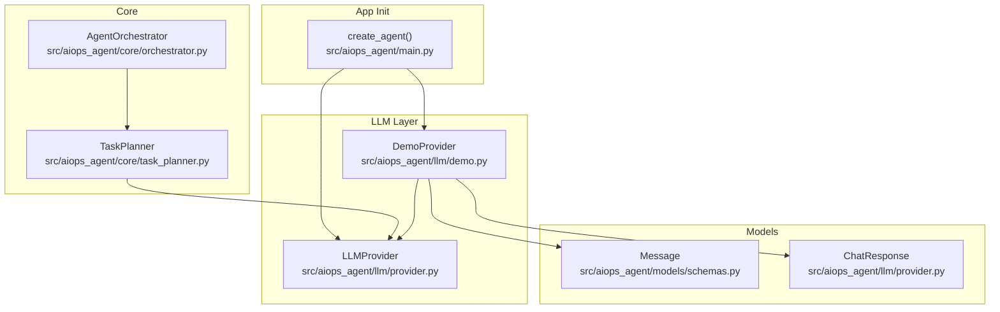
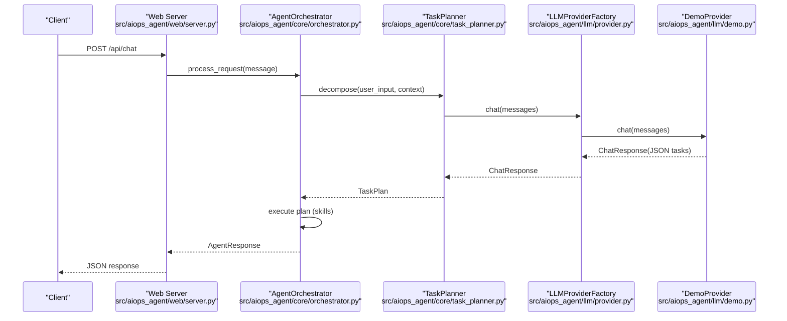
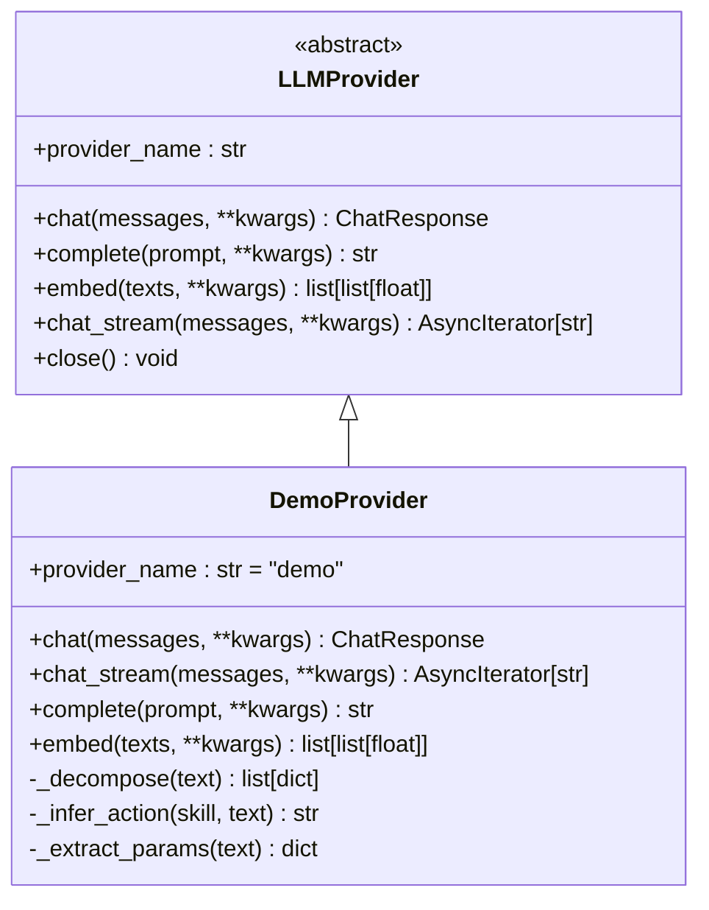
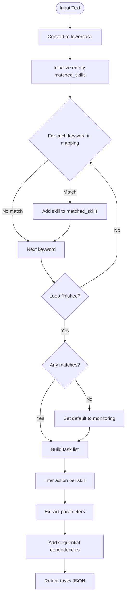
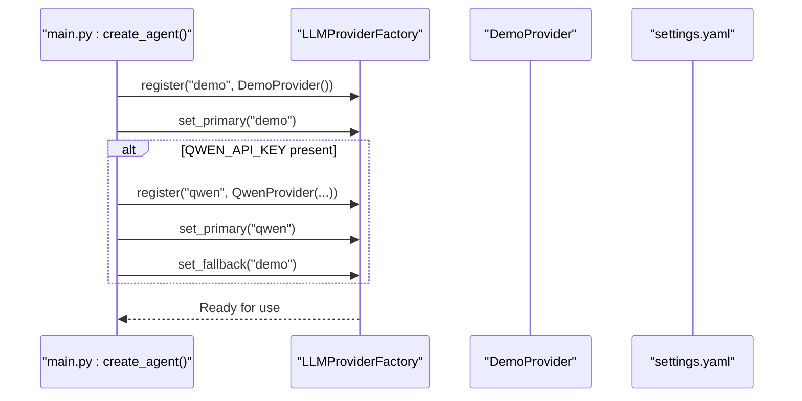
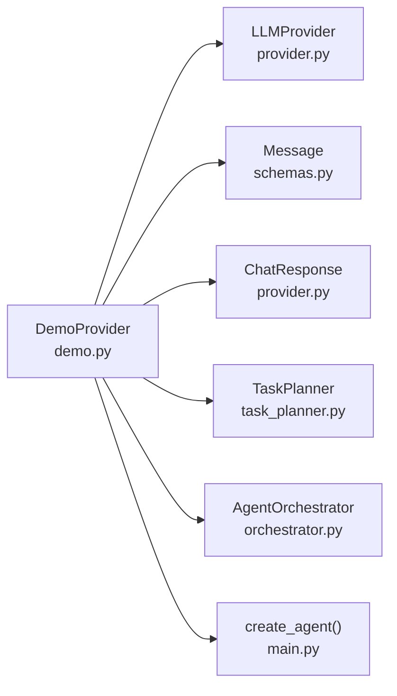

# Demo Provider

<cite>
**Referenced Files in This Document**
- [demo.py](file://src/aiops_agent/llm/demo.py)
- [provider.py](file://src/aiops_agent/llm/provider.py)
- [main.py](file://src/aiops_agent/main.py)
- [task_planner.py](file://src/aiops_agent/core/task_planner.py)
- [orchestrator.py](file://src/aiops_agent/core/orchestrator.py)
- [schemas.py](file://src/aiops_agent/models/schemas.py)
- [test_demo_provider.py](file://tests/test_demo_provider.py)
- [settings.yaml](file://config/settings.yaml)
- [README.md](file://README.md)
</cite>

## Table of Contents
1. [Introduction](#introduction)
2. [Project Structure](#project-structure)
3. [Core Components](#core-components)
4. [Architecture Overview](#architecture-overview)
5. [Detailed Component Analysis](#detailed-component-analysis)
6. [Dependency Analysis](#dependency-analysis)
7. [Performance Considerations](#performance-considerations)
8. [Troubleshooting Guide](#troubleshooting-guide)
9. [Conclusion](#conclusion)
10. [Appendices](#appendices)

## Introduction
The Demo provider is an internal LLM provider designed for development and testing. It enables local development and feature demonstrations without requiring external API keys or real cloud credentials. The provider simulates LLM behavior by performing keyword-based skill inference and returning structured task plans as JSON, enabling end-to-end testing of the orchestration pipeline.

Key benefits:
- Zero configuration required for local development
- Deterministic behavior for reliable unit tests
- Streamed responses for UI demos and integration testing
- Consistent interface with production providers for seamless transitions

## Project Structure
The Demo provider resides in the LLM abstraction layer alongside other providers (Qwen, Claude, GPT). It integrates with the Agent Orchestrator and Task Planner to enable full request processing workflows during development.

**Diagram sources**
- [demo.py:40-144](file://src/aiops_agent/llm/demo.py#L40-L144)
- [provider.py:31-92](file://src/aiops_agent/llm/provider.py#L31-L92)
- [main.py:176-182](file://src/aiops_agent/main.py#L176-L182)
- [task_planner.py:32-113](file://src/aiops_agent/core/task_planner.py#L32-L113)
- [orchestrator.py:47-79](file://src/aiops_agent/core/orchestrator.py#L47-L79)
- [schemas.py:64-71](file://src/aiops_agent/models/schemas.py#L64-L71)

**Section sources**
- [demo.py:1-144](file://src/aiops_agent/llm/demo.py#L1-L144)
- [provider.py:1-242](file://src/aiops_agent/llm/provider.py#L1-L242)
- [main.py:176-182](file://src/aiops_agent/main.py#L176-L182)

## Core Components
The Demo provider implements the LLMProvider interface with a simplified design focused on development workflows. It provides:
- Keyword-based skill inference using a predefined mapping
- Structured task decomposition returning JSON arrays
- Streamed response simulation for UI demos
- Dummy embeddings for vectorization testing
- Consistent ChatResponse format for downstream consumers

Key implementation characteristics:
- Uses a keyword-to-skill mapping dictionary for inference
- Generates sequential task IDs with dependency chains
- Returns zero-token usage for deterministic testing
- Provides both synchronous and streaming responses

**Section sources**
- [demo.py:40-144](file://src/aiops_agent/llm/demo.py#L40-L144)
- [provider.py:31-92](file://src/aiops_agent/llm/provider.py#L31-L92)

## Architecture Overview
The Demo provider participates in the full request lifecycle from web API to skill execution. The integration ensures that development and testing workflows mirror production behavior.

**Diagram sources**
- [server.py:44-82](file://src/aiops_agent/web/server.py#L44-L82)
- [orchestrator.py:84-194](file://src/aiops_agent/core/orchestrator.py#L84-L194)
- [task_planner.py:50-113](file://src/aiops_agent/core/task_planner.py#L50-L113)
- [provider.py:147-175](file://src/aiops_agent/llm/provider.py#L147-L175)
- [demo.py:47-61](file://src/aiops_agent/llm/demo.py#L47-L61)

## Detailed Component Analysis

### DemoProvider Class
The DemoProvider extends LLMProvider and implements all required methods with development-focused behavior.

**Diagram sources**
- [provider.py:31-92](file://src/aiops_agent/llm/provider.py#L31-L92)
- [demo.py:40-144](file://src/aiops_agent/llm/demo.py#L40-L144)

#### Keyword Matching and Skill Inference
The provider uses a keyword-to-skill mapping to infer appropriate skills from user input. The mapping covers monitoring, troubleshooting, and change management domains with both Chinese and English keywords.

Key features:
- Case-insensitive matching against user input
- Deduplication of matched skills
- Default fallback to monitoring skill
- Action inference based on skill type

#### Task Decomposition Algorithm
The decomposition process transforms natural language requests into structured task plans with dependencies.

**Diagram sources**
- [demo.py:98-121](file://src/aiops_agent/llm/demo.py#L98-L121)

#### Streamed Response Simulation
The provider simulates streaming responses by yielding pre-defined analysis segments with small delays, enabling UI demos and integration testing of streaming flows.

**Section sources**
- [demo.py:40-144](file://src/aiops_agent/llm/demo.py#L40-L144)

### Integration with Application Lifecycle
The Demo provider is registered during application startup and serves as the primary provider in development environments.

**Diagram sources**
- [main.py:176-192](file://src/aiops_agent/main.py#L176-L192)
- [settings.yaml:4-26](file://config/settings.yaml#L4-L26)

**Section sources**
- [main.py:176-192](file://src/aiops_agent/main.py#L176-L192)
- [settings.yaml:4-26](file://config/settings.yaml#L4-L26)

### Testing Utilities and Mock Responses
The provider's deterministic behavior makes it ideal for unit testing and integration testing scenarios.

Testing capabilities include:
- Keyword matching verification across multiple languages
- Parameter extraction from instance identifiers
- Task structure validation with required fields
- Streamed response tokenization for UI testing
- Embedding dimension validation for vectorization tests

**Section sources**
- [test_demo_provider.py:14-210](file://tests/test_demo_provider.py#L14-L210)

## Dependency Analysis
The Demo provider maintains loose coupling with the rest of the system through the LLMProvider interface and shared data models.

**Diagram sources**
- [demo.py:14-15](file://src/aiops_agent/llm/demo.py#L14-L15)
- [provider.py:20-29](file://src/aiops_agent/llm/provider.py#L20-L29)
- [schemas.py:64-71](file://src/aiops_agent/models/schemas.py#L64-L71)
- [task_planner.py:14-16](file://src/aiops_agent/core/task_planner.py#L14-L16)
- [orchestrator.py:24-38](file://src/aiops_agent/core/orchestrator.py#L24-L38)
- [main.py:179-180](file://src/aiops_agent/main.py#L179-L180)

Key dependency characteristics:
- Minimal external dependencies (only standard library and shared models)
- Strong separation between inference logic and orchestration
- Consistent data structures across the system
- Clear interface boundaries for easy mocking

**Section sources**
- [demo.py:14-15](file://src/aiops_agent/llm/demo.py#L14-L15)
- [provider.py:20-29](file://src/aiops_agent/llm/provider.py#L20-L29)
- [schemas.py:64-71](file://src/aiops_agent/models/schemas.py#L64-L71)

## Performance Considerations
The Demo provider is optimized for development performance rather than production throughput:
- Zero external API calls eliminate network latency
- In-memory keyword matching provides O(k) lookup where k is keyword count
- JSON serialization overhead is minimal for small task lists
- Streamed responses use small fixed-size chunks for UI responsiveness
- Deterministic behavior enables fast, repeatable tests

Production migration considerations:
- Replace with real providers (Qwen, Claude, GPT) for performance testing
- Monitor token usage and cost implications
- Consider caching strategies for repeated prompts
- Evaluate streaming performance with real LLM backends

## Troubleshooting Guide
Common issues and resolutions when using the Demo provider:

### Keyword Matching Issues
- Symptoms: Tasks default to monitoring despite relevant keywords
- Causes: Keywords not present in mapping or case sensitivity
- Solutions: Verify input contains mapped keywords; check case variations

### Parameter Extraction Failures
- Symptoms: Missing instance IDs in generated tasks
- Causes: Instance ID format not matching regex patterns
- Solutions: Ensure instance IDs follow expected patterns (i-/rm- with 8-17 hex digits)

### Task Structure Validation Errors
- Symptoms: Missing required fields in task JSON
- Causes: Incomplete decomposition logic
- Solutions: Review keyword mapping and action inference logic

### Streaming Response Problems
- Symptoms: Immediate completion instead of streamed tokens
- Causes: Client not handling SSE properly
- Solutions: Verify SSE client implementation and connection handling

**Section sources**
- [test_demo_provider.py:22-98](file://tests/test_demo_provider.py#L22-L98)
- [test_demo_provider.py:100-139](file://tests/test_demo_provider.py#L100-L139)
- [test_demo_provider.py:141-186](file://tests/test_demo_provider.py#L141-L186)

## Conclusion
The Demo provider serves as a crucial development and testing foundation for the AIOps Agent ecosystem. Its simplified interface, deterministic behavior, and comprehensive testing utilities enable rapid feature development, integration testing, and UI demos without external dependencies. The provider seamlessly integrates with the existing LLM abstraction layer, allowing for straightforward transitions to production providers while maintaining consistent behavior across the application stack.

## Appendices

### Configuration Options for Development
- Environment: No API keys required
- Primary provider: Automatically set to Demo in development
- Fallback: Can be configured to real providers when API keys are available
- Settings: Minimal configuration needed beyond default settings.yaml

### Response Customization Strategies
- Keyword mapping: Extend or modify the SKILL_MAP dictionary
- Action inference: Customize action selection logic per skill type
- Parameter extraction: Enhance regex patterns for new identifier formats
- Task structure: Modify task generation to include additional fields

### Integration Testing Strategies
- Unit tests: Leverage deterministic keyword matching and parameter extraction
- End-to-end tests: Use Demo provider for complete workflow validation
- UI testing: Utilize streamed responses for real-time feedback demonstrations
- Performance tests: Compare against production providers after migration

### Best Practices for Transitioning to Production
- Maintain identical interface contracts
- Preserve task structure compatibility
- Validate token usage and cost implications
- Test streaming behavior with real providers
- Implement proper error handling and retry logic
- Monitor latency and throughput differences

**Section sources**
- [README.md:47-48](file://README.md#L47-L48)
- [main.py:176-192](file://src/aiops_agent/main.py#L176-L192)