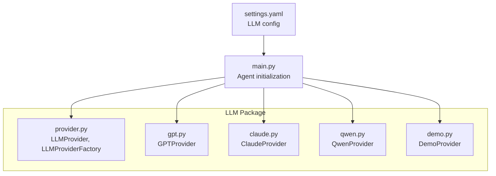
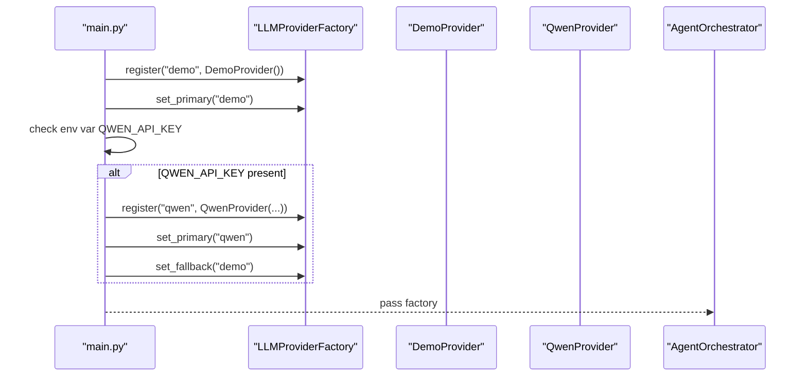
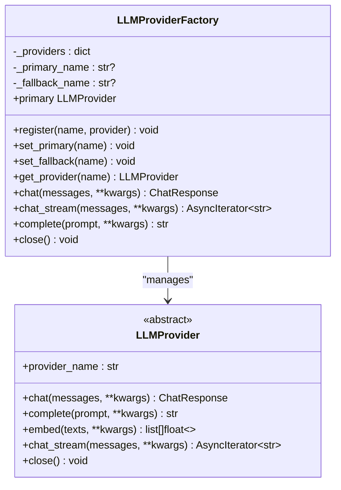
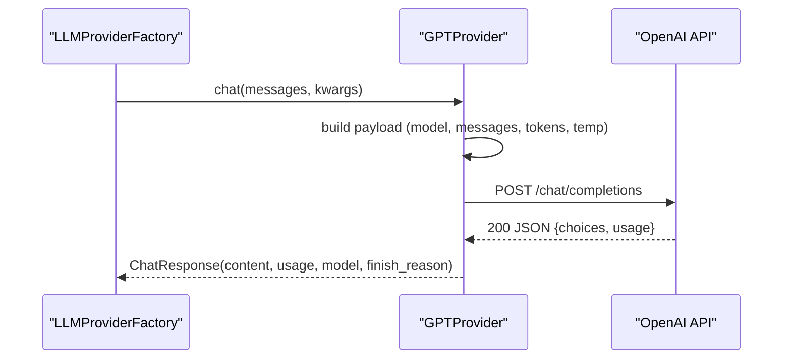
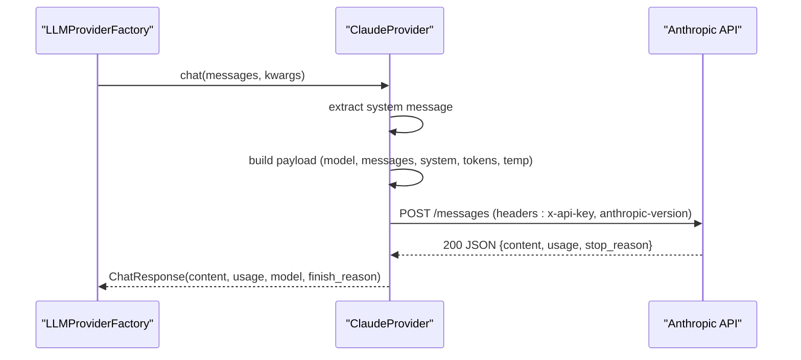
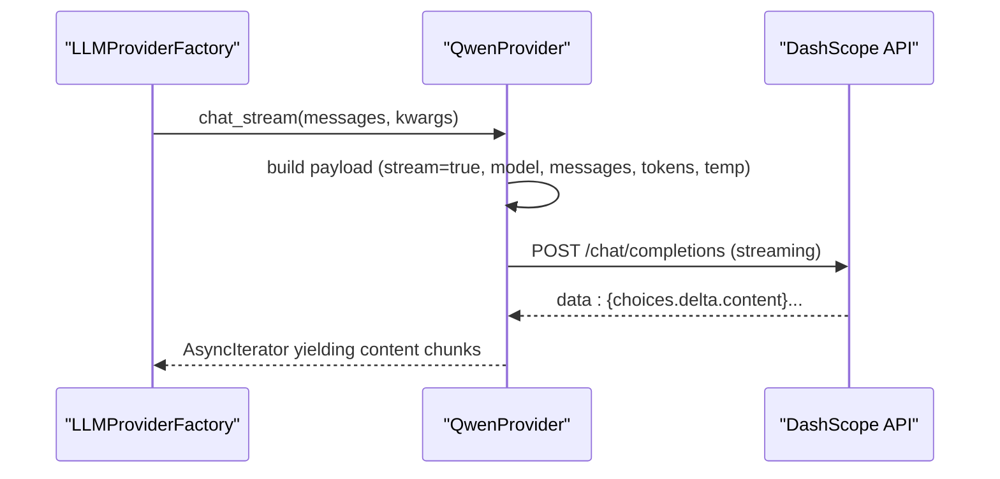
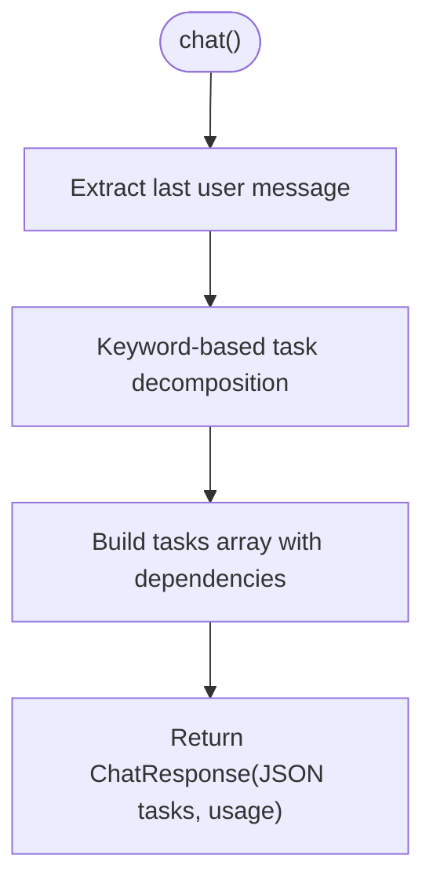
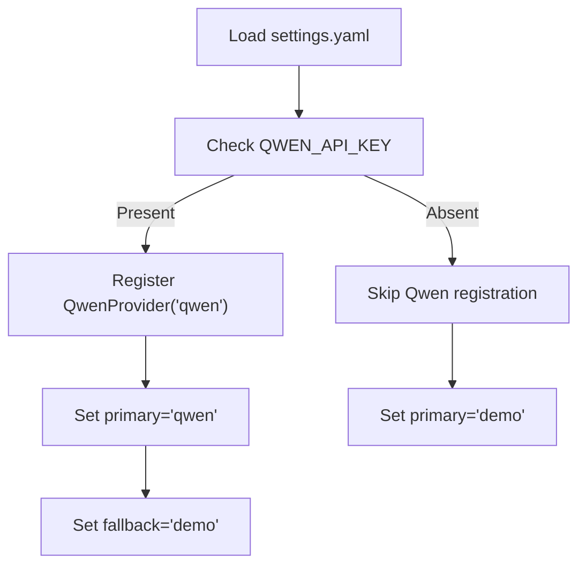
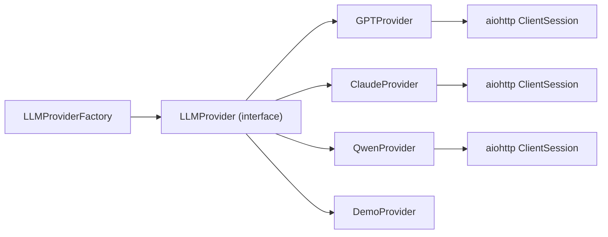

# LLM Integration

<cite>
**Referenced Files in This Document**
- [provider.py](file://src/aiops_agent/llm/provider.py)
- [gpt.py](file://src/aiops_agent/llm/gpt.py)
- [claude.py](file://src/aiops_agent/llm/claude.py)
- [qwen.py](file://src/aiops_agent/llm/qwen.py)
- [demo.py](file://src/aiops_agent/llm/demo.py)
- [settings.yaml](file://config/settings.yaml)
- [main.py](file://src/aiops_agent/main.py)
- [test_llm_provider.py](file://tests/test_llm_provider.py)
- [test_gpt_provider.py](file://tests/test_gpt_provider.py)
- [test_claude_provider.py](file://tests/test_claude_provider.py)
- [test_qwen_provider.py](file://tests/test_qwen_provider.py)
- [test_demo_provider.py](file://tests/test_demo_provider.py)
</cite>

## Table of Contents
1. [Introduction](#introduction)
2. [Project Structure](#project-structure)
3. [Core Components](#core-components)
4. [Architecture Overview](#architecture-overview)
5. [Detailed Component Analysis](#detailed-component-analysis)
6. [Dependency Analysis](#dependency-analysis)
7. [Performance Considerations](#performance-considerations)
8. [Troubleshooting Guide](#troubleshooting-guide)
9. [Conclusion](#conclusion)
10. [Appendices](#appendices)

## Introduction
This document explains the LLM integration capabilities of the AIOps Agent, focusing on the Provider Factory pattern and how multiple language model backends (OpenAI GPT, Anthropic Claude, Tongyi Qianwen) are supported simultaneously. It covers provider implementations, configuration and API key management, runtime selection and fallback, performance characteristics, cost optimization strategies, and best practices. Examples of provider usage and configuration options are included via file references.

## Project Structure
The LLM integration resides under the LLM package and is orchestrated by the main application and configuration files. Providers implement a shared interface and are registered with a factory that supports primary/fallback selection and automatic failover.

**Diagram sources**
- [provider.py:31-242](file://src/aiops_agent/llm/provider.py#L31-L242)
- [gpt.py:20-128](file://src/aiops_agent/llm/gpt.py#L20-L128)
- [claude.py:20-118](file://src/aiops_agent/llm/claude.py#L20-L118)
- [qwen.py:30-205](file://src/aiops_agent/llm/qwen.py#L30-L205)
- [demo.py:40-144](file://src/aiops_agent/llm/demo.py#L40-L144)
- [settings.yaml:4-26](file://config/settings.yaml#L4-L26)
- [main.py:176-193](file://src/aiops_agent/main.py#L176-L193)

**Section sources**
- [provider.py:1-242](file://src/aiops_agent/llm/provider.py#L1-L242)
- [gpt.py:1-128](file://src/aiops_agent/llm/gpt.py#L1-L128)
- [claude.py:1-118](file://src/aiops_agent/llm/claude.py#L1-L118)
- [qwen.py:1-205](file://src/aiops_agent/llm/qwen.py#L1-L205)
- [demo.py:1-144](file://src/aiops_agent/llm/demo.py#L1-L144)
- [settings.yaml:1-85](file://config/settings.yaml#L1-L85)
- [main.py:170-222](file://src/aiops_agent/main.py#L170-L222)

## Core Components
- LLMProvider: Abstract interface defining chat, complete, embed, and optional streaming chat_stream, plus lifecycle hooks.
- LLMProviderFactory: Registry and orchestrator enabling primary/fallback selection and automatic failover across providers.
- Provider Implementations:
  - GPTProvider: OpenAI-compatible chat completions and embeddings.
  - ClaudeProvider: Anthropic Claude messages API with system message separation.
  - QwenProvider: Aliyun DashScope OpenAI-compatible chat, streaming, and embeddings.
  - DemoProvider: Keyword-driven mock decomposition for development and demos.

Key behaviors:
- Unified response model via ChatResponse (content, model, usage, finish_reason, metadata).
- Optional streaming support per provider.
- Automatic resource cleanup via close().

**Section sources**
- [provider.py:20-95](file://src/aiops_agent/llm/provider.py#L20-L95)
- [provider.py:97-242](file://src/aiops_agent/llm/provider.py#L97-L242)
- [gpt.py:20-128](file://src/aiops_agent/llm/gpt.py#L20-L128)
- [claude.py:20-118](file://src/aiops_agent/llm/claude.py#L20-L118)
- [qwen.py:30-205](file://src/aiops_agent/llm/qwen.py#L30-L205)
- [demo.py:40-144](file://src/aiops_agent/llm/demo.py#L40-L144)

## Architecture Overview
The Agent initializes a factory, registers providers, sets primary and fallback, and exposes unified methods to the orchestrator. Configuration drives provider selection and defaults.

**Diagram sources**
- [main.py:176-193](file://src/aiops_agent/main.py#L176-L193)
- [provider.py:97-139](file://src/aiops_agent/llm/provider.py#L97-L139)

**Section sources**
- [main.py:170-222](file://src/aiops_agent/main.py#L170-L222)
- [settings.yaml:4-26](file://config/settings.yaml#L4-L26)

## Detailed Component Analysis

### LLMProvider and LLMProviderFactory
- LLMProvider defines the contract for chat, complete, embed, optional streaming chat_stream, and close.
- LLMProviderFactory manages registration, primary/fallback selection, and automatic failover for chat, chat_stream, and complete.

**Diagram sources**
- [provider.py:31-95](file://src/aiops_agent/llm/provider.py#L31-L95)
- [provider.py:97-242](file://src/aiops_agent/llm/provider.py#L97-L242)

**Section sources**
- [provider.py:31-242](file://src/aiops_agent/llm/provider.py#L31-L242)

### GPTProvider (OpenAI)
- Implements chat via OpenAI-compatible chat/completions endpoint.
- Supports embeddings via OpenAI embeddings endpoint.
- Uses aiohttp client sessions with timeouts and lazy initialization.
- Exposes provider_name "gpt".

**Diagram sources**
- [gpt.py:44-86](file://src/aiops_agent/llm/gpt.py#L44-L86)

**Section sources**
- [gpt.py:20-128](file://src/aiops_agent/llm/gpt.py#L20-L128)

### ClaudeProvider (Anthropic)
- Implements chat via Anthropic messages endpoint.
- Separates system messages and concatenates text content blocks.
- Uses Anthropic-specific headers and versioning.
- Does not support native embeddings (raises NotImplementedError).

**Diagram sources**
- [claude.py:44-96](file://src/aiops_agent/llm/claude.py#L44-L96)

**Section sources**
- [claude.py:20-118](file://src/aiops_agent/llm/claude.py#L20-L118)

### QwenProvider (Tongyi Qianwen)
- Implements chat, streaming chat_stream, and embeddings via Aliyun DashScope OpenAI-compatible endpoints.
- Supports optional reasoning content and enable_thinking via extra_body.
- Streams SSE-like chunks and yields incremental tokens.

**Diagram sources**
- [qwen.py:110-161](file://src/aiops_agent/llm/qwen.py#L110-L161)

**Section sources**
- [qwen.py:30-205](file://src/aiops_agent/llm/qwen.py#L30-L205)

### DemoProvider (Development and Testing)
- No API key required; returns deterministic task decomposition JSON based on keyword matching.
- Provides chat_stream simulation and dummy embeddings.
- Useful for local development and UI demos.

**Diagram sources**
- [demo.py:47-61](file://src/aiops_agent/llm/demo.py#L47-L61)

**Section sources**
- [demo.py:40-144](file://src/aiops_agent/llm/demo.py#L40-L144)

### Configuration and API Key Management
- Primary and fallback providers are configured in settings.yaml under llm.providers.
- At runtime, the main application checks for QWEN_API_KEY and conditionally registers and promotes Qwen as primary with Demo as fallback.
- Environment variables can override identity and OIDC configuration for agent identity.

**Diagram sources**
- [settings.yaml:4-26](file://config/settings.yaml#L4-L26)
- [main.py:184-193](file://src/aiops_agent/main.py#L184-L193)

**Section sources**
- [settings.yaml:4-26](file://config/settings.yaml#L4-L26)
- [main.py:176-193](file://src/aiops_agent/main.py#L176-L193)

## Dependency Analysis
- LLM providers depend on the shared LLMProvider interface and ChatResponse model.
- Providers rely on aiohttp for HTTP calls and are wrapped with tracing decorators for observability.
- The factory encapsulates provider lifecycle and failover logic, minimizing coupling between orchestration and provider specifics.

**Diagram sources**
- [provider.py:31-95](file://src/aiops_agent/llm/provider.py#L31-L95)
- [gpt.py:124-128](file://src/aiops_agent/llm/gpt.py#L124-L128)
- [claude.py:114-118](file://src/aiops_agent/llm/claude.py#L114-L118)
- [qwen.py:201-205](file://src/aiops_agent/llm/qwen.py#L201-L205)

**Section sources**
- [provider.py:31-242](file://src/aiops_agent/llm/provider.py#L31-L242)
- [gpt.py:1-128](file://src/aiops_agent/llm/gpt.py#L1-L128)
- [claude.py:1-118](file://src/aiops_agent/llm/claude.py#L1-L118)
- [qwen.py:1-205](file://src/aiops_agent/llm/qwen.py#L1-L205)
- [demo.py:1-144](file://src/aiops_agent/llm/demo.py#L1-L144)

## Performance Considerations
- Streaming: QwenProvider supports streaming chat_stream, reducing perceived latency for long responses.
- Session reuse: Providers lazily create and reuse aiohttp sessions with timeouts to reduce connection overhead.
- Token limits and temperature: Configure max_tokens and temperature per provider to balance quality and cost.
- Fallback strategy: Primary/fallback reduces downtime; ensure fallback is lighter or regionalized to minimize impact.
- Observability: Tracing decorators help identify slow providers or endpoints.

[No sources needed since this section provides general guidance]

## Troubleshooting Guide
Common issues and diagnostics:
- All providers unavailable: Factory raises runtime error when both primary and fallback fail; verify credentials and network.
- HTTP failures: Providers raise runtime errors on non-200 responses; inspect logs for HTTP status and body.
- Claude embeddings not supported: Expect NotImplementedError; use another provider for embeddings.
- DemoProvider for dev: Use when QWEN_API_KEY is absent; ensures local usability.

Validation via tests:
- Factory registration, primary/fallback, and fallback behavior are covered.
- Provider-specific behaviors (headers, usage, errors) validated in respective provider tests.

**Section sources**
- [test_llm_provider.py:85-145](file://tests/test_llm_provider.py#L85-L145)
- [test_claude_provider.py:174-179](file://tests/test_claude_provider.py#L174-L179)
- [test_gpt_provider.py:116-123](file://tests/test_gpt_provider.py#L116-L123)
- [test_qwen_provider.py:120-139](file://tests/test_qwen_provider.py#L120-L139)
- [test_demo_provider.py:141-173](file://tests/test_demo_provider.py#L141-L173)

## Conclusion
The LLM integration leverages a clean Provider interface and a Factory-based orchestration to support multiple backends concurrently. With configurable primary/fallback selection, robust error handling, and streaming capabilities, the system balances reliability, performance, and developer ergonomics. DemoProvider simplifies local development while production backends (GPT, Claude, Qwen) offer production-grade capabilities.

[No sources needed since this section summarizes without analyzing specific files]

## Appendices

### Provider Usage Examples and Configuration Options
- Initialize and use the factory programmatically:
  - Register providers, set primary and fallback, then call chat, chat_stream, or complete.
  - Reference: [provider.py:97-242](file://src/aiops_agent/llm/provider.py#L97-L242)
- Configure providers and selection:
  - Primary and fallback provider names, along with per-provider model, base URL, tokens, temperature, and timeout.
  - Reference: [settings.yaml:4-26](file://config/settings.yaml#L4-L26)
- Runtime provider selection:
  - The main application conditionally registers Qwen when QWEN_API_KEY is present and sets fallback to Demo.
  - Reference: [main.py:184-193](file://src/aiops_agent/main.py#L184-L193)
- Provider-specific options:
  - GPTProvider: model, api_base, max_tokens, temperature, timeout_seconds.
    - Reference: [gpt.py:23-38](file://src/aiops_agent/llm/gpt.py#L23-L38)
  - ClaudeProvider: model, api_base, max_tokens, temperature, timeout_seconds.
    - Reference: [claude.py:23-38](file://src/aiops_agent/llm/claude.py#L23-L38)
  - QwenProvider: model, api_base, max_tokens, temperature, timeout_seconds; supports enable_thinking via kwargs.
    - Reference: [qwen.py:33-48](file://src/aiops_agent/llm/qwen.py#L33-L48), [qwen.py:69-70](file://src/aiops_agent/llm/qwen.py#L69-L70)
- Cost optimization strategies:
  - Tune max_tokens and temperature to reduce token usage.
  - Prefer streaming for long responses to improve UX and detect early failures.
  - Use fallback to alternate providers during rate limits or outages.
  - Monitor usage via ChatResponse usage fields exposed by providers.
  - References: [gpt.py:76-85](file://src/aiops_agent/llm/gpt.py#L76-L85), [claude.py:88-96](file://src/aiops_agent/llm/claude.py#L88-L96), [qwen.py:98-108](file://src/aiops_agent/llm/qwen.py#L98-L108)