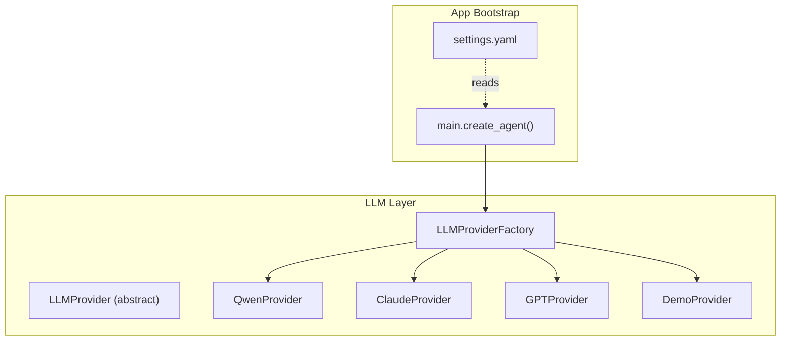
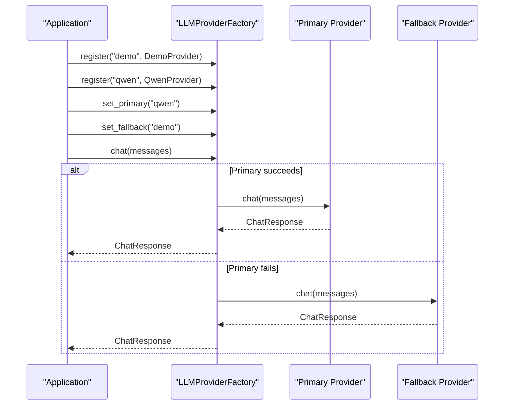
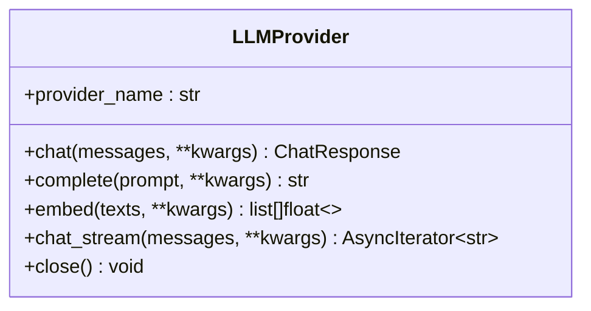
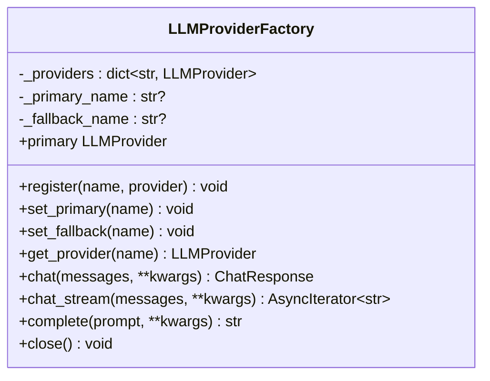
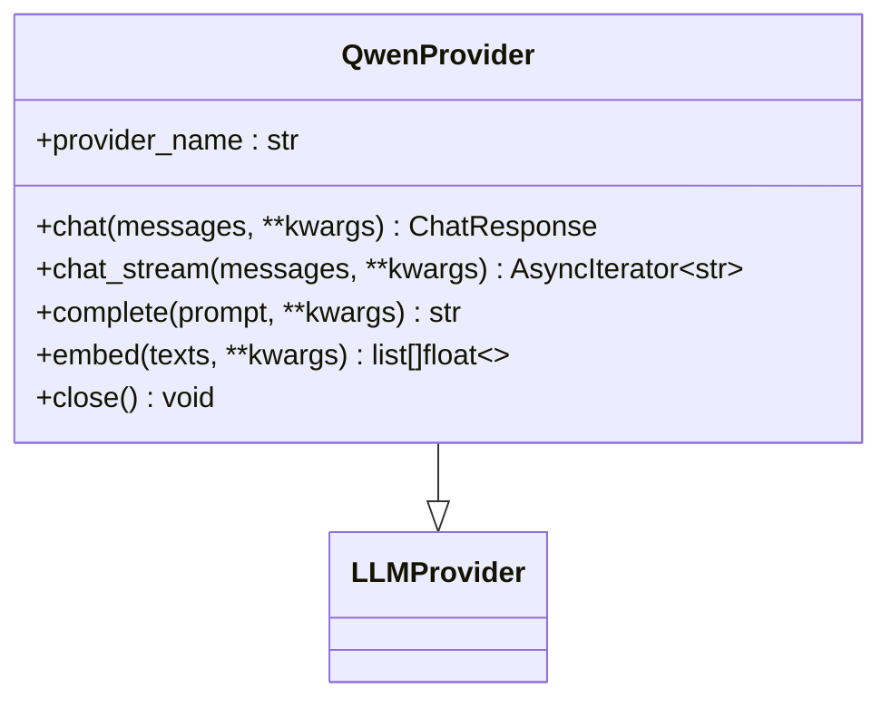
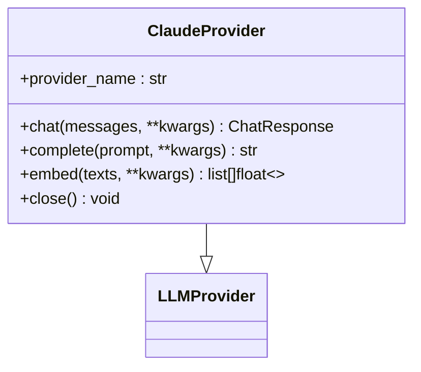
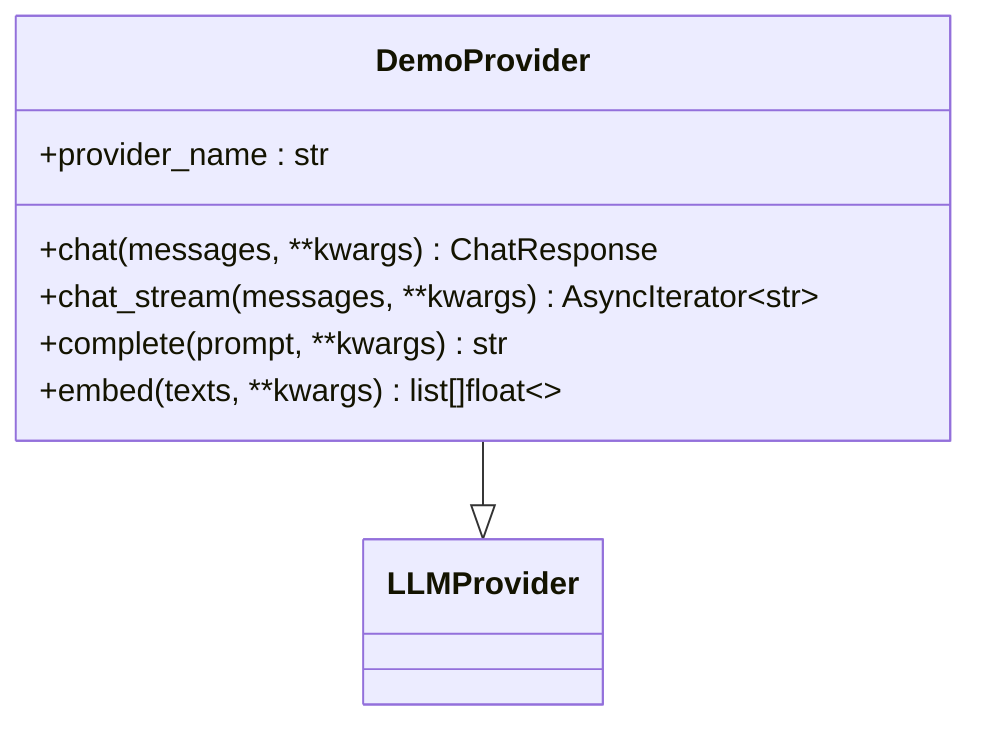
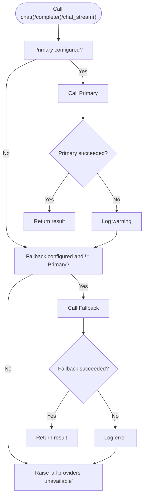
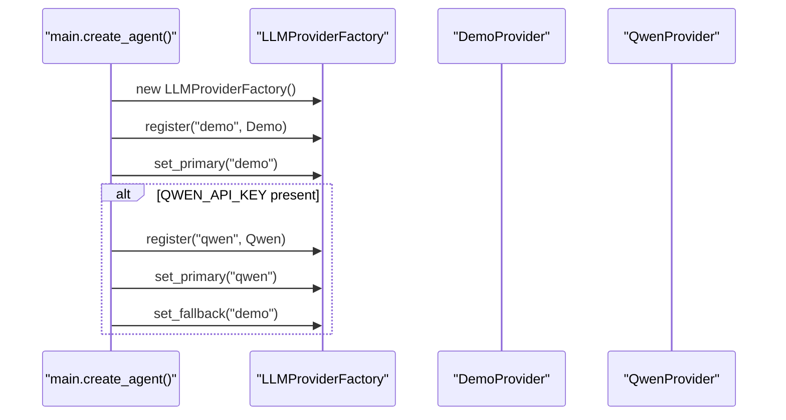
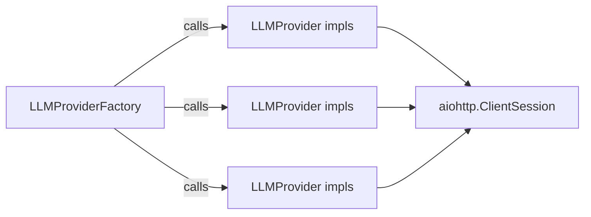

# LLM Provider Factory

<cite>
**Referenced Files in This Document**
- [provider.py](file://src/aiops_agent/llm/provider.py)
- [gpt.py](file://src/aiops_agent/llm/gpt.py)
- [claude.py](file://src/aiops_agent/llm/claude.py)
- [qwen.py](file://src/aiops_agent/llm/qwen.py)
- [demo.py](file://src/aiops_agent/llm/demo.py)
- [main.py](file://src/aiops_agent/main.py)
- [settings.yaml](file://config/settings.yaml)
- [test_llm_provider.py](file://tests/test_llm_provider.py)
- [test_gpt_provider.py](file://tests/test_gpt_provider.py)
- [test_claude_provider.py](file://tests/test_claude_provider.py)
- [test_qwen_provider.py](file://tests/test_qwen_provider.py)
- [test_demo_provider.py](file://tests/test_demo_provider.py)
</cite>

## Table of Contents
1. [Introduction](#introduction)
2. [Project Structure](#project-structure)
3. [Core Components](#core-components)
4. [Architecture Overview](#architecture-overview)
5. [Detailed Component Analysis](#detailed-component-analysis)
6. [Dependency Analysis](#dependency-analysis)
7. [Performance Considerations](#performance-considerations)
8. [Troubleshooting Guide](#troubleshooting-guide)
9. [Conclusion](#conclusion)
10. [Appendices](#appendices)

## Introduction
This document explains the LLM Provider Factory pattern implementation used to dynamically register multiple LLM backends, switch between primary and fallback providers, and enable automatic failover across chat, completion, and streaming interfaces. It documents factory initialization, provider registration, configuration management, lifecycle management, error handling, and best practices for provider selection and performance.

## Project Structure
The LLM subsystem resides under src/aiops_agent/llm and includes:
- An abstract provider interface and a concrete factory
- Multiple provider implementations (Qwen, Claude, GPT, Demo)
- Application bootstrap wiring that initializes the factory and sets up providers
- Configuration-driven provider selection via settings.yaml
- Comprehensive unit tests validating registration, failover, and lifecycle behavior

**Diagram sources**
- [provider.py:31-96](file://src/aiops_agent/llm/provider.py#L31-L96)
- [provider.py:97-242](file://src/aiops_agent/llm/provider.py#L97-L242)
- [qwen.py:30-205](file://src/aiops_agent/llm/qwen.py#L30-L205)
- [claude.py:20-118](file://src/aiops_agent/llm/claude.py#L20-L118)
- [gpt.py:20-128](file://src/aiops_agent/llm/gpt.py#L20-L128)
- [demo.py:40-144](file://src/aiops_agent/llm/demo.py#L40-L144)
- [main.py:176-192](file://src/aiops_agent/main.py#L176-L192)
- [settings.yaml:4-26](file://config/settings.yaml#L4-L26)

**Section sources**
- [provider.py:1-242](file://src/aiops_agent/llm/provider.py#L1-L242)
- [main.py:170-222](file://src/aiops_agent/main.py#L170-L222)
- [settings.yaml:4-26](file://config/settings.yaml#L4-L26)

## Core Components
- LLMProvider: Abstract base defining chat, complete, embed, and optional streaming interfaces. Includes a default streaming fallback and a close hook for resource cleanup.
- LLMProviderFactory: Central factory managing provider registration, primary/fallback selection, and automatic failover across chat, complete, and streaming calls. Provides lifecycle management via close.

Key responsibilities:
- Registration: register(name, provider) stores providers by name
- Selection: set_primary(name), set_fallback(name), get_provider(name), primary property
- Failover: chat(), complete(), chat_stream() attempt primary first, then fallback if configured and distinct from primary
- Lifecycle: close() invokes close() on all registered providers

**Section sources**
- [provider.py:31-96](file://src/aiops_agent/llm/provider.py#L31-L96)
- [provider.py:97-242](file://src/aiops_agent/llm/provider.py#L97-L242)

## Architecture Overview
The factory pattern decouples client code from specific provider implementations while enabling runtime configuration and failover. The application initializes the factory, registers providers, and optionally sets primary and fallback based on environment and configuration.

**Diagram sources**
- [provider.py:147-175](file://src/aiops_agent/llm/provider.py#L147-L175)
- [main.py:176-192](file://src/aiops_agent/main.py#L176-L192)

**Section sources**
- [provider.py:147-233](file://src/aiops_agent/llm/provider.py#L147-L233)
- [main.py:176-192](file://src/aiops_agent/main.py#L176-L192)

## Detailed Component Analysis

### LLMProvider and Streaming Behavior
- Defines the contract for chat, complete, embed, and optional streaming.
- Default chat_stream yields the entire content as a single chunk; providers may override for true streaming.
- close is a no-op hook intended to be overridden by providers to release resources.

**Diagram sources**
- [provider.py:31-96](file://src/aiops_agent/llm/provider.py#L31-L96)

**Section sources**
- [provider.py:31-96](file://src/aiops_agent/llm/provider.py#L31-L96)

### LLMProviderFactory
- Maintains an internal registry of providers and selected primary/fallback names.
- Exposes registration and selection APIs with validation.
- Implements automatic failover for chat, complete, and streaming calls.
- Ensures graceful resource cleanup via close.

**Diagram sources**
- [provider.py:97-242](file://src/aiops_agent/llm/provider.py#L97-L242)

**Section sources**
- [provider.py:97-242](file://src/aiops_agent/llm/provider.py#L97-L242)

### Provider Implementations

#### QwenProvider
- Implements chat, streaming chat, complete, and embed against DashScope-compatible endpoints.
- Supports optional reasoning content in responses and streaming via SSE-like chunks.
- Manages an aiohttp session lazily and closes it on demand.

**Diagram sources**
- [qwen.py:30-205](file://src/aiops_agent/llm/qwen.py#L30-L205)
- [provider.py:31-96](file://src/aiops_agent/llm/provider.py#L31-L96)

**Section sources**
- [qwen.py:30-205](file://src/aiops_agent/llm/qwen.py#L30-L205)

#### ClaudeProvider
- Implements chat, complete, and embed against Anthropic Messages API.
- Handles system messages and concatenates text content blocks.
- Embedding is not natively supported and raises NotImplementedError.

**Diagram sources**
- [claude.py:20-118](file://src/aiops_agent/llm/claude.py#L20-L118)
- [provider.py:31-96](file://src/aiops_agent/llm/provider.py#L31-L96)

**Section sources**
- [claude.py:20-118](file://src/aiops_agent/llm/claude.py#L20-L118)

#### GPTProvider
- Implements chat, complete, and embed against OpenAI-compatible endpoints.
- Uses a lazily created aiohttp session and supports configurable timeouts.

**Diagram sources**
- [gpt.py:20-128](file://src/aiops_agent/llm/gpt.py#L20-L128)
- [provider.py:31-96](file://src/aiops_agent/llm/provider.py#L31-L96)

**Section sources**
- [gpt.py:20-128](file://src/aiops_agent/llm/gpt.py#L20-L128)

#### DemoProvider
- Non-production provider for development and demos.
- Provides deterministic task decomposition and streaming simulation.

**Diagram sources**
- [demo.py:40-144](file://src/aiops_agent/llm/demo.py#L40-L144)
- [provider.py:31-96](file://src/aiops_agent/llm/provider.py#L31-L96)

**Section sources**
- [demo.py:40-144](file://src/aiops_agent/llm/demo.py#L40-L144)

### Automatic Failover Logic
The factory attempts the primary provider first; if it fails, it tries the fallback provider (if configured and different from primary). If both fail, it raises a runtime error indicating all providers are unavailable.

**Diagram sources**
- [provider.py:147-233](file://src/aiops_agent/llm/provider.py#L147-L233)

**Section sources**
- [provider.py:147-233](file://src/aiops_agent/llm/provider.py#L147-L233)

### Factory Initialization and Configuration Management
- The application constructs an LLMProviderFactory and registers providers.
- It registers a DemoProvider by default and sets it as primary.
- If a Qwen API key is present, it registers Qwen and sets it as primary and Demo as fallback.
- Configuration in settings.yaml defines provider models, endpoints, and timeouts; the application reads environment variables and applies them during provider construction.

**Diagram sources**
- [main.py:176-192](file://src/aiops_agent/main.py#L176-L192)
- [settings.yaml:4-26](file://config/settings.yaml#L4-L26)

**Section sources**
- [main.py:176-192](file://src/aiops_agent/main.py#L176-L192)
- [settings.yaml:4-26](file://config/settings.yaml#L4-L26)

## Dependency Analysis
- LLMProviderFactory depends on LLMProvider instances and orchestrates calls to them.
- Providers depend on aiohttp for HTTP transport and on shared tracing decorators for observability.
- The application wires the factory into the orchestrator and manages provider lifecycle alongside other components.

**Diagram sources**
- [provider.py:97-242](file://src/aiops_agent/llm/provider.py#L97-L242)
- [qwen.py:124-204](file://src/aiops_agent/llm/qwen.py#L124-L204)
- [claude.py:114-118](file://src/aiops_agent/llm/claude.py#L114-L118)
- [gpt.py:124-128](file://src/aiops_agent/llm/gpt.py#L124-L128)

**Section sources**
- [provider.py:97-242](file://src/aiops_agent/llm/provider.py#L97-L242)
- [qwen.py:124-204](file://src/aiops_agent/llm/qwen.py#L124-L204)
- [claude.py:114-118](file://src/aiops_agent/llm/claude.py#L114-L118)
- [gpt.py:124-128](file://src/aiops_agent/llm/gpt.py#L124-L128)

## Performance Considerations
- Prefer streaming APIs where supported (QwenProvider) to reduce latency and improve responsiveness.
- Configure timeouts per provider to avoid long blocking calls; the providers already accept timeout_seconds.
- Reuse sessions when possible; providers lazily create and reuse aiohttp sessions.
- Monitor usage fields returned by providers to track token consumption and optimize prompts.
- Keep primary provider reliable and fast; use fallback for resilience rather than performance.

[No sources needed since this section provides general guidance]

## Troubleshooting Guide
Common issues and strategies:
- All providers unavailable: The factory raises a runtime error when both primary and fallback fail. Verify provider registration and credentials.
- Primary provider errors: The factory logs warnings and attempts fallback. Inspect logs for detailed error messages.
- Fallback provider errors: The factory logs errors and raises a runtime error if both fail.
- Provider lifecycle: Call factory.close() to release resources; failures in individual provider.close() are suppressed and logged.

Validation and behavior are covered by tests:
- Registration and retrieval semantics
- Primary/fallback setting and property access
- Automatic failover for chat and complete
- Stream fallback behavior
- Lifecycle close semantics

**Section sources**
- [test_llm_provider.py:18-254](file://tests/test_llm_provider.py#L18-L254)
- [provider.py:147-242](file://src/aiops_agent/llm/provider.py#L147-L242)

## Conclusion
The LLM Provider Factory pattern cleanly separates concerns, supports dynamic registration and selection, and provides robust automatic failover across chat, completion, and streaming. Combined with configuration-driven setup and comprehensive testing, it offers a flexible, observable, and resilient foundation for multi-provider LLM integration.

[No sources needed since this section summarizes without analyzing specific files]

## Appendices

### Practical Usage Examples
- Initialize factory and register providers
- Set primary and fallback
- Invoke chat, complete, or chat_stream
- Close factory to release resources

These steps are demonstrated in the application bootstrap and tests.

**Section sources**
- [main.py:176-192](file://src/aiops_agent/main.py#L176-L192)
- [test_llm_provider.py:88-145](file://tests/test_llm_provider.py#L88-L145)

### Provider Selection Best Practices
- Choose a primary provider with low latency and high availability for typical workloads.
- Select a fallback provider with similar capabilities for resilience.
- Use environment variables and configuration files to manage provider credentials and endpoints.
- Monitor usage and latency metrics to inform provider selection decisions.

**Section sources**
- [settings.yaml:4-26](file://config/settings.yaml#L4-L26)
- [main.py:184-192](file://src/aiops_agent/main.py#L184-L192)