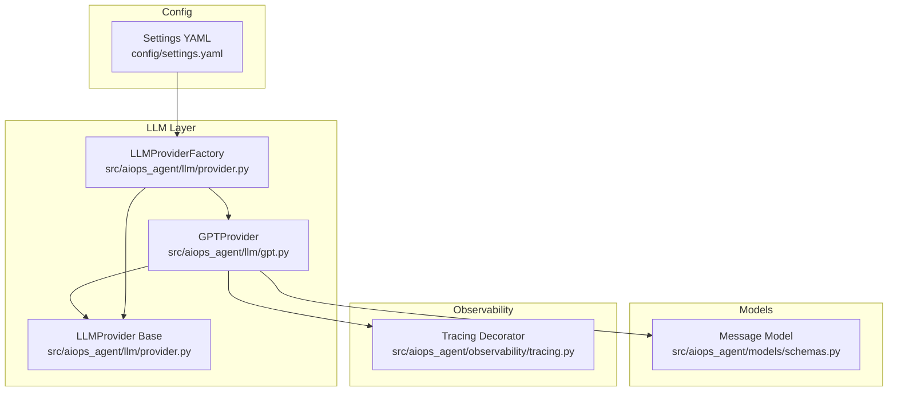
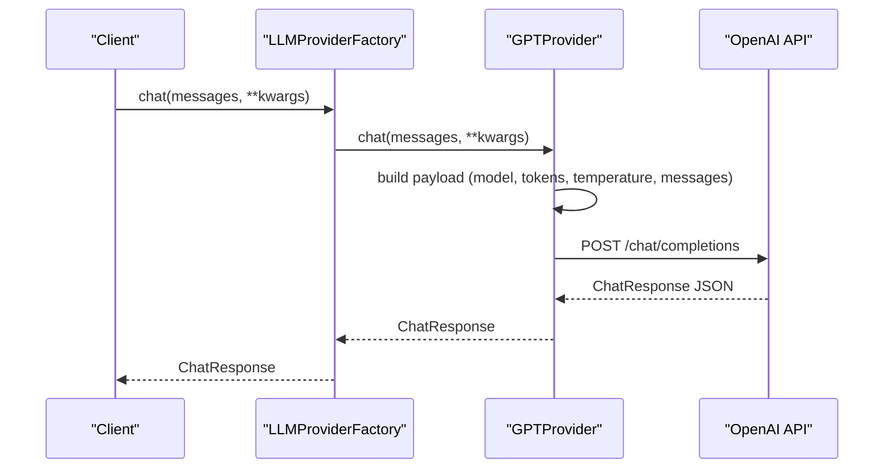
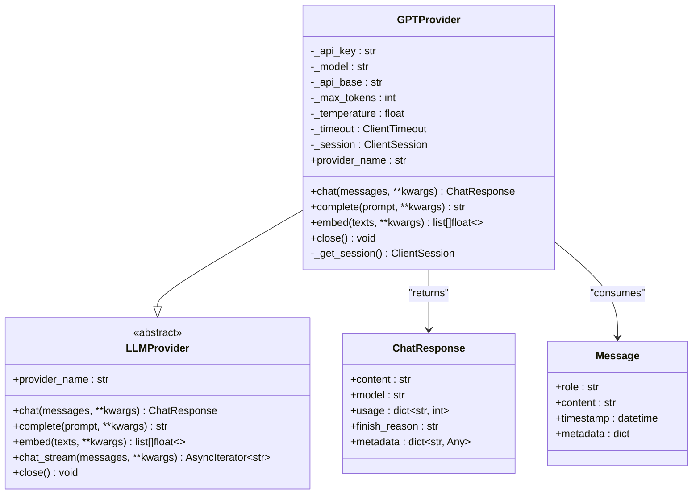
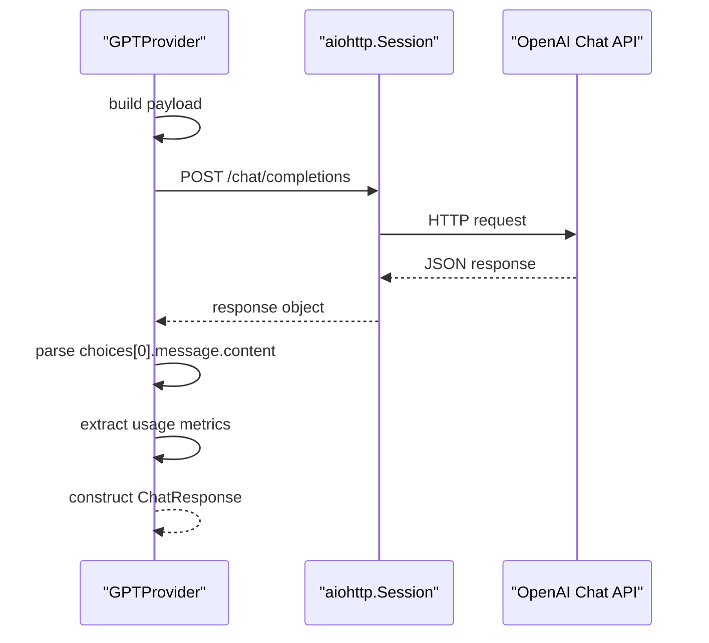
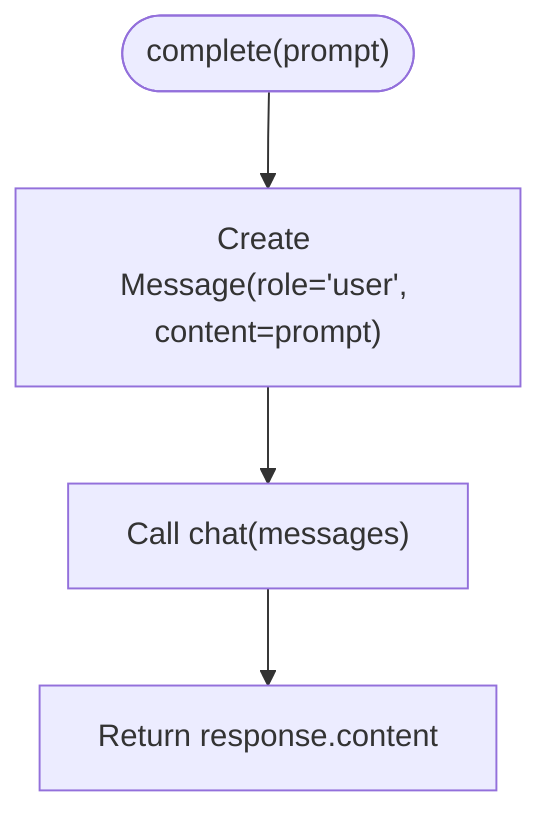
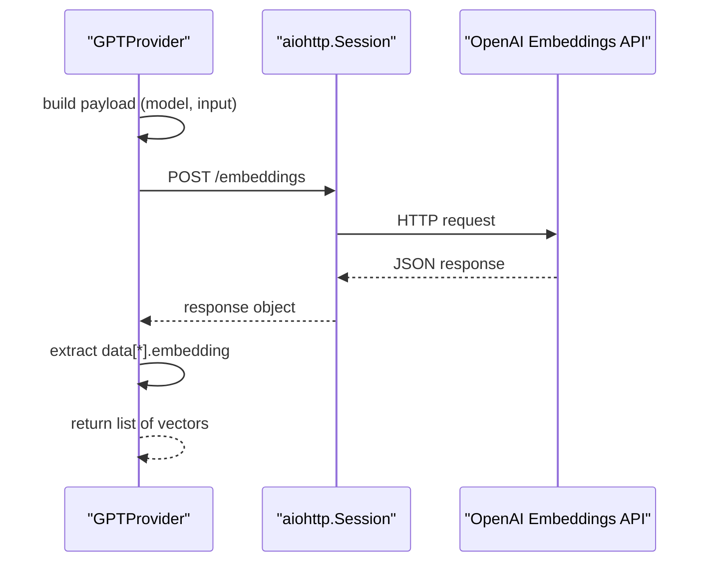
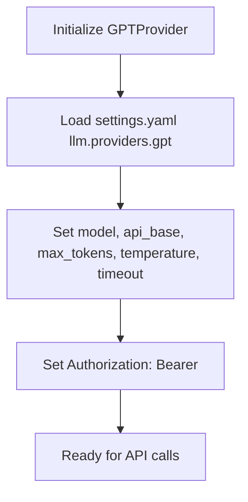
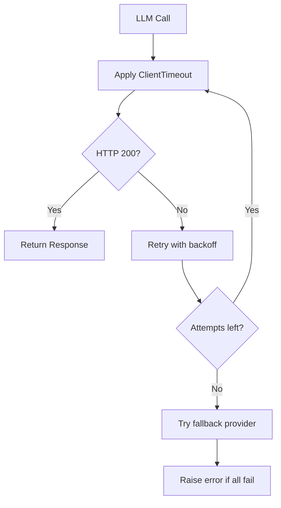
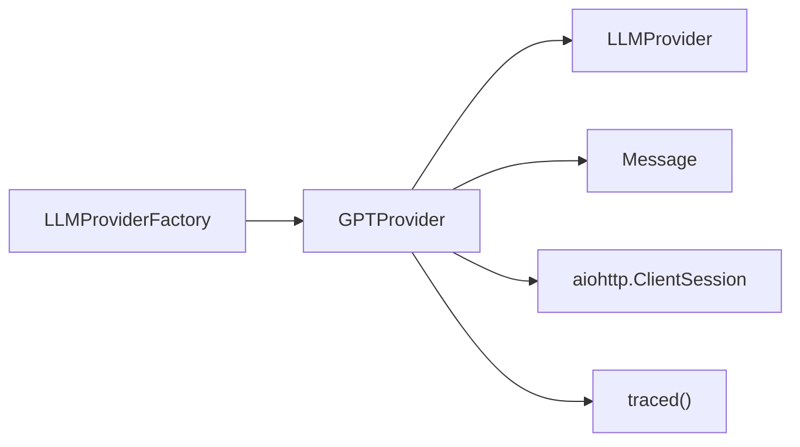

# OpenAI GPT Provider

<cite>
**Referenced Files in This Document**
- [gpt.py](file://src/aiops_agent/llm/gpt.py)
- [provider.py](file://src/aiops_agent/llm/provider.py)
- [schemas.py](file://src/aiops_agent/models/schemas.py)
- [settings.yaml](file://config/settings.yaml)
- [test_gpt_provider.py](file://tests/test_gpt_provider.py)
- [tracing.py](file://src/aiops_agent/observability/tracing.py)
</cite>

## Table of Contents
1. [Introduction](#introduction)
2. [Project Structure](#project-structure)
3. [Core Components](#core-components)
4. [Architecture Overview](#architecture-overview)
5. [Detailed Component Analysis](#detailed-component-analysis)
6. [Dependency Analysis](#dependency-analysis)
7. [Performance Considerations](#performance-considerations)
8. [Troubleshooting Guide](#troubleshooting-guide)
9. [Conclusion](#conclusion)
10. [Appendices](#appendices)

## Introduction
This document provides comprehensive documentation for the OpenAI GPT provider implementation within the AIOps agent. It explains how the GPT provider integrates with the OpenAI API, including configuration, authentication, parameter management, and interface support for chat, completion, and embeddings. It also covers supported GPT variants, pricing considerations, rate limiting strategies, error handling patterns, and best practices for cost optimization and model selection.

## Project Structure
The GPT provider is part of the LLM abstraction layer that supports multiple providers (Qwen, Claude, GPT). The provider implements a unified interface and integrates with shared models and observability components.

**Diagram sources**
- [gpt.py:1-128](file://src/aiops_agent/llm/gpt.py#L1-L128)
- [provider.py:31-242](file://src/aiops_agent/llm/provider.py#L31-L242)
- [schemas.py:64-71](file://src/aiops_agent/models/schemas.py#L64-L71)
- [tracing.py:98-137](file://src/aiops_agent/observability/tracing.py#L98-L137)
- [settings.yaml:4-26](file://config/settings.yaml#L4-L26)

**Section sources**
- [gpt.py:1-128](file://src/aiops_agent/llm/gpt.py#L1-L128)
- [provider.py:31-242](file://src/aiops_agent/llm/provider.py#L31-L242)
- [schemas.py:64-71](file://src/aiops_agent/models/schemas.py#L64-L71)
- [settings.yaml:4-26](file://config/settings.yaml#L4-L26)

## Core Components
- GPTProvider: Implements OpenAI GPT integration with chat, completion, and embeddings endpoints. Supports configurable model, API base, token limits, temperature, and timeouts.
- LLMProvider: Abstract base class defining the unified interface for chat, completion, embeddings, and streaming.
- LLMProviderFactory: Manages provider registration, primary/fallback selection, and automatic failover across providers.
- Message model: Shared data structure representing conversation messages.
- Tracing: OpenTelemetry tracing integration for observability.

Key implementation highlights:
- Authentication via Authorization header with Bearer token.
- Unified ChatResponse data structure for usage tracking.
- Configurable aiohttp client session with timeout management.
- Automatic session reuse and lifecycle management.

**Section sources**
- [gpt.py:20-128](file://src/aiops_agent/llm/gpt.py#L20-L128)
- [provider.py:20-95](file://src/aiops_agent/llm/provider.py#L20-L95)
- [provider.py:97-242](file://src/aiops_agent/llm/provider.py#L97-L242)
- [schemas.py:64-71](file://src/aiops_agent/models/schemas.py#L64-L71)
- [tracing.py:98-137](file://src/aiops_agent/observability/tracing.py#L98-L137)

## Architecture Overview
The GPT provider follows a layered architecture:
- Provider layer: GPTProvider implements OpenAI API calls.
- Abstraction layer: LLMProvider defines the contract; LLMProviderFactory manages provider selection and failover.
- Data layer: Message model standardizes conversation input.
- Observability layer: Tracing decorator wraps provider methods for telemetry.

**Diagram sources**
- [gpt.py:44-85](file://src/aiops_agent/llm/gpt.py#L44-L85)
- [provider.py:147-175](file://src/aiops_agent/llm/provider.py#L147-L175)

## Detailed Component Analysis

### GPTProvider Implementation
The GPTProvider class encapsulates OpenAI API integration:
- Initialization parameters: API key, model, API base, max tokens, temperature, timeout.
- Authentication: Authorization header with Bearer token.
- Chat endpoint: Transforms Message objects to OpenAI-compatible payload and parses ChatResponse.
- Completion endpoint: Delegates to chat with a single-message prompt.
- Embeddings endpoint: Uses text-embedding-3-small by default and returns vector lists.
- Session management: Reuses aiohttp.ClientSession with configured timeout.
- Error handling: Raises RuntimeError on non-200 responses with HTTP status and body.

**Diagram sources**
- [gpt.py:20-128](file://src/aiops_agent/llm/gpt.py#L20-L128)
- [provider.py:20-95](file://src/aiops_agent/llm/provider.py#L20-L95)
- [schemas.py:64-71](file://src/aiops_agent/models/schemas.py#L64-L71)

**Section sources**
- [gpt.py:20-128](file://src/aiops_agent/llm/gpt.py#L20-L128)
- [provider.py:20-95](file://src/aiops_agent/llm/provider.py#L20-L95)
- [schemas.py:64-71](file://src/aiops_agent/models/schemas.py#L64-L71)

### Chat Interface
- Endpoint: POST /chat/completions.
- Payload construction: Includes model, max_tokens, temperature, and messages array.
- Response parsing: Extracts content, model, finish_reason, and usage fields.
- Usage tracking: Returns prompt_tokens, completion_tokens, total_tokens.

**Diagram sources**
- [gpt.py:44-85](file://src/aiops_agent/llm/gpt.py#L44-L85)

**Section sources**
- [gpt.py:44-85](file://src/aiops_agent/llm/gpt.py#L44-L85)

### Completion Interface
- Delegates to chat with a single Message constructed from the prompt.
- Returns the assistant's content as a string.

**Diagram sources**
- [gpt.py:87-92](file://src/aiops_agent/llm/gpt.py#L87-L92)

**Section sources**
- [gpt.py:87-92](file://src/aiops_agent/llm/gpt.py#L87-L92)

### Embeddings Interface
- Endpoint: POST /embeddings.
- Default model: text-embedding-3-small.
- Response parsing: Returns a list of embeddings for each input text.

**Diagram sources**
- [gpt.py:94-117](file://src/aiops_agent/llm/gpt.py#L94-L117)

**Section sources**
- [gpt.py:94-117](file://src/aiops_agent/llm/gpt.py#L94-L117)

### Configuration and Authentication
- Configuration: Managed via settings.yaml under llm.providers.gpt with model, api_base, max_tokens, temperature, and timeout_seconds.
- Authentication: Uses Authorization: Bearer <api_key> header.
- API base normalization: Removes trailing slash from api_base.

**Diagram sources**
- [settings.yaml:20-25](file://config/settings.yaml#L20-L25)
- [gpt.py:23-38](file://src/aiops_agent/llm/gpt.py#L23-L38)

**Section sources**
- [settings.yaml:20-25](file://config/settings.yaml#L20-L25)
- [gpt.py:23-38](file://src/aiops_agent/llm/gpt.py#L23-L38)

### Parameter Management
- Overridable parameters: model, max_tokens, temperature via kwargs in chat/embed.
- Defaults: Defined during provider initialization.
- Usage reporting: Prompt/completion/total tokens included in ChatResponse usage.

**Section sources**
- [gpt.py:49-56](file://src/aiops_agent/llm/gpt.py#L49-L56)
- [gpt.py:98-101](file://src/aiops_agent/llm/gpt.py#L98-L101)
- [gpt.py:76-84](file://src/aiops_agent/llm/gpt.py#L76-L84)

### Rate Limiting Strategies
- Built-in timeout: aiohttp.ClientTimeout configured at initialization.
- Retry policy: Configured globally under retry.max_retries, base_delay_seconds, max_delay_seconds, exponential_base.
- Provider failover: LLMProviderFactory attempts fallback provider on failure.

**Diagram sources**
- [gpt.py:37](file://src/aiops_agent/llm/gpt.py#L37)
- [settings.yaml:50-54](file://config/settings.yaml#L50-L54)
- [provider.py:147-175](file://src/aiops_agent/llm/provider.py#L147-L175)

**Section sources**
- [gpt.py:37](file://src/aiops_agent/llm/gpt.py#L37)
- [settings.yaml:50-54](file://config/settings.yaml#L50-L54)
- [provider.py:147-175](file://src/aiops_agent/llm/provider.py#L147-L175)

### Error Handling Patterns
- Non-200 responses: Raise RuntimeError with HTTP status and body.
- Session lifecycle: Close session via close() and reset internal reference.
- Factory-level failures: LLMProviderFactory logs warnings and errors, then raises if all providers fail.

**Section sources**
- [gpt.py:66-68](file://src/aiops_agent/llm/gpt.py#L66-L68)
- [gpt.py:111-113](file://src/aiops_agent/llm/gpt.py#L111-L113)
- [gpt.py:119-122](file://src/aiops_agent/llm/gpt.py#L119-L122)
- [provider.py:154-175](file://src/aiops_agent/llm/provider.py#L154-L175)

### Observability and Tracing
- Tracing decorator: @traced("llm.gpt.chat"/"llm.gpt.complete") wraps provider methods.
- Telemetry: Spans capture function calls, attributes, and exceptions.

**Section sources**
- [gpt.py:44](file://src/aiops_agent/llm/gpt.py#L44)
- [gpt.py:87](file://src/aiops_agent/llm/gpt.py#L87)
- [tracing.py:98-137](file://src/aiops_agent/observability/tracing.py#L98-L137)

## Dependency Analysis
The GPT provider depends on:
- LLMProvider base class for interface contract.
- Message model for input representation.
- aiohttp for asynchronous HTTP requests.
- OpenTelemetry tracing for observability.

**Diagram sources**
- [gpt.py:13-15](file://src/aiops_agent/llm/gpt.py#L13-L15)
- [provider.py:31](file://src/aiops_agent/llm/provider.py#L31)
- [schemas.py:64-71](file://src/aiops_agent/models/schemas.py#L64-L71)
- [tracing.py:98-137](file://src/aiops_agent/observability/tracing.py#L98-L137)

**Section sources**
- [gpt.py:13-15](file://src/aiops_agent/llm/gpt.py#L13-L15)
- [provider.py:31](file://src/aiops_agent/llm/provider.py#L31)
- [schemas.py:64-71](file://src/aiops_agent/models/schemas.py#L64-L71)
- [tracing.py:98-137](file://src/aiops_agent/observability/tracing.py#L98-L137)

## Performance Considerations
- Token limits: Tune max_tokens to balance quality and cost.
- Temperature: Lower values increase determinism; higher values increase creativity.
- Timeout: Configure timeout_seconds to prevent long-running requests.
- Session reuse: Provider reuses a single aiohttp session to reduce overhead.
- Streaming: chat_stream defaults to non-streaming; override for real-time token streaming.

[No sources needed since this section provides general guidance]

## Troubleshooting Guide
Common issues and resolutions:
- Authentication failures: Verify API key and Authorization header.
- Non-200 responses: Inspect HTTP status and response body for error details.
- Timeout errors: Increase timeout_seconds or reduce max_tokens.
- Session leaks: Ensure close() is called to release resources.
- Provider unavailability: Confirm provider registration and fallback configuration.

**Section sources**
- [gpt.py:66-68](file://src/aiops_agent/llm/gpt.py#L66-L68)
- [gpt.py:111-113](file://src/aiops_agent/llm/gpt.py#L111-L113)
- [gpt.py:119-122](file://src/aiops_agent/llm/gpt.py#L119-L122)
- [provider.py:147-175](file://src/aiops_agent/llm/provider.py#L147-L175)

## Conclusion
The GPT provider offers a robust, configurable integration with the OpenAI API, adhering to a unified interface and supporting essential LLM operations. It includes built-in observability, error handling, and provider failover mechanisms. Proper configuration of parameters, timeouts, and fallback strategies ensures reliable performance and cost-effectiveness across diverse use cases.

[No sources needed since this section summarizes without analyzing specific files]

## Appendices

### Configuration Examples
- Provider configuration in settings.yaml:
  - llm.providers.gpt.model: "gpt-4"
  - llm.providers.gpt.api_base: "https://api.openai.com/v1"
  - llm.providers.gpt.max_tokens: 4096
  - llm.providers.gpt.temperature: 0.7
  - llm.providers.gpt.timeout_seconds: 60

- Retry policy:
  - retry.max_retries: 3
  - retry.base_delay_seconds: 1.0
  - retry.max_delay_seconds: 30.0
  - retry.exponential_base: 2

**Section sources**
- [settings.yaml:20-25](file://config/settings.yaml#L20-L25)
- [settings.yaml:50-54](file://config/settings.yaml#L50-L54)

### Supported GPT Variants
- Chat completions: gpt-4, gpt-4-turbo, gpt-3.5-turbo, gpt-4o, etc.
- Embeddings: text-embedding-3-small (default), text-embedding-3-large, text-embedding-ada-002.

Note: Variant availability depends on your OpenAI account and subscription.

[No sources needed since this section provides general guidance]

### Pricing Considerations
- Chat models: Price per 1K tokens for input and output.
- Embeddings: Price per 1K tokens for input text.
- Cost optimization tips:
  - Use smaller models for simple tasks.
  - Reduce max_tokens and temperature for deterministic, shorter outputs.
  - Monitor usage metrics (prompt/completion/total tokens) to track costs.

[No sources needed since this section provides general guidance]

### Best Practices for GPT Integration
- Parameter tuning: Adjust temperature and max_tokens per use case.
- Error handling: Implement retries and fallbacks using LLMProviderFactory.
- Observability: Enable tracing to monitor latency and failures.
- Security: Store API keys securely and rotate credentials regularly.
- Cost control: Set budgets and alerts; use smaller models for batch processing.

[No sources needed since this section provides general guidance]