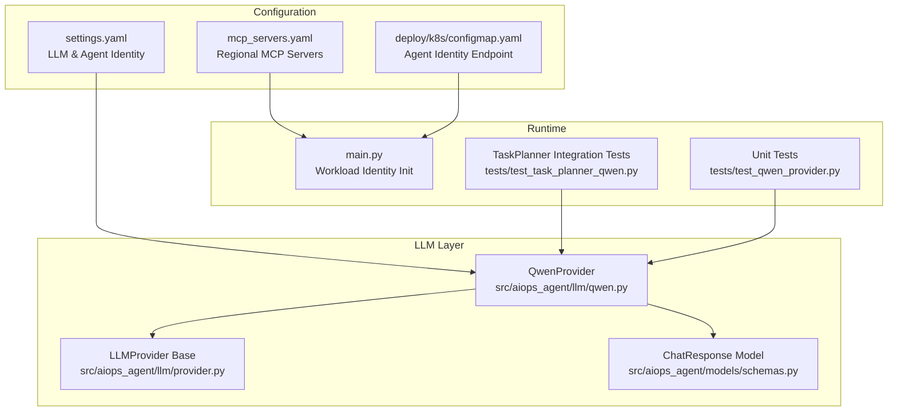
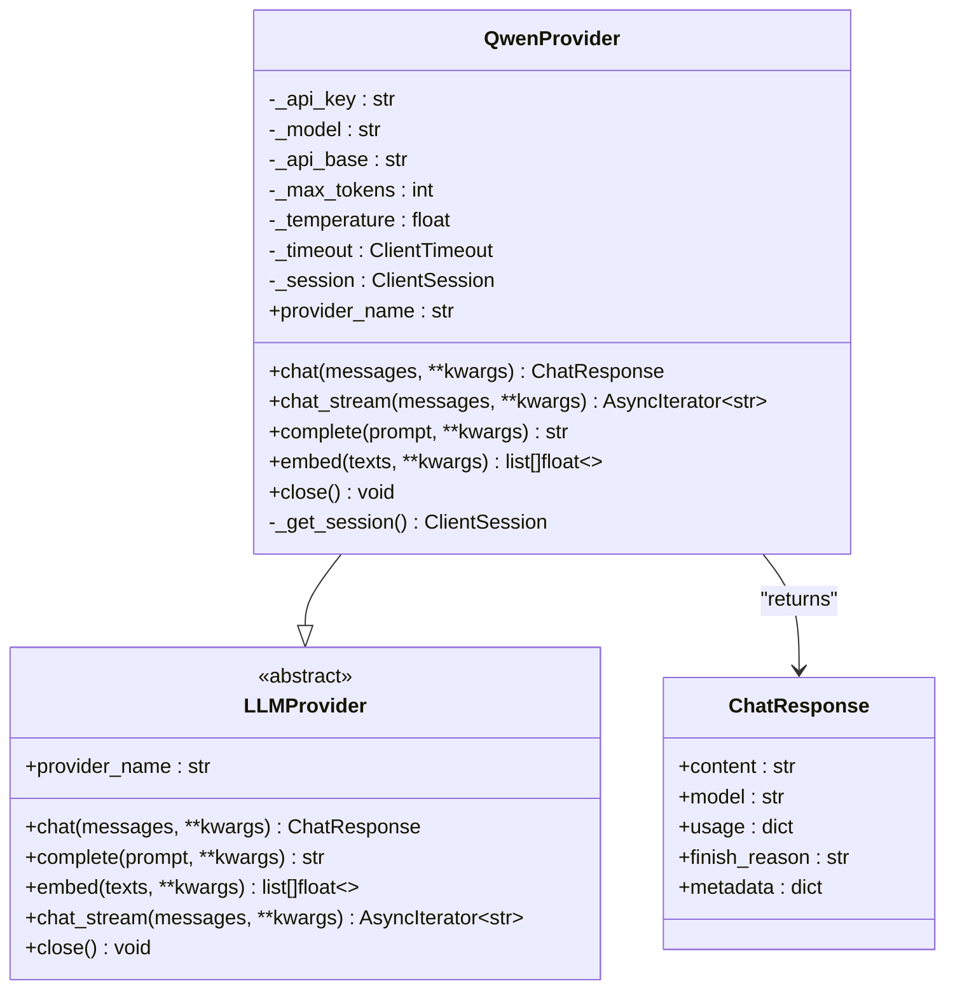
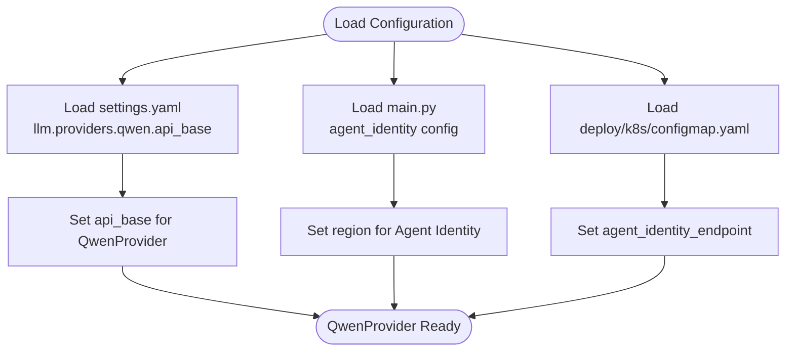
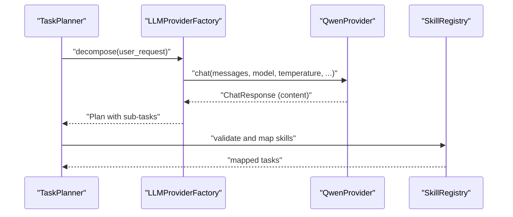
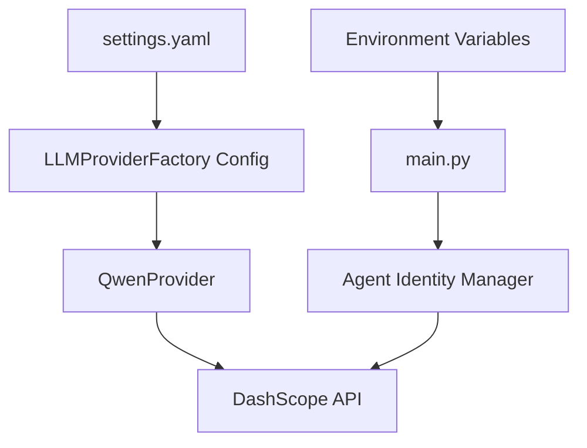

# Tongyi Qianwen Provider

<cite>
**Referenced Files in This Document**
- [qwen.py](file://src/aiops_agent/llm/qwen.py)
- [provider.py](file://src/aiops_agent/llm/provider.py)
- [schemas.py](file://src/aiops_agent/models/schemas.py)
- [settings.yaml](file://config/settings.yaml)
- [mcp_servers.yaml](file://config/mcp_servers.yaml)
- [configmap.yaml](file://deploy/k8s/configmap.yaml)
- [main.py](file://src/aiops_agent/main.py)
- [test_qwen_provider.py](file://tests/test_qwen_provider.py)
- [test_task_planner_qwen.py](file://tests/test_task_planner_qwen.py)
</cite>

## Table of Contents
1. [Introduction](#introduction)
2. [Project Structure](#project-structure)
3. [Core Components](#core-components)
4. [Architecture Overview](#architecture-overview)
5. [Detailed Component Analysis](#detailed-component-analysis)
6. [Dependency Analysis](#dependency-analysis)
7. [Performance Considerations](#performance-considerations)
8. [Troubleshooting Guide](#troubleshooting-guide)
9. [Conclusion](#conclusion)
10. [Appendices](#appendices)

## Introduction
This document provides comprehensive documentation for the Tongyi Qianwen (Qwen) provider implementation within the AIOps agent. It explains how the Qwen provider integrates with Alibaba Cloud DashScope via an OpenAI-compatible API, covering configuration, authentication, regional deployment options, supported model variants, capabilities, and performance characteristics. It also details the provider's interface implementations, Qwen-specific parameters and optimizations, error handling strategies, best practices, and cost optimization guidance for different operational scenarios.

## Project Structure
The Qwen provider resides in the LLM abstraction layer alongside other providers (e.g., Claude, GPT). It implements the unified LLMProvider interface and leverages shared data models and observability features. Configuration is centralized in YAML files for LLM providers and Alibaba Cloud identity integration.



**Diagram sources**
- [qwen.py:30-205](file://src/aiops_agent/llm/qwen.py#L30-L205)
- [provider.py:31-242](file://src/aiops_agent/llm/provider.py#L31-L242)
- [schemas.py:20-313](file://src/aiops_agent/models/schemas.py#L20-L313)
- [settings.yaml:4-26](file://config/settings.yaml#L4-L26)
- [mcp_servers.yaml:4-32](file://config/mcp_servers.yaml#L4-L32)
- [configmap.yaml:6-7](file://deploy/k8s/configmap.yaml#L6-L7)
- [main.py:100-118](file://src/aiops_agent/main.py#L100-L118)
- [test_qwen_provider.py:1-232](file://tests/test_qwen_provider.py#L1-L232)
- [test_task_planner_qwen.py:43-53](file://tests/test_task_planner_qwen.py#L43-L53)

**Section sources**
- [qwen.py:1-205](file://src/aiops_agent/llm/qwen.py#L1-L205)
- [provider.py:1-242](file://src/aiops_agent/llm/provider.py#L1-L242)
- [schemas.py:1-313](file://src/aiops_agent/models/schemas.py#L1-L313)
- [settings.yaml:1-85](file://config/settings.yaml#L1-L85)
- [mcp_servers.yaml:1-41](file://config/mcp_servers.yaml#L1-L41)
- [configmap.yaml:1-7](file://deploy/k8s/configmap.yaml#L1-L7)
- [main.py:82-118](file://src/aiops_agent/main.py#L82-L118)
- [test_qwen_provider.py:1-232](file://tests/test_qwen_provider.py#L1-L232)
- [test_task_planner_qwen.py:1-291](file://tests/test_task_planner_qwen.py#L1-L291)

## Core Components
- QwenProvider: Implements the LLMProvider interface for Alibaba Cloud DashScope OpenAI-compatible API. Supports chat, streaming chat, text completion, and embeddings. Provides Qwen-specific parameters such as model selection, max_tokens, temperature, and optional thinking mode control.
- LLMProvider base: Defines the abstract interface and default fallback behavior for streaming chat.
- ChatResponse: Standardized response model containing content, model name, token usage, finish reason, and metadata (including reasoning content).
- Configuration: Centralized provider configuration via settings.yaml and Alibaba Cloud identity configuration via main.py and Kubernetes ConfigMap.

Key capabilities and characteristics:
- OpenAI-compatible endpoints for chat/completions and embeddings.
- Streaming support with SSE-like chunk parsing.
- Token usage reporting and finish reason extraction.
- Optional reasoning content capture for Qwen3 series.
- Lazy HTTP session creation with configurable timeouts.

**Section sources**
- [qwen.py:30-205](file://src/aiops_agent/llm/qwen.py#L30-L205)
- [provider.py:31-96](file://src/aiops_agent/llm/provider.py#L31-L96)
- [schemas.py:20-31](file://src/aiops_agent/models/schemas.py#L20-L31)

## Architecture Overview
The Qwen provider integrates with Alibaba Cloud DashScope through an OpenAI-compatible API. Authentication is performed via an API key passed in the Authorization header. Regional deployment is controlled by the api_base URL, while Alibaba Cloud Agent Identity manages workload identity and temporary credentials.

```mermaid
sequenceDiagram
participant App as "Application"
participant Factory as "LLMProviderFactory"
participant QP as "QwenProvider"
participant HTTP as "DashScope API"
participant AI as "Alibaba Cloud Agent Identity"
App->>Factory : "chat/messages"
Factory->>QP : "chat(messages, kwargs)"
QP->>QP : "build payload (model, messages, tokens, temp)"
QP->>HTTP : "POST /compatible-mode/v1/chat/completions"
HTTP-->>QP : "200 OK + JSON"
QP-->>Factory : "ChatResponse (content, usage, finish_reason)"
Factory-->>App : "Response"
Note over QP,AI : "API key configured in QwenProvider; Agent Identity manages workload credentials"
```

**Diagram sources**
- [qwen.py:54-108](file://src/aiops_agent/llm/qwen.py#L54-L108)
- [settings.yaml:8-13](file://config/settings.yaml#L8-L13)
- [main.py:100-118](file://src/aiops_agent/main.py#L100-L118)

## Detailed Component Analysis

### QwenProvider Implementation
QwenProvider extends LLMProvider and implements chat, chat_stream, complete, and embed methods. It constructs OpenAI-compatible requests, handles responses, and extracts usage and reasoning metadata.



**Diagram sources**
- [provider.py:31-96](file://src/aiops_agent/llm/provider.py#L31-L96)
- [qwen.py:30-205](file://src/aiops_agent/llm/qwen.py#L30-L205)
- [schemas.py:20-31](file://src/aiops_agent/models/schemas.py#L20-L31)

Key implementation details:
- Authentication: Authorization header with Bearer token using the configured API key.
- Payload construction: Includes model, messages, max_tokens, temperature, and optional extra_body for thinking mode.
- Response parsing: Extracts content, model, usage, finish_reason, and reasoning_content metadata.
- Streaming: Parses SSE-like chunks and yields incremental content until [DONE].
- Embeddings: Uses a dedicated embeddings endpoint with a compatible model identifier.

**Section sources**
- [qwen.py:54-193](file://src/aiops_agent/llm/qwen.py#L54-L193)

### Configuration and Regional Deployment
- Provider configuration: Primary and fallback providers, model defaults, API base URLs, and timeouts are defined in settings.yaml.
- Regional endpoints: The api_base setting controls the DashScope endpoint; the default targets mainland China. Other regions can be configured by adjusting the base URL.
- Alibaba Cloud Agent Identity: Workload identity initialization sets role ARN, OIDC provider ARN, region, and session name. The agent identity endpoint and region are configured in the Kubernetes ConfigMap.



**Diagram sources**
- [settings.yaml:8-13](file://config/settings.yaml#L8-L13)
- [main.py:100-118](file://src/aiops_agent/main.py#L100-L118)
- [configmap.yaml:6-7](file://deploy/k8s/configmap.yaml#L6-L7)

**Section sources**
- [settings.yaml:4-26](file://config/settings.yaml#L4-L26)
- [mcp_servers.yaml:10-31](file://config/mcp_servers.yaml#L10-L31)
- [configmap.yaml:6-7](file://deploy/k8s/configmap.yaml#L6-L7)
- [main.py:100-118](file://src/aiops_agent/main.py#L100-L118)

### Supported Qwen Variants and Capabilities
- Default model: The provider initializes with a specific model variant and allows override via kwargs or constructor parameters.
- Model variants: Tests demonstrate usage of different models, including a plus variant, indicating flexibility in model selection.
- Capabilities: Chat, streaming chat, text completion, and embeddings are supported through OpenAI-compatible endpoints.

Operational guidance:
- Select models based on accuracy and latency needs; higher-capability models may increase token usage and cost.
- Use streaming for interactive experiences and to reduce perceived latency.
- Leverage reasoning content for explainable outputs when using Qwen3 series.

**Section sources**
- [qwen.py:27-48](file://src/aiops_agent/llm/qwen.py#L27-L48)
- [test_task_planner_qwen.py:45-50](file://tests/test_task_planner_qwen.py#L45-L50)

### Qwen-Specific Parameters and Optimizations
- enable_thinking: Optional parameter passed via extra_body to control thinking mode for Qwen3 series.
- max_tokens and temperature: Tunable parameters controlling output length and randomness.
- Streamed responses: Efficient for long-form generation and user experience.
- Lazy session: Reuses a single aiohttp ClientSession to minimize connection overhead.

**Section sources**
- [qwen.py:69-70](file://src/aiops_agent/llm/qwen.py#L69-L70)
- [qwen.py:127-128](file://src/aiops_agent/llm/qwen.py#L127-L128)
- [qwen.py:201-204](file://src/aiops_agent/llm/qwen.py#L201-L204)

### Integration with TaskPlanner
The Qwen provider is integrated into TaskPlanner workflows for decomposing user requests into actionable sub-tasks. Tests demonstrate successful decomposition and parameter extraction for cloud resources.



**Diagram sources**
- [test_task_planner_qwen.py:80-100](file://tests/test_task_planner_qwen.py#L80-L100)
- [test_task_planner_qwen.py:256-277](file://tests/test_task_planner_qwen.py#L256-L277)

**Section sources**
- [test_task_planner_qwen.py:80-190](file://tests/test_task_planner_qwen.py#L80-L190)
- [test_task_planner_qwen.py:256-290](file://tests/test_task_planner_qwen.py#L256-L290)

## Dependency Analysis
The Qwen provider depends on the LLMProvider interface and shares data models with the broader system. Configuration flows from settings.yaml and environment variables into runtime components.



**Diagram sources**
- [settings.yaml:8-13](file://config/settings.yaml#L8-L13)
- [main.py:100-118](file://src/aiops_agent/main.py#L100-L118)
- [qwen.py:54-108](file://src/aiops_agent/llm/qwen.py#L54-L108)

**Section sources**
- [settings.yaml:27-41](file://config/settings.yaml#L27-L41)
- [main.py:100-118](file://src/aiops_agent/main.py#L100-L118)
- [qwen.py:54-108](file://src/aiops_agent/llm/qwen.py#L54-L108)

## Performance Considerations
- Token usage: Monitor prompt_tokens, completion_tokens, and total_tokens to optimize prompts and reduce costs.
- Streaming: Prefer streaming for interactive scenarios to improve responsiveness.
- Model selection: Choose models aligned with accuracy and latency requirements; adjust max_tokens and temperature accordingly.
- Timeout tuning: Configure timeout_seconds to balance responsiveness and reliability.
- Session reuse: The provider lazily creates and reuses a single HTTP session to minimize overhead.

[No sources needed since this section provides general guidance]

## Troubleshooting Guide
Common issues and resolutions:
- Non-200 responses: The provider raises a runtime error with HTTP status and body; inspect logs for rate limits or invalid credentials.
- JSON decode errors: Malformed responses trigger exceptions; validate API key and endpoint configuration.
- Session lifecycle: Ensure proper close() to release resources; tests verify lazy session creation and closure behavior.
- Integration testing: Real API tests require a valid QWEN_API_KEY environment variable; tests demonstrate successful chat and complete operations.

**Section sources**
- [qwen.py:80-82](file://src/aiops_agent/llm/qwen.py#L80-L82)
- [qwen.py:138-142](file://src/aiops_agent/llm/qwen.py#L138-L142)
- [qwen.py:187-189](file://src/aiops_agent/llm/qwen.py#L187-L189)
- [test_qwen_provider.py:120-139](file://tests/test_qwen_provider.py#L120-L139)
- [test_qwen_provider.py:196-231](file://tests/test_qwen_provider.py#L196-L231)
- [test_task_planner_qwen.py:21-26](file://tests/test_task_planner_qwen.py#L21-L26)

## Conclusion
The Qwen provider offers a robust, OpenAI-compatible integration with Alibaba Cloud DashScope, supporting chat, streaming, completion, and embeddings. Its design emphasizes configurability, observability, and reliability, with clear error handling and session lifecycle management. By leveraging configuration files and Alibaba Cloud Agent Identity, teams can deploy Qwen across regions and integrate it into TaskPlanner workflows for automated AIOps operations.

[No sources needed since this section summarizes without analyzing specific files]

## Appendices

### Configuration Examples and Best Practices
- Provider configuration: Define primary and fallback providers, model defaults, and timeouts in settings.yaml.
- Regional deployment: Adjust api_base to target DashScope endpoints in different Alibaba Cloud regions.
- Authentication: Store API keys securely and pass them to QwenProvider constructors.
- Cost optimization:
  - Use smaller models for routine tasks.
  - Reduce max_tokens for concise outputs.
  - Enable streaming to improve perceived performance without increasing cost per request.
  - Monitor token usage and refine prompts to minimize unnecessary tokens.

**Section sources**
- [settings.yaml:4-26](file://config/settings.yaml#L4-L26)
- [qwen.py:33-48](file://src/aiops_agent/llm/qwen.py#L33-L48)