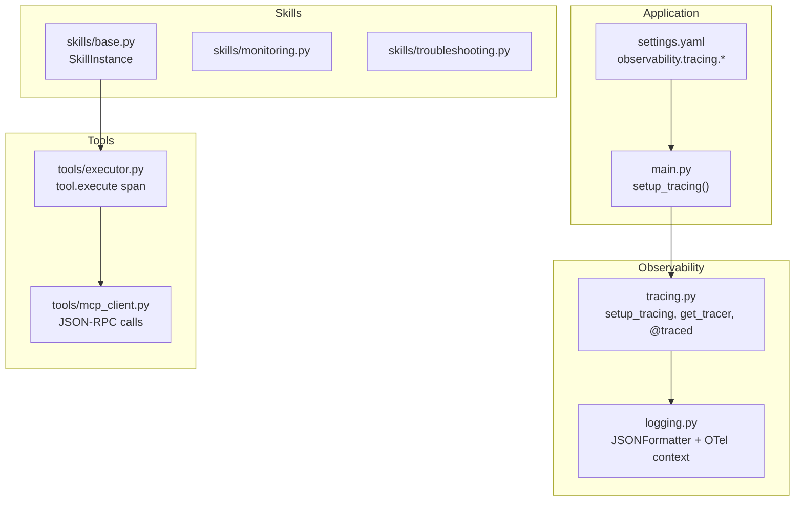
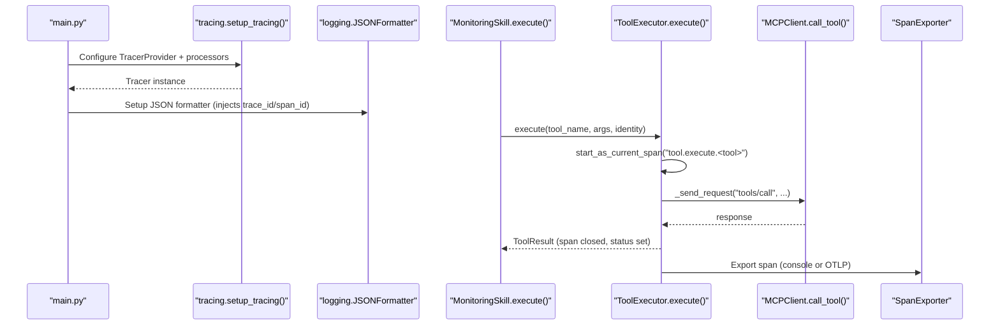
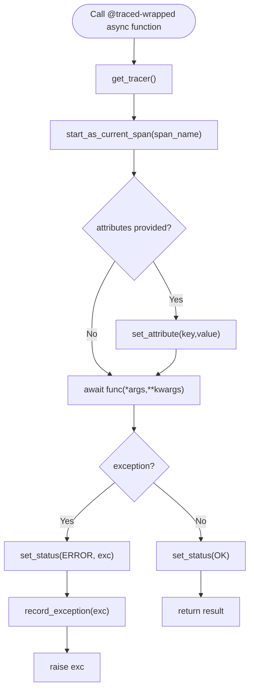
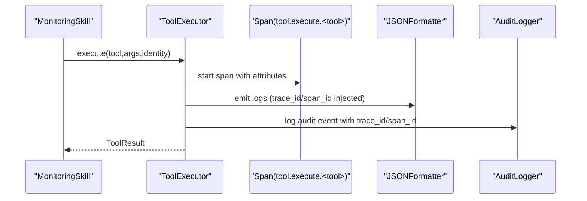
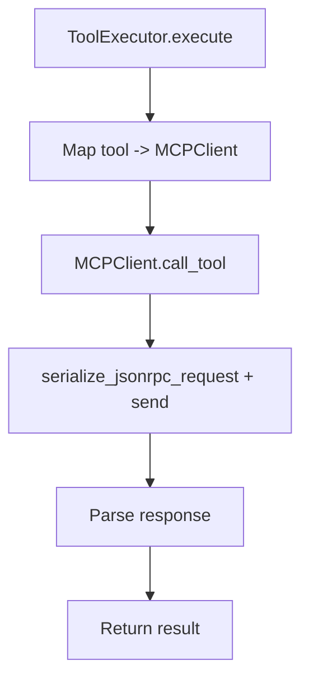
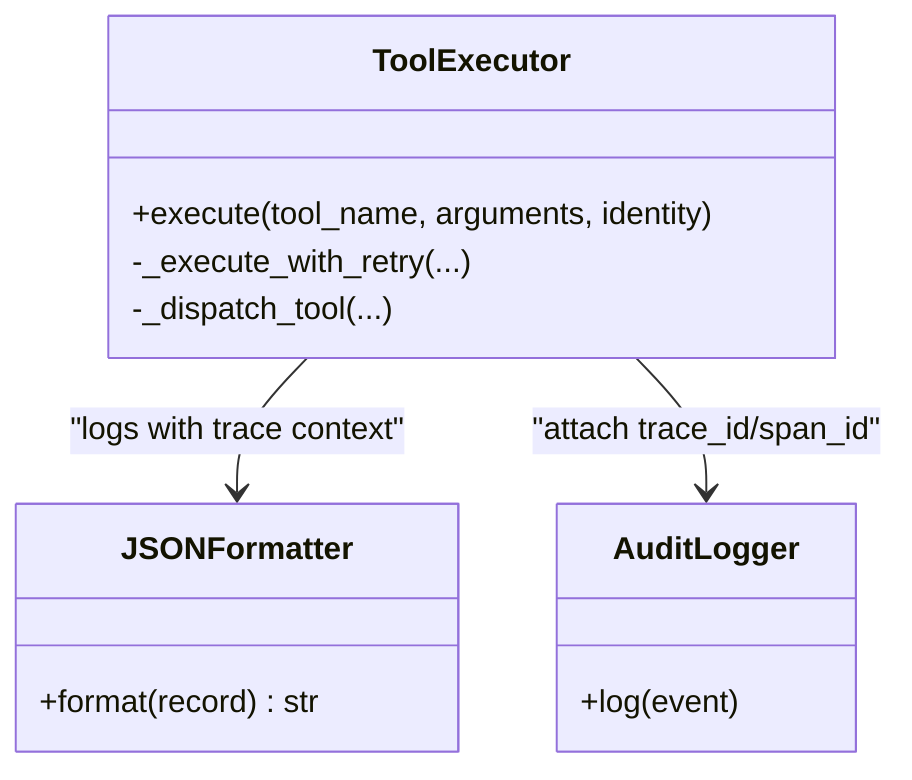
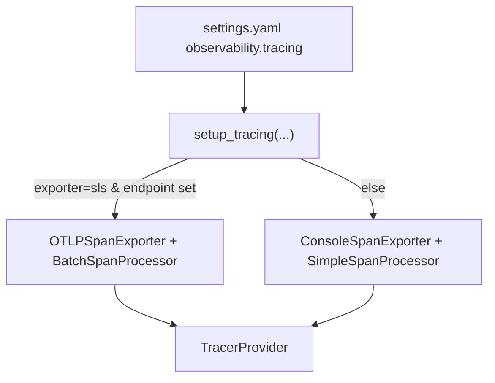
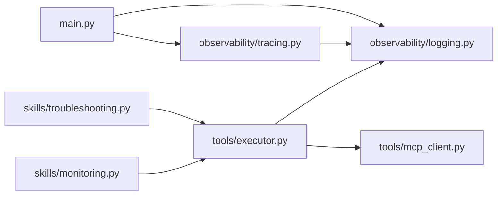

# Distributed Tracing

<cite>
**Referenced Files in This Document**
- [tracing.py](file://src/aiops_agent/observability/tracing.py)
- [logging.py](file://src/aiops_agent/observability/logging.py)
- [main.py](file://src/aiops_agent/main.py)
- [settings.yaml](file://config/settings.yaml)
- [executor.py](file://src/aiops_agent/tools/executor.py)
- [mcp_client.py](file://src/aiops_agent/tools/mcp_client.py)
- [base.py](file://src/aiops_agent/skills/base.py)
- [monitoring.py](file://src/aiops_agent/skills/monitoring.py)
- [troubleshooting.py](file://src/aiops_agent/skills/troubleshooting.py)
- [test_observability_tracing.py](file://tests/test_observability_tracing.py)
</cite>

## Table of Contents
1. [Introduction](#introduction)
2. [Project Structure](#project-structure)
3. [Core Components](#core-components)
4. [Architecture Overview](#architecture-overview)
5. [Detailed Component Analysis](#detailed-component-analysis)
6. [Dependency Analysis](#dependency-analysis)
7. [Performance Considerations](#performance-considerations)
8. [Troubleshooting Guide](#troubleshooting-guide)
9. [Conclusion](#conclusion)

## Introduction
This document explains the AIOps Agent’s distributed tracing implementation built on OpenTelemetry. It covers how the @traced decorator automatically creates spans around asynchronous functions, how trace context propagates across skill invocations and MCP server communications, how spans are tagged and correlated with logs, and how traces are exported to backends. It also provides practical guidance on sampling, performance impact, and debugging distributed workflows.

## Project Structure
The tracing system is centered in the observability package and is wired into the application lifecycle during startup. Skills delegate tool execution to the ToolExecutor, which wraps MCP/local tool calls in spans and records audit events with trace identifiers.

**Diagram sources**
- [tracing.py:32-95](file://src/aiops_agent/observability/tracing.py#L32-L95)
- [logging.py:18-58](file://src/aiops_agent/observability/logging.py#L18-L58)
- [main.py:85-95](file://src/aiops_agent/main.py#L85-L95)
- [settings.yaml:62-76](file://config/settings.yaml#L62-L76)
- [base.py:21-93](file://src/aiops_agent/skills/base.py#L21-L93)
- [monitoring.py:18-140](file://src/aiops_agent/skills/monitoring.py#L18-L140)
- [troubleshooting.py:18-152](file://src/aiops_agent/skills/troubleshooting.py#L18-L152)
- [executor.py:80-226](file://src/aiops_agent/tools/executor.py#L80-L226)
- [mcp_client.py:161-220](file://src/aiops_agent/tools/mcp_client.py#L161-L220)

**Section sources**
- [tracing.py:1-137](file://src/aiops_agent/observability/tracing.py#L1-L137)
- [logging.py:1-111](file://src/aiops_agent/observability/logging.py#L1-L111)
- [main.py:85-95](file://src/aiops_agent/main.py#L85-L95)
- [settings.yaml:62-76](file://config/settings.yaml#L62-L76)

## Core Components
- TracerProvider and exporters: configured via setup_tracing with console or OTLP-based SLS exporter.
- Tracer retrieval: get_tracer lazily initializes a default tracer if none exists.
- @traced decorator: wraps async functions to start a span, set status, record exceptions, and attach attributes.
- ToolExecutor span: wraps tool execution with a span and captures trace/span IDs for audit correlation.
- Logging integration: JSONFormatter injects current span’s trace_id and span_id into structured logs.

Key responsibilities:
- Centralized tracing setup and tracer access.
- Automatic span creation around async callables.
- Propagation of trace context into logs and audit events.
- Export to console or SLS-compatible OTLP endpoint.

**Section sources**
- [tracing.py:32-136](file://src/aiops_agent/observability/tracing.py#L32-L136)
- [logging.py:18-58](file://src/aiops_agent/observability/logging.py#L18-L58)
- [executor.py:80-226](file://src/aiops_agent/tools/executor.py#L80-L226)

## Architecture Overview
The tracing pipeline starts at application bootstrapping, flows through skills invoking tools, and exports spans to configured backends.

**Diagram sources**
- [main.py:85-95](file://src/aiops_agent/main.py#L85-L95)
- [tracing.py:32-87](file://src/aiops_agent/observability/tracing.py#L32-L87)
- [logging.py:18-58](file://src/aiops_agent/observability/logging.py#L18-L58)
- [executor.py:80-226](file://src/aiops_agent/tools/executor.py#L80-L226)
- [mcp_client.py:161-220](file://src/aiops_agent/tools/mcp_client.py#L161-L220)

## Detailed Component Analysis

### Tracing Setup and Decorator (@traced)
- setup_tracing builds a TracerProvider with a Resource containing service.name and service.version, then attaches either:
  - ConsoleSpanExporter with SimpleSpanProcessor, or
  - OTLPSpanExporter (SLS-compatible) with BatchSpanProcessor.
- get_tracer returns a cached module-level tracer, lazily initialized if missing.
- @traced:
  - Creates a span with a configurable name or falls back to the function’s qualified name.
  - Sets attributes if provided.
  - On success: sets status OK.
  - On exception: sets status ERROR, records the exception, and re-raises.

**Diagram sources**
- [tracing.py:90-136](file://src/aiops_agent/observability/tracing.py#L90-L136)

**Section sources**
- [tracing.py:32-136](file://src/aiops_agent/observability/tracing.py#L32-L136)
- [test_observability_tracing.py:39-175](file://tests/test_observability_tracing.py#L39-L175)

### Trace Context Propagation Across Skills and Tools
- Skills inherit from SkillInstance and use ToolExecutor to invoke tools. ToolExecutor wraps execution in a span named “tool.execute.<tool>” and captures trace_id/span_id for audit correlation.
- Logs inside the tool execution path pick up the current span context via JSONFormatter, ensuring logs are annotated with trace identifiers.

**Diagram sources**
- [monitoring.py:30-97](file://src/aiops_agent/skills/monitoring.py#L30-L97)
- [executor.py:80-226](file://src/aiops_agent/tools/executor.py#L80-L226)
- [logging.py:18-58](file://src/aiops_agent/observability/logging.py#L18-L58)

**Section sources**
- [base.py:21-93](file://src/aiops_agent/skills/base.py#L21-L93)
- [monitoring.py:30-140](file://src/aiops_agent/skills/monitoring.py#L30-L140)
- [troubleshooting.py:30-152](file://src/aiops_agent/skills/troubleshooting.py#L30-L152)
- [executor.py:80-226](file://src/aiops_agent/tools/executor.py#L80-L226)
- [logging.py:18-58](file://src/aiops_agent/observability/logging.py#L18-L58)

### MCP Server Communication Spans
- ToolExecutor dispatches to MCPClient.call_tool, which sends JSON-RPC requests over stdio or HTTP/SSE. While the current implementation does not wrap individual JSON-RPC messages in spans, the surrounding ToolExecutor span captures the tool invocation end-to-end.
- To instrument RPC boundaries, consider wrapping _send_request/_send_stdio/_send_http with spans in MCPClient.

**Diagram sources**
- [executor.py:276-295](file://src/aiops_agent/tools/executor.py#L276-L295)
- [mcp_client.py:161-220](file://src/aiops_agent/tools/mcp_client.py#L161-L220)

**Section sources**
- [executor.py:276-295](file://src/aiops_agent/tools/executor.py#L276-L295)
- [mcp_client.py:161-220](file://src/aiops_agent/tools/mcp_client.py#L161-L220)

### Span Creation, Tagging, and Correlation with Logs
- ToolExecutor creates spans with:
  - Name: “tool.execute.<tool_name>”
  - Attributes: tool.name, tool.execution_mode
  - Duration: tool.duration_ms captured upon completion
  - Status: OK or ERROR depending on outcome
- JSONFormatter reads the current span context and adds trace_id and span_id to each log entry, enabling cross-referencing logs and traces.
- AuditLogger records events with trace_id and span_id for compliance and debugging.

**Diagram sources**
- [executor.py:80-226](file://src/aiops_agent/tools/executor.py#L80-L226)
- [logging.py:18-58](file://src/aiops_agent/observability/logging.py#L18-L58)

**Section sources**
- [executor.py:80-226](file://src/aiops_agent/tools/executor.py#L80-L226)
- [logging.py:18-58](file://src/aiops_agent/observability/logging.py#L18-L58)

### Trace Export Configuration and Backends
- Exporter selection and endpoint are driven by observability.tracing.* in settings.yaml:
  - exporter: "console" or "sls"
  - sls_endpoint: OTLP-compatible endpoint for SLS
- setup_tracing:
  - Console mode: ConsoleSpanExporter with SimpleSpanProcessor.
  - SLS mode: OTLPSpanExporter with BatchSpanProcessor; falls back to console if OTLP import fails.
- Resource attributes include service.name and service.version.

**Diagram sources**
- [settings.yaml:62-76](file://config/settings.yaml#L62-L76)
- [tracing.py:32-87](file://src/aiops_agent/observability/tracing.py#L32-L87)

**Section sources**
- [settings.yaml:62-76](file://config/settings.yaml#L62-L76)
- [tracing.py:32-87](file://src/aiops_agent/observability/tracing.py#L32-L87)

## Dependency Analysis
- Application bootstrap depends on observability configuration to initialize tracing.
- Skills depend on ToolExecutor for tool invocation; ToolExecutor depends on:
  - PermissionGate, CredentialManager, AuditLogger
  - MCPRegistry and MCPClient for remote tool execution
  - OpenTelemetry tracer for span creation
- Logging depends on OpenTelemetry to read the current span context.

**Diagram sources**
- [main.py:85-95](file://src/aiops_agent/main.py#L85-L95)
- [tracing.py:32-95](file://src/aiops_agent/observability/tracing.py#L32-L95)
- [logging.py:18-58](file://src/aiops_agent/observability/logging.py#L18-L58)
- [monitoring.py:30-97](file://src/aiops_agent/skills/monitoring.py#L30-L97)
- [troubleshooting.py:30-152](file://src/aiops_agent/skills/troubleshooting.py#L30-L152)
- [executor.py:80-226](file://src/aiops_agent/tools/executor.py#L80-L226)
- [mcp_client.py:161-220](file://src/aiops_agent/tools/mcp_client.py#L161-L220)

**Section sources**
- [main.py:85-95](file://src/aiops_agent/main.py#L85-L95)
- [monitoring.py:30-97](file://src/aiops_agent/skills/monitoring.py#L30-L97)
- [troubleshooting.py:30-152](file://src/aiops_agent/skills/troubleshooting.py#L30-L152)
- [executor.py:80-226](file://src/aiops_agent/tools/executor.py#L80-L226)
- [mcp_client.py:161-220](file://src/aiops_agent/tools/mcp_client.py#L161-L220)

## Performance Considerations
- Export strategy:
  - Console exporter is lightweight for development.
  - SLS exporter uses OTLP with BatchSpanProcessor; batching improves throughput and reduces overhead.
- Span overhead:
  - Each @traced span and ToolExecutor span has minimal overhead; avoid excessive per-call spans for very hot paths.
- Sampling:
  - The current setup does not configure a Sampler; by default, most OpenTelemetry SDKs apply a default sampling strategy. For high-volume environments, consider configuring a probability or trace ID ratio sampler to reduce cardinality and cost.
- Network I/O:
  - JSON-RPC calls to MCP servers add latency; instrumenting these calls with spans (as suggested below) helps identify bottlenecks.

[No sources needed since this section provides general guidance]

## Troubleshooting Guide
- Verifying spans and attributes:
  - Use tests that capture spans from an in-memory exporter to assert status codes, exception recording, and custom attributes.
- Console vs SLS:
  - If OTLP import is unavailable, setup_tracing falls back to console exporter. Confirm exporter selection via logs.
- Trace/log correlation:
  - Ensure JSONFormatter is active; logs should include trace_id and span_id when a span is active.
- Tool execution failures:
  - ToolExecutor sets span status to ERROR and records exceptions; inspect span status and events to diagnose failures.

**Section sources**
- [test_observability_tracing.py:39-239](file://tests/test_observability_tracing.py#L39-L239)
- [tracing.py:64-82](file://src/aiops_agent/observability/tracing.py#L64-L82)
- [logging.py:18-58](file://src/aiops_agent/observability/logging.py#L18-L58)
- [executor.py:169-201](file://src/aiops_agent/tools/executor.py#L169-L201)

## Conclusion
The AIOps Agent integrates OpenTelemetry tracing through a concise setup, a reusable @traced decorator, and a robust ToolExecutor span around tool invocations. Logs are enriched with trace context, and audit events carry trace identifiers for end-to-end visibility. With configurable exporters and optional instrumentation of MCP RPC boundaries, the system supports effective distributed tracing, performance analysis, and debugging across skill invocations and external tool calls.