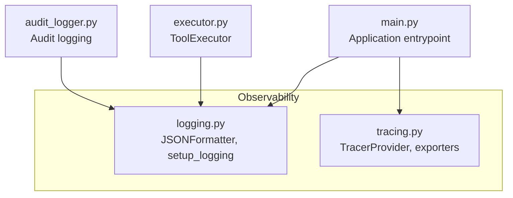
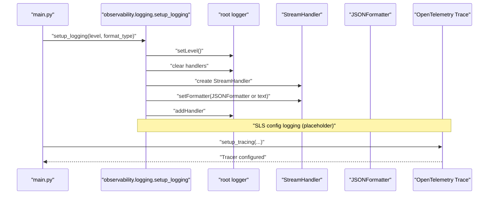
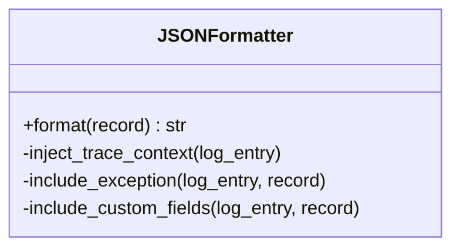
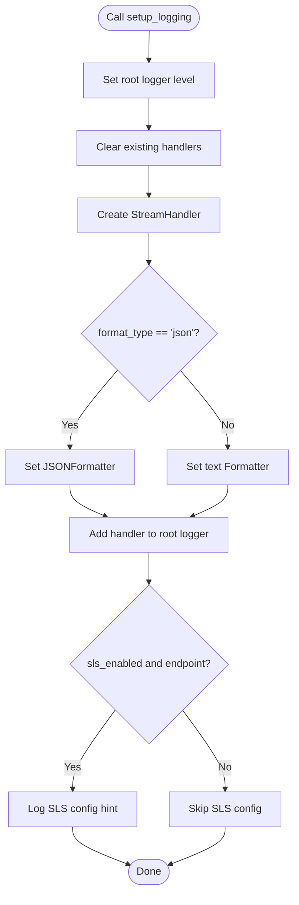
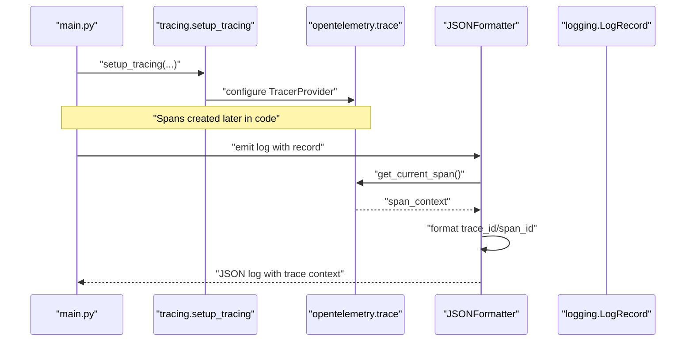
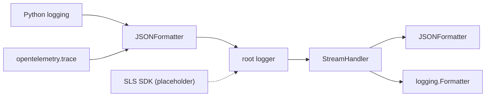

# Logging System

<cite>
**Referenced Files in This Document**
- [logging.py](file://src/aiops_agent/observability/logging.py)
- [__init__.py](file://src/aiops_agent/observability/__init__.py)
- [main.py](file://src/aiops_agent/main.py)
- [test_observability_logging.py](file://tests/test_observability_logging.py)
- [tracing.py](file://src/aiops_agent/observability/tracing.py)
- [executor.py](file://src/aiops_agent/tools/executor.py)
- [audit_logger.py](file://src/aiops_agent/security/audit_logger.py)
</cite>

## Table of Contents
1. [Introduction](#introduction)
2. [Project Structure](#project-structure)
3. [Core Components](#core-components)
4. [Architecture Overview](#architecture-overview)
5. [Detailed Component Analysis](#detailed-component-analysis)
6. [Dependency Analysis](#dependency-analysis)
7. [Performance Considerations](#performance-considerations)
8. [Troubleshooting Guide](#troubleshooting-guide)
9. [Conclusion](#conclusion)
10. [Appendices](#appendices)

## Introduction
This document explains the AIOps Agent’s structured logging system with a focus on the JSONFormatter implementation that automatically injects OpenTelemetry trace_id and span_id into log entries. It documents the log entry structure, the setup_logging function with configuration options for log levels, format types, and SLS integration, and demonstrates how to add custom fields using the extra parameter. Best practices for log analysis and integration with Alibaba Cloud SLS for centralized log management are included.

## Project Structure
The logging system resides in the observability package and integrates with OpenTelemetry tracing and the main application initialization.

**Diagram sources**
- [logging.py:60-110](file://src/aiops_agent/observability/logging.py#L60-L110)
- [tracing.py:32-87](file://src/aiops_agent/observability/tracing.py#L32-L87)
- [main.py:85-94](file://src/aiops_agent/main.py#L85-L94)
- [executor.py:104-225](file://src/aiops_agent/tools/executor.py#L104-L225)
- [audit_logger.py:65-103](file://src/aiops_agent/security/audit_logger.py#L65-L103)

**Section sources**
- [logging.py:1-111](file://src/aiops_agent/observability/logging.py#L1-L111)
- [main.py:85-94](file://src/aiops_agent/main.py#L85-L94)

## Core Components
- JSONFormatter: A logging.Formatter subclass that emits JSON logs with standardized fields and automatic OpenTelemetry trace context injection.
- setup_logging: A configuration function that sets up the root logger with a console handler, chooses JSON or text formatting, and logs SLS configuration hints.

Key behaviors:
- JSON log entry structure includes timestamp, level, logger name, message, optional exception, and optional custom fields.
- Automatic trace_id and span_id injection when an OpenTelemetry span is active.
- Optional SLS integration configuration hook for future SDK handler integration.

**Section sources**
- [logging.py:18-58](file://src/aiops_agent/observability/logging.py#L18-L58)
- [logging.py:60-110](file://src/aiops_agent/observability/logging.py#L60-L110)

## Architecture Overview
The logging system integrates with OpenTelemetry tracing so that each log entry carries the current trace context. The main application initializes logging and tracing during startup.

**Diagram sources**
- [main.py:85-94](file://src/aiops_agent/main.py#L85-L94)
- [logging.py:60-110](file://src/aiops_agent/observability/logging.py#L60-L110)
- [tracing.py:32-87](file://src/aiops_agent/observability/tracing.py#L32-L87)

## Detailed Component Analysis

### JSONFormatter
JSONFormatter builds a structured log entry dictionary and serializes it to JSON. It includes:
- Timestamp in ISO 8601 UTC
- Level name
- Logger name
- Formatted message
- Optional exception details when available
- Optional custom fields extracted from the LogRecord: extra_data, session_id, skill_name, tool_name
- Automatic trace_id and span_id when an OpenTelemetry span is active

**Diagram sources**
- [logging.py:18-58](file://src/aiops_agent/observability/logging.py#L18-L58)

Implementation highlights:
- Timestamp conversion to ISO 8601 UTC ensures consistent time zone handling.
- Exception inclusion uses the formatter’s built-in exception formatting.
- Custom fields are read from the LogRecord attributes and added only when present.
- Trace context is injected only when the current span is valid.

Best practices:
- Use the extra parameter to pass contextual metadata (e.g., session_id, skill_name, tool_name).
- Keep extra_data as a dictionary for structured enrichment.
- Avoid passing sensitive data directly in custom fields; rely on sanitization elsewhere.

**Section sources**
- [logging.py:18-58](file://src/aiops_agent/observability/logging.py#L18-L58)

### setup_logging
The setup_logging function configures the root logger with:
- Log level selection (DEBUG/INFO/WARNING/ERROR)
- Format type selection (“json” or “text”)
- Console handler creation with the appropriate formatter
- SLS configuration logging placeholder (integration point for SDK handler)

Behavioral guarantees verified by tests:
- JSON vs text formatter assignment
- Log level setting
- Handler replacement semantics
- SLS configuration logging when enabled and endpoint provided

**Diagram sources**
- [logging.py:60-110](file://src/aiops_agent/observability/logging.py#L60-L110)

**Section sources**
- [logging.py:60-110](file://src/aiops_agent/observability/logging.py#L60-L110)
- [test_observability_logging.py:181-259](file://tests/test_observability_logging.py#L181-L259)

### OpenTelemetry Integration
The JSONFormatter reads the current span context from OpenTelemetry and injects trace_id and span_id into the log entry when a valid span exists. The main application initializes tracing separately via setup_tracing.

**Diagram sources**
- [tracing.py:32-87](file://src/aiops_agent/observability/tracing.py#L32-L87)
- [logging.py:40-46](file://src/aiops_agent/observability/logging.py#L40-L46)

**Section sources**
- [tracing.py:32-87](file://src/aiops_agent/observability/tracing.py#L32-L87)
- [logging.py:40-46](file://src/aiops_agent/observability/logging.py#L40-L46)

### Structured Log Output and Custom Fields
The JSONFormatter supports custom fields via the LogRecord extra parameter. Tests demonstrate:
- Presence of extra_data, session_id, skill_name, tool_name when set on the record
- Absence of missing fields when not set
- Proper exception serialization when exc_info is provided

Example usage patterns:
- Pass extra fields when emitting logs to enrich downstream analysis.
- Use session_id to correlate logs across a user session.
- Use skill_name and tool_name to tag logs originating from specific skills/tools.

**Section sources**
- [test_observability_logging.py:90-114](file://tests/test_observability_logging.py#L90-L114)
- [logging.py:51-56](file://src/aiops_agent/observability/logging.py#L51-L56)

### Integration with Alibaba Cloud SLS
The logging system includes a configuration hook for Alibaba Cloud SLS:
- setup_logging logs SLS configuration hints when sls_enabled is true and an endpoint is provided.
- The comment indicates that a real SLS SDK handler would be integrated at the indicated location.

Operational guidance:
- Provide sls_endpoint, sls_project, and sls_logstore when enabling SLS.
- Ensure the SLS endpoint is reachable and credentials are configured appropriately.
- After integration, route logs to SLS using the configured handler.

**Section sources**
- [logging.py:99-109](file://src/aiops_agent/observability/logging.py#L99-L109)

## Dependency Analysis
The logging system depends on:
- Python logging framework
- OpenTelemetry trace API for span context extraction
- Optional SLS SDK integration (placeholder in code)

**Diagram sources**
- [logging.py:15](file://src/aiops_agent/observability/logging.py#L15)
- [logging.py:18-58](file://src/aiops_agent/observability/logging.py#L18-L58)
- [logging.py:87-95](file://src/aiops_agent/observability/logging.py#L87-L95)
- [logging.py:99-109](file://src/aiops_agent/observability/logging.py#L99-L109)

**Section sources**
- [logging.py:15-15](file://src/aiops_agent/observability/logging.py#L15-L15)
- [logging.py:18-58](file://src/aiops_agent/observability/logging.py#L18-L58)
- [logging.py:87-95](file://src/aiops_agent/observability/logging.py#L87-L95)
- [logging.py:99-109](file://src/aiops_agent/observability/logging.py#L99-L109)

## Performance Considerations
- JSON serialization overhead is minimal for typical log volumes; keep extra_data compact.
- Avoid embedding large objects in custom fields to prevent bloated log entries.
- Prefer structured fields (e.g., dictionaries) for extra_data to enable efficient downstream filtering.
- Ensure trace context is only injected when spans are active; otherwise, avoid unnecessary overhead.

## Troubleshooting Guide
Common issues and resolutions:
- Missing trace_id/span_id: Ensure an OpenTelemetry TracerProvider is configured and spans are active when logging.
- SLS integration not taking effect: Verify sls_enabled is true and sls_endpoint is non-empty; confirm the placeholder handler integration is implemented.
- Unexpected custom fields: Confirm extra fields are set on the LogRecord and not None.
- Handler duplication: setup_logging clears existing handlers; ensure it is called before other logging configurations.

Validation references:
- Tests verify JSON vs text formatter selection, log level behavior, and SLS configuration logging.
- Tests verify absence of trace_id/span_id when no active span exists and presence when a span is active.

**Section sources**
- [test_observability_logging.py:133-170](file://tests/test_observability_logging.py#L133-L170)
- [test_observability_logging.py:181-259](file://tests/test_observability_logging.py#L181-L259)

## Conclusion
The AIOps Agent’s logging system provides structured, trace-aware JSON logs suitable for centralized log management. The JSONFormatter automatically enriches logs with OpenTelemetry trace context, while setup_logging offers flexible configuration for format and SLS integration. By leveraging custom fields and following best practices, teams can achieve robust, searchable, and actionable operational insights.

## Appendices

### Log Entry Structure Reference
- timestamp: ISO 8601 UTC timestamp
- level: Log level name (e.g., INFO, WARNING)
- logger: Logger name
- message: Formatted log message
- exception: Serialized exception details (when applicable)
- trace_id: Hex-encoded 32-character trace identifier (when span is active)
- span_id: Hex-encoded 16-character span identifier (when span is active)
- extra_data: Arbitrary structured data passed via extra parameter
- session_id: Session identifier for correlation
- skill_name: Originating skill name
- tool_name: Tool name responsible for the log

**Section sources**
- [logging.py:30-57](file://src/aiops_agent/observability/logging.py#L30-L57)

### Example Usage Patterns
- Initialize logging and tracing in the application entrypoint.
- Emit logs with extra fields to capture session and skill/tool context.
- Integrate SLS SDK handler when ready and provide endpoint/project/logstore.

**Section sources**
- [main.py:85-94](file://src/aiops_agent/main.py#L85-L94)
- [logging.py:60-110](file://src/aiops_agent/observability/logging.py#L60-L110)