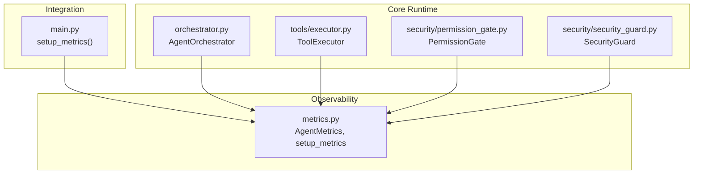
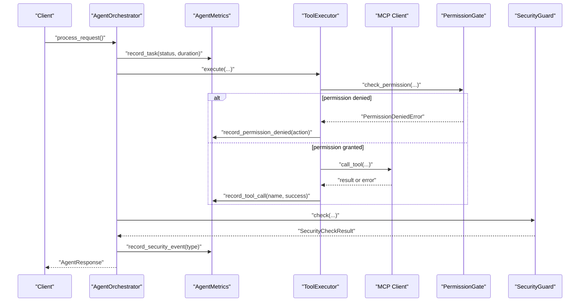
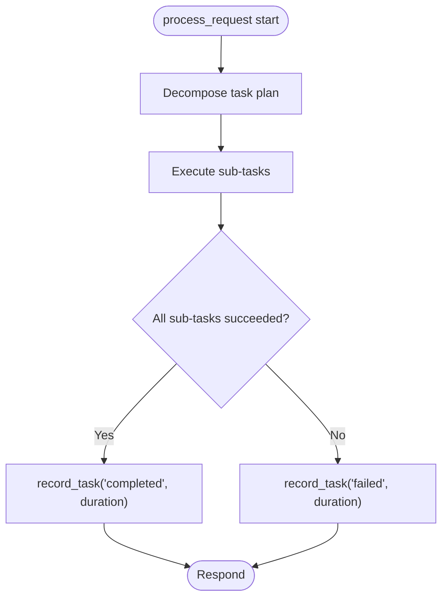
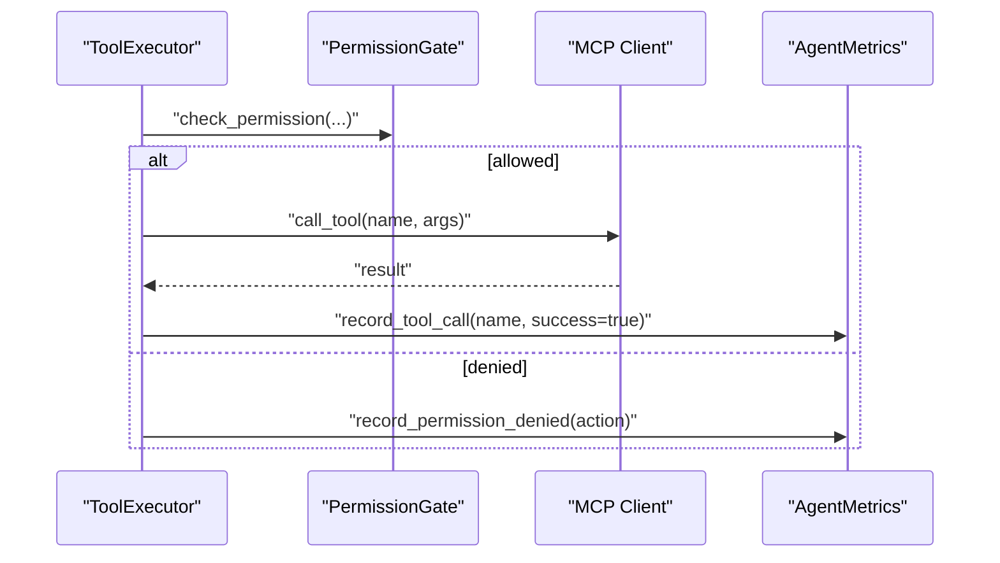
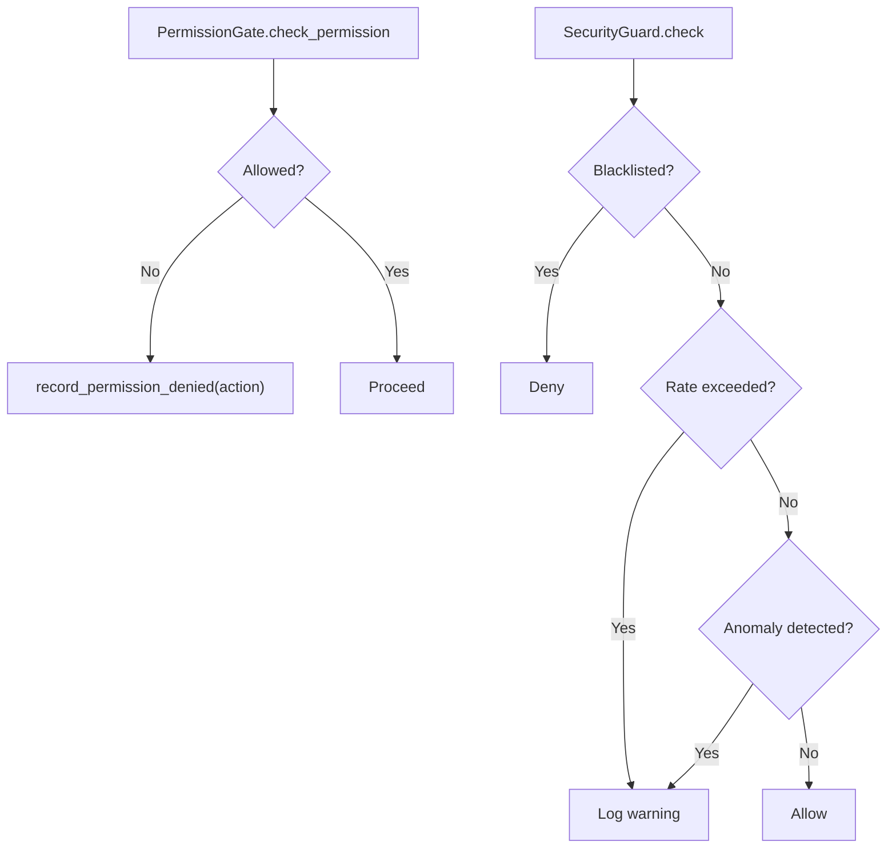
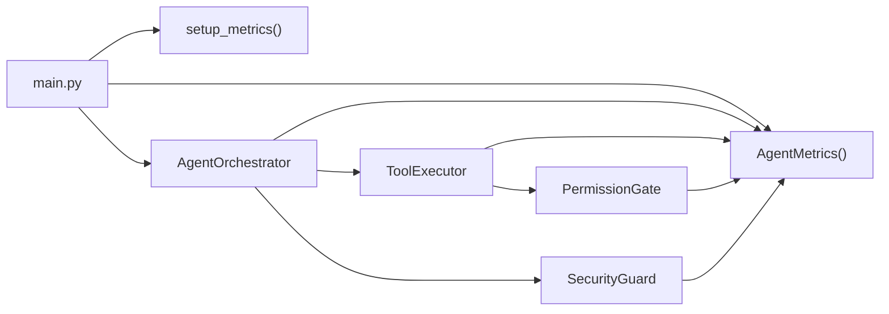

# Metrics Collection

<cite>
**Referenced Files in This Document**
- [metrics.py](file://src/aiops_agent/observability/metrics.py)
- [main.py](file://src/aiops_agent/main.py)
- [orchestrator.py](file://src/aiops_agent/core/orchestrator.py)
- [executor.py](file://src/aiops_agent/tools/executor.py)
- [mcp_client.py](file://src/aiops_agent/tools/mcp_client.py)
- [permission_gate.py](file://src/aiops_agent/security/permission_gate.py)
- [security_guard.py](file://src/aiops_agent/security/security_guard.py)
- [test_observability_metrics.py](file://tests/test_observability_metrics.py)
</cite>

## Table of Contents
1. [Introduction](#introduction)
2. [Project Structure](#project-structure)
3. [Core Components](#core-components)
4. [Architecture Overview](#architecture-overview)
5. [Detailed Component Analysis](#detailed-component-analysis)
6. [Dependency Analysis](#dependency-analysis)
7. [Performance Considerations](#performance-considerations)
8. [Troubleshooting Guide](#troubleshooting-guide)
9. [Conclusion](#conclusion)

## Introduction
This document explains the AIOps Agent’s metrics collection system. It covers how operational metrics are defined, named, aggregated, and exported; how they are produced during agent operations, skill execution, and MCP server interactions; and how they integrate with monitoring systems. It also provides guidance on metric data structures, collection intervals, retention/storage considerations, and alerting thresholds.

## Project Structure
The metrics system is implemented under the observability module and integrated across the agent lifecycle:
- Metrics definitions and exporters live in the observability package.
- The Orchestrator records task-level metrics.
- The Tool Executor records tool call outcomes.
- The Permission Gate and Security Guard feed permission and security-related metrics.
- The main entry initializes OpenTelemetry components and wires metrics into the runtime.

**Diagram sources**
- [metrics.py:26-149](file://src/aiops_agent/observability/metrics.py#L26-L149)
- [main.py:85-96](file://src/aiops_agent/main.py#L85-L96)
- [orchestrator.py:153-154](file://src/aiops_agent/core/orchestrator.py#L153-L154)
- [executor.py:161-167](file://src/aiops_agent/tools/executor.py#L161-L167)
- [permission_gate.py:147-154](file://src/aiops_agent/security/permission_gate.py#L147-L154)
- [security_guard.py:84-93](file://src/aiops_agent/security/security_guard.py#L84-L93)

**Section sources**
- [metrics.py:108-141](file://src/aiops_agent/observability/metrics.py#L108-L141)
- [main.py:85-96](file://src/aiops_agent/main.py#L85-L96)

## Core Components
- AgentMetrics: Defines and records core operational metrics using OpenTelemetry instruments.
- setup_metrics: Initializes the OpenTelemetry MeterProvider with periodic exporting.
- AgentOrchestrator: Records task completion and duration.
- ToolExecutor: Records tool call success/failure and emits spans with durations.
- PermissionGate: Produces permission-denied events suitable for metrics recording.
- SecurityGuard: Produces security events suitable for metrics recording.

Key metric definitions and naming conventions:
- aiops.task.total: Counter of tasks, labeled by status.
- aiops.task.duration: Histogram of task durations (milliseconds), labeled by status.
- aiops.permission.denied.total: Counter of permission denials, labeled by action.
- aiops.security.events.total: Counter of security events, labeled by event_type.
- aiops.tool.calls.total: Counter of tool calls, labeled by tool_name and success.
- aiops.llm.calls.total: Counter of LLM calls, labeled by provider and success.

Aggregation patterns:
- Counters support monotonic totals and label filtering.
- Histograms support latency distributions per status.

Collection intervals:
- Export interval defaults to 60 seconds via PeriodicExportingMetricReader.

**Section sources**
- [metrics.py:26-105](file://src/aiops_agent/observability/metrics.py#L26-L105)
- [metrics.py:108-141](file://src/aiops_agent/observability/metrics.py#L108-L141)

## Architecture Overview
The metrics pipeline integrates with the agent lifecycle and external systems:

**Diagram sources**
- [orchestrator.py:153-154](file://src/aiops_agent/core/orchestrator.py#L153-L154)
- [executor.py:161-167](file://src/aiops_agent/tools/executor.py#L161-L167)
- [permission_gate.py:147-154](file://src/aiops_agent/security/permission_gate.py#L147-L154)
- [security_guard.py:84-93](file://src/aiops_agent/security/security_guard.py#L84-L93)
- [mcp_client.py:135-155](file://src/aiops_agent/tools/mcp_client.py#L135-L155)
- [metrics.py:81-105](file://src/aiops_agent/observability/metrics.py#L81-L105)

## Detailed Component Analysis

### Metrics Definitions and Export Pipeline
- Instrument creation: Counters and histograms are created with explicit names, units, and descriptions.
- Exporter: ConsoleMetricExporter with PeriodicExportingMetricReader configured with export_interval_ms.
- Resource attributes: service.name and service.version are attached to emitted metrics.

Metric data structures:
- Counters: increment by 1 per event; labels include status, action, event_type, tool_name, provider, success.
- Histograms: record durations in milliseconds; labels include status.

Collection intervals:
- Default export interval is 60000 ms; configurable via setup_metrics.

Best practices:
- Use labels to segment counters for efficient post-hoc filtering.
- Record durations only when meaningful (> 0).

**Section sources**
- [metrics.py:26-105](file://src/aiops_agent/observability/metrics.py#L26-L105)
- [metrics.py:108-141](file://src/aiops_agent/observability/metrics.py#L108-L141)

### Task Execution Metrics
- AgentOrchestrator records aiops.task.total and optionally aiops.task.duration upon completion or failure.
- Duration is derived from wall-clock timing around the orchestration flow.

**Diagram sources**
- [orchestrator.py:153-154](file://src/aiops_agent/core/orchestrator.py#L153-L154)
- [orchestrator.py:361-362](file://src/aiops_agent/core/orchestrator.py#L361-L362)

**Section sources**
- [orchestrator.py:153-154](file://src/aiops_agent/core/orchestrator.py#L153-L154)
- [orchestrator.py:361-362](file://src/aiops_agent/core/orchestrator.py#L361-L362)

### Tool Call Metrics
- ToolExecutor executes tools and records aiops.tool.calls.total with labels tool_name and success.
- Success is determined from ToolResult; duration is captured in the span attribute tool.duration_ms.

**Diagram sources**
- [executor.py:161-167](file://src/aiops_agent/tools/executor.py#L161-L167)
- [permission_gate.py:147-154](file://src/aiops_agent/security/permission_gate.py#L147-L154)
- [mcp_client.py:135-155](file://src/aiops_agent/tools/mcp_client.py#L135-L155)
- [metrics.py:95-99](file://src/aiops_agent/observability/metrics.py#L95-L99)

**Section sources**
- [executor.py:161-167](file://src/aiops_agent/tools/executor.py#L161-L167)
- [metrics.py:95-99](file://src/aiops_agent/observability/metrics.py#L95-L99)

### Permission and Security Metrics
- PermissionGate produces PermissionCheckResult indicating whether an action was allowed; failures are surfaced to ToolExecutor which records aiops.permission.denied.total.
- SecurityGuard performs checks and logs warnings; Orchestrator records aiops.security.events.total when marking skills unhealthy.

**Diagram sources**
- [permission_gate.py:147-154](file://src/aiops_agent/security/permission_gate.py#L147-L154)
- [security_guard.py:84-93](file://src/aiops_agent/security/security_guard.py#L84-L93)
- [orchestrator.py:594-595](file://src/aiops_agent/core/orchestrator.py#L594-L595)

**Section sources**
- [permission_gate.py:147-154](file://src/aiops_agent/security/permission_gate.py#L147-L154)
- [security_guard.py:84-93](file://src/aiops_agent/security/security_guard.py#L84-L93)
- [orchestrator.py:594-595](file://src/aiops_agent/core/orchestrator.py#L594-L595)

### Integration with Monitoring Systems
- Exporter: ConsoleMetricExporter is configured by default; the system is designed to support alternate exporters (e.g., OTLP) by extending setup_metrics.
- Resource attributes: service.name and service.version are attached to all metrics.
- Integration points: setup_metrics returns a Meter for reuse; AgentMetrics instances can be passed to components at construction time.

**Section sources**
- [metrics.py:108-141](file://src/aiops_agent/observability/metrics.py#L108-L141)
- [main.py:85-96](file://src/aiops_agent/main.py#L85-L96)

## Dependency Analysis
- Initialization dependency: main.py calls setup_metrics and constructs AgentMetrics, passing it to AgentOrchestrator.
- Runtime dependency: Orchestrator depends on AgentMetrics for task metrics; ToolExecutor records tool call metrics; PermissionGate and SecurityGuard influence security metrics.
- Export dependency: setup_metrics configures MeterProvider and PeriodicExportingMetricReader.

**Diagram sources**
- [main.py:85-96](file://src/aiops_agent/main.py#L85-L96)
- [orchestrator.py:73-73](file://src/aiops_agent/core/orchestrator.py#L73-L73)
- [executor.py:68-74](file://src/aiops_agent/tools/executor.py#L68-L74)
- [permission_gate.py:95-101](file://src/aiops_agent/security/permission_gate.py#L95-L101)
- [security_guard.py:64-69](file://src/aiops_agent/security/security_guard.py#L64-L69)

**Section sources**
- [main.py:85-96](file://src/aiops_agent/main.py#L85-L96)
- [orchestrator.py:73-73](file://src/aiops_agent/core/orchestrator.py#L73-L73)
- [executor.py:68-74](file://src/aiops_agent/tools/executor.py#L68-L74)

## Performance Considerations
- Metric cardinality: Prefer concise label values (e.g., short tool names, bounded event types) to avoid excessive series.
- Histogram selection: Use aiops.task.duration for latency distribution; ensure durations are meaningful (> 0) to avoid skewing.
- Export frequency: Tune export_interval_ms based on backend capacity and desired resolution.
- Span correlation: ToolExecutor sets tool.duration_ms in spans; leverage OpenTelemetry correlation for end-to-end latency analysis.

[No sources needed since this section provides general guidance]

## Troubleshooting Guide
Common issues and resolutions:
- No metrics exported: Verify setup_metrics is called and MeterProvider is initialized. Confirm export_interval_ms is appropriate.
- Missing tool durations: Ensure ToolExecutor spans capture tool.duration_ms and ToolExecutor records tool calls.
- Permission-denied metrics missing: Confirm ToolExecutor records aiops.permission.denied.total when PermissionGate denies actions.
- Security events missing: Confirm Orchestrator records aiops.security.events.total when marking skills unhealthy.

Validation references:
- Unit tests confirm counters and histograms are created and incremented under various scenarios.

**Section sources**
- [test_observability_metrics.py:20-35](file://tests/test_observability_metrics.py#L20-L35)
- [test_observability_metrics.py:41-65](file://tests/test_observability_metrics.py#L41-L65)
- [test_observability_metrics.py:68-82](file://tests/test_observability_metrics.py#L68-L82)
- [test_observability_metrics.py:88-100](file://tests/test_observability_metrics.py#L88-L100)
- [test_observability_metrics.py:106-116](file://tests/test_observability_metrics.py#L106-L116)
- [test_observability_metrics.py:122-132](file://tests/test_observability_metrics.py#L122-L132)

## Conclusion
The AIOps Agent’s metrics system provides comprehensive coverage of task execution, tool usage, permissions, and security events. It leverages OpenTelemetry for standardized instrumentation and periodic export, enabling integration with monitoring stacks. By following the naming conventions, labeling best practices, and export configuration guidance, teams can build robust observability and alerting around agent operations.