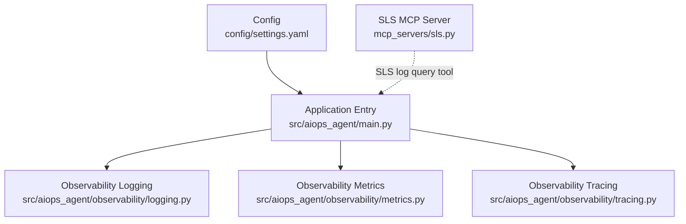
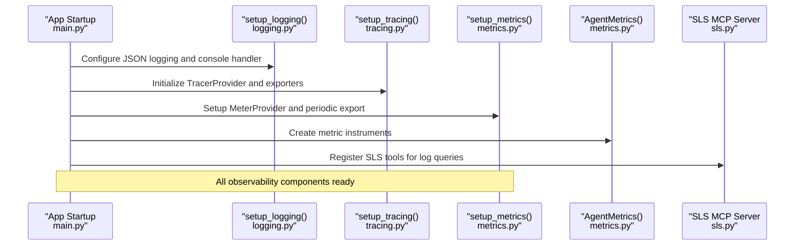
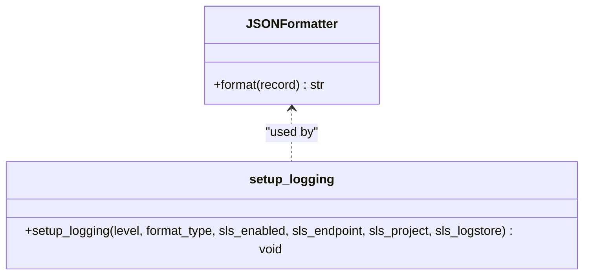
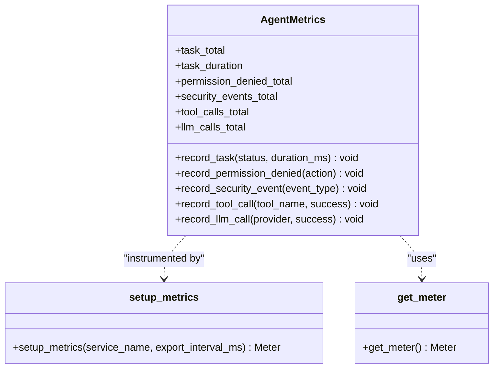
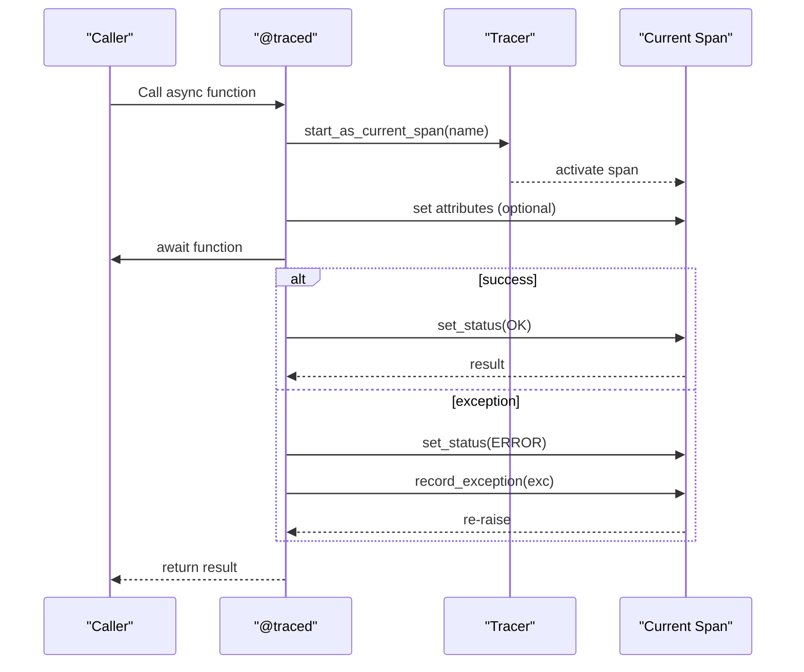
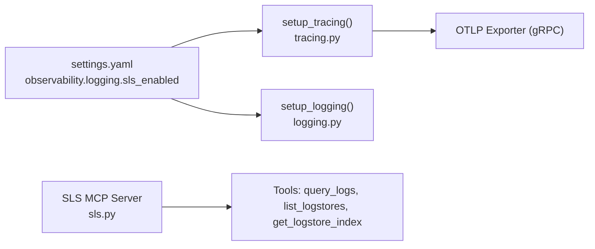
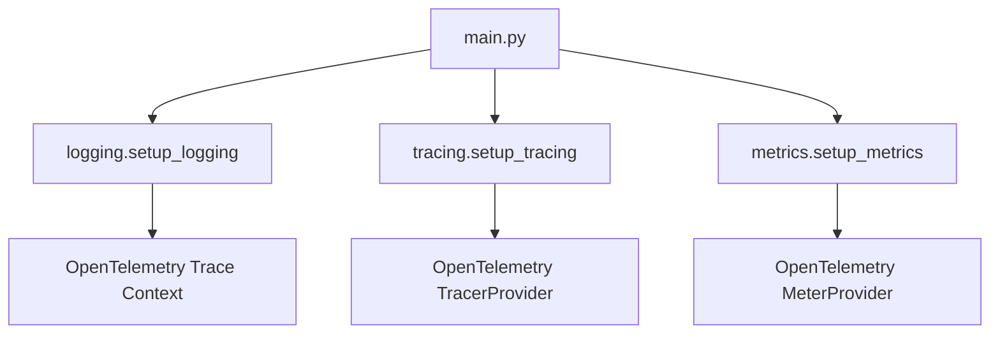

# Observability

<cite>
**Referenced Files in This Document**
- [README.md](file://README.md)
- [settings.yaml](file://config/settings.yaml)
- [main.py](file://src/aiops_agent/main.py)
- [logging.py](file://src/aiops_agent/observability/logging.py)
- [metrics.py](file://src/aiops_agent/observability/metrics.py)
- [tracing.py](file://src/aiops_agent/observability/tracing.py)
- [sls.py](file://mcp_servers/sls.py)
- [test_observability_logging.py](file://tests/test_observability_logging.py)
- [test_observability_metrics.py](file://tests/test_observability_metrics.py)
- [test_observability_tracing.py](file://tests/test_observability_tracing.py)
</cite>

## Table of Contents
1. [Introduction](#introduction)
2. [Project Structure](#project-structure)
3. [Core Components](#core-components)
4. [Architecture Overview](#architecture-overview)
5. [Detailed Component Analysis](#detailed-component-analysis)
6. [Dependency Analysis](#dependency-analysis)
7. [Performance Considerations](#performance-considerations)
8. [Troubleshooting Guide](#troubleshooting-guide)
9. [Conclusion](#conclusion)
10. [Appendices](#appendices)

## Introduction
This document explains the AIOps Agent’s observability capabilities: structured logging with automatic trace_id/span_id injection and JSON formatting, metrics collection for core operational indicators, and OpenTelemetry tracing with the @traced decorator. It also covers integration points with Alibaba Cloud SLS for log export and monitoring, configuration options, metric definitions, best practices for production monitoring, and practical examples for log analysis and troubleshooting.

## Project Structure
The observability subsystem resides under src/aiops_agent/observability and integrates with the application entrypoint and configuration.

**Diagram sources**
- [main.py:85-96](file://src/aiops_agent/main.py#L85-L96)
- [logging.py:60-111](file://src/aiops_agent/observability/logging.py#L60-L111)
- [metrics.py:108-150](file://src/aiops_agent/observability/metrics.py#L108-L150)
- [tracing.py:32-88](file://src/aiops_agent/observability/tracing.py#L32-L88)
- [settings.yaml:62-77](file://config/settings.yaml#L62-L77)
- [sls.py:49-91](file://mcp_servers/sls.py#L49-L91)

**Section sources**
- [README.md:171-177](file://README.md#L171-L177)
- [settings.yaml:62-77](file://config/settings.yaml#L62-L77)
- [main.py:85-96](file://src/aiops_agent/main.py#L85-L96)

## Core Components
- Structured logging with JSONFormatter that automatically injects OpenTelemetry trace_id and span_id, plus support for extra fields and exception capture.
- Metrics collection via OpenTelemetry MeterProvider with core operational metrics: task_total, task_duration, permission_denied_total, security_events_total, tool_calls_total, llm_calls_total.
- OpenTelemetry tracing with a @traced decorator for asynchronous functions, automatic span lifecycle management, and configurable exporters including SLS via OTLP.

**Section sources**
- [logging.py:18-58](file://src/aiops_agent/observability/logging.py#L18-L58)
- [metrics.py:26-106](file://src/aiops_agent/observability/metrics.py#L26-L106)
- [tracing.py:98-137](file://src/aiops_agent/observability/tracing.py#L98-L137)

## Architecture Overview
The observability stack is initialized during application startup and shared across the runtime. Logging is configured early, tracing is set up next, and metrics are registered with a MeterProvider. The SLS MCP server provides a tool for querying logs, complementing the structured logging pipeline.

**Diagram sources**
- [main.py:85-96](file://src/aiops_agent/main.py#L85-L96)
- [logging.py:60-111](file://src/aiops_agent/observability/logging.py#L60-L111)
- [tracing.py:32-88](file://src/aiops_agent/observability/tracing.py#L32-L88)
- [metrics.py:108-150](file://src/aiops_agent/observability/metrics.py#L108-L150)
- [sls.py:49-91](file://mcp_servers/sls.py#L49-L91)

## Detailed Component Analysis

### Structured Logging System
- JSONFormatter emits ISO 8601 timestamps, level, logger name, message, and optional trace_id/span_id when an OpenTelemetry span is active.
- Extra fields such as extra_data, session_id, skill_name, and tool_name are included when provided.
- Exception information is captured and serialized.
- setup_logging configures the root logger with either JSON or text formatting, sets the desired level, and supports SLS integration hooks.

**Diagram sources**
- [logging.py:18-58](file://src/aiops_agent/observability/logging.py#L18-L58)
- [logging.py:60-111](file://src/aiops_agent/observability/logging.py#L60-L111)

**Section sources**
- [logging.py:18-58](file://src/aiops_agent/observability/logging.py#L18-L58)
- [logging.py:60-111](file://src/aiops_agent/observability/logging.py#L60-L111)
- [test_observability_logging.py:14-114](file://tests/test_observability_logging.py#L14-L114)
- [test_observability_logging.py:116-170](file://tests/test_observability_logging.py#L116-L170)

### Metrics Collection System
- AgentMetrics defines counters and histograms for:
  - aiops.task.total (by status)
  - aiops.task.duration (milliseconds, by status)
  - aiops.permission.denied.total (by action)
  - aiops.security.events.total (by event_type)
  - aiops.tool.calls.total (by tool_name, success)
  - aiops.llm.calls.total (by provider, success)
- setup_metrics initializes a MeterProvider with periodic export and sets the global provider. get_meter lazily creates a default meter if needed.

**Diagram sources**
- [metrics.py:26-106](file://src/aiops_agent/observability/metrics.py#L26-L106)
- [metrics.py:108-150](file://src/aiops_agent/observability/metrics.py#L108-L150)

**Section sources**
- [metrics.py:26-106](file://src/aiops_agent/observability/metrics.py#L26-L106)
- [metrics.py:108-150](file://src/aiops_agent/observability/metrics.py#L108-L150)
- [test_observability_metrics.py:17-37](file://tests/test_observability_metrics.py#L17-L37)
- [test_observability_metrics.py:38-66](file://tests/test_observability_metrics.py#L38-L66)

### OpenTelemetry Tracing and @traced Decorator
- setup_tracing configures a TracerProvider with either console or SLS exporters. SLS exporter uses OTLP over gRPC when available; otherwise falls back to console.
- get_tracer lazily creates a default tracer if needed.
- @traced wraps async functions, starting a span with optional custom attributes, setting status OK on success or ERROR on exception, and recording exceptions.

**Diagram sources**
- [tracing.py:98-137](file://src/aiops_agent/observability/tracing.py#L98-L137)

**Section sources**
- [tracing.py:32-88](file://src/aiops_agent/observability/tracing.py#L32-L88)
- [tracing.py:98-137](file://src/aiops_agent/observability/tracing.py#L98-L137)
- [test_observability_tracing.py:39-175](file://tests/test_observability_tracing.py#L39-L175)

### Integration with Alibaba Cloud SLS
- Application configuration supports enabling SLS exporters for tracing and logging, and includes SLS endpoints and credentials placeholders.
- The SLS MCP server exposes tools for querying logs, listing logstores, and retrieving logstore index metadata, enabling log analysis directly from skills/tools.

**Diagram sources**
- [settings.yaml:62-77](file://config/settings.yaml#L62-L77)
- [tracing.py:64-82](file://src/aiops_agent/observability/tracing.py#L64-L82)
- [logging.py:100-109](file://src/aiops_agent/observability/logging.py#L100-L109)
- [sls.py:49-91](file://mcp_servers/sls.py#L49-L91)

**Section sources**
- [settings.yaml:62-77](file://config/settings.yaml#L62-L77)
- [sls.py:49-91](file://mcp_servers/sls.py#L49-L91)

## Dependency Analysis
- The application entrypoint initializes observability components before constructing other runtime components.
- Logging depends on OpenTelemetry trace context to inject trace_id/span_id.
- Metrics depend on a configured MeterProvider and periodic export.
- Tracing depends on a TracerProvider and exporter selection.

**Diagram sources**
- [main.py:85-96](file://src/aiops_agent/main.py#L85-L96)
- [logging.py:15](file://src/aiops_agent/observability/logging.py#L15)
- [tracing.py:13-22](file://src/aiops_agent/observability/tracing.py#L13-L22)
- [metrics.py:12-18](file://src/aiops_agent/observability/metrics.py#L12-L18)

**Section sources**
- [main.py:85-96](file://src/aiops_agent/main.py#L85-L96)

## Performance Considerations
- Prefer JSON logging in production for efficient parsing and aggregation.
- Use periodic export intervals tuned to your ingestion capacity; shorter intervals increase overhead but reduce latency in metric visibility.
- Limit extra fields in logs to essential context to minimize payload size.
- Use @traced judiciously around high-frequency async calls; consider sampling or selective spans in hot paths.
- For SLS exporters, ensure network reliability and consider batching or retry policies at the exporter layer.

[No sources needed since this section provides general guidance]

## Troubleshooting Guide
- Verify trace_id/span_id presence in logs: when no active span exists, these fields are omitted; ensure tracing is initialized and spans are active.
- Confirm exporter configuration: if OTLP is unavailable, setup_tracing falls back to console; confirm environment and dependencies.
- Validate metric export: ensure setup_metrics is invoked and the MeterProvider is configured; check export interval and console output.
- Use SLS MCP tools to validate log ingestion and query patterns; confirm project/logstore names and permissions.

**Section sources**
- [test_observability_logging.py:133-170](file://tests/test_observability_logging.py#L133-L170)
- [test_observability_tracing.py:177-210](file://tests/test_observability_tracing.py#L177-L210)
- [test_observability_metrics.py:135-157](file://tests/test_observability_metrics.py#L135-L157)

## Conclusion
The AIOps Agent’s observability stack provides a robust foundation for production monitoring: structured JSON logs with automatic trace correlation, comprehensive operational metrics, and distributed tracing with the @traced decorator. Integration with Alibaba Cloud SLS enables seamless log export and analysis. Proper configuration and adherence to best practices ensure reliable, actionable telemetry across environments.

[No sources needed since this section summarizes without analyzing specific files]

## Appendices

### Configuration Options
- observability.tracing.enabled: Enable tracing.
- observability.tracing.exporter: "console" or "sls".
- observability.tracing.sls_endpoint, observability.tracing.sls_project, observability.tracing.sls_logstore: SLS exporter configuration.
- observability.metrics.enabled: Enable metrics.
- observability.metrics.export_interval_seconds: Export interval in seconds.
- observability.logging.level: Logging level (DEBUG/INFO/WARNING/ERROR).
- observability.logging.format: "json" or "text".
- observability.logging.sls_enabled: Enable SLS logging integration hook.

**Section sources**
- [settings.yaml:62-77](file://config/settings.yaml#L62-L77)

### Metric Definitions
- aiops.task.total: Counter of tasks by status.
- aiops.task.duration: Histogram of task durations in milliseconds by status.
- aiops.permission.denied.total: Counter of permission denials by action.
- aiops.security.events.total: Counter of security events by type.
- aiops.tool.calls.total: Counter of tool calls by tool_name and success.
- aiops.llm.calls.total: Counter of LLM calls by provider and success.

**Section sources**
- [metrics.py:26-106](file://src/aiops_agent/observability/metrics.py#L26-L106)

### Best Practices for Production Monitoring
- Always initialize observability early in application startup.
- Use JSON logging in production for downstream log processors.
- Configure SLS exporters for tracing and metrics in managed environments.
- Attach minimal, meaningful attributes to spans to avoid noise.
- Monitor metric cardinality; limit label values to bounded sets.
- Use health endpoints and readiness checks to gate traffic during initialization.

[No sources needed since this section provides general guidance]

### Example Scenarios
- Log analysis with trace correlation:
  - Emit logs with extra fields (e.g., session_id, skill_name, tool_name).
  - Use SLS MCP tools to query logs by trace_id or session_id.
- Troubleshooting a failed tool call:
  - Inspect logs for exception fields and trace_id.
  - Reconstruct the call chain using the trace_id in the tracing backend.
- Monitoring task performance:
  - Observe aiops.task.duration histograms by status to detect regressions.
  - Track aiops.tool.calls.total and aiops.llm.calls.total to correlate with latency.

[No sources needed since this section provides general guidance]