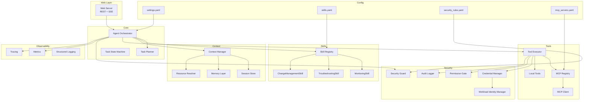
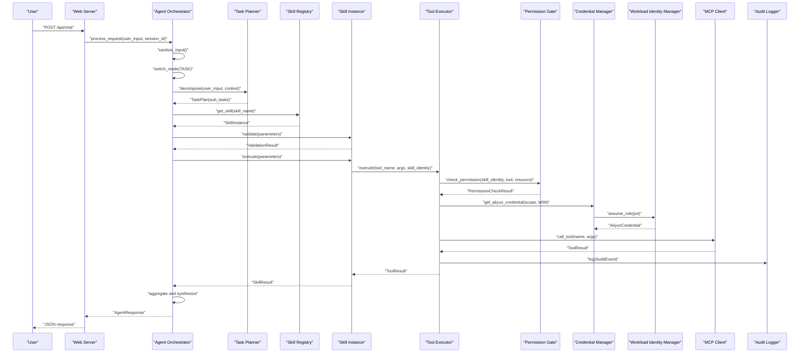
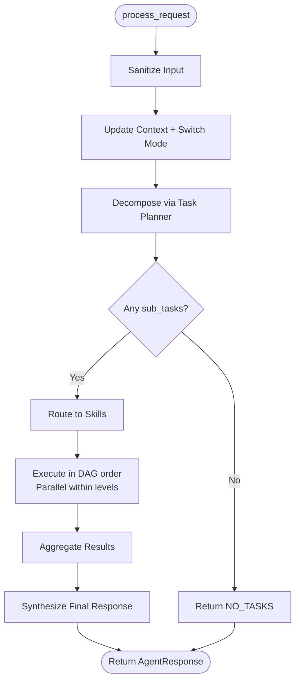
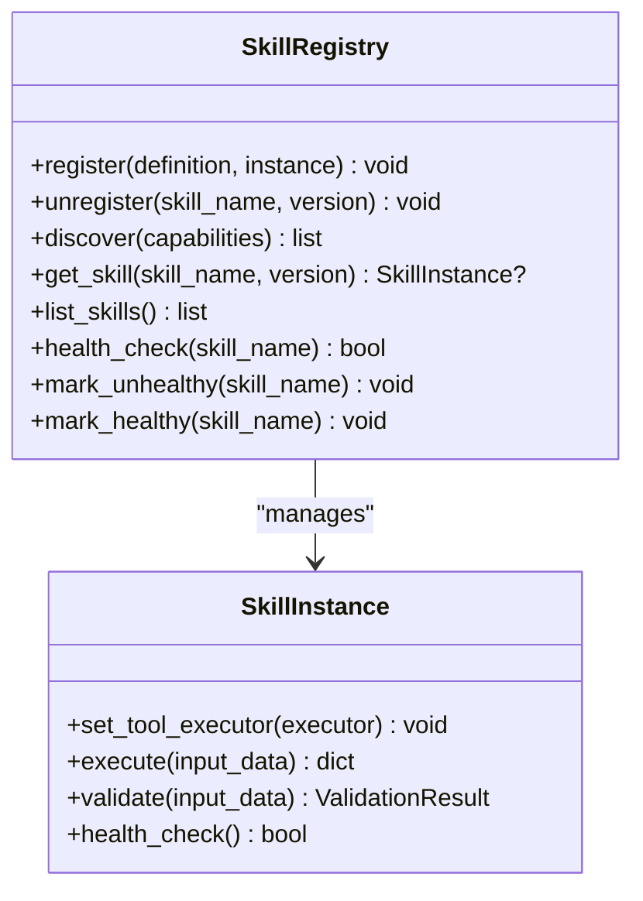
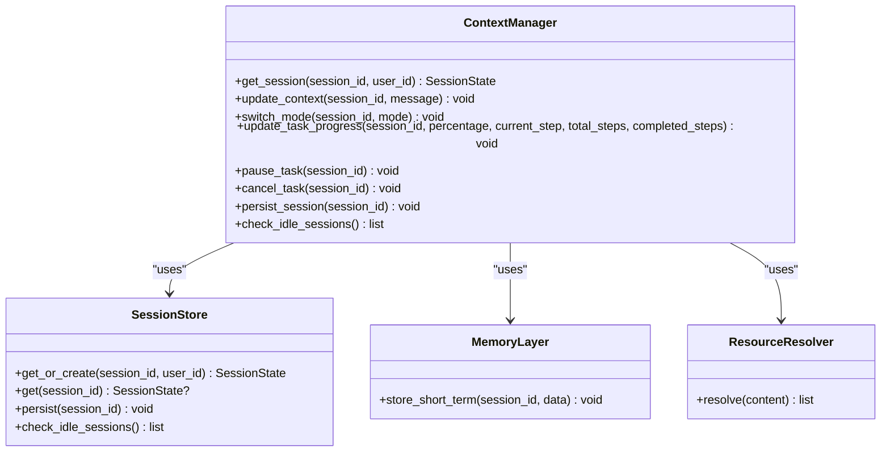
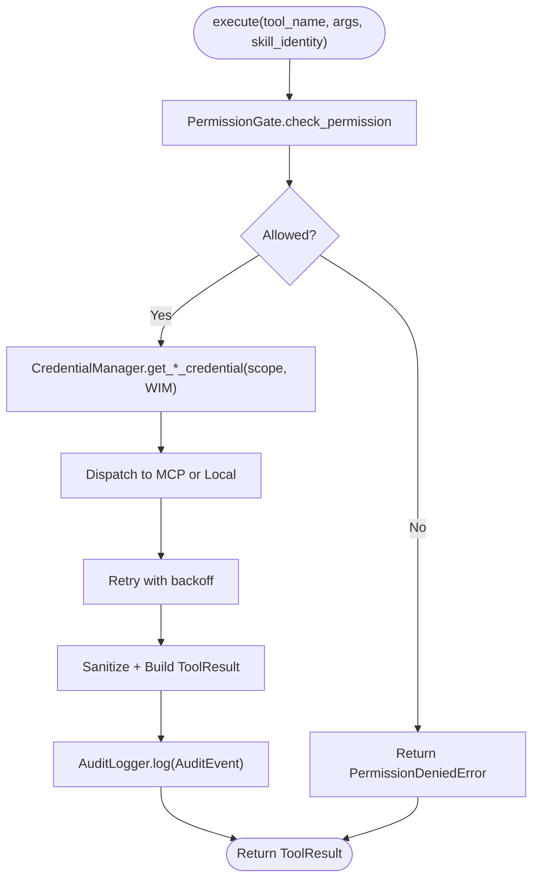
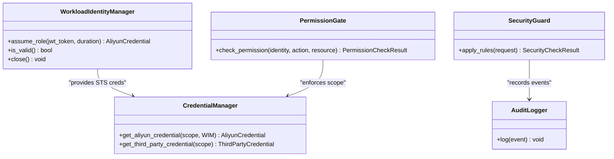
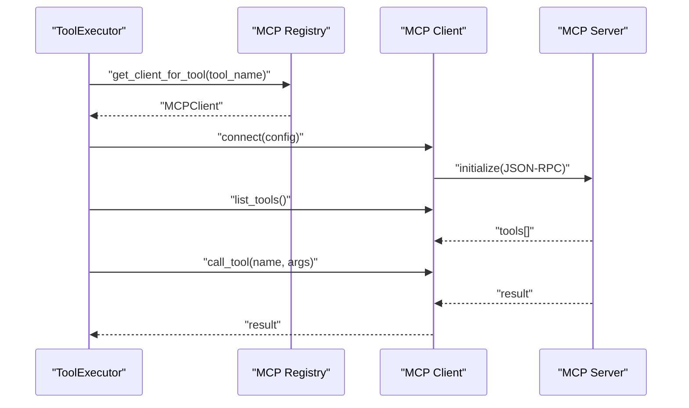
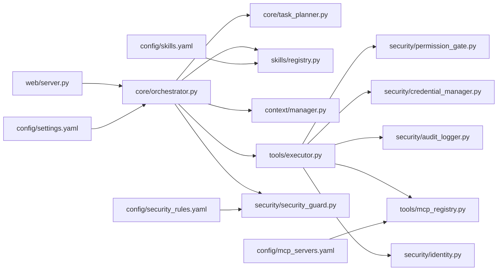

# Project Overview

<cite>
**Referenced Files in This Document**
- [README.md](file://README.md)
- [main.py](file://src/aiops_agent/main.py)
- [settings.yaml](file://config/settings.yaml)
- [skills.yaml](file://config/skills.yaml)
- [security_rules.yaml](file://config/security_rules.yaml)
- [mcp_servers.yaml](file://config/mcp_servers.yaml)
- [orchestrator.py](file://src/aiops_agent/core/orchestrator.py)
- [registry.py](file://src/aiops_agent/skills/registry.py)
- [manager.py](file://src/aiops_agent/context/manager.py)
- [executor.py](file://src/aiops_agent/tools/executor.py)
- [identity.py](file://src/aiops_agent/security/identity.py)
- [mcp_client.py](file://src/aiops_agent/tools/mcp_client.py)
- [server.py](file://src/aiops_agent/web/server.py)
- [schemas.py](file://src/aiops_agent/models/schemas.py)
- [docker-compose.yaml](file://deploy/docker-compose.yaml)
- [pyproject.toml](file://pyproject.toml)
</cite>

## Table of Contents
1. [Introduction](#introduction)
2. [Project Structure](#project-structure)
3. [Core Components](#core-components)
4. [Architecture Overview](#architecture-overview)
5. [Detailed Component Analysis](#detailed-component-analysis)
6. [Dependency Analysis](#dependency-analysis)
7. [Performance Considerations](#performance-considerations)
8. [Troubleshooting Guide](#troubleshooting-guide)
9. [Conclusion](#conclusion)
10. [Appendices](#appendices)

## Introduction
AIOps Agent is an enterprise-grade AI operations automation platform designed for Alibaba Cloud environments. It transforms natural language commands into automated cloud operations workflows by orchestrating skills, managing context, executing tools via the Model Context Protocol (MCP), and enforcing robust security and observability.

Key value propositions:
- Natural language-first operations: Users describe tasks in everyday language; the system decomposes and executes them reliably.
- Enterprise-grade security: Workload Identity, RBAC, token vault, and full-chain audit.
- Extensible tool ecosystem: MCP protocol integration enables standardized tool invocation across Alibaba Cloud services and third-party systems.
- Observability built-in: OpenTelemetry tracing, structured metrics, and logging for operational insights.

Practical examples:
- “Show me the CPU utilization of my ECS instance i-bp1234567890” → monitored via CloudMonitor and presented with analysis.
- “Check network connectivity between VPC A and VPC B” → routed to a troubleshooting skill with targeted diagnostics.
- “Scale out my Auto Scaling group based on the last 2 hours of metrics” → capacity planning skill validates inputs and triggers scaling actions.

## Project Structure
The project follows a modular, layer-based organization:
- Core orchestration and task planning
- Skill registry and lifecycle management
- Context and session management
- Tool execution with MCP and local tool support
- Security layer with Workload Identity and RBAC
- Web server exposing REST APIs and a Chat UI
- Configuration for LLMs, MCP servers, security rules, and data residency
- Deployment assets for containerized environments

**Diagram sources**
- [server.py:196-227](file://src/aiops_agent/web/server.py#L196-L227)
- [orchestrator.py:47-80](file://src/aiops_agent/core/orchestrator.py#L47-L80)
- [registry.py:19-30](file://src/aiops_agent/skills/registry.py#L19-L30)
- [manager.py:25-45](file://src/aiops_agent/context/manager.py#L25-L45)
- [executor.py:45-75](file://src/aiops_agent/tools/executor.py#L45-L75)
- [identity.py:38-52](file://src/aiops_agent/security/identity.py#L38-L52)
- [mcp_client.py:22-30](file://src/aiops_agent/tools/mcp_client.py#L22-L30)
- [settings.yaml:1-85](file://config/settings.yaml#L1-L85)
- [skills.yaml:1-77](file://config/skills.yaml#L1-L77)
- [security_rules.yaml:1-70](file://config/security_rules.yaml#L1-L70)
- [mcp_servers.yaml:1-41](file://config/mcp_servers.yaml#L1-L41)

**Section sources**
- [README.md:64-126](file://README.md#L64-L126)
- [pyproject.toml:1-46](file://pyproject.toml#L1-L46)

## Core Components
This section introduces the five major modules and their responsibilities, aligned with the architecture overview.

- Agent Orchestrator
  - Central coordinator that receives user requests, sanitizes input, updates context, switches to task mode, delegates decomposition to the Task Planner, routes subtasks to skills, executes them, aggregates results, and synthesizes a final response.
  - Implements DAG execution with parallelism, failure handling, health monitoring, and OpenTelemetry tracing.
  - Exposes synchronous and streaming APIs for chat interactions.

- Skill Registry
  - Manages skill registration, discovery, versioning, and health status.
  - Routes tasks to the most suitable skill based on capability matching and default version selection.
  - Supports dynamic registration/unregistration and automatic marking of unhealthy skills.

- Context Manager
  - Maintains multi-turn conversations, resolves resource references from user messages, tracks task progress, and supports mode switching among chat, task, and watch modes.
  - Integrates memory and session stores for persistence and retrieval.

- Tool Executor
  - Unified execution engine for MCP tools and local tools.
  - Enforces permission checks, injects credentials via Workload Identity, handles timeouts and retries, sanitizes sensitive outputs, and logs audit events.
  - Provides three execution modes: sync, async, and stream.

- Security Layer
  - Workload Identity: obtains temporary STS credentials via STS AssumeRoleWithOIDC using Kubernetes ServiceAccount JWT.
  - Credential Manager: manages token vault and scoped credentials.
  - Permission Gate: enforces RBAC with three levels (Read-Only, Limited-Write, Admin) and approval gating.
  - Security Guard: applies blacklists, rate limits, anomaly detection, and communication security policies.
  - Audit Logger: records structured audit events with trace/span IDs for full-chain visibility.

**Section sources**
- [README.md:15-24](file://README.md#L15-L24)
- [orchestrator.py:47-80](file://src/aiops_agent/core/orchestrator.py#L47-L80)
- [registry.py:19-30](file://src/aiops_agent/skills/registry.py#L19-L30)
- [manager.py:25-45](file://src/aiops_agent/context/manager.py#L25-L45)
- [executor.py:45-75](file://src/aiops_agent/tools/executor.py#L45-L75)
- [identity.py:38-52](file://src/aiops_agent/security/identity.py#L38-L52)
- [security_rules.yaml:1-70](file://config/security_rules.yaml#L1-L70)

## Architecture Overview
The end-to-end flow begins with a user request received by the web server, processed by the orchestrator, decomposed into tasks, routed to skills, executed via the tool executor against MCP servers or local tools, and audited through the security layer.

**Diagram sources**
- [server.py:44-83](file://src/aiops_agent/web/server.py#L44-L83)
- [orchestrator.py:84-198](file://src/aiops_agent/core/orchestrator.py#L84-L198)
- [registry.py:159-182](file://src/aiops_agent/skills/registry.py#L159-L182)
- [executor.py:80-226](file://src/aiops_agent/tools/executor.py#L80-L226)
- [mcp_client.py:135-156](file://src/aiops_agent/tools/mcp_client.py#L135-L156)
- [identity.py:119-174](file://src/aiops_agent/security/identity.py#L119-L174)

## Detailed Component Analysis

### Agent Orchestrator
- Responsibilities: request sanitization, context updates, task decomposition, DAG execution with parallelism, failure handling, health monitoring, and synthesis.
- Key behaviors: topological sorting of subtasks, concurrent execution with a semaphore, progress tracking, and OpenTelemetry tracing.
- Streaming support: yields structured SSE events for planning, task start/done, errors, and completion.

**Diagram sources**
- [orchestrator.py:84-198](file://src/aiops_agent/core/orchestrator.py#L84-L198)
- [orchestrator.py:424-484](file://src/aiops_agent/core/orchestrator.py#L424-L484)

**Section sources**
- [orchestrator.py:47-80](file://src/aiops_agent/core/orchestrator.py#L47-L80)
- [orchestrator.py:84-198](file://src/aiops_agent/core/orchestrator.py#L84-L198)
- [orchestrator.py:424-484](file://src/aiops_agent/core/orchestrator.py#L424-L484)

### Skill Registry
- Responsibilities: registration/validation, capability-based discovery, version management, health monitoring, and runtime hot-swapping.
- Behavior: maintains default versions, marks unhealthy skills, and exposes list/discover/get operations.

**Diagram sources**
- [registry.py:19-30](file://src/aiops_agent/skills/registry.py#L19-L30)
- [registry.py:159-182](file://src/aiops_agent/skills/registry.py#L159-L182)
- [base.py:21-46](file://src/aiops_agent/skills/base.py#L21-L46)

**Section sources**
- [registry.py:19-30](file://src/aiops_agent/skills/registry.py#L19-L30)
- [registry.py:122-154](file://src/aiops_agent/skills/registry.py#L122-L154)
- [registry.py:213-238](file://src/aiops_agent/skills/registry.py#L213-L238)

### Context Manager
- Responsibilities: session creation, message history updates, resource reference resolution, mode switching, and task progress tracking.
- Integrations: SessionStore, MemoryLayer, ResourceResolver.

**Diagram sources**
- [manager.py:25-45](file://src/aiops_agent/context/manager.py#L25-L45)
- [manager.py:50-98](file://src/aiops_agent/context/manager.py#L50-L98)
- [manager.py:127-169](file://src/aiops_agent/context/manager.py#L127-L169)

**Section sources**
- [manager.py:25-45](file://src/aiops_agent/context/manager.py#L25-L45)
- [manager.py:58-89](file://src/aiops_agent/context/manager.py#L58-L89)
- [manager.py:94-122](file://src/aiops_agent/context/manager.py#L94-L122)

### Tool Executor
- Responsibilities: permission gating, credential acquisition, tool dispatch (MCP/local), retry/backoff, sanitization, auditing, and tracing.
- Execution pipeline: PermissionGate → CredentialManager (optional) → MCP or Local → Sanitization → AuditLogger.

**Diagram sources**
- [executor.py:80-226](file://src/aiops_agent/tools/executor.py#L80-L226)
- [executor.py:231-296](file://src/aiops_agent/tools/executor.py#L231-L296)

**Section sources**
- [executor.py:45-75](file://src/aiops_agent/tools/executor.py#L45-L75)
- [executor.py:80-226](file://src/aiops_agent/tools/executor.py#L80-L226)
- [executor.py:231-296](file://src/aiops_agent/tools/executor.py#L231-L296)

### Security Layer
- Workload Identity: STS AssumeRoleWithOIDC using K8s ServiceAccount JWT, with auto-refresh.
- RBAC: three-tier permission levels with approval gating.
- Security Guard: blacklist enforcement, rate limiting, anomaly detection, and TLS enforcement.
- Audit: structured audit events with trace/span IDs.

**Diagram sources**
- [identity.py:38-52](file://src/aiops_agent/security/identity.py#L38-L52)
- [identity.py:119-174](file://src/aiops_agent/security/identity.py#L119-L174)
- [executor.py:124-148](file://src/aiops_agent/tools/executor.py#L124-L148)
- [security_rules.yaml:1-70](file://config/security_rules.yaml#L1-L70)

**Section sources**
- [identity.py:38-52](file://src/aiops_agent/security/identity.py#L38-L52)
- [identity.py:119-174](file://src/aiops_agent/security/identity.py#L119-L174)
- [executor.py:124-148](file://src/aiops_agent/tools/executor.py#L124-L148)
- [security_rules.yaml:1-70](file://config/security_rules.yaml#L1-L70)

### MCP Protocol Integration
- Transport modes: stdio (local subprocess) and SSE/HTTP (remote).
- JSON-RPC 2.0 over chosen transport; client initializes connection and lists tools.
- Registry maps tool names to MCP clients; ToolExecutor prefers MCP tools, falls back to local.

**Diagram sources**
- [mcp_client.py:56-156](file://src/aiops_agent/tools/mcp_client.py#L56-L156)
- [mcp_client.py:225-256](file://src/aiops_agent/tools/mcp_client.py#L225-L256)
- [mcp_servers.yaml:1-41](file://config/mcp_servers.yaml#L1-L41)

**Section sources**
- [mcp_client.py:22-30](file://src/aiops_agent/tools/mcp_client.py#L22-L30)
- [mcp_client.py:100-130](file://src/aiops_agent/tools/mcp_client.py#L100-L130)
- [mcp_client.py:135-156](file://src/aiops_agent/tools/mcp_client.py#L135-L156)
- [mcp_servers.yaml:1-41](file://config/mcp_servers.yaml#L1-L41)

## Dependency Analysis
High-level dependencies and coupling:
- Web server depends on Orchestrator; Orchestrator depends on Task Planner, Skill Registry, Context Manager, Tool Executor, Security Guard, Metrics, and Tracing.
- Tool Executor depends on Permission Gate, Credential Manager, Audit Logger, MCP Registry, and optionally Workload Identity Manager.
- Security components depend on configuration files and external services (STS, Agent Identity).
- Configuration files feed runtime behavior for LLMs, MCP servers, skills, and security rules.

**Diagram sources**
- [server.py:17-37](file://src/aiops_agent/web/server.py#L17-L37)
- [orchestrator.py:75-76](file://src/aiops_agent/core/orchestrator.py#L75-L76)
- [executor.py:68-75](file://src/aiops_agent/tools/executor.py#L68-L75)
- [settings.yaml:1-85](file://config/settings.yaml#L1-L85)
- [skills.yaml:1-77](file://config/skills.yaml#L1-L77)
- [security_rules.yaml:1-70](file://config/security_rules.yaml#L1-L70)
- [mcp_servers.yaml:1-41](file://config/mcp_servers.yaml#L1-L41)

**Section sources**
- [server.py:32-37](file://src/aiops_agent/web/server.py#L32-L37)
- [orchestrator.py:75-76](file://src/aiops_agent/core/orchestrator.py#L75-L76)
- [executor.py:68-75](file://src/aiops_agent/tools/executor.py#L68-L75)

## Performance Considerations
- Concurrency: Orchestrator uses a semaphore to cap parallel subtask execution, preventing resource exhaustion during DAG execution.
- Retries and timeouts: ToolExecutor applies exponential backoff and enforces per-operation timeouts to improve resilience.
- Observability: Metrics and tracing enable profiling and bottleneck identification; adjust exporters and intervals via configuration.
- Data residency: Region checks prevent unintended cross-region operations, ensuring compliance.

[No sources needed since this section provides general guidance]

## Troubleshooting Guide
Common issues and remedies:
- Authentication failures (STS/OIDC): Verify Workload Identity configuration and JWT availability; confirm AssumeRoleWithOIDC permissions and trust policies.
- Permission denied errors: Review RBAC levels and required permissions; ensure skills declare correct permissions and approvals are configured.
- MCP tool unavailability: Confirm MCP server connectivity (stdio/SSE/HTTP), tool discovery, and that tools are registered in the MCP registry.
- Audit gaps: Ensure audit logger is initialized and configured; verify trace/span IDs are propagated.
- Health and readiness: Use /health and /ready endpoints; inspect skill health and registry status.

**Section sources**
- [identity.py:119-174](file://src/aiops_agent/security/identity.py#L119-L174)
- [executor.py:124-148](file://src/aiops_agent/tools/executor.py#L124-L148)
- [mcp_client.py:56-95](file://src/aiops_agent/tools/mcp_client.py#L56-L95)
- [server.py:138-146](file://src/aiops_agent/web/server.py#L138-L146)

## Conclusion
AIOps Agent delivers a secure, extensible, and observable AI-driven automation platform for Alibaba Cloud. Its five-module architecture—Orchestrator, Skill Registry, Context Manager, Tool Executor, and Security Layer—works together to transform natural language into reliable, auditable cloud operations. With MCP integration, Workload Identity, and comprehensive security controls, it meets enterprise needs for safety, scalability, and maintainability.

[No sources needed since this section summarizes without analyzing specific files]

## Appendices

### Technology Stack Overview
- Async framework: asyncio + aiohttp
- Data modeling: Pydantic v2
- LLM backends: Qwen, Claude, GPT (configurable)
- Tool protocol: MCP (JSON-RPC over stdio/SSE)
- Identity and security: Alibaba Cloud Agent Identity (STS OIDC)
- Observability: OpenTelemetry (tracing, metrics, logging)
- Testing: pytest + hypothesis

**Section sources**
- [README.md:178-189](file://README.md#L178-L189)
- [pyproject.toml:16-25](file://pyproject.toml#L16-L25)

### API Reference
- GET /: Chat UI
- POST /api/chat: Submit a natural language request
- GET /api/skills: List available skills
- GET /health: Health check
- GET /ready: Readiness check

Example request/response shapes are documented in the repository’s API section.

**Section sources**
- [README.md:128-159](file://README.md#L128-L159)
- [server.py:44-83](file://src/aiops_agent/web/server.py#L44-L83)
- [server.py:138-146](file://src/aiops_agent/web/server.py#L138-L146)

### Configuration Highlights
- settings.yaml: LLM providers, timeouts, retries, orchestrator concurrency, observability, and data residency.
- skills.yaml: Skill definitions, capabilities, and permissions.
- security_rules.yaml: Sensitive field patterns, blacklists, rate limits, anomaly detection, and TLS enforcement.
- mcp_servers.yaml: MCP server transports and launch parameters.

**Section sources**
- [settings.yaml:1-85](file://config/settings.yaml#L1-L85)
- [skills.yaml:1-77](file://config/skills.yaml#L1-L77)
- [security_rules.yaml:1-70](file://config/security_rules.yaml#L1-L70)
- [mcp_servers.yaml:1-41](file://config/mcp_servers.yaml#L1-L41)

### Deployment Notes
- docker-compose.yaml defines environment variables for Agent Identity endpoints, region, workload identity ARN, API keys, and log level.
- Mounts config volume and persistent volumes for logs and data.

**Section sources**
- [docker-compose.yaml:1-25](file://deploy/docker-compose.yaml#L1-L25)