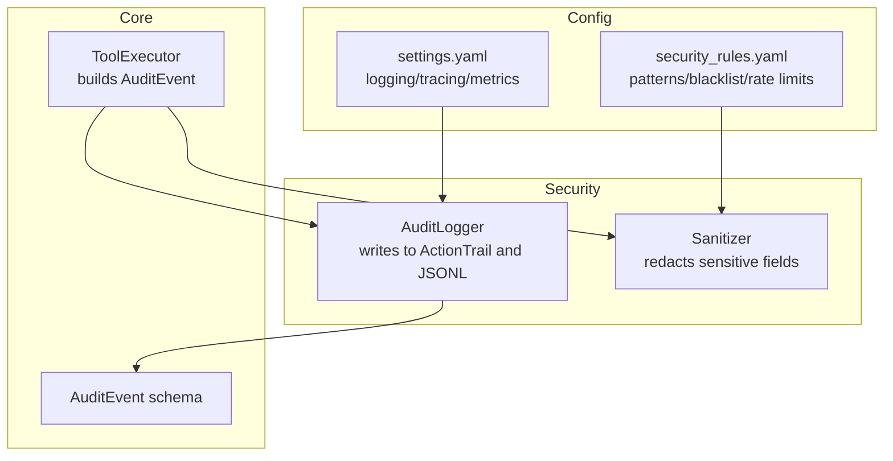
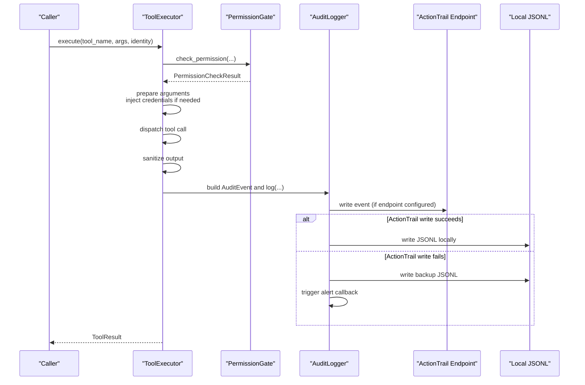
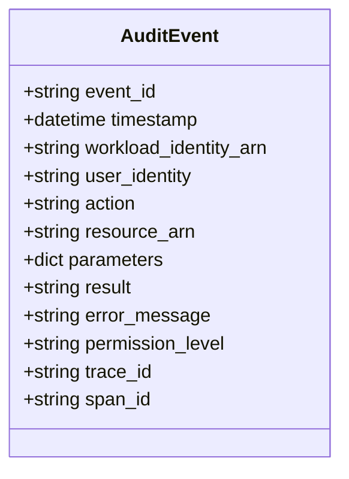
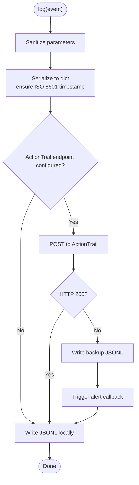
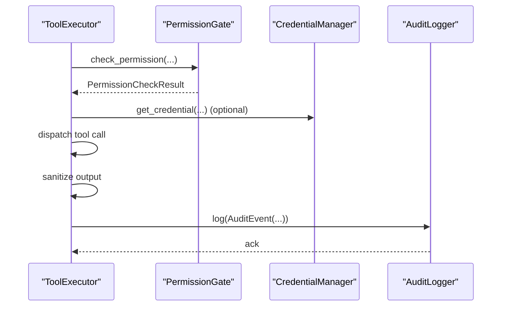
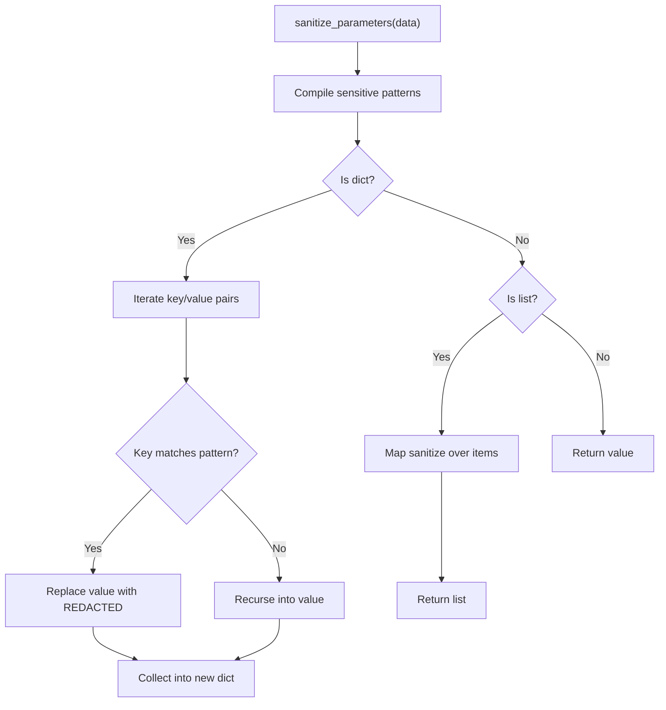
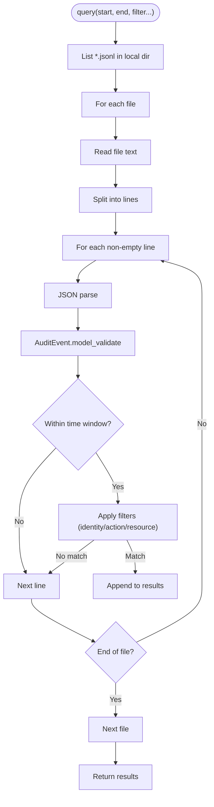
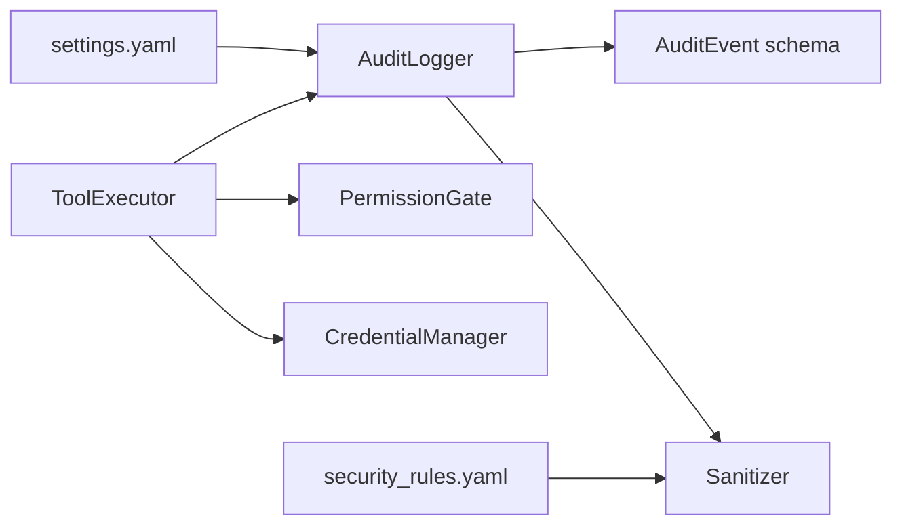

# Audit Logging

<cite>
**Referenced Files in This Document**
- [audit_logger.py](file://src/aiops_agent/security/audit_logger.py)
- [schemas.py](file://src/aiops_agent/models/schemas.py)
- [sanitizer.py](file://src/aiops_agent/security/sanitizer.py)
- [executor.py](file://src/aiops_agent/tools/executor.py)
- [main.py](file://src/aiops_agent/main.py)
- [security_rules.yaml](file://config/security_rules.yaml)
- [settings.yaml](file://config/settings.yaml)
- [test_audit_logger.py](file://tests/test_audit_logger.py)
</cite>

## Table of Contents
1. [Introduction](#introduction)
2. [Project Structure](#project-structure)
3. [Core Components](#core-components)
4. [Architecture Overview](#architecture-overview)
5. [Detailed Component Analysis](#detailed-component-analysis)
6. [Dependency Analysis](#dependency-analysis)
7. [Performance Considerations](#performance-considerations)
8. [Troubleshooting Guide](#troubleshooting-guide)
9. [Conclusion](#conclusion)
10. [Appendices](#appendices)

## Introduction
This document describes the AIOps Agent’s audit logging system that captures security-relevant events and operations. It explains how the system integrates with Alibaba Cloud ActionTrail for centralized audit trails and maintains local JSONL backups for offline analysis. It documents the audit event schema, log formatting, retention policies, and operational guidance for log aggregation, monitoring/alerting, and forensic investigations.

## Project Structure
The audit logging capability spans several modules:
- Security audit logger: records structured audit events, writes to ActionTrail and local JSONL logs, and triggers alerts on failures.
- Sanitizer: recursively redacts sensitive fields from parameters and tool outputs.
- Tool executor: generates AuditEvent instances during tool execution and delegates auditing.
- Models: defines the AuditEvent schema and related security types.
- Configuration: enables ActionTrail endpoint configuration and logging format.
- Tests: validate local logging, query filtering, backup behavior, and alerting.

**Diagram sources**
- [audit_logger.py:24-253](file://src/aiops_agent/security/audit_logger.py#L24-L253)
- [sanitizer.py:1-80](file://src/aiops_agent/security/sanitizer.py#L1-L80)
- [executor.py:45-314](file://src/aiops_agent/tools/executor.py#L45-L314)
- [schemas.py:169-184](file://src/aiops_agent/models/schemas.py#L169-L184)
- [settings.yaml:62-77](file://config/settings.yaml#L62-L77)
- [security_rules.yaml:1-70](file://config/security_rules.yaml#L1-L70)

**Section sources**
- [audit_logger.py:1-253](file://src/aiops_agent/security/audit_logger.py#L1-L253)
- [schemas.py:169-184](file://src/aiops_agent/models/schemas.py#L169-L184)
- [sanitizer.py:1-80](file://src/aiops_agent/security/sanitizer.py#L1-L80)
- [executor.py:45-314](file://src/aiops_agent/tools/executor.py#L45-L314)
- [settings.yaml:62-77](file://config/settings.yaml#L62-L77)
- [security_rules.yaml:1-70](file://config/security_rules.yaml#L1-L70)

## Core Components
- AuditLogger: central recorder that sanitizes events, writes to ActionTrail (when configured), writes local JSONL logs, and backs up on failure while triggering alerts.
- AuditEvent: the canonical audit record structure used across the system.
- Sanitizer: applies configurable redaction patterns to parameters and tool outputs.
- ToolExecutor: constructs AuditEvent instances during tool execution and invokes the AuditLogger.
- Configuration: settings for logging format and observability; security rules define sensitive field patterns and blacklists.

Key responsibilities:
- Full-lifecycle audit capture for each tool invocation.
- Centralized audit via ActionTrail with robust fallback to local storage.
- Structured JSONL logs for offline analysis and SIEM ingestion.
- Redaction of sensitive fields to protect privacy and compliance.

**Section sources**
- [audit_logger.py:24-253](file://src/aiops_agent/security/audit_logger.py#L24-L253)
- [schemas.py:169-184](file://src/aiops_agent/models/schemas.py#L169-L184)
- [sanitizer.py:1-80](file://src/aiops_agent/security/sanitizer.py#L1-L80)
- [executor.py:209-226](file://src/aiops_agent/tools/executor.py#L209-L226)
- [settings.yaml:62-77](file://config/settings.yaml#L62-L77)
- [security_rules.yaml:1-70](file://config/security_rules.yaml#L1-L70)

## Architecture Overview
The audit pipeline integrates tightly with the tool execution flow and security subsystems.

**Diagram sources**
- [executor.py:80-226](file://src/aiops_agent/tools/executor.py#L80-L226)
- [audit_logger.py:65-103](file://src/aiops_agent/security/audit_logger.py#L65-L103)
- [audit_logger.py:161-185](file://src/aiops_agent/security/audit_logger.py#L161-L185)
- [audit_logger.py:191-211](file://src/aiops_agent/security/audit_logger.py#L191-L211)

## Detailed Component Analysis

### Audit Event Schema
The AuditEvent model defines the structure of each audit record. It includes identity, action, resource, parameters, outcome, and tracing identifiers.

**Diagram sources**
- [schemas.py:169-184](file://src/aiops_agent/models/schemas.py#L169-L184)

**Section sources**
- [schemas.py:169-184](file://src/aiops_agent/models/schemas.py#L169-L184)

### AuditLogger Implementation
AuditLogger coordinates:
- Sanitization of sensitive parameters.
- Optional write to ActionTrail endpoint.
- Local JSONL logging with daily rotation.
- Backup logging and alerting on ActionTrail failures.
- Query interface over local JSONL files.

**Diagram sources**
- [audit_logger.py:65-103](file://src/aiops_agent/security/audit_logger.py#L65-L103)
- [audit_logger.py:161-185](file://src/aiops_agent/security/audit_logger.py#L161-L185)
- [audit_logger.py:191-211](file://src/aiops_agent/security/audit_logger.py#L191-L211)

**Section sources**
- [audit_logger.py:24-253](file://src/aiops_agent/security/audit_logger.py#L24-L253)

### ToolExecutor Audit Integration
During tool execution, ToolExecutor builds an AuditEvent and logs it regardless of success or failure. It ensures:
- Parameters are sanitized before logging.
- Trace identifiers are propagated from OpenTelemetry spans.
- Permission level is recorded based on the action classification.

**Diagram sources**
- [executor.py:124-226](file://src/aiops_agent/tools/executor.py#L124-L226)
- [audit_logger.py:65-103](file://src/aiops_agent/security/audit_logger.py#L65-L103)

**Section sources**
- [executor.py:209-226](file://src/aiops_agent/tools/executor.py#L209-L226)

### Sanitizer and Redaction
The sanitizer recursively redacts fields whose names match configured patterns. It supports nested dictionaries and lists and replaces matches with a redaction marker.

**Diagram sources**
- [sanitizer.py:39-80](file://src/aiops_agent/security/sanitizer.py#L39-L80)

**Section sources**
- [sanitizer.py:1-80](file://src/aiops_agent/security/sanitizer.py#L1-L80)
- [security_rules.yaml:4-18](file://config/security_rules.yaml#L4-L18)

### Local JSONL Logging and Query
- Daily rotation: audit logs are written to dated JSONL files under a configured directory.
- Query interface: filters by time window, optional identity, action, and resource ARN; parses JSONL lines and validates against the AuditEvent schema.

**Diagram sources**
- [audit_logger.py:105-155](file://src/aiops_agent/security/audit_logger.py#L105-L155)

**Section sources**
- [audit_logger.py:105-155](file://src/aiops_agent/security/audit_logger.py#L105-L155)

## Dependency Analysis
- ToolExecutor depends on PermissionGate, CredentialManager, and AuditLogger to construct and record AuditEvent.
- AuditLogger depends on the AuditEvent schema and the sanitizer for redaction.
- Configuration influences logging format and observability but does not directly configure ActionTrail endpoint in the provided code; ActionTrail endpoint is passed into AuditLogger initialization.
- Tests validate local logging, query filtering, backup behavior, and alerting.

**Diagram sources**
- [executor.py:58-75](file://src/aiops_agent/tools/executor.py#L58-L75)
- [audit_logger.py:36-55](file://src/aiops_agent/security/audit_logger.py#L36-L55)
- [schemas.py:169-184](file://src/aiops_agent/models/schemas.py#L169-L184)
- [sanitizer.py:1-80](file://src/aiops_agent/security/sanitizer.py#L1-L80)
- [settings.yaml:62-77](file://config/settings.yaml#L62-L77)
- [security_rules.yaml:1-70](file://config/security_rules.yaml#L1-L70)

**Section sources**
- [executor.py:58-75](file://src/aiops_agent/tools/executor.py#L58-L75)
- [audit_logger.py:36-55](file://src/aiops_agent/security/audit_logger.py#L36-L55)
- [schemas.py:169-184](file://src/aiops_agent/models/schemas.py#L169-L184)
- [sanitizer.py:1-80](file://src/aiops_agent/security/sanitizer.py#L1-L80)
- [settings.yaml:62-77](file://config/settings.yaml#L62-L77)
- [security_rules.yaml:1-70](file://config/security_rules.yaml#L1-L70)

## Performance Considerations
- Asynchronous writes: AuditLogger uses an aiohttp client session and async HTTP posting to ActionTrail, minimizing blocking in the tool execution path.
- Local JSONL writes: Append-only writes to dated files reduce contention and support high throughput.
- Redaction cost: Recursive traversal of parameters and outputs is linear in the size of the data structures; keep parameter shapes reasonable.
- Query performance: Linear scan over JSONL files; consider indexing or partitioning if querying large volumes frequently.

[No sources needed since this section provides general guidance]

## Troubleshooting Guide
Common scenarios and resolutions:
- ActionTrail write failures:
  - Symptom: Errors logged and backup JSONL created; alert callback invoked.
  - Actions: Verify endpoint URL and network connectivity; check response bodies; confirm SSL/TLS settings.
- Missing ActionTrail events:
  - Symptom: No centralized audit trail.
  - Actions: Confirm ActionTrail endpoint is configured and reachable; ensure credentials and permissions are valid.
- Sensitive data exposure:
  - Symptom: Logs contain raw secrets.
  - Actions: Review sensitive field patterns in security rules; ensure parameters are sanitized before logging.
- Query returns empty results:
  - Symptom: No events found despite expectations.
  - Actions: Verify time window; check identity/action/resource filters; confirm local log directory path and file dates.

Operational checks:
- Validate JSONL parsing and schema validation in queries.
- Monitor alert callback invocations and investigate root causes.
- Confirm redaction patterns align with organizational policies.

**Section sources**
- [audit_logger.py:82-96](file://src/aiops_agent/security/audit_logger.py#L82-L96)
- [audit_logger.py:161-185](file://src/aiops_agent/security/audit_logger.py#L161-L185)
- [audit_logger.py:226-234](file://src/aiops_agent/security/audit_logger.py#L226-L234)
- [test_audit_logger.py:151-174](file://tests/test_audit_logger.py#L151-L174)
- [test_audit_logger.py:181-209](file://tests/test_audit_logger.py#L181-L209)

## Conclusion
The AIOps Agent’s audit logging system provides a robust, extensible foundation for security-relevant event capture. It integrates with Alibaba Cloud ActionTrail for centralized auditing while maintaining resilient local JSONL backups. The system enforces sensitive data redaction, offers flexible querying, and supports alerting for failure scenarios. Together with configuration-driven security rules, it enables compliance reporting, SIEM integration, and forensic readiness.

[No sources needed since this section summarizes without analyzing specific files]

## Appendices

### Audit Event Fields Reference
- event_id: Unique identifier for the event.
- timestamp: ISO 8601 timestamp of the event.
- workload_identity_arn: Agent’s identity ARN.
- user_identity: Optional user identity (On-Behalf-Of).
- action: Canonical action identifier (e.g., tool name).
- resource_arn: Target resource ARN.
- parameters: Sanitized request parameters.
- result: Outcome of the operation (success, failure, denied).
- error_message: Optional error text.
- permission_level: Derived from action classification.
- trace_id, span_id: Tracing identifiers for correlation.

**Section sources**
- [schemas.py:169-184](file://src/aiops_agent/models/schemas.py#L169-L184)

### Log Formatting and Retention
- JSONL format: Each line is a JSON object representing an AuditEvent.
- Local directory: Configurable via AuditLogger constructor; defaults to logs/audit and logs/audit_backup.
- Daily rotation: Files named with date suffixes (audit-YYYY-MM-DD.jsonl, backup-YYYY-MM-DD.jsonl).
- Retention: Not enforced by the code; implement external retention policies (e.g., log archival, pruning).

**Section sources**
- [audit_logger.py:191-211](file://src/aiops_agent/security/audit_logger.py#L191-L211)

### Types of Events Captured
- Authentication attempts: Implicit via Workload Identity acquisition and permission checks.
- Authorization decisions: PermissionGate outcomes and approval flows.
- Privileged operations: Blacklisted actions and admin-classified operations.
- Tool executions: All tool invocations with sanitized parameters and outputs.

**Section sources**
- [executor.py:124-133](file://src/aiops_agent/tools/executor.py#L124-L133)
- [security_rules.yaml:21-42](file://config/security_rules.yaml#L21-L42)

### Compliance Reporting and SIEM Integration
- SIEM ingestion: Local JSONL files can be ingested by SIEM solutions; ensure consistent field names and timestamps.
- Compliance artifacts: Use query filters to extract time-bound reports by identity, action, and resource ARN.
- Audit trail continuity: Rely on backup JSONL logs when ActionTrail is unavailable.

**Section sources**
- [audit_logger.py:105-155](file://src/aiops_agent/security/audit_logger.py#L105-L155)
- [settings.yaml:62-77](file://config/settings.yaml#L62-L77)

### Log Aggregation, Monitoring, and Alerting
- Aggregation: Ship local JSONL to SIEM/log aggregation platforms; consider structured field extraction.
- Monitoring: Track ActionTrail write success/failure rates; monitor disk usage of audit directories.
- Alerting: Configure alert callback to notify operators on ActionTrail failures; integrate with incident workflows.

**Section sources**
- [audit_logger.py:226-234](file://src/aiops_agent/security/audit_logger.py#L226-L234)

### Forensic Investigation Procedures
- Timeline reconstruction: Use query with time windows and trace/span identifiers to correlate events.
- Evidence preservation: Preserve backup JSONL files alongside local logs.
- Redaction verification: Confirm sensitive fields were redacted per security rules.

**Section sources**
- [audit_logger.py:105-155](file://src/aiops_agent/security/audit_logger.py#L105-L155)
- [sanitizer.py:1-80](file://src/aiops_agent/security/sanitizer.py#L1-L80)
- [security_rules.yaml:4-18](file://config/security_rules.yaml#L4-L18)