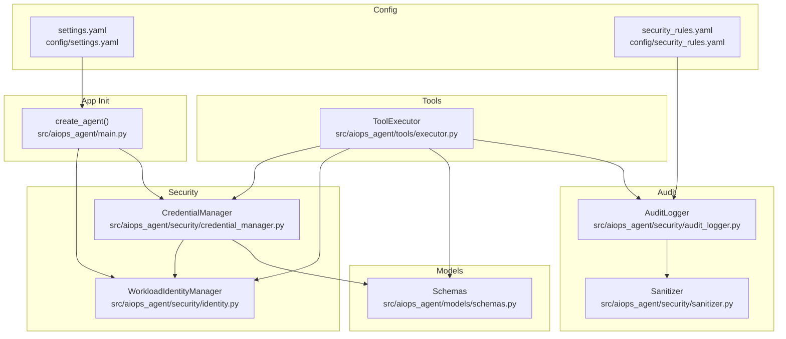
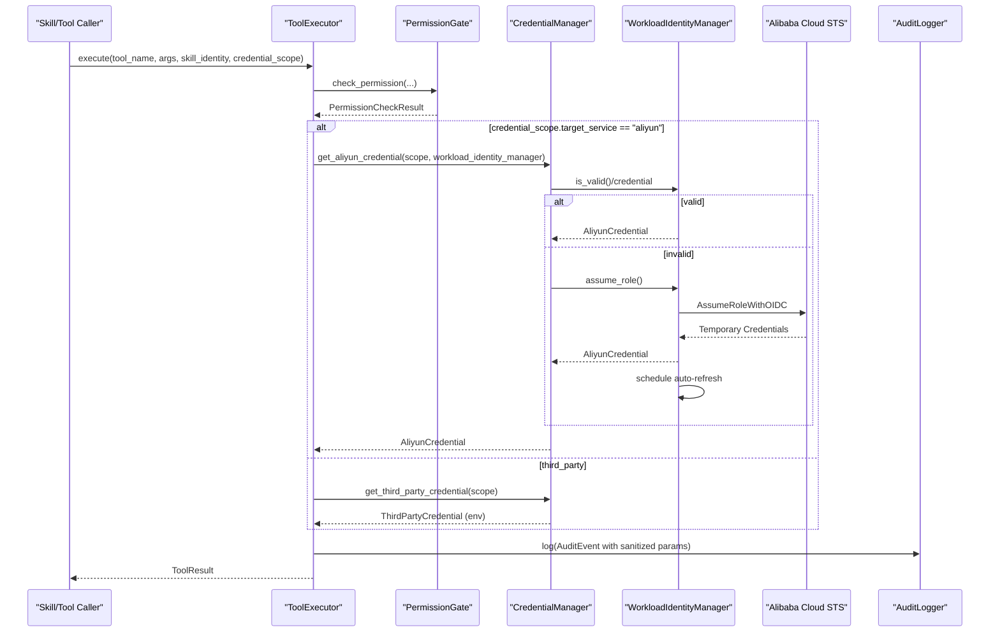
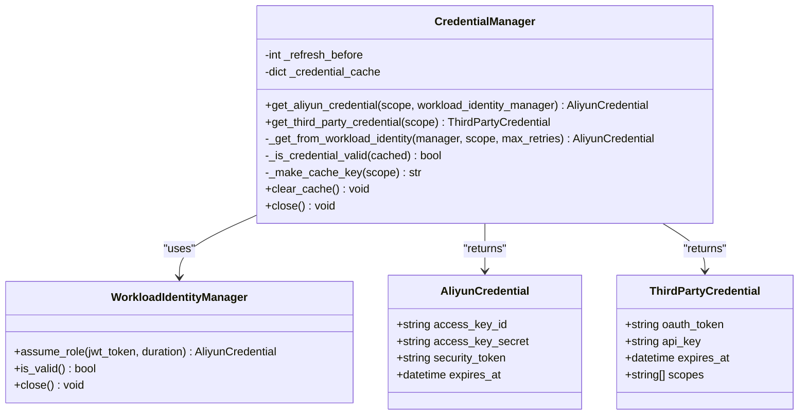
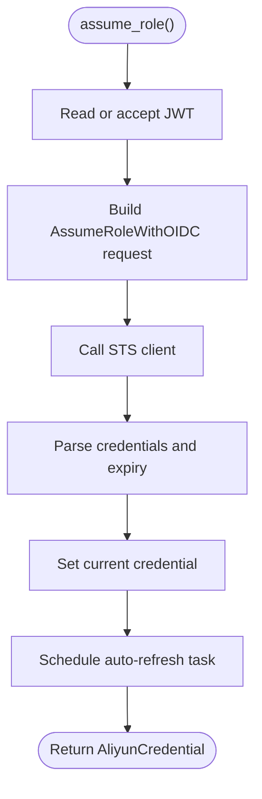
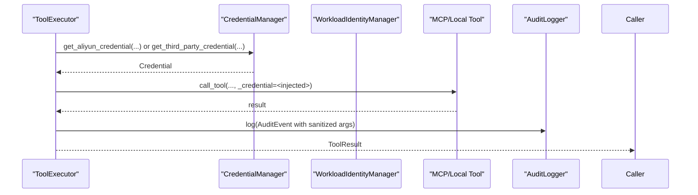
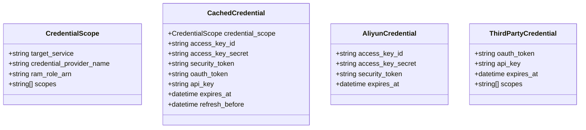
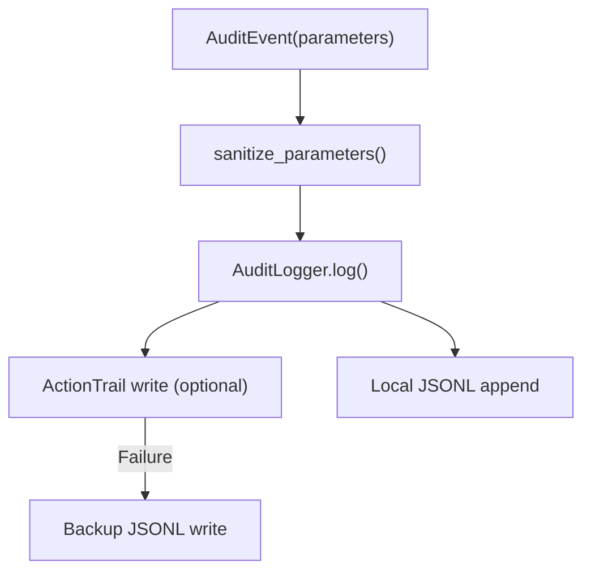
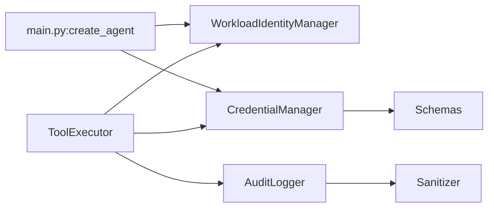

# Credential Management

<cite>
**Referenced Files in This Document**
- [credential_manager.py](file://src/aiops_agent/security/credential_manager.py)
- [identity.py](file://src/aiops_agent/security/identity.py)
- [schemas.py](file://src/aiops_agent/models/schemas.py)
- [executor.py](file://src/aiops_agent/tools/executor.py)
- [main.py](file://src/aiops_agent/main.py)
- [settings.yaml](file://config/settings.yaml)
- [security_rules.yaml](file://config/security_rules.yaml)
- [audit_logger.py](file://src/aiops_agent/security/audit_logger.py)
- [sanitizer.py](file://src/aiops_agent/security/sanitizer.py)
- [test_credential_manager.py](file://tests/test_credential_manager.py)
- [test_workload_identity.py](file://tests/test_workload_identity.py)
</cite>

## Table of Contents
1. [Introduction](#introduction)
2. [Project Structure](#project-structure)
3. [Core Components](#core-components)
4. [Architecture Overview](#architecture-overview)
5. [Detailed Component Analysis](#detailed-component-analysis)
6. [Dependency Analysis](#dependency-analysis)
7. [Performance Considerations](#performance-considerations)
8. [Troubleshooting Guide](#troubleshooting-guide)
9. [Conclusion](#conclusion)
10. [Appendices](#appendices)

## Introduction
This document explains the AIOps Agent’s Credential Manager token vault functionality with a focus on secure storage and retrieval of sensitive credentials, including Alibaba Cloud STS temporary credentials, third-party OAuth tokens, and API keys. It covers the credential lifecycle, caching and automatic refresh, Workload Identity integration for dynamic credential provisioning, token rotation, and secure transmission. It also provides examples of credential registration/access patterns, cleanup procedures, and security best practices for integrating with external secret management systems.

## Project Structure
The credential management capability spans several modules:
- Security: credential manager and identity provider
- Models: shared schemas for credentials and scopes
- Tools: tool executor integrates permission checks, credential retrieval, and auditing
- Config: settings and security rules
- Tests: unit tests validating cache behavior, OIDC flows, and error conditions

**Diagram sources**
- [credential_manager.py:38-261](file://src/aiops_agent/security/credential_manager.py#L38-L261)
- [identity.py:38-247](file://src/aiops_agent/security/identity.py#L38-L247)
- [schemas.py:99-137](file://src/aiops_agent/models/schemas.py#L99-L137)
- [executor.py:45-314](file://src/aiops_agent/tools/executor.py#L45-L314)
- [main.py:70-222](file://src/aiops_agent/main.py#L70-L222)
- [settings.yaml:27-42](file://config/settings.yaml#L27-L42)
- [security_rules.yaml:1-70](file://config/security_rules.yaml#L1-L70)
- [audit_logger.py:24-253](file://src/aiops_agent/security/audit_logger.py#L24-L253)
- [sanitizer.py:39-80](file://src/aiops_agent/security/sanitizer.py#L39-L80)

**Section sources**
- [credential_manager.py:1-261](file://src/aiops_agent/security/credential_manager.py#L1-L261)
- [identity.py:1-247](file://src/aiops_agent/security/identity.py#L1-L247)
- [schemas.py:99-137](file://src/aiops_agent/models/schemas.py#L99-L137)
- [executor.py:1-314](file://src/aiops_agent/tools/executor.py#L1-L314)
- [main.py:70-222](file://src/aiops_agent/main.py#L70-L222)
- [settings.yaml:27-42](file://config/settings.yaml#L27-L42)
- [security_rules.yaml:1-70](file://config/security_rules.yaml#L1-L70)
- [audit_logger.py:1-253](file://src/aiops_agent/security/audit_logger.py#L1-L253)
- [sanitizer.py:1-80](file://src/aiops_agent/security/sanitizer.py#L1-L80)

## Core Components
- CredentialManager: central vault for Alibaba Cloud STS and third-party credentials; caches and refreshes before expiry; supports skill-scoped isolation; retries on failures.
- WorkloadIdentityManager: obtains Alibaba Cloud STS temporary credentials via OIDC AssumeRoleWithOIDC; manages auto-refresh tasks; validates current credential freshness.
- ToolExecutor: orchestrates permission checks, credential acquisition, tool execution, sanitization, and audit logging.
- Schemas: typed models for credential scopes, cached credentials, Alibaba Cloud credentials, and third-party credentials.
- AuditLogger + Sanitizer: sanitize sensitive fields in logs and events; write structured audit logs and optionally integrate with ActionTrail.

**Section sources**
- [credential_manager.py:38-261](file://src/aiops_agent/security/credential_manager.py#L38-L261)
- [identity.py:38-247](file://src/aiops_agent/security/identity.py#L38-L247)
- [executor.py:45-314](file://src/aiops_agent/tools/executor.py#L45-L314)
- [schemas.py:99-137](file://src/aiops_agent/models/schemas.py#L99-L137)
- [audit_logger.py:24-253](file://src/aiops_agent/security/audit_logger.py#L24-L253)
- [sanitizer.py:39-80](file://src/aiops_agent/security/sanitizer.py#L39-L80)

## Architecture Overview
The credential lifecycle integrates Workload Identity for Alibaba Cloud and environment-based third-party credentials. ToolExecutor coordinates permission checks and injects credentials into tool calls. AuditLogger records sanitized events.

**Diagram sources**
- [executor.py:80-226](file://src/aiops_agent/tools/executor.py#L80-L226)
- [credential_manager.py:63-214](file://src/aiops_agent/security/credential_manager.py#L63-L214)
- [identity.py:119-173](file://src/aiops_agent/security/identity.py#L119-L173)
- [audit_logger.py:65-103](file://src/aiops_agent/security/audit_logger.py#L65-L103)

## Detailed Component Analysis

### CredentialManager
Responsibilities:
- Obtain Alibaba Cloud STS temporary credentials via WorkloadIdentityManager.
- Retrieve third-party credentials from environment variables.
- Cache credentials keyed by scope to support skill-level isolation.
- Refresh before expiry and retry on transient failures.

Key behaviors:
- Cache key composition includes target service, provider name, optional RAM Role ARN, and sorted scopes.
- Expiry-based refresh window defaults to five minutes before expiry.
- Exponential backoff retry for STS credential retrieval.

**Diagram sources**
- [credential_manager.py:38-261](file://src/aiops_agent/security/credential_manager.py#L38-L261)
- [identity.py:38-247](file://src/aiops_agent/security/identity.py#L38-L247)
- [schemas.py:121-137](file://src/aiops_agent/models/schemas.py#L121-L137)

**Section sources**
- [credential_manager.py:38-261](file://src/aiops_agent/security/credential_manager.py#L38-L261)
- [test_credential_manager.py:25-86](file://tests/test_credential_manager.py#L25-L86)

### WorkloadIdentityManager
Responsibilities:
- Read Kubernetes ServiceAccount JWT from mounted path.
- Call Alibaba Cloud STS AssumeRoleWithOIDC to obtain temporary credentials.
- Schedule auto-refresh tasks before expiry.
- Support manual JWT override for non-Kubernetes environments.

**Diagram sources**
- [identity.py:119-173](file://src/aiops_agent/security/identity.py#L119-L173)

**Section sources**
- [identity.py:38-247](file://src/aiops_agent/security/identity.py#L38-L247)
- [test_workload_identity.py:92-148](file://tests/test_workload_identity.py#L92-L148)

### ToolExecutor Integration
- Injects credentials into tool arguments under a reserved internal key, ensuring they are not exposed to tools.
- Executes tools with timeouts and exponential backoff retry.
- Logs sanitized audit events after completion.

**Diagram sources**
- [executor.py:135-226](file://src/aiops_agent/tools/executor.py#L135-L226)

**Section sources**
- [executor.py:45-314](file://src/aiops_agent/tools/executor.py#L45-L314)

### Schemas and Scope Isolation
- CredentialScope defines target_service ("aliyun" or "third_party"), provider name, optional RAM Role ARN, and scopes.
- CachedCredential stores either Alibaba Cloud or third-party credentials with expiry and refresh-before timestamps.
- AliyunCredential and ThirdPartyCredential encapsulate sensitive fields.

**Diagram sources**
- [schemas.py:99-137](file://src/aiops_agent/models/schemas.py#L99-L137)

**Section sources**
- [schemas.py:99-137](file://src/aiops_agent/models/schemas.py#L99-L137)

### Audit and Sanitization
- AuditLogger writes structured JSONL logs locally and optionally integrates with ActionTrail.
- Sanitizer recursively redacts sensitive fields by matching field name patterns.
- ToolExecutor removes injected credentials from arguments before logging.

**Diagram sources**
- [audit_logger.py:65-103](file://src/aiops_agent/security/audit_logger.py#L65-L103)
- [sanitizer.py:39-80](file://src/aiops_agent/security/sanitizer.py#L39-L80)
- [executor.py:203-226](file://src/aiops_agent/tools/executor.py#L203-L226)

**Section sources**
- [audit_logger.py:24-253](file://src/aiops_agent/security/audit_logger.py#L24-L253)
- [sanitizer.py:1-80](file://src/aiops_agent/security/sanitizer.py#L1-L80)
- [executor.py:203-226](file://src/aiops_agent/tools/executor.py#L203-L226)

## Dependency Analysis
- CredentialManager depends on WorkloadIdentityManager for Alibaba Cloud STS and on environment variables for third-party credentials.
- ToolExecutor depends on CredentialManager and WorkloadIdentityManager to supply credentials to tools.
- AuditLogger depends on Sanitizer to redact sensitive fields prior to logging.
- Application initialization wires WorkloadIdentityManager and CredentialManager during agent creation.

**Diagram sources**
- [main.py:70-222](file://src/aiops_agent/main.py#L70-L222)
- [credential_manager.py:38-261](file://src/aiops_agent/security/credential_manager.py#L38-L261)
- [identity.py:38-247](file://src/aiops_agent/security/identity.py#L38-L247)
- [executor.py:45-314](file://src/aiops_agent/tools/executor.py#L45-L314)
- [audit_logger.py:24-253](file://src/aiops_agent/security/audit_logger.py#L24-L253)
- [sanitizer.py:39-80](file://src/aiops_agent/security/sanitizer.py#L39-L80)
- [schemas.py:99-137](file://src/aiops_agent/models/schemas.py#L99-L137)

**Section sources**
- [main.py:70-222](file://src/aiops_agent/main.py#L70-L222)
- [credential_manager.py:38-261](file://src/aiops_agent/security/credential_manager.py#L38-L261)
- [identity.py:38-247](file://src/aiops_agent/security/identity.py#L38-L247)
- [executor.py:45-314](file://src/aiops_agent/tools/executor.py#L45-L314)
- [audit_logger.py:24-253](file://src/aiops_agent/security/audit_logger.py#L24-L253)
- [sanitizer.py:39-80](file://src/aiops_agent/security/sanitizer.py#L39-L80)
- [schemas.py:99-137](file://src/aiops_agent/models/schemas.py#L99-L137)

## Performance Considerations
- Caching reduces repeated STS calls and environment reads; refresh window prevents late expiry.
- Auto-refresh tasks avoid blocking calls by scheduling pre-expiry renewal.
- Exponential backoff limits retry load on transient failures.
- Asynchronous execution and thread-offloaded SDK calls minimize latency.

[No sources needed since this section provides general guidance]

## Troubleshooting Guide
Common issues and resolutions:
- Missing WorkloadIdentityManager when fetching Alibaba Cloud credentials:
  - Symptom: CredentialError indicating WorkloadIdentityManager not provided.
  - Resolution: Ensure agent initialization sets role_arn and oidc_provider_arn and calls assume_role during startup.
- K8s ServiceAccount token missing:
  - Symptom: CredentialError stating token file does not exist.
  - Resolution: Verify pod mounting or pass explicit jwt_token; confirm environment variable ALIBABA_CLOUD_OIDC_TOKEN if needed.
- Third-party credential not found:
  - Symptom: CredentialError indicating provider credentials not found.
  - Resolution: Set environment variables using the provider name uppercase with suffixes _API_KEY or _OAUTH_TOKEN.
- Excessive retries or failures:
  - Symptom: Repeated warnings and eventual failure.
  - Resolution: Check IAM role trust policy, OIDC provider ARN, and network connectivity; verify retry configuration aligns with settings.

**Section sources**
- [credential_manager.py:97-157](file://src/aiops_agent/security/credential_manager.py#L97-L157)
- [identity.py:98-105](file://src/aiops_agent/security/identity.py#L98-L105)
- [test_credential_manager.py:144-154](file://tests/test_credential_manager.py#L144-L154)
- [test_workload_identity.py:54-61](file://tests/test_workload_identity.py#L54-L61)
- [settings.yaml:49-54](file://config/settings.yaml#L49-L54)

## Conclusion
The Credential Manager provides a robust, secure, and auditable mechanism for managing Alibaba Cloud STS and third-party credentials. It leverages Workload Identity for dynamic, short-lived credentials, enforces strict scope isolation, and integrates tightly with the tool execution pipeline and audit/logging subsystem. The design balances operational simplicity with strong security controls, including caching, pre-expiry refresh, and sensitive data sanitization.

[No sources needed since this section summarizes without analyzing specific files]

## Appendices

### Credential Lifecycle and Rotation
- Alibaba Cloud STS:
  - Initial acquisition via OIDC AssumeRoleWithOIDC.
  - Auto-refresh triggered before expiry to maintain uninterrupted operation.
- Third-party credentials:
  - Loaded from environment variables at runtime; cache refreshed based on expiry window.

**Section sources**
- [identity.py:179-213](file://src/aiops_agent/security/identity.py#L179-L213)
- [credential_manager.py:235-247](file://src/aiops_agent/security/credential_manager.py#L235-L247)

### Secure Transmission Protocols
- TLS enforcement for outbound communications is configurable and recommended.
- AuditLogger uses HTTPS with SSL for ActionTrail integration when configured.

**Section sources**
- [security_rules.yaml:66-70](file://config/security_rules.yaml#L66-L70)
- [audit_logger.py:167-185](file://src/aiops_agent/security/audit_logger.py#L167-L185)

### Examples: Registration, Access Patterns, and Cleanup
- Registration:
  - Configure agent_identity in settings.yaml with role_arn, oidc_provider_arn, and token_refresh_before_minutes.
  - Initialize WorkloadIdentityManager and CredentialManager in create_agent().
- Access patterns:
  - For Alibaba Cloud tools, pass a CredentialScope with target_service="aliyun".
  - For third-party tools, pass a CredentialScope with target_service="third_party" and appropriate scopes.
  - ToolExecutor injects credentials into tool arguments internally; tools receive them via a reserved key.
- Cleanup:
  - Clear credential cache programmatically or close managers to cancel auto-refresh tasks and reset state.

**Section sources**
- [settings.yaml:27-42](file://config/settings.yaml#L27-L42)
- [main.py:112-146](file://src/aiops_agent/main.py#L112-L146)
- [executor.py:135-147](file://src/aiops_agent/tools/executor.py#L135-L147)
- [credential_manager.py:249-261](file://src/aiops_agent/security/credential_manager.py#L249-L261)
- [identity.py:238-247](file://src/aiops_agent/security/identity.py#L238-L247)

### Security Best Practices and External Secret Management Integration
- Prefer Workload Identity for Alibaba Cloud to eliminate long-lived secrets.
- Store third-party credentials in environment variables or a managed secret store; avoid embedding in code.
- Enforce HTTPS/TLS 1.2+ for all external communications.
- Regularly rotate credentials and reduce scope privileges using RAM policies and fine-grained permissions.
- Integrate with external secret managers by adapting the third-party credential loading path to fetch from your platform.
- Keep audit logs enabled and monitor anomalies; configure alerts for ActionTrail write failures.

**Section sources**
- [security_rules.yaml:66-70](file://config/security_rules.yaml#L66-L70)
- [audit_logger.py:161-185](file://src/aiops_agent/security/audit_logger.py#L161-L185)
- [sanitizer.py:39-80](file://src/aiops_agent/security/sanitizer.py#L39-L80)