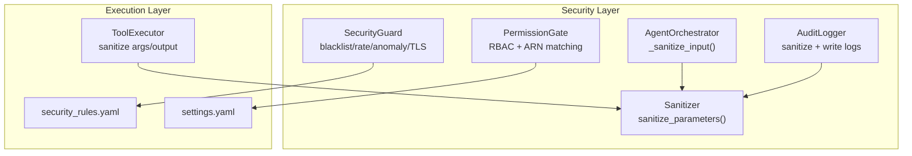
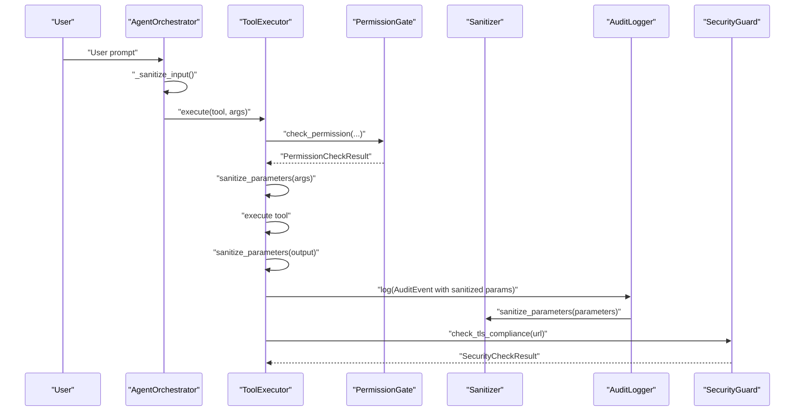
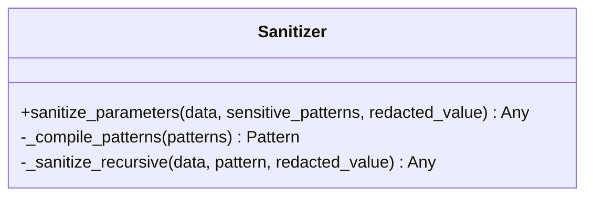
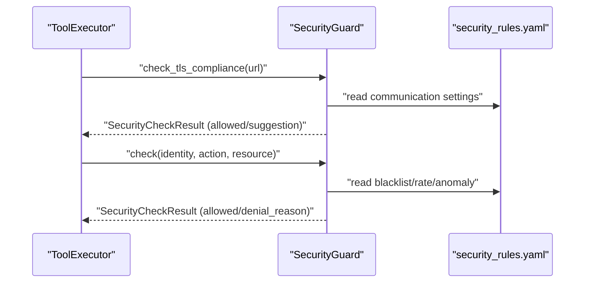
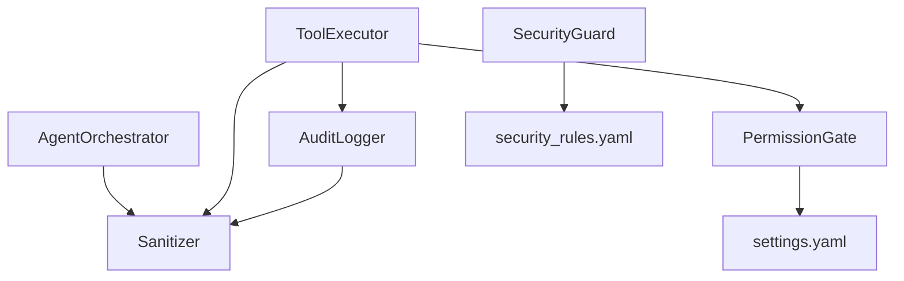

# Input Sanitization

<cite>
**Referenced Files in This Document**
- [sanitizer.py](file://src/aiops_agent/security/sanitizer.py)
- [security_guard.py](file://src/aiops_agent/security/security_guard.py)
- [permission_gate.py](file://src/aiops_agent/security/permission_gate.py)
- [audit_logger.py](file://src/aiops_agent/security/audit_logger.py)
- [executor.py](file://src/aiops_agent/tools/executor.py)
- [schemas.py](file://src/aiops_agent/models/schemas.py)
- [orchestrator.py](file://src/aiops_agent/core/orchestrator.py)
- [security_rules.yaml](file://config/security_rules.yaml)
- [settings.yaml](file://config/settings.yaml)
- [test_sanitizer.py](file://tests/test_sanitizer.py)
- [test_security_guard.py](file://tests/test_security_guard.py)
</cite>

## Table of Contents
1. [Introduction](#introduction)
2. [Project Structure](#project-structure)
3. [Core Components](#core-components)
4. [Architecture Overview](#architecture-overview)
5. [Detailed Component Analysis](#detailed-component-analysis)
6. [Dependency Analysis](#dependency-analysis)
7. [Performance Considerations](#performance-considerations)
8. [Troubleshooting Guide](#troubleshooting-guide)
9. [Conclusion](#conclusion)
10. [Appendices](#appendices)

## Introduction
This document explains the AIOps Agent’s input sanitization system designed to protect against injection attacks and malformed data. It covers:
- How user inputs are validated and sanitized to prevent prompt injection and command injection
- How tool parameters and configuration values are sanitized to prevent sensitive data leakage
- Real-time security checks performed by the Security Guard to block high-risk actions, enforce rate limits, and detect anomalies
- Integration points across the system, including permission gating, auditing, and TLS enforcement
- Guidance for extending sanitization logic and maintaining security updates

## Project Structure
The sanitization system spans several modules:
- Security sanitization for sensitive data in parameters and logs
- Real-time security guard for blacklisting, rate limiting, anomaly detection, and TLS enforcement
- Permission gate for RBAC and resource-level ARN matching
- Audit logger that applies sanitization to logged events
- Tool executor that sanitizes inputs and outputs during tool execution
- Orchestrator that sanitizes user-facing inputs
- Configuration files that define security rules and communication policies

**Diagram sources**
- [sanitizer.py:39-80](file://src/aiops_agent/security/sanitizer.py#L39-L80)
- [security_guard.py:25-292](file://src/aiops_agent/security/security_guard.py#L25-L292)
- [permission_gate.py:57-319](file://src/aiops_agent/security/permission_gate.py#L57-L319)
- [audit_logger.py:24-253](file://src/aiops_agent/security/audit_logger.py#L24-L253)
- [executor.py:45-314](file://src/aiops_agent/tools/executor.py#L45-L314)
- [orchestrator.py:601-646](file://src/aiops_agent/core/orchestrator.py#L601-L646)
- [security_rules.yaml:1-70](file://config/security_rules.yaml#L1-L70)
- [settings.yaml:1-85](file://config/settings.yaml#L1-L85)

**Section sources**
- [sanitizer.py:1-80](file://src/aiops_agent/security/sanitizer.py#L1-L80)
- [security_guard.py:1-292](file://src/aiops_agent/security/security_guard.py#L1-L292)
- [permission_gate.py:1-319](file://src/aiops_agent/security/permission_gate.py#L1-L319)
- [audit_logger.py:1-253](file://src/aiops_agent/security/audit_logger.py#L1-L253)
- [executor.py:1-314](file://src/aiops_agent/tools/executor.py#L1-L314)
- [orchestrator.py:601-646](file://src/aiops_agent/core/orchestrator.py#L601-L646)
- [security_rules.yaml:1-70](file://config/security_rules.yaml#L1-L70)
- [settings.yaml:1-85](file://config/settings.yaml#L1-L85)

## Core Components
- Sanitizer: Recursively redacts sensitive fields in dictionaries and lists based on configurable patterns. It does not modify the original data and supports custom redacted values and patterns.
- Security Guard: Enforces blacklist rules, enforces rate limits, detects operational anomalies, and validates TLS/HTTPS compliance.
- Permission Gate: Implements RBAC with permission classification and resource ARN pattern matching, supporting on-behalf-of permission intersection.
- Audit Logger: Writes structured audit events and applies sanitization to parameters before logging.
- Tool Executor: Sanitizes tool arguments and outputs, records sanitized parameters in audit events, and integrates with permission and credential flows.
- Orchestrator: Applies input sanitization to user prompts to mitigate prompt injection and command injection risks.

**Section sources**
- [sanitizer.py:39-80](file://src/aiops_agent/security/sanitizer.py#L39-L80)
- [security_guard.py:64-123](file://src/aiops_agent/security/security_guard.py#L64-L123)
- [permission_gate.py:95-182](file://src/aiops_agent/security/permission_gate.py#L95-L182)
- [audit_logger.py:65-104](file://src/aiops_agent/security/audit_logger.py#L65-L104)
- [executor.py:80-226](file://src/aiops_agent/tools/executor.py#L80-L226)
- [orchestrator.py:601-646](file://src/aiops_agent/core/orchestrator.py#L601-L646)

## Architecture Overview
The sanitization pipeline integrates at multiple layers:
- User input sanitization in the orchestrator
- Parameter sanitization in tool execution and audit logging
- Sensitive field redaction via the sanitizer
- Real-time security checks via the Security Guard
- Permission enforcement via the Permission Gate

**Diagram sources**
- [orchestrator.py:601-646](file://src/aiops_agent/core/orchestrator.py#L601-L646)
- [executor.py:80-226](file://src/aiops_agent/tools/executor.py#L80-L226)
- [permission_gate.py:95-182](file://src/aiops_agent/security/permission_gate.py#L95-L182)
- [audit_logger.py:65-104](file://src/aiops_agent/security/audit_logger.py#L65-L104)
- [sanitizer.py:39-80](file://src/aiops_agent/security/sanitizer.py#L39-L80)
- [security_guard.py:124-143](file://src/aiops_agent/security/security_guard.py#L124-L143)

## Detailed Component Analysis

### Sanitizer: Recursive Sensitive Field Redaction
Purpose:
- Recursively redacts sensitive fields in nested dictionaries and lists based on pattern matching.
- Does not mutate the original data; returns a sanitized copy.
- Supports custom sensitive patterns and redacted value replacement.

Key behaviors:
- Pattern compilation combines multiple sensitive key patterns into a single case-insensitive regular expression.
- Traverses dictionaries and lists recursively; leaves basic types unchanged.
- Only string keys are evaluated for pattern matches; non-string keys pass through.

Validation and encoding mechanisms:
- Uses regular expressions with case-insensitive matching for flexible pattern detection.
- No character encoding is applied; redaction replaces matched values with a placeholder.

Threat mitigation:
- Prevents accidental exposure of credentials, tokens, and secrets in logs and tool outputs.
- Works across deeply nested structures commonly found in configuration and API responses.

Examples of sanitized input formats:
- Input: {"password": "...", "user": "alice"} → Output: {"password": "***REDACTED***", "user": "alice"}
- Nested: {"db": {"password": "..."}, "host": "localhost"} → Output: {"db": {"password": "***REDACTED***"}, "host": "localhost"}

Validation failure handling:
- Original data remains unmodified; failures in downstream systems do not affect the sanitizer’s behavior.
- Empty or invalid patterns are handled gracefully; empty pattern list results in broad matching.

Extensibility:
- Extend sensitive patterns via configuration or pass custom patterns to the sanitizer.
- Customize the redacted value to align with organizational standards.

**Section sources**
- [sanitizer.py:39-80](file://src/aiops_agent/security/sanitizer.py#L39-L80)
- [test_sanitizer.py:19-367](file://tests/test_sanitizer.py#L19-L367)

#### Class Diagram: Sanitizer Internals

**Diagram sources**
- [sanitizer.py:32-80](file://src/aiops_agent/security/sanitizer.py#L32-L80)

### Security Guard: Real-Time Input Validation and Threat Mitigation
Purpose:
- Enforces high-risk operation blacklists
- Enforces API call rate limits (per minute/hour)
- Detects anomalous operation sequences
- Enforces HTTPS/TLS 1.2+ for outbound communications

Core checks:
- Blacklist: Blocks specific actions configured in security rules.
- Rate limit: Tracks recent calls per identity and action; blocks when thresholds exceeded.
- Anomaly detection: Flags unusual bursts of diverse operations.
- TLS compliance: Ensures URLs use HTTPS and meet minimum TLS version.

Configuration:
- Loaded from security_rules.yaml
- Supports per-skill overrides for rate limits

Integration:
- Used by ToolExecutor for TLS checks prior to outbound calls
- Used by Orchestrator for higher-level security decisions (when applicable)

**Section sources**
- [security_guard.py:64-123](file://src/aiops_agent/security/security_guard.py#L64-L123)
- [security_guard.py:149-253](file://src/aiops_agent/security/security_guard.py#L149-L253)
- [security_guard.py:259-292](file://src/aiops_agent/security/security_guard.py#L259-L292)
- [test_security_guard.py:19-178](file://tests/test_security_guard.py#L19-L178)
- [security_rules.yaml:21-70](file://config/security_rules.yaml#L21-L70)

#### Sequence Diagram: Security Guard Checks

**Diagram sources**
- [security_guard.py:124-143](file://src/aiops_agent/security/security_guard.py#L124-L143)
- [security_guard.py:64-123](file://src/aiops_agent/security/security_guard.py#L64-L123)
- [security_rules.yaml:21-70](file://config/security_rules.yaml#L21-L70)

### Permission Gate: RBAC and Resource-Level Controls
Purpose:
- Classifies actions into permission levels (read-only, limited-write, admin)
- Matches actions/resources against loaded RAM policies
- Supports on-behalf-of permission intersection
- Requests manual approval for restricted operations

Key features:
- Action-to-permission classification heuristics
- Wildcard matching for actions and ARNs
- Effective permission computation combining agent and user permissions

**Section sources**
- [permission_gate.py:95-182](file://src/aiops_agent/security/permission_gate.py#L95-L182)
- [permission_gate.py:225-296](file://src/aiops_agent/security/permission_gate.py#L225-L296)

### Audit Logger: Structured Logging with Sanitization
Purpose:
- Writes audit events to ActionTrail and local logs
- Sanitizes sensitive parameters before logging
- Provides backup logging and alerting on write failures

Integration:
- Calls sanitize_parameters on event.parameters
- Records sanitized arguments in AuditEvent

**Section sources**
- [audit_logger.py:65-104](file://src/aiops_agent/security/audit_logger.py#L65-L104)
- [audit_logger.py:216-221](file://src/aiops_agent/security/audit_logger.py#L216-L221)
- [schemas.py:169-184](file://src/aiops_agent/models/schemas.py#L169-L184)

### Tool Executor: End-to-End Sanitization During Execution
Purpose:
- Centralized tool execution with integrated security and observability
- Applies sanitization to arguments and outputs
- Logs sanitized parameters in audit events

Key steps:
- Permission validation
- Credential acquisition (optional)
- Tool dispatch and execution
- Output sanitization
- Audit logging with sanitized parameters

**Section sources**
- [executor.py:80-226](file://src/aiops_agent/tools/executor.py#L80-L226)

### Orchestrator: User Input Sanitization
Purpose:
- Validates and sanitizes user prompts to mitigate prompt injection and command injection
- Applies length limits and trims whitespace
- Logs warnings for suspicious patterns without rejecting input

Common attack vectors mitigated:
- Prompt injection attempts (e.g., instructing the model to ignore previous instructions)
- Command injection attempts (e.g., shell metacharacters)

**Section sources**
- [orchestrator.py:601-646](file://src/aiops_agent/core/orchestrator.py#L601-L646)

## Dependency Analysis
The sanitization system exhibits layered dependencies:
- Sanitizer is used by ToolExecutor, AuditLogger, and Orchestrator
- Security Guard depends on security_rules.yaml for configuration
- Permission Gate depends on settings.yaml and RAM policy files
- ToolExecutor integrates PermissionGate, CredentialManager, and AuditLogger

**Diagram sources**
- [sanitizer.py:39-80](file://src/aiops_agent/security/sanitizer.py#L39-L80)
- [executor.py:80-226](file://src/aiops_agent/tools/executor.py#L80-L226)
- [audit_logger.py:65-104](file://src/aiops_agent/security/audit_logger.py#L65-L104)
- [orchestrator.py:601-646](file://src/aiops_agent/core/orchestrator.py#L601-L646)
- [security_guard.py:259-292](file://src/aiops_agent/security/security_guard.py#L259-L292)
- [permission_gate.py:302-319](file://src/aiops_agent/security/permission_gate.py#L302-L319)
- [security_rules.yaml:1-70](file://config/security_rules.yaml#L1-L70)
- [settings.yaml:1-85](file://config/settings.yaml#L1-L85)

**Section sources**
- [sanitizer.py:39-80](file://src/aiops_agent/security/sanitizer.py#L39-L80)
- [executor.py:80-226](file://src/aiops_agent/tools/executor.py#L80-L226)
- [audit_logger.py:65-104](file://src/aiops_agent/security/audit_logger.py#L65-L104)
- [orchestrator.py:601-646](file://src/aiops_agent/core/orchestrator.py#L601-L646)
- [security_guard.py:259-292](file://src/aiops_agent/security/security_guard.py#L259-L292)
- [permission_gate.py:302-319](file://src/aiops_agent/security/permission_gate.py#L302-L319)
- [security_rules.yaml:1-70](file://config/security_rules.yaml#L1-L70)
- [settings.yaml:1-85](file://config/settings.yaml#L1-L85)

## Performance Considerations
- Sanitizer recursion depth: For very deeply nested structures, consider flattening or limiting nesting in upstream data producers.
- Regex compilation cost: Patterns are compiled once per invocation; caching compiled patterns can reduce overhead if invoked frequently with identical patterns.
- Rate-limiting and anomaly detection: Deque-based histories scale linearly with recent call counts; tune window sizes and thresholds to balance sensitivity and memory usage.
- TLS checks: Minimal overhead; ensure network timeouts are configured appropriately to avoid blocking long-running operations.

## Troubleshooting Guide
Common issues and resolutions:
- Sensitive data still visible in logs:
  - Verify that sanitize_parameters is applied to all parameters before logging.
  - Confirm that security_rules.yaml includes desired sensitive patterns.
- Overly broad redaction:
  - Narrow sensitive patterns to specific keys or use custom patterns per context.
- TLS failures:
  - Ensure outbound URLs use HTTPS and meet minimum TLS version requirements.
- Excessive rate-limit denials:
  - Adjust rate_limits in security_rules.yaml for the affected skill or action.
- Anomaly warnings:
  - Investigate bursty operation patterns; adjust thresholds or investigate potential abuse.

Validation references:
- Unit tests demonstrate expected redaction behavior, immutability, and custom pattern handling.
- Security guard tests validate blacklist, rate limit, anomaly detection, and TLS enforcement.

**Section sources**
- [test_sanitizer.py:19-367](file://tests/test_sanitizer.py#L19-L367)
- [test_security_guard.py:19-178](file://tests/test_security_guard.py#L19-L178)

## Conclusion
The AIOps Agent employs a layered input sanitization strategy:
- Orchestrator sanitizes user prompts to mitigate prompt/command injection
- Sanitizer redacts sensitive fields across parameters and outputs
- Security Guard enforces blacklists, rate limits, anomaly detection, and TLS compliance
- Permission Gate ensures least-privilege access and resource-level controls
- Audit Logger and Tool Executor apply consistent sanitization and logging practices

This design provides robust protection against common attack vectors while maintaining flexibility for customization and extension.

## Appendices

### Example Sanitized Formats
- User prompt: "Check ECS status" (after trimming and validation)
- Tool arguments: {"password": "***REDACTED***", "user": "alice"}
- Tool output: {"status": "OK", "token": "***REDACTED***"}
- Audit parameters: {"connection_string": "***REDACTED***"}

### Extending Sanitization Logic
- Add or customize sensitive patterns in security_rules.yaml under sensitive_field_patterns
- Pass custom patterns to sanitize_parameters for specialized contexts
- Introduce domain-specific redaction rules by adding new keys to the sensitive patterns list

### Maintaining Security Updates
- Review and update security_rules.yaml regularly to reflect new high-risk actions and sensitive key names
- Monitor Security Guard alerts and adjust thresholds or patterns as needed
- Keep TLS minimum versions aligned with organizational security policies

**Section sources**
- [security_rules.yaml:3-18](file://config/security_rules.yaml#L3-L18)
- [sanitizer.py:39-58](file://src/aiops_agent/security/sanitizer.py#L39-L58)
- [security_guard.py:259-292](file://src/aiops_agent/security/security_guard.py#L259-L292)